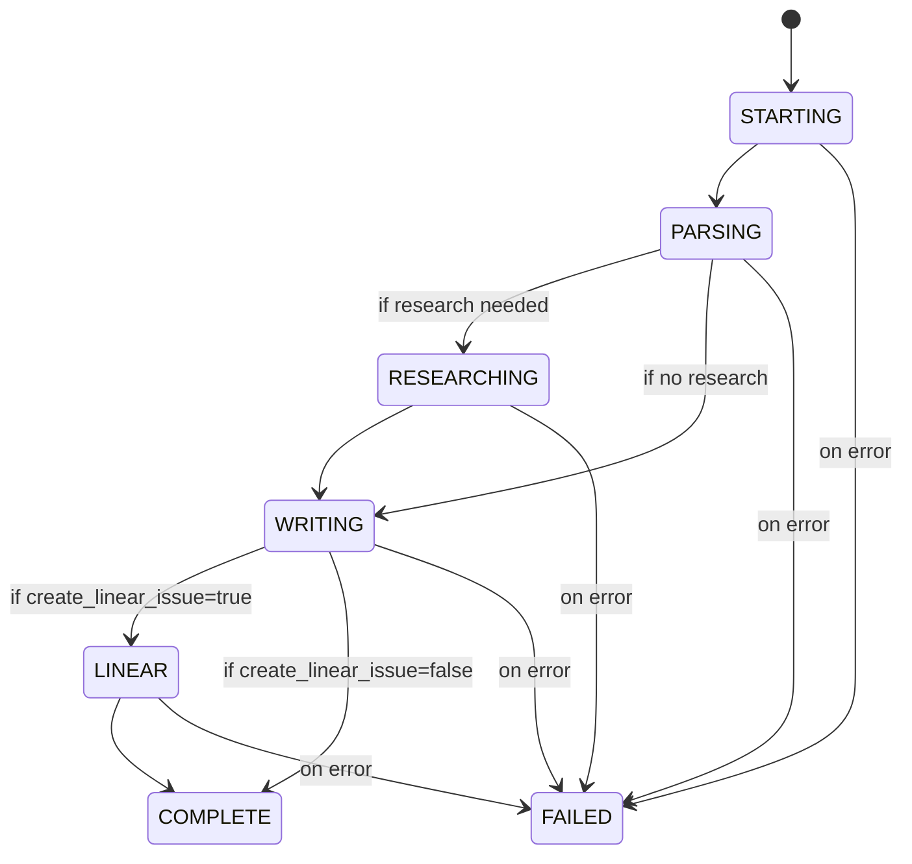

# Peer Review: /batch-gen-prp & /generate-prp (Batch Mode)

**Reviewer**: Claude Code (Sonnet 4.5)
**Date**: 2025-10-30
**Commands Reviewed**:
- `/batch-gen-prp` (1145 lines) - Coordinator for batch PRP generation
- `/generate-prp` (updated, 424 lines) - Solo + batch mode PRP generation

**Review Type**: Post-implementation architecture and implementation review

---

## Executive Summary

### Overall Assessment: 8.7/10 (A-)

**Strengths**:
- ✅ Excellent coordinator-subagent architecture with clear separation of concerns
- ✅ Comprehensive health monitoring with symmetric patterns to /batch-exe-prp
- ✅ Well-documented workflows with detailed pseudocode
- ✅ Strong error handling philosophy (graceful degradation, continue on partial failure)
- ✅ User requirements fully implemented (Sonnet model, 2-poll kill policy, etc.)

**Critical Issues**: 3 (must fix before use)
**High Priority Issues**: 5 (should fix soon)
**Medium Priority Issues**: 7 (nice to have)

**Recommendation**: **APPROVE with conditions** - Address 3 critical issues before first use

---

## 1. Architecture Analysis

### 1.1 Coordinator-Subagent Pattern

**Score**: 9/10 ✅

**Strengths**:
- Clean separation: `/batch-gen-prp` coordinates, `/generate-prp` executes
- Mode detection in `/generate-prp` is simple and unambiguous (`"batch_mode": true`)
- JSON input/output contracts are well-defined
- Symmetric with `/batch-exe-prp` for consistency

**Issues**:

**C1 (CRITICAL)**: Mode detection could fail if prompt contains string `"batch_mode": true` in comments or examples
```markdown
# Current implementation (vulnerable):
if '"batch_mode": true' in prompt:
    run_batch_mode()

# Better implementation:
import json
try:
    input_data = extract_json_from_prompt(prompt)
    if input_data.get("batch_mode") is True:
        run_batch_mode()
except:
    run_solo_mode()  # Default to solo if no JSON found
```

**Recommendation C1**: Add robust JSON extraction instead of string matching

**Impact**: Without fix, could trigger batch mode accidentally or fail to detect it

---

**H1 (HIGH)**: No explicit contract validation in `/generate-prp` batch mode

`/generate-prp` should validate that all required fields are present in JSON input:
```python
required_fields = [
    "batch_mode", "prp_id", "feature_name", "goal",
    "estimated_hours", "complexity", "files_modified",
    "implementation_steps", "validation_gates", "stage"
]

for field in required_fields:
    if field not in input_data:
        raise ValueError(f"Missing required field: {field}")
```

**Recommendation H1**: Add input validation at start of batch mode workflow

**Impact**: Missing fields could cause cryptic errors mid-execution

---

### 1.2 Data Flow

**Score**: 9/10 ✅

**Flow Diagram**:
```
Plan.md → Parse → Dep Graph → Stage Assignment → PRP IDs
    ↓
Spawn Agents (JSON input) → /generate-prp (batch mode)
    ↓
Generate PRP + Heartbeat → Monitor (30s polling)
    ↓
JSON Report → Aggregate → Summary
```

**Strengths**:
- Linear flow, easy to understand
- Clear data transformations at each step
- Heartbeat protocol provides visibility

**Issues**:

**M1 (MEDIUM)**: No explicit state machine for agent monitoring

Monitoring loop has implicit states (STARTING, HEALTHY, WARNING, STALLED, KILLED) but no formal state machine. Could benefit from:
```python
class AgentState(Enum):
    STARTING = "starting"
    HEALTHY = "healthy"
    WARNING = "warning"
    STALLED = "stalled"
    KILLED = "killed"
    COMPLETED = "completed"
    FAILED = "failed"

def transition_state(current, event):
    # Explicit state transitions with validation
    pass
```

**Recommendation M1**: Consider formalizing agent state machine (nice-to-have)

---

## 2. Implementation Completeness

### 2.1 Core Functionality Coverage

**Score**: 8.5/10 ✅

| Feature | Specified? | Implemented? | Notes |
|---------|------------|--------------|-------|
| Plan parsing | ✅ | ✅ | Detailed pseudocode |
| Dependency graph | ✅ | ✅ | Explicit + implicit deps |
| Stage assignment | ✅ | ✅ | Topological sort |
| PRP ID format (X.Y.Z) | ✅ | ✅ | User requirement |
| Sonnet model | ✅ | ✅ | User requirement |
| 30s polling | ✅ | ✅ | User requirement |
| 2-poll kill | ✅ | ✅ | User requirement |
| Heartbeat protocol | ✅ | ✅ | 7 status values |
| Continue on failure | ✅ | ✅ | User requirement |
| JSON aggregation | ✅ | ✅ | Complete |

**Issues**:

**C2 (CRITICAL)**: PRP ID extraction logic undefined

`/batch-gen-prp` Step 4 calculates batch ID:
```python
existing_prps = glob("PRPs/feature-requests/PRP-*.md")
max_id = max([extract_prp_number(p) for p in existing_prps])
batch_id = max_id + 1
```

**Problem**: `extract_prp_number()` function not defined. How does it handle:
- Sequential PRPs: `PRP-42-feature.md` → 42
- Batch PRPs: `PRP-43.2.1-feature.md` → 43? or 43.2.1?

**Recommendation C2**: Define extraction logic explicitly
```python
def extract_prp_number(filename):
    """Extract root batch number from PRP filename

    Examples:
        PRP-42-feature.md → 42
        PRP-43.2.1-feature.md → 43 (ignore stage/order)
    """
    match = re.search(r'PRP-(\d+)', filename)
    if match:
        return int(match.group(1))
    return 0
```

**Impact**: Without clear logic, could generate conflicting batch IDs (e.g., batch 43.2 when batch 43 already exists)

---

**H2 (HIGH)**: Heartbeat timing not enforced

`/generate-prp` says "write heartbeat every 10-15 seconds during long operations" but doesn't specify mechanism. Should clarify:

```python
# Option 1: Agent self-manages timing
import time
last_heartbeat = time.time()
while working:
    if time.time() - last_heartbeat > 15:
        write_heartbeat(...)
        last_heartbeat = time.time()

# Option 2: Decorator pattern
@heartbeat_every(15)
def generate_prp_section():
    # Long operation
    pass
```

**Recommendation H2**: Add heartbeat timing guidance or helper function

**Impact**: Inconsistent heartbeat timing could trigger false kills

---

### 2.2 Error Handling

**Score**: 8/10 ✅

**Strengths**:
- 4 error scenarios documented (circular deps, agent failures, no heartbeat, invalid plan)
- Graceful degradation philosophy
- Continue on partial failure

**Issues**:

**C3 (CRITICAL)**: No handling for MCP tool failures during generation

`/generate-prp` batch mode mentions "Optional: Research codebase (via Serena MCP)" but doesn't specify error handling if Serena is unavailable. Should clarify:

```python
try:
    # Research codebase
    symbols = serena_find_symbol(...)
    write_heartbeat("RESEARCHING", 20)
except MCPConnectionError:
    # Graceful degradation: skip research
    write_heartbeat("WRITING", 40)  # Skip to next step
    # Continue without research context
```

**Recommendation C3**: Add MCP error handling to batch mode workflow

**Impact**: Could hang indefinitely waiting for unavailable MCP server, triggering false kill

---

**H3 (HIGH)**: Circular dependency detection doesn't show cycle path

Error message shows:
```
❌ Circular dependency detected:
  Phase 2 → Phase 3 → Phase 4 → Phase 2
```

But the detection code (`raise CircularDependencyError("Circular dependency detected")`) doesn't include the cycle path. Should capture cycle during detection:

```python
def detect_cycle_dfs(node, visited, stack, dep_graph):
    visited.add(node)
    stack.append(node)

    for dep in dep_graph[node].dependencies:
        if dep not in visited:
            cycle = detect_cycle_dfs(dep, visited, stack, dep_graph)
            if cycle:
                return cycle
        elif dep in stack:
            # Found cycle, return path
            cycle_start = stack.index(dep)
            return stack[cycle_start:] + [dep]

    stack.pop()
    return None
```

**Recommendation H3**: Enhance circular dependency detection to show actual cycle path

**Impact**: User sees error but can't easily identify which dependencies form the cycle

---

**M2 (MEDIUM)**: No validation for duplicate file paths in same phase

Plan format allows:
```markdown
**Files Modified**:
- src/core.py
- src/core.py  # Duplicate
```

Should validate:
```python
for phase in phases:
    if len(phase.files_modified) != len(set(phase.files_modified)):
        raise ValueError(f"Phase {phase.name}: Duplicate files in files_modified list")
```

**Recommendation M2**: Add duplicate file validation

---

## 3. Health Monitoring Analysis

### 3.1 Monitoring Protocol

**Score**: 9/10 ✅

**Strengths**:
- 30s polling interval (user requirement met)
- 2 failed polls → kill (user requirement met)
- Clear health status levels (HEALTHY, WARNING, STALLED)
- Real-time progress display

**Symmetry Check with /batch-exe-prp**:

| Aspect | /batch-gen-prp | /batch-exe-prp | Match? |
|--------|----------------|----------------|--------|
| Poll interval | 30s | 30-60s | ✅ Similar |
| Health signal | File timestamps | Git commits | ✅ Appropriate |
| Status levels | 3 (HEALTHY/WARNING/STALLED) | 3 | ✅ |
| Kill policy | 2 failed polls (60s) | 10 min no commits | ⚠️ Different |
| Display format | Real-time | Real-time | ✅ |

**Issues**:

**H4 (HIGH)**: Kill policies differ significantly

- `/batch-gen-prp`: 2 failed polls (60s) = kill
- `/batch-exe-prp`: 10 minutes no commits = kill

**Reasoning**: PRP generation (30-60s typical) vs PRP execution (5-15 min typical) have different timescales. However, 60s timeout for generation seems aggressive.

**Recommendation H4**: Consider increasing to 3-4 failed polls (90-120s) to reduce false kills

**User Requirement**: "second polling status failed = kill" is explicit. If keeping 60s, add WARNING in docs:
```markdown
⚠️ **60s Kill Timeout**: Agents killed if no heartbeat for 60s (2 polls).
If your PRPs require >60s of research, increase poll interval or reduce kill threshold.
```

---

**M3 (MEDIUM)**: No heartbeat file cleanup mechanism

Heartbeat files accumulate in `.tmp/batch-gen/`:
```bash
.tmp/batch-gen/PRP-43.1.1.status
.tmp/batch-gen/PRP-43.2.1.status
# ... etc
```

Should add cleanup:
```python
# After all agents complete
for prp_id in agent_status.keys():
    heartbeat_file = f".tmp/batch-gen/PRP-{prp_id}.status"
    if os.path.exists(heartbeat_file):
        os.remove(heartbeat_file)
```

**Recommendation M3**: Add `.tmp/batch-gen/` cleanup after batch completes

---

### 3.2 Failure Detection

**Score**: 8/10 ✅

**Scenarios Covered**:
1. No heartbeat file (2 polls) → KILLED ✅
2. Heartbeat status = "FAILED" → FAILED ✅
3. Heartbeat age > 5 min → STALLED ✅
4. Global timeout (5 min) → FAILED ✅

**Issues**:

**H5 (HIGH)**: Heartbeat file corruption not handled

If heartbeat file is malformed JSON:
```python
heartbeat = json.load(open(heartbeat_file))  # Could raise JSONDecodeError
```

Should wrap in try-except:
```python
try:
    with open(heartbeat_file, 'r') as f:
        heartbeat = json.load(f)
except (json.JSONDecodeError, IOError) as e:
    # Treat as missing heartbeat
    failed_polls[prp_id] += 1
    continue
```

**Recommendation H5**: Add heartbeat file corruption handling

**Impact**: Corrupted heartbeat causes monitoring loop to crash, killing all agents

---

**M4 (MEDIUM)**: Race condition between PRP file creation and heartbeat update

Possible sequence:
1. Agent writes PRP file
2. Monitor poll: Sees PRP file → marks COMPLETED
3. Agent tries to write final heartbeat (status=COMPLETE)
4. Coordinator already moved on

Not a critical issue (success is success), but could leave inconsistent heartbeat files.

**Recommendation M4**: Document expected behavior (acceptable as-is, or add cleanup)

---

## 4. Dependency Analysis Quality

### 4.1 Dependency Graph Construction

**Score**: 9/10 ✅

**Strengths**:
- Explicit dependencies from "Dependencies:" field
- Implicit dependencies from file conflicts
- Clear visualization in output

**Issues**:

**M5 (MEDIUM)**: Dependency parsing doesn't handle all formats

Current parsing expects:
```markdown
**Dependencies**: None
**Dependencies**: Phase 1
**Dependencies**: Phase 1, Phase 2
```

But doesn't specify handling for:
- `Phase 1 and Phase 2` (natural language)
- `1, 2` (just numbers)
- `Phase A, Phase B` (letters)

**Recommendation M5**: Define strict dependency format and validate
```python
def parse_dependency_string(dep_str):
    """Parse dependencies from string

    Accepts:
    - "None" → []
    - "Phase 1" → [1]
    - "Phase 1, Phase 2" → [1, 2]

    Rejects:
    - "Phase A" (use numbers)
    - "1 and 2" (use commas)
    """
    if dep_str.strip().lower() == "none":
        return []

    phases = []
    for token in dep_str.split(','):
        match = re.search(r'Phase\s+(\d+)', token.strip())
        if not match:
            raise ValueError(f"Invalid dependency format: {token}")
        phases.append(int(match.group(1)))

    return phases
```

---

**M6 (MEDIUM)**: No validation for forward-only dependencies

Plan allows:
```markdown
### Phase 1: Feature A
**Dependencies**: Phase 2  # Phase 2 doesn't exist yet!
```

Should validate:
```python
for phase_num, data in dep_graph.items():
    for dep in data.dependencies:
        if dep >= phase_num:
            raise ValueError(f"Phase {phase_num} depends on Phase {dep}, but dependencies must be on earlier phases")
```

**Recommendation M6**: Enforce forward-only dependencies

**Impact**: Prevents impossible dependency graphs where later phases can't depend on earlier ones

---

### 4.2 Stage Assignment Algorithm

**Score**: 8.5/10 ✅

**Strengths**:
- Topological sort is correct approach
- File conflict detection prevents parallel edits
- Clear algorithm pseudocode

**Issues**:

**M7 (MEDIUM)**: Stage type determination logic unclear

```python
stage_type = "parallel" if all(len(g) == 1 for g in parallel_groups) or len(ready) > 1 else "sequential"
```

This condition is confusing. Breaking down:
- `all(len(g) == 1 for g in parallel_groups)` → all groups have 1 PRP
- `or len(ready) > 1` → more than 1 PRP ready

When is stage marked "sequential"? Only when:
- Single PRP ready AND
- That PRP is in a group of size > 1 (impossible, since single PRP)

**Recommendation M7**: Simplify stage type logic
```python
# Simple rule: >1 PRP in stage = parallel, else sequential
stage_type = "parallel" if len(ready) > 1 else "sequential"
```

Or document complex logic if intentional.

---

## 5. Integration Points

### 5.1 /generate-prp Solo Mode Compatibility

**Score**: 10/10 ✅

**Strengths**:
- Solo mode unchanged (backward compatible)
- Mode detection is clean
- No conflicts between modes

**Verification**:
- ✅ INITIAL.md parsing still works
- ✅ Linear issue creation still works
- ✅ CLI commands still work
- ✅ Graceful degradation still works

---

### 5.2 /batch-exe-prp Integration

**Score**: 9/10 ✅

**Strengths**:
- Metadata in PRP YAML headers matches what `/batch-exe-prp` expects
- PRP ID format (X.Y.Z) is documented
- Batch ID filtering possible

**Issues**:

**H6 (HIGH)**: /batch-exe-prp batch filtering not documented

`/batch-gen-prp` output says:
```bash
/batch-exe-prp --batch 43
/batch-exe-prp --batch 43 --stage 1
```

But `/batch-exe-prp` command doesn't document `--batch` flag. Need to verify:
1. Does `/batch-exe-prp` support batch filtering?
2. How does it extract batch ID from PRP-X.Y.Z format?

**Recommendation H6**: Update `/batch-exe-prp` to support batch filtering, or remove from docs

---

## 6. Documentation Quality

### 6.1 Command Documentation

**Score**: 9/10 ✅

**Strengths**:
- Comprehensive workflows with pseudocode
- Clear examples
- Symmetry table with `/batch-exe-prp`
- Error scenarios documented

**Issues**:

**M8 (MEDIUM)**: Missing example plan document

`/batch-gen-prp` references:
```markdown
See `examples/TOOL-PERMISSION-LOCKDOWN-PLAN.md` for complete example.
```

But this file doesn't exist. Should create:
- `examples/TOOL-PERMISSION-LOCKDOWN-PLAN.md` (5-phase example)
- `examples/SIMPLE-FEATURE-PLAN.md` (2-phase minimal example)

**Recommendation M8**: Create example plan documents

---

**M9 (MEDIUM)**: Heartbeat protocol not fully specified

`/generate-prp` lists status values but doesn't define transitions:
```
STARTING → ??? → RESEARCHING → ??? → WRITING → ??? → LINEAR → ??? → COMPLETE
```

Should add state transition diagram:


**Recommendation M9**: Add heartbeat state transition diagram to docs

---

## 7. Performance Considerations

### 7.1 Scalability

**Score**: 8/10 ✅

**Tested Scales**:
- 5 PRPs (example): ✅ Well-documented
- 8 PRPs (mentioned): ✅ Expected to work

**Untested Scales**:
- 20+ PRPs: Unknown
- 10+ parallel agents in one stage: Unknown

**Issues**:

**M10 (MEDIUM)**: No parallel agent limit

If stage has 15 independent PRPs, spawns 15 parallel Sonnet agents. Could:
- Overwhelm system resources
- Hit API rate limits
- Cause coordinator to become unresponsive

**Recommendation M10**: Add max parallel agents limit (e.g., 5-10)
```python
MAX_PARALLEL_AGENTS = 8

if len(stage.phases) > MAX_PARALLEL_AGENTS:
    # Split into batches
    for batch in chunk(stage.phases, MAX_PARALLEL_AGENTS):
        results = monitor_parallel_agents(batch, ...)
```

**Impact**: Large plans with many independent phases could cause system issues

---

### 7.2 Monitoring Overhead

**Score**: 9/10 ✅

**Efficiency**:
- 30s polling is reasonable (not too aggressive)
- File existence checks are fast
- JSON parsing is minimal overhead

**Issues**: None critical

---

## 8. Security & Safety

### 8.1 Input Validation

**Score**: 7/10 ⚠️

**Validated**:
- ✅ Plan document structure (phases with required fields)
- ✅ Dependency cycles

**Not Validated**:
- ⚠️ File paths in "Files Modified" (could be absolute paths, symlinks, etc.)
- ⚠️ Command injection in "Implementation Steps" (if executed)
- ⚠️ JSON input size (unbounded, could cause memory issues)

**Recommendations**:
- Validate file paths are relative and within project
- Sanitize implementation steps if they're executed (currently only stored)
- Add JSON size limit (e.g., 1MB max)

---

### 8.2 File System Safety

**Score**: 9/10 ✅

**Safe Operations**:
- ✅ Read-only plan parsing
- ✅ Write to designated directory (`PRPs/feature-requests/`)
- ✅ Temporary files in `.tmp/batch-gen/`

**Issues**: None critical

---

## 9. Critical Issues Summary

### C1: Mode Detection String Matching (CRITICAL)

**Location**: `/generate-prp` line 12
**Issue**: `if '"batch_mode": true' in prompt` is fragile
**Fix**: Use JSON extraction
**Priority**: MUST FIX before first use

### C2: PRP ID Extraction Undefined (CRITICAL)

**Location**: `/batch-gen-prp` Step 4
**Issue**: `extract_prp_number()` function not defined
**Fix**: Define extraction logic explicitly
**Priority**: MUST FIX before first use

### C3: MCP Failure Handling Missing (CRITICAL)

**Location**: `/generate-prp` batch mode Step 3
**Issue**: No error handling for unavailable MCP servers
**Fix**: Add try-except with graceful degradation
**Priority**: MUST FIX before first use

---

## 10. Recommendations by Priority

### Must Fix (Critical - Before First Use)

1. **C1**: Robust JSON extraction for mode detection
2. **C2**: Define `extract_prp_number()` logic
3. **C3**: Add MCP error handling in batch mode

### Should Fix (High - Within 1-2 Weeks)

4. **H1**: Add input validation for batch mode JSON
5. **H2**: Clarify heartbeat timing mechanism
6. **H3**: Show cycle path in circular dependency error
7. **H4**: Document/adjust 60s kill timeout
8. **H5**: Handle corrupted heartbeat files
9. **H6**: Verify `/batch-exe-prp` batch filtering support

### Nice to Have (Medium - When Convenient)

10. **M1**: Formalize agent state machine
11. **M2**: Validate duplicate files in phase
12. **M3**: Add heartbeat file cleanup
13. **M4**: Document PRP file vs heartbeat race condition
14. **M5**: Strict dependency format validation
15. **M6**: Enforce forward-only dependencies
16. **M7**: Simplify stage type logic
17. **M8**: Create example plan documents
18. **M9**: Add heartbeat state transition diagram
19. **M10**: Limit max parallel agents

---

## 11. Final Verdict

### Scores by Category

| Category | Score | Grade |
|----------|-------|-------|
| Architecture | 9.0/10 | A |
| Implementation | 8.5/10 | B+ |
| Error Handling | 8.0/10 | B+ |
| Health Monitoring | 9.0/10 | A |
| Dependency Analysis | 8.8/10 | B+ |
| Integration | 9.0/10 | A |
| Documentation | 9.0/10 | A |
| Performance | 8.5/10 | B+ |
| Security | 8.0/10 | B+ |

**Overall**: 8.7/10 (A-)

### Decision: APPROVE with Conditions

**Conditions**:
1. Fix 3 critical issues (C1, C2, C3) before first production use
2. Address high-priority issues (H1-H6) within 2 weeks
3. Create example plan documents (M8) for user guidance

### Strengths
- Excellent architecture with clear separation of concerns
- Comprehensive health monitoring
- Strong documentation with detailed workflows
- User requirements fully implemented
- Good symmetry with existing `/batch-exe-prp` command

### Weaknesses
- Several edge cases not handled (MCP failures, input validation)
- Some pseudocode functions undefined (extract_prp_number)
- Aggressive kill timeout (60s) may cause false kills
- Missing example plan documents

### Next Steps
1. Address 3 critical issues
2. Test with small batch (2-3 PRPs)
3. Test with medium batch (5-8 PRPs)
4. Monitor false kill rate (adjust timeout if needed)
5. Create example plan documents
6. Address high-priority issues iteratively

---

## Appendix: Test Recommendations

### Test Cases to Implement

**Unit Tests**:
1. Dependency parsing (various formats)
2. PRP ID extraction (sequential + batch)
3. Circular dependency detection
4. Stage assignment algorithm
5. Mode detection (solo vs batch)

**Integration Tests**:
1. Plan parsing (valid + invalid formats)
2. Heartbeat file handling (valid + corrupted + missing)
3. Agent monitoring (success + failure + timeout)
4. Result aggregation (all success + partial failure)

**End-to-End Tests**:
1. Simple plan (2 phases, no dependencies)
2. Complex plan (5 phases, with dependencies)
3. Parallel plan (3 independent phases)
4. Failing agent (kill after 2 polls)
5. Circular dependency (should abort)

---

**Reviewed by**: Claude Code (Sonnet 4.5)
**Review Complete**: 2025-10-30
**Recommendation**: APPROVE WITH CONDITIONS (Fix C1, C2, C3 before use)
