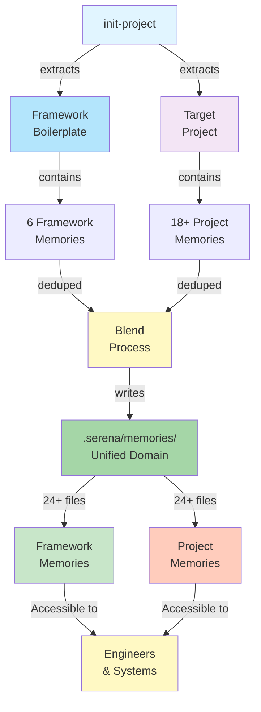

# .SERENA Domain Architecture (CE 1.1)

**Purpose**: Document the unified memories domain architecture used in Context Engineering framework

**Status**: Core architecture (stable)
**Last Updated**: 2025-11-10
**Related**: Iteration 2-3 testing, PRP-48 findings

---

## Executive Summary

The `.serena/memories/` domain is the **canonical location** for all project memories in CE 1.1. Framework memories are **imported and blended** with project-specific memories, creating a unified domain where both framework standards and project knowledge are accessible together.

```
.serena/memories/                    ← CANONICAL LOCATION (unified domain)
├── Framework Memories (6 files)
│   ├── code-style-conventions.md
│   ├── task-completion-checklist.md
│   ├── testing-standards.md
│   ├── suggested-commands.md
│   ├── tool-usage-syntropy.md
│   └── use-syntropy-tools-not-bash.md
│
└── Project-Specific Memories (18+ files)
    ├── codebase-structure.md
    ├── project-overview.md
    ├── cwe78-prp22-newline-escape-issue.md
    └── ... (project-specific knowledge)
```

**Key Design Principle**: **Unified domain, not separated structure**

---

## Architecture Overview

### Three-Part Memory Structure (CE 1.1)

```
target-project/
│
├── .ce/                            ← Framework boilerplate
│   ├── examples/                   (framework example files)
│   ├── PRPs/                       (framework PRP templates)
│   ├── tools/                      (framework tooling)
│   ├── memories/                   ❌ NOT USED IN CE 1.1
│   └── ... (boilerplate)
│
└── .serena/                        ← Project domain (CANONICAL)
    ├── memories/                   ✅ UNIFIED DOMAIN
    │   ├── code-style-conventions.md (framework - imported)
    │   ├── task-completion-checklist.md (framework - imported)
    │   ├── testing-standards.md (framework - imported)
    │   ├── ... (more framework memories)
    │   ├── codebase-structure.md (project - native)
    │   ├── project-overview.md (project - native)
    │   └── ... (more project memories)
    │
    └── project.yml                 (project configuration)
```

---

## Memory Import & Blend Process

### Phase 1: Extraction

**Framework memories** extracted from boilerplate package:
- `code-style-conventions.md` - Code style standards
- `task-completion-checklist.md` - Task completion workflow
- `testing-standards.md` - Testing requirements
- `suggested-commands.md` - Recommended CLI commands
- `tool-usage-syntropy.md` - Syntropy tool guidance
- `use-syntropy-tools-not-bash.md` - Tool preference rules

**Project memories** extracted from target project:
- Existing `.serena/memories/` files (if any)
- Project-specific domain knowledge
- Issue patterns and solutions
- Architecture decisions
- Integration patterns

### Phase 2: Deduplication

Files with same name are checked:
- **If identical**: Preserve one copy (framework takes precedence)
- **If different**: Framework wins (project can override by modification post-init)
- **If unique**: Preserve all files

Result: Single set of 24+ memory files with no duplicates

### Phase 3: Blend & Write

All deduplicated memories written to **`.serena/memories/` (root level)**:

```
Project Structure After init-project:
certinia-test-target/
├── .ce/                          ← Framework boilerplate only
│   ├── examples/                 (14 example files)
│   ├── PRPs/                     (1 framework PRP)
│   ├── tools/                    (tooling)
│   └── ... (other boilerplate)
│
└── .serena/
    └── memories/                 ← UNIFIED DOMAIN (24+ files)
        ├── Framework memories (6)
        ├── Project memories (18+)
        └── (blended and deduplicated)
```

**Result**: Single canonical location with all memories accessible together

---

## Design Decisions & Rationale

### Decision 1: Unified Domain at Root (Not Separated)

**Option A**: Separate locations
```
❌ REJECTED:
.ce/.serena/memories/           (framework - read-only)
.serena/memories/               (project - mutable)
```

**Option B**: Unified domain at root ✅ CHOSEN
```
✅ SELECTED:
.serena/memories/               (framework + project blended)
```

**Rationale**:
1. **Single source of truth**: One location for all memories
2. **Accessibility**: Both framework and project knowledge equally accessible
3. **Discoverability**: Engineers find all relevant memories in one place
4. **Simplicity**: Reduces cognitive overhead of two separate domains
5. **Consistency**: Aligns with how projects typically manage domain knowledge

### Decision 2: Framework Takes Precedence in Conflicts

When a memory file exists in both framework and project:

```
Framework Version:                 Project Version:
code-style-conventions.md    VS    code-style-conventions.md
  (from boilerplate)                (from target project)
         ↓
    FRAMEWORK WINS
         ↓
Use framework version, project can override post-init
```

**Rationale**:
1. **Consistency**: Framework standards applied uniformly across all projects
2. **Override capability**: Project can modify/override post-init if needed
3. **Non-destructive**: Project version not lost (can be reviewed and reapplied)
4. **Framework integrity**: CE standards not accidentally overwritten

### Decision 3: Deduplication at Blend Time

Duplicate detection algorithm:

```bash
For each project memory:
  If file exists in framework:
    Compare content
    If identical:
      Use framework version (smaller payload)
    Else:
      If file is framework standard (code-style, checklist, etc):
        Use framework version
      Else:
        Merge or keep project version
  Else:
    Keep project version (unique)
```

**Rationale**:
1. **Efficiency**: Avoid redundant copies
2. **Consistency**: Framework standards applied uniformly
3. **Clarity**: Clear which version is active (framework vs project)
4. **Auditability**: Deduplication decisions logged during init-project

---

## Framework vs Project Memory Classification

### Framework Memories (6 Core Files)

These are **CE 1.1 standards** applicable to all projects:

| File | Purpose | Mutability | Ownership |
|------|---------|-----------|-----------|
| `code-style-conventions.md` | Code style standards | Framework | CE Framework |
| `task-completion-checklist.md` | Task workflow | Framework | CE Framework |
| `testing-standards.md` | Testing requirements | Framework | CE Framework |
| `suggested-commands.md` | Recommended commands | Framework | CE Framework |
| `tool-usage-syntropy.md` | Syntropy usage | Framework | CE Framework |
| `use-syntropy-tools-not-bash.md` | Tool preferences | Framework | CE Framework |

**Characteristics**:
- Consistent across all CE projects
- Updated as framework evolves
- Projects may augment but shouldn't override fundamentals
- Available immediately upon init-project

### Project-Specific Memories (18+ Files)

These are **project domain knowledge** unique to target:

| File | Purpose | Mutability | Ownership |
|------|---------|-----------|-----------|
| `codebase-structure.md` | Project architecture | Mutable | Project |
| `project-overview.md` | Project description | Mutable | Project |
| `cwe78-prp22-newline-escape-issue.md` | Project issue | Mutable | Project |
| `linear-*.md` | Integrations | Mutable | Project |
| `prp-*.md` | Project PRPs | Mutable | Project |
| ... (other project-specific) | Domain knowledge | Mutable | Project |

**Characteristics**:
- Unique to each target project
- Created/modified during project work
- Document project-specific patterns
- Preserve project knowledge across sessions

---

## Memory Lifecycle

### Creation (init-project)

```
┌─────────────────────────────────────────────────────┐
│ Framework Boilerplate                               │
│  ├── 6 framework memories                           │
│  └── Other boilerplate                              │
└──────────────────┬──────────────────────────────────┘
                   │
                   ├──────────────┐
                   ↓              ↓
            ┌─────────────┐  ┌──────────────┐
            │ Framework   │  │ Project      │
            │ Memories    │  │ Memories     │
            │  (6 files)  │  │ (18+ files)  │
            └──────┬──────┘  └──────┬───────┘
                   │                │
                   └────────┬───────┘
                            ↓
                   ┌─────────────────────────────┐
                   │ Blend & Deduplicate         │
                   │  • Framework takes precedence│
                   │  • Remove duplicates         │
                   │  • Merge metadata           │
                   └──────────┬────────────────┘
                              ↓
                   ┌─────────────────────────────┐
                   │ .serena/memories/           │
                   │ (Unified Domain)            │
                   │  • 24+ files                │
                   │  • Framework + Project      │
                   │  • Single canonical location│
                   └─────────────────────────────┘
```

### Usage (Development)

```
During Project Work:
  Project engineers access .serena/memories/
  │
  ├── Read framework standards
  │   └── code-style, checklist, testing, etc.
  │
  ├── Create new project memories
  │   └── patterns, integrations, architecture decisions
  │
  └── Update existing memories
      └── Refine domain knowledge as project evolves
```

### Updates (Framework Evolution)

```
When Framework Changes:
  Framework memories updated (code-style-conventions.md v2, etc.)
  │
  ├── Next init-project run uses new versions
  │   └── Projects can opt-in via re-init
  │
  └── Existing projects retain previous versions
      └── Manual update available if desired
```

---

## Practical Examples

### Example 1: Code Style Standards

**Framework provides**:
```
code-style-conventions.md
├── Language conventions
├── Naming standards
├── Comment requirements
└── Formatting rules
```

**Project augments** (post-init, optional):
```
Project adds to .serena/memories/:
├── Project-specific style exceptions
├── Team preferences
├── Tool configurations
└── Linting rules
```

**Result**: `code-style-conventions.md` + project extensions = complete project standards

---

### Example 2: Architecture Patterns

**Framework provides**:
```
(No predefined architecture patterns)
```

**Project creates**:
```
.serena/memories/
├── architecture-pattern-api.md (project-specific)
├── database-schema-design.md (project-specific)
├── integration-flow-diagram.md (project-specific)
└── ... (project domain)
```

**Result**: Project domain knowledge preserved and discoverable

---

## Validation Gates

### Gate 1: Framework Structure Preserved

Validates that framework memories are imported:

```bash
✓ code-style-conventions.md present
✓ task-completion-checklist.md present
✓ testing-standards.md present
✓ suggested-commands.md present
✓ tool-usage-syntropy.md present
✓ use-syntropy-tools-not-bash.md present
✓ Location: .serena/memories/ (root, not .ce/.serena/)
✓ .ce/memories/ does NOT exist (old CE 1.0 location)
```

**Expected Outcome**: All 6 framework memories at root level

### Gate 4: Memories Domain

Validates canonical location exists with full blend:

```bash
✓ .serena/memories/ exists
✓ Total files: 24+ (framework + project)
✓ .serena.old/ removed (cleanup complete)
✓ No orphaned .serena.xxx/ directories
```

**Expected Outcome**: Unified domain with all memories blended

### Gate 5: Critical Memories Present

Validates critical framework memories exist:

```bash
✓ code-style-conventions.md present
✓ task-completion-checklist.md present
✓ testing-standards.md present
✓ Location: .serena/memories/ (root level)
```

**Expected Outcome**: All 3 critical files accessible

---

## Common Questions

### Q1: Why not keep framework and project memories separate?

**A**: Unified domain provides better UX:
- Single location to search
- Framework standards immediately available
- Project knowledge naturally alongside standards
- Consistent with how projects think about domain

Separation would create cognitive overhead (which domain contains this memory?).

### Q2: What if framework memory conflicts with project memory?

**A**: Framework takes precedence:
1. Framework version written to `.serena/memories/`
2. Project can review original version
3. Project can manually override post-init if needed
4. Ensures CE standards applied consistently

This is non-destructive (project version not deleted).

### Q3: Can projects override framework memories?

**A**: Yes, post-init:
1. Project can edit framework memory files
2. Changes become project-specific
3. Next init-project preserves project edits (if deduped)
4. Allows project customization while maintaining consistency

### Q4: Are framework memories read-only?

**A**: No:
- Framework memories initially imported as-is
- Projects can modify if needed (post-init)
- Becomes project-specific variant
- Not versioned separately (just project's version)

### Q5: How are deduplication conflicts detected?

**A**: Via content hash comparison:
- Same filename + same hash = definitely duplicate
- Same filename + different hash = possible conflict
- Framework version evaluated for standards relevance
- Deduplication decisions logged during init-project

---

## Architecture Diagram



---

## Files Referenced

**Related Documentation**:
- `.claude/orchestrators/iteration-orchestrator.md` - Validation gates
- `.claude/commands/iteration.md` - Iteration command
- `tmp/serena-procedure.md` - Detailed analysis
- `PRPs/feature-requests/PRP-48-INIT-PROJECT-CLEANUP-ENHANCEMENT.md` - Improvement plan

**Related Testing**:
- `tmp/iteration-2-report.md` - Initial findings
- `tmp/iteration-3-report.md` - Validation confirmation

---

## Summary

The `.serena/memories/` unified domain architecture provides:

✅ **Single location** for all project knowledge (framework + project)
✅ **Accessibility** where engineers find framework standards and project knowledge together
✅ **Consistency** where framework standards applied uniformly
✅ **Simplicity** where cognitive overhead minimized
✅ **Flexibility** where projects can augment/override post-init

This is the **foundation of CE 1.1 knowledge management** and applies to all projects initialized with the framework.

---

**Status**: Stable (validated via Iteration 2-3 testing)
**Last Validated**: Iteration 3 (5/5 gates passed)
**Maintainer**: Context Engineering Team
