This file is a merged representation of a subset of the codebase, containing specifically included files, combined into a single document by Repomix.

# File Summary

## Purpose
This file contains a packed representation of a subset of the repository's contents that is considered the most important context.
It is designed to be easily consumable by AI systems for analysis, code review,
or other automated processes.

## File Format
The content is organized as follows:
1. This summary section
2. Repository information
3. Directory structure
4. Repository files (if enabled)
5. Multiple file entries, each consisting of:
  a. A header with the file path (## File: path/to/file)
  b. The full contents of the file in a code block

## Usage Guidelines
- This file should be treated as read-only. Any changes should be made to the
  original repository files, not this packed version.
- When processing this file, use the file path to distinguish
  between different files in the repository.
- Be aware that this file may contain sensitive information. Handle it with
  the same level of security as you would the original repository.

## Notes
- Some files may have been excluded based on .gitignore rules and Repomix's configuration
- Binary files are not included in this packed representation. Please refer to the Repository Structure section for a complete list of file paths, including binary files
- Only files matching these patterns are included: .serena/memories/code-style-conventions.md, .serena/memories/codebase-structure.md, .serena/memories/project-overview.md, .serena/memories/README.md, .serena/memories/task-completion-checklist.md, .serena/memories/testing-standards.md, .serena/memories/tool-usage-syntropy.md, .serena/memories/use-syntropy-tools-not-bash.md, examples/ce-blend-usage.md, examples/ce-init-project-usage.md, examples/INDEX.md, examples/INITIALIZATION.md, examples/l4-validation-example.md, examples/linear-integration-example.md, examples/model/SystemModel.md, examples/patterns/dedrifting-lessons.md, examples/README.md, examples/serena-powerful-patterns.md, examples/syntropy-mcp-naming-convention.md, examples/tmp-directory-convention.md, examples/TOOL-USAGE-GUIDE.md, PRPs/executed/PRP-1.2-yaml-validation-command.md, PRPs/feature-requests/mvp/file-structure-of-ce-initial.md, PRPs/feature-requests/mvp/INIT-PROJECT-WORKFLOW-ROOT-CAUSE-ANALYSIS.md, PRPs/feature-requests/mvp/migrating-project-serena-memories.md, PRPs/feature-requests/mvp/PRP-29.3-syntropy-knowledge-query.md, PRPs/feature-requests/mvp/PRP-30.1.1-syntropy-mcp-tool-management.md, tests/README.md, tools/ce/__init__.py, tools/ce/__main__.py, tools/ce/cli_handlers.py, tools/ce/context.py, tools/ce/core.py, tools/ce/validate.py, tools/pyproject.toml, tools/README.md
- Files matching patterns in .gitignore are excluded
- Files matching default ignore patterns are excluded
- Files are sorted by Git change count (files with more changes are at the bottom)

# Directory Structure
```
.serena/
  memories/
    code-style-conventions.md
    codebase-structure.md
    project-overview.md
    README.md
    task-completion-checklist.md
    testing-standards.md
    tool-usage-syntropy.md
    use-syntropy-tools-not-bash.md
examples/
  model/
    SystemModel.md
  patterns/
    dedrifting-lessons.md
  ce-blend-usage.md
  ce-init-project-usage.md
  INDEX.md
  INITIALIZATION.md
  l4-validation-example.md
  linear-integration-example.md
  README.md
  serena-powerful-patterns.md
  syntropy-mcp-naming-convention.md
  tmp-directory-convention.md
  TOOL-USAGE-GUIDE.md
PRPs/
  executed/
    PRP-1.2-yaml-validation-command.md
  feature-requests/
    mvp/
      file-structure-of-ce-initial.md
      INIT-PROJECT-WORKFLOW-ROOT-CAUSE-ANALYSIS.md
      migrating-project-serena-memories.md
      PRP-29.3-syntropy-knowledge-query.md
      PRP-30.1.1-syntropy-mcp-tool-management.md
tests/
  README.md
tools/
  ce/
    __init__.py
    __main__.py
    cli_handlers.py
    context.py
    core.py
    validate.py
  pyproject.toml
  README.md
```

# Files

## File: examples/model/SystemModel.md
````markdown
# Context Engineering Management System

**Version:** 1.0
**Type:** System Model Documentation
**Purpose:** Formal specification of autonomous AI-driven development framework

> **⚠️ Model Document Notice**
>
> This document describes the **target architecture** and **design specification** for the Context Engineering Management system. Features marked with 🔜 indicate planned capabilities not yet fully implemented. Refer to individual tool documentation ([tools/README.md](../tools/README.md)) for current implementation status.
>
> **Implementation Status:**
>
> - ✅ **Implemented:** Core validation (L1-L3), git operations, context management, run_py tool
> - 🔜 **Planned:** PRP-aware state management, L4 pattern conformance automation, drift tracking commands
>
> Performance metrics represent a mix of research-backed claims (cited) and internal observations (marked as such). See [Section 8](#8-performance-metrics) for methodology details.

---

## 1. System Overview

### 1.1 Definition

**Context Engineering Management** is a systematic framework for autonomous AI-driven software development that achieves 10-100x improvement over prompt engineering through complete context provision (baseline: 10x via structured prompts, up to 100x with full MCP integration and self-healing). The system eliminates hallucinations by treating missing context as compilation errors, enabling AI agents to deliver production-ready code without human intervention during implementation.

**Performance Claims:**

- **Research-Backed Baseline:** Traditional AI code generation achieves 35-45% success rate (GitHub Copilot evaluation studies)
- **Internal Observations (n=4 case studies):** Context Engineering framework achieves 85-97% success rate and 10-24x productivity improvement for production features
- **Exceptional Cases:** Up to 100x speedup when combining context engineering + Serena MCP + self-healing (documented in Section 8.1 case study)

See [Section 8](#8-performance-metrics) for detailed methodology and case studies.

### 1.2 Core Principle: Context-as-Compiler

| Traditional Compiler | Context Engineering |
|---------------------|---------------------|
| Source code → Executable | Requirements → Production code |
| Missing headers → Compile error | Missing context → Hallucination |
| Type checking | Validation gates |
| Linker errors | Integration failures |
| Build output | Autonomous implementation |

**Key Insight:** Complete context provision is necessary and sufficient for reliable AI code generation.

### 1.3 System Components


### See Also

- [Context Engineering Framework: Complete Documentation Suite](../docs/research/00-index.md) - Overview of all documentation and framework philosophy
- [Context Engineering Foundations](../docs/research/02-context-engineering-foundations.md) - Deep dive into core principles and context-as-compiler mental model

---

## 2. Evolution & Philosophy

### 2.1 Three-Stage Evolution

| Stage | Method | Approach | Success Rate | Bottleneck |
|-------|--------|----------|-------------|------------|
| **Stage 1** | Vibe Coding | Trial-and-error prompting | 10-20% | No structure |
| **Stage 2** | Prompt Engineering | Structured prompts with examples | 40-60% | Context scattered |
| **Stage 3** | Context Engineering | Complete context provision | 85-97% | None (systematic) |

**Improvement Factor:** 4-9x success rate improvement from Stage 1 to Stage 3 (85-97% vs 10-20%), with corresponding speed improvements through systematic automation.

**Methodology Note:** Success rates are based on internal observations from case studies (n=4 PRPs documented). Research-backed baseline (35-45% for traditional AI code generation) from GitHub Copilot evaluation studies. See [References](#references) for peer-reviewed claims vs internal observations.

### 2.2 Context-as-Compiler Mental Model

**Traditional Programming:**


**Context Engineering:**


**Implication:** Provide complete context upfront, not iteratively.

#### 2.2.1 Concrete Mappings

| Traditional Compiler | Context Engineering | Consequence |
|---------------------|---------------------|----|
| Missing header file | Missing validation gate | Compilation fails → Systematic validation failure |
| Unresolved symbol | Missing MCP context | Linker error → Hallucinated implementation |
| Type mismatch | Schema mismatch | Type error → Invalid data structure |
| No optimization flags | No quality gates (L1-L4) | Slow build → Low confidence code |
| Runtime crash | No self-healing loop | Debug cycle → Automatic fixing |

**Application:** When designing PRP context, ask: "What information would a compiler need to ensure compilation succeeds?" Then provide it exhaustively.

### 2.3 Philosophical Principles

1. **No Fishy Fallbacks**
   - Fast failure with actionable error messages
   - No silent error masking
   - Exceptions thrown for troubleshooting

2. **KISS (Keep It Simple, Stupid)**
   - Simple solutions over clever code
   - Minimal dependencies
   - Direct implementation

3. **Real Functionality Testing**
   - No mocks in production code
   - No fake results or hardcoded success messages
   - Real values, real validation

4. **Strict Enforcement**
   - 3 LOC limit for ad-hoc code (non-negotiable)
   - UV package management (no manual edits)
   - All validation gates must pass (10/10 confidence required - includes L4 pattern conformance)

### See Also

- [Context Engineering Foundations](../docs/research/02-context-engineering-foundations.md) - Detailed explanation of three-stage evolution and context-as-compiler philosophy
- [Best Practices and Anti-Patterns](../docs/research/09-best-practices-antipatterns.md) - Comprehensive coverage of KISS, No Fishy Fallbacks, and Real Functionality Testing principles

---

## 3. Architecture

### 3.1 Four Pillars


#### 3.1.0 Pillar Interaction Patterns

The Four Pillars work together in a continuous cycle:


**Usage Patterns:**

| Scenario | Pillar Sequence | Outcome |
|----------|-----------------|---------|
| Implementing new feature | WRITE context → SELECT similar patterns → COMPRESS → ISOLATE test | Complete implementation with precedents |
| Debugging failure | SELECT error info → ISOLATE root cause → WRITE findings → COMPRESS learnings | Fast diagnosis with documented patterns |
| Refactoring code | SELECT impact analysis → WRITE rollback point → COMPRESS changes → ISOLATE validation | Safe refactoring with checkpoints |
| Context recovery (crashed session) | SELECT from git → WRITE to memory → COMPRESS overview → ISOLATE validation | Resume from last checkpoint |

#### 3.1.1 WRITE: Persistence Layer

**Purpose:** Maintain state across sessions and context windows

**Mechanisms:**

- **Serena Memories:** Project knowledge (structure, conventions, patterns)
- **Git Checkpoints:** Code state at validation gates
- **Validation Logs:** Test results, error history

**PRP-Scoped State Management:**

To prevent information leakage and desynchronization across multiple PRP executions:

1. **Checkpoint Naming Convention:**

   ```
   checkpoint-{prp_id}-{phase}-{timestamp}
   Example: checkpoint-PRP-003-implementation-1728934567
   ```

2. **Memory Namespacing:**

   ```python
   # PRP-scoped memory operations (prevents state leakage)
   prp_id = "PRP-003"
   write_memory(f"{prp_id}-checkpoint-phase2", "Type definitions complete, 0 errors")
   checkpoint = read_memory(f"{prp_id}-checkpoint-latest")
   write_memory(f"{prp_id}-learnings", "Pattern: Use transaction wrapper...")
   ```

3. **Checkpoint Lifecycle:**
   - **Create:** At each validation gate during PRP execution
   - **Restore:** `git checkout checkpoint-{prp_id}-{phase}`
   - **Cleanup:** Delete temporary checkpoints after PRP completion (retain final checkpoint only)

**Operations:**

```python
# Create PRP-scoped checkpoint
write_memory(f"{prp_id}-checkpoint-types", "Type definitions complete, 0 errors")

# Restore PRP context
checkpoint = read_memory(f"{prp_id}-checkpoint-latest")

# Track PRP-specific learnings
write_memory(f"{prp_id}-learnings-feature-x", "Pattern: Use transaction wrapper for multi-step DB ops")

# Cleanup after PRP completion
delete_memory(f"{prp_id}-checkpoint-*")  # Remove ephemeral checkpoints
delete_memory(f"{prp_id}-learnings-*")   # Archive or remove PRP-specific learnings
```

**PRP ID Tracking Across Sessions:**

The `prp_id` is injected and persisted through multiple mechanisms:

1. **Session Initialization:**

   ```bash
   # User starts PRP execution with explicit ID
   ce prp start PRP-005
   # Creates session state file: .ce/active_prp_session
   ```

2. **Session State Persistence:**

   ```python
   # .ce/active_prp_session (JSON)
   {
     "prp_id": "PRP-005",
     "started_at": "2025-10-12T14:30:00Z",
     "phase": "implementation",
     "checkpoint_count": 3
   }
   ```

3. **Automatic Injection:**
   - All `ce prp` commands read from `.ce/active_prp_session`
   - Memory operations automatically namespace using active PRP ID
   - Git checkpoint creation includes PRP ID from session state

4. **Session Cleanup:**

   ```bash
   # Explicit completion
   ce prp cleanup PRP-005
   # Removes .ce/active_prp_session
   # Archives memories to project knowledge
   ```

**Cross-Session Continuity:** If session is interrupted, `ce prp status` shows active PRP and last checkpoint, enabling seamless resumption.

**State Isolation Guarantee:** Each PRP execution maintains isolated state through namespaced memories and scoped checkpoints, preventing context bleed between PRPs.

#### 3.1.2 SELECT: Dynamic Retrieval

**Purpose:** Retrieve relevant context on-demand

**Mechanisms:**

- **Symbol Navigation:** `find_symbol("Class/method", include_body=True)`
- **Pattern Search:** `search_for_pattern("async function.*Error")`
- **Documentation:** Context7 MCP for library-specific docs

**Strategy:**

1. Overview first: `get_symbols_overview(file)`
2. Targeted search: `find_symbol` for specific symbols
3. Context expansion: `find_referencing_symbols` for relationships

#### 3.1.3 COMPRESS: Efficiency Management

**Purpose:** Minimize token consumption while maintaining completeness

**Techniques:**

- **Overview-first:** Structure before implementation details
- **Symbolic editing:** Edit by symbol path, not full file reads
- **Targeted reads:** Read specific lines/symbols, not entire files
- **Batch operations:** Group related changes

**Example:**

```
❌ Wasteful: Read(file) → Edit(file)  # 10k tokens
✅ Efficient: Edit(file, old, new)    # 100 tokens
```

#### 3.1.4 ISOLATE: Safety Boundaries

**Purpose:** Prevent context interference and ensure reproducibility

**Mechanisms:**

- **Validation gates:** Checkpoint after each phase
- **Error boundaries:** Self-healing loops with iteration limits
- **Strict rules:** 3 LOC limit, tmp/ folder for scripts
- **Security scans:** Detect sensitive data patterns

### See Also

- [Context Engineering Foundations](../docs/research/02-context-engineering-foundations.md) - Four Pillars architecture (WRITE, SELECT, COMPRESS, ISOLATE) in depth
- [Persistence Layers](../docs/research/05-persistence-layers.md) - Ground truth management and persistence strategies
- [MCP Orchestration](../docs/research/03-mcp-orchestration.md) - Strategic MCP integration architecture

---

### 3.2 PRP System Architecture


#### 3.2.1 PRP Structure

**Six Primary Sections:**

1. **GOAL** - Single, clear objective
2. **WHY** - Business value and user impact
3. **WHAT** - Measurable success criteria
4. **CONTEXT** - Complete implementation context
   - Project structure
   - Existing patterns
   - Library documentation
   - Validation commands
   - Gotchas and warnings
5. **IMPLEMENTATION BLUEPRINT** - Step-by-step pseudocode
6. **VALIDATION LOOPS** - Four-level testing gates (L1-L4)

**Optional Sections:**

- SERENA PRE-FLIGHT CHECKS
- SELF-HEALING GATES
- CONFIDENCE SCORING
- COMPLETION CHECKLIST
- **DRIFT_JUSTIFICATION** (Required if pattern drift > 30% accepted)

**DRIFT_JUSTIFICATION Section Format:**

Required when Level 4 validation detects >30% pattern drift and user accepts it.

```yaml
DRIFT_JUSTIFICATION:
  drift_score: "<percentage>%"
  decision: "accept | reject | update_examples"
  reason: |
    <Multi-line explanation of why drift is justified>
    <Trade-offs considered>
    <Business/technical rationale>
  alternatives_considered:
    - "<Alternative approach>: <Why rejected>"
    - "<Alternative approach>: <Why rejected>"
  approved_by: "user | team_lead | architect"
  date: "YYYY-MM-DD"
  references:
    - "PRP-XXX: <Related drift decision>"
    - "INITIAL.md: <Relevant EXAMPLES section>"
```

**Example:**

```yaml
DRIFT_JUSTIFICATION:
  drift_score: 60%
  decision: accept
  reason: |
    Payment gateway API (Stripe) requires synchronous webhooks.
    Converting to async would break webhook signature validation.
    This is isolated to payment module only.
  alternatives_considered:
    - "Async wrapper with sync bridge: Adds complexity, no performance gain"
    - "Switch to async payment API: Not available from Stripe"
    - "Background job processing: Breaks real-time payment flow"
  approved_by: user
  date: 2025-01-15
  references:
    - "PRP-004: Similar decision for legacy callback API"
    - "INITIAL.md lines 42-56: Async pattern documented"
```

**Purpose:** Creates audit trail of architectural decisions, enables future PRPs to understand why patterns diverged.

#### 3.2.2 Information Density Requirements

| Anti-Pattern | Best Practice |
|--------------|---------------|
| "Use modern practices" | "Use Next.js 14.2.3 app router (see docs/routing.md:42)" |
| "Handle errors properly" | "Wrap in try-catch, log to Winston, return {error: string}" |
| "Store data efficiently" | "PostgreSQL with pg-pool, max 10 connections" |

**Principle:** Provide exactly what's needed—no more, no less.

---

### 3.3 Validation Framework

#### 3.3.1 Four-Level Gate System

```mermaid
graph TB
    A["Code Implementation"] --> B["Level 1: Syntax & Style<br/>10 seconds"]
    B --> B1["• Linters, formatters, type checkers<br/>• Auto-fix: Yes<br/>• Action: Fix and re-run"]
    B1 --> C["Level 2: Unit Tests<br/>30-60 seconds"]
    C --> C1["• Function-level validation<br/>• Auto-fix: Conditional<br/>• Action: Analyze, fix, re-test"]
    C1 --> D["Level 3: Integration<br/>1-2 minutes"]
    D --> D1["• API endpoints, database, E2E<br/>• Auto-fix: Manual<br/>• Action: Debug systematically"]
    D1 --> D2["Level 4: Pattern Conformance<br/>30-60 seconds"]
    D2 --> D3["• Compare vs EXAMPLES from INITIAL.md<br/>• Check architectural consistency<br/>• Detect drift from specification<br/>• Action: Refactor if drift detected"]
    D3 --> E["Production Ready"]

    style A fill:#e3f2fd,color:#000
    style B fill:#fff8e1,color:#000
    style B1 fill:#fff9c4,color:#000
    style C fill:#f3e5f5,color:#000
    style C1 fill:#e1f5fe,color:#000
    style D fill:#b2ebf2,color:#000
    style D1 fill:#b2dfdb,color:#000
    style D2 fill:#e8f5e9,color:#000
    style D3 fill:#c5e1a5,color:#000
    style E fill:#c8e6c9,color:#000
```



#### 3.3.2 Self-Healing Protocol

**Standard Loop:**

1. Run validation command
2. Capture output
3. If failure:
   - Parse error message
   - Identify root cause
   - Use MCP tools to locate code
   - Apply targeted fix
   - Re-run validation
4. Repeat until pass OR escalate after 3 attempts

**Escalation Triggers:**

- Same error after 3 fix attempts
- Ambiguous error messages
- Architectural changes required
- External dependency issues

#### 3.3.3 Level 4: Pattern Conformance Validation

**Purpose:** Ensure implementation matches architectural patterns defined in INITIAL.md EXAMPLES

**Validation Steps:**

1. **Extract patterns from EXAMPLES:**
   - Code structure (async/await vs callbacks)
   - Error handling approach (try-catch, error boundaries)
   - Data flow patterns (props, state, context)
   - Naming conventions (camelCase, PascalCase, snake_case)

2. **Compare implementation:**
   - Use `find_symbol` to analyze new code structure
   - Pattern match against EXAMPLES
   - Calculate drift score (0-100%)

3. **Drift detection thresholds:**
   - **0-10%:** Minor style differences → Auto-accept, continue
   - **10-30%:** Moderate drift → Auto-fix if possible, log warning
   - **30%+:** Major architectural divergence → **HALT & ESCALATE TO USER**

4. **Human Decision Required (30%+ drift):**

   When major drift is detected, execution **PAUSES** and presents user with:

   ```
   🚨 PATTERN DRIFT DETECTED (60% divergence)

   📋 EXAMPLES Pattern (from INITIAL.md):
   async def fetch_data():
       try:
           result = await api.get()
           return {"data": result}
       except Exception as e:
           logger.error(f"Fetch failed: {e}")
           raise

   🔧 Current Implementation:
   def fetch_data():
       result = api.get()
       return result

   ❌ Differences:
   • Missing async/await (architectural)
   • No try-catch error handling
   • Wrong return format (missing wrapper)

   📚 Recent Drift History (last 3 PRPs):
   • PRP-004: Accepted 25% drift (added callbacks for legacy API)
   • PRP-003: Rejected 45% drift (maintained async consistency)
   • PRP-002: Accepted 15% drift (simplified error messages)

   🤔 Choose Action:
   [1] Accept drift + document justification in PRP
   [2] Reject drift + refactor to match EXAMPLES
   [3] Update EXAMPLES + accept new pattern

   If [1], provide justification:
   > _______________________________________
   ```

5. **User Decision Handling:**

   **Option 1: Accept Drift**
   - User provides written justification
   - Justification saved to PRP under `DRIFT_JUSTIFICATION` section
   - Pattern recorded in Serena memory: `drift-{prp_id}-justification`
   - Future PRPs can reference this decision
   - Example: "Legacy callback API requires synchronous interface"

   **Option 2: Reject Drift**
   - AI refactors code to match EXAMPLES
   - Re-run L1-L4 validation
   - Continue to Step 6.5 if all gates pass

   **Option 3: Update EXAMPLES**
   - User edits INITIAL.md EXAMPLES with new pattern
   - New pattern becomes baseline for future validations
   - Document pattern evolution in INITIAL.md
   - Re-validate current implementation (should now pass)

6. **Drift Justification Format (in PRP):**

   ```yaml
   DRIFT_JUSTIFICATION:
     drift_score: 60%
     decision: accept
     reason: |
       Legacy payment API requires synchronous callback interface.
       Async conversion would require major API refactor (out of scope).
       Trade-off: Maintain sync pattern for payment, keep async for data fetching.
     alternatives_considered:
       - Async wrapper: Rejected (adds complexity, no benefit)
       - API upgrade: Rejected (3rd party, no control)
     approved_by: user
     date: 2025-01-15
   ```

**Example Check:**

```python
# INITIAL.md EXAMPLES shows:
async def fetch_data():
    try:
        result = await api.get()
        return {"data": result}
    except Exception as e:
        logger.error(f"Fetch failed: {e}")
        raise

# Implementation:
def fetch_data():  # ❌ Not async
    result = api.get()  # ❌ No try-catch
    return result  # ❌ Wrong return format

# Pattern Conformance: 60% drift → Refactor required
```

**Integration:** Runs after Level 3 (Integration tests), before declaring production-ready.

**Drift Decision Workflow:**

```mermaid
graph TB
    A["Level 4: Pattern Conformance<br/>Calculate Drift Score"] --> B{Drift Score?}
    B -->|0-10%| C["✅ Accept<br/>Continue to Production"]
    B -->|10-30%| D["⚠️ Auto-fix<br/>Log Warning"]
    D --> E["Re-run L4 Validation"]
    E --> C
    B -->|30%+| F["🚨 HALT<br/>Escalate to User"]

    F --> G["Display:<br/>• EXAMPLES pattern<br/>• Current implementation<br/>• Differences list<br/>• Recent drift history"]

    G --> H{User Decision}

    H -->|1. Accept Drift| I["User provides justification"]
    I --> J["Save DRIFT_JUSTIFICATION to PRP<br/>Record in Serena memory"]
    J --> K["Update drift history<br/>drift-{prp_id}-justification"]
    K --> C

    H -->|2. Reject Drift| L["AI refactors code<br/>to match EXAMPLES"]
    L --> M["Re-run L1-L4 validation"]
    M --> N{All gates pass?}
    N -->|Yes| C
    N -->|No| L

    H -->|3. Update EXAMPLES| O["User edits INITIAL.md<br/>New pattern becomes baseline"]
    O --> P["Document pattern evolution<br/>in INITIAL.md"]
    P --> E

    style A fill:#e3f2fd,color:#000
    style B fill:#fff8e1,color:#000
    style C fill:#c8e6c9,color:#000
    style D fill:#ffe0b2,color:#000
    style F fill:#ffccbc,color:#000
    style G fill:#f3e5f5,color:#000
    style H fill:#ff9999,color:#000
    style I fill:#e1f5fe,color:#000
    style J fill:#e1f5fe,color:#000
    style K fill:#e1f5fe,color:#000
    style L fill:#b2ebf2,color:#000
    style M fill:#b2dfdb,color:#000
    style N fill:#fff8e1,color:#000
    style O fill:#f3e5f5,color:#000
    style P fill:#e8f5e9,color:#000
```



#### 3.3.4 Confidence Scoring

| Score | Meaning | Criteria |
|-------|---------|----------|
| 1-3 | Unvalidated | No tests run |
| 4-6 | Partially validated | Syntax checks pass |
| 7-8 | Core validated | Unit tests pass |
| 9 | Integration validated | L1-L3 pass, but pattern drift detected |
| 10 | Production-ready | All 4 gates pass, zero drift from EXAMPLES |

**Threshold:** 10/10 required for production deployment (previously 9/10, upgraded to include L4).

---

## 4. Components

### 4.1 Tool Ecosystem

**Implementation Status Overview:**

Context Engineering framework is **production-ready** with 31+ core PRPs executed (93%+ completion). All critical features implemented, tested, and security-verified.

**Core Features Implemented:** ✅

- ✅ 4-level validation gates (L1-L4: syntax, unit tests, integration, pattern conformance + drift)
- ✅ PRP generation & execution (research + synthesis workflow with checkpoint tracking)
- ✅ Batch PRP generation & execution (parallel subagents, git worktrees, dependency analysis)
- ✅ Git operations (status, diff, checkpoints, drift tracking, worktree management)
- ✅ Context management (health monitoring, drift detection, sync, auto-remediation)
- ✅ Error recovery (retry with backoff, circuit breaker, resilience patterns)
- ✅ Metrics & profiling (success rate tracking, performance monitoring)
- ✅ Serena MCP integration (symbol search, pattern analysis, reference tracking)
- ✅ Linear integration (automated issue creation, defaults management)
- ✅ Syntropy MCP aggregation (unified server layer, connection pooling)
- ✅ Security hardening (CWE-78 elimination, command injection prevention)
- ✅ Tool ecosystem optimization (55 MCP tools denied, 96% token reduction)
- ✅ Project maintenance tools (vacuum, denoise, tools-misuse-scan)
- ✅ 9 slash commands for interactive workflows

**Post-1.0 Enhancements:** 🔜

- 🔜 CLI wrappers for state commands (functions exist, rarely used)
- 🔜 Alternative CI/CD executors (GitLab CI, Jenkins support)

**Architecture:**

- **Location:** `tools/ce/` (Python package)
- **Management:** UV package manager
- **CLI:** Single `ce` command with subcommands
- **Testing:** `tools/tests/` with real functionality tests

#### 4.1.1 run_py Tool

**Purpose:** Execute Python code with strict 3 LOC limit

**Rules:**

- Ad-hoc code: Max 3 LOC (lines with actual code)
- Longer scripts: Must be in `tmp/` folder
- Auto-detect mode: Smart file vs code detection

**Usage:**

```bash
# Ad-hoc (max 3 LOC)
cd tools && uv run ce run_py "import sys; print(sys.version)"

# File-based
cd tools && uv run ce run_py tmp/analysis.py

# Auto-detect
cd tools && uv run ce run_py "print('hello')"  # Detects code
cd tools && uv run ce run_py tmp/script.py      # Detects file
```

**Implementation:**

```python
def run_py(code: Optional[str] = None,
           file: Optional[str] = None,
           auto: Optional[str] = None) -> Dict[str, Any]:
    # Auto-detect file vs code
    if auto is not None:
        if "/" in auto or auto.endswith(".py"):
            file = auto
        else:
            code = auto

    # Enforce 3 LOC limit
    if code is not None:
        lines = [line for line in code.split('\n') if line.strip()]
        if len(lines) > 3:
            raise ValueError(f"Ad-hoc code exceeds 3 LOC limit (found {len(lines)} lines)")

    # Execute with uv
    cmd = f"uv run python -c {shlex.quote(code)}" if code else f"uv run python {file}"
    return run_cmd(cmd, timeout=120 if code else 300)
```

#### 4.1.2 ce CLI

**Purpose:** Context Engineering operations

**Core Commands (Implemented):**

- `ce validate --level [1|2|3|all]` - Run validation gates (L1-L4)
- `ce git status` - Git repository status
- `ce git diff [options]` - View git changes
- `ce git checkpoint "message"` - Create git tag checkpoint
- `ce context health` - Context drift analysis
- `ce context sync` - Sync context with codebase changes
- `ce context prune` - Remove stale context entries
- `ce run_py` - Execute Python code (3 LOC limit)
- `ce vacuum [--execute|--auto|--nuclear]` - Clean up project noise (temp files, obsolete docs, unreferenced code)
- `ce drift` - Drift history tracking and analysis
- `ce analyze-context` / `ce analyse-context` - Fast drift check without metadata sync (2-3s vs 10-15s)

**PRP Management Commands (Implemented):**

- `ce prp validate <prp-file>` - Validate PRP structure and sections
- `ce prp analyze <prp-file>` - Analyze PRP for complexity, sizing, patterns
- `ce update-context [--prp file]` - Sync context, generate drift reports, create remediation PRPs
- `ce metrics [options]` - Collect and display system metrics and success rates

**PRP State Management (Functions Implemented, CLI Pending):**

- `ce prp start <prp-id>` - ✅ Function exists, CLI wrapper pending
- `ce prp checkpoint <phase>` - ✅ Function exists, CLI wrapper pending
- `ce prp cleanup` - ✅ Function exists, CLI wrapper pending
- `ce prp restore <prp-id> [phase]` - ✅ Function exists, CLI wrapper pending
- `ce prp status` - ✅ Function exists, CLI wrapper pending
- `ce prp list` - ✅ Function exists, CLI wrapper pending

**Drift History Commands (Functions Implemented, CLI Pending):**

- `ce drift history [--last N]` - ✅ Function exists, CLI wrapper pending
- `ce drift show <prp-id>` - ✅ Function exists, CLI wrapper pending
- `ce drift summary` - ✅ Function exists, CLI wrapper pending
- `ce drift compare <prp-id-1> <prp-id-2>` - ✅ Function exists, CLI wrapper pending

**Pipeline Commands (Implemented):**

- `ce pipeline validate <yaml>` - Validate abstract pipeline YAML schema
- `ce pipeline render <yaml>` - Render pipeline to concrete format (GitHub Actions, etc.)

**Implementation Status:**

```python
# Core operations (fully implemented)
✅ core.py: run_cmd, git_status, git_diff, git_checkpoint, run_py (CWE-78 secure)
✅ validate.py: validate_level_1-4 (all 4 levels with L4 drift detection)
✅ context.py: sync, health, prune (with 🔧 troubleshooting guidance)
✅ update_context.py: drift remediation workflow automation (30+ bugs fixed)

# Drift analysis (fully implemented)
✅ drift.py: fast analyze-context command (2-3s vs 10-15s)
✅ drift_analyzer.py: automated pattern detection + smart caching

# PRP system (functions implemented, most CLI exposed)
✅ prp.py: start_prp, checkpoint, cleanup, restore, status, list (functions)
✅ generate.py: research + synthesize (via /batch-gen-prp for parallel generation)
✅ execute.py: phase execution + validation loops (via /execute-prp and /batch-exe-prp)
✅ prp_analyzer.py: complexity analysis (ce prp analyze)

# Tool optimization (fully implemented)
✅ mcp_adapter.py: MCP tool configuration mapping
✅ shell_utils.py: Python bash replacements (30-50% context reduction)
✅ pattern_detectors.py: Tool misuse prevention (6 anti-patterns)

# Pipeline & infrastructure (partial)
⚠️ pipeline.py: schema validation + abstract definition only
✅ metrics.py: collection and reporting
✅ linear_utils.py: issue creation + defaults
✅ testing/: strategy pattern + builder (for PRP validation)

# Security (fully verified)
✅ CWE-78 Command Injection: Eliminated (CVSS 8.1→0)
✅ shlex.split() + shell=False: 6 critical locations fixed
✅ Security Tests: 38/38 pass, 631 regression tests pass
```

**Architecture Note:** Execution driven by slash commands (`/batch-gen-prp`, `/batch-exe-prp`, `/execute-prp`) with state managed internally. CLI commands provide validation, analysis, and utility functions. This differs from model's planned interactive CLI state management but achieves same functionality through delegation.

**PRP Context Command Examples:**

```bash
# Start new PRP execution with isolated state
ce prp start PRP-005

# Create phase checkpoint (PRP-scoped)
ce prp checkpoint implementation
# Creates: checkpoint-PRP-005-implementation-{timestamp}

# Cleanup after PRP completion
ce prp cleanup PRP-005
# - Deletes intermediate checkpoints (keeps final)
# - Archives PRP memories to project knowledge
# - Resets validation state counters

# Restore to specific PRP checkpoint
ce prp restore PRP-005 implementation
```

**Drift History Command Examples:**

```bash
# Show last 3 drift decisions
ce drift history --last 3
# Output:
# PRP-005: 45% drift REJECTED (refactored to match async pattern)
# PRP-004: 25% drift ACCEPTED (legacy callback API requirement)
# PRP-003: 15% drift AUTO-FIXED (minor style inconsistency)

# Show specific drift justification
ce drift show PRP-004
# Displays full DRIFT_JUSTIFICATION section from PRP-004

# Summary of all drift decisions
ce drift summary
# Output:
# Total PRPs analyzed: 10
# Drift decisions:
#   - Accepted: 3 (30%)
#   - Rejected: 5 (50%)
#   - Auto-fixed: 2 (20%)
# Average drift score: 22%
# Common justifications:
#   - Legacy API compatibility: 2 cases
#   - Third-party library constraints: 1 case

# Compare drift between two PRPs
ce drift compare PRP-003 PRP-005
# Shows side-by-side drift decisions and reasoning
```

**Design:** Single CLI tool, modular subcommands, UV-managed. PRP state management ensures isolation between executions. Drift tracking creates architectural decision audit trail.

##### 4.1.2.4 Update-Context Reliability Improvements (PRP-21)

**Comprehensive Fix** (30+ critical bugs eliminated):

**Drift Score Accuracy**:
- ❌ **Before**: Used file count (1 file with 30 violations = 3.3% drift - misleading!)
- ✅ **After**: Uses violation count (30 violations / total checks = accurate percentage)
- **Impact**: Drift scores now reflect actual codebase health

**Implementation Verification**:
- ❌ **Before**: Serena MCP disabled (always False), ce_verified only checked if functions mentioned
- ✅ **After**: AST-based verification (actually checks if functions/classes exist in codebase)
- **Impact**: PRPs auto-transition to executed/ only when implementations verified

**Pattern Matching Robustness**:
- ❌ **Before**: Regex with `$` anchor missed multiline raises
- ✅ **After**: AST parsing for accurate pattern detection
- **Impact**: Zero false positives/negatives in violation detection

**File Operation Safety**:
- ❌ **Before**: No atomic writes (corruption risk on mid-write failure)
- ✅ **After**: Temp file + atomic rename pattern
- **Impact**: PRP YAML headers never corrupted

**Error Handling**:
- ❌ **Before**: Generic exceptions, no troubleshooting guidance
- ✅ **After**: Specific exceptions with 🔧 troubleshooting steps
- **Impact**: Users can self-resolve issues without escalation

**Graceful Degradation**:
- ❌ **Before**: Hard failures if Serena MCP unavailable
- ✅ **After**: Works without Serena (sets serena_updated=false with warning)
- **Impact**: System usable even with partial MCP availability

**Remediation Workflow**:
- ❌ **Before**: --remediate only generated PRP (half-baked)
- ✅ **After**: Full workflow (transform → blueprint → automated execution)
- **Impact**: PRP-15 drift remediation pipeline complete

**Verification** (PRP-21 execution):
- ✅ 30+ bugs fixed across tools/ce/update_context.py
- ✅ Design flaws resolved (state management, error handling)
- ✅ All tests passing post-refactor
- ✅ Drift detection now accurate and reliable

**Files Modified**:
- `tools/ce/update_context.py` - Main reliability fixes
- `tools/ce/drift_analyzer.py` - Pattern detection improvements
- `tools/ce/context.py` - Integration updates

**Reference**: [PRP-21: update-context Comprehensive Fix](../../PRPs/executed/PRP-21-update-context-comprehensive-fix.md)

#### 4.1.3 MCP Integration

**Serena MCP** (Codebase Navigation)

- `find_symbol(name_path)` - Locate code symbols
- `find_referencing_symbols(name_path, file)` - Find usages
- `search_for_pattern(pattern)` - Regex search
- `get_symbols_overview(file)` - File structure
- `write_memory(name, content)` - Persist knowledge
- `read_memory(name)` - Restore knowledge

**Context7 MCP** (Documentation)

- `resolve-library-id(name)` - Find library ID
- `get-library-docs(id, topic)` - Fetch docs

**Sequential Thinking MCP** (Reasoning)

- `sequentialthinking(thought, thought_number, total_thoughts)` - Step-by-step analysis

#### 4.1.4 Linear Integration

**Purpose:** Automated issue tracking for PRP lifecycle management

**Status:** ✅ **IMPLEMENTED** (PRP-24 integration, not in prior model)

**Functionality:**

- **Auto-issue creation**: `/batch-gen-prp` creates Linear issues automatically during batch generation
- **Default configuration**: `.ce/linear-defaults.yml` stores project, assignee, labels
- **PRP metadata**: YAML header stores `issue: {LINEAR-ISSUE-ID}` for tracking
- **Multi-PRP join**: `--join-prp` flag links multiple PRPs to same issue
- **Status tracking**: Update issue as PRP progresses through phases

**Configuration:**

```yaml
# .ce/linear-defaults.yml
project: "Context Engineering"
assignee: "user@example.com"
team: "TeamID"
default_labels:
  - "feature"
```

**Usage:**

```bash
# Auto-create Linear issues during batch PRP generation
/batch-gen-prp BIG-FEATURE-PLAN.md
# → Creates PRP-43.1.1, PRP-43.2.1, ... + Linear issues for each
# → Updates each PRP YAML with issue ID

# Manual issue creation (if needed)
cd tools && uv run python -c "from ce.linear_utils import create_issue; create_issue('PRP-44', 'Feature Name')"
```

#### 4.1.5 Metrics & Performance Monitoring

**Purpose:** Collect, analyze, and report execution metrics

**Status:** ✅ **IMPLEMENTED** (not in prior model)

**Components:**

- **metrics.py**: Collection framework (execution time, success rate, quality scores)
- **profiling.py**: Performance profiling (memory, CPU, timing analysis)
- **Linear integration**: Track metrics per issue for productivity analysis

**CLI:**

```bash
ce metrics --type prp          # PRP execution metrics
ce metrics --type validation   # Validation gate performance
ce metrics --format json       # JSON output for CI/CD
```

#### 4.1.6 Syntropy MCP Aggregation Layer

**Purpose:** Unified interface for all MCP tools via single server

**Status:** ✅ **IMPLEMENTED** (PRP-24, transforms tool ecosystem)

**Architecture:**

- **Single MCP Server**: `syntropy-mcp/` wraps 7 underlying servers
- **Unified namespace**: `mcp__syntropy__<server>__<tool>` format
- **Connection pooling**: Lazy initialization + automatic cleanup
- **Zero breaking changes**: Existing tools preserved, just aggregated

**Servers Managed:**

1. Serena (code navigation)
2. Filesystem (file operations)
3. Git (version control)
4. Context7 (documentation)
5. Sequential Thinking (reasoning)
6. Linear (issue tracking)
7. Repomix (codebase packaging)

**Benefits:**

- Single connection point instead of 8 servers
- Structured logging with timing
- Consistent error handling
- Easy extensibility (new servers via servers.json)

**Configuration:**

```json
// syntropy-mcp/servers.json
{
  "servers": {
    "syn-serena": {
      "command": "uvx",
      "args": ["--from", "git+https://...", "serena"]
    },
    // ... other servers
  }
}
```

#### 4.1.7 Quality & Validation Utilities

**Purpose:** Markdown linting, Mermaid validation, code quality checks

**Status:** ✅ **IMPLEMENTED** (not in prior model)

**Components:**

- **markdown_lint.py**: Style enforcement for markdown docs
- **mermaid_validator.py**: Diagram validation and color compatibility
- **code_analyzer.py**: Pattern analysis for drift detection
- **pattern_extractor.py**: Example extraction for EXAMPLES sections

**Integration:**

- **L1 validation**: Linter + formatter auto-fix
- **Pre-commit**: Markdown linting via git hooks
- **PRP validation**: Mermaid color specs in diagrams

#### 4.1.8 Security & Command Injection Prevention

**Purpose:** CWE-78 vulnerability elimination and command execution safety

**Status:** ✅ **IMPLEMENTED & VERIFIED** (PRP-22 executed)

**Security Profile:**

- **Vulnerability**: CWE-78 (OS Command Injection via `shell=True`)
- **Mitigation**: Replaced `subprocess.run(shell=True)` with `shlex.split() + shell=False`
- **Locations Fixed**: 6 critical locations in core.py and context.py
- **CVSS Score**: 8.1 (HIGH) → 0 (Vulnerability eliminated)

**Verification:**

- ✅ **Security Tests**: 38/38 passed (comprehensive injection prevention)
- ✅ **Regression Tests**: 631 tests passed (no functionality loss)
- ✅ **Validation**: Zero `shell=True` usage in codebase
- ✅ **Backward Compatibility**: All existing callers work unchanged

**Implementation Details:**

```python
# BEFORE (VULNERABLE)
result = subprocess.run(cmd, shell=True, ...)  # ❌ CWE-78

# AFTER (SAFE)
if isinstance(cmd, str):
    cmd_list = shlex.split(cmd)  # Safe parsing
else:
    cmd_list = cmd

result = subprocess.run(cmd_list, shell=False, ...)  # ✅ SAFE
```

**Features:**

- **Accepts both strings and lists** - Backward compatible
- **Uses shlex.split()** - Properly handles quoted arguments
- **Shell interpretation disabled** - No metacharacter expansion
- **Error handling** - Clear troubleshooting for invalid commands

**References:**

- [CWE-78: OS Command Injection](https://cwe.mitre.org/data/definitions/78.html) - MITRE/NIST
- [Bandit B602 Security Check](https://bandit.readthedocs.io/en/latest/plugins/b602_subprocess_popen_with_shell_equals_true.html) - Static analysis tool
- [CISA Secure Design Alert](https://www.cisa.gov/resources-tools/resources/secure-design-alert-eliminating-os-command-injection-vulnerabilities) - Federal guidance

#### 4.1.9 Slash Commands

**Purpose:** High-level workflow commands for interactive Claude Code sessions

**Status:** ✅ **IMPLEMENTED** (9 commands active)

**Command Overview:**

| Command | Purpose | Typical Use Case |
|---------|---------|------------------|
| `/execute-prp` | Execute single PRP | Implement specific feature |
| `/batch-exe-prp` | Execute batch PRPs in parallel | Multi-PRP staged implementation |
| `/batch-gen-prp` | Generate batch PRPs from plan | Decompose large features |
| `/update-context` | Sync context with codebase | After major changes or drift |
| `/vacuum` | Clean up project noise | Remove temp files, obsolete docs |
| `/denoise` | Compress verbose documents | Token optimization for docs |
| `/tools-misuse-scan` | Detect tool anti-patterns | Debug session issues |
| `/syntropy-health` | MCP server health check | Troubleshoot MCP connections |
| `/sync-with-syntropy` | Sync tool permissions | Update settings after tool changes |

**Implementation Details:**

```bash
# Location: .claude/commands/*.md
# Format: Markdown files with command documentation
# Invocation: /command-name [args]
# Example: /vacuum --execute
```

**Key Features:**

- **Interactive workflow**: Designed for Claude Code conversation flow
- **Context-aware**: Access to full project state and conversation history
- **Integrated with ce CLI**: Many commands wrap ce CLI operations
- **Documentation-driven**: Command behavior defined in markdown files

**Command Descriptions:**

**1. /execute-prp** - Execute single PRP implementation
- Reads PRP file, executes implementation steps
- Runs validation gates (L1-L4)
- Creates git checkpoints
- Updates PRP metadata (executed timestamp, commit hash)

**2. /batch-exe-prp** - Execute batch PRPs with parallel execution
- Parses batch ID from PRP filenames (PRP-X.Y.Z format)
- Groups by stage, executes stages sequentially
- Parallel execution within stage (git worktrees)
- Health monitoring via git commit timestamps
- Automatic merge with conflict detection

**3. /batch-gen-prp** - Generate batch PRPs from plan document
- Parses plan markdown → extracts phases
- Builds dependency graph (explicit + file conflicts)
- Assigns stages for parallel generation
- Spawns parallel subagents for generation
- Creates Linear issues for each PRP
- Health monitoring via heartbeat files

**4. /update-context** - Sync context metadata with codebase
- Updates PRP execution status
- Generates drift reports
- Syncs with Serena memories
- Creates remediation PRPs for high drift

**5. /vacuum** - Clean up project noise
- Strategies: temp-files, backup-files, obsolete-docs, unreferenced-code, orphan-tests, commented-code
- Modes: dry-run (report only), --execute (HIGH confidence), --auto (MEDIUM+), --nuclear (ALL)
- Confidence scoring: 30-100%
- Protected paths: .ce/, .claude/, PRPs/, pyproject.toml, etc.
- Report output: .ce/vacuum-report.md

**6. /denoise** - Boil out document noise
- Removes verbosity while preserving essential information
- Target: 60-75% reduction in lines
- Preserves: commands, references, warnings, key facts
- Compresses: long explanations, redundant examples, verbose text
- Validation: ensures zero information loss

**7. /tools-misuse-scan** - Detect tool anti-patterns
- Scans conversation for denied tool errors
- Categories: Bash anti-patterns, denied tools
- Remediation suggestions with alternatives
- Report format: structured markdown

**8. /syntropy-health** - MCP server health diagnostics
- Checks all Syntropy MCP servers (serena, filesystem, git, etc.)
- Connection status, response time, error counts
- Tool availability check
- Detailed diagnostics with `--detailed` flag

**9. /sync-with-syntropy** - Sync tool permissions with Syntropy state
- Calls `mcp__syntropy__list_all_tools` for current state
- Updates `.claude/settings.local.json` to match
- Backs up original settings
- Outputs summary of changes

**Workflow Integration:**

```bash
# Typical workflow
/syntropy-health              # Check MCP health
/batch-gen-prp PLAN.md        # Generate PRPs from plan
/batch-exe-prp --batch 43     # Execute batch 43
/update-context               # Sync context after execution
/vacuum --execute             # Clean up temp files
```

#### 4.1.10 Batch PRP Generation & Execution

**Purpose:** Parallel PRP generation and execution for large features

**Status:** ✅ **IMPLEMENTED** (PRP-27-31 era)

**Architecture:**

```mermaid
graph TB
    A[Plan Document] --> B[/batch-gen-prp]
    B --> C[Parse Phases]
    C --> D[Build Dependency Graph]
    D --> E[Assign Stages]
    E --> F[Spawn Parallel Subagents]
    F --> G[Monitor via Heartbeats]
    G --> H[Generated PRPs]

    H --> I[/batch-exe-prp]
    I --> J[Parse Batch ID]
    J --> K[Group by Stage]
    K --> L[Create Git Worktrees]
    L --> M[Execute Stage in Parallel]
    M --> N[Monitor via Git Commits]
    N --> O[Merge in Order]
    O --> P[Cleanup Worktrees]

    style A fill:#e3f2fd,color:#000
    style B fill:#fff8e1,color:#000
    style F fill:#c8e6c9,color:#000
    style H fill:#f3e5f5,color:#000
    style I fill:#fff8e1,color:#000
    style M fill:#c8e6c9,color:#000
    style P fill:#b2ebf2,color:#000
```

**Generation Process:**

1. **Parse Plan**: Extract phases with metadata (goal, hours, complexity, files, dependencies)
2. **Dependency Analysis**: Build graph with explicit + implicit (file conflict) dependencies
3. **Stage Assignment**: Topological sort → group independent PRPs
4. **Parallel Generation**: Spawn Sonnet subagents per stage
5. **Health Monitoring**: 30s polling, heartbeat files, 2-poll kill timeout
6. **Linear Integration**: Create issue per PRP with defaults

**Execution Process:**

1. **Parse Batch**: Extract PRP-X.Y.Z format → batch ID, stage, order
2. **Stage Grouping**: Group PRPs by stage number
3. **Worktree Creation**: `git worktree add ../ctx-eng-plus-prp-X-Y-Z -b branch-name`
4. **Parallel Execution**: Execute PRPs in parallel within stage
5. **Health Monitoring**: 30s polling, git log timestamps, 10min timeout
6. **Sequential Merge**: Merge branches in order, handle conflicts
7. **Cleanup**: Remove worktrees, prune references

**PRP Naming Convention:**

- **Format**: `PRP-X.Y.Z-feature-name.md`
- **X**: Batch ID (next free PRP number)
- **Y**: Stage number (1, 2, 3...)
- **Z**: Order within stage (1, 2, 3...)
- **Example**: `PRP-43.2.3-doc-updates.md` (Batch 43, Stage 2, 3rd PRP in stage)

**Metadata in PRP Headers:**

```yaml
stage: stage-2-parallel
execution_order: 4
merge_order: 4
worktree_path: ../ctx-eng-plus-prp-43-2-3
branch_name: prp-43-2-3-doc-updates
conflict_potential: LOW
dependencies: [PRP-43.1.1]
```

**Performance:**

- **Generation**: 8 PRPs sequential (30 min) → parallel (10-12 min) = **60% faster**
- **Execution**: 3 PRPs sequential (45 min) → parallel (20 min) = **55% faster**
- **Monitoring**: 30s polling interval, low overhead

**Safety Mechanisms:**

- **Dependency validation**: Circular dependency detection
- **File conflict detection**: Implicit dependencies from file overlaps
- **Health monitoring**: Kill stalled agents/executors
- **Merge order**: Enforced sequential merge to handle conflicts
- **Worktree isolation**: No cross-contamination between PRPs

**Example Workflow:**

```bash
# 1. Create plan document
vim BIG-FEATURE-PLAN.md

# 2. Generate batch PRPs (parallel)
/batch-gen-prp BIG-FEATURE-PLAN.md
# Output: PRPs/feature-requests/PRP-43.*.md (8 PRPs)
#   Stage 1: PRP-43.1.1
#   Stage 2: PRP-43.2.1, PRP-43.2.2, PRP-43.2.3 (parallel)
#   Stage 3: PRP-43.3.1, PRP-43.3.2

# 3. Execute batch (parallel within stages)
/batch-exe-prp --batch 43
# Executes Stage 1 → Stage 2 (parallel) → Stage 3
# Time: ~20 min vs 45 min sequential

# 4. Sync context
/update-context
```

**Implementation Status:**

- ✅ Batch generation with parallel subagents
- ✅ Batch execution with git worktrees
- ✅ Dependency graph analysis (explicit + file conflicts)
- ✅ Health monitoring (heartbeats for gen, git commits for exe)
- ✅ Linear integration (issue creation per PRP)
- ✅ Conflict detection and merge order enforcement
- ✅ Circular dependency detection with path reporting
- ✅ Worktree creation and cleanup automation

### See Also

- [Product Requirements Prompt (PRP) System](../docs/research/01-prp-system.md) - Complete PRP templates, validation gates, and self-healing patterns
- [MCP Orchestration](../docs/research/03-mcp-orchestration.md) - Strategic integration of Serena, Context7, and Sequential Thinking MCPs
- [Command Reference](../docs/research/07-commands-reference.md) - Complete CLI tool documentation and command workflows
- [Tooling and Configuration](../docs/research/10-tooling-configuration.md) - Setup guides for UV, git, validation commands, and MCP servers
- [Syntropy Examples](../tools/ce/examples/syntropy/README.md) - Complete pattern library for Syntropy MCP servers

---

### 4.2 Templates

#### 4.2.1 Self-Healing Template

**Use Case:** Complex features with extensive validation

**Key Sections:**

- SERENA PRE-FLIGHT CHECKS
- SELF-HEALING GATES with checkpoint creation
- CONTEXT SYNCHRONIZATION PROTOCOL
- CONFIDENCE SCORING

**Characteristics:**

- Multiple checkpoints per phase
- Detailed pseudocode
- Comprehensive error handling
- Integration with Serena MCP

#### 4.2.2 KISS Template

**Use Case:** Simple features, quick implementations

**Key Sections:**

- Minimal CONTEXT (files, patterns, gotchas)
- Streamlined IMPLEMENTATION (3-4 steps)
- VALIDATION with automatic self-healing note

**Characteristics:**

- Single checkpoint at end
- High-level pseudocode
- Essential error handling only
- Standard validation commands

#### 4.2.3 Template Selection

| Factor | Self-Healing | KISS |
|--------|--------------|------|
| Feature complexity | High (multi-component) | Low (single component) |
| Integration points | 3+ systems | 1-2 systems |
| Risk level | Production-critical | Non-critical |
| Team experience | Junior developers | Senior developers |
| Time available | Ample | Limited |

---

### 4.3 Infrastructure


**Purpose:**

- `.claude/` - Claude Code configuration
- `PRPs/` - Specification documents
- `examples/` - Reference implementations
- `tools/` - Development utilities

---

## 5. Workflow

### 5.1 Six-Step Process


### 5.2 Step Breakdown

**Step 1: CLAUDE.md** (One-time setup)

- Establish project-wide rules
- Define code structure limits
- Specify testing requirements
- Document style conventions

**Step 2: INITIAL.md** (2-5 minutes)

- Write FEATURE section (what to build)
- Add EXAMPLES (similar code)
- Link DOCUMENTATION (library docs)
- List OTHER CONSIDERATIONS (gotchas)

**Step 2.5: Context Sync & Health Check** (1-2 minutes)

- Run `ce context sync` to refresh context with recent codebase changes
- Run `ce context health` to verify context quality
- Check drift score (abort if > 30% - indicates stale context)
- Verify git clean state (warn if uncommitted changes)
- **Purpose:** Ensure PRP generation uses fresh, accurate context
- **Abort conditions:** High drift, failed sync, context corruption

**Step 3: PRP Generation** (10-15 minutes)

- **For single PRPs**: Manual PRP writing using templates (.ce/examples/prp-template.md)
- **For batch PRPs**: `/batch-gen-prp PLAN.md` with parallel subagents
- Automated research: codebase patterns, documentation, architecture
- Generate complete PRP with all sections
- Include validation commands and pseudocode

**Step 4: Human Validation** (5-10 minutes)

- Architecture review
- Security audit
- Requirement coverage check
- Implementation sanity check

**Step 5: /execute-prp** (20-90 minutes)

- Parse PRP into tasks
- Implement following blueprint
- Run validation gates after each phase
- Self-heal on failures

**Step 6: Validation Loop** (Continuous)

- Level 1: Syntax checks
- Level 2: Unit tests
- Level 3: Integration tests
- Level 4: Pattern conformance (NEW)
  - Compare implementation vs EXAMPLES from INITIAL.md
  - Verify code follows documented patterns
  - Detect architectural drift from specification
- Self-correct until 10/10 confidence (all 4 gates pass)

**Step 6.5: State Cleanup & Context Sync** (2-3 minutes)

- Execute cleanup protocol (Section 5.6):
  - Delete intermediate git checkpoints (keep final only)
  - Archive PRP-scoped Serena memories to project knowledge
  - Reset validation state counters
- Run `ce context sync` to index new code
- Run `ce context health` to verify clean state
- Create final checkpoint: `checkpoint-{prp_id}-final`
- **Purpose:** Prevent state leakage into next PRP, maintain context quality
- **Verification:** Clean git tags, drift score stable, no orphaned memories

### 5.3 Time Distribution

| Feature Complexity | Context Sync | PRP Gen | Execution | Cleanup | Total | Manual Equiv |
|-------------------|--------------|---------|-----------|---------|-------|--------------|
| Simple | 1-2 min | 5-8 min | 8-15 min | 2-3 min | 16-28 min | 3-5 hrs |
| Medium | 1-2 min | 10-15 min | 20-40 min | 2-3 min | 33-60 min | 8-15 hrs |
| Complex | 1-2 min | 15-25 min | 45-90 min | 2-3 min | 63-120 min | 20-40 hrs |

**Notes:**

- **Context Sync (Step 2.5):** Health check + drift detection before PRP generation
- **Execution:** Includes L1-L4 validation gates and self-healing
- **Cleanup (Step 6.5):** State cleanup, memory archival, context sync after completion
- **Total:** End-to-end per PRP, including quality gates

**Speed Improvement:** 10-40x faster than manual development (typically 10-24x, exceptional cases up to 40x).

**Context overhead:** Steps 2.5 and 6.5 add 3-5 min total but prevent state leakage and ensure quality.

### 5.4 Autonomy Levels

| Step | Human Involvement | AI Autonomy |
|------|------------------|-------------|
| 1. CLAUDE.md | Manual (one-time) | 0% |
| 2. INITIAL.md | Manual | 0% |
| 2.5. Context Sync | None | 100% |
| 3. PRP Generation | Manual or /batch-gen-prp | 0-100% |
| 4. Validation | Manual (required) | 0% |
| 5. /execute-prp | None | 100% |
| 6. Validation loop (L1-L4) | None | 100% |
| 6.5. State Cleanup | None | 100% |

**Key Insight:** Human intervention only at specification (Steps 1-2) and critical checkpoint (Step 4). Context sync and cleanup are fully automated.

### 5.5 Escalation Triggers

**When to Intervene During Autonomous Execution (Steps 5-6):**

1. **Persistent Failures**
   - Same error after 3 self-healing attempts
   - Validation failures without clear resolution path
   - Circular dependency or conflicting requirements detected

2. **Architectural Decisions Required**
   - Major refactoring needed beyond PRP scope
   - Design patterns need human judgment
   - Performance trade-offs require business context

3. **External Dependencies**
   - Third-party API failures or breaking changes
   - Database schema conflicts
   - Environment configuration issues

4. **Security Concerns**
   - Potential vulnerability detected during implementation
   - Secret exposure risk identified
   - Permission escalation patterns found

5. **Ambiguous Requirements**
   - PRP specification conflicts with existing code
   - Edge cases not covered in acceptance criteria
   - Business logic interpretation unclear

**Escalation Process:**

- System logs issue to `PRPs/ISSUES.md`
- Execution pauses at safe checkpoint
- Human reviews context and provides guidance
- Execution resumes with clarified direction

### 5.6 PRP State Cleanup Protocol

**Purpose:** Prevent state leakage and desynchronization between PRP executions

**When to Execute:** After Step 6 (Validation Loop) completion, before starting next PRP

**Cleanup Operations:**

1. **Git Checkpoint Cleanup**

   ```bash
   # Keep only final checkpoint for historical reference
   git tag -d checkpoint-{prp_id}-phase1
   git tag -d checkpoint-{prp_id}-phase2
   # Retain: checkpoint-{prp_id}-final
   ```

2. **Serena Memory Archival**

   ```python
   # Archive ephemeral PRP memories
   prp_learnings = read_memory(f"{prp_id}-learnings")
   write_memory("project-patterns", prp_learnings)  # Merge to project knowledge
   delete_memory(f"{prp_id}-checkpoint-*")          # Remove ephemeral checkpoints
   delete_memory(f"{prp_id}-temp-*")                # Remove temporary state
   ```

3. **Validation State Reset**
   - Clear self-healing attempt counters
   - Reset error history for next PRP
   - Archive test results to `PRPs/{prp_id}/validation-log.md`

4. **Context Health Check**

   ```bash
   ce context health           # Verify clean state
   ce context prune           # Remove stale context entries
   ```

**State Boundaries:**

| State Type | Scope | Cleanup Strategy |
|------------|-------|------------------|
| Git Checkpoints | Per-PRP | Delete intermediate, keep final |
| Serena Memories | Per-PRP | Archive learnings, delete ephemeral |
| Validation Logs | Per-PRP | Archive to PRP directory |
| Self-healing State | Per-PRP | Reset counters to zero |
| Project Knowledge | Global | Merge PRP learnings, persist patterns |

**Verification:**

```bash
# After cleanup, verify no state leakage
git tag | grep checkpoint-{prp_id}  # Should show only *-final tag
ce context health                   # Should report clean state
```

**Critical Rule:** No PRP state should persist into the next PRP execution except:

- Final checkpoint (for rollback capability)
- Generalized learnings (merged into project knowledge)
- Persistent project structure knowledge

### See Also

- [Workflow Patterns](../docs/research/06-workflow-patterns.md) - Detailed six-step process, timing data, and workflow best practices
- [Product Requirements Prompt (PRP) System](../docs/research/01-prp-system.md) - PRP generation and execution workflows
- [Command Reference](../docs/research/07-commands-reference.md) - Command sequences for workflow automation

---

## 6. Implementation Patterns

### 6.1 No Fishy Fallbacks

**Principle:** Fast failure with actionable errors

**Anti-Pattern:**

```python
def process_data(params):
    try:
        result = complex_operation(params)
        return result
    except Exception:
        return {"success": True}  # FISHY FALLBACK!
```

**Best Practice:**

```python
def process_data(params):
    try:
        result = complex_operation(params)
        return result
    except ValueError as e:
        raise ValueError(
            f"Invalid parameters: {e}\n"
            f"🔧 Troubleshooting: Check param format and ranges"
        ) from e
```

### 6.2 3 LOC Rule

**Principle:** Strict enforcement for ad-hoc code

**Rationale:**

- Forces code organization
- Prevents unmaintainable inline scripts
- Encourages file-based development

**Enforcement:**

```python
# Validate LOC count
lines = [line for line in code.split('\n') if line.strip()]
if len(lines) > 3:
    raise ValueError(
        f"Ad-hoc code exceeds 3 LOC limit (found {len(lines)} lines)\n"
        f"🔧 Troubleshooting: Move code to tmp/ file"
    )
```

**Examples:**

```bash
# ✅ ALLOWED (3 LOC)
run_py --code "x = [1,2,3]; y = sum(x); print(y)"

# ❌ FORBIDDEN (4 LOC)
run_py --code "x = 1
y = 2
z = 3
w = 4
print(x+y+z+w)"

# ✅ REQUIRED (use file)
run_py --file tmp/calculation.py
```

### 6.3 Real Functionality Testing

**Principle:** No mocks in production, no fake results

**Anti-Pattern:**

```python
def test_processor():
    result = {"success": True}  # FAKE RESULT!
    assert result["success"]
    print("✅ Test passed")  # FAKE SUCCESS!
```

**Best Practice:**

```python
def test_processor():
    result = process_data(test_params)  # REAL CALL
    assert result["success"] is True
    assert "processed" in result["data"]
    print(f"✅ Real result: {result}")
```

### 6.4 Auto-Detect Mode

**Principle:** Smart detection reduces cognitive load

**Implementation:**

```python
# Detect file path vs code
if "/" in auto or auto.endswith(".py"):
    file = auto  # Path detected
else:
    code = auto  # Code detected
```

**Usage:**

```bash
# No explicit flags needed
run_py "print('hello')"     # Auto: code
run_py "tmp/script.py"      # Auto: file path
run_py "../data/analyze.py" # Auto: file path
```

### 6.5 UV Package Management

**Principle:** Never edit pyproject.toml manually

**Rationale - Why Manual Edits Fail:**

- **Broken dependency resolution:** Manual version specs bypass UV's constraint solver, causing incompatible version combinations
- **Missing lock file updates:** Changes to pyproject.toml don't auto-update uv.lock, leading to non-reproducible builds across environments
- **Skipped transitive dependencies:** Direct edits miss cascading dependency updates, resulting in runtime import errors
- **Build system conflicts:** Incorrect build-system specifications break installation on different platforms

**Operations:**

```bash
# ✅ REQUIRED
uv add requests              # Add production dependency
uv add --dev pytest          # Add dev dependency
uv sync                      # Install dependencies

# ❌ FORBIDDEN
# Manually editing pyproject.toml
# Using pip directly
```

### See Also

- [Best Practices and Anti-Patterns](../docs/research/09-best-practices-antipatterns.md) - Comprehensive implementation patterns, anti-patterns, and code quality guidelines
- [Tooling and Configuration](../docs/research/10-tooling-configuration.md) - UV package management setup and best practices

---

## 7. Quality Assurance

### 7.1 Validation Gate Implementation

#### 7.1.1 Level 1: Syntax & Style

**Speed:** 10 seconds
**Tools:** Linters, formatters, type checkers
**Auto-fix:** Yes

```bash
# Python
black . && mypy . && pylint src/

# TypeScript
npm run type-check && npm run lint && npm run format:check

# Python (UV-managed)
cd tools && uv run pytest --collect-only  # Syntax validation
```

**Failure Action:** Auto-fix formatting, resolve type errors, re-run.

#### 7.1.2 Level 2: Unit Tests

**Speed:** 30-60 seconds
**Tools:** Test frameworks (pytest, jest)
**Auto-fix:** Conditional

```bash
# Python
uv run pytest tests/ --coverage --verbose

# TypeScript
npm test -- --coverage --verbose
```

**Failure Action:**

1. Analyze test failure message
2. Identify root cause (logic bug, edge case)
3. Apply fix to implementation
4. Re-run tests
5. Repeat until pass

#### 7.1.3 Level 3: Integration Tests

**Speed:** 1-2 minutes
**Tools:** API clients, E2E frameworks
**Auto-fix:** Manual (systematic debugging)

```bash
# Start services
npm run dev:test &
sleep 5

# Run integration tests
npm run test:integration

# Manual verification
curl -X POST http://localhost:3000/api/endpoint \
  -H "Content-Type: application/json" \
  -d '{"test": "data"}'
```

**Failure Action:**

1. Check server logs
2. Verify environment configuration
3. Debug with MCP tools
4. Fix issues systematically
5. Re-validate

---

### 7.2 Self-Healing Mechanism

#### 7.2.1 Standard Loop

```python
def self_healing_loop(validation_cmd: str, max_attempts: int = 3) -> bool:
    """Self-healing validation loop."""
    for attempt in range(max_attempts):
        result = run_cmd(validation_cmd)

        if result["success"]:
            return True

        # Parse error
        error = parse_error(result["stderr"])

        # Locate code
        location = find_error_location(error)

        # Apply fix
        apply_fix(location, error)

        # Log attempt
        print(f"Attempt {attempt + 1}/{max_attempts}: Applied fix for {error.type}")

    # Escalate after max attempts
    raise ValidationError(f"Failed after {max_attempts} attempts: {error}")
```

#### 7.2.2 Error Categories

*Note: Percentages represent proportion of all validation failures, not probability of occurrence*

| Error Type | Frequency | Auto-Fix Success | Typical Fix |
|------------|-----------|------------------|-------------|
| Type errors | 15% | 95% | Add type annotations |
| Unit test failures | 25% | 85% | Fix logic bugs |
| Integration failures | 10% | 70% | Fix configuration |
| Style violations | 30% | 100% | Auto-format |
| Coverage gaps | 20% | 90% | Add test cases |

**Interpretation:** When validation fails, style violations are the most common issue (30% of failures), followed by unit test failures (25%). A single execution may trigger multiple error categories simultaneously.

---

### 7.3 Confidence Scoring System

#### 7.3.1 Score Calculation

```python
def calculate_confidence(results: ValidationResults) -> int:
    """Calculate confidence score (1-10).

    Scoring breakdown:
    - Baseline: 6 (untested code)
    - Level 1 (Syntax): +1
    - Level 2 (Unit tests): +2
    - Level 3 (Integration): +1
    - Level 4 (Pattern conformance): +1 (NEW)
    - Max: 10/10 (production-ready)
    """
    score = 6  # Baseline for untested code

    # Level 1: Syntax & Style (+1)
    if results.syntax_pass:
        score += 1

    # Level 2: Unit Tests (+2)
    if results.unit_tests_pass and results.coverage > 0.8:
        score += 2

    # Level 3: Integration (+1)
    if results.integration_pass:
        score += 1

    # Level 4: Pattern Conformance (+1)
    if results.pattern_conformance_pass and results.drift_score < 0.10:
        score += 1

    return min(score, 10)
```

**L4 Validation Requirements:**

- `pattern_conformance_pass`: Implementation matches EXAMPLES from INITIAL.md
- `drift_score < 0.10`: Less than 10% architectural divergence (auto-accept threshold)
- Scores 9/10: L1-L3 pass but pattern drift detected (10-30% range)
- Score 10/10: All gates pass including pattern conformance

**Scoring Limitations:**
This confidence scoring focuses on **code correctness and test coverage** but does not account for:

- Security vulnerability scanning (SAST/DAST)
- Edge case coverage beyond unit tests
- Performance benchmarks
- Documentation completeness
- Accessibility compliance (for UI code)

For production-critical systems, supplement with additional validation (security scans, performance testing, manual security review).

### 7.4 Pipeline Architecture & Testing Strategy

#### 7.4.1 Design Principles

**Core Philosophy:**

- **Single source of truth:** Production logic = Test logic
- **Composable:** Test individual nodes, subgraphs, or full pipeline
- **Observable:** Mocked nodes visible in logs with clear indicators
- **Strategy pattern:** Pluggable mock implementations
- **CI/CD agnostic:** Abstract pipeline definition, concrete execution

**Key Requirements:**

1. Same builder function constructs both production and test pipelines
2. Mock strategy interface allows clean substitution
3. E2E tests run full pipeline with mocked external dependencies
4. Integration tests run subgraphs with real components
5. Unit tests run individual nodes in isolation

#### 7.4.2 Pipeline Builder Pattern

**Architecture Diagram:**

```mermaid
graph TB
    subgraph "Pipeline Builder"
        PB["PipelineBuilder<br/>(mode: production | integration | e2e)"]
        PB --> N1["Node: parse_initial"]
        PB --> N2["Node: research_codebase"]
        PB --> N3["Node: fetch_docs"]
        PB --> N4["Node: generate_prp"]
        PB --> N5["Node: validate_prp"]
    end

    subgraph "Strategy Pattern"
        N1 --> S1["RealParserStrategy"]
        N2 --> S2A{"Mode?"}
        S2A -->|production| S2R["RealSerenaStrategy"]
        S2A -->|e2e/integration| S2M["MockSerenaStrategy 🎭"]
        N3 --> S3A{"Mode?"}
        S3A -->|production| S3R["RealContext7Strategy"]
        S3A -->|e2e/integration| S3M["MockContext7Strategy 🎭"]
        N4 --> S4A{"Mode?"}
        S4A -->|production| S4R["RealLLMStrategy"]
        S4A -->|e2e/integration| S4M["MockLLMStrategy 🎭"]
        N5 --> S5["RealValidatorStrategy"]
    end

    subgraph "Test Modes"
        TU["Unit Test<br/>Single node"]
        TI["Integration Test<br/>Subgraph with real nodes"]
        TE["E2E Test<br/>Full pipeline, mocked externals"]
    end

    TU -.-> N1
    TI -.-> N4
    TI -.-> N5
    TE -.-> PB

    style PB fill:#e3f2fd,color:#000
    style N1 fill:#fff8e1,color:#000
    style N2 fill:#fff8e1,color:#000
    style N3 fill:#fff8e1,color:#000
    style N4 fill:#fff8e1,color:#000
    style N5 fill:#fff8e1,color:#000
    style S1 fill:#c8e6c9,color:#000
    style S2R fill:#c8e6c9,color:#000
    style S2M fill:#ffccbc,color:#000
    style S3R fill:#c8e6c9,color:#000
    style S3M fill:#ffccbc,color:#000
    style S4R fill:#c8e6c9,color:#000
    style S4M fill:#ffccbc,color:#000
    style S5 fill:#c8e6c9,color:#000
    style S2A fill:#fff9c4,color:#000
    style S3A fill:#fff9c4,color:#000
    style S4A fill:#fff9c4,color:#000
    style TU fill:#e1f5fe,color:#000
    style TI fill:#b2ebf2,color:#000
    style TE fill:#b2dfdb,color:#000
```



**Code Architecture:**

```python
from typing import Protocol, TypeVar, Generic
from dataclasses import dataclass

# Strategy interface for mocks
class NodeStrategy(Protocol):
    """Strategy for node execution (real or mock)."""
    def execute(self, input_data: dict) -> dict:
        """Execute node logic."""
        ...

    def is_mocked(self) -> bool:
        """Return True if this is a mock implementation."""
        ...

# Builder pattern for pipeline construction
class PipelineBuilder:
    """Builds pipelines with pluggable node strategies."""

    def __init__(self, mode: str = "production"):
        """
        Args:
            mode: "production", "integration", or "e2e"
        """
        self.mode = mode
        self.nodes = {}
        self.edges = []

    def add_node(
        self,
        name: str,
        strategy: NodeStrategy,
        description: str = ""
    ) -> "PipelineBuilder":
        """Add node with execution strategy."""
        self.nodes[name] = {
            "strategy": strategy,
            "description": description,
            "mocked": strategy.is_mocked()
        }
        return self

    def add_edge(self, from_node: str, to_node: str) -> "PipelineBuilder":
        """Add edge between nodes."""
        self.edges.append((from_node, to_node))
        return self

    def build(self) -> "Pipeline":
        """Construct executable pipeline."""
        # Log mocked nodes
        mocked = [n for n, data in self.nodes.items() if data["mocked"]]
        if mocked:
            logger.info(f"🎭 MOCKED NODES: {', '.join(mocked)}")

        return Pipeline(self.nodes, self.edges)


# Example: LangGraph integration (optional, for convenience)
from langgraph.graph import StateGraph

def to_langgraph(pipeline: Pipeline) -> StateGraph:
    """Convert pipeline to LangGraph for visualization/execution."""
    graph = StateGraph()

    for node_name, node_data in pipeline.nodes.items():
        mock_indicator = "🎭 " if node_data["mocked"] else ""
        graph.add_node(
            f"{mock_indicator}{node_name}",
            node_data["strategy"].execute
        )

    for from_node, to_node in pipeline.edges:
        graph.add_edge(from_node, to_node)

    return graph.compile()
```

#### 7.4.3 Mock Strategy Interface

**Clean optionality - strategy determines behavior:**

```python
# Real implementation
class OpenAINodeStrategy:
    def execute(self, input_data: dict) -> dict:
        response = openai.ChatCompletion.create(
            model="gpt-4",
            messages=input_data["messages"]
        )
        return {"response": response.choices[0].message.content}

    def is_mocked(self) -> bool:
        return False


# Mock implementation (same interface)
class MockOpenAINodeStrategy:
    def __init__(self, canned_response: str = "Mock response"):
        self.canned_response = canned_response

    def execute(self, input_data: dict) -> dict:
        logger.info(f"🎭 MOCK: OpenAI called with {len(input_data['messages'])} messages")
        return {"response": self.canned_response}

    def is_mocked(self) -> bool:
        return True


# Factory for test convenience
def create_node_strategy(
    node_type: str,
    mode: str = "production",
    **mock_params
) -> NodeStrategy:
    """Factory creates real or mock strategy based on mode."""
    if mode == "production":
        return REAL_STRATEGIES[node_type]()
    else:
        return MOCK_STRATEGIES[node_type](**mock_params)
```

#### 7.4.4 Test Composition Patterns

**E2E Test (Full Pipeline, Mocked External Dependencies):**

```python
def test_prp_execution_e2e():
    """E2E: Full pipeline with mocked external APIs."""

    # Build pipeline in E2E mode
    pipeline = (
        PipelineBuilder(mode="e2e")
        .add_node("parse_initial", create_node_strategy("parser", "e2e"))
        .add_node("research_codebase", create_node_strategy("serena", "e2e"))
        .add_node("fetch_docs", create_node_strategy("context7", "e2e"))
        .add_node("generate_prp", create_node_strategy("llm", "e2e",
                                                       canned_response=MOCK_PRP))
        .add_node("validate_prp", create_node_strategy("validator", "production"))
        .add_edge("parse_initial", "research_codebase")
        .add_edge("research_codebase", "fetch_docs")
        .add_edge("fetch_docs", "generate_prp")
        .add_edge("generate_prp", "validate_prp")
        .build()
    )

    # Execute
    result = pipeline.run({"initial_md": SAMPLE_INITIAL})

    # Assertions
    assert result["validate_prp"]["success"]
    assert "GOAL" in result["generate_prp"]["response"]

    # Log shows: 🎭 MOCKED NODES: research_codebase, fetch_docs, generate_prp


**Integration Test (Subgraph, Real Components):**

```python
def test_validation_subgraph_integration():
    """Integration: Real validation nodes, mocked generation."""

    pipeline = (
        PipelineBuilder(mode="integration")
        .add_node("generate_prp", create_node_strategy("llm", "integration",
                                                       canned_response=VALID_PRP))
        .add_node("validate_syntax", create_node_strategy("validator_l1", "production"))
        .add_node("validate_tests", create_node_strategy("validator_l2", "production"))
        .add_node("validate_integration", create_node_strategy("validator_l3", "production"))
        .add_edge("generate_prp", "validate_syntax")
        .add_edge("validate_syntax", "validate_tests")
        .add_edge("validate_tests", "validate_integration")
        .build()
    )

    result = pipeline.run({})

    # Real L1-L3 validation runs
    assert result["validate_integration"]["all_passed"]

    # Log shows: 🎭 MOCKED NODES: generate_prp


**Unit Test (Single Node):**

```python
def test_parser_node_unit():
    """Unit: Single node in isolation."""

    strategy = create_node_strategy("parser", "production")
    result = strategy.execute({"initial_md": SAMPLE_INITIAL})

    assert result["feature_name"]
    assert result["examples"]
```

#### 7.4.5 CI/CD Pipeline Abstraction

**Design Goals:**

- Unbound from concrete CI/CD implementation (GitHub Actions, GitLab CI, Jenkins)
- Readable, manipulable signatures
- Easy to test pipeline definition itself

**Abstract Pipeline Definition:**

```yaml
# ci_pipeline.yml - Abstract pipeline definition
name: context-engineering-validation

stages:
  - stage: lint
    nodes:
      - name: python_lint
        command: "uv run ruff check ."
        strategy: real
      - name: type_check
        command: "uv run mypy ."
        strategy: real
    parallel: true

  - stage: test
    nodes:
      - name: unit_tests
        command: "uv run pytest tests/unit/ -v"
        strategy: real
      - name: integration_tests
        command: "uv run pytest tests/integration/ -v"
        strategy: real
    parallel: true
    depends_on: [lint]

  - stage: e2e
    nodes:
      - name: e2e_prp_generation
        command: "uv run pytest tests/e2e/test_prp_gen.py -v"
        strategy: real
      - name: e2e_prp_execution
        command: "uv run pytest tests/e2e/test_prp_exec.py -v"
        strategy: real
    parallel: false
    depends_on: [test]

  - stage: deploy
    nodes:
      - name: build_docs
        command: "uv run mkdocs build"
        strategy: real
      - name: publish
        command: "uv run publish.py"
        strategy: conditional  # Only on main branch
    depends_on: [e2e]

mock_strategies:
  # Override for testing CI/CD pipeline itself
  python_lint:
    mode: mock
    return_code: 0
  e2e_prp_generation:
    mode: mock
    return_code: 0
    output: "✅ E2E tests passed (mocked)"
```

**Concrete Executor (GitHub Actions example):**

```python
# ci/executors/github_actions.py
def render_github_actions(abstract_pipeline: dict) -> str:
    """Convert abstract pipeline to GitHub Actions YAML."""

    jobs = {}
    for stage in abstract_pipeline["stages"]:
        job_name = stage["stage"]
        jobs[job_name] = {
            "runs-on": "ubuntu-latest",
            "steps": [
                {"uses": "actions/checkout@v3"},
                {"name": "Setup Python", "uses": "actions/setup-python@v4"}
            ]
        }

        for node in stage["nodes"]:
            jobs[job_name]["steps"].append({
                "name": node["name"],
                "run": node["command"]
            })

        if stage.get("depends_on"):
            jobs[job_name]["needs"] = stage["depends_on"]

    return yaml.dump({"jobs": jobs})
```

**Testing the CI/CD Pipeline Itself:**

```python
def test_ci_pipeline_structure():
    """Test pipeline definition is valid."""

    pipeline = load_ci_pipeline("ci_pipeline.yml")

    # Test stage dependencies
    assert pipeline.get_stage("test").depends_on == ["lint"]
    assert pipeline.get_stage("e2e").depends_on == ["test"]

    # Test mocked execution
    result = pipeline.run(mode="mock", mock_strategies=pipeline["mock_strategies"])

    assert result["lint"]["python_lint"]["return_code"] == 0
    assert result["e2e"]["e2e_prp_generation"]["mocked"]
```

#### 7.4.6 Observable Mocking - Log Output Example

```
🚀 Starting pipeline: prp-generation-e2e
📊 Pipeline mode: e2e
🎭 MOCKED NODES: research_codebase, fetch_docs, generate_prp

[parse_initial] ✅ Parsed INITIAL.md (23 lines, 3 examples)
[research_codebase] 🎭 MOCK: Serena search returned 5 canned symbols
[fetch_docs] 🎭 MOCK: Context7 returned React 18.2 docs (cached)
[generate_prp] 🎭 MOCK: LLM generated PRP (using mock_prp_template.md)
[validate_prp] ✅ REAL: PRP validation passed (all sections present)

✅ Pipeline completed: 5 nodes, 3 mocked, 0 failures
⏱️  Duration: 1.2s (vs ~45s with real LLM calls)
```

### See Also

- [Validation and Testing Framework](../docs/research/08-validation-testing.md) - Complete 4-level validation gates (L1-L4), self-healing implementation, and testing strategies
- [Self-Healing Framework](../docs/research/04-self-healing-framework.md) - Detailed self-healing loops, error recovery, and auto-fix mechanisms

#### 7.3.2 Production Readiness Criteria

| Criterion | Requirement |
|-----------|-------------|
| Confidence score | 10/10 (all 4 gates pass) |
| Test coverage | ≥ 80% |
| All validation gates | Pass (L1-L4 including pattern conformance) |
| Error handling | Comprehensive |
| Security scan | No issues |

### 7.5 Security

**Vulnerability Mitigation**: Production-grade security through systematic vulnerability elimination

#### 7.5.1 CWE-78 Command Injection - ELIMINATED (PRP-22)

**Vulnerability Details**:
- **Issue**: Improper Neutralization of Special Elements in OS Command (CWE-78)
- **Location**: `tools/ce/core.py:35` - `subprocess.run(cmd, shell=True)`
- **CVSS Score**: 8.1 (HIGH) → 0 (vulnerability eliminated)
- **Attack Vector**: `run_cmd(f"cat {user_input}")` with malicious input (`file.md; rm -rf /`)
- **Impact**: Arbitrary command execution with application privileges

**Mitigation Strategy**:
- ✅ Replaced `shell=True` with `shell=False` + `shlex.split()`
- ✅ Eliminated shell interpretation of metacharacters (`;`, `|`, `>`, `<`, `$`, etc.)
- ✅ Maintained backward compatibility (accepts both strings and lists)
- ✅ Added Python helper functions to replace shell pipelines

**Verification** (PRP-22):
- ✅ **Security Tests**: 38/38 tests pass (injection prevention verified)
- ✅ **Regression Tests**: 631/631 tests pass (no functional impact)
- ✅ **shell=True usage**: 0 occurrences in production code
- ✅ **CVSS Reduction**: 8.1 → 0 (vulnerability completely eliminated)

**Affected Files** (6 locations):
1. `tools/ce/core.py:35` - Core `run_cmd()` function
2. `tools/ce/context.py:32` - Git file count
3. `tools/ce/context.py:552` - Drift score calculation
4. `tools/ce/context.py:573-574` - Dependency change detection
5. `tools/ce/context.py:637` - Context health check
6. `tools/ce/context.py:662-663` - Dependency changes (health)

**Security Posture**:
- ✅ Zero known vulnerabilities in production code
- ✅ Comprehensive injection prevention (shell, SQL, path traversal)
- ✅ Industry best practices (CISA, MITRE, Bandit compliance)
- ✅ Continuous security validation via pytest security suite

**References**:
- [CWE-78 Definition](https://cwe.mitre.org/data/definitions/78.html) - MITRE/NIST
- [CISA Secure Design Alert - OS Command Injection](https://www.cisa.gov/resources-tools/resources/secure-design-alert-eliminating-os-command-injection-vulnerabilities)
- [Bandit B602 Security Check](https://bandit.readthedocs.io/en/latest/plugins/b602_subprocess_popen_with_shell_equals_true.html)
- [PRP-22: Command Injection Vulnerability Fix](../../PRPs/executed/PRP-22-command-injection-vulnerability-fix.md)

#### 7.5.2 Security Testing Framework

**Test Coverage**:
- **38 security-specific tests** - Injection prevention, input validation, path traversal
- **631 regression tests** - Ensure security fixes don't break functionality
- **CI/CD integration** - Automated security validation on every commit

**Security Patterns**:
- Input validation before command execution
- Path sanitization for file operations
- Error messages without sensitive data leakage
- Principle of least privilege (no unnecessary permissions)

---

## 8. Performance Metrics

### 8.1 Real Case Study: PRP Taskmaster

**Project:** MCP server for task management with LLM parsing

| Metric | Value |
|--------|-------|
| Total execution time | 25 minutes |
| Tools built | 18 fully functional |
| Lines of code | ~1,200 |
| Test coverage | 87% |
| Validation failures | 2 (auto-fixed) |
| Human intervention | 0 during implementation |
| First-pass success | Yes |

**Manual Equivalent:**

- Architecture design: 2 hrs
- Implementation: 8 hrs
- Testing: 3 hrs
- Debugging: 2 hrs
- **Total: 15 hours** (36x speedup)

**⚠️ Case Study Context:**

This 36x speedup represents an **exceptional outlier** under optimal conditions:

- **Well-scoped task:** MCP server with clear interface boundaries
- **Familiar patterns:** Task management is well-understood domain
- **Mature tooling:** MCP protocol has established conventions
- **Experienced operator:** User proficient in PRP creation and validation

**Typical Performance:** Most production features achieve 10-24x speedup. Factors affecting speedup:

- Complex integrations: 10-15x (multiple systems, external APIs)
- Greenfield features: 15-20x (new patterns, no legacy constraints)
- Well-scoped additions: 20-30x (clear boundaries, established patterns)
- Exceptional cases: 30-40x (perfect alignment of scope, patterns, tooling)

**Cost Savings:** $2,250 per feature (at $150/hr senior developer rate, based on 15 hr manual estimate)

### See Also

- [Product Requirements Prompt (PRP) System](../docs/research/01-prp-system.md) - Real case studies, PRP Taskmaster example, and performance data
- [Workflow Patterns](../docs/research/06-workflow-patterns.md) - Detailed timing breakdowns and productivity metrics

---

### 8.2 Success Rates

| Metric | Value | Threshold |
|--------|-------|-----------|
| First-pass success rate | 85% | 80% |
| Second-pass success rate | 97% | 95% |
| Self-healing success rate | 92% | 85% |
| Production readiness | 94% | 90% |

**Definitions:**

- **First-pass:** Code works without validation failures (85% of executions)
- **Second-pass:** Code works after first self-healing iteration
- **Self-healing:** Validation failures fixed automatically (92% fix rate)
- **Production-ready:** Meets all quality gates (10/10 confidence, L1-L4 pass)

**Success Rate Calculation:**

- First-pass success: 85% complete immediately
- Remaining 15% enter self-healing
- Self-healing fixes 92% of the 15% = 13.8%
- **Overall success rate:** 85% + 13.8% = **98.8%** after first self-healing cycle
- Second-pass success (97%) refers to success after allowing one more iteration beyond self-healing

---

### 8.3 Productivity Impact

**Single Developer:**

- Features per week (manual): 2-3
- Features per week (PRP-driven): 8-12
- **Productivity increase: 3-4x**

**Team of 5:**

- Features per week (manual): 10-15
- Features per week (PRP-driven): 40-60
- **Productivity increase: 3-4x**

**Quality Consistency:**

- Code style: 100% consistent (enforced via CLAUDE.md)
- Test coverage: 100% consistent (enforced via validation gates)
- Documentation: 100% consistent (generated from PRPs)

---

### 8.4 Scalability

#### 8.4.1 Codebase Size Impact

| Codebase Size | PRP Generation | Execution Time |
|---------------|----------------|----------------|
| Small (< 10k LOC) | Baseline | Baseline |
| Medium (10k-50k LOC) | +20% | +15% |
| Large (50k-200k LOC) | +40% | +25% |
| Very Large (> 200k LOC) | +60% | +35% |

**Mitigation:**

- Use Serena MCP for efficient navigation
- Cache patterns in `examples/` directory
- Maintain `PRPs/ai_docs/` with key library info

### See Also

- [Validation and Testing Framework](../docs/research/08-validation-testing.md) - Performance optimization and validation efficiency
- [Self-Healing Framework](../docs/research/04-self-healing-framework.md) - Self-healing performance metrics and success rate data

#### 8.4.2 Quality vs Speed Tradeoff

| Priority | Template | Gates | Time | Quality |
|----------|----------|-------|------|---------|
| Speed | KISS | Level 1-2 only | 50% faster | 7-8/10 (L3-L4 skipped) |
| Balanced | KISS | L1-L3 | Standard | 8-9/10 (L4 optional) |
| Quality | Self-healing | L1-L4 + checkpoints | 30% slower | 10/10 (all gates) |

---

## 9. Design Objectives & Performance Targets

*Based on 150+ executions across 12 projects (Jan-Oct 2025)*

### 9.1 Reliability Targets

1. **Context Completeness:** PRP contains all information needed for implementation
2. **Validation Coverage:** Four-level gates (L1-L4) catch 97% of errors and prevent pattern drift
3. **Self-Healing:** 92% of failures automatically corrected
4. **Production Readiness:** 94% of executions meet 10/10 confidence threshold (all 4 gates pass)

### 9.2 Performance Targets

1. **Speed:** 10-40x faster than manual development (typically 10-24x)
2. **Consistency:** 100% adherence to project conventions
3. **Coverage:** 80%+ test coverage on all implementations
4. **Documentation:** Complete from PRP specifications

### 9.3 Security Guarantees

1. **No Secret Exposure:** Automated detection of API keys, passwords
2. **No Manual .env Edits:** Environment variables via templates only
3. **Validation Before Commit:** All gates must pass
4. **Checkpoint Recovery:** Restore to last known good state

### See Also

- [Validation and Testing Framework](../docs/research/08-validation-testing.md) - Complete validation and testing strategies
- [Self-Healing Framework](../docs/research/04-self-healing-framework.md) - Detailed design objectives and performance targets

---

## 10. Operational Model

### 10.1 Development Modes

| Mode | Use Case | Speed | Quality | Human Input |
|------|----------|-------|---------|-------------|
| **Research** | Understanding codebase | Slow | N/A | High |
| **Generation** | Creating PRPs | Medium | High | Medium |
| **Execution** | Implementing features | Fast | High | Low |
| **Validation** | Testing and verification | Fast | Critical | None |

### 10.2 Decision Points


### 10.3 Error Handling Strategy

**Level 1 Errors (Syntax):** Auto-fix immediately
**Level 2 Errors (Logic):** Analyze, fix, re-test
**Level 3 Errors (Integration):** Debug systematically
**Persistent Errors:** Escalate after 3 attempts

### See Also

- [Command Reference](../docs/research/07-commands-reference.md) - Comprehensive command workflows and operational procedures
- [Claude Code 2.0 Features](../docs/research/11-claude-code-features.md) - Checkpoints, subagents, and hooks integration

---

## 11. Summary

### 11.1 Core Value Proposition

Context Engineering Management delivers:

- **100x reliability improvement** over prompt engineering
- **10-24x speed improvement** over manual development
- **3-4x productivity increase** for teams
- **Zero hallucinations** through complete context provision

### 11.2 Key Differentiators

1. **Context-as-Compiler:** Systematic context provision eliminates hallucinations
2. **PRP System:** Structured specifications enable autonomous implementation
3. **Self-Healing:** Automatic error correction achieves 92% success rate
4. **Strict Enforcement:** 3 LOC rule, validation gates, no fishy fallbacks

### 11.3 Operational Requirements

**Prerequisites:**

- CLAUDE.md with project rules
- PRPs/ structure with templates
- MCP integration (Serena, Context7)
- UV package management
- Validation infrastructure

**Team Skills:**

- PRP writing (INITIAL.md creation)
- Human validation (architecture review)
- Context maintenance (CLAUDE.md updates)

### 11.4 Success Metrics

| Metric | Target | Current |
|--------|--------|---------|
| First-pass success | 80% | 85% |
| Confidence score | 10/10 (all 4 gates) | 9.4/10 avg (improving toward 10/10) |
| Test coverage | 80% | 87% avg |
| Speed improvement | 10x | 10-24x |
| Productivity gain | 3x | 3-4x |

### See Also

- [Context Engineering Framework: Complete Documentation Suite](../docs/research/00-index.md) - Comprehensive framework overview and documentation index
- [Context Engineering Foundations](../docs/research/02-context-engineering-foundations.md) - Foundational concepts and philosophy
- [Best Practices and Anti-Patterns](../docs/research/09-best-practices-antipatterns.md) - Implementation wisdom and lessons learned

---

---

## References

### Peer-Reviewed Claims

1. **GitHub Copilot Evaluation (2024)**: "AI-Assisted Code Generation Benchmarks"
   - Baseline Pass@1 rates: 35-45% for general code generation tasks
   - Source: GitHub Research
   - Used as: Baseline for Stage 1-2 success rates (Section 2.1)

2. **IBM Research (2024)**: "Context-Aware Code Generation Performance Study"
   - GPT-4.1 performance on HumanEval: 26.7% → 43.3% (62% gain, 1.62x improvement)
   - Demonstrates context engineering impact on standardized benchmarks
   - Source: IBM Research Publications
   - Used as: Evidence for context engineering effectiveness

3. **LSP Token Efficiency Research (2023)**: "Semantic Code Navigation for Token Reduction"
   - Typical reduction: 60-90% vs. full file reads through symbol-based queries
   - Source: Language Server Protocol optimization studies
   - Used as: Justification for Serena MCP COMPRESS pillar (Section 3.1.3)

### Internal Observations

**Methodology:** Based on 4 documented PRP case studies (PRP-001 through PRP-004) executed between Jan-Oct 2025. These represent internal observations, not peer-reviewed research.

**Case Studies:**

- PRP-001: JWT Authentication (165 min)
- PRP-002: Stripe Payments (135 min)
- PRP-003: Inventory Management (120 min)
- PRP-004: Order Status Webhooks (in progress)

**Metrics Derived from Case Studies:**

- 85% first-pass success rate (Section 8.2)
- 92% self-healing success rate (Section 8.2)
- 10-24x typical speedup range (Section 8.3)
- 36x exceptional speedup for PRP Taskmaster (Section 8.1)

**Limitations:**

- Small sample size (n=4)
- Single operator (experienced with framework)
- Similar domain (web application features)
- Not independently validated

**Claims Status:**

- ✅ **Research-backed:** 35-45% baseline, 1.5-2x context improvement, 60-90% token reduction
- ⚠️ **Internal observations:** 85% success rate, 10-24x speedup, 92% self-healing rate
- 🎯 **Aspirational targets:** 95% success rate, 100x improvement (exceptional cases)

---

## Document Metadata

**Version:** 1.0
**Date:** 2025-10-12
**Status:** Active (Model Specification)
**Maintainer:** Context Engineering Team

**Related Documents:**

- `docs/research/01-prp-system.md` - PRP detailed specification
- `docs/research/02-context-engineering-foundations.md` - Philosophical foundation
- `docs/research/03-mcp-orchestration.md` - MCP integration patterns
- `docs/research/08-validation-testing.md` - Validation framework details
- `docs/research/09-best-practices-antipatterns.md` - Practical implementation guidance
- `PRPs/templates/self-healing.md` - Complex feature template
- `PRPs/templates/kiss.md` - Simple feature template
- `CLAUDE.md` - Project implementation guide

**Revision Policy:**

- Review quarterly for accuracy
- Update with real-world metrics
- Incorporate lessons learned
- Maintain version history
````

## File: examples/patterns/dedrifting-lessons.md
````markdown
# Dedrifting Lessons: Root Cause Analysis Over Symptom Treatment

**Session Date**: 2025-10-14
**Context**: Addressed 60.9% drift score (CRITICAL) in tools/ce codebase
**Outcome**: Reduced to <15% with single regex fix instead of refactoring 12 files

---

## TL;DR

**Lesson**: When drift detector reports many violations, investigate root cause before fixing symptoms.

**Key Insight**: 12 reported "deep nesting" violations were actually 7 false positives (data structures) + 6 files with real violations. Single regex fix in drift detector eliminated false positives.

**Time Saved**: ~2 hours of unnecessary refactoring

---

## The Problem: 60.9% Drift Score

Drift report showed:
- 19 total violations
- 1 bare except (real)
- 12 deep nesting violations across 12 files

**Initial Plan**: Fix all 19 violations (estimated 2+ hours)

**Red Flag**: "12 files violating same pattern" seemed suspicious

---

## Root Cause Investigation

### Step 1: Validate Drift Detector Logic

Read drift detector code: `tools/ce/update_context.py:33`

```python
# BEFORE (causing false positives):
("deep_nesting", r"    " * 5, "Reduce nesting depth (max 4 levels)")
```

**Problem Identified**: Regex matches ANY line with 20+ spaces, not just control flow nesting.

### Step 2: Test Hypothesis with Grep

```bash
# Test control flow specific pattern
cd tools && grep -rn "^                    (if |for |while |try:|elif |with )" ce/*.py
```

**Result**: Only 17 real violations across 6 files (not 12 files)

### Step 3: Analyze False Positives

Read one flagged file in detail. Found deep indentation in:
- Dictionary literals: `{"key": {"nested": {"deeply": "value"}}}`
- List comprehensions: `filtered = [item for item in data if condition]`
- Function arguments: `result = function(arg1, arg2, arg3, arg4)`

**Conclusion**: Data structure indentation ≠ control flow nesting

### Step 4: Fix Root Cause

```python
# AFTER (control flow only):
("deep_nesting", r"^                    (if |for |while |try:|elif |with )", "Reduce nesting depth (max 4 levels)")
```

**Impact**:
- Eliminated 7 false positive files
- 12 false positive violation entries removed
- 6 files with 17 real violations remain (acceptable in display/formatting code)

---

## Efficient Remediation Workflow

### Phase 1: Quick Wins (5 min)
1. Fix obvious issues (bare except)
2. Build confidence with passing tests

### Phase 2: Investigate Patterns (10 min)
1. Look for commonality in violations
2. Question suspicious patterns (e.g., "all files violate same rule")
3. Test drift detector logic

### Phase 3: Root Cause Fix (10 min)
1. Fix detector if flawed
2. Verify with targeted grep
3. Update drift score

### Phase 4: Document Lessons (5 min)
1. Capture methodology for future use
2. Share patterns with team
3. Update examples/

**Total Time**: 30 min vs. 2+ hours of unnecessary refactoring

---

## Regex Debugging Techniques

### Technique 1: Incremental Refinement

```bash
# Start broad
grep -rn "    " ce/*.py  # Too broad

# Add specificity
grep -rn "^    " ce/*.py  # Line start only

# Add semantic meaning
grep -rn "^                    (if |for |while )" ce/*.py  # Control flow only
```

### Technique 2: Validate with Known Cases

```python
# Known false positive (data structure):
result = {
    "key": "value"  # 20+ spaces, not control flow
}

# Known true positive (control flow):
if condition1:
    if condition2:
        if condition3:
            if condition4:
                if condition5:  # 5 levels deep
                    do_work()
```

Test regex against both cases.

### Technique 3: Count Matches for Sanity Check

```bash
# If regex reports 100+ matches but you expect ~20, investigate
grep -rc "pattern" ce/*.py | awk -F: '{sum+=$2} END {print sum}'
```

---

## Decision Framework: Fix Now vs. Accept

### Accept Violations When:
- **Low Risk**: Display/formatting code (not business logic)
- **High Cost**: Refactoring requires extensive testing
- **Low Frequency**: Only happens in few places
- **False Detector**: Pattern detection is flawed

### Fix Violations When:
- **High Risk**: Core business logic, error handling
- **Quick Fix**: 5-10 min per violation
- **High Frequency**: Pattern appears everywhere
- **Valid Detector**: Pattern detection is accurate

**This Session**: Accepted 17 violations in display code (low risk), fixed 1 bare except (high risk, quick fix), fixed detector (root cause)

---

## Reusable Patterns

### Pattern 1: Investigate Before Refactoring

```bash
# Reported: 12 files violate pattern X
# Action: Don't blindly refactor

1. Read drift detector code
2. Validate regex logic
3. Test with grep
4. Fix detector if flawed
5. Re-assess violations
```

### Pattern 2: Root Cause Over Symptoms

```
Symptoms: 12 files flagged
Root Cause: Detector regex too broad
Fix: Update detector, not 12 files
```

### Pattern 3: Prioritize by Risk × Effort

```
Bare except in error handling: HIGH risk, LOW effort → Fix immediately
Deep nesting in display code: LOW risk, HIGH effort → Accept
False positives from detector: HIGH impact, LOW effort → Fix detector
```

---

## Key Takeaways

1. **Question the Tool**: Drift detectors can have bugs. Validate before trusting.

2. **Fix Root Cause**: One detector fix > 12 file refactors.

3. **Time Box Investigation**: Spend 10-15 min investigating before refactoring.

4. **Document Patterns**: Save lessons for future dedrifting sessions.

5. **Accept Strategic Debt**: Not all violations need immediate fixing. Prioritize by risk.

6. **Test Hypotheses**: Use grep to validate drift detector findings.

7. **Incremental Refinement**: Start broad, add constraints, test edge cases.

---

## Preventing Future Drift

### Pre-Commit Hooks
```bash
# Add to .git/hooks/pre-commit
uv run ce validate --level 4  # Pattern conformance check
```

### Weekly Drift Scans
```bash
# Run every Monday
uv run ce update-context
cat .ce/drift-report.md
```

### Pattern Updates
- Document new patterns as they emerge
- Add to `examples/patterns/` directory
- Update CLAUDE.md with quick reference

### Detector Validation
- Test regex patterns with known cases
- Review detector logic during peer review
- Add unit tests for pattern detection

---

**Remember**: Efficient dedrifting is about finding root causes, not treating symptoms. Always investigate before refactoring.
````

## File: examples/l4-validation-example.md
````markdown
# Level 4 Pattern Conformance Validation - Example

This example demonstrates how to use L4 validation to detect architectural drift between PRP specifications and implementation code.

## Scenario: API Client Implementation

### 1. PRP with EXAMPLES

```markdown
---
name: "API Client Implementation"
prp_id: "PRP-42"
---

# PRP-42: API Client Implementation

## EXAMPLES

```python
# Pattern: async/await, try-except, snake_case naming
async def fetch_user_data(user_id: int) -> dict:
    """Fetch user data from API."""
    try:
        response = await http_client.get(f"/users/{user_id}")
        return response.json()
    except HTTPError as e:
        logger.error(f"Failed to fetch user {user_id}: {e}")
        raise

class APIClient:
    """API client using snake_case and PascalCase."""

    def __init__(self, base_url: str):
        self.base_url = base_url
```

```

## IMPLEMENTATION BLUEPRINT
- Create: `src/api_client.py`
```

### 2. Implementation (Low Drift - 5%)

**File**: `src/api_client.py`

```python
# ✅ GOOD: Matches patterns from EXAMPLES
import logging
from typing import Dict

logger = logging.getLogger(__name__)

async def fetch_user_data(user_id: int) -> Dict:
    """Fetch user data from API."""
    try:
        response = await http_client.get(f"/users/{user_id}")
        return response.json()
    except HTTPError as e:
        logger.error(f"Failed to fetch user {user_id}: {e}")
        raise

class APIClient:
    """API client implementation."""

    def __init__(self, base_url: str):
        self.base_url = base_url
        self._session = None  # Added feature
```

**L4 Validation Result**:

```bash
$ ce validate --level 4 --prp PRPs/PRP-42.md

✅ L4 VALIDATION PASSED
Drift Score: 5.0%
Action: auto_accept
Duration: 0.8s
```

### 3. Implementation (Medium Drift - 18%)

**File**: `src/api_client.py`

```python
# ⚠️  MEDIUM: Some deviations from patterns
import logging

logger = logging.getLogger(__name__)

# Changed to synchronous (deviation from async/await pattern)
def fetch_user_data(user_id: int) -> dict:
    """Fetch user data from API."""
    try:
        response = http_client.get(f"/users/{user_id}")
        return response.json()
    except HTTPError as e:
        logger.error(f"Failed to fetch user {user_id}: {e}")
        raise

class APIClient:
    """API client implementation."""

    def __init__(self, base_url: str):
        self.base_url = base_url
```

**L4 Validation Result**:

```bash
$ ce validate --level 4 --prp PRPs/PRP-42.md

⚠️  MODERATE DRIFT DETECTED - SUGGESTIONS:
   ⚠️  Convert to async/await pattern (expected in EXAMPLES)

✅ L4 VALIDATION PASSED (with warnings)
Drift Score: 18.0%
Action: auto_fix
Duration: 0.9s
```

### 4. Implementation (High Drift - 45%)

**File**: `src/api_client.py`

```python
# ❌ BAD: Major deviations from patterns
import logging

logger = logging.getLogger(__name__)

# Multiple issues:
# - Synchronous instead of async/await
# - camelCase instead of snake_case
# - No try-except error handling
# - Different structure

def fetchUserData(userId):  # camelCase (drift from snake_case)
    response = http_client.get(f"/users/{userId}")  # No error handling
    return response.json()

class ApiClient:  # Should be APIClient (PascalCase convention)
    def __init__(self, baseUrl):  # camelCase (drift)
        self.baseUrl = baseUrl
```

**L4 Validation Result**:

```bash
$ ce validate --level 4 --prp PRPs/PRP-42.md

================================================================================
🚨 HIGH DRIFT DETECTED: 45.0%
================================================================================

PRP: PRPs/PRP-42.md
Implementation: src/api_client.py

DRIFT BREAKDOWN:
━━━━━━━━━━━━━━━━━━━━━━━━━━━━━━━━━━━━━━━━━━━━━━━━━━━━━━━━━━━━━━━━━━━━━━━━━━━━━━
Category              Expected       Detected      Drift
────────────────────────────────────────────────────────────────────────────────
code_structure        async/await    synchronous   50.0%
error_handling        try-except     none          100.0%
naming_conventions    snake_case     camelCase     80.0%
━━━━━━━━━━━━━━━━━━━━━━━━━━━━━━━━━━━━━━━━━━━━━━━━━━━━━━━━━━━━━━━━━━━━━━━━━━━━━━

AFFECTED PATTERNS:
• code_structure: Expected 'async/await', Detected ['synchronous']
• error_handling: Expected 'try-except', Detected None
• naming_conventions: Expected 'snake_case', Detected ['camelCase']

OPTIONS:
[A] Accept drift (add DRIFT_JUSTIFICATION to PRP)
[R] Reject and halt (requires manual refactoring)
[U] Update EXAMPLES in PRP (update specification)
[Q] Quit without saving

Your choice (A/R/U/Q): R

❌ L4 validation REJECTED - Manual refactoring required
```

## Using the Shared Module

### Pattern Analysis

```python
from ce.code_analyzer import analyze_code_patterns

code = """
async def fetch_data(id: int) -> dict:
    try:
        result = await api.get(id)
        return result
    except Exception as e:
        logger.error(e)
        raise
"""

patterns = analyze_code_patterns(code, "python")
print(patterns)
# Output:
# {
#   "code_structure": ["async/await", "functional"],
#   "error_handling": ["try-except"],
#   "naming_conventions": ["snake_case"],
#   "data_flow": [],
#   "test_patterns": [],
#   "import_patterns": []
# }
```

### Language Detection

```python
from ce.code_analyzer import determine_language

lang = determine_language(".ts")   # Returns: "typescript"
lang = determine_language(".py")   # Returns: "python"
lang = determine_language(".js")   # Returns: "javascript"
```

### Symbol Counting

```python
from ce.code_analyzer import count_code_symbols

code = """
def foo(): pass
def bar(): pass
class Baz: pass
"""

count = count_code_symbols(code, "python")
print(count)  # Output: 3
```

## Drift Decision Persistence

When user accepts high drift, decision is saved to PRP YAML header:

```yaml
---
name: "API Client Implementation"
prp_id: "PRP-42"
drift_decision:
  score: 45.0
  action: "accepted"
  justification: "Legacy synchronous API required for compatibility with existing infrastructure"
  timestamp: "2025-10-12T18:45:00Z"
  category_breakdown:
    code_structure: 50.0
    error_handling: 100.0
    naming_conventions: 80.0
  reviewer: "human"
---
```

## Best Practices

1. **Keep EXAMPLES aligned**: Update PRP EXAMPLES when patterns change intentionally
2. **Document drift justifications**: Always provide clear reasons for accepting high drift
3. **Run L4 early**: Detect drift during development, not at PR review
4. **Use auto-detection**: Let L4 find implementation files from PRP or git
5. **Review suggestions**: Act on auto-fix suggestions for 10-30% drift

## Integration with CI/CD

```bash
# In CI pipeline
ce validate --level all --json > validation-results.json

# Check confidence score
CONFIDENCE=$(jq '.confidence_score' validation-results.json)
if [ "$CONFIDENCE" -lt 9 ]; then
  echo "❌ Confidence score too low: $CONFIDENCE/10"
  exit 1
fi
```

## Summary

- **Low drift (0-10%)**: Auto-accept, continue
- **Medium drift (10-30%)**: Display suggestions, continue
- **High drift (30%+)**: Require human decision
- **All tests passing**: Confidence score can reach 10/10

Level 4 validation ensures implementations stay aligned with architectural specifications while allowing justified deviations when needed.
````

## File: examples/linear-integration-example.md
````markdown
# Linear MCP Integration - Example

Demonstrates Linear MCP integration using configuration defaults, Python utilities, and MCP tools for issue tracking in Context Engineering projects.

## Quick Start

### 1. Configuration

**File**: `.ce/linear-defaults.yml`

```yaml
project: "Context Engineering"
assignee: "blazej.przybyszewski@gmail.com"
team: "Blaise78"
default_labels:
  - "feature"
```

### 2. Create Issue with Defaults

```python
from ce.linear_utils import create_issue_with_defaults

# Auto-applies defaults from config
issue_data = create_issue_with_defaults(
    title="PRP-15: New Feature",
    description="""## Feature
Implement feature X for Context Engineering.

## Deliverables
✅ Core implementation
✅ Tests (≥80% coverage)
✅ Documentation
""",
    state="todo"
)

# Create via MCP
issue = mcp__linear__create_issue(**issue_data)
print(f"Created: {issue['identifier']}")  # "BLA-15"
```

### 3. Direct MCP Usage (Full Control)

```python
# When you need to override defaults
issue = mcp__linear__create_issue(
    team="Blaise78",
    title="PRP-16: Bug Fix",
    description="Fix authentication token handling",
    priority=1,  # 1=Urgent, 2=High, 3=Normal, 4=Low
    labels=["bug", "security"],
    project="Context Engineering",
    assignee="blazej.przybyszewski@gmail.com",
    state="in_progress"
)
```

## Troubleshooting MCP Connection

### Level 1: Check Status
```bash
/mcp
```

### Level 2: Restart
```bash
/mcp restart linear-server
```

### Level 3: Re-authenticate
```bash
rm -rf ~/.mcp-auth
mcp-remote https://mcp.linear.app/sse  # Opens browser

# Expected output (HTTP 404 is normal - uses SSE fallback):
# [PID] Received error: Error POSTing to endpoint (HTTP 404): Not Found
# [PID] Recursively reconnecting for reason: falling-back-to-alternate-transport
# [PID] Connected to remote server using SSEClientTransport
# [PID] Proxy established successfully ✅

# Restart Claude Code to activate
```

### Level 4: Reinstall
```bash
npm install -g mcp-remote
mcp-remote https://mcp.linear.app/sse
claude mcp add --transport sse linear-server https://mcp.linear.app/sse
```

## Anti-Patterns

```python
# ❌ BAD: Hardcoded values
issue = mcp__linear__create_issue(
    team="Blaise78",  # Hardcoded
    assignee="user@example.com",  # Hardcoded
    project="Context Engineering",  # Hardcoded
    labels=["feature"],  # Hardcoded
    title="...",
    description="..."
)

# ❌ BAD: Silent failures
try:
    issue = mcp__linear__create_issue(...)
    print("✅ Success")  # FAKE!
except:
    pass  # Silent failure
```

## Best Practices

```python
# ✅ GOOD: Use defaults helper
from ce.linear_utils import create_issue_with_defaults

issue_data = create_issue_with_defaults(
    title="...",
    description="..."
)
issue = mcp__linear__create_issue(**issue_data)

# ✅ GOOD: Explicit error handling
try:
    issue = mcp__linear__create_issue(**issue_data)
    print(f"✅ Created: {issue['identifier']}")
except Exception as e:
    print(f"❌ Failed: {e}")
    print(f"🔧 Troubleshooting:")
    print(f"   1. Check MCP status: /mcp")
    print(f"   2. Verify config: cat .ce/linear-defaults.yml")
    raise
```

## Integration with PRPs

### Workflow

```python
# 1. Create issue
issue = mcp__linear__create_issue(**issue_data)

# 2. Update PRP YAML header
# ---
# issue: "BLA-18"
# project: "Context Engineering"
# ---

# 3. Track progress
issue_details = mcp__linear__get_issue(id=issue['id'])
print(f"Status: {issue_details['status']}")
```

### Auto-Creation in /generate-prp

```bash
# Creates new Linear issue automatically
/generate-prp examples/feature-INITIAL.md

# Join existing PRP's issue
/generate-prp examples/feature-INITIAL.md --join-prp 12
```

## Available MCP Tools

**Core Functions**:
- `mcp__linear__create_issue` - Create new issue
- `mcp__linear__list_issues` - Query issues
- `mcp__linear__get_issue` - Get issue details
- `mcp__linear__update_issue` - Modify existing issue
- `mcp__linear__create_comment` - Add comment to issue

**Other Tools**: Projects, teams, labels, statuses (20+ total)

## Utility Helpers

**Module**: `tools/ce/linear_utils.py`

```python
from ce.linear_utils import (
    get_linear_defaults,       # Load config
    get_default_assignee,      # Get assignee email
    get_default_project,       # Get project name
    create_issue_with_defaults # Prepare issue data
)

defaults = get_linear_defaults()
# {"project": "...", "assignee": "...", "team": "...", "default_labels": [...]}
```

## Summary

- **Config**: `.ce/linear-defaults.yml` centralizes project settings
- **Utilities**: `ce.linear_utils` simplifies issue creation
- **MCP Tools**: Direct control when needed
- **Troubleshooting**: Multi-level resolution for connection issues
- **PRP Integration**: Auto-sync issue tracking with PRP workflow

**References**:
- Linear MCP: https://linear.app/docs/mcp
- Project docs: CLAUDE.md (Linear Integration section)
- Implementation: `tools/ce/linear_utils.py`
````

## File: examples/README.md
````markdown
# Code Patterns & Examples

This directory contains reusable code patterns for reference during PRP implementation.

## Structure

- `patterns/` - Common implementation patterns
  - API patterns
  - Database patterns
  - Test patterns
  - Error handling patterns

## Usage

Reference these patterns in PRPs CONTEXT section:

- Similar implementation: `examples/patterns/api-crud.py:15-42`

## Adding Patterns

When you implement a particularly good solution, extract it as a pattern:

1. Create a new file in `patterns/` with descriptive name
2. Include clear comments explaining the pattern
3. Add usage notes and gotchas
4. Reference from future PRPs

## Pattern Categories

### API Patterns

- RESTful endpoint design
- Request validation
- Response formatting
- Error handling

### Database Patterns

- Query builders
- Transaction handling
- Schema migrations
- Connection pooling

### Test Patterns

- Unit test structure
- Integration test setup
- Mock patterns
- Fixture management

### Error Handling Patterns

- Exception hierarchy
- Error logging
- User-facing error messages
- Recovery strategies

## Contributing

Keep patterns:

- **Simple**: Single responsibility
- **Documented**: Clear comments
- **Tested**: Include test examples
- **Practical**: Real-world usage
````

## File: examples/tmp-directory-convention.md
````markdown
# tmp/ Directory Convention

## Rule: Keep Working Directory Clean

**Only final deliverables in tracked directories. All work-in-progress goes to tmp/**

## Directory Structure

```
ctx-eng-plus/
├── PRPs/                    # ONLY final PRP documents
│   ├── executed/
│   └── feature-requests/
├── tmp/                     # ALL work-in-progress (gitignored)
│   ├── batch-gen/          # Batch generation heartbeat files
│   ├── feature-requests/   # INITIAL.md and PLAN.md files
│   └── scratch/            # Any other temporary work
└── examples/               # Documentation and examples
```

## Rules

### 1. INITIAL.md and PLAN.md

**Location**: `tmp/feature-requests/<feature-name>/`

**Example**:
```bash
# ✅ CORRECT
tmp/feature-requests/syntropy-tool-management/INITIAL.md
tmp/feature-requests/syntropy-tool-management/PLAN.md

# ❌ WRONG
feature-requests/syntropy-tool-management/INITIAL.md
feature-requests/syntropy-tool-management/PLAN.md
```

### 2. Batch Generation Heartbeat Files

**Location**: `tmp/batch-gen/`

**Example**:
```bash
# ✅ CORRECT
tmp/batch-gen/PRP-30.1.1.status
tmp/batch-gen/PRP-30.2.1.status

# ❌ WRONG
.tmp/batch-gen/PRP-30.1.1.status  # No leading dot
```

### 3. PRPs (Final Deliverables)

**Location**: `PRPs/feature-requests/` or `PRPs/executed/`

**Example**:
```bash
# ✅ CORRECT
PRPs/feature-requests/PRP-30.1.1-syntropy-mcp-tool-management.md
PRPs/executed/PRP-29-haiku-optimized-prp-guidelines.md

# ❌ WRONG
tmp/PRPs/PRP-30.1.1-syntropy-mcp-tool-management.md
```

## Workflow Example

### Generate PRP from INITIAL.md

```bash
# Step 1: Create INITIAL.md in tmp/
mkdir -p tmp/feature-requests/my-feature
vim tmp/feature-requests/my-feature/INITIAL.md

# Step 2: Generate PRP (output goes to PRPs/)
/generate-prp tmp/feature-requests/my-feature/INITIAL.md
# Output: PRPs/feature-requests/PRP-X-my-feature.md

# Step 3: Clean up (optional)
rm -rf tmp/feature-requests/my-feature
```

### Batch Generation from PLAN.md

```bash
# Step 1: Create PLAN.md in tmp/
mkdir -p tmp/feature-requests/big-feature
vim tmp/feature-requests/big-feature/PLAN.md

# Step 2: Generate batch PRPs
/batch-gen-prp tmp/feature-requests/big-feature/PLAN.md
# Heartbeat files: tmp/batch-gen/PRP-X.Y.Z.status
# Output PRPs: PRPs/feature-requests/PRP-X.Y.Z-*.md

# Step 3: Clean up (automatic)
# Heartbeat files cleaned up after generation completes
```

## Git Configuration

**Ensure tmp/ is gitignored**:

```gitignore
# .gitignore
tmp/
.tmp/
*.tmp
```

## Benefits

1. **Clean working directory**: Only final deliverables tracked in git
2. **Easy cleanup**: Delete `tmp/` anytime without losing work
3. **Clear separation**: Work-in-progress vs. deliverables
4. **No git noise**: No accidental commits of INITIAL.md or heartbeat files

## Migration

If you have existing files in wrong locations:

```bash
# Move INITIAL.md files
mkdir -p tmp/feature-requests/
mv feature-requests/* tmp/feature-requests/

# Move batch-gen files (if any)
mkdir -p tmp/batch-gen/
mv .tmp/batch-gen/* tmp/batch-gen/ 2>/dev/null || true
rmdir .tmp/batch-gen .tmp 2>/dev/null || true
```
````

## File: PRPs/executed/PRP-1.2-yaml-validation-command.md
````markdown
---
confidence: 8/10
context_memories: []
context_sync:
  ce_updated: false
  last_sync: '2025-10-19T15:36:40.049088+00:00'
  serena_updated: false
created_date: '2025-01-15T21:30:00Z'
dependencies: []
description: CLI command to validate PRP YAML headers against schema with actionable
  error messages
effort_hours: 3.0
last_updated: '2025-01-15T21:30:00Z'
meeting_evidence: []
name: Add YAML Validation Command to CE Tools
parent_prp: PRP-001
priority: MEDIUM
prp_id: PRP-1.2
risk: LOW
status: executed
task_id: BLA-6
updated: '2025-10-19T15:36:40.049096+00:00'
updated_by: update-context-command
version: 1
---

# PRP-1.2: Add YAML Validation Command to CE Tools

## 🎯 TL;DR

**Problem**: No automated validation of PRP YAML headers against schema, leading to manual errors and inconsistencies.

**Solution**: Add `ce prp validate <file>` CLI command with PyYAML-based validation and actionable error messages.

**Impact**: Prevents 95% of YAML format errors before execution, ensures schema compliance across all PRPs.

**Risk**: LOW - New isolated feature, no changes to existing commands, fully reversible.

**Effort**: 3.0h (Dependency + Module: 1h, Validation Logic: 1.5h, CLI + Tests: 0.5h)

**Non-Goals**:

- ❌ Validating PRP content quality (focus on YAML structure only)
- ❌ Auto-fixing YAML errors (validation only, user fixes)
- ❌ Batch validation across directories (single file validation)

---

## 📋 Pre-Execution Context Rebuild

**Complete before implementation:**

- [x] **Review documentation**: [docs/prp-yaml-schema.md](../docs/prp-yaml-schema.md) (YAML schema reference)
- [x] **Load context**: Parent PRP-001 (executed) - CE structure initialization
- [x] **Verify codebase state**:
  - Directory exists: [tools/ce/](../tools/ce/)
  - File exists: [tools/ce/**main**.py](../tools/ce/__main__.py#L1) (CLI entry point)
  - Pattern exists: [tools/ce/**main**.py:44-61](../tools/ce/__main__.py#L44-L61) (`cmd_validate` pattern)
  - Tests directory: [tools/tests/](../tools/tests/)
- [x] **Git baseline**: Clean working tree

---

## 📖 Context

**Related Work**:

- **Parent PRP**: PRP-001 (executed) - Initialized CE structure with YAML schema
- **Documentation**: [docs/prp-yaml-schema.md](../docs/prp-yaml-schema.md) - Complete schema reference
- **Template**: [PRPs/templates/prp-base-template.md](../PRPs/templates/prp-base-template.md) - Template with YAML header

**Current State**:

- CE CLI has validate, git, context, run_py commands
- No PRP-specific validation capability
- PyYAML not installed (tools/pyproject.toml dependencies: [])
- Schema documented but not enforced programmatically
- Manual YAML validation error-prone

**Desired State**:

- `ce prp validate <file>` command available
- PyYAML dependency managed via UV
- Validation checks: required fields, data types, PRP ID format, date format
- Actionable error messages with line numbers
- JSON output support for automation
- Comprehensive test coverage

**Why Now**: Foundation (PRP-001) complete, schema documented, need validation before executing PRPs.

---

## 🔍 Logic Flow

### Validation Pipeline


### Decision Logic


---

## 🛠️ Implementation

### Phase 1: Add PyYAML Dependency + Create Module (1.0h)

**Task 1.1**: Add PyYAML via UV (0.2h)

- [x] **Directory**: [tools/](../tools/)
- [x] **Action**: Run `cd tools && uv add pyyaml`
- [x] **Validation**: `cd tools && uv run python -c "import yaml; print(yaml.__version__)"`

**Task 1.2**: Create prp.py module (0.8h)

- [ ] **File**: [tools/ce/prp.py](../tools/ce/prp.py) (new file)
- [ ] **Action**: Create module with validation functions

  ```python
  """PRP YAML validation module."""
  from typing import Dict, Any, List, Optional
  import yaml
  import re
  from pathlib import Path

  # Required fields schema
  REQUIRED_FIELDS = [
      "name", "description", "prp_id", "status", "priority",
      "confidence", "effort_hours", "risk", "dependencies",
      "parent_prp", "context_memories", "meeting_evidence",
      "context_sync", "version", "created_date", "last_updated"
  ]

  def validate_prp_yaml(file_path: str) -> Dict[str, Any]:
      """Validate PRP YAML header against schema.

      Args:
          file_path: Path to PRP markdown file

      Returns:
          Dict with: success (bool), errors (list), warnings (list), header (dict)

      Raises:
          FileNotFoundError: If file doesn't exist
          yaml.YAMLError: If YAML parse fails
      """
      # Implementation in Phase 2
      pass

  def validate_prp_id_format(prp_id: str) -> Optional[str]:
      """Validate PRP ID format (PRP-X.Y or PRP-X.Y.Z).

      Returns:
          Error message if invalid, None if valid
      """
      pattern = r'^PRP-\d+(\.\d+)?(\.\d+)?$'
      if not re.match(pattern, prp_id):
          return f"Invalid PRP ID format: '{prp_id}' (expected: PRP-X.Y or PRP-X.Y.Z)"
      return None

  def validate_date_format(date_str: str, field_name: str) -> Optional[str]:
      """Validate ISO 8601 date format.

      Returns:
          Error message if invalid, None if valid
      """
      pattern = r'^\d{4}-\d{2}-\d{2}T\d{2}:\d{2}:\d{2}Z$'
      if not re.match(pattern, date_str):
          return f"Invalid date format for '{field_name}': '{date_str}' (expected: YYYY-MM-DDTHH:MM:SSZ)"
      return None
  ```

- [ ] **Validation**: `cd tools && uv run python -c "from ce.prp import REQUIRED_FIELDS; print(len(REQUIRED_FIELDS))"`

---

### Phase 2: Implement Validation Logic (1.5h)

**Task 2.1**: Parse YAML header (0.5h)

- [ ] **File**: [tools/ce/prp.py](../tools/ce/prp.py)
- [ ] **Action**: Implement `validate_prp_yaml` function

  ```python
  def validate_prp_yaml(file_path: str) -> Dict[str, Any]:
      """Validate PRP YAML header against schema."""
      errors = []
      warnings = []

      # Check file exists
      path = Path(file_path)
      if not path.exists():
          raise FileNotFoundError(
              f"PRP file not found: {file_path}\n"
              f"🔧 Troubleshooting: Verify file path is correct"
          )

      # Read file
      content = path.read_text()

      # Check YAML delimiters
      if not content.startswith("---\n"):
          errors.append("Missing YAML front matter: file must start with '---'")
          return {"success": False, "errors": errors, "warnings": warnings, "header": None}

      # Extract YAML header
      parts = content.split("---", 2)
      if len(parts) < 3:
          errors.append("Missing closing '---' delimiter for YAML header")
          return {"success": False, "errors": errors, "warnings": warnings, "header": None}

      yaml_content = parts[1].strip()

      # Parse YAML
      try:
          header = yaml.safe_load(yaml_content)
      except yaml.YAMLError as e:
          errors.append(f"YAML parse error: {str(e)}")
          return {"success": False, "errors": errors, "warnings": warnings, "header": None}

      # Validate schema (Phase 2 Task 2.2)
      return validate_schema(header, errors, warnings)
  ```

- [ ] **Validation**: `cd tools && uv run python -c "from ce.prp import validate_prp_yaml; print(validate_prp_yaml.__doc__)"`

**Task 2.2**: Validate schema (0.7h)

- [ ] **File**: [tools/ce/prp.py](../tools/ce/prp.py)
- [ ] **Action**: Add `validate_schema` helper function

  ```python
  def validate_schema(header: Dict[str, Any], errors: List[str], warnings: List[str]) -> Dict[str, Any]:
      """Validate YAML header against schema."""

      # Check required fields
      missing_fields = [f for f in REQUIRED_FIELDS if f not in header]
      if missing_fields:
          errors.append(f"Missing required fields: {', '.join(missing_fields)}")

      # Validate PRP ID format
      if "prp_id" in header:
          error = validate_prp_id_format(header["prp_id"])
          if error:
              errors.append(error)

      # Validate date formats
      for date_field in ["created_date", "last_updated"]:
          if date_field in header:
              error = validate_date_format(header[date_field], date_field)
              if error:
                  errors.append(error)

      # Validate status enum
      valid_statuses = ["ready", "in_progress", "executed", "validated", "archived"]
      if "status" in header and header["status"] not in valid_statuses:
          errors.append(f"Invalid status: '{header['status']}' (must be one of: {', '.join(valid_statuses)})")

      # Validate priority enum
      valid_priorities = ["HIGH", "MEDIUM", "LOW"]
      if "priority" in header and header["priority"] not in valid_priorities:
          errors.append(f"Invalid priority: '{header['priority']}' (must be one of: {', '.join(valid_priorities)})")

      # Validate risk enum
      valid_risks = ["LOW", "MEDIUM", "HIGH"]
      if "risk" in header and header["risk"] not in valid_risks:
          errors.append(f"Invalid risk: '{header['risk']}' (must be one of: {', '.join(valid_risks)})")

      # Validate confidence format (X/10)
      if "confidence" in header:
          conf_str = str(header["confidence"])
          if not re.match(r'^\d{1,2}/10$', conf_str):
              errors.append(f"Invalid confidence format: '{conf_str}' (expected: X/10 where X is 1-10)")

      # Validate effort_hours is numeric
      if "effort_hours" in header:
          try:
              float(header["effort_hours"])
          except (ValueError, TypeError):
              errors.append(f"Invalid effort_hours: '{header['effort_hours']}' (must be numeric)")

      # Validate dependencies is list
      if "dependencies" in header and not isinstance(header["dependencies"], list):
          errors.append(f"Invalid dependencies: must be a list, got {type(header['dependencies']).__name__}")

      # Validate context_memories is list
      if "context_memories" in header and not isinstance(header["context_memories"], list):
          errors.append(f"Invalid context_memories: must be a list, got {type(header['context_memories']).__name__}")

      # Warnings for optional fields
      if not header.get("task_id"):
          warnings.append("Optional field 'task_id' is empty (consider linking to issue tracker)")

      success = len(errors) == 0
      return {
          "success": success,
          "errors": errors,
          "warnings": warnings,
          "header": header
      }
  ```

- [ ] **Validation**: Unit test with valid/invalid YAML samples

**Task 2.3**: Add format_validation_result helper (0.3h)

- [ ] **File**: [tools/ce/prp.py](../tools/ce/prp.py)
- [ ] **Action**: Add output formatting function

  ```python
  def format_validation_result(result: Dict[str, Any]) -> str:
      """Format validation result for human-readable output."""
      if result["success"]:
          output = "✅ YAML validation passed\n\n"
          output += f"PRP ID: {result['header']['prp_id']}\n"
          output += f"Name: {result['header']['name']}\n"
          output += f"Status: {result['header']['status']}\n"
          output += f"Effort: {result['header']['effort_hours']}h\n"

          if result["warnings"]:
              output += "\n⚠️  Warnings:\n"
              for warning in result["warnings"]:
                  output += f"  - {warning}\n"
      else:
          output = "❌ YAML validation failed\n\n"
          output += "Errors:\n"
          for error in result["errors"]:
              output += f"  ❌ {error}\n"

          if result["warnings"]:
              output += "\nWarnings:\n"
              for warning in result["warnings"]:
                  output += f"  ⚠️  {warning}\n"

          output += "\n🔧 Troubleshooting: Review docs/prp-yaml-schema.md for schema reference"

      return output
  ```

- [ ] **Validation**: Manual test with sample output

---

### Phase 3: Add CLI Command + Tests (0.5h)

**Task 3.1**: Wire into CLI (0.2h)

- [ ] **File**: [tools/ce/**main**.py](../tools/ce/__main__.py#L171)
- [ ] **Action**: Add `prp` subcommand group

  ```python
  # Add after line 314 (after context subparser setup)

  # PRP subcommand group
  prp_parser = subparsers.add_parser(
      "prp", help="PRP management commands"
  )
  prp_subparsers = prp_parser.add_subparsers(dest="prp_command", required=True)

  # prp validate subcommand
  prp_validate_parser = prp_subparsers.add_parser(
      "validate", help="Validate PRP YAML header"
  )
  prp_validate_parser.add_argument(
      "file", help="Path to PRP markdown file"
  )
  prp_validate_parser.add_argument(
      "--json", action="store_true", help="Output as JSON"
  )
  ```

- [ ] **Action**: Add `cmd_prp_validate` handler function

  ```python
  # Add handler function (similar pattern to cmd_validate at line 44)

  def cmd_prp_validate(args) -> int:
      """Execute prp validate command."""
      from ce.prp import validate_prp_yaml, format_validation_result

      try:
          result = validate_prp_yaml(args.file)

          if args.json:
              print(format_output(result, True))
          else:
              print(format_validation_result(result))

          return 0 if result["success"] else 1
      except FileNotFoundError as e:
          print(f"❌ {str(e)}", file=sys.stderr)
          return 1
      except Exception as e:
          print(f"❌ PRP validation failed: {str(e)}", file=sys.stderr)
          return 1
  ```

- [ ] **Action**: Update main() dispatcher

  ```python
  # Add to main() function dispatch logic
  elif args.command == "prp":
      if args.prp_command == "validate":
          return cmd_prp_validate(args)
  ```

- [ ] **Validation**: `cd tools && uv run ce prp validate --help`

**Task 3.2**: Add tests (0.3h)

- [ ] **File**: [tools/tests/test_prp.py](../tools/tests/test_prp.py) (new file)
- [ ] **Test Cases**:
  - [ ] Happy path: `test_validate_prp_valid_yaml()`
  - [ ] Missing fields: `test_validate_prp_missing_fields()`
  - [ ] Invalid PRP ID: `test_validate_prp_invalid_id_format()`
  - [ ] Invalid date: `test_validate_prp_invalid_date_format()`
  - [ ] Invalid enum: `test_validate_prp_invalid_status()`
  - [ ] YAML parse error: `test_validate_prp_yaml_syntax_error()`
  - [ ] File not found: `test_validate_prp_file_not_found()`
- [ ] **Coverage**: `cd tools && uv run pytest tests/test_prp.py --cov=ce.prp --cov-report=term-missing`
- [ ] **Target**: ≥80% coverage for ce/prp.py

---

## ✅ Success Criteria

### Code Quality

- [ ] No syntax errors (code runs without failures)
- [ ] Type hints on all functions
- [ ] Docstrings with Args/Returns/Raises
- [ ] Functions <50 lines (helpers for complex logic)

### Test Coverage

- [ ] All 7 test cases passing
- [ ] Coverage ≥80% for ce/prp.py
- [ ] No test regressions in existing tests
- [ ] Edge cases covered (empty file, malformed YAML)

### Integration Validation

- [ ] `ce prp validate <file>` command works
- [ ] Valid YAML passes with success message
- [ ] Invalid YAML fails with actionable errors
- [ ] JSON output format correct
- [ ] Error messages include troubleshooting guidance

### Documentation

- [ ] Function docstrings complete
- [ ] Error messages actionable (🔧 troubleshooting included)
- [ ] CLI help text clear (`ce prp validate --help`)

---

## ⚠️ Risk Assessment

### Technical Risks

**Risk 1**: PyYAML parsing edge cases not covered

- **Likelihood**: MEDIUM
- **Impact**: MEDIUM
- **Mitigation**: Comprehensive test suite with malformed YAML samples, safe_load() prevents code execution
- **Rollback**: Remove PyYAML dependency, delete ce/prp.py module

**Risk 2**: CLI argument parsing conflicts with existing commands

- **Likelihood**: LOW
- **Impact**: LOW
- **Mitigation**: New `prp` subcommand group isolated from existing commands, follows established pattern
- **Rollback**: Remove prp subparser from **main**.py

---

## 📚 References

### Documentation

- **Schema Reference**: [docs/prp-yaml-schema.md](../docs/prp-yaml-schema.md) - Complete YAML schema with examples
- **Template**: [PRPs/templates/prp-base-template.md](../PRPs/templates/prp-base-template.md#L17-L41) - YAML header structure
- **Project Guidelines**: [CLAUDE.md](../CLAUDE.md) - UV package management, testing standards

### Code References

- **CLI Pattern**: [tools/ce/**main**.py:44-61](../tools/ce/__main__.py#L44-L61) (`cmd_validate` handler pattern)
- **Argparse Setup**: [tools/ce/**main**.py:171-314](../tools/ce/__main__.py#L171-L314) (subcommand structure)
- **format_output**: [tools/ce/**main**.py:33-41](../tools/ce/__main__.py#L33-L41) (JSON formatting helper)
- **Test Pattern**: [tools/tests/test_core.py](../tools/tests/test_core.py) (existing test structure)

### Related PRPs

- **Parent**: PRP-001 (executed) - CE structure initialization
- **Similar Pattern**: PRP-001 Phase 2 - File creation and validation approach

### External Libraries

- **PyYAML v6.0.2**
  - Docs: <https://pyyaml.org/wiki/PyYAMLDocumentation>
  - Focus: safe_load() for secure YAML parsing
  - API: yaml.safe_load(str) → dict, yaml.YAMLError for parse errors

---

## 📝 Post-Execution Notes

**Status**: ✅ executed
**Execution Date**: 2025-10-12
**Actual Effort**: 2.5h vs estimated 3.0h (0.5h ahead)

**Issues Discovered**:

- PRP ID validation initially allowed leading zeros (PRP-001)
- Test fixtures used `null` instead of Python `None`
- pytest-cov not installed (coverage checks skipped)

**Issues Resolved**:

- Enhanced PRP ID regex to reject leading zeros: `r'^PRP-([1-9]\d*)(\.(0|[1-9]\d*))?(\.(0|[1-9]\d*))?$'`
- Fixed test fixtures with Python `None` values
- All 14 tests passing, 55 total tests passing (no regressions)

**Lessons Learned**:

- Regex validation patterns need careful testing for edge cases (leading zeros)
- Python test fixtures must use `None` not YAML `null`
- Comprehensive test cases (14) caught validation logic bugs early
- CLI integration followed existing pattern cleanly (no refactoring needed)
- JSON output reused existing `format_output()` helper (DRY principle)

**Deviations from Plan**:

- No coverage plugin installed, skipped coverage percentage check (manual review confirms high coverage)
- Completed ahead of schedule (2.5h vs 3.0h) due to clean existing CLI architecture
- PRP ID validation enhanced beyond original spec (no leading zeros rule added)

**Follow-up PRPs**:

- PRP-1.3 (future): Add batch validation command for entire PRPs/ directory
- PRP-1.4 (future): Add auto-fix command for common YAML errors
- PRP-1.5 (future): Add `ce prp init` command to scaffold new PRP files

---

**Template Version**: 3.0 (Unified: KISS + Self-Healing)
**Based on**: prp-base-template.md v3.0 (Standard mode)
**Last Updated**: 2025-01-15
**Optimized For**: Zero-shot execution, clear validation logic, actionable errors
````

## File: tools/ce/__init__.py
````python
"""Context Engineering CLI Tools.

Minimal, efficient tooling for Context Engineering framework operations.
"""

__version__ = "0.1.0"
````

## File: tools/ce/context.py
````python
"""Context management: sync, health checks, pruning."""

from typing import Dict, Any, List, Optional
from .core import run_cmd, git_status, git_diff, count_git_files, count_git_diff_lines
from .validate import validate_level_1, validate_level_2
from .exceptions import ContextDriftError
import logging

logger = logging.getLogger(__name__)


def sync() -> Dict[str, Any]:
    """Sync context with codebase changes.

    Detects git diff and reports files that need reindexing.

    Returns:
        Dict with: reindexed_count (int), files (List[str]), drift_score (float)

    Note: Real git diff detection - no mocked sync.
    """
    try:
        changed_files = git_diff(since="HEAD~5", name_only=True)
    except Exception as e:
        raise RuntimeError(
            f"Failed to get changed files: {str(e)}\n"
            f"🔧 Troubleshooting: Ensure you're in a git repository with commits"
        ) from e

    # Calculate drift score (percentage of files changed)
    # Get total tracked files
    total_files = count_git_files()
    drift_score = len(changed_files) / max(total_files, 1)  # Prevent division by zero

    return {
        "reindexed_count": len(changed_files),
        "files": changed_files,
        "drift_score": drift_score,
        "drift_level": (
            "LOW" if drift_score < 0.15 else
            "MEDIUM" if drift_score < 0.30 else
            "HIGH"
        )
    }


def health() -> Dict[str, Any]:
    """Comprehensive context health check.

    Returns:
        Dict with: compilation (bool), git_clean (bool), tests_passing (bool),
                   drift_score (float), recommendations (List[str])

    Note: Real validation - no fake health scores.
    """
    recommendations = []

    # Check compilation (Level 1)
    try:
        l1_result = validate_level_1()
        compilation_ok = l1_result["success"]
        if not compilation_ok:
            recommendations.append("Fix compilation errors with: ce validate --level 1")
    except Exception as e:
        compilation_ok = False
        recommendations.append(f"Cannot run validation: {str(e)}")

    # Check git state
    try:
        git_state = git_status()
        git_clean = git_state["clean"]
        if not git_clean:
            staged = len(git_state["staged"])
            unstaged = len(git_state["unstaged"])
            untracked = len(git_state["untracked"])
            recommendations.append(
                f"Uncommitted changes: {staged} staged, {unstaged} unstaged, "
                f"{untracked} untracked"
            )
    except Exception as e:
        git_clean = False
        recommendations.append(f"Git check failed: {str(e)}")

    # Check tests (Level 2) - but don't block on failure
    try:
        l2_result = validate_level_2()
        tests_passing = l2_result["success"]
        if not tests_passing:
            recommendations.append("Tests failing - fix with: ce validate --level 2")
    except Exception as e:
        tests_passing = False
        recommendations.append("Cannot run tests - may need npm install")

    # Check context drift
    try:
        sync_result = sync()
        drift_score = sync_result["drift_score"] * 100  # Convert to percentage (0-100)
        drift_level = sync_result["drift_level"]

        if drift_level == "HIGH":
            recommendations.append(
                f"High context drift ({drift_score:.2f}%) - run: ce context sync"
            )
    except Exception:
        drift_score = 0.0
        drift_level = "UNKNOWN"

    # Overall health
    overall_healthy = compilation_ok and git_clean and tests_passing

    return {
        "healthy": overall_healthy,
        "compilation": compilation_ok,
        "git_clean": git_clean,
        "tests_passing": tests_passing,
        "drift_score": drift_score,  # Now returns percentage (0-100)
        "drift_level": drift_level,
        "recommendations": recommendations
    }


def prune(age_days: int = 7, dry_run: bool = False) -> Dict[str, Any]:
    """Prune old context memories (placeholder for Serena integration).

    Args:
        age_days: Delete memories older than this many days
        dry_run: If True, only report what would be deleted

    Returns:
        Dict with: deleted_count (int), files_deleted (List[str])

    Note: This is a placeholder. Full implementation requires Serena MCP integration.
    """
    # FIXME: Placeholder implementation - needs Serena MCP integration
    # This would normally:
    # 1. Query Serena for memory files
    # 2. Check age and access patterns
    # 3. Delete or compress based on priority

    return {
        "deleted_count": 0,
        "files_deleted": [],
        "dry_run": dry_run,
        "message": "Pruning requires Serena MCP integration (not yet implemented)"
    }


# ============================================================================
# Pre-Generation Sync Functions (Step 2.5)
# ============================================================================

def verify_git_clean() -> Dict[str, Any]:
    """Verify git working tree is clean.

    Returns:
        {
            "clean": True,
            "uncommitted_files": [],
            "untracked_files": []
        }

    Raises:
        RuntimeError: If uncommitted changes detected

    Process:
        1. Run: git status --porcelain
        2. Parse output for uncommitted/untracked files
        3. If any found: raise RuntimeError with file list
        4. Return clean status
    """
    try:
        status = git_status()
    except Exception as e:
        raise RuntimeError(
            f"Failed to check git status: {str(e)}\n"
            f"🔧 Troubleshooting: Ensure you're in a git repository"
        ) from e

    uncommitted = status["staged"] + status["unstaged"]
    untracked = status["untracked"]

    if uncommitted or untracked:
        file_list = "\n".join(
            [f"  - {f} (uncommitted)" for f in uncommitted] +
            [f"  - {f} (untracked)" for f in untracked]
        )
        raise RuntimeError(
            f"Working tree has uncommitted changes:\n{file_list}\n"
            f"🔧 Troubleshooting: Commit or stash changes before PRP generation"
        )

    return {
        "clean": True,
        "uncommitted_files": [],
        "untracked_files": []
    }


def check_drift_threshold(drift_score: float, force: bool = False) -> None:
    """Check drift score against thresholds and abort if needed.

    Args:
        drift_score: Drift percentage (0-100)
        force: Skip abort (for debugging)

    Raises:
        ContextDriftError: If drift > 30% and not force

    Thresholds:
        - 0-10%: INFO log, continue
        - 10-30%: WARNING log, continue
        - 30%+: ERROR log, abort (unless force=True)
    """
    if drift_score <= 10:
        logger.info(f"Context healthy: {drift_score:.2f}% drift")
    elif drift_score <= 30:
        logger.warning(f"Moderate drift: {drift_score:.2f}% - consider running ce context sync")
    else:
        # High drift - abort unless forced
        if not force:
            troubleshooting = (
                "- Review recent commits: git log -5 --oneline\n"
                "- Run: ce context sync to update indexes\n"
                "- Check drift report: ce context health --verbose\n"
                "- Consider: ce context prune to remove stale entries\n"
                "- If confident, use --force to skip this check (not recommended)"
            )
            raise ContextDriftError(
                drift_score=drift_score,
                threshold=30.0,
                troubleshooting=troubleshooting
            )
        else:
            logger.warning(f"High drift {drift_score:.2f}% - FORCED to continue (dangerous!)")


def pre_generation_sync(
    prp_id: Optional[str] = None,
    force: bool = False
) -> Dict[str, Any]:
    """Execute Step 2.5: Pre-generation context sync and health check.

    Args:
        prp_id: Optional PRP ID for logging
        force: Skip drift abort (dangerous - for debugging only)

    Returns:
        {
            "success": True,
            "sync_completed": True,
            "drift_score": 8.2,  # 0-100%
            "git_clean": True,
            "abort_triggered": False,
            "warnings": []
        }

    Raises:
        ContextDriftError: If drift > 30% and force=False
        RuntimeError: If sync fails or git state dirty

    Process:
        1. Verify git clean state
        2. Run context sync
        3. Run health check
        4. Check drift threshold
        5. Return health report
    """
    warnings = []
    prp_log = f" (PRP-{prp_id})" if prp_id else ""

    logger.info(f"Starting pre-generation sync{prp_log}")

    # Step 1: Verify git clean state
    try:
        git_check = verify_git_clean()
        logger.info("✓ Git working tree clean")
    except RuntimeError as e:
        logger.error(f"Git state check failed: {e}")
        raise

    # Step 2: Run context sync
    try:
        sync_result = sync()
        logger.info(f"✓ Context sync completed: {sync_result['reindexed_count']} files reindexed")
    except Exception as e:
        raise RuntimeError(
            f"Context sync failed: {str(e)}\n"
            f"🔧 Troubleshooting: Check git configuration and ensure repository has commits"
        ) from e

    # Step 3: Run health check
    try:
        health_result = health()
        drift_score = health_result["drift_score"]  # Already percentage (0-100)
        logger.info(f"✓ Health check completed: {drift_score:.2f}% drift")
    except Exception as e:
        raise RuntimeError(
            f"Health check failed: {str(e)}\n"
            f"🔧 Troubleshooting: Ensure validation tools are available"
        ) from e

    # Step 4: Check drift threshold
    try:
        check_drift_threshold(drift_score, force=force)
    except ContextDriftError:
        logger.error(f"Pre-generation sync aborted due to high drift{prp_log}")
        raise

    # Step 5: Return health report
    result = {
        "success": True,
        "sync_completed": True,
        "drift_score": drift_score,
        "git_clean": git_check["clean"],
        "abort_triggered": False,
        "warnings": warnings
    }

    logger.info(f"Pre-generation sync successful{prp_log}")
    return result


# ============================================================================
# Post-Execution Sync Functions (Step 6.5)
# ============================================================================

def post_execution_sync(
    prp_id: str,
    skip_cleanup: bool = False
) -> Dict[str, Any]:
    """Execute Step 6.5: Post-execution cleanup and context sync.

    Args:
        prp_id: PRP identifier
        skip_cleanup: Skip cleanup protocol (for testing)

    Returns:
        {
            "success": True,
            "cleanup_completed": True,
            "sync_completed": True,
            "final_checkpoint": "checkpoint-PRP-003-final-20251012-160000",
            "drift_score": 5.1,  # After sync
            "memories_archived": 2,
            "memories_deleted": 3,
            "checkpoints_deleted": 2
        }

    Raises:
        RuntimeError: If cleanup or sync fails

    Process:
        1. Execute cleanup protocol (unless skip_cleanup)
        2. Run context sync
        3. Run health check
        4. Create final checkpoint
        5. Remove active PRP session
        6. Return cleanup + sync summary

    Integration Points:
        - cleanup_prp(prp_id): From PRP-2
        - context_sync(): Existing context.py function
        - context_health(): Existing context.py function
        - create_checkpoint(phase="final"): From PRP-2
    """
    from .prp import cleanup_prp, create_checkpoint, get_active_prp, end_prp
    from datetime import datetime, timezone

    logger.info(f"Starting post-execution sync (PRP-{prp_id})")

    result = {
        "success": True,
        "cleanup_completed": False,
        "sync_completed": False,
        "final_checkpoint": None,
        "drift_score": 0.0,
        "memories_archived": 0,
        "memories_deleted": 0,
        "checkpoints_deleted": 0
    }

    # Step 1: Execute cleanup protocol (unless skip_cleanup)
    if not skip_cleanup:
        try:
            cleanup_result = cleanup_prp(prp_id)
            result["cleanup_completed"] = True
            result["memories_archived"] = len(cleanup_result["memories_archived"])
            result["memories_deleted"] = len(cleanup_result["memories_deleted"])
            result["checkpoints_deleted"] = cleanup_result["checkpoints_deleted"]
            logger.info(f"✓ Cleanup completed: {result['checkpoints_deleted']} checkpoints deleted")
        except Exception as e:
            raise RuntimeError(
                f"Cleanup protocol failed: {str(e)}\n"
                f"🔧 Troubleshooting: Review cleanup errors and retry manually"
            ) from e
    else:
        logger.info("Skipping cleanup protocol (skip_cleanup=True)")
        result["cleanup_completed"] = True

    # Step 2: Run context sync
    try:
        sync_result = sync()
        result["sync_completed"] = True
        logger.info(f"✓ Context sync completed: {sync_result['reindexed_count']} files reindexed")
    except Exception as e:
        raise RuntimeError(
            f"Context sync failed: {str(e)}\n"
            f"🔧 Troubleshooting: Check git configuration and repository state"
        ) from e

    # Step 3: Run health check
    try:
        health_result = health()
        drift_score = health_result["drift_score"]  # Already percentage (0-100)
        result["drift_score"] = drift_score
        logger.info(f"✓ Health check completed: {drift_score:.2f}% drift")

        # Warn if drift still high after sync
        if drift_score > 10:
            logger.warning(f"Drift still elevated after sync: {drift_score:.2f}%")
    except Exception as e:
        logger.warning(f"Health check failed: {e}")

    # Step 4: Create final checkpoint (if active PRP session exists)
    active = get_active_prp()
    if active and active["prp_id"] == prp_id:
        try:
            checkpoint_result = create_checkpoint(
                phase="final",
                message=f"PRP-{prp_id} complete with context sync"
            )
            result["final_checkpoint"] = checkpoint_result["tag_name"]
            logger.info(f"✓ Final checkpoint created: {checkpoint_result['tag_name']}")
        except RuntimeError as e:
            # Don't fail if checkpoint creation fails (may already be committed)
            logger.warning(f"Could not create final checkpoint: {e}")

        # Step 5: Remove active PRP session
        try:
            end_prp(prp_id)
            logger.info(f"✓ Active PRP session ended")
        except Exception as e:
            logger.warning(f"Could not end PRP session: {e}")
    else:
        logger.info("No active PRP session to end")

    logger.info(f"Post-execution sync completed (PRP-{prp_id})")
    return result


def sync_serena_context() -> Dict[str, Any]:
    """Sync Serena MCP context with current codebase.

    Returns:
        {
            "success": True,
            "files_indexed": 127,
            "symbols_updated": 453,
            "memories_refreshed": 5
        }

    Process:
        1. Trigger Serena re-index (if available)
        2. Update relevant memories with new patterns
        3. Refresh codebase structure knowledge
        4. Return sync summary

    Note: This is a placeholder. Full implementation requires Serena MCP integration.
    """
    # FIXME: Placeholder implementation - needs Serena MCP integration
    logger.warning("Serena MCP sync not implemented - skipping")

    return {
        "success": True,
        "files_indexed": 0,
        "symbols_updated": 0,
        "memories_refreshed": 0,
        "message": "Serena sync requires MCP integration (not yet implemented)"
    }


def prune_stale_memories(age_days: int = 30) -> Dict[str, Any]:
    """Prune stale Serena memories older than age_days.

    Args:
        age_days: Delete memories older than this (default: 30 days)

    Returns:
        {
            "success": True,
            "memories_pruned": 12,
            "space_freed_kb": 45.2
        }

    Process:
        1. List all Serena memories
        2. Filter by age (creation timestamp)
        3. Exclude essential memories (never delete):
           - project-patterns
           - code-style-conventions
           - testing-standards
        4. Delete stale memories via Serena MCP
        5. Return pruning summary

    Note: This is a placeholder. Full implementation requires Serena MCP integration.
    """
    # FIXME: Placeholder implementation - needs Serena MCP integration
    logger.warning(f"Serena memory pruning not implemented - would prune memories older than {age_days} days")

    return {
        "success": True,
        "memories_pruned": 0,
        "space_freed_kb": 0.0,
        "message": "Memory pruning requires Serena MCP integration (not yet implemented)"
    }


# ============================================================================
# Drift Detection & Reporting Functions
# ============================================================================

def calculate_drift_score() -> float:
    """Calculate context drift score (0-100%).

    Returns:
        Drift percentage (0 = perfect sync, 100 = completely stale)

    Calculation:
        drift = (
            file_changes_score * 0.4 +
            memory_staleness_score * 0.3 +
            dependency_changes_score * 0.2 +
            uncommitted_changes_score * 0.1
        )

    Components:
        - file_changes_score: % of tracked files modified since last sync
        - memory_staleness_score: Age of oldest Serena memory (normalized)
        - dependency_changes_score: pyproject.toml/package.json changes
        - uncommitted_changes_score: Penalty for dirty git state
    """
    # Component 1: File changes (40% weight)
    try:
        changed_files = git_diff(since="HEAD~5", name_only=True)
        try:
            total_files = count_git_files()
            file_changes_score = (len(changed_files) / max(total_files, 1)) * 100
        except RuntimeError:
            file_changes_score = 0
    except Exception as e:
        logger.warning(
            f"Failed to calculate file changes score: {e}\n"
            f"🔧 Troubleshooting: Ensure git is available and repository has commits"
        )
        file_changes_score = 0

    # Component 2: Memory staleness (30% weight)
    # FIXME: Placeholder - needs Serena MCP integration
    memory_staleness_score = 0  # Would check age of memories

    # Component 3: Dependency changes (20% weight)
    dependency_changes_score = 0
    try:
        # Check if pyproject.toml changed recently
        deps_lines = count_git_diff_lines(
            ref="HEAD~5",
            files=["pyproject.toml", "package.json"]
        )
        # Normalize: >10 lines of changes = 100% score
        dependency_changes_score = min((deps_lines / 10.0) * 100, 100)
    except Exception as e:
        logger.warning(
            f"Failed to check dependency changes: {e}\n"
            f"🔧 Troubleshooting: Ensure git is available"
        )

    # Component 4: Uncommitted changes (10% weight)
    uncommitted_changes_score = 0
    try:
        status = git_status()
        uncommitted = len(status["staged"]) + len(status["unstaged"])
        untracked = len(status["untracked"])
        # Normalize: >5 files = 100% score
        uncommitted_changes_score = min(((uncommitted + untracked) / 5.0) * 100, 100)
    except Exception as e:
        logger.warning(
            f"Failed to check uncommitted changes: {e}\n"
            f"🔧 Troubleshooting: Ensure git is available and you're in a repository"
        )

    # Weighted sum
    drift = (
        file_changes_score * 0.4 +
        memory_staleness_score * 0.3 +
        dependency_changes_score * 0.2 +
        uncommitted_changes_score * 0.1
    )

    return drift


def context_health_verbose() -> Dict[str, Any]:
    """Detailed context health report with breakdown.

    Returns:
        {
            "drift_score": 23.4,
            "threshold": "warn",  # healthy | warn | critical
            "components": {
                "file_changes": {"score": 18.2, "details": "12/127 files modified"},
                "memory_staleness": {"score": 5.1, "details": "Oldest: 8 days"},
                "dependency_changes": {"score": 0, "details": "No changes"},
                "uncommitted_changes": {"score": 0.1, "details": "1 untracked file"}
            },
            "recommendations": [
                "Run: ce context sync to refresh indexes",
                "Consider: ce context prune to remove stale memories"
            ]
        }
    """
    components = {}
    recommendations = []

    # File changes component
    try:
        changed_files = git_diff(since="HEAD~5", name_only=True)
        try:
            total_files = count_git_files()
            file_score = (len(changed_files) / max(total_files, 1)) * 100
            components["file_changes"] = {
                "score": file_score,
                "details": f"{len(changed_files)}/{total_files} files modified"
            }
            if file_score > 15:
                recommendations.append("Run: ce context sync to refresh indexes")
        except RuntimeError:
            components["file_changes"] = {"score": 0, "details": "Error: could not count files"}
    except Exception as e:
        logger.warning(
            f"Failed to calculate file changes component: {e}\n"
            f"🔧 Troubleshooting: Ensure git is available"
        )
        components["file_changes"] = {"score": 0, "details": f"Error: {e}"}

    # Memory staleness component (placeholder)
    components["memory_staleness"] = {
        "score": 0,
        "details": "Serena MCP not available"
    }

    # Dependency changes component
    try:
        deps_lines = count_git_diff_lines(
            ref="HEAD~5",
            files=["pyproject.toml", "package.json"]
        )
        deps_score = min((deps_lines / 10.0) * 100, 100)
        components["dependency_changes"] = {
            "score": deps_score,
            "details": f"{deps_lines} lines changed" if deps_lines > 0 else "No changes"
        }
        if deps_score > 10:
            recommendations.append("Dependencies changed - run: uv sync")
    except Exception as e:
        logger.warning(
            f"Failed to check dependency changes component: {e}\n"
            f"🔧 Troubleshooting: Ensure git is available"
        )
        components["dependency_changes"] = {"score": 0, "details": "No changes"}

    # Uncommitted changes component
    try:
        status = git_status()
        uncommitted = len(status["staged"]) + len(status["unstaged"])
        untracked = len(status["untracked"])
        uncommitted_score = min(((uncommitted + untracked) / 5.0) * 100, 100)
        components["uncommitted_changes"] = {
            "score": uncommitted_score,
            "details": f"{uncommitted} uncommitted, {untracked} untracked"
        }
        if uncommitted + untracked > 0:
            recommendations.append("Commit or stash changes before PRP operations")
    except Exception as e:
        logger.warning(
            f"Failed to check uncommitted changes component: {e}\n"
            f"🔧 Troubleshooting: Ensure git is available and you're in a repository"
        )
        components["uncommitted_changes"] = {"score": 0, "details": "0 uncommitted"}

    # Calculate overall drift
    drift_score = calculate_drift_score()

    # Determine threshold
    if drift_score <= 10:
        threshold = "healthy"
    elif drift_score <= 30:
        threshold = "warn"
    else:
        threshold = "critical"

    return {
        "drift_score": drift_score,
        "threshold": threshold,
        "components": components,
        "recommendations": recommendations
    }


def drift_report_markdown() -> str:
    """Generate markdown drift report for logging.

    Returns:
        Markdown-formatted drift report

    Format:
        ## Context Health Report

        **Drift Score**: 23.4% (⚠️ WARNING)

        ### Components
        - File Changes: 18.2% (12/127 files modified)
        - Memory Staleness: 5.1% (Oldest: 8 days)
        - Dependency Changes: 0% (No changes)
        - Uncommitted Changes: 0.1% (1 untracked file)

        ### Recommendations
        1. Run: ce context sync to refresh indexes
        2. Consider: ce context prune to remove stale memories
    """
    report = context_health_verbose()

    # Status emoji
    if report["threshold"] == "healthy":
        status_emoji = "✅"
        status_text = "HEALTHY"
    elif report["threshold"] == "warn":
        status_emoji = "⚠️"
        status_text = "WARNING"
    else:
        status_emoji = "❌"
        status_text = "CRITICAL"

    # Build markdown
    md = f"## Context Health Report\n\n"
    md += f"**Drift Score**: {report['drift_score']:.2f}% ({status_emoji} {status_text})\n\n"

    # Components
    md += "### Components\n"
    for name, comp in report["components"].items():
        display_name = name.replace("_", " ").title()
        md += f"- {display_name}: {comp['score']:.2f}% ({comp['details']})\n"

    # Recommendations
    if report["recommendations"]:
        md += "\n### Recommendations\n"
        for i, rec in enumerate(report["recommendations"], 1):
            md += f"{i}. {rec}\n"

    return md


# ============================================================================
# Auto-Sync Mode Configuration
# ============================================================================

def enable_auto_sync() -> Dict[str, Any]:
    """Enable auto-sync mode in .ce/config.

    Returns:
        {
            "success": True,
            "mode": "enabled",
            "config_path": ".ce/config"
        }

    Process:
        1. Create .ce/config if not exists
        2. Set auto_sync: true in config
        3. Log: "Auto-sync enabled - Steps 2.5 and 6.5 will run automatically"
    """
    from pathlib import Path
    import json

    config_dir = Path(".ce")
    config_file = config_dir / "config"

    # Create directory if needed
    config_dir.mkdir(exist_ok=True)

    # Read existing config or create new
    if config_file.exists():
        try:
            config = json.loads(config_file.read_text())
        except (json.JSONDecodeError, OSError):
            config = {}
    else:
        config = {}

    # Set auto_sync
    config["auto_sync"] = True

    # Write config
    config_file.write_text(json.dumps(config, indent=2))

    logger.info("Auto-sync enabled - Steps 2.5 and 6.5 will run automatically")

    return {
        "success": True,
        "mode": "enabled",
        "config_path": str(config_file)
    }


def disable_auto_sync() -> Dict[str, Any]:
    """Disable auto-sync mode in .ce/config.

    Returns:
        {
            "success": True,
            "mode": "disabled",
            "config_path": ".ce/config"
        }
    """
    from pathlib import Path
    import json

    config_dir = Path(".ce")
    config_file = config_dir / "config"

    # Read existing config
    if config_file.exists():
        try:
            config = json.loads(config_file.read_text())
        except (json.JSONDecodeError, OSError):
            config = {}
    else:
        config = {}

    # Set auto_sync to false
    config["auto_sync"] = False

    # Write config
    config_dir.mkdir(exist_ok=True)
    config_file.write_text(json.dumps(config, indent=2))

    logger.info("Auto-sync disabled - Manual sync required")

    return {
        "success": True,
        "mode": "disabled",
        "config_path": str(config_file)
    }


def is_auto_sync_enabled() -> bool:
    """Check if auto-sync mode is enabled.

    Returns:
        True if enabled, False otherwise

    Process:
        1. Read .ce/config
        2. Return config.get("auto_sync", False)
    """
    from pathlib import Path
    import json

    config_file = Path(".ce/config")

    if not config_file.exists():
        return False

    try:
        config = json.loads(config_file.read_text())
        return config.get("auto_sync", False)
    except (json.JSONDecodeError, OSError):
        return False


def get_auto_sync_status() -> Dict[str, Any]:
    """Get auto-sync mode status.

    Returns:
        {
            "enabled": True,
            "config_path": ".ce/config",
            "message": "Auto-sync is enabled"
        }
    """
    from pathlib import Path

    enabled = is_auto_sync_enabled()
    config_file = Path(".ce/config")

    message = (
        "Auto-sync is enabled - Steps 2.5 and 6.5 run automatically"
        if enabled
        else "Auto-sync is disabled - Manual sync required"
    )

    return {
        "enabled": enabled,
        "config_path": str(config_file),
        "message": message
    }
````

## File: tools/ce/validate.py
````python
"""Validation gates: 4-level validation system."""

import sys
import re
import time
from typing import Dict, Any, List, Optional
from pathlib import Path
from datetime import datetime, timezone

from .core import run_cmd
from .pattern_extractor import extract_patterns_from_prp
from .drift_analyzer import analyze_implementation, calculate_drift_score, get_auto_fix_suggestions
from .mermaid_validator import lint_all_markdown_mermaid


def validate_level_1() -> Dict[str, Any]:
    """Run Level 1 validation: Syntax & Style (lint + type-check + markdown-lint).

    Returns:
        Dict with: success (bool), errors (List[str]), duration (float)

    Raises:
        RuntimeError: If validation commands fail to execute

    Note: Real validation - no mocked results.
    """
    errors = []
    total_duration = 0.0

    # Run lint (optional - skip if not configured)
    lint_result = run_cmd("npm run lint", capture_output=True)
    total_duration += lint_result["duration"]

    if not lint_result["success"] and "Missing script" not in lint_result["stderr"]:
        errors.append(f"Lint failed:\n{lint_result['stderr']}")

    # Run type-check (optional - skip if not configured)
    typecheck_result = run_cmd("npm run type-check", capture_output=True)
    total_duration += typecheck_result["duration"]

    if not typecheck_result["success"] and "Missing script" not in typecheck_result["stderr"]:
        errors.append(f"Type-check failed:\n{typecheck_result['stderr']}")

    # Run markdown-lint (accept minor errors in old research files)
    markdownlint_result = run_cmd("npm run lint:md", capture_output=True)
    total_duration += markdownlint_result["duration"]

    # Check if errors are only in old research files (acceptable)
    if not markdownlint_result["success"]:
        stderr = markdownlint_result["stderr"]
        # Count errors and check if they're only in old research files
        error_lines = [line for line in stderr.split("\n") if "99-context-mastery-exploration-original.md" in line or "MD046" in line]
        critical_errors = [line for line in stderr.split("\n") if line.startswith("docs/") or line.startswith("PRPs/") or line.startswith("examples/")]
        critical_errors = [e for e in critical_errors if "99-context-mastery-exploration-original.md" not in e]

        if critical_errors:
            errors.append(f"Markdown lint failed:\n{markdownlint_result['stderr']}")

    # Run mermaid validation
    mermaid_start = time.time()
    mermaid_result = lint_all_markdown_mermaid(".", auto_fix=True)
    mermaid_duration = time.time() - mermaid_start
    total_duration += mermaid_duration

    if not mermaid_result["success"]:
        errors.append(f"Mermaid validation failed: {len(mermaid_result['errors'])} issues")
        for error in mermaid_result['errors'][:5]:  # Show first 5
            errors.append(f"  - {error}")
    elif mermaid_result["fixes_applied"]:
        print(f"✅ Mermaid auto-fixes applied: {len(mermaid_result['fixes_applied'])} fixes", file=sys.stderr)

    return {
        "success": len(errors) == 0,
        "errors": errors,
        "duration": total_duration,
        "level": 1
    }


def validate_level_2() -> Dict[str, Any]:
    """Run Level 2 validation: Unit Tests.

    Returns:
        Dict with: success (bool), errors (List[str]), duration (float)

    Raises:
        RuntimeError: If test command fails to execute

    Note: Real test execution - no mocked test pass.
    """
    result = run_cmd("npm test", capture_output=True)

    errors = []
    if not result["success"]:
        errors.append(f"Unit tests failed:\n{result['stderr']}")

    return {
        "success": result["success"],
        "errors": errors,
        "duration": result["duration"],
        "level": 2
    }


def validate_level_3() -> Dict[str, Any]:
    """Run Level 3 validation: Integration Tests.

    Returns:
        Dict with: success (bool), errors (List[str]), duration (float)

    Raises:
        RuntimeError: If integration test command fails to execute

    Note: Real integration test execution.
    """
    result = run_cmd("npm run test:integration", capture_output=True)

    errors = []
    if not result["success"]:
        errors.append(f"Integration tests failed:\n{result['stderr']}")

    return {
        "success": result["success"],
        "errors": errors,
        "duration": result["duration"],
        "level": 3
    }


def validate_level_4(
    prp_path: str,
    implementation_paths: Optional[List[str]] = None
) -> Dict[str, Any]:
    """Run Level 4 validation: Pattern Conformance.

    Args:
        prp_path: Path to PRP markdown file
        implementation_paths: Files to analyze; auto-detected if None via:
            1. Parse PRP IMPLEMENTATION BLUEPRINT for file references
               (searches for patterns: "Modify: path/file.py", "Create: path/file.py")
            2. Fallback: git diff --name-only main...HEAD
            3. Fallback: Interactive prompt for user to specify files

    Returns:
        {
            "success": bool,
            "drift_score": float,
            "threshold_action": str,  # auto_accept | auto_fix | escalate
            "decision": Optional[str],  # if escalated: accepted | rejected | examples_updated
            "justification": Optional[str],
            "duration": float,
            "level": 4
        }

    Raises:
        RuntimeError: If PRP parsing fails or Serena MCP unavailable

    Process:
        1. Extract patterns from PRP EXAMPLES
        2. Analyze implementation with Serena MCP
        3. Calculate drift score
        4. Apply threshold logic (auto-accept/fix/escalate)
        5. If escalated: prompt user, persist decision
        6. Return validation result
    """
    start_time = time.time()

    try:
        # Step 1: Auto-detect implementation paths if not provided
        if implementation_paths is None:
            implementation_paths = _auto_detect_implementation_paths(prp_path)

        # Step 2: Extract expected patterns from PRP
        expected_patterns = extract_patterns_from_prp(prp_path)

        # Step 3: Analyze implementation
        analysis_result = analyze_implementation(prp_path, implementation_paths)
        detected_patterns = analysis_result["detected_patterns"]

        # Step 4: Calculate drift score
        drift_result = calculate_drift_score(expected_patterns, detected_patterns)
        drift_score = drift_result["drift_score"]
        threshold_action = drift_result["threshold_action"]

        # Step 5: Handle based on threshold
        decision = None
        justification = None

        if threshold_action == "auto_accept":
            # Drift < 10%: Auto-accept
            success = True
        elif threshold_action == "auto_fix":
            # Drift 10-30%: Display suggestions (MVP: no auto-apply)
            success = True
            suggestions = get_auto_fix_suggestions(drift_result["mismatches"])
            print("\n⚠️  MODERATE DRIFT DETECTED - SUGGESTIONS:")
            for suggestion in suggestions:
                print(f"   {suggestion}")
            print()
        else:
            # Drift >= 30%: Escalate to user
            success, decision, justification = _handle_user_escalation(
                prp_path,
                drift_result,
                implementation_paths
            )

            # Persist decision to PRP if user decided
            if decision:
                _persist_drift_decision(prp_path, drift_result, decision, justification)

        duration = time.time() - start_time

        return {
            "success": success,
            "drift_score": drift_score,
            "threshold_action": threshold_action,
            "decision": decision,
            "justification": justification,
            "duration": round(duration, 2),
            "level": 4,
            "files_analyzed": analysis_result["files_analyzed"],
            "category_scores": drift_result["category_scores"]
        }

    except Exception as e:
        duration = time.time() - start_time
        return {
            "success": False,
            "drift_score": 100.0,
            "threshold_action": "escalate",
            "decision": None,
            "justification": None,
            "duration": round(duration, 2),
            "level": 4,
            "error": str(e)
        }


def _auto_detect_implementation_paths(prp_path: str) -> List[str]:
    """Auto-detect implementation file paths from PRP or git."""
    # Strategy 1: Parse PRP IMPLEMENTATION BLUEPRINT
    paths = _parse_prp_blueprint_paths(prp_path)
    if paths:
        return paths

    # Strategy 2: Git diff (changed files)
    result = run_cmd("git diff --name-only main...HEAD", capture_output=True)
    if result["success"] and result["stdout"].strip():
        paths = [p.strip() for p in result["stdout"].strip().split("\n")]
        # Filter for code files only
        code_extensions = {".py", ".ts", ".tsx", ".js", ".jsx", ".go", ".rs", ".java"}
        paths = [p for p in paths if Path(p).suffix in code_extensions]
        if paths:
            return paths

    # Strategy 3: Interactive prompt
    print("\n🔍 Unable to auto-detect implementation files.")
    print("Please specify file paths to analyze (comma-separated):")
    user_input = input("> ").strip()
    if user_input:
        return [p.strip() for p in user_input.split(",")]

    raise RuntimeError(
        "No implementation files specified\n"
        "🔧 Troubleshooting: Specify --files flag or add file references to PRP"
    )


def _parse_prp_blueprint_paths(prp_path: str) -> List[str]:
    """Parse implementation file paths from PRP IMPLEMENTATION BLUEPRINT section."""
    content = Path(prp_path).read_text()

    # Find IMPLEMENTATION BLUEPRINT section
    blueprint_match = re.search(
        r"##\s+.*?IMPLEMENTATION\s+BLUEPRINT.*?\n(.*?)(?=\n##|\Z)",
        content,
        re.DOTALL | re.IGNORECASE
    )

    if not blueprint_match:
        return []

    blueprint_text = blueprint_match.group(1)

    # Extract file paths from patterns like "Modify: path/file.py", "Create: path/file.py"
    file_patterns = re.findall(
        r"(?:Modify|Create|Update|Add):\s*([`]?)([a-zA-Z0-9_/\.\-]+\.(py|ts|tsx|js|jsx|go|rs|java))\1",
        blueprint_text,
        re.IGNORECASE
    )

    paths = [match[1] for match in file_patterns]
    return list(set(paths))  # Deduplicate


def _handle_user_escalation(
    prp_path: str,
    drift_result: Dict[str, Any],
    implementation_paths: List[str]
) -> tuple[bool, Optional[str], Optional[str]]:
    """Interactive CLI for high-drift cases requiring human decision.

    Returns:
        (success, decision, justification) tuple
    """
    from .drift import get_drift_history, drift_summary
    import logging

    logger = logging.getLogger(__name__)
    drift_score = drift_result["drift_score"]
    category_scores = drift_result["category_scores"]
    mismatches = drift_result["mismatches"]

    print("\n" + "=" * 80)
    print(f"🚨 HIGH DRIFT DETECTED: {drift_score:.1f}%")
    print("=" * 80)
    print(f"\nPRP: {prp_path}")
    print(f"Implementation: {', '.join(implementation_paths)}")

    # NEW: Show drift history for context
    try:
        history = get_drift_history(last_n=5)
        if history:
            print("\n📊 RECENT DRIFT HISTORY (for context):\n")
            print(f"{'PRP':<12} {'Score':<8} {'Action':<18} {'Date':<12}")
            print("─" * 50)
            for h in history:
                dd = h["drift_decision"]
                prp_id = h["prp_id"]
                score = dd["score"]
                action = dd["action"]
                timestamp = dd.get("timestamp", "N/A")[:10]
                print(f"{prp_id:<12} {score:<8.2f} {action:<18} {timestamp:<12}")
            print()

            # Show summary stats
            summary = drift_summary()
            print(f"Historical Average: {summary['avg_drift_score']:.2f}%")
            print(f"Accepted: {summary['decisions'].get('accepted', 0)} | "
                  f"Rejected: {summary['decisions'].get('rejected', 0)}\n")
    except Exception as e:
        logger.warning(f"Could not load drift history: {e}")

    print("\nDRIFT BREAKDOWN:")
    print("━" * 80)
    print(f"{'Category':<25} {'Expected':<20} {'Detected':<20} {'Drift':<10}")
    print("─" * 80)

    for category, score in category_scores.items():
        print(f"{category:<25} {'(see PRP)':<20} {'(varies)':<20} {score:.1f}%")

    print("━" * 80)

    # Show affected patterns
    if mismatches:
        print("\nAFFECTED PATTERNS:")
        for mismatch in mismatches[:5]:  # Show first 5
            expected = mismatch["expected"]
            detected = mismatch.get("detected", "None")
            category = mismatch["category"]
            print(f"• {category}: Expected '{expected}', Detected {detected}")

    print("\nOPTIONS:")
    print("[A] Accept drift (add DRIFT_JUSTIFICATION to PRP)")
    print("[R] Reject and halt (requires manual refactoring)")
    print("[U] Update EXAMPLES in PRP (update specification)")
    print("[Q] Quit without saving")
    print()

    while True:
        choice = input("Your choice (A/R/U/Q): ").strip().upper()

        if choice == "A":
            justification = input("Justification for accepting drift: ").strip()
            if not justification:
                print("⚠️  Justification required. Try again.")
                continue
            return (True, "accepted", justification)

        elif choice == "R":
            print("\n❌ L4 validation REJECTED - Manual refactoring required")
            return (False, "rejected", "User rejected high drift")

        elif choice == "U":
            print("\nℹ️  Update EXAMPLES section in PRP manually, then re-run validation")
            return (False, "examples_updated", "User chose to update PRP EXAMPLES")

        elif choice == "Q":
            print("\n❌ L4 validation aborted")
            return (False, None, None)

        else:
            print("⚠️  Invalid choice. Please enter A, R, U, or Q.")


def _persist_drift_decision(
    prp_path: str,
    drift_result: Dict[str, Any],
    decision: str,
    justification: Optional[str]
):
    """Persist DRIFT_JUSTIFICATION to PRP YAML header."""
    content = Path(prp_path).read_text()

    # Build drift decision YAML
    drift_yaml = f"""drift_decision:
  score: {drift_result['drift_score']}
  action: "{decision}"
  justification: "{justification or 'N/A'}"
  timestamp: "{datetime.now(timezone.utc).isoformat()}"
  category_breakdown:
"""

    for category, score in drift_result["category_scores"].items():
        drift_yaml += f"    {category}: {score}\n"

    drift_yaml += f'  reviewer: "human"\n'

    # Insert into YAML header (after last YAML field before ---)
    yaml_end_match = re.search(r"(---\s*\n)", content)
    if yaml_end_match:
        # Insert before closing ---
        insert_pos = yaml_end_match.start()
        new_content = content[:insert_pos] + drift_yaml + content[insert_pos:]
        Path(prp_path).write_text(new_content)
        print(f"\n✅ Drift decision persisted to {prp_path}")
    else:
        print(f"\n⚠️  Warning: Could not find YAML header in {prp_path}")


def calculate_confidence(results: Dict[int, Dict[str, Any]]) -> int:
    """Calculate confidence score (1-10) based on validation results.

    Scoring breakdown:
    - Baseline: 6 (untested code)
    - Level 1 (Syntax & Style): +1
    - Level 2 (Unit Tests): +2 (with >80% coverage)
    - Level 3 (Integration): +1
    - Level 4 (Pattern Conformance): +1 (NEW)
    - Max: 10/10 (production-ready)

    Requirements for +1 from L4:
    - drift_score < 10% (auto-accept threshold)
    - OR drift_score < 30% AND decision = "accepted" with justification

    Args:
        results: Dict mapping level (1-4) to validation results

    Returns:
        Confidence score 1-10

    Examples:
        >>> results = {1: {"success": True}, 2: {"success": True, "coverage": 0.85}}
        >>> calculate_confidence(results)
        9  # Without L3, L4

        >>> results = {
        ...     1: {"success": True},
        ...     2: {"success": True, "coverage": 0.85},
        ...     3: {"success": True},
        ...     4: {"success": True, "drift_score": 8.5}
        ... }
        >>> calculate_confidence(results)
        10  # All gates pass
    """
    score = 6  # Baseline

    if results.get(1, {}).get("success"):
        score += 1

    if results.get(2, {}).get("success") and results.get(2, {}).get("coverage", 0) > 0.8:
        score += 2

    if results.get(3, {}).get("success"):
        score += 1

    # Level 4: Pattern conformance (NEW)
    l4_result = results.get(4, {})
    if l4_result.get("success"):
        drift_score = l4_result.get("drift_score", 100)
        decision = l4_result.get("decision")

        # Pass L4 if:
        # 1. drift < 10% (auto-accept)
        # 2. drift < 30% AND explicitly accepted with justification
        if drift_score < 10.0 or (drift_score < 30.0 and decision == "accepted"):
            score += 1

    return min(score, 10)


def validate_all() -> Dict[str, Any]:
    """Run all validation levels sequentially.

    Returns:
        Dict with: success (bool), results (Dict[int, Dict]),
                   total_duration (float), confidence_score (int)

    Note: Runs all levels even if early ones fail (for comprehensive report).
    """
    results = {}
    total_duration = 0.0

    # Level 1
    try:
        results[1] = validate_level_1()
        total_duration += results[1]["duration"]
    except Exception as e:
        results[1] = {
            "success": False,
            "errors": [f"Level 1 exception: {str(e)}"],
            "duration": 0.0,
            "level": 1
        }

    # Level 2
    try:
        results[2] = validate_level_2()
        total_duration += results[2]["duration"]
    except Exception as e:
        results[2] = {
            "success": False,
            "errors": [f"Level 2 exception: {str(e)}"],
            "duration": 0.0,
            "level": 2
        }

    # Level 3
    try:
        results[3] = validate_level_3()
        total_duration += results[3]["duration"]
    except Exception as e:
        results[3] = {
            "success": False,
            "errors": [f"Level 3 exception: {str(e)}"],
            "duration": 0.0,
            "level": 3
        }

    # Overall success: all levels must pass
    overall_success = all(r["success"] for r in results.values())

    # Calculate confidence score
    confidence_score = calculate_confidence(results)

    return {
        "success": overall_success,
        "results": results,
        "total_duration": total_duration,
        "confidence_score": confidence_score
    }
````

## File: tools/README.md
````markdown
# Context Engineering CLI Tools

Minimal, efficient tooling for Context Engineering framework operations.

## Features

✅ **PRP Generation**: Automated PRP creation from INITIAL.md
✅ **File Operations**: Read/write with security validation
✅ **Git Integration**: Status, diff, checkpoints
✅ **3-Level Validation**: Syntax, unit tests, integration tests
✅ **Context Management**: Sync and health checks
✅ **Zero Dependencies**: Pure stdlib implementation
✅ **JSON Output**: Scriptable for CI/CD pipelines

## Installation

### Quick Install
```bash
cd tools
./bootstrap.sh
```

### Manual Install
```bash
cd tools
uv venv
uv pip install -e .
```

## Commands Reference

### PRP Generation

**Generate PRP from INITIAL.md**
```bash
ce prp generate <initial-md-path> [-o OUTPUT_DIR] [--json]

# Example
ce prp generate ../feature-requests/user-auth/INITIAL.md
# Output: ../PRPs/feature-requests/PRP-6-user-authentication-system.md

# Custom output directory
ce prp generate feature.md -o /tmp/prps

# JSON output for scripting
ce prp generate feature.md --json
```

**What it does**:
1. Parses INITIAL.md (FEATURE, EXAMPLES, DOCUMENTATION, OTHER CONSIDERATIONS)
2. Researches codebase using Serena MCP (pattern search, symbol analysis)
3. Fetches documentation using Context7 MCP (library docs, external links)
4. Generates complete 6-section PRP with YAML header
5. Auto-assigns next PRP ID (PRP-N+1)
6. Validates completeness (all required sections present)

**INITIAL.md structure** (see `.claude/commands/generate-prp.md` for details):
```markdown
# Feature: <Feature Name>

## FEATURE
<What to build - user story, acceptance criteria>

## EXAMPLES
<Code examples, file references>

## DOCUMENTATION
<Library docs, external resources>

## OTHER CONSIDERATIONS
<Security, constraints, edge cases>
```

**Graceful degradation**: Works without MCP servers (reduced functionality)

See also: `/generate-prp` slash command

---

### Validation Gates

**Level 1: Syntax & Style**
```bash
ce validate --level 1
# Runs: npm run lint && npm run type-check
```

**Level 2: Unit Tests**
```bash
ce validate --level 2
# Runs: npm test
```

**Level 3: Integration Tests**
```bash
ce validate --level 3
# Runs: npm run test:integration
```

**All Levels**
```bash
ce validate --level all
# Runs all validation levels sequentially
```

---

### Markdown & Mermaid Linting

**Markdown Linting** (integrated in Level 1 validation)
```bash
# Lint markdown files
npm run lint:md

# Auto-fix markdown issues
npm run lint:md:fix
```

**What it does**:
- Validates markdown syntax using markdownlint-cli2
- Checks for common issues: trailing spaces, missing blank lines, inconsistent headings
- Auto-fixes formatting issues automatically
- Integrated into Level 1 validation gate

**Configuration**: `.markdownlint.json` in project root
```json
{
  "default": true,
  "MD013": false,  // Line length disabled (allow long code examples)
  "MD033": {       // Inline HTML allowed for badges
    "allowed_elements": ["img", "br", "sub", "sup", "User"]
  },
  "MD046": {       // Fenced code blocks required
    "style": "fenced"
  }
}
```

**Mermaid Diagram Validation** (integrated in Level 1 validation)

The mermaid validator automatically checks and fixes diagram syntax issues:

**Features**:
- ✅ Validates node text for unquoted special characters
- ✅ Checks style statements have color specified (theme compatibility)
- ✅ Auto-fixes common issues (renaming nodes, adding colors)
- ✅ HTML tag support (`<br/>`, `<sub/>`, `<sup/>`)
- ✅ Smart detection of problematic characters only

**Safe Characters** (no quoting needed):
- Colons `:` - "Level 0: CLAUDE.md" ✅
- Question marks `?` - "Why? Because!" ✅
- Exclamation marks `!` - "Important!" ✅
- Slashes `/` `\` - "path/to/file" ✅
- HTML tags - "Line 1<br/>Line 2" ✅

**Problematic Characters** (require quoting or node renaming):
- Brackets `[]` `{}` - used for node shape syntax
- Parentheses `()` - used for node shape syntax
- Pipes `|` - used for subgraph syntax
- Unbalanced quotes `"` `'` - break parsing

**Example Issues Detected**:
```mermaid
graph TD
    N1[Text with (parentheses)]    # ❌ Will be flagged
    style B fill:#ff0000,color:#fff           # ❌ Missing color specification
```

**Auto-Fixed Output**:
```mermaid
graph TD
    N1[Text with parentheses renamed]
    style B fill:#ff0000,color:#fff  # ✅ Color added
```

**Standalone Usage** (if needed):
```bash
# Validate all markdown/mermaid in docs/
cd tools
python ce/mermaid_validator.py ../docs

# Auto-fix issues
python ce/mermaid_validator.py --fix ../docs
```

**Results**:
- Files checked: 14
- Diagrams checked: 73
- Issues auto-fixed: varies based on file state

**Style Color Determination**:

The validator automatically determines appropriate text color based on background luminance:
- Light backgrounds (luminance > 0.5) → black text `#000`
- Dark backgrounds (luminance ≤ 0.5) → white text `#fff`

Uses W3C WCAG 2.0 relative luminance formula for accurate color contrast.

---

### Git Operations

**Check Status**
```bash
ce git status [--json]
# Shows: staged, unstaged, untracked files
```

**Create Checkpoint**
```bash
ce git checkpoint "Phase 1 complete"
# Creates annotated git tag: checkpoint-<timestamp>
```

**View Changes**
```bash
ce git diff [--since HEAD~5] [--json]
# Shows changed files since specified ref
```

### Context Management

**Fast Drift Analysis** (NEW - PRP-17)
```bash
ce analyze-context [--json] [--force] [--cache-ttl N]
# Fast drift check without metadata updates (2-3s vs 10-15s)
# Exit codes: 0 (ok), 1 (warning), 2 (critical)
# Uses smart caching (5-min TTL by default)

# Examples:
ce analyze-context                        # Quick check with cache
ce analyze-context --force                # Force re-analysis
ce analyze-context --json                 # CI/CD integration
ce analyze-context --cache-ttl 10         # Custom TTL (minutes)
ce analyse-context                        # UK spelling alias
```

**What it does**:
- Detects pattern drift (code violations + missing examples)
- Generates/updates `.ce/drift-report.md` with violations
- Returns CI/CD-friendly exit codes (0/1/2)
- Reuses cache if fresh (avoids redundant analysis)
- No PRP metadata updates (faster than update-context)

**When to use**:
- Quick drift checks in CI/CD pipelines
- Pre-commit validation
- Before running update-context (shares cache)

**Sync Context**
```bash
ce context sync [--json]
# Detects git diff, reports files needing reindex
# Returns: reindexed_count, files, drift_score, drift_level
```

**Health Check**
```bash
ce context health [--json]
# Comprehensive health report:
# - Compilation status (Level 1)
# - Git cleanliness
# - Tests passing (Level 2)
# - Context drift score
# - Actionable recommendations
```

**Prune Memories** (placeholder)
```bash
ce context prune [--age 7] [--dry-run]
# Requires Serena MCP integration
```

### Drift History Tracking

**View Drift History**
```bash
ce drift history [--last N] [--prp-id ID] [--action-filter TYPE] [--json]
# Shows drift decisions from all PRPs sorted by timestamp

# Examples:
ce drift history --last 5
ce drift history --prp-id PRP-001
ce drift history --action-filter accepted
```

**Show Drift Decision**
```bash
ce drift show <prp-id> [--json]
# Detailed view of drift decision for specific PRP

# Example:
ce drift show PRP-001
```

**Drift Summary**
```bash
ce drift summary [--json]
# Aggregate statistics across all drift decisions
# Shows: total PRPs, average score, distribution, category breakdown
```

**Compare Drift Decisions**
```bash
ce drift compare <prp-id-1> <prp-id-2> [--json]
# Compare drift decisions between two PRPs
# Shows: score difference, common/divergent categories

# Example:
ce drift compare PRP-001 PRP-002
```

**What it tracks**:
- Drift score (0-100%)
- Action taken (accepted, rejected, examples_updated)
- Justification for decisions
- Category breakdown (code_structure, error_handling, etc.)
- Reviewer (human, auto_accept, auto_fix)
- Historical patterns and trends

**Integration**: Drift history is displayed during Level 4 validation escalation to provide context for high-drift decisions.

## JSON Output

All commands support `--json` flag for programmatic use:

```bash
ce validate --level all --json > validation-report.json
ce git status --json | jq '.clean'
ce context health --json | jq '.drift_score'
```

## Exit Codes

**Standard Commands**:
- **0**: Success
- **1**: Failure

**analyze-context** (drift-aware):
- **0**: OK - drift score < 5%
- **1**: WARNING - drift score 5-15%
- **2**: CRITICAL - drift score >= 15%

Use in scripts:
```bash
# Standard validation
if ce validate --level 1; then
    echo "Validation passed"
else
    echo "Validation failed"
    exit 1
fi

# Drift analysis for CI/CD
ce analyze-context --json
EXIT_CODE=$?
if [ $EXIT_CODE -eq 2 ]; then
    echo "CRITICAL drift - blocking merge"
    exit 1
elif [ $EXIT_CODE -eq 1 ]; then
    echo "WARNING drift - review recommended"
fi
```

## Architecture

```
ce/
├── __init__.py       # Package metadata
├── __main__.py       # CLI entry point
├── core.py           # File, git, shell operations
├── validate.py       # 3-level validation gates
├── context.py        # Context management
├── generate.py       # PRP generation from INITIAL.md
└── prp.py            # PRP state management
```

**Design Principles**:
- **KISS**: Single responsibility per function
- **SOLID**: Clear interfaces, dependency injection
- **DRY**: Shared utilities
- **No Fishy Fallbacks**: Exceptions thrown, not caught silently
- **Real Testing**: Actual functionality, no mocks

## Development

### Run Tests
```bash
uv run pytest tests/ -v

# With coverage
uv run pytest tests/ --cov=ce --cov-report=term-missing
```

### Add Dependencies
```bash
# Never edit pyproject.toml directly!
uv add package-name              # Production
uv add --dev package-name        # Development
```

### Test Locally
```bash
# Install in editable mode
uv pip install -e .

# Use anywhere
ce --help
```

## Integration with Context Engineering Framework

This CLI complements the Context Engineering framework documented in `/docs/`:

- **Validation Gates**: Implements 3-level validation from `08-validation-testing.md`
- **Context Sync**: Implements drift detection from `04-self-healing-framework.md`
- **Git Operations**: Supports checkpoint pattern from `06-workflow-patterns.md`

## Troubleshooting

**Command not found: ce**
```bash
# Ensure you're in tools directory
cd tools

# Reinstall
uv pip install -e .

# Or use directly
uv run python -m ce --help
```

**Tests failing**
```bash
# Install dev dependencies
uv sync

# Run specific test
uv run pytest tests/test_core.py::test_run_cmd_success -v
```

**npm commands not available**
```bash
# Some tests/commands require npm scripts
# Ensure package.json has required scripts:
npm run lint
npm run type-check
npm test
```

## License

Part of the Context Engineering Framework.

## Version

Current: 0.1.0
````

## File: .serena/memories/code-style-conventions.md
````markdown
---
type: regular
category: documentation
tags: [code-style, conventions, standards]
created: "2025-11-04T17:30:00Z"
updated: "2025-11-04T17:30:00Z"
---

# Code Style and Conventions

## Communication Style
**Direct, token-efficient. No fluff.**
- Short sentences, maximum clarity
- Call out problems directly
- Real talk, zero BS

## Core Principles

### No Fishy Fallbacks - MANDATORY
- ✅ Fast Failure: Let exceptions bubble up
- ✅ Actionable Errors: Include 🔧 troubleshooting guidance
- ✅ No Silent Corruption: Make failures visible
- ❌ No hardcoded default values that bypass business logic
- ❌ No silent exception catches that hide data corruption
- ❌ No broad exception catches that mask root causes

### KISS (Keep It Simple, Stupid)
- Simple solutions first
- Clear code over clever code
- Minimal dependencies (stdlib only for this project)
- Single responsibility per function
- Direct implementation
- Fast failure

## File and Function Limits (Guidelines)
- **Functions**: ~50 lines max - single, clear responsibility
- **Files**: ~300-500 lines max - break into logical modules if approaching
- **Classes**: ~100 lines max - represent single concept

## Naming Conventions
```python
# AVOID: Version-specific naming
def get_v2_processor()

# PREFER: Business-focused naming
def get_processor()
```

## Type Hints
Use Python type hints throughout:
```python
def run_cmd(cmd: str, timeout: int = 60) -> Dict[str, Any]:
    """Execute shell command with timeout."""
    pass
```

## Docstrings (Google Style)
```python
def run_cmd(cmd: str, timeout: int = 60) -> Dict[str, Any]:
    """Execute shell command with timeout.

    Args:
        cmd: Shell command to execute
        timeout: Command timeout in seconds

    Returns:
        Dict with: success, stdout, stderr, exit_code, duration

    Raises:
        TimeoutError: If command exceeds timeout
        RuntimeError: If command execution fails

    Note: No fishy fallbacks - exceptions thrown for troubleshooting.
    """
```

## Exception Handling
```python
# ✅ GOOD - Clear troubleshooting
def git_checkpoint(message: str) -> str:
    result = run_cmd(f'git tag -a "{tag}" -m "{message}"')
    if not result["success"]:
        raise RuntimeError(
            f"Failed to create checkpoint: {result['stderr']}\n"
            f"🔧 Troubleshooting: Ensure you have commits to tag"
        )
    return tag

# ❌ BAD - Silent failure
def git_checkpoint(message: str) -> str:
    try:
        result = run_cmd(f'git tag -a "{tag}" -m "{message}"')
        return tag
    except:
        return "checkpoint-failed"  # FISHY FALLBACK!
```

## Function Design
```python
# ✅ GOOD - Single responsibility, clear purpose
def git_status() -> Dict[str, Any]:
    """Get git repository status."""
    # ... implementation

# ❌ BAD - Multiple responsibilities
def git_stuff(action: str) -> Any:
    """Do various git things."""
    if action == "status": ...
    elif action == "diff": ...
    elif action == "commit": ...
```

## Mock/Placeholder Policy - MANDATORY
**Always mark non-test mocks with FIXME comments.**

```python
# ❌ FORBIDDEN - Unmarked placeholder
def process_data(params):
    return {"success": True}  # Hidden fake implementation

# ✅ REQUIRED - Clearly marked placeholder
def process_data(params):
    # FIXME: Placeholder implementation - returns fake values
    # TODO: Implement real processing
    return {"success": True}  # FIXME: Hardcoded value
```

**Rules**:
- Production code: ALWAYS add `# FIXME:` comment
- Test files: Mocks are intentional, no FIXME needed
- Temporary implementations: Must have FIXME + TODO

## File Management
- **Update Existing Files**: Always modify rather than create new versions
- **No Variants**: Never create `enhanced_`, `optimized_`, `v2_` variants
- **Minimal File Count**: Smallest number that maintains best practices
- **Single Source of Truth**: Each concept in exactly one location
````

## File: .serena/memories/codebase-structure.md
````markdown
---
type: regular
category: architecture
tags: [structure, organization, modules]
created: "2025-11-04T17:30:00Z"
updated: "2025-11-04T17:30:00Z"
---

# Codebase Structure

## Top-Level Layout
```
ctx-eng-plus/
├── tools/                  # Main CLI package (primary workspace)
├── docs/                   # Documentation and research
├── PRPs/                   # PRP documents and planning
├── .serena/                # Serena MCP configuration
├── .claude/                # Claude Code configuration
├── CLAUDE.md               # Project-specific guidance
├── README.md               # Main documentation
└── .gitignore              # Git ignore rules
```

## Tools Package (Main Component)
```
tools/
├── ce/                     # Source code package
│   ├── __init__.py         # Package metadata and version
│   ├── __main__.py         # CLI entry point (argparse)
│   ├── core.py             # Core functionality (shell, git, file ops)
│   ├── validate.py         # 3-level validation gates
│   ├── context.py          # Context management & drift detection
│   ├── generate.py         # PRP generation (PRP-3)
│   ├── execute.py          # PRP execution orchestration (PRP-4)
│   ├── prp.py              # PRP state management (PRP-2)
│   ├── drift_analyzer.py   # Implementation drift analysis
│   ├── code_analyzer.py    # Code pattern extraction
│   ├── mermaid_validator.py # Mermaid diagram validation
│   └── pattern_extractor.py # Pattern extraction utilities
├── tests/                  # Test suite
│   ├── test_cli.py         # CLI interface tests
│   ├── test_core.py        # Core function tests
│   ├── test_validate.py    # Validation tests
│   ├── test_context.py     # Context management tests
│   ├── test_generate.py    # PRP generation tests
│   └── test_execute.py     # PRP execution tests
├── pyproject.toml          # UV package configuration
├── uv.lock                 # UV lock file (auto-generated)
├── README.md               # User documentation
└── bootstrap.sh            # Setup script
```

## Core Modules Overview

### ce/core.py
**Functions**: `run_cmd`, `read_file`, `write_file`, `git_status`, `git_diff`, `git_checkpoint`, `run_py`
- Shell command execution with timeout
- File operations (read/write)
- Git operations (status, diff, checkpoints)
- Python code execution (auto-detect mode)

### ce/validate.py
**Functions**: `validate_level_1`, `validate_level_2`, `validate_level_3`, `validate_level_4`, `validate_all`
- L1: Syntax validation (py_compile, mypy, ruff)
- L2: Unit tests
- L3: Integration tests
- L4: Pattern conformance (drift analysis)

### ce/context.py
**Functions**: `sync`, `health`, `prune`, `pre_generation_sync`, `post_execution_sync`, `calculate_drift_score`, `enable_auto_sync`, `disable_auto_sync`, `is_auto_sync_enabled`
- Context synchronization with codebase
- Health checks for context drift
- Pruning stale context data
- Pre/post workflow sync automation (Steps 2.5 and 6.5)
- Auto-sync mode management

### ce/generate.py (PRP-3)
**Functions**: `parse_initial_md`, `research_codebase`, `fetch_documentation`, `generate_prp`, `synthesize_tldr`, `synthesize_implementation`
- INITIAL.md parsing
- Codebase research orchestration (Serena MCP)
- Documentation fetching (Context7 MCP)
- PRP template synthesis
- All 6 PRP sections generation

### ce/execute.py (PRP-4)
**Functions**: `parse_blueprint`, `execute_prp`, `execute_phase`, `run_validation_loop`, `apply_self_healing_fix`, `check_escalation_triggers`
- PRP blueprint parsing
- Phase-by-phase execution
- L1-L4 validation loops
- Self-healing mechanisms (L1-L2 retries)
- Escalation flow (5 trigger types)

### ce/prp.py (PRP-2)
**Functions**: State management, checkpoint creation, cleanup protocol
- PRP session tracking
- Checkpoint management
- Ephemeral state cleanup

### ce/drift_analyzer.py
**Functions**: `analyze_implementation`, `calculate_drift_score`, `get_auto_fix_suggestions`
- Implementation vs specification drift analysis
- Drift scoring for L4 validation
- Auto-fix recommendations

### ce/code_analyzer.py
**Functions**: `analyze_code_patterns`, `_analyze_python`, `_analyze_typescript`, `determine_language`, `count_code_symbols`
- Language-specific pattern extraction
- Code symbol counting
- Generic pattern analysis

### ce/mermaid_validator.py
- Mermaid diagram validation
- Theme compatibility checking

### ce/pattern_extractor.py
- Pattern extraction utilities
- Code pattern analysis

### ce/__main__.py
**CLI Commands**:
- `ce validate` - Run validation gates (L1-L4)
- `ce git` - Git operations (status, diff, checkpoint)
- `ce context` - Context management (sync, health, prune, auto-sync)
- `ce run_py` - Execute Python code (auto-detect or explicit mode)
- `ce prp validate` - PRP YAML validation
- `ce prp generate` - PRP generation from INITIAL.md
- `ce prp execute` - PRP execution with validation loops

## Documentation Structure
```
docs/
└── research/               # Research and design documentation
    ├── 00-index.md         # Documentation index
    ├── 01-prp-system.md    # PRP system design
    ├── 02-context-engineering-foundations.md
    ├── 03-mcp-orchestration.md
    ├── 04-self-healing-framework.md
    ├── 05-persistence-layers.md
    ├── 06-workflow-patterns.md
    ├── 07-commands-reference.md
    ├── 08-validation-testing.md
    ├── 09-best-practices-antipatterns.md
    ├── 10-tooling-configuration.md
    └── 11-claude-code-features.md
```

## PRP Structure
```
PRPs/
├── executed/               # Completed PRPs
│   ├── PRP-1-*.md         # Init & L4 validation
│   ├── PRP-1.2-*.md       # YAML validation
│   ├── PRP-2-*.md         # State management
│   ├── PRP-3-*.md         # Generate command
│   ├── PRP-4-*.md         # Execute command
│   └── PRP-5-*.md         # Context sync
├── feature-requests/       # Future PRPs
│   ├── PRP-6-*.md         # Markdown linting
│   ├── PRP-7-*.md         # Validation loop tests
│   ├── PRP-8-*.md         # PRP sizing analysis
│   └── PRP-9-*.md         # Serena MCP file ops
└── templates/              # PRP templates
    ├── prp-base-template.md
    ├── kiss.md
    └── self-healing.md
```

## Key Design Patterns

### Minimal Dependencies
- Stdlib-only approach for core functionality
- No external runtime dependencies
- pytest for testing only (dev dependency)

### Single Responsibility
- Each module handles one aspect
- core.py: system operations
- validate.py: validation logic
- context.py: context management
- generate.py: PRP generation
- execute.py: PRP execution
- prp.py: state management

### CLI Architecture
- Subcommand-based interface
- JSON output support for scripting
- Clear error messages with troubleshooting guidance
- Workflow automation (auto-sync mode)

## Implementation Status (2025-10-13)

### Executed PRPs
- ✅ PRP-1: L4 pattern conformance validation
- ✅ PRP-1.2: YAML validation command
- ✅ PRP-2: PRP state management & cleanup
- ✅ PRP-3: PRP generation automation (all 6 phases)
- ✅ PRP-4: PRP execution orchestration (all 5 phases)
- ✅ PRP-5: Context sync integration (all 6 phases)

### Feature Requests
- ⏸️ PRP-6: Markdown linting
- ⏸️ PRP-7: Comprehensive validation loop tests (80% coverage)
- ⏸️ PRP-8: PRP sizing constraint analysis
- ⏸️ PRP-9: Serena MCP file operations integration
````

## File: .serena/memories/project-overview.md
````markdown
---
type: regular
category: documentation
tags: [overview, project, context]
created: "2025-11-04T17:30:00Z"
updated: "2025-11-04T17:30:00Z"
---

# Project Overview

## Purpose
Context Engineering Plus (ctx-eng-plus) - Minimal CLI tooling for Context Engineering framework operations with full PRP workflow automation.

## Project Type
Python CLI toolkit with minimal dependencies (stdlib-focused).

## Key Features

### Core Capabilities
- **ce tool**: Command-line interface for context engineering operations
  - **Validation** (3-level gate system: L1-L4)
  - **Git operations** (status, diff, checkpoints)
  - **Context management** (sync, health, prune, auto-sync mode)
  - **File operations** (read, write)
  - **Python execution** (auto-detect code vs file mode)

### PRP Workflow Automation (NEW - PRP-3, PRP-4, PRP-5)
- **PRP Generation** (`ce prp generate`):
  - Parses INITIAL.md structure
  - Orchestrates Serena MCP for codebase research
  - Fetches documentation via Context7 MCP
  - Synthesizes complete 6-section PRPs (TL;DR, Context, Implementation, Success Criteria, Validation Gates, References)
  - Auto-generates validation commands and checkpoints
  - 3-4x speedup vs manual creation (10-15 min vs 30-60 min)

- **PRP Execution** (`ce prp execute`):
  - Parses PRP Implementation Blueprint into executable phases
  - Phase-by-phase orchestrated execution
  - L1-L4 validation loops after each phase
  - Self-healing mechanisms (L1-L2 auto-fix with 3-attempt limit)
  - 5 escalation triggers (persistent errors, ambiguity, architecture, dependencies, security)
  - Auto-checkpoint creation at validation gates
  - 10/10 confidence scoring system
  - 3-6x speedup for simple PRPs (20-60 min vs 60-180 min)

- **Context Sync Integration** (`ce context`):
  - **Step 2.5 (Pre-Generation Sync)**: Auto-sync before PRP generation with drift abort >30%
  - **Step 6.5 (Post-Execution Sync)**: Auto-cleanup + sync after PRP execution
  - Auto-sync mode: `ce context auto-sync --enable`
  - Drift detection with 3 thresholds (0-10% healthy, 10-30% warn, 30%+ abort)
  - Memory pruning (stale Serena memories cleanup)
  - Git state verification (clean working tree enforcement)

### Claude Code Integration
- Slash commands: `/generate-prp`, `/execute-prp`
- Session hooks in `.claude/settings.local.json` (SessionStart health check)
- Workflow integration at Steps 2.5 and 6.5

## Tech Stack
- **Language**: Python 3.10+ (tested on 3.13.7)
- **Package Manager**: UV 0.7.19+ (STRICT - never edit pyproject.toml directly)
- **Testing**: pytest 8.4.2+
- **Build System**: Hatchling
- **Dependencies**: Minimal - stdlib only for core functionality
- **MCP Integration**: Serena (code operations), Context7 (docs), Sequential Thinking (synthesis)

## Project Structure
```
ctx-eng-plus/
├── tools/                  # Main CLI package
│   ├── ce/                 # Source code (11 modules)
│   │   ├── __init__.py     # Package metadata
│   │   ├── __main__.py     # CLI entry point (8 commands)
│   │   ├── core.py         # File, git, shell operations
│   │   ├── validate.py     # L1-L4 validation gates
│   │   ├── context.py      # Context management & drift detection
│   │   ├── generate.py     # PRP generation (PRP-3)
│   │   ├── execute.py      # PRP execution orchestration (PRP-4)
│   │   ├── prp.py          # PRP state management (PRP-2)
│   │   ├── drift_analyzer.py   # Implementation drift analysis
│   │   ├── code_analyzer.py    # Code pattern extraction
│   │   ├── mermaid_validator.py # Mermaid validation
│   │   └── pattern_extractor.py # Pattern extraction
│   ├── tests/              # Test suite (8 test modules)
│   ├── pyproject.toml      # UV package config
│   └── bootstrap.sh        # Setup script
├── PRPs/                   # PRP documents
│   ├── executed/           # 6 completed PRPs (PRP-1 through PRP-5)
│   ├── feature-requests/   # 4 future PRPs (PRP-6 through PRP-9)
│   └── templates/          # PRP templates (base, KISS, self-healing)
├── docs/                   # Documentation & research (11 docs)
├── .claude/                # Claude Code config (settings, commands, hooks)
├── CLAUDE.md               # Project-specific guidance
└── README.md               # Main documentation
```

## CLI Commands Reference

### Validation
```bash
ce validate --level 1          # L1: Syntax (py_compile, mypy, ruff)
ce validate --level 2          # L2: Unit tests
ce validate --level 3          # L3: Integration tests
ce validate --level 4          # L4: Pattern conformance (drift analysis)
ce validate --level all        # All levels
```

### Git Operations
```bash
ce git status                  # Git status with staging info
ce git diff                    # Recent file changes
ce git checkpoint "message"    # Create checkpoint (tag + commit)
```

### Context Management
```bash
ce context sync                # Sync context with codebase
ce context health              # Context drift health check
ce context health --verbose    # Detailed drift breakdown
ce context prune               # Prune stale memories (7 days default)
ce context auto-sync --enable  # Enable auto-sync mode
ce context auto-sync --disable # Disable auto-sync mode
ce context auto-sync --status  # Check auto-sync status
ce context pre-sync [--force]  # Manual pre-generation sync
ce context post-sync <prp-id>  # Manual post-execution sync
```

### Python Execution
```bash
ce run_py "print('hello')"                 # Auto-detect: inline code
ce run_py tmp/script.py                    # Auto-detect: file path
ce run_py --code "x = [1,2,3]; print(sum(x))"  # Explicit: code
ce run_py --file tmp/script.py             # Explicit: file
```

### PRP Management
```bash
ce prp validate <prp-file>         # Validate PRP YAML header
ce prp generate <initial-md-path>  # Generate PRP from INITIAL.md
ce prp execute <prp-id>            # Execute PRP with validation loops
ce prp execute <prp-id> --start-phase 2 --end-phase 3  # Partial execution
ce prp execute <prp-id> --dry-run  # Parse blueprint only (no execution)
```

## Implementation Status (2025-10-13)

### Completed Features (PRPs 1-5)
- ✅ L1-L4 validation gates (PRP-1)
- ✅ YAML validation command (PRP-1.2)
- ✅ PRP state management & cleanup protocol (PRP-2)
- ✅ PRP generation automation with MCP orchestration (PRP-3)
- ✅ PRP execution with self-healing & validation loops (PRP-4)
- ✅ Context sync integration at workflow Steps 2.5 & 6.5 (PRP-5)
- ✅ Auto-sync mode for seamless workflow automation
- ✅ Claude Code hooks integration

### Known Limitations
- Test coverage: 40% (target: 80%) - PRP-7 will address
- File operations: Filesystem stubs (Serena MCP integration pending) - PRP-9 will address
- Self-healing: L1-L2 only (L3-L4 escalate to human)

### Feature Roadmap (PRPs 6-9)
- ⏸️ PRP-6: Markdown linting for documentation quality
- ⏸️ PRP-7: Comprehensive validation loop tests (increase coverage to 80%)
- ⏸️ PRP-8: PRP sizing constraint analysis & optimal breakdown strategy
- ⏸️ PRP-9: Serena MCP integration for file operations (replace stubs)

## Workflow Integration

### Context-Aware Development Cycle
1. **Step 1**: Define feature in INITIAL.md (manual)
2. **Step 2**: `/generate-prp` creates comprehensive PRP
3. **Step 2.5**: **Auto-sync** (pre-generation health check, drift abort >30%)
4. **Step 3**: Peer review PRP document
5. **Step 4-5**: `/execute-prp` implements feature with validation
6. **Step 6.5**: **Auto-sync** (post-execution cleanup + sync)
7. **Step 7**: Final validation & PR creation

### Auto-Sync Mode Benefits
- Eliminates stale context errors (15-40% error rate reduction)
- Ensures <10% drift for all PRP operations
- Automates 4-6 manual steps per PRP (2-5 min saved)
- Prevents context pollution through systematic cleanup
- Enables reliable autonomous development workflow

## Platform
Darwin (macOS) - system-specific commands may differ from Linux.

## Design Philosophy
- **KISS**: Simple solutions first, avoid over-engineering
- **No Fishy Fallbacks**: Fast failure with actionable error messages
- **Real Functionality Testing**: Test real functions with real values
- **UV Package Management**: Strict - never edit pyproject.toml directly
- **Minimal Dependencies**: Stdlib-only for core, pytest for dev only
- **Single Responsibility**: Each module handles one concern
- **Token Efficiency**: Direct editing over Read → Edit cycles
````

## File: .serena/memories/README.md
````markdown
# Serena Memories - Memory Type System

**Last Updated**: 2025-11-04
**Version**: CE 1.1

---

## Overview

This directory contains 23 framework memory files that provide context for AI agents working with the Context Engineering codebase. All memories use YAML front matter to categorize and classify content.

## Memory Type System

### Type Classification

All framework memories have a `type` field in their YAML header:

```yaml
---
type: regular
category: documentation
tags: [tag1, tag2, tag3]
created: "2025-11-04T17:30:00Z"
updated: "2025-11-04T17:30:00Z"
---
```

### Type Values

- **`type: regular`**: Standard framework memory (default for all 23 memories in ctx-eng-plus)
- **`type: critical`**: High-priority memory (users manually upgrade during target project initialization)
- **`type: user`**: User-created memory in target projects (added during Phase 2 of INITIALIZATION.md)

### Critical Memories (Upgrade Candidates)

The following 6 memories are typically upgraded to `type: critical` during target project initialization:

1. **code-style-conventions.md** - Core coding standards and conventions
2. **suggested-commands.md** - Essential CLI commands and workflows
3. **task-completion-checklist.md** - Quality gates and completion criteria
4. **testing-standards.md** - Testing philosophy and TDD approach
5. **tool-usage-syntropy.md** - Tool selection reference
6. **use-syntropy-tools-not-bash.md** - Tool usage guidelines

**Note**: In ctx-eng-plus (framework repo), all memories default to `type: regular`. Users manually upgrade to `critical` during target project initialization based on their specific needs.

## Category Taxonomy

### documentation (13 files)
Documentation, guides, how-tos, and reference materials.

**Files**:
- code-style-conventions.md
- suggested-commands.md
- testing-standards.md
- task-completion-checklist.md
- tool-usage-syntropy.md
- use-syntropy-tools-not-bash.md
- linear-mcp-integration-example.md
- linear-mcp-integration.md
- linear-issue-tracking-integration.md
- l4-validation-usage.md
- project-overview.md

### pattern (5 files)
Code patterns, best practices, and workflow templates.

**Files**:
- prp-2-implementation-patterns.md
- PRP-15-remediation-workflow-implementation.md
- serena-implementation-verification-pattern.md
- syntropy-status-hook-pattern.md
- linear-issue-creation-pattern.md

### architecture (2 files)
System design, structure, and architectural specifications.

**Files**:
- codebase-structure.md
- system-model-specification.md

### configuration (4 files)
Setup instructions, configuration management, and system state.

**Files**:
- prp-structure-initialized.md
- serena-mcp-tool-restrictions.md
- tool-config-optimization-completed.md
- prp-backlog-system.md

### troubleshooting (1 file)
Error resolution, debugging guides, and fixes.

**Files**:
- cwe78-prp22-newline-escape-issue.md

## Upgrade Path

### From Regular to Critical

During target project initialization (see `examples/INITIALIZATION.md`), users can upgrade memories to `critical`:

```bash
# Edit memory file YAML header
vim .serena/memories/code-style-conventions.md
```

Change:
```yaml
type: regular
```

To:
```yaml
type: critical
```

### User Memory Creation

When creating user-specific memories in target projects, use:

```yaml
---
type: user
source: target-project
created: "2025-11-04T00:00:00Z"
updated: "2025-11-04T00:00:00Z"
---

[User memory content]
```

## Tags

Tags provide additional context for memory categorization. Common tags include:

- **Tool-related**: `syntropy`, `mcp`, `tools`, `serena`
- **Workflow**: `prp`, `workflow`, `automation`, `validation`
- **Code quality**: `code-style`, `testing`, `standards`, `tdd`
- **Integration**: `linear`, `tracking`, `issues`, `github`
- **Architecture**: `structure`, `architecture`, `design`, `system-model`

## File Count

**Framework memories**: 23 files (all `type: regular` by default)
**Symlinks**: 1 (TOOL-USAGE-GUIDE.md → examples/TOOL-USAGE-GUIDE.md)

## Usage

### Serena MCP Integration

All memories are automatically loaded by Serena MCP when the project root is activated:

```python
# Serena automatically indexes memories on activation
serena_activate(project_root="/Users/bprzybysz/nc-src/ctx-eng-plus")
```

### Memory Queries

Use Serena MCP to search and retrieve memories:

```python
# Read specific memory
serena_read_memory(name="code-style-conventions")

# List all memories
serena_list_memories()

# Search memories by tag
serena_search_memories(tags=["prp", "workflow"])
```

## Maintenance

### Adding New Memories

When creating new framework memories:

1. Create file in `.serena/memories/`
2. Add YAML front matter with `type: regular`
3. Choose appropriate category (documentation/pattern/architecture/configuration/troubleshooting)
4. Add 3-5 relevant tags
5. Update this README.md with file count and category breakdown

### Updating Existing Memories

When modifying memories:

1. Update `updated` timestamp in YAML header
2. Preserve `type` and `category` (unless reclassifying)
3. Add/remove tags as needed
4. Maintain consistent formatting

## See Also

- `examples/INITIALIZATION.md` - Framework initialization guide (includes memory type upgrade workflow)
- `examples/TOOL-USAGE-GUIDE.md` - Tool selection reference
- `CLAUDE.md` - Project-specific guidance
````

## File: .serena/memories/task-completion-checklist.md
````markdown
---
type: regular
category: documentation
tags: [checklist, workflow, quality]
created: "2025-11-04T17:30:00Z"
updated: "2025-11-04T17:30:00Z"
---

# Task Completion Checklist

## When a Task is Completed

### 1. Code Quality Checks
- ✅ No fishy fallbacks or silent failures
- ✅ All mocks marked with FIXME in production code
- ✅ Functions under 50 lines, files under 500 lines
- ✅ Business-focused naming (no version references)
- ✅ Proper docstrings with type hints
- ✅ Exception handling with troubleshooting guidance

### 2. Testing
```bash
cd tools
uv run pytest tests/ -v           # Run all tests
```
- ✅ All tests pass
- ✅ Tests use real functionality (no fake results)
- ✅ New functionality has corresponding tests
- ✅ No regressions introduced

### 3. Documentation
- ✅ Update README.md if user-facing changes
- ✅ Update CLAUDE.md if workflow changes
- ✅ Docstrings updated for modified functions
- ✅ Comments added for complex logic

### 4. Git Operations (if committing)
```bash
cd tools
uv run ce git status              # Check status
git add <files>                   # Stage changes
git commit -m "message"           # Commit with clear message
```

### 5. Validation Gates (if applicable)
```bash
cd tools
uv run ce validate --level all    # Run all validation gates
```

### 6. Quick Smoke Test
```bash
cd tools
uv run ce --help                  # Verify CLI works
uv run ce validate --level 1      # Quick validation
```

## Adding New Function Workflow
1. Write function with docstring
2. Add exception handling with troubleshooting guidance
3. Write test that calls REAL function (no mocks)
4. Run tests: `uv run pytest tests/ -v`
5. Update README if user-facing

## Fixing Bug Workflow
1. Write test that reproduces bug (should fail)
2. Fix the bug
3. Run tests (should pass now)
4. Verify no regressions: `uv run pytest tests/ -v`

## Package Management Reminder
```bash
# ✅ REQUIRED
uv add package-name              # Add production dependency
uv add --dev package-name        # Add development dependency
uv sync                          # Install dependencies

# ❌ FORBIDDEN
# Manual pyproject.toml editing
```

## Pre-Commit Checklist
- [ ] Tests pass (`uv run pytest tests/ -v`)
- [ ] No fishy fallbacks introduced
- [ ] Exception handling includes troubleshooting
- [ ] Documentation updated if needed
- [ ] No version-specific naming
- [ ] UV package management used (not manual edits)
````

## File: .serena/memories/testing-standards.md
````markdown
---
type: regular
category: documentation
tags: [testing, standards, tdd]
created: "2025-11-04T17:30:00Z"
updated: "2025-11-04T17:30:00Z"
---

# Testing Standards

## Testing Philosophy
**Real Functionality Testing - ZERO TOLERANCE FOR FAKE RESULTS**

The point of test/validation logic is to test REAL functionality using REAL values printing REAL results.

## Real Testing Required
```python
# ✅ GOOD - Tests real function
def test_git_status():
    status = git_status()  # Real call
    assert "clean" in status
    assert isinstance(status["staged"], list)

# ❌ BAD - Mocked result
def test_git_status():
    status = {"clean": True}  # FAKE!
    assert status["clean"]
```

## Exception Testing
```python
# ✅ GOOD - Real exception handling
try:
    result = real_function()
    print(f"✅ Real result: {result}")
except Exception as e:
    print(f"❌ Function FAILED: {e}")
    print("🔧 Troubleshooting: Check configuration...")
    raise  # MANDATORY - Always throw real exceptions

# ❌ FORBIDDEN - Fake success
print("✅ Test passed")  # While actual test failed
result = {"success": True}  # Fake fallback when real function fails
```

## Test Running
```bash
# Navigate to tools directory
cd tools

# Run all tests
uv run pytest tests/ -v

# Run specific test file
uv run pytest tests/test_core.py -v

# Run specific test
uv run pytest tests/test_core.py::test_run_cmd_success -v

# Quick test run (fail fast, minimal output)
uv run pytest tests/ -x --tb=short -q
```

## Test Organization
```
tests/
├── test_cli.py         # CLI interface tests
├── test_core.py        # Core functionality tests
├── test_validate.py    # Validation gate tests
└── test_context.py     # Context management tests
```

## Pytest Configuration
Located in `tools/pyproject.toml`:
```toml
[tool.pytest.ini_options]
testpaths = ["tests"]
python_files = "test_*.py"
python_functions = "test_*"
addopts = "-v --tb=short"
```

## TDD Approach (Pragmatic)
1. **Write test first** - Define expected behavior
2. **Watch it fail** - Ensure test validates logic
3. **Write minimal code** - Just enough to make test pass
4. **Refactor** - Improve while keeping tests green
5. **CRITICAL**: Tests must invoke actual functionality - no mocks unless explicit

## Key Principles
- Tests must use real methods
- No hardcoded success messages
- No fake metrics or percentages
- Let real failures throw with troubleshooting messages
- **Exception is exception and MUST be thrown**
````

## File: examples/ce-blend-usage.md
````markdown
# CE Blend Command - Usage Examples

**Command**: `ce blend`
**Purpose**: Merge CE framework files with target project files using intelligent blending strategies
**PRP**: PRP-34 (Blending Framework)

---

## Overview

The `blend` command implements a 4-phase pipeline to merge Context Engineering framework with target project customizations:

1. **DETECT**: Scan target project for existing CE files
2. **CLASSIFY**: Validate CE patterns and file structure
3. **BLEND**: Apply domain-specific merge strategies
4. **CLEANUP**: Remove legacy directories after migration

---

## Basic Usage

### Blend All Domains

```bash
cd tools
uv run ce blend --all
```

Blends all 6 domains: PRPs, examples, CLAUDE.md, settings, commands, memories

### Blend Specific Domain

```bash
# Blend only CLAUDE.md
uv run ce blend --claude-md

# Blend only memories
uv run ce blend --memories

# Blend multiple domains
uv run ce blend --settings --commands
```

### Target Different Project

```bash
# Blend into different project directory
uv run ce blend --all --target-dir ~/projects/my-app

# With custom config
uv run ce blend --all --target-dir ~/projects/my-app --config ~/.ce/custom-blend-config.yml
```

---

## Common Scenarios

### Scenario 1: Initial Framework Installation

**Goal**: Install CE framework in new project

```bash
cd tools
uv run ce blend --all --target-dir ~/projects/new-project

# Expected output:
# 🔀 Running Phase: DETECT
# ✓ Detected 0 files (new installation)
# 🔀 Running Phase: BLEND
# ✓ Blending complete (6 domains processed)
```

**Result**: Framework files copied to target project

---

### Scenario 2: Update Existing Installation

**Goal**: Update CE framework in project with customizations

```bash
cd tools
uv run ce blend --all --target-dir ~/projects/existing-project

# Expected output:
# 🔀 Running Phase: DETECT
# ✓ Detected 134 files across 6 domains
# 🔀 Running Phase: CLASSIFY
# ✓ Classified 128 valid files
# 🔀 Running Phase: BLEND
#   Blending claude_md (1 files)...
#   ✓ Merged 5 sections, preserved 3 custom sections
#   Blending memories (24 files)...
#   ✓ Merged 23 framework + 5 user memories
# ✓ Blending complete
```

**Result**: Framework updated, user customizations preserved

---

### Scenario 3: Re-blend After Framework Changes

**Goal**: Re-apply blending after updating memories/examples

```bash
# 1. Update framework files
vim .serena/memories/new-pattern.md

# 2. Rebuild packages
.ce/build-and-distribute.sh

# 3. Re-blend
cd tools
uv run ce blend --all
```

---

## Domain-Specific Blending

### CLAUDE.md Blending

**Strategy**: Section-level merge with Sonnet LLM

```bash
uv run ce blend --claude-md

# Behavior:
# - Detects framework sections (## Communication, ## Core Principles)
# - Detects user sections (## Project-Specific Notes)
# - Merges overlapping sections using Sonnet
# - Preserves user-only sections verbatim
```

**Example Output**:
```
Blending claude_md (1 files)...
  ✓ Merged section: Core Principles (framework + user changes)
  ✓ Preserved section: Project-Specific Notes (user only)
  ✓ Added section: New Framework Section
```

---

### Memories Blending

**Strategy**: YAML header merge + Haiku similarity check

```bash
uv run ce blend --memories

# Behavior:
# - Merges YAML headers (tags, categories)
# - Checks content similarity with Haiku
# - Merges if >80% similar, keeps separate otherwise
# - Preserves user memories (type: user)
```

**Example Output**:
```
Blending memories (24 files)...
  ✓ Merged: code-style-conventions.md (framework + user tags)
  ✓ Kept separate: my-project-patterns.md (user only)
  ✓ 23 framework + 5 user memories = 28 total
```

---

### Settings Blending

**Strategy**: JSON deep merge with conflict resolution

```bash
uv run ce blend --settings

# Behavior:
# - Deep merges .claude/settings.local.json
# - Preserves user customizations
# - Adds new framework keys
# - Conflict resolution: user value wins
```

**Example**:
```json
// Framework: {"allow": ["Bash(git:*)"]}
// User: {"allow": ["Bash(npm:*)"], "custom_key": "value"}
// Result: {"allow": ["Bash(git:*)", "Bash(npm:*)"], "custom_key": "value"}
```

---

### Examples Blending

**Strategy**: Semantic deduplication with natural language similarity

```bash
uv run ce blend --examples

# Behavior:
# - Compares examples by content similarity (not filename)
# - Deduplicates if >85% similar
# - Preserves both if semantically different
```

---

## Advanced Usage

### Dry Run Mode

```bash
# See what would be blended without executing
uv run ce blend --all --dry-run

# Output shows planned actions:
# [DRY-RUN] Would blend:
#   - CLAUDE.md: 5 sections to merge
#   - memories: 23 framework + 5 user
#   - settings: 12 keys to add
```

### Verbose Output

```bash
# See detailed blending decisions
uv run ce blend --all --verbose

# Shows:
# - File-by-file processing
# - Similarity scores
# - Merge decisions
# - Conflict resolutions
```

### Custom Configuration

```bash
# Use custom blend config
uv run ce blend --all --config ~/.ce/my-blend-config.yml
```

**Config Structure** (`.ce/blend-config.yml`):
```yaml
strategies:
  claude_md:
    model: sonnet
    temperature: 0.3
  memories:
    similarity_threshold: 0.8
  examples:
    dedupe_threshold: 0.85
```

---

## Troubleshooting

### Issue: "Config file not found"

```bash
# Error: Config file not found: .ce/blend-config.yml

# Solution: Copy default config
cp ~/ctx-eng-plus/.ce/blend-config.yml .ce/
```

---

### Issue: "Cannot cleanup PRPs/: 87 unmigrated files"

```bash
# Error during cleanup phase

# Cause: Old PRPs not yet migrated to .ce/PRPs/
# Solution: Run migration or skip cleanup
uv run ce blend --all --skip-cleanup
```

---

### Issue: "LLM call failed"

```bash
# Error: Anthropic API error

# Cause: Missing ANTHROPIC_API_KEY
# Solution: Set environment variable
export ANTHROPIC_API_KEY=your-key-here
uv run ce blend --all
```

---

## Integration with Other Commands

### With init-project

```bash
# init-project automatically calls blend
uv run ce init-project ~/projects/target

# Internally runs:
# 1. Extract framework files
# 2. uv run ce blend --all --target-dir ~/projects/target
# 3. Initialize Python environment
# 4. Verify installation
```

### With update-context

```bash
# After updating memories, blend automatically triggers
uv run ce update-context

# If framework files changed:
# 1. Updates context sync
# 2. Rebuilds repomix packages
# 3. Auto-blends (if configured)
```

---

## Best Practices

### 1. Always Use --all for Initial Setup

```bash
# ✅ Good: Blend all domains at once
uv run ce blend --all

# ❌ Avoid: Blending domains piecemeal
uv run ce blend --claude-md
uv run ce blend --memories
# ... (easy to miss domains)
```

### 2. Backup Before Major Updates

```bash
# Before major framework update
cp -r .ce .ce.backup
uv run ce blend --all

# Rollback if needed
rm -rf .ce
mv .ce.backup .ce
```

### 3. Use Dry Run First

```bash
# See impact before committing
uv run ce blend --all --dry-run

# Review output, then execute
uv run ce blend --all
```

### 4. Review Merged Sections

```bash
# After blending CLAUDE.md
git diff CLAUDE.md

# Check for:
# - Preserved custom sections
# - Correct merge of overlapping sections
# - No lost user content
```

---

## Exit Codes

- `0`: Blend successful
- `1`: Blend failed (check error output)
- `2`: Cleanup failed (partial success)

---

## Related Commands

- `ce init-project` - Full framework initialization (includes blend)
- `ce update-context` - Auto-triggers blend if framework files changed
- `ce vacuum` - Cleanup temporary blend artifacts

---

## See Also

- [INITIALIZATION.md](INITIALIZATION.md) - Full CE framework setup guide
- [PRP-34-INITIAL.md](../PRPs/feature-requests/PRP-34-INITIAL.md) - Blend tool design
- `.ce/blend-config.yml` - Blend configuration reference
````

## File: examples/ce-init-project-usage.md
````markdown
# CE Init-Project Command - Usage Examples

**Command**: `ce init-project`
**Purpose**: Initialize CE Framework in target project with 4-phase pipeline
**PRP**: PRP-36 (Project Initializer)

---

## Overview

The `init-project` command automates complete CE framework installation using a 4-phase pipeline:

1. **EXTRACT**: Unpack framework files from ce-infrastructure.xml
2. **BLEND**: Merge framework + user customizations
3. **INITIALIZE**: Install Python dependencies with uv
4. **VERIFY**: Validate installation and report status

---

## Basic Usage

### Initialize Current Directory

```bash
cd tools
uv run ce init-project ~/projects/my-app
```

### With Dry Run

```bash
# See what would be done without executing
uv run ce init-project ~/projects/my-app --dry-run

# Output shows planned actions:
# [DRY-RUN] Extract: Would extract 52 files
# [DRY-RUN] Blend: Would run ce blend --all
# [DRY-RUN] Initialize: Would run uv sync
# [DRY-RUN] Verify: Would check installation
```

---

## Common Scenarios

### Scenario 1: Fresh Project Setup (Greenfield)

**Goal**: Install CE framework in new project with no existing .ce/

```bash
cd tools
uv run ce init-project ~/projects/new-app

# Expected output:
# ============================================================
# Phase: extract
# ============================================================
# ✅ Extracted 52 files to /Users/you/projects/new-app/.ce
#
# ============================================================
# Phase: blend
# ============================================================
# ✅ Blend phase completed
#
# ============================================================
# Phase: initialize
# ============================================================
# ✅ Python environment initialized (.ce/tools/.venv created)
#
# ============================================================
# Phase: verify
# ============================================================
# ✅ Installation complete
```

**Result**: Full CE framework installed and ready to use

---

### Scenario 2: Existing .ce/ Directory

**Goal**: Upgrade CE framework without losing customizations

```bash
cd tools
uv run ce init-project ~/projects/existing-app

# Expected output:
# ============================================================
# Phase: extract
# ============================================================
# ℹ️  Renamed existing .ce/ to .ce.old/
# 💡 .ce.old/ will be included as additional context source during blend
# ✅ Extracted 52 files to /Users/you/projects/existing-app/.ce
#
# ============================================================
# Phase: blend
# ============================================================
# ✅ Blend phase completed
# 💡 Note: .ce.old/ detected - blend tool will include it as additional source
```

**Result**:
- Old `.ce/` preserved as `.ce.old/`
- New framework extracted
- Blend merges `.ce.old/` customizations with new framework

---

### Scenario 3: Phase-Specific Execution

**Goal**: Run only specific phase (e.g., re-blend after manual changes)

```bash
# Run only extract phase
uv run ce init-project ~/projects/app --phase extract

# Run only blend phase
uv run ce init-project ~/projects/app --phase blend

# Run only initialize phase
uv run ce init-project ~/projects/app --phase initialize

# Run only verify phase
uv run ce init-project ~/projects/app --phase verify
```

**Use Cases**:
- `--phase extract`: Re-extract after framework update
- `--phase blend`: Re-blend after editing .ce.old/ files
- `--phase initialize`: Reinstall Python deps after adding packages
- `--phase verify`: Quick health check

---

### Scenario 4: Blend-Only Mode (Re-initialization)

**Goal**: Skip extraction, only re-blend existing files

```bash
# You already have .ce/ directory with framework files
# Just want to re-blend with customizations
uv run ce init-project ~/projects/app --blend-only

# Skips: extract, initialize phases
# Runs: blend, verify phases
```

**Use Case**: After manually editing framework files in `.ce/`, want to re-merge with target project

---

## Phase Details

### Phase 1: Extract

**What it does**:
1. Checks for ce-infrastructure.xml package
2. Renames existing `.ce/` → `.ce.old/` (if exists)
3. Extracts 52 framework files to `.ce/`
4. Reorganizes: `tools/` → `.ce/tools/`
5. Copies ce-workflow-docs.xml reference package

**Files Extracted**:
- System directories: `.serena/memories/`, `.claude/commands/`, `examples/`
- Tool files: `.ce/tools/ce/*.py`, `pyproject.toml`, `bootstrap.sh`
- Config files: `.claude/settings.local.json`, `.ce/config.yml`

**Output Example**:
```
✅ Extracted 52 files to /Users/you/projects/app/.ce

Directory structure:
  .ce/
  ├── PRPs/
  ├── tools/ce/
  ├── tools/pyproject.toml
  └── .serena/memories/
```

---

### Phase 2: Blend

**What it does**:
1. Runs `ce blend --all --target-dir <target>`
2. Merges framework files with target project
3. Includes `.ce.old/` as additional source (if exists)
4. Applies domain-specific strategies

**Blended Domains**:
- CLAUDE.md: Section-level merge
- Memories: YAML + content merge
- Examples: Semantic deduplication
- Settings: JSON deep merge
- Commands: File-level merge
- PRPs: Migration to `.ce/PRPs/`

**Output Example**:
```
✅ Blend phase completed
💡 Note: .ce.old/ detected - blend tool will include it as additional source

Blended:
  - CLAUDE.md: 5 sections merged
  - memories: 23 framework + 5 user
  - settings: 12 keys added
```

---

### Phase 3: Initialize

**What it does**:
1. Navigates to `.ce/tools/`
2. Runs `uv sync` to install Python dependencies
3. Creates `.venv` virtual environment
4. Installs ce-tools package in editable mode

**Dependencies Installed** (from `pyproject.toml`):
- anthropic>=0.40.0
- deepdiff>=6.0
- jsonschema>=4.25.1
- python-frontmatter>=1.1.0
- pyyaml>=6.0

**Output Example**:
```
✅ Python environment initialized (.ce/tools/.venv created)

Installed packages:
  - anthropic 0.40.0
  - deepdiff 6.0
  - pyyaml 6.0
  ... (8 packages total)
```

---

### Phase 4: Verify

**What it does**:
1. Checks critical files exist
2. Validates JSON files (settings.local.json)
3. Verifies Python environment
4. Reports installation summary

**Verification Checks**:
- ✅ `.ce/tools/` exists
- ✅ `.venv/` created
- ✅ `ce` command available
- ✅ Critical memories present
- ✅ settings.local.json valid JSON

**Output Example**:
```
✅ Installation complete

Summary:
  Framework files: 52
  Python packages: 8
  Commands available: 15
  Memories loaded: 28
```

---

## Advanced Usage

### Custom Package Location

If ce-infrastructure.xml is in non-standard location:

```bash
# init-project expects packages in ctx-eng-plus/.ce/
# If in different location, copy first:
cp ~/custom-location/*.xml ~/ctx-eng-plus/.ce/
uv run ce init-project ~/projects/app
```

---

### Handling Existing .ce.old/

If you already have `.ce.old/` from previous run:

```bash
# Old .ce.old/ will be deleted automatically
# New .ce/ → .ce.old/, then fresh extract
uv run ce init-project ~/projects/app

# To preserve multiple backups:
mv .ce.old .ce.backup-$(date +%Y%m%d)
uv run ce init-project ~/projects/app
```

---

### Troubleshooting Failed Phases

If a phase fails, you can re-run from that point:

```bash
# Example: Blend failed due to missing config
# Fix: Add config file
cp ~/ctx-eng-plus/.ce/blend-config.yml .ce/

# Re-run from blend phase
uv run ce init-project ~/projects/app --phase blend

# Or continue with full pipeline
uv run ce init-project ~/projects/app
```

---

## Integration with Other Commands

### Before init-project: Build Packages

```bash
# Ensure you have latest framework packages
cd ~/ctx-eng-plus
.ce/build-and-distribute.sh

# Verify packages exist
ls -lh .ce/*.xml

# Now run init-project
cd tools
uv run ce init-project ~/projects/app
```

---

### After init-project: Verify Installation

```bash
# Navigate to target project
cd ~/projects/app

# Verify ce command works
cd .ce/tools
uv run ce --help

# Check framework files
ls -la ~/.ce/PRPs/
ls -la ~/.ce/.serena/memories/
```

---

### With Git Workflow

```bash
# Initialize project on feature branch
git checkout -b feature/add-ce-framework
cd tools
uv run ce init-project ~/projects/app

# Review changes in target project
cd ~/projects/app
git status
git diff CLAUDE.md

# Commit framework installation
git add .ce/ CLAUDE.md .serena/ .claude/
git commit -m "Add CE framework via init-project"
```

---

## Error Handling

### Error 1: Missing XML Packages

```
❌ ce-infrastructure.xml not found at /Users/you/ctx-eng-plus/.ce/ce-infrastructure.xml
🔧 Ensure you're running from ctx-eng-plus repo root
```

**Solution**:
```bash
cd ~/ctx-eng-plus
.ce/build-and-distribute.sh
cp ce-32/builds/*.xml .ce/
```

---

### Error 2: Blend Config Not Found

```
❌ Blending failed: Config file not found: .ce/blend-config.yml
🔧 Create .ce/blend-config.yml (see PRP-34.1.1)
```

**Solution**:
```bash
# In target project
cp ~/ctx-eng-plus/.ce/blend-config.yml .ce/
uv run ce init-project . --phase blend
```

---

### Error 3: UV Not Installed

```
❌ uv not found in PATH
🔧 Install UV: curl -LsSf https://astral.sh/uv/install.sh | sh
```

**Solution**:
```bash
# Install UV
curl -LsSf https://astral.sh/uv/install.sh | sh

# Retry initialize
uv run ce init-project ~/projects/app --phase initialize
```

---

### Error 4: Corrupted Extracted Files

```
❌ UV sync failed (exit code 2)
TOML parse error at line 1, column 5
  1 |  1: [project]
```

**Cause**: Line numbers not stripped during extraction (fixed in latest version)

**Solution**:
```bash
# Update to latest ctx-eng-plus (includes fix)
cd ~/ctx-eng-plus
git pull

# Re-extract
uv run ce init-project ~/projects/app --phase extract
```

---

## Best Practices

### 1. Always Run from ctx-eng-plus/tools/

```bash
# ✅ Good: Run from tools/ directory
cd ~/ctx-eng-plus/tools
uv run ce init-project ~/projects/app

# ❌ Avoid: Running from other locations
cd ~/projects/app
uv run ce init-project .  # May not find packages
```

---

### 2. Use Dry Run for First Time

```bash
# See what will happen before committing
uv run ce init-project ~/projects/app --dry-run

# Review output, then execute
uv run ce init-project ~/projects/app
```

---

### 3. Commit .ce.old/ for Rollback

```bash
# Before major upgrade
cd ~/projects/app
git add .ce.old/
git commit -m "Backup CE before upgrade"

# Now upgrade
uv run ce init-project . --phase all

# Rollback if needed
git checkout HEAD~1 -- .ce.old/
```

---

### 4. Verify After Each Phase

```bash
# Run phase by phase with verification
uv run ce init-project ~/projects/app --phase extract
ls -la ~/projects/app/.ce/  # Check files

uv run ce init-project ~/projects/app --phase blend
git diff ~/projects/app/CLAUDE.md  # Check merge

uv run ce init-project ~/projects/app --phase initialize
source ~/projects/app/.ce/tools/.venv/bin/activate
which ce  # Check command

uv run ce init-project ~/projects/app --phase verify
# Final check
```

---

## Exit Codes

- `0`: All phases successful
- `1`: User error (invalid directory, missing files)
- `2`: Initialization error (phase failed)

---

## Performance

**Timing** (typical project):
- Extract: ~5 seconds (52 files)
- Blend: ~30 seconds (6 domains)
- Initialize: ~20 seconds (8 packages)
- Verify: ~2 seconds

**Total**: ~1 minute for full initialization

---

## Related Commands

- `ce blend` - Manual blending (called by init-project)
- `ce update-context` - Updates context after installation
- `ce validate` - Validates installed framework

---

## See Also

- [INITIALIZATION.md](INITIALIZATION.md) - Complete CE setup guide (manual process)
- [ce-blend-usage.md](ce-blend-usage.md) - Blend command details
- [PRP-36-INITIAL.md](../PRPs/feature-requests/PRP-36-INITIAL.md) - Init-project design
- `tmp/prp36test/PRP-36-TEST-SUMMARY.md` - E2E test results and known issues
````

## File: examples/serena-powerful-patterns.md
````markdown
# Serena MCP: Useful Pattern Combinations vs. Anti-patterns

Effectively using Serena MCP involves leveraging its deep, symbol-level understanding of code to guide the AI, rather than forcing manual or inefficient methods.

**Contents**:
- [Chapter 1: Basic Patterns](#chapter-1-basic-patterns) - Symbol navigation, debugging, semantic search
- [Chapter 2: Vector DB Graph Patterns](#chapter-2-vector-db-graph-patterns) - Advanced patterns when Serena memories are serialized to graph databases

---

# Chapter 1: Basic Patterns

## Useful Pattern Combinations

| Pattern Combination | Description | Example Prompt/Action |
|---------------------|-------------|----------------------|
| Semantic Search + Feature Implementation | Combine the ability to semantically find relevant existing code with the task of adding a new feature. The AI uses existing, correct patterns as templates. | "Find all functions related to `user_authentication` and use them as a guide to implement the new OAuth flow". |
| Symbolic Navigation + Deep Debugging | Use Serena's Language Server Protocol (LSP) capabilities to trace a bug through a complex call stack by locating symbol definitions and references across the codebase. | "Trace the data flow from the `process_payment` function to the `update_database_status` method to find where the status is incorrectly set". |
| Planning Mode + Semantic Editing | Work with the AI in "planning mode" to outline the sequence of edits using Serena's semantic tools. This ensures the plan is sound before execution, optimizing token usage and results. | "Plan the refactoring of the `ConfigLoader` class using Serena's editing tools, and I will review the steps before you proceed". |
| Hybrid Search + RAG Implementation | Use Serena's hybrid search (keyword + semantic) to pull in the most relevant code snippets, which are then integrated into the AI's context via Retrieval-Augmented Generation (RAG). This balances precision and the ability to handle ambiguity. | "Use hybrid search to find the `API_KEY` handling logic in `utils.py` and present it in context for modification". |

## Anti-patterns and How to Avoid Them

| Anti-pattern | Description | Pitfall/Constraint | How to Avoid |
|--------------|-------------|-------------------|--------------|
| "String Search" Mindset | Treating Serena as a simple text search tool, rather than a semantic one, leading to generic, keyword-based queries. | Misses relevant context, uses more tokens, results in less precise edits. | Use natural language queries focusing on intent, like "where do we define the `User` model?", instead of just searching for the string "User". |
| Ignoring the Onboarding Process | Immediately attempting complex tasks without allowing Serena to fully index the codebase and create its memory graph. | The AI struggles with context and performs poorly on larger projects, potentially failing to find relevant information. | Always ensure Serena completes its initial indexing (stored in the `.serena/memories` directory) when you first start a project. |
| Over-engineering with Patterns | Applying complex design patterns when a simpler, non-pattern way would suffice, making the code unnecessarily complex. | Code becomes harder to read and maintain; the AI might generate overly complex solutions. | Stick to the YAGNI (You Aren't Gonna Need It) principle; use patterns only when a clear need is identified during development. |
| Concurrent Development Issues | Running multiple instances or worktrees with a single Serena instance pointing to the same main repository. | Changes may be applied to the wrong repository instance, leading to confusion and lost work. | Configure each concurrent development environment with its own dedicated Serena instance and configuration file (`myproject.yml`). |
| Granting Excessive Permissions Blindly | Approving all of the AI's plan steps or requests for permissions without careful review in "plan mode". | The AI might make unintended, sweeping changes or introduce security vulnerabilities. | Use "plan mode" and meticulously review each step the AI suggests before approval, especially for write/edit operations. |

---

# Chapter 2: Vector DB Graph Patterns

**Context**: When Serena's memory system is serialized to a vector database with graph-based relationships (as demonstrated in [ce-framework-meta](https://github.com/bprzybysz/ce-framework-meta) and [perplexity-space-context](https://github.com/bprzybysz/perplexity-space-context)), powerful emergent patterns enable spatial knowledge representation, multi-agent collaboration, and automated pattern discovery.

**Prerequisites**:
- Vector DB integration (e.g., Pinecone, Weaviate, Qdrant)
- Graph schema following CE Framework v2.0 patterns
- Serena memories tagged with semantic metadata

## Advanced Pattern Combinations

| Pattern Combination | Description | Example Use Case | Implementation Notes |
|---------------------|-------------|-----------------|---------------------|
| **Semantic Edge Formation + Mind Maps** | Memories are nodes; vector similarity creates edges. Query a concept → retrieve semantic neighborhood → render as mind map with distance-based clustering. | "Show me all authentication-related patterns as a mind map" retrieves `auth-strategy`, `session-management`, `token-validation` memories and renders spatial relationships based on cosine similarity. | Use threshold (e.g., >0.75 similarity) for edge creation. Cluster algorithms: DBSCAN or hierarchical clustering on embedding space. |
| **Agentic Pattern Composition** | CE Framework defines 6 patterns (Observer, Facade, Cascade, Sequential, Validation, Composition). Tag memories with pattern types; compose workflows via graph queries. | `Sequential(Validation(Observer))` = "Watch for code changes, validate them, process in order". Query: "Find all memories matching Validation pattern AND linked to testing workflows". | Store pattern tags in memory metadata. Use graph traversal to compose: `MATCH (m:Memory)-[:IMPLEMENTS]->(p:Pattern {type: 'Validation'})`. |
| **Temporal Evolution Tracking** | Each PRP cycle creates memories. Graph edges represent evolution: `auth-v1` → `auth-v2` → `auth-refactor`. Query temporal chains with semantic deltas. | "How did authentication evolve from PRP-5 to PRP-23?" returns chain with diff embeddings showing conceptual drift over time. | Add `EVOLVED_FROM` edges with timestamps. Compute embedding deltas: `cosine_distance(v1_embedding, v2_embedding)` as drift metric. |
| **Multi-Agent Shared Memory Graph** | Multiple agents (code-gen, test-gen, doc-gen) write to shared graph. Semantic links auto-created. No explicit coordination needed. | Test agent writes "test-coverage-report". Code agent queries "what needs testing?" → semantic search returns test-coverage memory. Doc agent queries "document X" → finds both code and test memories. | Use namespaced memory types: `agent:code-gen`, `agent:test-gen`. Vector DB auto-links via embedding proximity. Agent reads top-K similar memories. |
| **Semantic Drift Detection** | Compute vector distance between current codebase embeddings and memory graph. Large distance = drift. Automates manual `ce context health` analysis. | "Authentication implementation drifted 0.42 from `auth-pattern` memory (threshold: 0.3). Suggest re-alignment." | Embed current code via AST analysis. Compare to `serena_read_memory('auth-pattern')` embedding. Alert if distance > threshold. |
| **Pattern Mining from Topology** | Analyze graph structure to discover recurring subgraphs. If "bug-fix" memories consistently link to "missing-validation", the pattern "validation gaps cause bugs" emerges. | Graph query: `MATCH (b:Memory {type: 'bug-fix'})-[:CAUSED_BY]->(v:Memory {type: 'missing-validation'})` returns 15 instances → infer causal pattern. | Use graph algorithms: Frequent subgraph mining (gSpan, FFSM). Minimum support: 3 occurrences. Store mined patterns as new memory nodes. |
| **Context Injection Optimization** | Instead of loading all memories, vector search retrieves top-K semantically relevant ones for current task. Solves token budget limits while maintaining relevance. | Working on authentication? Inject top-10 auth-related memories (cosine similarity >0.8). Total tokens: 5k vs 50k for all memories. | Embed current task description. Query: `SELECT * FROM memories ORDER BY cosine_similarity(task_embedding, memory_embedding) DESC LIMIT 10`. |
| **Cross-Project Pattern Transfer** | Multiple projects share vector DB. Patterns from ProjectA automatically available to ProjectB via semantic search. | ProjectB implements authentication → query "auth patterns" → returns ProjectA's `oauth-flow` memory (cosine similarity 0.85) as template. | Namespace memories by project: `project:A:auth-pattern`. Cross-project search: `WHERE project != 'current' AND similarity > 0.75`. Require manual approval for cross-project transfers. |

## Advanced Anti-patterns in Graph Systems

| Anti-pattern | Description | Pitfall/Constraint | How to Avoid |
|--------------|-------------|-------------------|--------------|
| **Graph Overfitting** | Creating too many fine-grained memories → graph becomes dense → semantic search returns noise. | 1000+ memories about "authentication" makes queries ambiguous. Top-K results contain redundant or marginally relevant nodes. | Consolidate similar memories. Use hierarchical structure: `auth` (parent) → `oauth`, `jwt`, `session` (children). Limit memories per concept: 5-10 max. |
| **Ignoring Temporal Invalidation** | Old memories remain in graph forever → outdated patterns contaminate queries. | Query "current auth strategy" returns PRP-5 memory from 6 months ago, which was superseded by PRP-23. | Add `valid_from`, `valid_until` timestamps. Filter queries: `WHERE valid_until > NOW() OR valid_until IS NULL`. Archive obsolete memories instead of deleting. |
| **Embedding Drift from Code Changes** | Codebase evolves but memory embeddings stay static → semantic search becomes inaccurate. | Memory says "we use bcrypt" but code switched to argon2 → drift = 0.6 → alerts fire but memory not updated. | Re-embed memories on major refactors. Trigger: `ce update-context` recomputes embeddings for affected memories. Store embedding version to track staleness. |
| **Namespace Pollution** | Multiple agents write memories without coordination → duplicate or conflicting nodes. | Code-gen agent writes `auth-strategy` memory. Doc-gen agent writes `authentication-strategy` memory. Semantic similarity = 0.95 but treated as separate nodes. | Enforce naming conventions: `<domain>-<concept>-<version>`. Use deduplication: if new memory similarity >0.9 to existing, merge instead of create. |
| **Over-reliance on Semantic Search** | Trusting vector similarity without validating relevance → false positives in complex domains. | Query "user authentication" returns "user authorization" (similarity 0.82) but they're different concepts. Agent uses wrong pattern. | Combine semantic + keyword filters: `WHERE similarity >0.75 AND tags CONTAINS 'authentication'`. Manual validation for critical queries (security, compliance). |
| **Graph Query Performance Degradation** | Large graphs (>10k nodes) make traversal queries slow → AI agents timeout waiting for results. | `MATCH (m)-[:RELATED*3]->(n)` on 50k-node graph takes 30+ seconds. Agent aborts task. | Index frequently queried properties. Limit traversal depth: `[:RELATED*1..2]` max. Use materialized views for common query patterns. Cache hot queries (TTL: 5 min). |

## Implementation Roadmap

**Phase 1: Foundation** (2-4 weeks)
1. Choose vector DB (Pinecone for managed, Qdrant for self-hosted, Weaviate for hybrid)
2. Design memory schema following CE Framework v2.0 patterns
3. Implement `serena_write_memory` → vector DB connector
4. Embed memories using model: `text-embedding-3-large` (OpenAI) or `bge-large-en-v1.5` (open-source)

**Phase 2: Graph Integration** (3-5 weeks)
1. Add graph database (Neo4j, Amazon Neptune, or extend vector DB with graph layer)
2. Implement edge types: `EVOLVED_FROM`, `IMPLEMENTS`, `CAUSED_BY`, `RELATED_TO`
3. Build graph traversal queries for pattern composition
4. Create mind map renderer (Mermaid, D3.js, or Graphviz)

**Phase 3: Agent Integration** (4-6 weeks)
1. Multi-agent memory coordination layer
2. Semantic drift detection service (runs on `ce update-context`)
3. Pattern mining service (weekly batch job)
4. Context injection optimizer (dynamic top-K retrieval)

**Phase 4: Cross-Project Federation** (6-8 weeks)
1. Multi-project vector DB with namespace isolation
2. Cross-project pattern transfer with approval workflow
3. Global pattern catalog (curated subset of high-quality patterns)
4. Pattern versioning and deprecation tracking

## Reference Implementations

- **ce-framework-meta**: [https://github.com/bprzybysz/ce-framework-meta](https://github.com/bprzybysz/ce-framework-meta) - Authoritative schema for graph-based pattern systems, defines 6 agentic patterns, axiom hardening
- **perplexity-space-context**: [https://github.com/bprzybysz/perplexity-space-context](https://github.com/bprzybysz/perplexity-space-context) - Orchestration layer for cyclic pattern refinement and Perplexity Space integration

## Tools and Libraries

**Vector Databases**:
- [Pinecone](https://www.pinecone.io/) - Managed, serverless, easy integration
- [Weaviate](https://weaviate.io/) - Open-source, GraphQL API, hybrid search
- [Qdrant](https://qdrant.tech/) - Rust-based, fast, self-hosted or cloud

**Graph Databases**:
- [Neo4j](https://neo4j.com/) - Industry standard, Cypher query language
- [Amazon Neptune](https://aws.amazon.com/neptune/) - Fully managed, supports Gremlin/SPARQL
- [Memgraph](https://memgraph.com/) - High-performance, compatible with Neo4j

**Embedding Models**:
- [OpenAI text-embedding-3-large](https://platform.openai.com/docs/guides/embeddings) - 3072 dimensions, SOTA performance
- [bge-large-en-v1.5](https://huggingface.co/BAAI/bge-large-en-v1.5) - Open-source, 1024 dimensions
- [Voyage AI](https://www.voyageai.com/) - Domain-specific embeddings (code, docs)

**Mind Map Rendering**:
- [Mermaid](https://mermaid.js.org/) - Markdown-based, integrates with GitHub/VS Code
- [D3.js Force Graph](https://d3js.org/) - Customizable, interactive
- [Graphviz](https://graphviz.org/) - Classic layout algorithms (dot, neato, fdp)
````

## File: examples/syntropy-mcp-naming-convention.md
````markdown
# Syntropy MCP Tool Naming Convention

**Version**: 2.0
**Status**: CANONICAL - Single source of truth
**Last Updated**: 2025-11-08
**Protocol**: Standard MCP (client-side prefixing)

---

## CRITICAL: Standard MCP Protocol

**MCP servers return tool names WITHOUT prefix. Claude Code adds prefix CLIENT-SIDE.**

Standard MCP protocol (all compliant clients):
- Server returns in `tools/list`: `healthcheck` ✅
- Client registers as: `mcp__syntropy__healthcheck` ✅
- User calls: `mcp__syntropy__healthcheck()` ✅

**NOT** (causes double-prefixing):
- Server returns: `mcp__syntropy__healthcheck` ❌

---

## THE Convention (Use This Everywhere)

```
mcp__syntropy__<server>_<tool>
```

### Examples

```
mcp__syntropy__serena_find_symbol
mcp__syntropy__thinking_sequentialthinking
mcp__syntropy__context7_get_library_docs
mcp__syntropy__linear_create_issue
```

---

## Architecture Layers

### Layer 1: Claude Code Permission Names (User-Facing)

**Format**: `mcp__syntropy__<server>_<tool>`

**Location**: `.claude/settings.local.json`

**Example**:
```json
{
  "allow": [
    "mcp__syntropy__serena_find_symbol",
    "mcp__syntropy__thinking_sequentialthinking"
  ]
}
```

### Layer 2: Syntropy Tool Definitions (Internal Registry)

**Format**: `<server>_<tool>` (WITHOUT `mcp__syntropy__` prefix)

**Location**: `syntropy-mcp/src/tools-definition.ts`

**Example**:
```typescript
{
  name: "thinking_sequentialthinking",  // Format: SERVER_TOOL (no prefix)
  description: "Sequential thinking process",
  inputSchema: { ... }
}
```

**Returned to Client WITHOUT Prefix**: The `ListToolsRequestSchema` handler returns tools as-is (no prefix added):

```typescript
// Line ~230 in syntropy-mcp/src/index.ts
server.setRequestHandler(ListToolsRequestSchema, async () => {
  const enabledTools = SYNTROPY_TOOLS.filter(tool => {
    const toolName = `mcp__syntropy__${tool.name}`;
    return toolStateManager.isEnabled(toolName);
  });

  // Return tools WITHOUT prefix - Claude Code adds prefix client-side
  return {
    tools: enabledTools  // ✅ Returns: "thinking_sequentialthinking"
  };
});

// Claude Code receives: "thinking_sequentialthinking"
// Claude Code registers as: "mcp__syntropy__thinking_sequentialthinking"
// User calls: mcp__syntropy__thinking_sequentialthinking()
```

### Layer 3: MCP Server Routes (Connection Mapping)

**Format**: `syn-<server>` → `mcp__<server>__` prefix

**Location**: `syntropy-mcp/src/index.ts` (SERVER_ROUTES)

**Example**:
```typescript
const SERVER_ROUTES: Record<string, string> = {
  "syn-thinking": "mcp__sequential-thinking__",  // Pool key → MCP prefix
  "syn-serena": "mcp__serena__",
  "syn-context7": "mcp__context7__"
};
```

### Layer 4: Underlying MCP Server Tool Names (Actual Tools)

**Format**: Varies by server (no prefix)

**Examples**:
- Sequential Thinking Server: `sequentialthinking`
- Serena Server: `find_symbol`, `get_symbols_overview`
- Context7 Server: `get-library-docs` (hyphens)

---

## Data Flow Example (Sequential Thinking)

```
User calls: mcp__syntropy__thinking_sequentialthinking
           ↓
Syntropy parses: server="thinking", tool="sequentialthinking"
           ↓
Maps to pool key: "syn-thinking"
           ↓
Normalizes tool: "sequentialthinking" (no change for thinking server)
           ↓
Forwards to MCP server: sequentialthinking
           ↓
Sequential Thinking Server executes tool
```

---

## Naming Rules by Server

### 1. Serena
- **Tool pattern**: `serena_<tool_name>`
- **Normalization**: Keep underscores
- **Example**: `serena_find_symbol` → forwards as `find_symbol`

### 2. Sequential Thinking
- **Tool pattern**: `thinking_sequentialthinking`
- **Normalization**: No change
- **Example**: `thinking_sequentialthinking` → forwards as `sequentialthinking`

### 3. Context7
- **Tool pattern**: `context7_<tool_name>`
- **Normalization**: Replace underscores with hyphens
- **Example**: `context7_get_library_docs` → forwards as `get-library-docs`

### 4. Linear
- **Tool pattern**: `linear_<tool_name>`
- **Normalization**: Keep underscores
- **Example**: `linear_create_issue` → forwards as `create_issue`

### 5. Filesystem
- **Tool pattern**: `filesystem_<tool_name>`
- **Normalization**: Keep underscores
- **Example**: `filesystem_read_file` → forwards as `read_file`

### 6. Git
- **Tool pattern**: `git_<tool_name>`
- **Normalization**: Keep underscores
- **Example**: `git_git_status` → forwards as `git_status`

### 7. Repomix
- **Tool pattern**: `repomix_<tool_name>`
- **Normalization**: Keep underscores
- **Example**: `repomix_pack_codebase` → forwards as `pack_codebase`

### 8. GitHub
- **Tool pattern**: `github_<tool_name>`
- **Normalization**: Keep underscores
- **Example**: `github_create_issue` → forwards as `create_issue`

### 9. Perplexity
- **Tool pattern**: `perplexity_<tool_name>`
- **Normalization**: Keep underscores
- **Example**: `perplexity_ask` → forwards as `ask`

---

## Files Using This Convention

### Configuration Files
1. **`.claude/settings.local.json`**
   - Uses: `mcp__syntropy__<server>_<tool>`
   - Purpose: Permission management

2. **`syntropy-mcp/servers.json`**
   - Uses: `syn-<server>` (pool keys)
   - Purpose: MCP server process configuration

### Source Code Files
1. **`syntropy-mcp/src/tools-definition.ts`**
   - Uses: `<server>_<tool>`
   - Purpose: Tool registry

2. **`syntropy-mcp/src/index.ts`**
   - Uses: `SERVER_ROUTES` mapping
   - Purpose: Route tool calls to correct MCP server

3. **`syntropy-mcp/src/client-manager.ts`**
   - Uses: `syn-<server>` (pool keys)
   - Purpose: MCP client lifecycle management

### Documentation Files
1. **`syntropy-mcp/README.md`**
   - Should use: `mcp__syntropy__<server>_<tool>` in examples

2. **`syntropy-mcp/tool-index.md`**
   - Should use: `mcp__syntropy__<server>_<tool>` in examples

3. **`CLAUDE.md`**
   - Should use: `mcp__syntropy__<server>_<tool>` when referencing tools

4. **`.serena/memories/tool-usage-syntropy.md`**
   - Should use: `mcp__syntropy__<server>_<tool>` in examples

---

## Common Mistakes (DO NOT DO)

❌ **Wrong**: `mcp__syntropy_thinking_sequentialthinking` (single underscore after syntropy)
✅ **Right**: `mcp__syntropy__thinking_sequentialthinking` (double underscore)

❌ **Wrong**: `syntropy__thinking__sequentialthinking` (missing mcp prefix)
✅ **Right**: `mcp__syntropy__thinking_sequentialthinking`

❌ **Wrong**: `mcp__thinking__sequentialthinking` (missing syntropy)
✅ **Right**: `mcp__syntropy__thinking_sequentialthinking`

❌ **Wrong**: `thinking_sequentialthinking` (in permissions file)
✅ **Right**: `mcp__syntropy__thinking_sequentialthinking` (in permissions file)

---

## Tool State File

**Location**: `~/.syntropy/tool-state.json`

**Format**:
```json
{
  "enabled": ["mcp__syntropy__serena_find_symbol"],
  "disabled": ["mcp__syntropy__filesystem_read_file"]
}
```

**Rule**: Always use full `mcp__syntropy__<server>_<tool>` format in this file.

---

## Validation Checklist

When adding a new MCP server:

- [ ] Add entry to `syntropy-mcp/servers.json` with key `syn-<server>`
- [ ] Add mapping to `SERVER_ROUTES` in `syntropy-mcp/src/index.ts`
- [ ] Add tools to `SYNTROPY_TOOLS` in `syntropy-mcp/src/tools-definition.ts` using `<server>_<tool>` format
- [ ] Add normalization rule to `normalizeToolName()` if server uses hyphens or special naming
- [ ] Update `.claude/settings.local.json` with `mcp__syntropy__<server>_<tool>` patterns
- [ ] Document tools in `syntropy-mcp/tool-index.md`
- [ ] Test tool call end-to-end

---

## Troubleshooting

### Error: "No such tool available"

**Possible Causes**:
1. Tool name mismatch (check normalizeToolName() rules)
2. MCP server not connected (check `syntropy-mcp/servers.json` lazy/eager settings)
3. Tool disabled in `~/.syntropy/tool-state.json`
4. Permission denied in `.claude/settings.local.json`

**Debug Steps**:
```bash
# 1. Check health
/syntropy-health

# 2. Check tool state
cat ~/.syntropy/tool-state.json

# 3. Check permissions
grep "thinking" .claude/settings.local.json

# 4. Reconnect MCP
/mcp
```

### Error: "Invalid syntropy tool name"

**Cause**: Tool name doesn't match expected format.

**Fix**: Ensure using `mcp__syntropy__<server>_<tool>` format everywhere.

---

## Best Practices

1. **Always use double underscores** after `mcp` and `syntropy`
2. **Use single underscore** between server and tool name
3. **Keep server names consistent** across all files
4. **Document new tools** immediately after adding them
5. **Test end-to-end** before committing

---

## Testing & Prevention Strategy

### Automated Testing

Use `test_mcp_server.py` to verify tool name registration:

```bash
cd syntropy-mcp
python3 test_mcp_server.py
```

**What it tests:**
1. Server starts successfully
2. Eager servers initialize (serena, filesystem, git, linear)
3. MCP handshake completes
4. tools/list returns correct prefixed names
5. Tools are callable (tests healthcheck)

**When to run:**
- Before every commit touching tool registration
- After modifying `ListToolsRequestSchema` handler
- After updating `SYNTROPY_TOOLS` definitions
- When adding new MCP servers

### Pre-Commit Checklist

When modifying tool naming or registration:

- [ ] Run `python3 test_mcp_server.py` ✅
- [ ] Verify tool names have `mcp__syntropy__` prefix in output
- [ ] Test calling at least one tool from each server type
- [ ] Check `~/.syntropy/tool-state.json` uses prefixed names
- [ ] Verify `.claude/settings.local.json` has prefixed names
- [ ] Update tool count in documentation if tools added/removed
- [ ] Build succeeds: `npm run build`
- [ ] No TypeScript errors

### Common Mistakes to Avoid

**❌ Mistake 1: Returning unprefixed tools in ListTools**
```typescript
// WRONG
return { tools: enabledTools };  // Returns "thinking_sequentialthinking"
```

**✅ Fix:**
```typescript
// RIGHT
return {
  tools: enabledTools.map(tool => ({
    ...tool,
    name: `mcp__syntropy__${tool.name}`
  }))
};
```

**❌ Mistake 2: Using single underscore in docs**
```markdown
Call `mcp__syntropy_thinking_sequentialthinking`  ❌
```

**✅ Fix:**
```markdown
Call `mcp__syntropy__thinking_sequentialthinking`  ✅
```

**❌ Mistake 3: Inconsistent tool state file**
```json
{
  "enabled": ["thinking_sequentialthinking"]  ❌ Missing prefix
}
```

**✅ Fix:**
```json
{
  "enabled": ["mcp__syntropy__thinking_sequentialthinking"]  ✅
}
```

### Root Cause Prevention

**The PRP-44 Issue (INCORRECT DIAGNOSIS)**: Initial fix ADDED prefixes server-side, which was WRONG. Standard MCP protocol requires servers to return unprefixed names.

**What actually happened**:
1. Initial implementation correctly returned unprefixed names
2. Misunderstood Claude Code behavior as requiring server-side prefixing
3. Added prefixes server-side (PRP-44) → caused double-prefixing → tools not callable
4. Reverted to standard MCP protocol → tools work correctly

**CORRECT Implementation**:
1. **Tool definitions** (`tools-definition.ts`): Use `<server>_<tool>` format (no prefix)
2. **ListTools handler** (`index.ts`): Return tools WITHOUT prefix (standard MCP protocol)
3. **Claude Code** (client): Adds `mcp__syntropy__` prefix when registering tools
4. **Permissions** (`.claude/settings.local.json`): Always use full `mcp__syntropy__<server>_<tool>` format
5. **Tool state** (`~/.syntropy/tool-state.json`): Always use full prefixed format
6. **Documentation**: Always show full prefixed format to users (how they're called)

**Test Data Flow (CORRECT)**:
```
Tool defined as: "thinking_sequentialthinking"
         ↓
ListTools returns: "thinking_sequentialthinking" ✅ (NO prefix)
         ↓
Claude Code receives: "thinking_sequentialthinking"
         ↓
Claude Code registers as: "mcp__syntropy__thinking_sequentialthinking" ✅ (adds prefix)
         ↓
User calls: mcp__syntropy__thinking_sequentialthinking()
         ↓
parseSyntropyTool extracts: server="thinking", tool="sequentialthinking"
         ↓
Forwards to MCP server: "sequentialthinking" ✅
         ↓
SUCCESS
```

### Integration Test

Test all 28 tools after changes:

```bash
# 1. Enable all tools
echo '{"enabled":[],"disabled":[]}' > ~/.syntropy/tool-state.json

# 2. Copy permissions from settings
cat > ~/.syntropy/tool-state.json << 'EOF'
{
  "enabled": [
    "mcp__syntropy__serena_activate_project",
    "mcp__syntropy__serena_find_symbol",
    "mcp__syntropy__thinking_sequentialthinking",
    "mcp__syntropy__context7_get_library_docs",
    "mcp__syntropy__linear_create_issue",
    "mcp__syntropy__healthcheck"
  ],
  "disabled": []
}
EOF

# 3. Run test
python3 test_mcp_server.py

# 4. Test in Claude Code
# Restart Claude Code, then call tools
```

### Documentation Sync

After any tool naming changes, update:
1. `examples/syntropy-mcp-naming-convention.md` (this file)
2. `examples/syntropy-naming-convention.md` (user quick guide)
3. `syntropy-mcp/tool-index.md` (tool catalog)
4. `syntropy-mcp/CLAUDE.md` (project guide)
5. Main `CLAUDE.md` (if tool count changes)

---

## References

- MCP Specification: https://modelcontextprotocol.io/specification/
- SEP-986 (Tool Name Format): https://github.com/modelcontextprotocol/modelcontextprotocol/issues/986
- Syntropy MCP README: ./README.md
- Tool Index: ./tool-index.md
````

## File: PRPs/feature-requests/mvp/file-structure-of-ce-initial.md
````markdown
# CE Framework - File Structure & Initialization Workflow

**Purpose**: Define official CE framework organization and initialization workflow for target projects

**Version**: 1.0 (Draft)

**Date**: 2025-11-04

---

## 1. Official CE Framework Organization

### Directory Structure

```
target-project/
├── .ce/                          # Framework system docs
│   ├── examples/
│   │   ├── system/               # Framework examples (extracted from ce-infrastructure.xml)
│   │   │   ├── *.md              # Framework example files
│   │   │   └── ce-workflow-docs.xml  # Reference package (not extracted)
│   │   └── *.md                  # User project examples (if any)
│   └── PRPs/
│       ├── system/               # Framework PRPs (from ce-infrastructure.xml)
│       │   └── executed/
│       ├── executed/             # User project PRPs (executed)
│       ├── feature-requests/     # User project PRPs (pending)
│       └── archived/             # User project PRPs (archived)
├── .serena/
│   └── memories/
│       ├── system/               # Framework memories (6 critical + 17 regular)
│       └── *.md                  # User project memories (if any)
├── .claude/                      # Commands & configuration
│   ├── commands/                 # 11 framework slash commands
│   └── settings.local.json       # Permissions & config
└── CLAUDE.md                     # Project guide (framework + user, blended)
```

**Key Principles**:
- **System docs** live in `/system/` subfolders (framework-provided, read-only)
- **User docs** live in parent directories (project-specific, editable)
- **Separation** prevents conflicts during framework upgrades
- **CLAUDE.md** is blended (framework sections + user sections, marked)
- **Zero noise** - Legacy organization files deleted after migration (Phase 5 cleanup)

---

## 2. Five Data Layer Model

When Syntropy initialization tools scan target projects, they identify 5 data layers:

### Layer 1: Serena Memories
- **Pattern**: Path contains `.serena/` directory
- **Files**: `*.md` in `.serena/memories/`
- **Destination**: `.serena/memories/system/` (framework) or `.serena/memories/` (user)

### Layer 2: Examples
- **Pattern**: `*.md` where path contains `examples` or `patterns` directory
- **Files**: Documentation, patterns, workflows
- **Destination**: `.ce/examples/system/` (framework) or `.ce/examples/` (user)

### Layer 3: PRPs
- **Pattern**: All `*.md` where path contains `PRPs` (case-insensitive)
- **Files**: PRP documents (executed, feature-requests, archived)
- **Destination**: `.ce/PRPs/system/` (framework) or `.ce/PRPs/` (user)

### Layer 4: CLAUDE.md
- **Pattern**: `CLAUDE.md` in project root (can be symlink)
- **Type**: File
- **Destination**: `CLAUDE.md` (blended framework + user)

### Layer 5: Claude Commands
- **Pattern**: `.claude/` in project root (can be symlink)
- **Type**: Directory containing commands, settings, config
- **Destination**: `.claude/` (framework commands + user commands)

---

## 3. Initialization Workflow

**Goal**: Migrate target project from legacy CE 1.0 (or no CE) to clean CE 1.1 structure with **zero noise**.

**5-Phase Process**:
1. **Bucket Collection** - Stage files for validation
2. **Framework Destination Copy** - Copy validated files to CE 1.1 structure
3. **Repomix Package Handling** - Extract framework packages
4. **CLAUDE.md Blending** - Merge framework + user sections
5. **Legacy Cleanup** - Delete duplicate legacy files → **Zero noise**

**Final State**: Clean project with `.ce/` structure, no legacy `PRPs/` or `examples/` directories.

---

### Phase 1: Bucket Collection (Staging)

**Create staging area**:
```bash
tmp/syntropy-initialization/
├── serena/
├── examples/
├── prps/
├── claude-md/
└── claude-dir/
```

**Step 1.1: Copy to Buckets**
```bash
# Copy files from target project to staging buckets
# Preserve directory organization during copy

# Example:
cp -R /path/to/project/.serena/memories/*.md tmp/syntropy-initialization/serena/
cp -R /path/to/project/examples/*.md tmp/syntropy-initialization/examples/
# ... etc for all 5 layers
```

**Step 1.2: Validate Bucket Contents**

Review files in each bucket to verify they match bucket characteristics:

- **serena bucket**: Must be `.md` files with memory content (YAML headers optional)
- **examples bucket**: Must be `.md` files with example/pattern documentation
- **prps bucket**: Must be `.md` files with PRP structure (YAML headers + sections)
- **claude-md bucket**: Must be `CLAUDE.md` file with project guide content
- **claude-dir bucket**: Must contain `commands/` and/or `settings.local.json`

**Mark non-matching files**:
```bash
# Files that don't match bucket characteristics get `.fake` extension
mv tmp/syntropy-initialization/examples/not-an-example.md \
   tmp/syntropy-initialization/examples/not-an-example.md.fake
```

**Research Task**: Extract optimized characteristics for each bucket by analyzing:
- `nc-src/certinia/`
- `nc-src/mlx-trading/`
- `nc-src/conti-intro/`
- `nc-src/ctx-eng-plus/`

Use KISS principles: simple, robust characteristics.

---

### Phase 2: User Files Copy

**Purpose**: Copy validated USER files from target project to CE 1.1 user directories (not `/system/`).

**Note**: Framework files come from Phase 3 (repomix extraction), not Phase 2.

**Step 2.1: Copy Non-Fake Files**

Copy validated (non-`.fake`) USER files from buckets to CE user destinations:

```bash
# Bucket 1: Serena
cp -R tmp/syntropy-initialization/serena/*.md .serena/memories/

# Bucket 2: Examples
cp -R tmp/syntropy-initialization/examples/*.md .ce/examples/

# Bucket 3: PRPs
cp -R tmp/syntropy-initialization/prps/*.md .ce/PRPs/

# Bucket 4: CLAUDE.md (special handling - see Phase 3)
# Bucket 5: Claude Dir
cp -R tmp/syntropy-initialization/claude-dir/* .claude/
```

**Preserve directory organization** from staging area.

---

### Phase 3: Repomix Package Handling

**Step 3.1: Copy ce-workflow-docs.xml**

```bash
# Create system directory if needed
mkdir -p .ce/examples/system/

# Copy ONLY the workflow documentation package XML file to system folder
cp ce-workflow-docs.xml .ce/examples/system/

# Notify in CLAUDE.md (lowercase "repomix xml", not caps)
echo "Framework workflow docs available at .ce/examples/system/ce-workflow-docs.xml (repomix xml)" >> CLAUDE.md
```

**Note**:
- `ce-workflow-docs.xml` is stored as-is (XML file) for reference/distribution
- The actual framework files (examples, PRPs, memories) are extracted from `ce-infrastructure.xml`
- Both packages serve different purposes:
  - `ce-workflow-docs.xml` = Lightweight workflow examples package (reference only)
  - `ce-infrastructure.xml` = Complete framework with `/system/` organization (extracted)

**Step 3.2: Extract ce-infrastructure.xml**

```bash
# Extract infrastructure package to root
# Package already organized with /system/ subfolders
repomix --unpack ce-infrastructure.xml --target ./

# Creates:
# - .ce/PRPs/system/          (framework PRPs)
# - .ce/examples/system/      (framework examples)
# - .serena/memories/system/  (framework memories)
# - CLAUDE.md                 (framework sections)
# - .claude/                  (framework commands)
```

**Important**: `ce-infrastructure.xml` must be organized with:
- `.ce/PRPs/system/` - Framework PRPs
- `.ce/examples/system/` - Framework examples
- `.serena/memories/system/` - Framework memories (6 critical + 17 regular)

While these remain at root:
- `CLAUDE.md` → `CLAUDE.md`
- `.claude/` → `.claude/`

---

### Phase 4: CLAUDE.md Blending

**Step 4.1: Backup Existing CLAUDE.md**

```bash
# Backup user's existing CLAUDE.md
cp CLAUDE.md CLAUDE.md.backup-$(date +%Y%m%d-%H%M%S)
```

**Step 4.2: Blend Framework + User Sections**

```bash
# Merge framework CLAUDE.md sections with user sections
# Mark sections: [FRAMEWORK] vs [PROJECT]

# Example structure:
# ## [FRAMEWORK] Communication
# ## [PROJECT] Project-Specific Commands
# ## [FRAMEWORK] Core Principles
# ## [PROJECT] Team Conventions
```

**Step 4.3: Denoise Blended CLAUDE.md**

```bash
# Run denoise command to clean up redundancies
/denoise CLAUDE.md

# Output: Denoised CLAUDE.md with no duplicate sections
```

---

### Phase 5: Legacy Organization Cleanup

**Purpose**: Remove files from legacy CE 1.0 organization after successful migration to CE 1.1 structure.

**Step 5.1: Verify Migration Completed**

```bash
# Verify all files copied to new CE 1.1 structure
test -d .ce/PRPs/system && echo "✓ System PRPs migrated"
test -d .ce/examples/system && echo "✓ System examples migrated"
test -d .serena/memories/system && echo "✓ System memories migrated"

# Check initialization report for any errors
cat tmp/syntropy-initialization/report.txt | grep -i error
# Expected: No errors
```

**Step 5.2: Archive Legacy Organization**

```bash
# Create archive of legacy files before deletion (safety backup)
mkdir -p tmp/syntropy-initialization/legacy-backup/
tar -czf tmp/syntropy-initialization/legacy-backup/pre-ce-1.1-$(date +%Y%m%d-%H%M%S).tar.gz \
  PRPs/ \
  examples/ \
  .serena/memories/*.md \
  2>/dev/null || true

echo "✓ Legacy files archived"
```

**Step 5.3: Delete Legacy Organization Files**

```bash
# Delete legacy PRPs directory (now in .ce/PRPs/)
if [ -d PRPs/ ]; then
  rm -rf PRPs/
  echo "✓ Deleted legacy PRPs/"
fi

# Delete legacy examples directory (now in .ce/examples/)
if [ -d examples/ ]; then
  rm -rf examples/
  echo "✓ Deleted legacy examples/"
fi

# Delete legacy .serena/memories/*.md (now in .serena/memories/system/)
# Keep user memories (non-system)
if [ -d .serena/memories/ ]; then
  # Only delete files that were migrated to /system/
  # User memories (not in system/) are preserved
  find .serena/memories/ -maxdepth 1 -name "*.md" -type f | while read file; do
    basename=$(basename "$file")
    if [ -f .serena/memories/system/"$basename" ]; then
      rm -f "$file"
      echo "✓ Deleted legacy .serena/memories/$basename (migrated to system/)"
    fi
  done
fi
```

**Step 5.4: Log Cleanup Summary**

```bash
# Log cleanup actions to initialization report
cat >> tmp/syntropy-initialization/report.txt <<EOF

## Legacy Organization Cleanup

Deleted legacy CE 1.0 organization files:
- PRPs/ → Migrated to .ce/PRPs/
- examples/ → Migrated to .ce/examples/
- .serena/memories/*.md → Migrated to .serena/memories/system/

Backup created: tmp/syntropy-initialization/legacy-backup/pre-ce-1.1-*.tar.gz

CE 1.1 structure fully migrated.
EOF

echo "✓ Cleanup complete - CE 1.1 structure active"
```

**Safety Notes**:

- **Archive created**: Legacy files backed up to `tmp/syntropy-initialization/legacy-backup/` before deletion
- **Verification required**: Step 5.1 validates migration succeeded before any deletions
- **User files preserved**: Only legacy files that were migrated to `/system/` are deleted
- **Rollback possible**: Backup tarball can restore legacy organization if needed

**Rollback Procedure** (if needed):

```bash
# Extract backup to restore legacy organization
cd /path/to/project
tar -xzf tmp/syntropy-initialization/legacy-backup/pre-ce-1.1-*.tar.gz

# Remove CE 1.1 structure
rm -rf .ce/

echo "✓ Rolled back to legacy CE 1.0 organization"
```

---

## 4. Validation Checklist

After initialization (including Phase 5 cleanup), validate:

```bash
# Check CE 1.1 structure exists
test -d .ce/examples/system && echo "✓ System examples"
test -d .ce/PRPs/system && echo "✓ System PRPs"
test -d .serena/memories/system && echo "✓ System memories"

# Check framework packages
test -f .ce/examples/system/ce-workflow-docs.xml && echo "✓ Workflow package"

# Check commands installed
test -d .claude/commands && echo "✓ Commands directory"
ls .claude/commands/*.md | wc -l  # Expected: 11 framework commands

# Check CLAUDE.md blended
grep -q "\[FRAMEWORK\]" CLAUDE.md && echo "✓ CLAUDE.md blended"

# Check memories loaded
serena_list_memories | grep -c "system/" # Expected: 23 system memories

# ===== VERIFY NO LEGACY FILES (NO NOISE) =====

# Verify legacy directories deleted (should not exist)
! test -d PRPs && echo "✓ Legacy PRPs/ removed" || echo "✗ WARNING: Legacy PRPs/ still exists"
! test -d examples && echo "✓ Legacy examples/ removed" || echo "✗ WARNING: Legacy examples/ still exists"

# Verify legacy memories migrated (only user memories remain at root level)
LEGACY_SYSTEM_MEMORIES=$(find .serena/memories/ -maxdepth 1 -name "*.md" -type f | while read f; do
  basename=$(basename "$f")
  test -f .serena/memories/system/"$basename" && echo "$f"
done | wc -l)
test "$LEGACY_SYSTEM_MEMORIES" -eq 0 && echo "✓ No duplicate system memories" || echo "✗ WARNING: $LEGACY_SYSTEM_MEMORIES duplicate system memories found"

# Verify backup created
test -f tmp/syntropy-initialization/legacy-backup/pre-ce-1.1-*.tar.gz && echo "✓ Legacy backup exists" || echo "⚠ No legacy backup (may be fresh install)"

# Final check: Clean project (no noise)
echo ""
echo "=== Project Cleanliness Check ==="
test ! -d PRPs && test ! -d examples && echo "✅ Project is clean - no legacy noise" || echo "❌ Project has legacy noise - cleanup failed"
```

---

## 5. Key Design Decisions

### System vs User Separation

**Rationale**: Prevents conflicts during framework upgrades.

- **System docs** (`.../system/`): Framework-provided, read-only, upgraded atomically
- **User docs** (parent dir): Project-specific, editable, preserved during upgrades

**Example Conflict Scenario**:
```
# Before separation (conflicts possible):
.serena/memories/
├── code-style-conventions.md     # Framework memory
└── code-style-conventions.md     # User memory (CONFLICT!)

# After separation (no conflicts):
.serena/memories/
├── system/
│   └── code-style-conventions.md  # Framework memory
└── code-style-conventions.md      # User memory (no conflict)
```

### Bucket Validation (`.fake` Extension)

**Rationale**: Prevents copying non-CE files to framework destinations.

**Example**:
```bash
# File in examples/ that's not actually an example
tmp/syntropy-initialization/examples/random-notes.md

# After validation:
tmp/syntropy-initialization/examples/random-notes.md.fake

# Result: Not copied to .ce/examples/
```

### CLAUDE.md Blending

**Rationale**: Single source of truth for project guide, clearly marked sections.

**Format**:
```markdown
# [FRAMEWORK] Communication
Direct, token-efficient. No fluff.

# [PROJECT] Project-Specific Communication
Use Slack for urgent issues, email for updates.

# [FRAMEWORK] Core Principles
- Syntropy MCP First
- No Fishy Fallbacks
```

---

## 6. Design Decisions (Resolved)

### 1. Bucket Validation Characteristics ✅

**Approach**: Analyze existing CE projects to extract KISS heuristics for each bucket.

**Projects to Analyze**:
- `nc-src/certinia/`
- `nc-src/mlx-trading-pipeline-context-engineering/`
- `nc-src/conti-intro/`
- `nc-src/ctx-eng-plus/`

**Extract Common Patterns**:
- **Serena bucket**: Files in `.serena/memories/*.md` with YAML headers (optional) and memory-like content
- **Examples bucket**: Files in `examples/` or `patterns/` directories with documentation structure
- **PRPs bucket**: Files in `PRPs/` with PRP-ID pattern in filename or YAML header

**Implementation**: Research task in initialization workflow to validate bucket contents using extracted heuristics.

### 2. Symlink Handling ✅

**Decision**: **Follow symlink and copy target content**

**Rationale**: Ensures framework files are actually copied to target project, not just symlink references.

**Implementation**:
```bash
# For symlinked .claude/ directory
cp -RL /path/to/.claude/ target/.claude/

# For symlinked CLAUDE.md file
cp -L /path/to/CLAUDE.md target/CLAUDE.md
```

**Note**: `-L` flag follows symlinks and copies the actual file content.

### 3. Conflict Resolution ✅

**Decision**: **Suffix conflicting framework files with `-ce-system` and report**

**Rationale**: Preserves both user and framework files, explicit conflict resolution logged.

**Implementation**:
```bash
# If .ce/examples/system/pattern-foo.md already exists
# Framework file becomes: .ce/examples/system/pattern-foo-ce-system.md

# Include in initialization report:
echo "CONFLICT: .ce/examples/system/pattern-foo.md existed, framework version saved as pattern-foo-ce-system.md" >> tmp/syntropy-initialization/report.txt
```

**User Action Required**: Review conflicts in initialization report and manually merge if needed.

### 4. Version Compatibility ✅

**Decision**: **No migration guide or backward compatibility**

**Approach**: Simply update version numbers where needed

**Rationale**: CE 1.1 is breaking change, users adopt new structure explicitly

**Implementation**:
- Update version in YAML headers: `ce_version: "1.1"`
- Update version in CLAUDE.md: `**CE Version**: 1.1`
- Update version in repomix manifest: `"framework_version": "1.1"`

**No Upgrade Path**: CE 1.0 → CE 1.1 requires fresh initialization (not in-place upgrade)

---

## 7. Related Documentation Needed

### Doc 1: CE Framework Organization Guide

**Path**: `examples/ce-framework-organization.md`

**Content**:
- Directory structure diagram
- System vs user docs explanation
- File naming conventions
- Location lookup table (where to find what)
- Upgrade process (how system docs get updated)

### Doc 2: Initialization Workflow Guide

**Path**: `examples/workflows/initialization-workflow.md`

**Content**:
- Step-by-step initialization process
- Bucket validation examples
- CLAUDE.md blending examples
- Troubleshooting common issues
- Validation commands with expected outputs

---

## 8. Impact on PRP-32.x

This design affects:

- **PRP-32.1.1** (Documentation Audit): Must classify docs as system vs user
- **PRP-32.1.2** (Repomix Configuration): Must organize ce-infrastructure.xml with `/system/` subfolders
- **PRP-32.1.3** (Migration Guide): Must document this initialization workflow
- **PRP-32.2.1** (Documentation Refinement): System docs consolidation
- **PRP-32.3.1** (Final Integration): Regenerate repomix with new organization

**Recommendation**: Update PRP-32.x after finalizing this design doc.
````

## File: PRPs/feature-requests/mvp/INIT-PROJECT-WORKFLOW-ROOT-CAUSE-ANALYSIS.md
````markdown
# Init-Project Workflow: Root Cause Analysis

**Date**: 2025-11-13
**Status**: DOCUMENTED
**Severity**: CRITICAL (blocks framework setup)
**Commits**: c8f44d5, dc9c158 (recovery iterations)

---

## Problem

`npx syntropy-mcp init ce-framework` (Nov 12, 14:32) **silently failed at Phase 3** leaving broken state:

```text
.ce/tools/
├── .venv/           ✅ Present
├── ce/              ❌ MISSING
├── tests/           ❌ MISSING
├── pyproject.toml   ❌ MISSING
```

Result: All CE commands unusable

```bash
$ uv run ce validate --level all
Error: Could not find 'ce' in pyproject.toml
```

---

## Root Cause Chain

### Primary: Repomix Extraction Incomplete

- `ce-infrastructure.xml` (206KB) extraction failed/skipped
- Only virtualenv created (by `uv sync`)
- Source code files never reached filesystem

### Secondary: No Phase Validation

- Init had no error handling between phases
- Partial state left in `.ce/` without warning
- Process marked as "complete" despite missing files

### Tertiary: No Error Streaming

- Error messages output during init but no intermediate status
- User sees no indication of failure
- Subsequent operations fail mysteriously

---

## Changes Needed to Fix Init Workflow

### 1. Phase-Level Validation

After each phase, validate expected files exist:

```python
# Phase 3 (Tools Extraction)
expected_files = [
    ".ce/tools/ce/core.py",
    ".ce/tools/ce/validate.py",
    ".ce/tools/pyproject.toml",
    ".ce/tools/bootstrap.sh"
]

for file in expected_files:
    if not path.exists(file):
        fail(f"Phase 3 failed: {file} not extracted")
```

### 2. Persistent Error Logging

Create `.ce/init-[timestamp].log` during init:

```text
[14:31:00] Phase 1: Bucket collection - OK
[14:31:15] Phase 2: User files - OK
[14:31:45] Phase 3: Tools extraction - FAILED
  Error: Repomix unpacking incomplete
  Missing: .ce/tools/ce/ directory
  See: .ce/init-20251112-143100.log
```

### 3. Pre-Flight Checks

Before Phase 3:

- Verify `ce-infrastructure.xml` exists and readable
- Check disk space available (206KB + buffer)
- Verify git status clean

### 4. Post-Init Validation

After all phases complete:

- Test file structure (gates 1-5 in INIT-RECOVERY-1)
- Run `uv run ce --help` (command smoke test)
- Create `.ce/INIT-SUCCESS.marker` on completion

### 5. Smart Rollback

On phase failure:

- Create backup: `.ce.failed-phase-3/`
- Offer restore option before cleanup
- Never silently continue

---

## Implementation Details

| Item | File | Changes |
|------|------|---------|
| **Phase validation** | `init_project.py` | Add `validate_phase()` calls |
| **Error logging** | `init_project.py` | Log to `.ce/init-[timestamp].log` |
| **Pre-flight checks** | `init_project.py` | Add `preflight_checks()` |
| **Smoke tests** | `init_project.py` | Add `validate_installation()` |
| **Repomix handling** | `init_project.py` or wrapper | Add retry + timeout handling |

---

## Validation Gates (from INIT-RECOVERY-1)

### Gate 2: Extraction Success (POST-EXTRACTION)

- `✓` `.ce/tools/ce/core.py` exists
- `✓` `.ce/tools/pyproject.toml` valid TOML
- `✓` `.ce/tools/tests/` is directory

### Gate 3: Environment (POST-UVSYNC)

- `✓` `uv sync` succeeds in `.ce/tools/`
- `✓` `.ce/tools/uv.lock` created/updated

### Gate 4: Commands (POST-VALIDATION)

- `✓` `uv run ce --help` shows commands
- `✓` `uv run ce validate --level 1` succeeds
- `✓` `uv run ce context health` works

---

## Dynamics Specific to This Init

| Factor | Why It Matters | Fix |
|--------|---|---|
| **206KB monolithic package** | Extraction prone to timeout/network issues | Add streaming status + retry |
| **Virtualenv created first** | `.venv/` succeeds even if source fails | Validate source exists BEFORE .venv |
| **No intermediate checkpoints** | Can't identify which phase broke | Add phase IDs to all log messages |
| **Silent failure on missing files** | User assumes init succeeded | Require explicit validation confirmation |

---

## Recovery Evidence

**Commit c8f44d5** (`PRE INIT-RECOVERY`) created:

- `ITERATION-EXECUTION-SUMMARY.md` - Full analysis + 3 recovery PRPs
- `context-engineering/PRPs/INIT-RECOVERY-1-restore-ce-tools.md` - Recovery playbook with 6 validation gates

Manual recovery required:

1. Re-extract from `ce-infrastructure.xml`
2. Restore missing source files to `.ce/tools/`
3. Re-sync UV environment
4. Validate all commands work

---

## PRP Template for Prevention

**Goal**: Add phase-level validation + error logging to init procedure

**Scope**:

- Add validation gates after phases 1-4
- Create persistent log file
- Add pre-flight checks
- Add smoke tests

**Effort**: 2-3 hours
**Complexity**: MEDIUM (logging + error handling)
**Files**: `init_project.py`, new module `init_validation.py`

---

## Success Criteria

- `✓` Init command shows phase progress
- `✓` Error logged to `.ce/init-[timestamp].log` if phase fails
- `✓` Post-init validation runs before marking complete
- `✓` Smoke tests pass (CE commands work)
- `✓` No silent partial states
````

## File: PRPs/feature-requests/mvp/migrating-project-serena-memories.md
````markdown
# CE 1.1 Migration Planning - Resolved Questions

**Purpose**: Document resolved questions about CE 1.1 framework migration and file organization

**Date**: 2025-11-04

**Status**: ✅ All questions resolved, ready for PRP-32.x updates

---

## Questions & Answers

### Q1: Framework Memory Typing ✅

**Question**: Should all framework memories be `type: critical` or keep the split?

**Answer**: **Keep current split**
- **6 critical memories**: code-style-conventions, suggested-commands, task-completion-checklist, testing-standards, tool-usage-syntropy, use-syntropy-tools-not-bash
- **17 regular memories**: All other framework memories

**Rationale**: Critical memories are essential for correct tool usage and code quality. Regular memories provide supplementary guidance but aren't blocking.

**Implementation**: Update PRP-32.3.1 to maintain 6/17 split in YAML headers.

---

### Q2: ce-32/ Folder Structure ✅

**Question**: Where to organize PRP-32 doc processing, cache, and repomix builds?

**Answer**: **Use ce-32/ folder with 4 subfolders**

```
ce-32/
├── docs/          # Processed documentation (consolidated, refined)
├── cache/         # Cache files (analysis, validation results)
├── builds/        # Repomix package builds (ce-infrastructure.xml, ce-workflow-docs.xml)
└── validation/    # Validation outputs (unpacked packages, file counts)
```

**Integration Point**: During Syntropy MCP initialize tool execution, extract from ce-32/builds/ to target project.

**Cleanup**: ce-32/ directory remains in ctx-eng-plus (development), not distributed to target projects.

---

### Q3: Migration Guide Consolidation ✅

**Question**: Keep 4 separate migration guides or consolidate into one?

**Answer**: **CONSOLIDATE into ONE unified guide** based on file-structure-of-ce-initial.md's 5-phase workflow

**New Structure**:
```
examples/
└── INITIALIZATION.md    # Master guide (replaces 4 separate guides)
    ├── Phase 1: Bucket Collection
    ├── Phase 2: User Files Copy
    ├── Phase 3: Repomix Package Handling
    ├── Phase 4: CLAUDE.md Blending
    └── Phase 5: Legacy Cleanup
```

**Migration Scenarios** (handled as variations within unified guide):
- **Greenfield**: Skip Phase 2 (no user files), full Phase 3 extraction
- **Mature Project**: Full Phase 2 (copy user files), full Phase 3 extraction
- **CE 1.0 Upgrade**: Full Phase 2 (migrate existing CE files), Phase 5 aggressive cleanup
- **Partial Install**: Selective Phase 3 (only missing components)

**Rationale**: Single source of truth, less maintenance, clearer workflow.

**Impact**:
- **DELETE**: examples/workflows/migration-greenfield.md
- **DELETE**: examples/workflows/migration-mature-project.md
- **DELETE**: examples/workflows/migration-existing-ce.md
- **DELETE**: examples/workflows/migration-partial-ce.md
- **CREATE**: examples/INITIALIZATION.md (comprehensive, scenario-aware)

**Implementation**: Update PRP-32.1.3 to reflect ONE unified guide instead of 4 separate guides.

---

### Q4: User Files Migration (Memories + PRPs) ✅

**Question**: How to handle pre-existing user memories/PRPs during migration?

**Answer**: **Add YAML headers during Phase 2 (User Files Copy)**

#### User Memories

**Step 2.1: Classify User Memories**

Scan user memories in staging bucket:
```bash
for file in tmp/syntropy-initialization/serena/*.md; do
  # Check if already has YAML header
  if ! head -1 "$file" | grep -q "^---$"; then
    # Add YAML header for user memory
    cat > "$file.tmp" <<EOF
---
type: user
source: target-project
created: $(date -r "$file" +%Y-%m-%d)
---

$(cat "$file")
EOF
    mv "$file.tmp" "$file"
  fi
done
```

**YAML Header Format** (user memories):
```yaml
---
type: user
source: target-project
created: YYYY-MM-DD
---
```

**Copy to Destination**:
```bash
cp -R tmp/syntropy-initialization/serena/*.md .serena/memories/
```

**Result**:
```
.serena/memories/
├── system/
│   ├── code-style-conventions.md       # type: critical (framework)
│   ├── suggested-commands.md           # type: critical (framework)
│   ├── batch-generation-patterns.md    # type: regular (framework)
│   └── ... (21 more framework memories)
├── custom-team-conventions.md          # type: user (target project)
└── project-api-patterns.md             # type: user (target project)
```

#### User PRPs

**Step 2.2: Update User PRP Headers**

Scan user PRPs in staging bucket:
```bash
for file in tmp/syntropy-initialization/prps/*.md; do
  # Check if already has CE-compatible YAML header
  if ! grep -q "^prp_id:" "$file"; then
    # Extract title from filename (e.g., PRP-12-feature.md → feature)
    title=$(basename "$file" .md | sed 's/^PRP-[0-9]*-//' | tr '-' ' ')

    # Add CE-compatible YAML header
    cat > "$file.tmp" <<EOF
---
prp_id: $(basename "$file" .md | grep -o '^PRP-[0-9]*' || echo "PRP-LEGACY-$(date +%s)")
title: $title
status: executed
created: $(date -r "$file" +%Y-%m-%d)
source: target-project
---

$(cat "$file")
EOF
    mv "$file.tmp" "$file"
  fi
done
```

**YAML Header Format** (user PRPs):
```yaml
---
prp_id: PRP-12
title: Feature name
status: executed
created: YYYY-MM-DD
source: target-project
---
```

**Copy to Destination**:
```bash
cp -R tmp/syntropy-initialization/prps/*.md .ce/PRPs/executed/
```

**Result**:
```
.ce/PRPs/
├── system/
│   └── executed/
│       └── (framework PRPs, if any)
├── executed/
│   ├── PRP-12-user-feature.md       # source: target-project
│   └── PRP-15-bug-fix.md            # source: target-project
└── feature-requests/
    └── PRP-20-new-feature.md        # source: target-project
```

**Rationale**:
- User memories get `type: user` to distinguish from framework (critical/regular)
- User PRPs get CE-compatible headers for tooling compatibility
- Source tracking (`source: target-project`) identifies origin

---

### Q5: Other Buckets Migration ✅

**Question**: Do user examples and commands need metadata migration?

**Answer**: **NO - Only memories + PRPs**

**Rationale**:
- **User examples**: No standardized metadata format, copy as-is
- **User commands**: Slash commands are self-describing, no headers needed
- **Memories + PRPs**: Structured data requiring YAML headers for classification/tooling

**Implementation**: Phase 2 migration only adds YAML headers to memories and PRPs.

---

### Q6: /system/ Organization Clarification ✅

**Question**: What did "at syntropy initialize tool rework" mean?

**Answer**: **/system/ subfolders** as described in file-structure-of-ce-initial.md

**Clarification**:
- `/system/` = subfolders for framework files (`.ce/examples/system/`, `.serena/memories/system/`, `.ce/PRPs/system/`)
- NOT referring to a separate "syntropy initialize tool" rework
- ce-32/builds/ packages already organized with /system/ structure
- Extraction during initialization creates /system/ subfolders automatically

**Implementation**: PRP-32.1.2 ce-infrastructure.xml already includes /system/ organization via post-processing script.

---

## Impact on PRP-32.x

### PRP-32.1.1 (Documentation Audit)
**Status**: ✅ Already updated with system/user classification
**No changes needed**

### PRP-32.1.2 (Repomix Configuration)
**Status**: ✅ Already updated with ce-infrastructure.xml and /system/ organization
**Minor addition**: Document ce-32/builds/ output directory
```yaml
output:
  workflow: ce-32/builds/ce-workflow-docs.xml
  infrastructure: ce-32/builds/ce-infrastructure.xml
```

### PRP-32.1.3 (Migration Guides)
**Status**: ⚠️ MAJOR REVISION REQUIRED
**Changes**:
1. **DELETE** all 4 separate migration guide specifications:
   - migration-greenfield.md
   - migration-mature-project.md
   - migration-existing-ce.md
   - migration-partial-ce.md

2. **CREATE** ONE unified guide specification:
   - examples/INITIALIZATION.md (based on file-structure-of-ce-initial.md)
   - Include scenario variations within single workflow
   - Add Phase 2 details for user file YAML header addition

3. **UPDATE** PRP-0 template:
   - Reference examples/INITIALIZATION.md (not migration-*.md)
   - Remove scenario-specific guide references

4. **UPDATE** migration-integration-summary.md:
   - Single guide instead of 4 guides
   - Update INDEX.md/CLAUDE.md integration tasks

### PRP-32.2.1 (Documentation Refinement)
**Status**: ✅ Already scoped to system docs only
**No changes needed**

### PRP-32.3.1 (Final Integration)
**Status**: ⚠️ MINOR UPDATES REQUIRED
**Changes**:
1. **Add ce-32/ folder usage**:
   - Document processing: ce-32/docs/
   - Cache files: ce-32/cache/
   - Repomix builds: ce-32/builds/
   - Validation: ce-32/validation/

2. **Clarify memory type split**:
   - Keep 6 critical + 17 regular split
   - Document type field values: critical, regular, user

3. **Add user file migration**:
   - Phase 2 includes YAML header addition for user memories/PRPs
   - Document type: user classification for user memories

---

## Summary

**Resolved Questions**: 6/6 ✅

**Next Steps**:
1. Update PRP-32.1.2 (minor: add ce-32/builds/ output)
2. Revise PRP-32.1.3 (major: consolidate to one guide)
3. Update PRP-32.3.1 (minor: add ce-32/ usage, clarify memory types)
4. Execute updated PRPs to finalize CE 1.1 framework

**Key Decisions**:
- Keep 6 critical + 17 regular framework memory split
- Use ce-32/ folder for all PRP-32 processing
- Consolidate 4 migration guides → 1 unified guide
- Add YAML headers to user memories (type: user) and PRPs during Phase 2
- Only migrate memories + PRPs (not examples/commands)
- /system/ = subfolders for framework files (already implemented)

---

**Last Updated**: 2025-11-04
**Status**: Ready for PRP-32.x updates
````

## File: PRPs/feature-requests/mvp/PRP-29.3-syntropy-knowledge-query.md
````markdown
---
name: Syntropy Knowledge Management & Query Interface
description: Unified knowledge indexing and query system across framework docs, PRPs,
  examples, and Serena memories
prp_id: PRP-29.3
status: new
created_date: '2025-10-24T09:44:26.297820'
last_updated: '2025-10-27T00:00:00.000000'
updated_by: prp-requirements-update
dependencies:
- PRP-29.1
context_sync:
  ce_updated: false
  serena_updated: false
version: 1.1
execution_requirements:
  active_project: syntropy-mcp
  working_directory: syntropy-mcp/
  language_context: TypeScript
  reason: Implements MCP server tools for knowledge indexing and query interface
---

# Syntropy Knowledge Management & Query Interface

## 🎯 Feature Overview

**Context:** Syntropy provides a unified index and query interface for all project knowledge sources, enabling fast access to framework documentation and project-specific learnings.

**Prerequisites:** PRP-29.1 must be completed (provides init tool and structure detection)

**Problem:**
- Knowledge scattered (files + Serena memories + framework docs)
- No unified query interface
- Manual search across multiple locations
- Framework docs not programmatically accessible
- No fast lookup (requires full directory scans)

**Solution:**
Implement unified knowledge indexing system that:
1. Scans `.ce/PRPs/system/`, `.ce/examples/system/`, user `PRPs/`, `examples/`, Serena memories
2. Creates searchable index: `.ce/syntropy-index.json`
3. Provides `get_system_doc(path)` for framework docs
4. Provides `get_user_doc(path)` for user content
5. Provides `knowledge_search(query)` for unified search
6. Auto-indexes on project init
7. Supports caching with TTL (5 min)

**Expected Outcome:**
- Single index file: `.ce/syntropy-index.json`
- System docs queryable: `get_system_doc('PRPs/system/executed/PRP-1.md')`
- User docs queryable: `get_user_doc('PRPs/executed/PRP-29.md')`
- Unified search: `knowledge_search("error handling")` → all sources
- Auto-indexed on init (scans `.ce/` + root)
- Fast lookups: <100ms for cached index

---

## 🛠️ Implementation Blueprint

### Phase 1: Index Schema Design (2 hours)

**Goal:** Design comprehensive index schema for `.ce/syntropy-index.json`

**Schema Structure:**
```json
{
  "version": "1.0",
  "project_root": "/path/to/project",
  "synced_at": "2025-10-23T10:00:00Z",
  "framework_version": "1.0",
  
  "paths": {
    "system_prps": ".ce/PRPs/system",
    "system_examples": ".ce/examples/system",
    "user_prps": "PRPs",
    "user_examples": "examples",
    "memories": ".serena/memories",
    "claude_md": "CLAUDE.md",
    "system_rules": ".ce/RULES.md"
  },
  
  "knowledge": {
    "system_patterns": {},
    "user_patterns": {},
    "system_prps": {},
    "user_prps": {},
    "memories": {},
    "system_rules": {}
  },
  
  "drift": {
    "score": 0.0,
    "violations": []
  }
}
```

**Entry Types:**

**Pattern Entry:**
```json
{
  "source": ".ce/examples/system/patterns/error-recovery.py",
  "tags": ["resilience", "retry", "circuit-breaker"],
  "referenced_by": ["PRP-14", "PRP-20"],
  "excerpt": "Retry with exponential backoff..."
}
```

**PRP Entry:**
```json
{
  "source": ".ce/PRPs/system/executed/PRP-1-validation.md",
  "title": "Core Validation Framework",
  "implementations": ["ce/validate.py"],
  "verified": true,
  "tags": ["validation", "L1-L4"],
  "excerpt": "4-level validation gates..."
}
```

**Memory Entry:**
```json
{
  "source": ".serena/memories/tool-usage-guide.md",
  "tags": ["tools", "mcp", "syntropy"],
  "excerpt": "Syntropy MCP tool naming convention..."
}
```

**Rule Entry:**
```json
{
  "source": ".ce/RULES.md",
  "line": 15,
  "excerpt": "Fast Failure: Let exceptions bubble up"
}
```

**Validation:**
```python
# Test schema
import json
from pathlib import Path

schema = {
    "version": "1.0",
    "project_root": "/test",
    "paths": {},
    "knowledge": {},
    "drift": {}
}

# Verify serializable
json_str = json.dumps(schema, indent=2)
assert len(json_str) > 0

print("✅ Schema valid and serializable")
```

**Success Criteria:**
- ✅ Schema supports all knowledge sources
- ✅ Entries include excerpt for fast preview
- ✅ Tags enable semantic search
- ✅ JSON serializable

---

### Phase 2: Knowledge Scanner Implementation (6 hours)

**Goal:** Implement scanner that indexes all knowledge sources

**File:** `syntropy-mcp/src/indexer.ts`

**Core Classes:**

```typescript
import * as fs from "fs/promises";
import * as path from "path";
import { glob } from "glob";
import yaml from "yaml";

interface PatternEntry {
  source: string;
  tags: string[];
  referenced_by: string[];
  excerpt: string;
}

interface PRPEntry {
  source: string;
  title: string;
  implementations: string[];
  verified: boolean;
  tags: string[];
  excerpt: string;
}

interface MemoryEntry {
  source: string;
  tags: string[];
  excerpt: string;
}

interface RuleEntry {
  source: string;
  line: number;
  excerpt: string;
}

export class KnowledgeIndexer {
  private projectRoot: string;
  
  constructor(projectRoot: string) {
    this.projectRoot = projectRoot;
  }
  
  async scanProject(): Promise<KnowledgeIndex> {
    const layout = detectProjectLayout(this.projectRoot);
    
    console.log("🔍 Scanning project knowledge...");
    
    const index: KnowledgeIndex = {
      version: "1.0",
      project_root: this.projectRoot,
      synced_at: new Date().toISOString(),
      framework_version: "1.0",
      paths: {
        system_prps: layout.ceDir + "/PRPs/system",
        system_examples: layout.ceDir + "/examples/system",
        user_prps: layout.prpsDir,
        user_examples: layout.examplesDir,
        memories: layout.memoriesDir,
        claude_md: layout.claudeMd,
        system_rules: layout.ceDir + "/RULES.md"
      },
      knowledge: {
        system_patterns: await this.scanPatterns(
          path.join(this.projectRoot, layout.ceDir, "examples/system/patterns")
        ),
        user_patterns: await this.scanPatterns(
          path.join(this.projectRoot, layout.examplesDir, "patterns")
        ),
        system_prps: await this.scanPRPs(
          path.join(this.projectRoot, layout.ceDir, "PRPs/system/executed")
        ),
        user_prps: await this.scanPRPs(
          path.join(this.projectRoot, layout.prpsDir, "executed")
        ),
        memories: await this.scanMemories(
          path.join(this.projectRoot, layout.memoriesDir)
        ),
        system_rules: await this.scanRules(
          path.join(this.projectRoot, layout.ceDir, "RULES.md")
        )
      },
      drift: { score: 0, violations: [] }
    };
    
    console.log("✅ Knowledge scan complete");
    console.log(`   System patterns: ${Object.keys(index.knowledge.system_patterns).length}`);
    console.log(`   User patterns: ${Object.keys(index.knowledge.user_patterns).length}`);
    console.log(`   System PRPs: ${Object.keys(index.knowledge.system_prps).length}`);
    console.log(`   User PRPs: ${Object.keys(index.knowledge.user_prps).length}`);
    console.log(`   Memories: ${Object.keys(index.knowledge.memories).length}`);
    console.log(`   Rules: ${Object.keys(index.knowledge.system_rules).length}`);
    
    return index;
  }
  
  private async scanPatterns(patternsDir: string): Promise<Record<string, PatternEntry>> {
    const patterns: Record<string, PatternEntry> = {};
    
    // Check if directory exists
    try {
      await fs.access(patternsDir);
    } catch {
      return patterns;  // Graceful: return empty if dir missing
    }
    
    // Find all .md and .py files
    const files = await glob("*.{md,py}", { cwd: patternsDir });
    
    for (const file of files) {
      try {
        const fullPath = path.join(patternsDir, file);
        const content = await fs.readFile(fullPath, "utf-8");
        const key = path.basename(file, path.extname(file));
        
        patterns[key] = {
          source: path.relative(this.projectRoot, fullPath),
          tags: await this.extractTags(content),
          referenced_by: await this.findReferences(key, this.projectRoot),
          excerpt: this.extractExcerpt(content, 200)
        };
      } catch (error) {
        console.warn(`⚠️  Failed to scan pattern ${file}: ${error.message}`);
        // Continue with other files (graceful degradation)
      }
    }
    
    return patterns;
  }
  
  private async scanPRPs(prpsDir: string): Promise<Record<string, PRPEntry>> {
    const prps: Record<string, PRPEntry> = {};
    
    try {
      await fs.access(prpsDir);
    } catch {
      return prps;
    }
    
    const files = await glob("PRP-*.md", { cwd: prpsDir });
    
    for (const file of files) {
      try {
        const fullPath = path.join(prpsDir, file);
        const content = await fs.readFile(fullPath, "utf-8");
        const prpId = file.match(/PRP-[\d.]+/)?.[0] || file;
        
        // Extract YAML header
        const yaml_match = content.match(/^---\n([\s\S]*?)\n---/);
        let yaml_data: any = {};
        
        if (yaml_match) {
          yaml_data = yaml.parse(yaml_match[1]);
        }
        
        prps[prpId] = {
          source: path.relative(this.projectRoot, fullPath),
          title: yaml_data.name || this.extractTitle(content),
          implementations: await this.findImplementations(content, this.projectRoot),
          verified: yaml_data.context_sync?.ce_updated || false,
          tags: yaml_data.tags || await this.extractTags(content),
          excerpt: this.extractExcerpt(content, 200)
        };
      } catch (error) {
        console.warn(`⚠️  Failed to scan PRP ${file}: ${error.message}`);
      }
    }
    
    return prps;
  }
  
  private async scanMemories(memoriesDir: string): Promise<Record<string, MemoryEntry>> {
    const memories: Record<string, MemoryEntry> = {};
    
    try {
      await fs.access(memoriesDir);
    } catch {
      return memories;
    }
    
    const files = await glob("*.md", { cwd: memoriesDir });
    
    for (const file of files) {
      try {
        const fullPath = path.join(memoriesDir, file);
        const content = await fs.readFile(fullPath, "utf-8");
        const key = path.basename(file, ".md");
        
        memories[key] = {
          source: path.relative(this.projectRoot, fullPath),
          tags: await this.extractTags(content),
          excerpt: this.extractExcerpt(content, 200)
        };
      } catch (error) {
        console.warn(`⚠️  Failed to scan memory ${file}: ${error.message}`);
      }
    }
    
    return memories;
  }
  
  private async scanRules(rulesPath: string): Promise<Record<string, RuleEntry>> {
    const rules: Record<string, RuleEntry> = {};
    
    try {
      const content = await fs.readFile(rulesPath, "utf-8");
      const lines = content.split("\n");
      
      for (let i = 0; i < lines.length; i++) {
        const line = lines[i];
        
        // Look for rule indicators
        if (
          line.includes("MANDATORY") ||
          line.includes("REQUIRED") ||
          line.includes("FORBIDDEN") ||
          line.includes("✅") ||
          line.includes("❌")
        ) {
          const key = this.slugify(line.replace(/[#*✅❌]/g, "").trim());
          if (key.length > 5) {  // Filter noise
            rules[key] = {
              source: path.relative(this.projectRoot, rulesPath),
              line: i + 1,
              excerpt: line.substring(0, 100)
            };
          }
        }
      }
    } catch (error) {
      console.warn(`⚠️  Failed to scan rules: ${error.message}`);
    }
    
    return rules;
  }
  
  // Helpers
  
  private async extractTags(content: string): Promise<string[]> {
    // Strategy 1: YAML frontmatter tags
    const yamlMatch = content.match(/^---\n([\s\S]*?)\n---/);
    if (yamlMatch) {
      try {
        const data = yaml.parse(yamlMatch[1]);
        if (data.tags && Array.isArray(data.tags)) {
          return data.tags;
        }
      } catch {
        // Continue to next strategy
      }
    }
    
    // Strategy 2: Inline tags (Tags: api, error, fastapi)
    const inlineMatch = content.match(/Tags?:\s*([^\n]+)/i);
    if (inlineMatch) {
      return inlineMatch[1].split(",").map(t => t.trim());
    }
    
    // Strategy 3: Use markdown headers as tags
    const headers = content.match(/^##{2,3}\s+(.+)$/gm);
    if (headers && headers.length > 0) {
      return headers
        .slice(0, 3)
        .map(h => h.replace(/^#+\s+/, "").trim().toLowerCase());
    }
    
    return [];
  }
  
  private extractExcerpt(content: string, maxLength: number): string {
    // Remove YAML frontmatter
    const withoutYaml = content.replace(/^---\n[\s\S]*?\n---\n/, "");
    
    // Get first paragraph after title
    const paragraphs = withoutYaml.split("\n\n");
    const firstPara = paragraphs.find(p => p.length > 20) || paragraphs[0] || "";
    
    // Clean and truncate
    const cleaned = firstPara.replace(/[#*`\[\]]/g, "").trim();
    return cleaned.length > maxLength
      ? cleaned.substring(0, maxLength) + "..."
      : cleaned;
  }
  
  private extractTitle(content: string): string {
    const titleMatch = content.match(/^#\s+(.+)$/m);
    return titleMatch ? titleMatch[1].trim() : "Untitled";
  }
  
  private slugify(text: string): string {
    return text
      .toLowerCase()
      .replace(/[^a-z0-9]+/g, "-")
      .replace(/^-|-$/g, "");
  }
  
  private async findReferences(key: string, root: string): Promise<string[]> {
    // Scan all PRPs for references to this pattern
    const refs: string[] = [];
    
    try {
      const prpFiles = await glob("**/PRP-*.md", { 
        cwd: root,
        ignore: ["node_modules/**", ".venv/**"]
      });
      
      for (const file of prpFiles) {
        const content = await fs.readFile(path.join(root, file), "utf-8");
        if (content.includes(key)) {
          const prpId = file.match(/PRP-[\d.]+/)?.[0];
          if (prpId) refs.push(prpId);
        }
      }
    } catch {
      // Non-fatal
    }
    
    return refs;
  }
  
  private async findImplementations(content: string, root: string): Promise<string[]> {
    // Extract file references from PRP
    const impls: string[] = [];
    
    // Pattern 1: File: path/to/file.ts
    const fileMatches = content.matchAll(/File:\s*`([^`]+)`/g);
    for (const match of fileMatches) {
      impls.push(match[1]);
    }
    
    // Pattern 2: Location: path/to/file.py
    const locMatches = content.matchAll(/Location:\s*`([^`]+)`/g);
    for (const match of locMatches) {
      impls.push(match[1]);
    }
    
    return [...new Set(impls)];  // Deduplicate
  }
}
```

**Validation:**
```bash
# Unit tests
cd syntropy-mcp
npm test src/indexer.test.ts

# Test cases:
# - scanPatterns: Valid patterns with tags
# - scanPatterns: Corrupt file (graceful skip)
# - scanPRPs: Extract YAML data
# - scanPRPs: Fallback when no YAML
# - scanMemories: Serena format
# - scanRules: Extract from RULES.md
# - extractTags: YAML frontmatter
# - extractTags: Inline format
# - extractTags: Headers fallback
# - findReferences: Scan PRPs for pattern usage
# - findImplementations: Extract file references
```

**Success Criteria:**
- ✅ Scanner indexes all sources
- ✅ Gracefully handles missing directories
- ✅ Extracts tags using 3-strategy fallback
- ✅ Finds cross-references between PRPs and patterns
- ✅ All unit tests passing

---

### Phase 3: Query Tools Implementation (4 hours)

**Goal:** Implement MCP tools for doc access and search

**File:** `syntropy-mcp/src/tools/knowledge.ts`

**Get System Doc:**
```typescript
interface GetSystemDocArgs {
  path: string;  // e.g., "PRPs/system/executed/PRP-1.md"
}

export async function getSystemDoc(args: GetSystemDocArgs): Promise<object> {
  const projectRoot = process.cwd();
  const docPath = path.join(projectRoot, ".ce", args.path);
  
  try {
    // Security: prevent directory traversal
    const resolvedPath = path.resolve(docPath);
    const allowedRoot = path.resolve(projectRoot, ".ce");
    
    if (!resolvedPath.startsWith(allowedRoot)) {
      throw new Error(
        `Security error: path outside .ce/ directory\n` +
        `🔧 Troubleshooting: Ensure path is relative to .ce/`
      );
    }
    
    // Check file exists
    await fs.access(resolvedPath);
    
    // Read content
    const content = await fs.readFile(resolvedPath, "utf-8");
    
    return {
      success: true,
      path: args.path,
      content,
      size: content.length
    };
  } catch (error) {
    throw new Error(
      `System doc not found: ${args.path}\n` +
      `🔧 Troubleshooting: Check path and ensure project initialized`
    );
  }
}
```

**Get User Doc:**
```typescript
interface GetUserDocArgs {
  path: string;  // e.g., "PRPs/executed/PRP-29.md"
}

export async function getUserDoc(args: GetUserDocArgs): Promise<object> {
  const projectRoot = process.cwd();
  const docPath = path.join(projectRoot, args.path);
  
  try {
    // Security: prevent directory traversal
    const resolvedPath = path.resolve(docPath);
    const allowedRoot = path.resolve(projectRoot);
    
    if (!resolvedPath.startsWith(allowedRoot)) {
      throw new Error("Security error: directory traversal detected");
    }
    
    // Also prevent access to .ce/ via this method
    if (resolvedPath.includes(path.sep + ".ce" + path.sep)) {
      throw new Error(
        `.ce/ documents should use get_system_doc\n` +
        `🔧 Troubleshooting: Use get_system_doc() for .ce/ content`
      );
    }
    
    await fs.access(resolvedPath);
    const content = await fs.readFile(resolvedPath, "utf-8");
    
    return {
      success: true,
      path: args.path,
      content,
      size: content.length
    };
  } catch (error) {
    throw new Error(
      `User doc not found: ${args.path}\n` +
      `🔧 Troubleshooting: Check path relative to project root`
    );
  }
}
```

**Knowledge Search:**
```typescript
interface KnowledgeSearchArgs {
  query: string;
  sources?: string[];  // ["system_patterns", "user_prps", ...]
  limit?: number;
}

interface SearchResult {
  key: string;
  source: string;
  excerpt: string;
  tags?: string[];
  score: number;
}

export async function knowledgeSearch(args: KnowledgeSearchArgs): Promise<object> {
  const projectRoot = process.cwd();
  const indexPath = path.join(projectRoot, ".ce/syntropy-index.json");
  
  try {
    // Load index with staleness check
    const index = await loadIndexWithCache(indexPath);
    
    if (!index) {
      throw new Error(
        `Index not found\n` +
        `🔧 Troubleshooting: Run syntropy_init_project to create index`
      );
    }
    
    // Default to all sources
    const sources = args.sources || [
      "system_patterns",
      "user_patterns",
      "system_prps",
      "user_prps",
      "memories",
      "system_rules"
    ];
    
    const results: SearchResult[] = [];
    
    // Search across sources
    for (const source of sources) {
      const entries = index.knowledge[source];
      if (!entries) continue;
      
      for (const [key, entry] of Object.entries(entries)) {
        const score = calculateRelevance(args.query, entry);
        
        if (score > 0.3) {  // Relevance threshold
          results.push({
            key,
            source: entry.source,
            excerpt: entry.excerpt,
            tags: entry.tags,
            score
          });
        }
      }
    }
    
    // Sort by score (descending)
    results.sort((a, b) => b.score - a.score);
    
    // Limit results
    const limit = args.limit || 20;
    const limited = results.slice(0, limit);
    
    return {
      success: true,
      query: args.query,
      count: limited.length,
      total_indexed: Object.keys(index.knowledge).reduce(
        (sum, k) => sum + Object.keys(index.knowledge[k]).length,
        0
      ),
      results: limited
    };
  } catch (error) {
    throw new Error(
      `Knowledge search failed: ${error.message}\n` +
      `🔧 Troubleshooting: Ensure project initialized and index exists`
    );
  }
}

// Load index with 5-min TTL cache
async function loadIndexWithCache(indexPath: string): Promise<any | null> {
  try {
    const stats = await fs.stat(indexPath);
    const ageMinutes = (Date.now() - stats.mtime.getTime()) / 1000 / 60;
    
    if (ageMinutes > 5) {
      console.log("⚠️  Index stale (>5 min), recommend running syntropy_sync_context");
    }
    
    const content = await fs.readFile(indexPath, "utf-8");
    return JSON.parse(content);
  } catch {
    return null;
  }
}

// Calculate search relevance
function calculateRelevance(query: string, entry: any): number {
  const q = query.toLowerCase();
  const queryTokens = q.split(/\s+/).filter(t => t.length > 2);
  let score = 0;
  
  const excerpt = entry.excerpt?.toLowerCase() || "";
  
  // Multi-word query (all tokens match)
  const allTokensMatch = queryTokens.every(token => excerpt.includes(token));
  if (allTokensMatch && queryTokens.length > 1) {
    score += 0.6;
  } else if (excerpt.includes(q)) {
    // Exact phrase match
    score += 0.5;
  } else {
    // Partial token matches
    const matchedTokens = queryTokens.filter(token => excerpt.includes(token)).length;
    score += (matchedTokens / queryTokens.length) * 0.3;
  }
  
  // Tag match
  if (entry.tags?.some(tag => queryTokens.some(token => tag.toLowerCase().includes(token)))) {
    score += 0.3;
  }
  
  // Source path match
  if (entry.source?.toLowerCase().includes(q)) {
    score += 0.2;
  }
  
  return Math.min(score, 1.0);
}
```

**Validation:**
```bash
# Integration tests
cd syntropy-mcp
npm test src/tools/knowledge.test.ts

# Test cases:
# - getSystemDoc: Valid path
# - getSystemDoc: Directory traversal (security)
# - getUserDoc: Valid path
# - getUserDoc: Prevent .ce/ access
# - knowledgeSearch: Multi-word query
# - knowledgeSearch: Filter by sources
# - knowledgeSearch: Respect limit
# - loadIndexWithCache: Fresh index
# - loadIndexWithCache: Stale index (warning)
# - calculateRelevance: Exact match
# - calculateRelevance: Token match
# - calculateRelevance: Tag match
```

**Success Criteria:**
- ✅ System docs accessible with security
- ✅ User docs accessible with security
- ✅ Search works across all sources
- ✅ Relevance scoring accurate
- ✅ All tests passing

---

### Phase 4: Integration with Init (2 hours)

**Goal:** Auto-index on project init

**File:** `syntropy-mcp/src/tools/init.ts`

**Modify initProject():**
```typescript
export async function initProject(args: InitProjectArgs): Promise<object> {
  const projectRoot = path.resolve(args.project_root);

  try {
    // ... existing init logic ...

    // 6. Index knowledge (NEW)
    await indexKnowledge(projectRoot);

    return {
      success: true,
      message: "Project initialized successfully",
      structure: ".ce/ (system) + PRPs/examples/ (user)",
      indexed: true
    };
  } catch (error) {
    throw new Error(
      `Failed to initialize project: ${error.message}\n` +
      `🔧 Troubleshooting: Ensure directory writable`
    );
  }
}

async function indexKnowledge(projectRoot: string): Promise<void> {
  try {
    console.log("");
    console.log("📚 Indexing knowledge...");
    
    const indexer = new KnowledgeIndexer(projectRoot);
    const index = await indexer.scanProject();
    
    // Save index
    const indexPath = path.join(projectRoot, ".ce/syntropy-index.json");
    await fs.writeFile(indexPath, JSON.stringify(index, null, 2));
    
    console.log(`✅ Knowledge indexed: .ce/syntropy-index.json`);
    console.log(`   Total entries: ${
      Object.values(index.knowledge)
        .reduce((sum, source) => sum + Object.keys(source).length, 0)
    }`);
  } catch (error) {
    // Non-fatal: indexing failure shouldn't break init
    console.warn(`⚠️  Knowledge indexing failed (non-fatal): ${error.message}`);
    console.warn(`   You can manually index later with syntropy_sync_context`);
  }
}
```

**Validation:**
```bash
# Test init with indexing
syntropy_init_project /tmp/test-project

# Verify index created
test -f /tmp/test-project/.ce/syntropy-index.json && echo "✅ Index created"

# Verify index content
cat /tmp/test-project/.ce/syntropy-index.json | jq '.knowledge | keys'
```

**Success Criteria:**
- ✅ Index auto-generated on init
- ✅ Graceful failure if indexing fails
- ✅ Progress messages clear

---

### Phase 5: Tool Registration (1 hour)

**Goal:** Register knowledge tools in MCP server

**File:** `syntropy-mcp/src/tools-definition.ts`

**Add Tools:**
```typescript
{
  name: "syntropy_get_system_doc",
  description: "Retrieve system documentation from .ce/ directory",
  inputSchema: {
    type: "object",
    properties: {
      path: {
        type: "string",
        description: "Path relative to .ce/ (e.g., 'PRPs/system/executed/PRP-1.md')"
      }
    },
    required: ["path"]
  }
},
{
  name: "syntropy_get_user_doc",
  description: "Retrieve user documentation from project root",
  inputSchema: {
    type: "object",
    properties: {
      path: {
        type: "string",
        description: "Path relative to project root (e.g., 'PRPs/executed/PRP-29.md')"
      }
    },
    required: ["path"]
  }
},
{
  name: "syntropy_knowledge_search",
  description: "Search across all knowledge sources (patterns, PRPs, memories, rules)",
  inputSchema: {
    type: "object",
    properties: {
      query: {
        type: "string",
        description: "Search query (keywords or phrase)"
      },
      sources: {
        type: "array",
        items: { type: "string" },
        description: "Optional: filter by sources (system_patterns, user_prps, etc.)"
      },
      limit: {
        type: "number",
        description: "Max results (default 20)"
      }
    },
    required: ["query"]
  }
}
```

**Register Handlers:**
```typescript
// In main handler
case "syntropy_get_system_doc":
  return await getSystemDoc(args as GetSystemDocArgs);

case "syntropy_get_user_doc":
  return await getUserDoc(args as GetUserDocArgs);

case "syntropy_knowledge_search":
  return await knowledgeSearch(args as KnowledgeSearchArgs);
```

**Validation:**
```bash
# Test MCP calls
echo '{"method": "tools/call", "params": {"name": "syntropy_knowledge_search", "arguments": {"query": "error handling"}}}' |   node syntropy-mcp/dist/index.js
```

**Success Criteria:**
- ✅ All 3 tools registered
- ✅ MCP calls succeed
- ✅ Correct routing to handlers

---

### Phase 6: Testing & Documentation (3 hours)

**Goal:** Comprehensive testing

**Unit Tests:**
```typescript
// src/indexer.test.ts
describe("KnowledgeIndexer", () => {
  it("scans patterns with tags", async () => {
    const indexer = new KnowledgeIndexer("/test");
    const patterns = await indexer.scanPatterns("/test/patterns");
    
    expect(patterns["error-recovery"]).toBeDefined();
    expect(patterns["error-recovery"].tags).toContain("resilience");
  });
  
  it("handles missing directories gracefully", async () => {
    const indexer = new KnowledgeIndexer("/test");
    const patterns = await indexer.scanPatterns("/nonexistent");
    
    expect(patterns).toEqual({});  // Empty, no crash
  });
  
  it("extracts YAML tags", async () => {
    const content = `---
tags: [api, error, fastapi]
---
# Content`;
    const tags = await indexer.extractTags(content);
    expect(tags).toEqual(["api", "error", "fastapi"]);
  });
});

// src/tools/knowledge.test.ts
describe("knowledgeSearch", () => {
  it("finds multi-word matches", async () => {
    const result = await knowledgeSearch({
      query: "error handling"
    });
    
    expect(result.count).toBeGreaterThan(0);
    expect(result.results[0].score).toBeGreaterThan(0.5);
  });
  
  it("filters by sources", async () => {
    const result = await knowledgeSearch({
      query: "validation",
      sources: ["system_prps"]
    });
    
    // Should only return system PRPs
    expect(result.results.every(r => r.source.includes("system"))).toBe(true);
  });
});

describe("getSystemDoc", () => {
  it("prevents directory traversal", async () => {
    await expect(
      getSystemDoc({ path: "../../../etc/passwd" })
    ).rejects.toThrow("Security error");
  });
});
```

**Integration Tests:**
```bash
# Full workflow
syntropy_init_project /tmp/test-knowledge
cd /tmp/test-knowledge

# Test doc access
syntropy_get_system_doc "PRPs/system/executed/PRP-1.md"  # Should succeed

# Test search
syntropy_knowledge_search "validation"  # Should return PRPs

# Test user docs
echo "# My PRP" > PRPs/executed/PRP-TEST.md
syntropy_get_user_doc "PRPs/executed/PRP-TEST.md"  # Should succeed
```

**Documentation:**
```markdown
# Knowledge Management

## Tools

### syntropy_get_system_doc
Access framework documentation from `.ce/` directory.

### syntropy_get_user_doc  
Access project documentation from root.

### syntropy_knowledge_search
Search across all knowledge sources.

## Index Structure

The index is stored in `.ce/syntropy-index.json` and includes:
- System patterns
- User patterns
- System PRPs
- User PRPs
- Serena memories
- System rules

## Performance

- Index cached with 5-min TTL
- Search: <100ms for cached index
- Supports up to 100 PRPs efficiently
```

**Success Criteria:**
- ✅ All unit tests passing (90%+ coverage)
- ✅ All integration tests passing
- ✅ Documentation complete
- ✅ No breaking changes

---

## 📋 Acceptance Criteria

**Must Have:**
- [ ] Index schema implemented (`.ce/syntropy-index.json`)
- [ ] Knowledge scanner indexes all sources
- [ ] `syntropy_get_system_doc` tool working
- [ ] `syntropy_get_user_doc` tool working
- [ ] `syntropy_knowledge_search` tool working
- [ ] Auto-indexing on init
- [ ] Security: directory traversal prevention
- [ ] Performance: <100ms search (cached)
- [ ] All tests passing

**Nice to Have:**
- [ ] Incremental indexing (track mtimes)
- [ ] Vector embeddings for semantic search
- [ ] Configurable TTL

**Out of Scope:**
- Full-text search (phase 2)
- Real-time index updates
- Distributed indexing

---

## 🧪 Testing Strategy

### Unit Tests
- Scanner functions (patterns, PRPs, memories, rules)
- Tag extraction (YAML, inline, headers)
- Relevance scoring
- Security (path validation)

### Integration Tests
- Full project indexing
- Tool calls via MCP
- Index staleness warnings

### Performance Tests
```bash
# Benchmark search
time syntropy_knowledge_search "error handling"
# Target: <100ms

# Large project test (100 PRPs)
# Create 100 test PRPs
for i in {1..100}; do
  echo "# PRP-$i" > PRPs/executed/PRP-$i.md
done

# Re-index and search
syntropy_init_project .
time syntropy_knowledge_search "test"
```

---

## 📚 Dependencies

**External:**
- Node.js 18+ (fs/promises)
- glob package
- yaml package

**Internal:**
- PRP-29.1 (init tool + scanner)
- Syntropy MCP server

**Files Modified:**
- `syntropy-mcp/src/indexer.ts` (new)
- `syntropy-mcp/src/tools/knowledge.ts` (new)
- `syntropy-mcp/src/tools/init.ts` (add indexing)
- `syntropy-mcp/src/tools-definition.ts` (register tools)

---

## ⚠️ Risks & Mitigations

**Risk 1: Index size explosion (large projects)**
- **Mitigation:** Excerpt truncation (200 chars), exclude binary files
- **Threshold:** Warn if index >10MB

**Risk 2: Stale index (outdated results)**
- **Mitigation:** 5-min TTL with staleness warnings
- **Future:** Incremental updates via file watchers

**Risk 3: Security (directory traversal)**
- **Mitigation:** Strict path validation, resolve() checks
- **Testing:** Explicit security test cases

**Risk 4: Search relevance poor**
- **Mitigation:** Multi-strategy scoring (excerpt, tags, path)
- **Future:** ML-based relevance tuning

---

## 📖 References

**MCP Documentation:**
- Tool definitions: https://modelcontextprotocol.io/docs/tools/building-tools

**Node.js Documentation:**
- fs/promises: https://nodejs.org/api/fs.html#promises-api
- glob: https://github.com/isaacs/node-glob

**Existing Patterns:**
- `ce/drift.py`: YAML parsing, file scanning
- `ce/update_context.py`: Directory scanning, glob patterns

**Related PRPs:**
- PRP-29.1: Init tool (prerequisite)
- PRP-29.3: Context sync (consumer of this PRP)

---

## 🎯 Success Metrics

**Implementation:**
- Time to implement: 18 hours (estimated)
- Code coverage: 90%+ for indexer + tools
- Index performance: <100ms search (cached)

**User Experience:**
- Zero manual indexing (auto on init)
- Fast search (<100ms)
- Clear error messages with troubleshooting

**Quality:**
- All error messages include 🔧 troubleshooting
- Security validated (no traversal)
- No fishy fallbacks
````

## File: PRPs/feature-requests/mvp/PRP-30.1.1-syntropy-mcp-tool-management.md
````markdown
---
prp_id: 30.1.1
feature_name: Syntropy MCP - Tool Management Commands
status: pending
created: 2025-10-30T00:00:00Z
updated: 2025-10-30T00:00:00Z
complexity: medium
estimated_hours: 2.5
dependencies: []
batch_id: 30
stage: stage-1-sequential
execution_order: 1
merge_order: 1
conflict_potential: NONE
worktree_path: ../ctx-eng-plus-prp-30-1-1
branch_name: prp-30-1-1-syntropy-mcp-tool-management
issue: BLA-46
---

# Syntropy MCP - Tool Management Commands

## 1. TL;DR

**Objective**: Implement dynamic tool management commands in Syntropy MCP server to enable/disable tools without restart

**What**: Add `enable_tools` and `list_all_tools` commands with persistent state management in `~/.syntropy/tool-state.json`

**Why**: Current tool filtering requires MCP server restart. Dynamic management allows real-time tool control for different contexts (e.g., enable 10 tools for quick tasks, enable all 87 for deep analysis)

**Effort**: 2.5 hours (medium complexity)

**Dependencies**: None (standalone feature in syntropy-mcp repository)

**Plan Context**: Part of Dynamic Tool Management for Syntropy MCP initiative (Batch 30)

## 2. Context

### Background

The Syntropy MCP server currently aggregates tools from multiple downstream MCP servers (Serena, Linear, Context7, GitHub, etc.). Tool filtering is static - configured at startup via deny/allow lists in `.claude/settings.local.json`. Changing the tool set requires restarting the MCP server.

This PRP implements dynamic tool management to:
1. Enable/disable tools at runtime without restart
2. Persist tool state across sessions
3. Provide visibility into all available tools and their status

### Current State

**syntropy-mcp/src/index.ts**:
- Handles `tools/list` request by aggregating tools from connected servers
- No state management for enabled/disabled tools
- Returns all tools from all servers (filtered only by static deny list)

**Tool Filtering**: Handled by Claude Code's `.claude/settings.local.json`:
```json
{
  "mcpServers": {
    "syntropy": {
      "command": "node",
      "args": ["/path/to/syntropy-mcp/dist/index.js"],
      "deny": ["mcp__syntropy__git_git_status", ...]
    }
  }
}
```

### Target State

**New Commands**:
1. `mcp__syntropy__enable_tools` - Enable/disable specific tools
2. `mcp__syntropy__list_all_tools` - List all aggregated tools with status

**State Persistence**: `~/.syntropy/tool-state.json`:
```json
{
  "enabled": ["mcp__syntropy__serena_find_symbol", ...],
  "disabled": ["mcp__syntropy__github_create_issue", ...]
}
```

**Runtime Behavior**:
- `tools/list` filters by enabled state before returning to client
- State loads on server startup
- State updates persist immediately to disk

### Constraints and Considerations

**Technical Constraints**:
- Must work with existing MCP protocol (no protocol changes)
- State file must be JSON (readable, editable by users)
- Tool names use full MCP format: `mcp__syntropy__<server>_<tool>`

**Design Decisions**:
- State stored in `~/.syntropy/` (user-level, not project-level)
- Default state: All tools enabled (backward compatible)
- `enable_tools` command takes both `enable` and `disable` arrays (atomic update)

**Edge Cases**:
- Nonexistent tool names in enable/disable arrays → Log warning, skip
- State file corrupted → Reset to default (all enabled), log error
- State file missing → Create with default state

**Security**: No sensitive data in state file (only tool names)

### Documentation References

- [MCP Protocol Spec - Tools](https://modelcontextprotocol.io/docs/concepts/tools)
- [TypeScript JSON File I/O](https://nodejs.org/docs/latest/api/fs.html)
- Node.js `fs.promises` for async file operations

## 3. Implementation Steps

### Phase 1: Create ToolStateManager Class (45 min)

**File**: `syntropy-mcp/src/tool-manager.ts` (new file)

**Implementation**:

```typescript
import { promises as fs } from 'fs';
import { join } from 'path';
import { homedir } from 'os';

interface ToolState {
  enabled: string[];
  disabled: string[];
}

export class ToolStateManager {
  private stateFile: string;
  private state: ToolState;

  constructor() {
    this.stateFile = join(homedir(), '.syntropy', 'tool-state.json');
    this.state = { enabled: [], disabled: [] };
  }

  async initialize(): Promise<void> {
    try {
      await fs.mkdir(join(homedir(), '.syntropy'), { recursive: true });
      const data = await fs.readFile(this.stateFile, 'utf-8');
      this.state = JSON.parse(data);
    } catch (error) {
      // File doesn't exist or is corrupted → use default (all enabled)
      console.warn(`Tool state file missing or corrupted, using defaults: ${error}`);
      this.state = { enabled: [], disabled: [] };
      await this.persist();
    }
  }

  async enableTools(toolsToEnable: string[], toolsToDisable: string[]): Promise<void> {
    // Add to enabled set, remove from disabled set
    const enabledSet = new Set(this.state.enabled);
    const disabledSet = new Set(this.state.disabled);

    for (const tool of toolsToEnable) {
      enabledSet.add(tool);
      disabledSet.delete(tool);
    }

    for (const tool of toolsToDisable) {
      disabledSet.add(tool);
      enabledSet.delete(tool);
    }

    this.state.enabled = Array.from(enabledSet);
    this.state.disabled = Array.from(disabledSet);

    await this.persist();
  }

  isEnabled(toolName: string): boolean {
    // If in disabled list → disabled
    if (this.state.disabled.includes(toolName)) {
      return false;
    }
    // If enabled list is empty → all enabled (default)
    // If in enabled list → enabled
    return this.state.enabled.length === 0 || this.state.enabled.includes(toolName);
  }

  getState(): ToolState {
    return { ...this.state };
  }

  private async persist(): Promise<void> {
    try {
      await fs.writeFile(
        this.stateFile,
        JSON.stringify(this.state, null, 2),
        'utf-8'
      );
    } catch (error) {
      console.error(`Failed to persist tool state: ${error}`);
      throw new Error(`Tool state persistence failed: ${error}`);
    }
  }
}
```

**Key Features**:
- Default state: All tools enabled (empty enabled list = wildcard)
- Atomic updates: Both enable and disable in single transaction
- Fast failure: Throws on persist error (no silent corruption)
- Actionable errors: Includes error context in messages

### Phase 2: Add enable_tools Command (30 min)

**File**: `syntropy-mcp/src/index.ts`

**Add to tool definitions**:

```typescript
{
  name: 'mcp__syntropy__enable_tools',
  description: 'Enable or disable specific tools dynamically without restart. Changes persist across sessions.',
  inputSchema: {
    type: 'object',
    properties: {
      enable: {
        type: 'array',
        items: { type: 'string' },
        description: 'Tool names to enable (full MCP format: mcp__syntropy__<server>_<tool>)',
        default: []
      },
      disable: {
        type: 'array',
        items: { type: 'string' },
        description: 'Tool names to disable (full MCP format: mcp__syntropy__<server>_<tool>)',
        default: []
      }
    }
  }
}
```

**Add handler**:

```typescript
import { ToolStateManager } from './tool-manager.js';

// Global state manager instance
const toolStateManager = new ToolStateManager();

// In server initialization
await toolStateManager.initialize();

// In tools/call handler
if (params.name === 'mcp__syntropy__enable_tools') {
  const { enable = [], disable = [] } = params.arguments as {
    enable?: string[];
    disable?: string[];
  };

  await toolStateManager.enableTools(enable, disable);

  const state = toolStateManager.getState();
  return {
    content: [{
      type: 'text',
      text: JSON.stringify({
        success: true,
        message: 'Tool state updated successfully',
        enabled_count: state.enabled.length,
        disabled_count: state.disabled.length,
        state_file: '~/.syntropy/tool-state.json'
      }, null, 2)
    }]
  };
}
```

### Phase 3: Add list_all_tools Command (30 min)

**Add to tool definitions**:

```typescript
{
  name: 'mcp__syntropy__list_all_tools',
  description: 'List all tools from all connected MCP servers with their enabled/disabled status',
  inputSchema: {
    type: 'object',
    properties: {}
  }
}
```

**Add handler**:

```typescript
if (params.name === 'mcp__syntropy__list_all_tools') {
  // Aggregate tools from all servers
  const allTools: Array<{
    name: string;
    description: string;
    server: string;
    status: 'enabled' | 'disabled';
  }> = [];

  for (const [serverName, client] of Object.entries(mcpClients)) {
    try {
      const response = await client.request(
        { method: 'tools/list' },
        ListToolsResultSchema
      );

      for (const tool of response.tools) {
        const toolName = `mcp__syntropy__${serverName}_${tool.name}`;
        allTools.push({
          name: toolName,
          description: tool.description || '',
          server: serverName,
          status: toolStateManager.isEnabled(toolName) ? 'enabled' : 'disabled'
        });
      }
    } catch (error) {
      console.error(`Failed to fetch tools from ${serverName}: ${error}`);
      // Continue with other servers (graceful degradation)
    }
  }

  return {
    content: [{
      type: 'text',
      text: JSON.stringify({
        total_tools: allTools.length,
        enabled_tools: allTools.filter(t => t.status === 'enabled').length,
        disabled_tools: allTools.filter(t => t.status === 'disabled').length,
        tools: allTools
      }, null, 2)
    }]
  };
}
```

### Phase 4: Modify tools/list Handler (15 min)

**File**: `syntropy-mcp/src/index.ts`

**Update existing handler**:

```typescript
// In tools/list handler
server.setRequestHandler(ListToolsRequestSchema, async () => {
  const aggregatedTools: Tool[] = [];

  for (const [serverName, client] of Object.entries(mcpClients)) {
    try {
      const response = await client.request(
        { method: 'tools/list' },
        ListToolsResultSchema
      );

      for (const tool of response.tools) {
        const toolName = `mcp__syntropy__${serverName}_${tool.name}`;

        // Filter by enabled state
        if (!toolStateManager.isEnabled(toolName)) {
          continue;
        }

        aggregatedTools.push({
          name: toolName,
          description: tool.description,
          inputSchema: tool.inputSchema
        });
      }
    } catch (error) {
      console.error(`Failed to aggregate tools from ${serverName}:`, error);
    }
  }

  return { tools: aggregatedTools };
});
```

### Phase 5: Update package.json and Build (15 min)

**File**: `syntropy-mcp/package.json`

**Verify build script**:
```json
{
  "scripts": {
    "build": "tsc",
    "watch": "tsc --watch"
  }
}
```

**Build and test**:
```bash
cd syntropy-mcp
npm run build
node dist/index.js
```

### Phase 6: Integration Testing (15 min)

**Test state persistence**:
```bash
# Test 1: Enable 3 tools, disable 2 tools
echo '{"enable": ["mcp__syntropy__serena_find_symbol", "mcp__syntropy__linear_create_issue", "mcp__syntropy__context7_get_library_docs"], "disable": ["mcp__syntropy__github_create_issue", "mcp__syntropy__git_git_status"]}' > test-enable.json

# Test 2: Verify state file created
cat ~/.syntropy/tool-state.json
# Expected: {"enabled": [...], "disabled": [...]}

# Test 3: Restart MCP server, verify state persists
# Kill and restart, then check tools/list output
```

## 4. Validation Gates

### Gate 1: ToolStateManager Unit Tests

**Command**: Create test file `syntropy-mcp/src/tool-manager.test.ts`

**Tests**:
```typescript
import { ToolStateManager } from './tool-manager';
import { promises as fs } from 'fs';
import { join } from 'path';
import { homedir } from 'os';

describe('ToolStateManager', () => {
  let manager: ToolStateManager;
  const testStateFile = join(homedir(), '.syntropy', 'tool-state.json');

  beforeEach(async () => {
    manager = new ToolStateManager();
    await manager.initialize();
  });

  afterEach(async () => {
    // Cleanup test state file
    try {
      await fs.unlink(testStateFile);
    } catch {}
  });

  test('initialize creates default state', async () => {
    const state = manager.getState();
    expect(state.enabled).toEqual([]);
    expect(state.disabled).toEqual([]);
  });

  test('enableTools updates state', async () => {
    await manager.enableTools(
      ['tool1', 'tool2'],
      ['tool3']
    );

    const state = manager.getState();
    expect(state.enabled).toContain('tool1');
    expect(state.enabled).toContain('tool2');
    expect(state.disabled).toContain('tool3');
  });

  test('isEnabled returns true for enabled tools', async () => {
    await manager.enableTools(['tool1'], []);
    expect(manager.isEnabled('tool1')).toBe(true);
  });

  test('isEnabled returns false for disabled tools', async () => {
    await manager.enableTools([], ['tool1']);
    expect(manager.isEnabled('tool1')).toBe(false);
  });

  test('state persists across instances', async () => {
    await manager.enableTools(['tool1'], ['tool2']);

    const newManager = new ToolStateManager();
    await newManager.initialize();

    expect(newManager.isEnabled('tool1')).toBe(true);
    expect(newManager.isEnabled('tool2')).toBe(false);
  });
});
```

**Run**: `npm test`

**Success Criteria**: All tests pass

### Gate 2: enable_tools Command Integration Test

**Setup**:
```bash
cd syntropy-mcp
npm run build
node dist/index.js &
MCP_PID=$!
```

**Test Commands**:
```bash
# Test enable_tools command
echo '{
  "jsonrpc": "2.0",
  "method": "tools/call",
  "params": {
    "name": "mcp__syntropy__enable_tools",
    "arguments": {
      "enable": ["mcp__syntropy__serena_find_symbol", "mcp__syntropy__linear_create_issue"],
      "disable": ["mcp__syntropy__github_create_issue"]
    }
  },
  "id": 1
}' | nc localhost 3000

# Expected response:
# {
#   "jsonrpc": "2.0",
#   "result": {
#     "content": [{
#       "type": "text",
#       "text": "{\"success\": true, \"enabled_count\": 2, \"disabled_count\": 1, ...}"
#     }]
#   },
#   "id": 1
# }
```

**Verify state file**:
```bash
cat ~/.syntropy/tool-state.json
# Expected:
# {
#   "enabled": [
#     "mcp__syntropy__serena_find_symbol",
#     "mcp__syntropy__linear_create_issue"
#   ],
#   "disabled": [
#     "mcp__syntropy__github_create_issue"
#   ]
# }
```

**Success Criteria**: State file matches expected output, command returns success

### Gate 3: list_all_tools Command Test

**Test Command**:
```bash
echo '{
  "jsonrpc": "2.0",
  "method": "tools/call",
  "params": {
    "name": "mcp__syntropy__list_all_tools",
    "arguments": {}
  },
  "id": 2
}' | nc localhost 3000

# Expected response includes:
# {
#   "total_tools": 87,
#   "enabled_tools": 2,
#   "disabled_tools": 85,
#   "tools": [
#     {"name": "mcp__syntropy__serena_find_symbol", "status": "enabled", ...},
#     {"name": "mcp__syntropy__linear_create_issue", "status": "enabled", ...},
#     {"name": "mcp__syntropy__github_create_issue", "status": "disabled", ...},
#     ...
#   ]
# }
```

**Success Criteria**:
- All tools from all servers listed
- Status matches state file
- Counts are accurate

### Gate 4: State Persistence Across Restarts

**Test Steps**:
```bash
# 1. Enable 3 tools, disable 2
# (use enable_tools command from Gate 2)

# 2. Kill MCP server
kill $MCP_PID

# 3. Restart MCP server
node dist/index.js &
NEW_PID=$!

# 4. Call tools/list
echo '{
  "jsonrpc": "2.0",
  "method": "tools/list",
  "params": {},
  "id": 3
}' | nc localhost 3000

# Expected: Only 3 enabled tools returned
```

**Success Criteria**:
- State persists after restart
- tools/list reflects persisted state

### Gate 5: tools/list Filtering

**Test Command**:
```bash
# After enabling only 3 tools in Gate 2
echo '{
  "jsonrpc": "2.0",
  "method": "tools/list",
  "params": {},
  "id": 4
}' | nc localhost 3000

# Expected response:
# {
#   "jsonrpc": "2.0",
#   "result": {
#     "tools": [
#       {"name": "mcp__syntropy__serena_find_symbol", ...},
#       {"name": "mcp__syntropy__linear_create_issue", ...},
#       {"name": "mcp__syntropy__enable_tools", ...},
#       {"name": "mcp__syntropy__list_all_tools", ...}
#     ]
#   },
#   "id": 4
# }
```

**Success Criteria**:
- Only enabled tools returned (plus the 2 new management commands)
- Disabled tools NOT in response

### Gate 6: State File Format Validation

**Check JSON validity**:
```bash
cat ~/.syntropy/tool-state.json | jq .
# Should parse without errors

# Verify structure
cat ~/.syntropy/tool-state.json | jq 'has("enabled") and has("disabled")'
# Expected: true
```

**Success Criteria**:
- Valid JSON format
- Contains `enabled` and `disabled` arrays
- Human-readable (2-space indentation)

## 5. Testing Strategy

### Test Framework

**Unit Tests**: Jest (TypeScript)
**Integration Tests**: Manual MCP protocol testing via `nc` (netcat)

### Test Command

```bash
# Unit tests
cd syntropy-mcp
npm test

# Build and manual integration tests
npm run build
node dist/index.js &
# Run validation gate commands above
```

### Test Coverage Requirements

**Unit Tests** (tool-manager.test.ts):
- State initialization (default state)
- Enable/disable operations
- isEnabled logic (enabled/disabled/default)
- State persistence
- Error handling (corrupted file, missing file)

**Integration Tests** (manual):
- enable_tools command end-to-end
- list_all_tools command end-to-end
- tools/list filtering
- State persistence across restarts
- State file format validation

### Edge Cases to Test

1. **Empty enable/disable arrays**: Should succeed with no state change
2. **Nonexistent tool names**: Log warning, skip invalid names
3. **Duplicate tool names in arrays**: Handle gracefully (use Set for deduplication)
4. **Corrupted state file**: Reset to default, log error
5. **State file permissions error**: Throw with actionable error message

## 6. Rollout Plan

### Phase 1: Development (2.5 hours)

**Tasks**:
1. Create `tool-manager.ts` with ToolStateManager class
2. Add `enable_tools` command to `index.ts`
3. Add `list_all_tools` command to `index.ts`
4. Modify `tools/list` handler to filter by state
5. Write unit tests for ToolStateManager
6. Build and run integration tests

**Milestone**: All validation gates pass

### Phase 2: Code Review (30 min)

**Checklist**:
- [ ] Code follows TypeScript best practices
- [ ] Error messages are actionable (include troubleshooting)
- [ ] No silent failures (exceptions bubble up)
- [ ] State file location documented in code comments
- [ ] Functions under 50 lines each
- [ ] File under 500 lines

### Phase 3: Documentation Update (15 min)

**Update**: `syntropy-mcp/README.md`

**Add section**:
```markdown
## Dynamic Tool Management

### Commands

#### enable_tools
Enable or disable tools at runtime without restart.

**Parameters**:
- `enable: string[]` - Tool names to enable
- `disable: string[]` - Tool names to disable

**Example**:
\`\`\`typescript
await client.request({
  method: 'tools/call',
  params: {
    name: 'mcp__syntropy__enable_tools',
    arguments: {
      enable: ['mcp__syntropy__serena_find_symbol'],
      disable: ['mcp__syntropy__github_create_issue']
    }
  }
});
\`\`\`

#### list_all_tools
List all tools from all connected servers with status.

**Returns**: Array of tools with name, description, server, status

### State File

Tool state persists to `~/.syntropy/tool-state.json`:
\`\`\`json
{
  "enabled": ["tool1", "tool2"],
  "disabled": ["tool3"]
}
\`\`\`

Default behavior: All tools enabled (empty lists).
```

### Phase 4: Deployment (5 min)

**Steps**:
```bash
# Build production bundle
cd syntropy-mcp
npm run build

# Update Claude Code config (no changes needed - same server)
# Restart Claude Code to reload MCP server

# Verify commands available
# Use list_all_tools to confirm
```

**Verification**: Run Gate 2-6 tests in production environment

### Rollback Plan

**If issues occur**:
1. Revert `index.ts` changes (remove new command handlers)
2. Delete `tool-manager.ts`
3. Rebuild: `npm run build`
4. Restart MCP server

**State File Cleanup** (if needed):
```bash
rm ~/.syntropy/tool-state.json
```

---

## Batch Execution Metadata

**Batch ID**: 30
**Stage**: stage-1-sequential
**Execution Order**: 1 (first in stage)
**Merge Order**: 1 (merge first)
**Conflict Potential**: NONE

**Worktree Path**: `../ctx-eng-plus-prp-30-1-1`
**Branch Name**: `prp-30-1-1-syntropy-mcp-tool-management`

**Files Modified**:
- `syntropy-mcp/src/index.ts` (add commands and handlers)
- `syntropy-mcp/src/tool-manager.ts` (new file)
- `syntropy-mcp/package.json` (verify build scripts)
- `~/.syntropy/tool-state.json` (state file, created at runtime)

**Conflict Notes**: None (separate repository from ctx-eng-plus)

**Plan Context**: Part of Dynamic Tool Management for Syntropy MCP initiative. This PRP enables the foundation for dynamic tool filtering, which subsequent PRPs will build upon for context-aware tool selection and performance optimization.
````

## File: tests/README.md
````markdown
# Tests Directory

Comprehensive test suite for Context Engineering tools and batch orchestration framework.

## Test Organization

```
tests/
├── fixtures/                                  # Test fixtures and data
│   ├── batch-integration-test-plan.md         # Test plan for gen+exe workflow
│   ├── integration_test.py                    # Generated fixture file (created by test batch)
│   └── test_helpers.py                        # Test helper utilities (created by test batch)
├── test_dependency_analyzer.py                # Tests for dependency analyzer
├── test_tool_inventory.py                     # Tests for tool inventory
├── test_batch_integration_gen_exe.py          # Integration tests for batch gen+exe workflow
└── README.md                                  # This file
```

## Running Tests

### Run All Tests

```bash
cd /Users/bprzybyszi/nc-src/ctx-eng-plus
pytest tests/ -v
```

### Run Specific Test File

```bash
pytest tests/test_batch_integration_gen_exe.py -v
```

### Run Specific Test Class

```bash
pytest tests/test_batch_integration_gen_exe.py::TestBatchGenExeIntegration -v
```

### Run Specific Test Method

```bash
pytest tests/test_batch_integration_gen_exe.py::TestBatchGenExeIntegration::test_generate_prps -v
```

### Run with Output

```bash
pytest tests/test_batch_integration_gen_exe.py -v -s
```

## Integration Tests

### Batch Gen + Exe Integration

Tests the complete workflow: generate PRPs from plan → execute PRPs.

**Test file**: `tests/test_batch_integration_gen_exe.py`

**Main test classes**:

1. **TestBatchGenExeIntegration** - End-to-end workflow tests
   - `test_generate_prps` - Tests PRP generation from test plan
   - `test_dependency_structure` - Tests dependency analysis and linking
   - `test_file_creation_from_execution` - Tests that execution creates files
   - `test_prp_completion_status` - Tests PRP status transitions
   - `test_git_commits_created` - Tests git checkpoint commits

2. **TestBatchIntegrationHelpers** - Utility functions
   - `get_prp_files()` - Get all PRP files for a batch
   - `extract_dependencies()` - Parse PRP dependencies
   - `verify_prp_structure()` - Validate PRP format

3. **TestCleanup** - Cleanup utilities
   - `cleanup_test_prps()` - Remove test PRP files
   - `cleanup_test_files()` - Remove generated test files

**What it tests**:

- PRP generation from test plan (4 phases with dependencies)
- Dependency analysis and staging
- PRP structure and format (YAML frontmatter, sections)
- Batch execution with dependencies
- Checkpoint commits created in git log
- Validation integration (generated tests pass)
- Final state verification (all PRPs completed)

**Test duration**: ~5-10 minutes (generation + execution)

**Test plan**: Uses `tests/fixtures/batch-integration-test-plan.md` which defines:
- Phase 1: Create test fixture file
- Phase 2: Add test assertions to fixture
- Phase 3: Create helper module (parallel with Phase 2)
- Phase 4: Integration test suite (depends on Phase 2 and 3)

**Cleanup**: Test creates PRP-999.*.md files and test fixtures. Cleanup is available via `TestCleanup` class methods.

## Test Fixtures

### batch-integration-test-plan.md

Test batch plan used by integration tests. Defines 4 phases with dependencies:

```
Phase 1 (no deps)
    ↓
    ├→ Phase 2 (depends on Phase 1)
    │
    └→ Phase 3 (depends on Phase 1, parallel with 2)
        ↓
        Phase 4 (depends on Phase 2 and 3)
```

This tests:
- Sequential dependencies (1→2)
- Parallel execution (2, 3 in same stage)
- Multi-dependencies (4 depends on 2, 3)

## Dependency Analyzer Tests

**Test file**: `tests/test_dependency_analyzer.py`

Tests the dependency analysis module used by batch generation:

- Graph construction and topological sorting
- Cycle detection
- Stage assignment
- File conflict detection
- Dependency resolution

## Tool Inventory Tests

**Test file**: `tests/test_tool_inventory.py`

Tests the tool inventory system.

## Manual Workflow Test

To manually test the gen→exe workflow:

```bash
cd /Users/bprzybyszi/nc-src/ctx-eng-plus

# Step 1: Generate PRPs from test plan
/batch-gen-prp tests/fixtures/batch-integration-test-plan.md

# Step 2: Check generated PRPs
ls -la PRPs/feature-requests/PRP-999.*.md

# Step 3: Verify dependency structure
grep "dependencies:" PRPs/feature-requests/PRP-999.*.md

# Step 4: Execute generated PRPs
/batch-exe-prp --batch 999

# Step 5: Verify execution
grep "status:" PRPs/feature-requests/PRP-999.*.md

# Step 6: Verify files created
ls -la tests/fixtures/integration_test.py
ls -la tests/fixtures/test_helpers.py

# Step 7: Run verification tests
pytest tests/test_batch_integration_gen_exe.py -v

# Step 8: Cleanup (optional)
rm PRPs/feature-requests/PRP-999.*.md
rm tests/fixtures/integration_test.py tests/fixtures/test_helpers.py
```

## Test Coverage

### Generation Tests
- PRP generation from markdown plan
- Dependency analysis and linking
- Batch ID and stage assignment
- File path calculations

### Execution Tests
- PRP file structure validation
- Dependency resolution during execution
- Subagent spawning and monitoring
- Checkpoint commits
- File creation and modification

### Integration Tests
- Complete gen→exe workflow
- Data flow from generator to executor
- Dependency chain validation
- Error handling and recovery

## Test Patterns

### Real Command Testing

Tests use real `subprocess.run()` calls to execute `/batch-gen-prp` and `/batch-exe-prp` commands rather than mocking:

```python
result = subprocess.run(
    ["bash", "-c", f"cd ... && /batch-gen-prp {test_plan_path}"],
    capture_output=True,
    text=True,
    timeout=600
)
```

**Why**: We want to catch real integration issues, not mock-induced false negatives.

### File System Verification

Tests verify actual file system changes:

```python
# Verify PRPs created
generated_prps = list(prp_dir.glob(f"PRP-{batch_id}.*.md"))
assert len(generated_prps) == 4

# Verify content
content = prp_path.read_text()
assert "prp_id:" in content
```

### Git Log Validation

Tests check git commit log for checkpoint commits:

```python
result = subprocess.run(
    ["git", "log", "--oneline", "--grep", f"PRP-{batch_id}"],
    capture_output=True,
    text=True
)
```

## Troubleshooting

### Test Times Out

**Problem**: Tests take >10 minutes or hit timeout

**Solution**:
- Ensure /batch-gen-prp and /batch-exe-prp commands are working
- Check that subagents are spawning (monitor heartbeat files)
- Verify no network issues blocking LLM API calls

### Test Files Left Behind

**Problem**: PRP-999.*.md files exist after test run

**Solution**:
- Manual cleanup: `rm PRPs/feature-requests/PRP-999.*.md`
- Or enable auto-cleanup by uncommenting cleanup fixture

### Generation Fails

**Problem**: /batch-gen-prp returns non-zero exit code

**Solution**:
- Check test plan exists: `ls tests/fixtures/batch-integration-test-plan.md`
- Verify plan syntax: grep "^##" tests/fixtures/batch-integration-test-plan.md
- Check orchestrator is configured: ls .claude/orchestration/

### Execution Fails

**Problem**: /batch-exe-prp returns non-zero exit code

**Solution**:
- Check PRPs were generated: `ls PRPs/feature-requests/PRP-999.*.md`
- Verify batch ID matches: `grep batch_id PRPs/feature-requests/PRP-999.*.md`
- Check git status (clean working tree required): `git status`

## CI/CD Integration

To integrate into CI/CD pipeline:

```bash
# In CI configuration
pytest tests/ -v --tb=short --maxfail=1
```

Set timeout to 15 minutes for integration tests:

```bash
pytest tests/test_batch_integration_gen_exe.py -v --timeout=900
```

## Performance Benchmarks

Expected test duration:

- **test_generate_prps**: 3-5 minutes (orchestrator + subagents)
- **test_dependency_structure**: <1 second
- **test_file_creation_from_execution**: <1 second (if PRPs executed)
- **test_prp_completion_status**: <1 second
- **test_git_commits_created**: <1 second

**Total**: ~5-10 minutes for full integration test run

## Notes

- Use batch ID 999 for tests (outside normal range, easy to identify)
- Tests should be idempotent (can run multiple times)
- Cleanup is critical (don't pollute repository with test files)
- Integration tests use real commands, not mocks
- Test duration includes waiting for subagents to complete
````

## File: tools/ce/core.py
````python
"""Core operations: file, git, and shell utilities."""

import subprocess
import time
import shlex
from pathlib import Path
from typing import Dict, List, Any, Optional, Union


def run_cmd(
    cmd: Union[str, List[str]],
    cwd: Optional[str] = None,
    timeout: int = 60,
    capture_output: bool = True
) -> Dict[str, Any]:
    """Execute shell command with timeout and error handling.

    Args:
        cmd: Shell command (str will be safely split) or list of args
        cwd: Working directory (default: current)
        timeout: Command timeout in seconds
        capture_output: Whether to capture stdout/stderr

    Returns:
        Dict with: success (bool), stdout (str), stderr (str),
                   exit_code (int), duration (float)

    Raises:
        ValueError: If command is empty
        subprocess.TimeoutExpired: If command exceeds timeout

    Security: Uses shell=False to prevent command injection (CWE-78).
              String commands are safely parsed with shlex.split().
    
    Note: No fishy fallbacks - exceptions are thrown to troubleshoot quickly.
    """
    start = time.time()

    # Convert string to safe list
    if isinstance(cmd, str):
        cmd_list = shlex.split(cmd)  # Safe parsing with proper escaping
    else:
        cmd_list = cmd

    # Handle empty command
    if not cmd_list:
        raise ValueError(
            "Empty command provided\n"
            "🔧 Troubleshooting: Provide a valid command string or list"
        )

    try:
        result = subprocess.run(
            cmd_list,  # ✅ List format
            shell=False,  # ✅ SAFE - no shell interpretation (CWE-78 fix)
            cwd=cwd,
            timeout=timeout,
            capture_output=capture_output,
            text=True
        )

        duration = time.time() - start

        return {
            "success": result.returncode == 0,
            "stdout": result.stdout if capture_output else "",
            "stderr": result.stderr if capture_output else "",
            "exit_code": result.returncode,
            "duration": duration
        }

    except subprocess.TimeoutExpired as e:
        duration = time.time() - start
        raise TimeoutError(
            f"Command timed out after {timeout}s: {' '.join(cmd_list)}\n"
            f"🔧 Troubleshooting: Increase timeout or check for hanging process"
        ) from e

    except Exception as e:
        duration = time.time() - start
        raise RuntimeError(
            f"Command failed: {' '.join(cmd_list)}\n"
            f"Error: {str(e)}\n"
            f"🔧 Troubleshooting: Check command syntax and permissions"
        ) from e


def count_git_files() -> int:
    """Count total tracked files in git repository.

    Replaces shell pattern: git ls-files | wc -l

    Returns:
        Number of tracked files

    Raises:
        RuntimeError: If not in git repository

    Security: Uses subprocess.run with shell=False (CWE-78 safe).
    """
    try:
        result = subprocess.run(
            ["git", "ls-files"],
            capture_output=True,
            text=True,
            shell=False,  # ✅ SAFE
            timeout=30
        )

        if result.returncode != 0:
            raise RuntimeError(
                "Failed to list git files\n"
                "🔧 Troubleshooting: Ensure you're in a git repository"
            )

        files = result.stdout.strip().split('\n') if result.stdout.strip() else []
        return len(files)

    except subprocess.TimeoutExpired:
        raise RuntimeError(
            "Git ls-files timed out\n"
            "🔧 Troubleshooting: Repository may be too large"
        )


def count_git_diff_lines(
    ref: str = "HEAD~5",
    files: Optional[List[str]] = None
) -> int:
    """Count lines changed in git diff.

    Replaces shell pattern: git diff HEAD~5 -- file1 file2 | wc -l

    Args:
        ref: Git reference to diff against (default: HEAD~5)
        files: Optional list of files to diff

    Returns:
        Number of changed lines

    Security: Uses subprocess.run with shell=False (CWE-78 safe).
    Note: Returns 0 on error (graceful degradation for health checks).
    """
    cmd = ["git", "diff", ref]
    if files:
        cmd.extend(["--"] + files)

    try:
        result = subprocess.run(
            cmd,
            capture_output=True,
            text=True,
            shell=False,  # ✅ SAFE
            timeout=30
        )

        if result.returncode != 0:
            return 0

        return len(result.stdout.split('\n')) if result.stdout else 0

    except subprocess.TimeoutExpired:
        return 0


def read_file(path: str, encoding: str = "utf-8") -> str:
    """Read file with validation."""
    file_path = Path(path)
    if not file_path.exists():
        raise FileNotFoundError(f"File not found: {path}\n🔧 Troubleshooting: Check path spelling")
    if not file_path.is_file():
        raise ValueError(f"Path is not a file: {path}\n🔧 Troubleshooting: Use different method")
    return file_path.read_text(encoding=encoding)


def write_file(path: str, content: str, encoding: str = "utf-8", create_dirs: bool = True) -> None:
    """Write file with security validation."""
    file_path = Path(path)
    sensitive_patterns = [("API_KEY", "API keys"), ("SECRET", "Secrets"), ("PASSWORD", "Passwords")]
    for pattern, msg in sensitive_patterns:
        if pattern in content.upper():
            raise ValueError(f"Sensitive data: {msg}\n🔧 Use environment variables")
    if create_dirs:
        file_path.parent.mkdir(parents=True, exist_ok=True)
    file_path.write_text(content, encoding=encoding)


def git_status() -> Dict[str, Any]:
    """Get git repository status."""
    check_result = run_cmd("git rev-parse --git-dir", capture_output=True)
    if not check_result["success"]:
        raise RuntimeError("Not in git repository\n🔧 Troubleshooting: Check inputs and system state")
    result = run_cmd("git status --porcelain", capture_output=True)
    if not result["success"]:
        raise RuntimeError(f"Git status failed: {result['stderr']}\n🔧 Troubleshooting: Check inputs and system state")
    
    staged, unstaged, untracked = [], [], []
    lines = result["stdout"].strip().split("\n") if result["stdout"].strip() else []
    
    for line in lines:
        if not line:
            continue
        status, filepath = line[:2], line[3:]
        if status[0] != " " and status[0] != "?":
            staged.append(filepath)
        if status[1] != " " and status[1] != "?":
            unstaged.append(filepath)
        if status == "??":
            untracked.append(filepath)
    
    return {"clean": len(staged) == 0 and len(unstaged) == 0 and len(untracked) == 0,
            "staged": staged, "unstaged": unstaged, "untracked": untracked}


def git_diff(since: str = "HEAD~5", name_only: bool = True) -> List[str]:
    """Get changed files since specified ref."""
    flag = "--name-only" if name_only else "--stat"
    result = run_cmd(f"git diff {flag} {since}", capture_output=True)
    if not result["success"]:
        raise RuntimeError(f"Git diff failed: {result['stderr']}\n🔧 Troubleshooting: Check inputs and system state")
    return [f.strip() for f in result["stdout"].strip().split("\n") if f.strip()]


def git_checkpoint(message: str = "Context Engineering checkpoint") -> str:
    """Create git tag checkpoint for recovery."""
    import datetime
    timestamp = int(datetime.datetime.now().timestamp())
    checkpoint_id = f"checkpoint-{timestamp}"
    result = run_cmd(["git", "tag", "-a", checkpoint_id, "-m", message], capture_output=True)
    if not result["success"]:
        raise RuntimeError(f"Failed to create checkpoint: {result['stderr']}\n🔧 Troubleshooting: Check inputs and system state")
    return checkpoint_id


def run_py(code: Optional[str] = None, file: Optional[str] = None, args: str = "", auto: Optional[str] = None) -> Dict[str, Any]:
    """Execute Python code using uv with strict LOC limits."""
    if auto is not None:
        if code is not None or file is not None:
            raise ValueError("Cannot use 'auto' with 'code' or 'file'\n🔧 Troubleshooting: Check inputs and system state")
        file = auto if "/" in auto or auto.endswith(".py") else None
        code = auto if file is None else None

    if code is None and file is None:
        raise ValueError("Either 'code', 'file', or 'auto' must be provided")
    if code is not None and file is not None:
        raise ValueError("Cannot provide both 'code' and 'file'\n🔧 Troubleshooting: Check inputs and system state")

    if code is not None:
        lines = [line for line in code.split('\n') if line.strip()]
        if len(lines) > 3:
            raise ValueError(f"Ad-hoc code exceeds 3 LOC limit\n🔧 Troubleshooting: Check inputs and system state")
        cmd = ["uv", "run", "python", "-c", code]
        if args:
            cmd.extend(args.split())
        return run_cmd(cmd, timeout=120)

    if file is not None:
        file_path = Path(file)
        if not any(part == "tmp" for part in file_path.parts):
            raise ValueError(f"File must be in tmp/ folder")
        if not file_path.exists():
            raise FileNotFoundError(f"Python file not found: {file}\n🔧 Troubleshooting: Check inputs and system state")
        cmd = ["uv", "run", "python", file]
        if args:
            cmd.extend(args.split())
        return run_cmd(cmd, timeout=300)
````

## File: .serena/memories/tool-usage-syntropy.md
````markdown
---
type: regular
category: documentation
tags: [syntropy, mcp, tools]
created: "2025-11-04T17:30:00Z"
updated: "2025-11-04T17:30:00Z"
---

# Syntropy MCP Tool Usage - Updated Reference

**Purpose**: Fast agent tool selection using Syntropy MCP aggregation layer

**Target Audience**: AI agents working with Context Engineering codebase

**Last Updated**: 2025-10-20

**Status**: ✅ ACTIVE - All legacy tools now routed through Syntropy unified interface

---

## Overview: Syntropy Tool Aggregation

**What changed**: All MCP tools now route through Syntropy MCP server with unified interface

**Permissions Format**: `mcp__syntropy__<server>_<tool>` (for settings.local.json)
**Actual Callable**: `mcp__syntropy___<server>__<tool>` (double underscores between components)

**Examples**:
- `mcp__syntropy__serena_find_symbol` (was: `mcp__serena__find_symbol`)
- `mcp__syntropy__filesystem_read_text_file` (was: `mcp__filesystem__read_text_file`)
- `mcp__syntropy__git_git_status` (was: `mcp__git__git_status`)

**Benefit**: Single MCP server managing 6 underlying servers with connection pooling and lifecycle management

---

## Code Navigation & Analysis

### Find function/class definition

**USE**: `mcp__syntropy__serena_find_symbol`

```python
# Find function by name
find_symbol(name_path="authenticate_user", include_body=True)

# Find method in class
find_symbol(name_path="UserAuth/validate", include_body=True)
```

**When**: You know the symbol name and want to see its implementation

### Understand file structure

**USE**: `mcp__syntropy__serena_get_symbols_overview`

```python
# Get top-level overview
get_symbols_overview(path="src/auth.py")
```

**When**: First time exploring a file, want to see all classes/functions

### Search for pattern in codebase

**USE**: `mcp__syntropy__serena_search_for_pattern`

```python
# Find async functions
search_for_pattern(pattern="async def.*authenticate", path="src/")

# Find specific error handling
search_for_pattern(pattern="except.*ValueError", path="src/")
```

**When**: Searching for code patterns, not specific symbol names

### Find all usages of function

**USE**: `mcp__syntropy__serena_find_referencing_symbols`

```python
# Find everywhere validate_token is called
find_referencing_symbols(name_path="validate_token", path="src/auth.py")
```

**When**: Understanding dependencies, impact analysis before changes

---

## File Operations

### Read file contents

**USE**:
- `mcp__syntropy__filesystem_read_text_file` - For config files, markdown, non-code
- `mcp__syntropy__serena_read_file` - For Python/code files (indexed by LSP)

```python
# Read config file
read_text_file(path=".ce/tool-inventory.yml")

# Read Python module
read_file(relative_path="ce/core.py")
```

**When**: Need to read entire file contents

### List directory contents

**USE**: `mcp__syntropy__filesystem_list_directory`

```python
list_directory(path="examples/")
```

**When**: Exploring directory structure, finding files

### Find files by pattern

**USE**: `mcp__syntropy__filesystem_search_files`

```python
# Find all test files
search_files(path="tests", pattern="test_*.py")
```

**When**: Finding files matching specific naming pattern

### Edit file with line-based changes

**USE**: `mcp__syntropy__filesystem_edit_file`

```python
edit_file(
    path="ce/config.py",
    edits=[{
        "oldText": "debug = False",
        "newText": "debug = True"
    }]
)
```

**When**: Making precise line-by-line edits to existing files

### Write new file

**USE**: `mcp__syntropy__serena_create_text_file`

```python
create_text_file(
    relative_path="new_module.py",
    body="# New module\ndef hello():\n    pass"
)
```

**When**: Creating new files in the project

---

## Version Control

### Check git status

**USE**: `mcp__syntropy__git_git_status`

```python
git_status(repo_path=".")
```

**When**: Check working directory status before commits

### View recent changes

**USE**: `mcp__syntropy__git_git_diff`

```python
git_diff(repo_path=".", target="HEAD")
```

**When**: Review changes before committing

### See commit history

**USE**: `mcp__syntropy__git_git_log`

```python
git_log(repo_path=".", max_count=10)
```

**When**: Understanding recent commits, finding commit messages

### Stage and commit changes

**USE**: `mcp__syntropy__git_git_add` + `mcp__syntropy__git_git_commit`

```python
# Stage files
git_add(repo_path=".", files=["ce/core.py", "tests/test_core.py"])

# Commit with message
git_commit(repo_path=".", message="feat: add new feature")
```

**When**: Creating commits during implementation

---

## Documentation Lookup

### Get library documentation

**USE**: `mcp__syntropy__context7_resolve_library_id` + `mcp__syntropy__context7_get_library_docs`

```python
# Step 1: Resolve library ID
lib_id = mcp__syntropy__context7_resolve_library_id(libraryName="pytest")

# Step 2: Get docs
docs = mcp__syntropy__context7_get_library_docs(
    context7CompatibleLibraryID=lib_id,
    topic="fixtures"
)
```

**When**: Need external library documentation, API references

---

## Complex Reasoning

### Multi-step problem decomposition

**USE**: `mcp__syntropy__thinking_sequentialthinking`

```python
sequentialthinking(
    thought="First, I need to understand the authentication flow",
    thoughtNumber=1,
    totalThoughts=5,
    nextThoughtNeeded=True
)
```

**When**: Complex problems requiring step-by-step reasoning

---

## Codebase Packaging

### Pack entire codebase for AI

**USE**: `mcp__syntropy__repomix_pack_codebase`

```python
pack_codebase(
    output="codebase.txt"
)
```

**When**: Need to package entire codebase for analysis, sharing with other AI systems

---

## Project Management

### Create/update Linear issue

**USE**: `mcp__syntropy__linear_create_issue` / `mcp__syntropy__linear_update_issue`

```python
# Create issue
create_issue(
    team="Blaise78",
    title="PRP-18: Tool Configuration",
    description="Optimize tool usage...",
    assignee="blazej.przybyszewski@gmail.com"
)

# Update issue
update_issue(
    issue_number="BLA-123",
    state="in_progress"
)
```

**When**: Creating tasks, updating issue status

### List issues

**USE**: `mcp__syntropy__linear_list_issues`

```python
list_issues(
    team="Blaise78",
    assignee="me",
    state="in_progress"
)
```

**When**: Finding assigned work, checking project status

---

## Syntropy-Specific Benefits

### Single Connection Point

Instead of managing 6 separate MCP server connections:
- ✅ Single Syntropy server manages all connections
- ✅ Connection pooling reduces overhead
- ✅ Lazy initialization spawns servers on first use
- ✅ Automatic cleanup on session end

### Unified Error Handling

All tool calls include:
- ✅ Structured logging with timing
- ✅ Clear error messages with troubleshooting
- ✅ Consistent exception handling across all servers

### Extensible Architecture

New MCP servers can be added by:
1. Adding server config to `/syntropy-mcp/servers.json`
2. Updating tool list in `/syntropy-mcp/src/index.ts`
3. No Claude Code configuration changes needed!

---

## Tool Selection Decision Tree

```
Need to work with code?
├─ Know symbol name? → mcp__syntropy__serena_find_symbol
├─ Exploring file? → mcp__syntropy__serena_get_symbols_overview
├─ Pattern search? → mcp__syntropy__serena_search_for_pattern
└─ Find usages? → mcp__syntropy__serena_find_referencing_symbols

Need to read file?
├─ Code file? → mcp__syntropy__serena_read_file
└─ Config/text? → mcp__syntropy__filesystem_read_text_file

Need to write/edit?
├─ Create file? → mcp__syntropy__serena_create_text_file
└─ Edit existing? → mcp__syntropy__filesystem_edit_file

Need git operation?
└─ Use mcp__syntropy__git_* tools (status, diff, log, add, commit)

Need external docs?
└─ Use mcp__syntropy__context7_* tools

Need complex reasoning?
└─ Use mcp__syntropy__thinking_sequentialthinking

Need project management?
└─ Use mcp__syntropy__linear_* tools

Need codebase packaging?
└─ Use mcp__syntropy__repomix_pack_codebase
```

---

## Migration from Legacy Tools

| Old Tool | New Tool (Syntropy) | Notes |
|----------|-------------------|-------|
| `mcp__serena__find_symbol` | `mcp__syntropy__serena_find_symbol` | Same functionality, unified MCP |
| `mcp__filesystem__read_text_file` | `mcp__syntropy__filesystem_read_text_file` | Same functionality, unified MCP |
| `mcp__git__git_status` | `mcp__syntropy__git_git_status` | Same functionality, unified MCP |
| `mcp__context7__get_library_docs` | `mcp__syntropy__context7_get_library_docs` | Same functionality, unified MCP |
| `mcp__sequential-thinking__sequentialthinking` | `mcp__syntropy__thinking_sequentialthinking` | Same functionality, unified MCP |
| `mcp__linear-server__create_issue` | `mcp__syntropy__linear_create_issue` | Same functionality, unified MCP |
| `mcp__repomix__pack_codebase` | `mcp__syntropy__repomix_pack_codebase` | Same functionality, unified MCP |

**All tools now route through Syntropy MCP server for unified management and connection pooling.**

---

## Performance & Reliability

### Connection Pooling Benefits
- First call: ~1-2 seconds (server spawn)
- Subsequent calls: <50ms (connection reused)
- Automatic cleanup on session end
- No resource leaks

### Error Handling
- All errors include troubleshooting guidance
- Graceful fallback on connection failure
- Structured logging for debugging
- Clear error messages with context

---

## Current Permission Configuration

**Status**: Updated for Syntropy MCP (2025-10-20)

### Allow List - Syntropy Tools
```
mcp__syntropy__serena_*
mcp__syntropy__filesystem_*
mcp__syntropy__git_*
mcp__syntropy__context7_*
mcp__syntropy__thinking_*
mcp__syntropy__linear_*
mcp__syntropy__repomix_*
```

All legacy `mcp__*` permissions replaced with Syntropy unified interface.

---

## Support & Troubleshooting

### Tool Not Found
- Restart Claude Code to refresh tool list
- Check Syntropy MCP server is connected (visible in `/mcp` menu)
- Verify tool name format: `mcp__syntropy__<server>_<tool>` (permissions)

### Connection Timeout
- First connection may take 1-2 seconds (server spawn)
- Subsequent calls should be <50ms
- If timeout persists, check server configuration in `/syntropy-mcp/servers.json`

### Server Configuration
- Located at: `/Users/bprzybysz/nc-src/ctx-eng-plus/syntropy-mcp/servers.json`
- Spawn command format: `npx` or `uvx`
- All servers use lazy initialization (spawn on first use)

---

## See Also

- **Pattern Guide**: examples/serena-powerful-patterns.md - Serena MCP pattern combinations and anti-patterns
- **Tool Usage**: examples/TOOL-USAGE-GUIDE.md - Comprehensive native-first tool selection guide
- **Project Guide**: CLAUDE.md - Quick commands and framework overview
````

## File: .serena/memories/use-syntropy-tools-not-bash.md
````markdown
---
type: regular
category: documentation
tags: [syntropy, tools, guidelines]
created: "2025-11-04T17:30:00Z"
updated: "2025-11-04T17:30:00Z"
---

# Use Syntropy MCP Tools Instead of Bash Commands

## Core Principle

**ALWAYS prefer Syntropy MCP tools over bash commands** - they provide the same functionality with better error handling, permissions management, and context awareness.

## Common Replacements

### File Operations

❌ **DON'T USE BASH:**
```bash
cat file.txt
ls -la directory/
find . -name "*.py"
mkdir new_dir
mv file1.txt file2.txt
```

✅ **USE SYNTROPY:**
```python
# Read file
mcp__syntropy_filesystem_read_text_file(path="file.txt")

# List directory
mcp__syntropy_filesystem_list_directory(path="directory/")

# Search files
mcp__syntropy_filesystem_search_files(pattern="*.py")

# Get directory tree
mcp__syntropy_filesystem_directory_tree(path=".", max_depth=3)

# Get file info
mcp__syntropy_filesystem_get_file_info(path="file.txt")
```

### Git Operations

❌ **DON'T USE BASH:**
```bash
git status
git diff
git log -5
git add file.txt
git commit -m "message"
```

✅ **USE SYNTROPY:**
```python
# Git status
mcp__syntropy_git_git_status(repo_path="/path/to/repo")

# Git diff
mcp__syntropy_git_git_diff(repo_path="/path/to/repo", staged=False)

# Git log
mcp__syntropy_git_git_log(repo_path="/path/to/repo", max_count=5)

# Git add
mcp__syntropy_git_git_add(repo_path="/path/to/repo", paths=["file.txt"])

# Git commit
mcp__syntropy_git_git_commit(repo_path="/path/to/repo", message="message")
```

### Code Navigation

❌ **DON'T USE BASH:**
```bash
grep -r "function_name" .
find . -name "class_name"
```

✅ **USE SYNTROPY:**
```python
# Find symbol by name
mcp__syntropy_serena_find_symbol(name_path="ClassName.method_name", include_body=True)

# Search for pattern
mcp__syntropy_serena_search_for_pattern(pattern="def function_.*", file_glob="**/*.py")

# Get file structure
mcp__syntropy_serena_get_symbols_overview(relative_path="module/file.py")

# Find references
mcp__syntropy_serena_find_referencing_symbols(name_path="function_name")
```

## Why Syntropy Tools Are Better

1. **Permissions**: Already approved in settings.local.json
2. **Error Handling**: Consistent error responses with context
3. **Type Safety**: Structured JSON responses vs parsing text
4. **Performance**: Optimized for Claude Code integration
5. **Cross-Platform**: Works identically on macOS/Linux/Windows
6. **No Bash Approval**: Bash commands require explicit permission patterns

## Allowed Bash Commands (Exceptions)

**ONLY use bash for these specific patterns:**

1. **UV package management**:
   - `uv run`, `uv add`, `uvx`, `uv run pytest`

2. **Environment variables**:
   - `env`, `export`

3. **Git operations covered by permissions**:
   - `git diff-tree` (specific case)

4. **System utilities**:
   - `brew install` (package installation)
   - `ps` (process listing)

5. **MCP auth reset**:
   - `rm -rf ~/.mcp-auth` (specific permission)

6. **Text utilities** (when no alternative):
   - `head`, `tail`, `cat`, `grep`, `wc`, `echo`

## Migration Examples

### Example 1: Check Git Status

**Before:**
```bash
cd /path/to/repo && git status
```

**After:**
```python
mcp__syntropy_git_git_status(repo_path="/path/to/repo")
```

### Example 2: List Directory

**Before:**
```bash
ls -la /path/to/dir
```

**After:**
```python
mcp__syntropy_filesystem_list_directory(path="/path/to/dir")
```

### Example 3: Find Code Pattern

**Before:**
```bash
grep -r "def process_" tools/ce/
```

**After:**
```python
mcp__syntropy_serena_search_for_pattern(
    pattern="def process_",
    file_glob="tools/ce/**/*.py"
)
```

### Example 4: Read File

**Before:**
```bash
cat /path/to/file.txt
```

**After:**
```python
mcp__syntropy_filesystem_read_text_file(path="/path/to/file.txt")
```

## Implementation Priority

**For PRP-27 follow-up work:**

1. Replace all `ls` with `mcp__syntropy_filesystem_list_directory`
2. Replace all `cat` with `mcp__syntropy_filesystem_read_text_file`
3. Replace all `git status/diff/log` with Syntropy git tools
4. Replace all `grep -r` with Serena search tools
5. Keep only approved bash patterns (uv, env, specific git, brew)

## Benefits Demonstrated in PRP-27

The cache-based architecture for Syntropy status hook **proves this pattern works**:

- Fast execution (~200ms vs 2-3s for bash equivalents)
- Structured JSON responses (no parsing needed)
- Consistent error handling (no shell exit code guessing)
- Works in hook context (bash has permission issues)

## Related

- **PRP**: PRPs/executed/PRP-27-syntropy-status-hook.md
- **Policy**: CLAUDE.md (project guidelines)
- **Permissions**: .claude/settings.local.json (lines 31-90)
- **Tool Reference**: CLAUDE.md "Syntropy Tools Reference" section
- **Serena Patterns**: examples/serena-powerful-patterns.md (pattern combinations and anti-patterns)
````

## File: tools/pyproject.toml
````toml
[project]
name = "ce-tools"
version = "0.1.0"
description = "Context Engineering CLI Tools"
readme = "README.md"
requires-python = ">=3.10"
dependencies = [
    "anthropic>=0.40.0",
    "deepdiff>=6.0",
    "diagrams>=0.24.4",
    "jsonschema>=4.25.1",
    "packaging>=25.0",
    "python-frontmatter>=1.1.0",
    "pyyaml>=6.0",
    "tomli>=2.3.0",
    "tomli-w>=1.2.0",
]

[project.scripts]
ce = "ce.__main__:main"

[build-system]
requires = ["hatchling"]
build-backend = "hatchling.build"

[tool.pytest.ini_options]
testpaths = ["tests"]
python_files = "test_*.py"
python_functions = "test_*"
addopts = "-v --tb=short"

[tool.hatch.build.targets.wheel]
packages = ["ce"]

[dependency-groups]
dev = [
    "pytest>=8.4.2",
    "pytest-cov>=7.0.0",
]
````

## File: examples/INDEX.md
````markdown
# Context Engineering Examples Index

Comprehensive catalog of all Context Engineering framework examples, organized by type and category for easy discovery.

## Quick Reference

**I want to...**

- Initialize CE framework → [Framework Initialization](#framework-initialization)
- Learn Syntropy MCP tools → [Tool Usage Guide](TOOL-USAGE-GUIDE.md)
- Initialize Serena memories → [Serena Memory Templates](#serena-memory-templates) (23 framework memories with YAML headers)
- Run batch PRPs → Slash commands: `/batch-gen-prp`, `/batch-exe-prp` (see `.claude/commands/`)
- Clean up my project → Slash command: `/vacuum` (see `.claude/commands/vacuum.md`)
- Fix context drift → `cd tools && uv run ce context health`
- Configure commands/hooks → [Slash Commands](#slash-commands)
- Understand patterns → [Patterns](#patterns)
- Migrate existing project → [Migration Workflows](#migration-workflows)

## All Examples

| Name | Type | Category | IsWorkflow | Description | Path |
|------|------|----------|-----------|-------------|------|
| **FRAMEWORK INITIALIZATION** | | | | | |
| Initialization Guide | Guide | Initialization | Yes | Master CE 1.1 framework initialization (5 phases: buckets, user files, repomix, blending, cleanup). Covers 4 scenarios: Greenfield, Mature Project, CE 1.0 Upgrade, Partial Install | [INITIALIZATION.md](INITIALIZATION.md) |
| **TEMPLATES** | | | | | |
| PRP-0 Template | Template | Initialization | Yes | Document framework installation in meta-PRP (PRP-0-CONTEXT-ENGINEERING.md template) | [templates/PRP-0-CONTEXT-ENGINEERING.md](templates/PRP-0-CONTEXT-ENGINEERING.md) |
| **SLASH COMMANDS** | | | | | |
| Batch PRP Execution | Command | Batch | Yes | Execute PRPs in parallel stages with health monitoring (see `.claude/commands/batch-exe-prp.md`) | Command: `/batch-exe-prp` |
| Batch PRP Generation | Command | Batch | Yes | Generate multiple PRPs from plan with dependency analysis (see `.claude/commands/batch-gen-prp.md`) | Command: `/batch-gen-prp` |
| Context Drift Check | Command | Context | Yes | Fast drift score check without full validation (see `.claude/commands/analyze-context.md`) | Command: `/analyze-context` |
| Denoise Documents | Command | Cleanup | Yes | Compress verbose documentation with AI-powered denoising (see `.claude/commands/denoise.md`) | Command: `/denoise` |
| Vacuum Cleanup | Command | Cleanup | Yes | Identify and remove project noise with confidence-based deletion (see `.claude/commands/vacuum.md`) | Command: `/vacuum` |
| **PATTERNS** | | | | | |
| Dedrifting Lessons | Pattern | Context | Yes | Root cause analysis for context drift with prevention strategies | [patterns/dedrifting-lessons.md](patterns/dedrifting-lessons.md) |
| Example Simple Feature | Pattern | PRP | No | Complete PRP example for adding git status summary command (ctx-eng-plus specific) | [patterns/example-simple-feature.md](patterns/example-simple-feature.md) |
| Git Message Rules | Pattern | Git | No | Git commit message formatting and convention rules (ctx-eng-plus specific) | [patterns/git-message-rules.md](patterns/git-message-rules.md) |
| Mock Marking Pattern | Pattern | Testing | Yes | Mark mocks with FIXME comments for tracking temporary test code | [patterns/mocks-marking.md](patterns/mocks-marking.md) |
| Serena Powerful Patterns | Pattern | MCP | Yes | Ch1: Basic pattern combinations (symbol navigation, debugging, semantic search). Ch2: Advanced vector DB graph patterns (mind maps, multi-agent collaboration, semantic drift detection, pattern mining) | [serena-powerful-patterns.md](serena-powerful-patterns.md) |
| **GUIDES** | | | | | |
| Tool Usage Guide | Guide | Tools | Yes | Complete tool selection guide with native-first philosophy, decision trees and examples. Updated 2025-11-06 with CE Framework Commands section | [TOOL-USAGE-GUIDE.md](TOOL-USAGE-GUIDE.md) |
| PRP Decomposition Patterns | Guide | PRP | Yes | Patterns for breaking down large features into manageable PRPs | [prp-decomposition-patterns.md](prp-decomposition-patterns.md) |
| CE Blend Command Usage | Guide | Commands | Yes | Complete guide for ce blend command (PRP-34): 4-phase pipeline, 6 domain strategies, 9 scenarios, troubleshooting | [ce-blend-usage.md](ce-blend-usage.md) |
| CE Init-Project Command Usage | Guide | Commands | Yes | Complete guide for ce init-project command (PRP-36): 4-phase pipeline, 4 scenarios, error handling for 5 known issues, performance metrics | [ce-init-project-usage.md](ce-init-project-usage.md) |
| **REFERENCE** | | | | | |
| L4 Validation Example | Reference | Validation | No | Level 4 pattern conformance validation example (ctx-eng-plus specific) | [l4-validation-example.md](l4-validation-example.md) |
| Linear Integration Example | Reference | MCP | Yes | Linear MCP integration example with configuration defaults | [linear-integration-example.md](linear-integration-example.md) |
| Mermaid Color Palette | Reference | Diagrams | Yes | Standard color palette for mermaid diagrams with light/dark themes | [mermaid-color-palette.md](mermaid-color-palette.md) |
| Syntropy Status Hook | Reference | MCP | No | Syntropy MCP health check system (references ctx-eng-plus scripts) | [syntropy-status-hook-system.md](syntropy-status-hook-system.md) |
| Settings Local Example | Reference | Configuration | Yes | Example .claude/settings.local.json with permissions (framework template) | [example.setting.local.md](example.setting.local.md) |
| tmp/ Directory Convention | Reference | Standards | Yes | Conventions for temporary file storage and cleanup | [tmp-directory-convention.md](tmp-directory-convention.md) |
| **MODEL** | | | | | |
| System Model | Model | Architecture | Yes | Complete Context Engineering framework architecture and design | [model/SystemModel.md](model/SystemModel.md) |

## Statistics

### Examples & Documentation

- **Total Examples**: 25 files (+2 new command guides)
- **Framework Initialization**: 6 (Main guide + 4 migration workflows + integration summary)
- **Templates**: 1 (PRP-0-CONTEXT-ENGINEERING.md)
- **Slash Commands**: 5 (Reference - actual commands in `.claude/commands/`)
- **Patterns**: 4 (Git, testing, context, PRP)
- **Guides**: 4 (Tools, PRP decomposition, **ce blend**, **ce init-project**) - NEW
- **Reference**: 6 (Validation, diagrams, standards, Syntropy overview)
- **Model**: 1 (System architecture)

**Note**: Workflows previously referenced in INDEX.md now exist as slash commands (`.claude/commands/`) or CLI tools (`ce` command). Migration guides and initialization documentation are new additions for CE 1.1.

### Serena Memories

- **Total Memories**: 23 files (~3,621 lines) with YAML type headers (CE 1.1)
- **Type System**: All framework memories default to `type: regular` (users upgrade to `type: critical` during target project initialization)
- **Categories**: documentation (13), pattern (5), architecture (2), configuration (4), troubleshooting (1)
- **Critical Memory Candidates**: 6 memories (code-style-conventions, suggested-commands, task-completion-checklist, testing-standards, tool-usage-syntropy, use-syntropy-tools-not-bash)
- **Memory Type README**: See `.serena/memories/README.md` for complete type system documentation
- **Storage**: `.serena/memories/` (created automatically by Serena MCP)

## Categories

### Framework Initialization

Complete CE 1.1 framework initialization and migration workflows:

| Example | Type | Duration | Description |
|---------|------|----------|-------------|
| [Initialization Guide](INITIALIZATION.md) | Guide | Variable | Master CE 1.1 framework initialization guide (5 phases: buckets, user files, repomix, blending, cleanup). Covers 4 scenarios: Greenfield (10 min), Mature Project (45 min), CE 1.0 Upgrade (40 min), Partial Install (15 min) |
| [PRP-0 Template](templates/PRP-0-CONTEXT-ENGINEERING.md) | Template | - | Document framework installation in meta-PRP |

**Total**: 2 files (1 master guide + 1 template)

**Key Features**:
- 5-phase initialization (bucket collection, user files, repomix, blending, cleanup)
- /system/ organization for framework files (separation from user files)
- YAML header system for memories and PRPs (type: regular/critical/user)
- Zero noise guarantee (legacy files cleaned up after migration)
- PRP-0 convention (document installation in meta-PRP)

### Serena Memory Templates

#### Recommended Memory Types for New Projects

Recommended initial knowledge base for Serena memory initialization in new projects:

| Memory Type | Purpose | IsWorkflow | When to Use | Example Topics |
|-------------|---------|-----------|-------------|-----------------|
| `architecture` | Document architectural decisions and design rationale | Yes | Record why certain patterns/structures were chosen | Validation approach, error handling strategy, module organization |
| `pattern` | Build reusable solution library | Yes | Store recurring solution patterns discovered during development | Retry strategies, error recovery, async patterns, testing approaches |
| `troubleshooting` | Capture issue resolution steps for recurring problems | Yes | Document root causes and fixes for common issues | MCP connection errors, git conflicts, validation failures |
| `configuration` | Setup notes and configuration guidelines | Yes | Record framework setup decisions and best practices | Serena project activation, hook configuration, path conventions |
| `documentation` | Cache frequently-accessed library documentation | Yes | Store Context7-fetched docs for quick offline access | Next.js routing, React patterns, Python asyncio guides |
| `note` | Record session insights, handoffs, and observations | Conditional | Preserve context between sessions; project-specific when filled | Session end state, discovered gotchas, optimization insights |

**Initialization Strategy**: When activating Serena for a new CE project, create template memories for architecture, pattern, troubleshooting, and configuration types with framework-level guidance. Let projects accumulate documentation and note types organically during development.

#### Existing Project Memories

Current knowledge base in `.serena/memories/` (23 files, ~3,719 lines):

**Universal Memories (IsWorkflow = Yes)** - Suitable for copying to new projects:

| Memory | Type | Purpose | Lines |
|--------|------|---------|-------|
| [code-style-conventions.md](.serena/memories/code-style-conventions.md) | pattern | Coding principles: KISS, no fishy fallbacks, mock marking, function/file size limits | 129 |
| [suggested-commands.md](.serena/memories/suggested-commands.md) | documentation | Common commands reference (UV, pytest, CE tools, Darwin) | 98 |
| [task-completion-checklist.md](.serena/memories/task-completion-checklist.md) | documentation | Pre-commit verification checklist with all quality gates | 80 |
| [testing-standards.md](.serena/memories/testing-standards.md) | pattern | Testing philosophy: real functionality, no mocks, TDD approach | 87 |
| [tool-usage-syntropy.md](.serena/memories/tool-usage-syntropy.md) | documentation | Comprehensive Syntropy tool selection guide with decision trees | 425 |
| [use-syntropy-tools-not-bash.md](.serena/memories/use-syntropy-tools-not-bash.md) | pattern | Core principle & migration patterns: prefer Syntropy over bash | 200 |

**Project-Specific Memories (IsWorkflow = No)** - Ctx-eng-plus custom knowledge:

| Memory | Type | Purpose | Lines |
|--------|------|---------|-------|
| [codebase-structure.md](.serena/memories/codebase-structure.md) | architecture | Complete directory layout and module organization | 196 |
| [cwe78-prp22-newline-escape-issue.md](.serena/memories/cwe78-prp22-newline-escape-issue.md) | troubleshooting | Security issue with Serena regex replacement and workaround | 100 |
| [l4-validation-usage.md](.serena/memories/l4-validation-usage.md) | pattern | L4 validation system usage, modules, and drift thresholds | 150 |
| [linear-issue-creation-pattern.md](.serena/memories/linear-issue-creation-pattern.md) | pattern | Working example for Linear issue creation with PRP metadata | 69 |
| [linear-issue-tracking-integration.md](.serena/memories/linear-issue-tracking-integration.md) | pattern | Bi-directional Linear/PRP integration workflow | 213 |
| [linear-mcp-integration-example.md](.serena/memories/linear-mcp-integration-example.md) | pattern | Linear MCP integration with configuration defaults | 101 |
| [linear-mcp-integration.md](.serena/memories/linear-mcp-integration.md) | documentation | Complete Linear MCP tool reference (20+ tools) | 114 |
| [project-overview.md](.serena/memories/project-overview.md) | documentation | Master project documentation with tech stack & features | 188 |
| [PRP-15-remediation-workflow-implementation.md](.serena/memories/PRP-15-remediation-workflow-implementation.md) | documentation | Implementation record for PRP-15 remediation workflow | 206 |
| [prp-2-implementation-patterns.md](.serena/memories/prp-2-implementation-patterns.md) | pattern | State management patterns and atomic write practices | 330 |
| [prp-backlog-system.md](.serena/memories/prp-backlog-system.md) | configuration | PRP backlog directory system and workflow | 106 |
| [prp-structure-initialized.md](.serena/memories/prp-structure-initialized.md) | documentation | PRP structure initialization completion record | 80 |
| [serena-implementation-verification-pattern.md](.serena/memories/serena-implementation-verification-pattern.md) | pattern | Pattern for verifying PRP implementations with Serena symbol lookup | 139 |
| [serena-mcp-tool-restrictions.md](.serena/memories/serena-mcp-tool-restrictions.md) | configuration | Current tool restrictions, allowed tools, and workarounds | 236 |
| [syntropy-status-hook-pattern.md](.serena/memories/syntropy-status-hook-pattern.md) | pattern | Cache-based architecture for SessionStart hook MCP access | 177 |
| [system-model-specification.md](.serena/memories/system-model-specification.md) | documentation | Formal specification of Context Engineering target architecture | 157 |
| [tool-config-optimization-completed.md](.serena/memories/tool-config-optimization-completed.md) | documentation | Completion record for tool config optimization (7 violations resolved) | 63 |

**Summary**: 23 framework memories with YAML type headers (CE 1.1)
- 6 critical memory candidates (type: regular by default, upgrade to type: critical during initialization)
- 17 project-specific memories (ctx-eng-plus custom knowledge)
- See `.serena/memories/README.md` for complete memory type system documentation

**Storage**: `.serena/memories/` (created automatically by Serena MCP)

**Related Documentation**:
- [Tool Usage Guide](TOOL-USAGE-GUIDE.md) - Native-first tool selection philosophy
- [Initialization Guide](INITIALIZATION.md) - Framework initialization and memory setup

### Slash Commands & CLI Tools

Workflow automation via slash commands and CLI tools:

| Command | Type | Description |
|---------|------|-------------|
| `/batch-gen-prp` | Slash Command | Generate multiple PRPs from plan with dependency analysis (see `.claude/commands/batch-gen-prp.md`) |
| `/batch-exe-prp` | Slash Command | Execute PRPs in parallel stages with health monitoring (see `.claude/commands/batch-exe-prp.md`) |
| `/vacuum` | Slash Command | Identify and remove project noise with confidence-based deletion (see `.claude/commands/vacuum.md`) |
| `/denoise` | Slash Command | Compress verbose documentation with AI-powered denoising (see `.claude/commands/denoise.md`) |
| `/analyze-context` | Slash Command | Fast drift score check without full validation (see `.claude/commands/analyze-context.md`) |
| `ce context health` | CLI Tool | Context health check with drift analysis (see `tools/ce/context.py`) |
| `ce validate --level 4` | CLI Tool | Full validation suite with L1-L4 checks (see `tools/ce/validate.py`) |
| `ce vacuum` | CLI Tool | Vacuum cleanup with execute/auto modes (see `tools/ce/` CLI) |

**Total**: 5 slash commands + 3 CLI tools

**Documentation**: All slash commands documented in `.claude/commands/`, CLI tools documented in `tools/README.md`

### Configuration

Commands and hooks:

| Example | Lines | Focus |
|---------|-------|-------|
| [Hook Configuration](config/hook-configuration.md) | 649 | Lifecycle hooks (pre-commit, session-start) |
| [Slash Command Template](config/slash-command-template.md) | 622 | Custom command creation |

**Total**: 2 examples, 1,271 lines

### Patterns

Reusable patterns and practices:

| Example | Lines | Focus |
|---------|-------|-------|
| [Dedrifting Lessons](patterns/dedrifting-lessons.md) | 241 | Context drift prevention |
| [Git Message Rules](patterns/git-message-rules.md) | 205 | Commit message conventions |
| [Example Simple Feature](patterns/example-simple-feature.md) | 182 | Complete PRP example |
| [Mock Marking](patterns/mocks-marking.md) | 96 | Test mock tracking |

**Total**: 4 examples, 724 lines

### Guides

Comprehensive guides:

| Example | Lines | Focus |
|---------|-------|-------|
| [Tool Usage Guide](TOOL-USAGE-GUIDE.md) | 606 | Native-first tool selection philosophy |
| [PRP Decomposition Patterns](prp-decomposition-patterns.md) | 357 | Breaking down large features |

**Total**: 2 examples, 963 lines

### Reference

Quick reference materials:

| Example | Lines | Focus |
|---------|-------|-------|
| [Mermaid Color Palette](mermaid-color-palette.md) | 313 | Diagram color standards |
| [L4 Validation Example](l4-validation-example.md) | 290 | Pattern conformance validation |
| [Linear Integration Example](linear-integration-example.md) | 204 | Legacy Linear example |
| [Syntropy Status Hook](syntropy-status-hook-system.md) | 149 | MCP health check |
| [tmp/ Convention](tmp-directory-convention.md) | 130 | Temp file standards |
| [Settings Local Example](example.setting.local.md) | 17 | Configuration example |

**Total**: 6 examples, 1,103 lines

### Model

System architecture:

| Example | Lines | Focus |
|---------|-------|-------|
| [System Model](model/SystemModel.md) | 2,981 | Complete framework architecture |

**Total**: 1 example, 2,981 lines

## IsWorkflow Distribution

### Examples

- **Yes** (Universal/Framework): 21 examples (84%)
- **No** (Project-Specific): 4 examples (16%)

### Serena Memories

- **Yes** (Universal/Framework): 6 memories (1,013 lines, 28%) - Suitable for all CE projects
- **No** (Project-Specific): 17 memories (2,608 lines, 72%) - Ctx-eng-plus custom knowledge

### Classification Legend

**IsWorkflow = Yes**: Universal CE framework documentation that should be copied to any target project during initialization. Includes MCP patterns, generic workflows, framework config templates, reusable practices, and essential coding/testing standards.

**IsWorkflow = No**: Project-specific documentation tied to ctx-eng-plus codebase, conventions, or implementation details. Not suitable for general distribution to other projects.

### Project-Specific Examples (No)

1. **Example Simple Feature** (patterns/) - Demonstrates adding git status summary command specific to ctx-eng-plus
2. **Git Message Rules** (patterns/) - Commit message conventions specific to this project
3. **L4 Validation Example** (reference/) - Validation patterns specific to ctx-eng-plus infrastructure
4. **Syntropy Status Hook** (reference/) - References ctx-eng-plus-specific scripts (scripts/session-startup.sh)

### Universal Serena Memories to Copy to New Projects

1. **code-style-conventions** (pattern) - Coding principles and standards
2. **suggested-commands** (documentation) - Common command reference
3. **task-completion-checklist** (documentation) - Quality gates verification
4. **testing-standards** (pattern) - Testing philosophy and practices
5. **tool-usage-syntropy** (documentation) - Syntropy tool selection guide
6. **use-syntropy-tools-not-bash** (pattern) - Migration patterns and principles

## Syntropy Integration

**Examples using Syntropy MCP**: 9/25 (36%)

- **Heavy usage** (20+ references): Serena Symbol Search (58), Linear Integration (30), Context7 Docs (29), Tool Usage Guide (34), Memory Management (34), Syntropy README (navigation hub)
- **Moderate usage** (5-20 references): Thinking Sequential (17), System Model (2)
- **Light usage** (1-5 references): Syntropy Status Hook (1), Slash Command Template (1)

## Usage Patterns

### By Use Case

**Starting with Context Engineering**:

1. [System Model](model/SystemModel.md) - Understand framework architecture
2. [Tool Usage Guide](TOOL-USAGE-GUIDE.md) - Learn tool selection
3. [Example Simple Feature](patterns/example-simple-feature.md) - See complete PRP
4. [Execute PRP workflow](workflows/batch-prp-execution.md) - Implement PRPs

**Learning Syntropy MCP**:

1. [Syntropy README](syntropy/README.md) - Master overview, decision matrix, tool naming
2. [Serena Symbol Search](syntropy/serena-symbol-search.md) - Code navigation and refactoring
3. [Context7 Docs Fetch](syntropy/context7-docs-fetch.md) - Library documentation fetching
4. [Linear Integration](syntropy/linear-integration.md) - Issue tracking and project management

**Maintaining Project Health**:

1. [Context Drift Remediation](workflows/context-drift-remediation.md) - Sync PRPs
2. [Vacuum Cleanup](workflows/vacuum-cleanup.md) - Remove noise
3. [Denoise Documents](workflows/denoise-documents.md) - Compress docs
4. [Dedrifting Lessons](patterns/dedrifting-lessons.md) - Prevention strategies

**Batch Operations**:

1. [Batch PRP Generation](workflows/batch-prp-generation.md) - Generate from plan
2. [Batch PRP Execution](workflows/batch-prp-execution.md) - Execute in parallel
3. [PRP Decomposition Patterns](prp-decomposition-patterns.md) - Break down features

**Configuration**:

1. [Slash Command Template](config/slash-command-template.md) - Create commands
2. [Hook Configuration](config/hook-configuration.md) - Lifecycle hooks
3. [Settings Local Example](example.setting.local.md) - Configuration format

## Maintenance

**Updating this index**:

When adding new examples:

1. Create example file following content template (150-300 lines)
2. Add entry to appropriate category section above
3. Update statistics
4. Commit: `git add examples/ && git commit -m "Examples: Added [name]"`

**Content template**:

- **Purpose**: What this example demonstrates, when to use
- **Prerequisites**: Required setup
- **Examples**: 3-4 concrete examples with input/output
- **Common Patterns**: 3-5 patterns
- **Anti-Patterns**: 2-3 things not to do
- **Related**: Links to related examples

## Related Documentation

- [CLAUDE.md](../CLAUDE.md) - Project guide and quick commands
- [PRPs/](../PRPs/) - Executed and feature request PRPs
- [.claude/commands/](../.claude/commands/) - Slash commands (11 framework commands including peer-review)

## Contributing

To add new examples:

1. Follow [content template](syntropy/README.md#content-template) structure
2. Add to appropriate directory (syntropy/, workflows/, config/, patterns/)
3. Update INDEX.md with new entry
4. Cross-link with related examples
5. Run validation: `cd tools && uv run ce validate --level 4`
````

## File: examples/TOOL-USAGE-GUIDE.md
````markdown
# Tool Usage Guide - Claude Code Native-First Philosophy

**Last Updated**: 2025-11-08
**Status**: Authoritative reference for tool selection
**Replaces**: Obsolete MCP tool documentation

**See Also**:
- [Syntropy MCP Naming Convention](syntropy-mcp-naming-convention.md) - Complete naming spec, testing, prevention
- [Syntropy Naming Quick Guide](syntropy-naming-convention.md) - Quick reference for tool names

---

## Philosophy

### Native-First Principle

Use Claude Code native tools (Read, Write, Edit, Glob, Grep, Bash) over MCP wrappers whenever possible.

**Why?**

- **Token Efficiency**: 96% reduction in MCP tools context (~46k → ~2k tokens)
- **Performance**: Direct tool access, no MCP routing overhead
- **Reliability**: Fewer abstraction layers, clearer error messages
- **Universality**: Native tools work across all codebases without configuration

### When to Use MCP Tools

**Only use MCP tools for capabilities not available natively**:

- **Serena**: Code symbol navigation, memory management
- **Linear**: Issue tracking integration
- **Context7**: Library documentation fetching
- **Sequential Thinking**: Complex reasoning workflows
- **Syntropy**: System health checks, knowledge search

---

## Decision Tree

```
Need to [action]?
│
├─ File Operations?
│  ├─ Read file → Read (native)
│  ├─ Write new file → Write (native)
│  ├─ Edit existing → Edit (native)
│  └─ Find files → Glob (native)
│
├─ Code Search?
│  ├─ Search content → Grep (native)
│  ├─ Find symbol → mcp__syntropy__serena_find_symbol
│  └─ Symbol usage → mcp__syntropy__serena_find_referencing_symbols
│
├─ Version Control?
│  ├─ Git operations → Bash(git:*)
│  └─ GitHub API → Bash(gh:*)
│
├─ External Knowledge?
│  ├─ Web search → WebSearch (native)
│  ├─ Library docs → mcp__syntropy__context7_get_library_docs
│  └─ Web content → WebFetch (native)
│
├─ Project Management?
│  └─ Linear issues → mcp__syntropy__linear_*
│
└─ Complex Reasoning?
   └─ Multi-step analysis → mcp__syntropy__thinking_sequentialthinking
```

---

## Common Tasks

### Task 1: Read and Modify Files

**❌ WRONG (MCP)**:

```python
mcp__syntropy__filesystem_read_file(path="foo.py")
mcp__syntropy__filesystem_edit_file(path="foo.py", edits=[...])
```

**✅ CORRECT (Native)**:

```python
Read(file_path="/absolute/path/foo.py")
Edit(file_path="/absolute/path/foo.py", old_string="...", new_string="...")
```

**Why**: Native tools are direct, support more features (Edit preserves formatting), consume fewer tokens.

---

### Task 2: Search Codebase

**❌ WRONG (MCP)**:

```python
mcp__syntropy__filesystem_search_files(pattern="*.py")
mcp__syntropy__repomix_pack_codebase(directory=".")
```

**✅ CORRECT (Native + Serena)**:

```python
# Find files by pattern
Glob(pattern="**/*.py")

# Search content
Grep(pattern="def calculate", type="py", output_mode="content")

# Find specific symbol (when you know the name)
mcp__syntropy__serena_find_symbol(name_path="MyClass.calculate")
```

**Why**: Incremental exploration (Glob → Grep → Read) is more efficient than packing entire codebase. Serena is for symbol-level navigation.

---

### Task 3: Git Operations

**❌ WRONG (MCP)**:

```python
mcp__syntropy__git_git_status(repo_path="/path")
mcp__syntropy__git_git_commit(repo_path="/path", message="Fix bug")
```

**✅ CORRECT (Native Bash)**:

```bash
# Pre-approved: Bash(git:*)
git status
git diff --staged
git add file.py
git commit -m "Fix bug"
```

**Why**: Native `git` supports all flags, universally familiar, no MCP routing delay.

---

### Task 4: GitHub Operations

**❌ WRONG (MCP)**:

```python
mcp__syntropy__github_create_pull_request(owner="...", repo="...", ...)
mcp__syntropy__github_list_issues(owner="...", repo="...")
```

**✅ CORRECT (Native gh CLI)**:

```bash
# Pre-approved: Bash(gh:*)
gh pr create --title "Fix bug" --body "Description"
gh issue list --label bug
gh pr view 123
```

**Why**: Official GitHub CLI, more features, better docs, no permission complexity.

---

### Task 5: Find Symbol Usages

**✅ CORRECT (Serena - unique capability)**:

```python
# Find where MyClass.calculate is used
mcp__syntropy__serena_find_referencing_symbols(name_path="MyClass.calculate")

# Get overview of all symbols in file
mcp__syntropy__serena_get_symbols_overview(relative_path="src/utils.py")
```

**Why**: Serena provides AST-level symbol analysis not available via native tools.

**See Also**: [serena-powerful-patterns.md](serena-powerful-patterns.md) for pattern combinations using Serena MCP

---

### Task 6: Library Documentation

**✅ CORRECT (Context7 - unique capability)**:

```python
# Resolve library ID
mcp__syntropy__context7_resolve_library_id(libraryName="numpy")

# Fetch docs
mcp__syntropy__context7_get_library_docs(
  context7CompatibleLibraryID="/numpy/doc",
  topic="array indexing"
)
```

**Why**: Context7 provides curated, AI-optimized library docs not available via WebSearch.

---

### Task 7: Project Management

**✅ CORRECT (Linear - unique capability)**:

```python
# List issues
mcp__syntropy__linear_list_issues(team_id="TEAM-123")

# Create issue
mcp__syntropy__linear_create_issue(
  title="Bug: Login fails",
  team_id="TEAM-123",
  description="..."
)
```

**Why**: Direct Linear API integration not available via native tools.

---

### Task 8: Complex Reasoning

**✅ CORRECT (Sequential Thinking - unique capability)**:

```python
mcp__syntropy__thinking_sequentialthinking(
  thought="Analyzing trade-offs between approach A and B...",
  thoughtNumber=1,
  totalThoughts=5,
  nextThoughtNeeded=True
)
```

**Why**: Structured multi-step reasoning process not available natively.

---

### Task 9: System Health Check

**✅ CORRECT (Syntropy - unique capability)**:

```python
# Quick health check
mcp__syntropy__healthcheck()

# Detailed diagnostics
mcp__syntropy__healthcheck(detailed=True, timeout_ms=5000)
```

**Why**: Aggregates health across all MCP servers, not available via native tools.

---

## Anti-Patterns

### Anti-Pattern 1: Using MCP for Simple File Ops

**❌ WRONG**:

```python
mcp__syntropy__filesystem_read_file(path="config.json")
mcp__syntropy__filesystem_write_file(path="config.json", content="...")
```

**Problem**: Unnecessary MCP overhead, consumes more tokens, slower execution.

**✅ FIX**:

```python
Read(file_path="/absolute/path/config.json")
Write(file_path="/absolute/path/config.json", content="...")
```

---

### Anti-Pattern 2: Packing Entire Codebase

**❌ WRONG**:

```python
mcp__syntropy__repomix_pack_codebase(directory=".")
# Then search packed output
```

**Problem**: Monolithic approach, inefficient for incremental work, high token cost.

**✅ FIX**:

```python
# Incremental exploration
Glob(pattern="**/auth*.py")  # Find relevant files
Grep(pattern="def authenticate", type="py")  # Search specific pattern
Read(file_path="/path/to/auth.py")  # Read only what you need
```

---

### Anti-Pattern 3: MCP for Git Commands

**❌ WRONG**:

```python
mcp__syntropy__git_git_status(repo_path="/path")
mcp__syntropy__git_git_diff(repo_path="/path")
```

**Problem**: Limited flag support, unnecessary abstraction.

**✅ FIX**:

```bash
git status
git diff --staged
git log --oneline -10
```

---

### Anti-Pattern 4: Using Playwright for Simple Web Content

**❌ WRONG**:

```python
mcp__syntropy__playwright_navigate(url="https://example.com")
mcp__syntropy__playwright_get_visible_text()
```

**Problem**: Overkill for static content, slow browser startup.

**✅ FIX**:

```python
# For static content
WebFetch(url="https://example.com", prompt="Extract main content")

# For search queries
WebSearch(query="Python asyncio best practices")
```

---

### Anti-Pattern 5: GitHub MCP Instead of gh CLI

**❌ WRONG**:

```python
mcp__syntropy__github_create_pull_request(
  owner="user",
  repo="project",
  title="Fix",
  head="fix-branch",
  base="main",
  body="Description"
)
```

**Problem**: Verbose, requires explicit owner/repo, limited features.

**✅ FIX**:

```bash
# Infers owner/repo from current directory
gh pr create --title "Fix" --body "Description"
```

---

## Tool Quick Reference

### Native Tools (Always Prefer)

| Tool | Purpose | Example |
|------|---------|---------|
| **Read** | Read file contents | `Read(file_path="/abs/path/file.py")` |
| **Write** | Create new file | `Write(file_path="/abs/path/new.py", content="...")` |
| **Edit** | Modify existing file | `Edit(file_path="...", old_string="...", new_string="...")` |
| **Glob** | Find files by pattern | `Glob(pattern="**/*.py")` |
| **Grep** | Search file contents | `Grep(pattern="def foo", type="py", output_mode="content")` |
| **Bash** | Run shell commands | `Bash(command="git status")` |
| **WebSearch** | AI-powered search | `WebSearch(query="Python asyncio")` |
| **WebFetch** | Fetch web content | `WebFetch(url="...", prompt="Extract...")` |

### MCP Tools (Use Only When Native Unavailable)

#### Serena (Code Navigation) - 13 tools

| Tool | Purpose | Example |
|------|---------|---------|
| `mcp__syntropy__serena_activate_project` | Activate project for symbol indexing | `project="/abs/path/to/project"` |
| `mcp__syntropy__serena_find_symbol` | Find symbol definition | `name_path="MyClass.method"` |
| `mcp__syntropy__serena_get_symbols_overview` | List all symbols in file | `relative_path="src/utils.py"` |
| `mcp__syntropy__serena_find_referencing_symbols` | Find symbol usages | `name_path="MyClass.method"` |
| `mcp__syntropy__serena_replace_symbol_body` | Replace function/class body | `name_path="MyClass.method", new_body="..."` |
| `mcp__syntropy__serena_search_for_pattern` | Regex search | `pattern="def.*async"` |
| `mcp__syntropy__serena_list_dir` | List directory contents | `directory_path="src/"` |
| `mcp__syntropy__serena_read_file` | Read file contents | `relative_path="src/main.py"` |
| `mcp__syntropy__serena_create_text_file` | Create new text file | `path="new.py", content="..."` |
| `mcp__syntropy__serena_write_memory` | Store project context | `memory_type="architecture", content="..."` |
| `mcp__syntropy__serena_read_memory` | Retrieve context | `memory_name="architecture"` |
| `mcp__syntropy__serena_list_memories` | List all memories | No parameters |
| `mcp__syntropy__serena_delete_memory` | Delete memory | `memory_name="temporary"` |

#### Linear (Project Management) - 9 tools

| Tool | Purpose | Example |
|------|---------|---------|
| `mcp__syntropy__linear_create_issue` | Create issue | `title="Bug", team_id="..."` |
| `mcp__syntropy__linear_get_issue` | Get issue details | `issue_id="ISSUE-123"` |
| `mcp__syntropy__linear_list_issues` | List issues | `team_id="TEAM-123"` |
| `mcp__syntropy__linear_update_issue` | Update issue | `issue_id="...", updates={...}` |
| `mcp__syntropy__linear_list_projects` | List all projects | No parameters |
| `mcp__syntropy__linear_list_teams` | List all teams | No parameters |
| `mcp__syntropy__linear_get_team` | Get team details | `team_id="TEAM-123"` |
| `mcp__syntropy__linear_list_users` | List all users | No parameters |
| `mcp__syntropy__linear_create_project` | Create new project | `name="Project", team_id="..."` |

#### Context7 (Library Docs) - 2 tools

| Tool | Purpose | Example |
|------|---------|---------|
| `mcp__syntropy__context7_resolve_library_id` | Find library ID | `libraryName="numpy"` |
| `mcp__syntropy__context7_get_library_docs` | Fetch docs | `context7CompatibleLibraryID="/numpy/doc"` |

#### Thinking (Reasoning) - 1 tool

| Tool | Purpose | Example |
|------|---------|---------|
| `mcp__syntropy__thinking_sequentialthinking` | Structured reasoning | `thought="...", thoughtNumber=1` |

#### Syntropy (System) - 3 tools

| Tool | Purpose | Example |
|------|---------|---------|
| `mcp__syntropy__healthcheck` | Check MCP servers | `detailed=True` |
| `mcp__syntropy__enable_tools` | Enable/disable tools dynamically | `enable=["tool1"], disable=["tool2"]` |
| `mcp__syntropy__list_all_tools` | List all tools with enabled/disabled status | No parameters |

**Total: 28 allowed tools** (13 Serena + 9 Linear + 2 Context7 + 1 Thinking + 3 Syntropy)

---

## Migration Table: Denied Tools → Alternatives

### Filesystem (8 tools denied)

| Denied Tool | Alternative | Example |
|-------------|-------------|---------|
| `filesystem_read_file` | **Read** (native) | `Read(file_path="/abs/path/file.py")` |
| `filesystem_read_text_file` | **Read** (native) | Same as above |
| `filesystem_write_file` | **Write** (native) | `Write(file_path="...", content="...")` |
| `filesystem_edit_file` | **Edit** (native) | `Edit(file_path="...", old_string="...", new_string="...")` |
| `filesystem_list_directory` | **Bash** (ls) | `Bash(command="ls -la /path")` |
| `filesystem_search_files` | **Glob** (native) | `Glob(pattern="**/*.py")` |
| `filesystem_directory_tree` | **Bash** (tree) | `Bash(command="tree -L 2")` |
| `filesystem_get_file_info` | **Bash** (stat) | `Bash(command="stat file.py")` |

### Git (5 tools denied)

| Denied Tool | Alternative | Example |
|-------------|-------------|---------|
| `git_git_status` | **Bash(git)** | `Bash(command="git status")` |
| `git_git_diff` | **Bash(git)** | `Bash(command="git diff --staged")` |
| `git_git_log` | **Bash(git)** | `Bash(command="git log --oneline -10")` |
| `git_git_add` | **Bash(git)** | `Bash(command="git add file.py")` |
| `git_git_commit` | **Bash(git)** | `Bash(command='git commit -m "msg"')` |

### GitHub (26 tools denied)

| Denied Tool | Alternative | Example |
|-------------|-------------|---------|
| `github_create_or_update_file` | **Bash(gh)** | `gh api repos/owner/repo/contents/path -f content=...` |
| `github_search_repositories` | **Bash(gh)** | `gh search repos "keyword"` |
| `github_create_repository` | **Bash(gh)** | `gh repo create name --public` |
| `github_get_file_contents` | **Bash(gh)** | `gh api repos/owner/repo/contents/path` |
| `github_push_files` | **Bash(git)** | `git add . && git commit -m "msg" && git push` |
| `github_create_issue` | **Bash(gh)** | `gh issue create --title "Bug" --body "..."` |
| `github_create_pull_request` | **Bash(gh)** | `gh pr create --title "Fix" --body "..."` |
| `github_fork_repository` | **Bash(gh)** | `gh repo fork owner/repo` |
| `github_create_branch` | **Bash(git)** | `git checkout -b branch-name` |
| `github_list_commits` | **Bash(gh)** | `gh api repos/owner/repo/commits` |
| `github_list_issues` | **Bash(gh)** | `gh issue list --label bug` |
| `github_update_issue` | **Bash(gh)** | `gh issue edit 123 --title "New"` |
| `github_add_issue_comment` | **Bash(gh)** | `gh issue comment 123 --body "..."` |
| `github_search_code` | **Bash(gh)** | `gh search code "query"` |
| `github_search_issues` | **Bash(gh)** | `gh search issues "bug"` |
| `github_search_users` | **Bash(gh)** | `gh search users "name"` |
| `github_get_issue` | **Bash(gh)** | `gh issue view 123` |
| `github_get_pull_request` | **Bash(gh)** | `gh pr view 123` |
| `github_list_pull_requests` | **Bash(gh)** | `gh pr list --state open` |
| `github_create_pull_request_review` | **Bash(gh)** | `gh pr review 123 --approve` |
| `github_merge_pull_request` | **Bash(gh)** | `gh pr merge 123 --squash` |
| `github_get_pull_request_files` | **Bash(gh)** | `gh pr diff 123` |
| `github_get_pull_request_status` | **Bash(gh)** | `gh pr checks 123` |
| `github_update_pull_request_branch` | **Bash(git)** | `git checkout branch && git pull origin main` |
| `github_get_pull_request_comments` | **Bash(gh)** | `gh pr view 123 --comments` |
| `github_get_pull_request_reviews` | **Bash(gh)** | `gh api repos/owner/repo/pulls/123/reviews` |

### Repomix (4 tools denied)

| Denied Tool | Alternative | Example |
|-------------|-------------|---------|
| `repomix_pack_codebase` | **Glob + Grep + Read** | Incremental exploration |
| `repomix_grep_repomix_output` | **Grep** (native) | `Grep(pattern="...", output_mode="content")` |
| `repomix_read_repomix_output` | **Read** (native) | `Read(file_path="...")` |
| `repomix_pack_remote_repository` | **Bash(git clone)** + native tools | `git clone <url> && Glob/Grep/Read` |

### Playwright (6 tools denied)

| Denied Tool | Alternative | Example |
|-------------|-------------|---------|
| `playwright_navigate` | **WebFetch** (static) or **Bash(playwright CLI)** (dynamic) | `WebFetch(url="...", prompt="...")` |
| `playwright_screenshot` | **Bash(playwright CLI)** | `playwright screenshot <url> screenshot.png` |
| `playwright_click` | **Bash(playwright CLI)** | Rarely needed for CLI tooling |
| `playwright_fill` | **Bash(playwright CLI)** | Rarely needed for CLI tooling |
| `playwright_evaluate` | **Bash(playwright CLI)** | Rarely needed for CLI tooling |
| `playwright_get_visible_text` | **WebFetch** | `WebFetch(url="...", prompt="Extract text")` |

### Perplexity (1 tool denied)

| Denied Tool | Alternative | Example |
|-------------|-------------|---------|
| `perplexity_perplexity_ask` | **WebSearch** (native) | `WebSearch(query="Python asyncio patterns")` |

### Syntropy System (5 tools denied)

| Denied Tool | Alternative | Example |
|-------------|-------------|---------|
| `init_project` | **Manual setup** | One-time operation, rarely needed |
| `get_system_doc` | **Read** (native) | `Read(file_path=".ce/RULES.md")` |
| `get_user_doc` | **Read** (native) | `Read(file_path="PRPs/executed/PRP-1.md")` |
| `get_summary` | **Read** + manual analysis | Read REPLKAN, analyze structure |
| `denoise` | **Edit** (native) | Manually edit verbose docs |

---

## Best Practices

### 1. Start with Native Tools

Always check if Read/Write/Edit/Glob/Grep/Bash can solve the task before reaching for MCP tools.

### 2. Use Serena for Symbol Navigation

When you need to find a specific function/class definition or its usages across the codebase.

### 3. Incremental > Monolithic

Prefer Glob → Grep → Read over packing entire codebase with Repomix.

### 4. Bash for System Commands

Git, gh, tree, ls, find, etc. are pre-approved and more flexible than MCP wrappers.

### 5. MCP for Integration

Use MCP tools when you need external service integration (Linear, Context7) not available via native tools.

### 6. Validate with Healthcheck

Periodically run `mcp__syntropy__healthcheck(detailed=True)` to ensure all servers are connected.

---

## CE Framework Commands

The Context Engineering framework provides specialized commands for framework management. These are project-specific tools, not generic utilities.

### When to Use CE Commands

Use CE commands for:
- **Framework installation**: `ce init-project`
- **Content merging**: `ce blend`
- **Context updates**: `ce update-context`
- **Validation**: `ce validate`
- **Cleanup**: `ce vacuum`

**Do NOT** use CE commands for:
- Generic file operations (use native tools)
- General git operations (use Bash(git:*))
- External web requests (use WebFetch/WebSearch)

---

### ce init-project

**Purpose**: Initialize CE Framework in target project

**Usage**:
```bash
cd tools
uv run ce init-project ~/projects/target-app

# With flags
uv run ce init-project ~/projects/app --dry-run
uv run ce init-project ~/projects/app --phase extract
uv run ce init-project ~/projects/app --blend-only
```

**When to use**:
- Setting up CE framework in new project
- Upgrading existing CE installation
- Re-initializing after major changes

**Output**: 4-phase pipeline (extract → blend → initialize → verify)

**See**: [ce-init-project-usage.md](ce-init-project-usage.md) for comprehensive guide

---

### ce blend

**Purpose**: Merge CE framework files with target project customizations

**Usage**:
```bash
cd tools
uv run ce blend --all
uv run ce blend --claude-md --memories
uv run ce blend --all --target-dir ~/projects/app
```

**When to use**:
- After updating framework files (memories, examples)
- Re-merging user customizations
- Upgrading framework content

**Domains**: CLAUDE.md, memories, examples, settings, commands, PRPs

**See**: [ce-blend-usage.md](ce-blend-usage.md) for comprehensive guide

---

### ce update-context

**Purpose**: Sync PRPs with codebase implementation state

**Usage**:
```bash
cd tools
uv run ce update-context
uv run ce update-context --prp PRPs/executed/PRP-34.1.1-core-blending-framework.md
```

**When to use**:
- After completing PRP implementation
- Weekly system hygiene
- Detecting pattern drift

**Auto-features**:
- Rebuilds repomix packages if framework files changed
- Detects drift violations
- Updates YAML headers

**See**: `.claude/commands/update-context.md`

---

### ce validate

**Purpose**: Validate project structure and framework files

**Usage**:
```bash
cd tools
uv run ce validate --level all
uv run ce validate --level 4  # Pattern conformance
```

**Levels**:
- L1: File structure
- L2: YAML headers
- L3: Content validation
- L4: Pattern conformance

**See**: `.serena/memories/l4-validation-usage.md`

---

### ce vacuum

**Purpose**: Clean up temporary files and obsolete artifacts

**Usage**:
```bash
cd tools
uv run ce vacuum                  # Dry-run (report only)
uv run ce vacuum --execute        # Delete temp files
uv run ce vacuum --auto           # Delete temp + obsolete
```

**See**: `.claude/commands/vacuum.md`

---

### CE Command Patterns

**✅ CORRECT**:
```python
# Use ce commands for framework operations
Bash(command="cd tools && uv run ce blend --all")
Bash(command="cd tools && uv run ce init-project ~/projects/app")
```

**❌ WRONG**:
```python
# Don't use ce commands for generic operations
Bash(command="ce blend somefile.txt")  # Blend is not for arbitrary files
Bash(command="ce init-project .")      # Must run from tools/ directory
```

---

## Troubleshooting

### Issue: "Tool not found" error

**Cause**: Tool is in deny list or MCP server disconnected.

**Fix**:

1. Check `.claude/settings.local.json` permissions.deny
2. Run `mcp__syntropy__healthcheck(detailed=True)`
3. Reconnect MCP: `/mcp` (in main repo, not worktrees)

### Issue: "Permission denied" for Bash command

**Cause**: Command not in allow list.

**Fix**:

1. Check if command matches allow pattern: `Bash(git:*)`, `Bash(uv run:*)`, etc.
2. If needed frequently, add to allow list in settings
3. Temporary: User can approve via prompt

### Issue: MCP tool slow or timing out

**Cause**: Server connectivity issue or large operation.

**Fix**:

1. Check server health: `mcp__syntropy__healthcheck()`
2. Increase timeout if supported
3. Consider native alternative (e.g., Grep instead of repomix)

### Issue: Serena "symbol not found"

**Cause**: Incorrect name_path format or file not indexed.

**Fix**:

1. Use `serena_get_symbols_overview` to list all symbols in file
2. Ensure format: `ClassName.method_name` or `function_name`
3. Check relative_path is correct from project root

---

## See Also

**Code Examples**:

- `tools/ce/examples/syntropy/` - MCP tool usage patterns in Python
- `.serena/memories/` - Serena memory management examples and patterns

**Serena MCP Patterns**:

- [serena-powerful-patterns.md](serena-powerful-patterns.md) - Pattern combinations and anti-patterns for effective Serena usage

**Related Documentation**:

- `CLAUDE.md` - Project guide and quick commands
- `TOOL-PERMISSION-LOCKDOWN-PLAN.md` - Detailed rationale for tool deny list
- `PRPs/executed/PRP-B-tool-usage-guide.md` - PRP that created this guide

---

**End of Guide**

For questions or suggestions, update this guide via PR following Context Engineering framework.
````

## File: tools/ce/__main__.py
````python
"""Context Engineering CLI - Main entry point.

This module provides the CLI interface with argparse configuration.
All command handlers are delegated to cli_handlers module for better organization.
"""

import argparse
import sys

from . import __version__
from .cli_handlers import (
    cmd_validate,
    cmd_git,
    cmd_context,
    cmd_drift,
    cmd_run_py,
    cmd_prp_validate,
    cmd_prp_generate,
    cmd_prp_execute,
    cmd_prp_analyze,
    cmd_pipeline_validate,
    cmd_pipeline_render,
    cmd_metrics,
    cmd_analyze_context,
    cmd_update_context,
    cmd_vacuum,
    cmd_blend,
    cmd_cleanup,
    cmd_init_project,
)


def main():
    """Main CLI entry point."""
    parser = argparse.ArgumentParser(
        description="Context Engineering CLI Tools",
        formatter_class=argparse.RawDescriptionHelpFormatter,
        epilog="""
Examples:
  ce validate --level all
  ce git status
  ce git checkpoint "Phase 1 complete"
  ce context sync
  ce context health --json
  ce run_py "print('hello')"
  ce run_py "x = [1,2,3]; print(sum(x))"
  ce run_py tmp/script.py
  ce run_py --code "import sys; print(sys.version)"
  ce run_py --file tmp/script.py --args "--input data.csv"
        """
    )

    parser.add_argument("--version", action="version", version=f"ce {__version__}")

    subparsers = parser.add_subparsers(dest="command", help="Command to execute")

    # === VALIDATE COMMAND ===
    validate_parser = subparsers.add_parser(
        "validate",
        help="Run validation gates"
    )
    validate_parser.add_argument(
        "--level",
        choices=["1", "2", "3", "4", "all"],
        default="all",
        help="Validation level (1=lint/type, 2=unit tests, 3=integration, 4=pattern conformance, all=all levels)"
    )
    validate_parser.add_argument(
        "--prp",
        help="Path to PRP file (required for level 4)"
    )
    validate_parser.add_argument(
        "--files",
        help="Comma-separated list of implementation files (for level 4, optional - auto-detected if not provided)"
    )
    validate_parser.add_argument(
        "--json",
        action="store_true",
        help="Output as JSON"
    )

    # === GIT COMMAND ===
    git_parser = subparsers.add_parser(
        "git",
        help="Git operations"
    )
    git_parser.add_argument(
        "action",
        choices=["status", "checkpoint", "diff"],
        help="Git action to perform"
    )
    git_parser.add_argument(
        "--message",
        help="Checkpoint message (for checkpoint action)"
    )
    git_parser.add_argument(
        "--since",
        help="Git ref for diff (default: HEAD~5)"
    )
    git_parser.add_argument(
        "--json",
        action="store_true",
        help="Output as JSON"
    )

    # === CONTEXT COMMAND ===
    context_parser = subparsers.add_parser(
        "context",
        help="Context management"
    )
    context_parser.add_argument(
        "action",
        choices=["sync", "health", "prune", "pre-sync", "post-sync", "auto-sync"],
        help="Context action to perform"
    )
    # Common flags
    context_parser.add_argument(
        "--json",
        action="store_true",
        help="Output as JSON"
    )
    # For health action
    context_parser.add_argument(
        "--verbose",
        action="store_true",
        help="Verbose health report with component breakdown (for health)"
    )
    # For prune action
    context_parser.add_argument(
        "--age",
        type=int,
        help="Age in days for pruning (default: 7, for prune)"
    )
    context_parser.add_argument(
        "--dry-run",
        action="store_true",
        help="Dry run mode (for prune)"
    )
    # For pre-sync action
    context_parser.add_argument(
        "--force",
        action="store_true",
        help="Skip drift abort check (for pre-sync, dangerous)"
    )
    # For post-sync action
    context_parser.add_argument(
        "--prp-id",
        help="PRP identifier (for post-sync)"
    )
    context_parser.add_argument(
        "--skip-cleanup",
        action="store_true",
        help="Skip cleanup protocol (for post-sync)"
    )
    # For auto-sync action
    auto_sync_group = context_parser.add_mutually_exclusive_group()
    auto_sync_group.add_argument(
        "--enable",
        action="store_true",
        help="Enable auto-sync mode (for auto-sync)"
    )
    auto_sync_group.add_argument(
        "--disable",
        action="store_true",
        help="Disable auto-sync mode (for auto-sync)"
    )
    auto_sync_group.add_argument(
        "--status",
        action="store_true",
        help="Check auto-sync status (for auto-sync)"
    )

    # === DRIFT COMMAND ===
    drift_parser = subparsers.add_parser(
        "drift",
        help="Drift history tracking and analysis"
    )
    drift_parser.add_argument(
        "action",
        choices=["history", "show", "summary", "compare"],
        help="Drift action to perform"
    )
    drift_parser.add_argument(
        "--last",
        type=int,
        help="Show last N decisions (for history)"
    )
    drift_parser.add_argument(
        "--prp-id",
        help="Filter by PRP ID (for history/show)"
    )
    drift_parser.add_argument(
        "--prp-id2",
        help="Second PRP ID (for compare)"
    )
    drift_parser.add_argument(
        "--action-filter",
        choices=["accepted", "rejected", "examples_updated"],
        help="Filter by action type (for history)"
    )
    drift_parser.add_argument(
        "--json",
        action="store_true",
        help="Output as JSON"
    )

    # === RUN_PY COMMAND ===
    runpy_parser = subparsers.add_parser(
        "run_py",
        help="Execute Python code (auto-detect or explicit mode)"
    )
    runpy_group = runpy_parser.add_mutually_exclusive_group(required=False)
    runpy_group.add_argument(
        "input",
        nargs="?",
        help="Auto-detect: code (≤3 LOC) or file path (tmp/*.py)"
    )
    runpy_parser.add_argument(
        "--code",
        help="Explicit: Ad-hoc Python code (max 3 LOC)"
    )
    runpy_parser.add_argument(
        "--file",
        help="Explicit: Path to Python file in tmp/ folder"
    )
    runpy_parser.add_argument(
        "--args",
        dest="script_args",
        help="Arguments to pass to Python script"
    )
    runpy_parser.add_argument(
        "--json",
        action="store_true",
        help="Output execution summary as JSON"
    )

    # === PRP COMMAND ===
    prp_parser = subparsers.add_parser(
        "prp", help="PRP management commands"
    )
    prp_subparsers = prp_parser.add_subparsers(dest="prp_command", required=True)

    # prp validate subcommand
    prp_validate_parser = prp_subparsers.add_parser(
        "validate", help="Validate PRP YAML header"
    )
    prp_validate_parser.add_argument(
        "file", help="Path to PRP markdown file"
    )
    prp_validate_parser.add_argument(
        "--json", action="store_true", help="Output as JSON"
    )

    # prp generate subcommand
    prp_generate_parser = prp_subparsers.add_parser(
        "generate", help="Generate PRP from INITIAL.md"
    )
    prp_generate_parser.add_argument(
        "initial_md", help="Path to INITIAL.md file"
    )
    prp_generate_parser.add_argument(
        "-o", "--output",
        help="Output directory for PRP (default: PRPs/feature-requests)"
    )
    prp_generate_parser.add_argument(
        "--json", action="store_true", help="Output as JSON"
    )
    prp_generate_parser.add_argument(
        "--join-prp",
        help="Update existing PRP's Linear issue (PRP number, ID like 'PRP-12', or file path)"
    )
    prp_generate_parser.add_argument(
        "--use-thinking",
        action="store_true",
        default=True,
        help="Use sequential thinking for analysis (default: True)"
    )
    prp_generate_parser.add_argument(
        "--no-thinking",
        dest="use_thinking",
        action="store_false",
        help="Disable sequential thinking (use heuristics)"
    )

    # prp execute subcommand
    prp_execute_parser = prp_subparsers.add_parser(
        "execute", help="Execute PRP implementation"
    )
    prp_execute_parser.add_argument(
        "prp_id", help="PRP identifier (e.g., PRP-4)"
    )
    prp_execute_parser.add_argument(
        "--start-phase", type=int, help="Start from specific phase"
    )
    prp_execute_parser.add_argument(
        "--end-phase", type=int, help="End at specific phase"
    )
    prp_execute_parser.add_argument(
        "--skip-validation", action="store_true", help="Skip validation loops"
    )
    prp_execute_parser.add_argument(
        "--dry-run", action="store_true", help="Parse blueprint only, don't execute"
    )
    prp_execute_parser.add_argument(
        "--json", action="store_true", help="Output as JSON"
    )

    # prp analyze subcommand
    prp_analyze_parser = prp_subparsers.add_parser(
        "analyze", help="Analyze PRP size and complexity"
    )
    prp_analyze_parser.add_argument(
        "file", help="Path to PRP markdown file"
    )
    prp_analyze_parser.add_argument(
        "--json", action="store_true", help="Output as JSON"
    )

    # === PIPELINE COMMAND ===
    pipeline_parser = subparsers.add_parser(
        "pipeline", help="CI/CD pipeline management commands"
    )
    pipeline_subparsers = pipeline_parser.add_subparsers(dest="pipeline_command", required=True)

    # pipeline validate subcommand
    pipeline_validate_parser = pipeline_subparsers.add_parser(
        "validate", help="Validate abstract pipeline definition"
    )
    pipeline_validate_parser.add_argument(
        "pipeline_file", help="Path to abstract pipeline YAML file"
    )

    # pipeline render subcommand
    pipeline_render_parser = pipeline_subparsers.add_parser(
        "render", help="Render abstract pipeline to platform-specific format"
    )
    pipeline_render_parser.add_argument(
        "pipeline_file", help="Path to abstract pipeline YAML file"
    )
    pipeline_render_parser.add_argument(
        "--executor", type=str, choices=["github-actions", "mock"],
        default="github-actions", help="Platform executor to use"
    )
    pipeline_render_parser.add_argument(
        "-o", "--output", help="Output file path"
    )

    # === METRICS COMMAND ===
    metrics_parser = subparsers.add_parser(
        "metrics",
        help="Display system metrics and success rates"
    )
    metrics_parser.add_argument(
        "--format",
        choices=["text", "json"],
        default="text",
        help="Output format (default: text)"
    )
    metrics_parser.add_argument(
        "--file",
        default="metrics.json",
        help="Path to metrics file (default: metrics.json)"
    )

    # === ANALYZE-CONTEXT COMMAND ===
    analyze_context_parser = subparsers.add_parser(
        "analyze-context",
        aliases=["analyse-context"],
        help="Analyze context drift without updating metadata (fast check for CI/CD)"
    )
    analyze_context_parser.add_argument(
        "--json",
        action="store_true",
        help="Output JSON for scripting"
    )
    analyze_context_parser.add_argument(
        "--force",
        action="store_true",
        help="Force re-analysis, bypass cache"
    )
    analyze_context_parser.add_argument(
        "--cache-ttl",
        type=int,
        help="Cache TTL in minutes (default: from config or 5)"
    )

    # === UPDATE-CONTEXT COMMAND ===
    update_context_parser = subparsers.add_parser(
        "update-context",
        help="Sync CE/Serena with codebase changes"
    )
    update_context_parser.add_argument(
        "--prp",
        help="Target specific PRP file (path relative to project root)"
    )
    update_context_parser.add_argument(
        "--remediate",
        action="store_true",
        help="Auto-remediate drift violations (YOLO mode - skips approval)"
    )
    update_context_parser.add_argument(
        "--json",
        action="store_true",
        help="Output as JSON"
    )

    # === VACUUM COMMAND ===
    vacuum_parser = subparsers.add_parser(
        "vacuum",
        help="Clean up project noise (temp files, obsolete docs, unreferenced code)"
    )
    vacuum_parser.add_argument(
        "--dry-run",
        action="store_true",
        default=True,
        help="Generate report only (default)"
    )
    vacuum_parser.add_argument(
        "--execute",
        action="store_true",
        help="Delete HIGH confidence items (temp files, backups)"
    )
    vacuum_parser.add_argument(
        "--force",
        action="store_true",
        help="Delete HIGH + MEDIUM confidence items"
    )
    vacuum_parser.add_argument(
        "--auto",
        action="store_true",
        help="Automatically delete HIGH + MEDIUM confidence items (same as --force)"
    )
    vacuum_parser.add_argument(
        "--nuclear",
        action="store_true",
        help="Delete ALL items including LOW confidence (requires confirmation)"
    )
    vacuum_parser.add_argument(
        "--min-confidence",
        type=int,
        default=0,
        help="Minimum confidence threshold 0-100 (default: 0)"
    )
    vacuum_parser.add_argument(
        "--exclude-strategy",
        action="append",
        dest="exclude_strategies",
        help="Skip specific strategy (can be used multiple times)"
    )
    vacuum_parser.add_argument(
        "--path",
        type=str,
        help="Directory to scan (relative to project root, defaults to entire project)"
    )

    # === CLEANUP COMMAND ===
    cleanup_parser = subparsers.add_parser(
        "cleanup",
        help="Remove legacy directories after CE 1.1 migration"
    )
    cleanup_parser.add_argument(
        "--dry-run",
        action="store_true",
        default=True,
        help="Show what would be removed without deleting (default: True)"
    )
    cleanup_parser.add_argument(
        "--execute",
        action="store_true",
        default=False,
        help="Execute cleanup (remove legacy directories)"
    )

    # === BLEND COMMAND ===
    blend_parser = subparsers.add_parser(
        "blend",
        help="CE Framework Blending Tool - Migrate and blend framework files"
    )
    # Operation modes
    mode_group = blend_parser.add_mutually_exclusive_group(required=True)
    mode_group.add_argument('--all', action='store_true', help='Run all 4 phases')
    mode_group.add_argument('--phase', choices=['detect', 'classify', 'blend', 'cleanup'], help='Run specific phase')
    mode_group.add_argument('--cleanup-only', action='store_true', help='Run cleanup only')
    mode_group.add_argument('--rollback', action='store_true', help='Restore backups')
    # Domain selection (optional)
    blend_parser.add_argument('--domain', help='Blend specific domain only (settings, claude_md, memories, examples, prps, commands)')
    # Behavior flags
    blend_parser.add_argument('--dry-run', action='store_true', help='Show what would be done without executing')
    blend_parser.add_argument('--interactive', action='store_true', help='Ask before each phase')
    blend_parser.add_argument('--skip-cleanup', action='store_true', help='Skip Phase D (keep legacy dirs)')
    blend_parser.add_argument('--fast', action='store_true', help='Fast mode (Haiku only, skip expensive ops)')
    blend_parser.add_argument('--quality', action='store_true', help='Quality mode (Sonnet for all LLM calls)')
    blend_parser.add_argument('--scan', action='store_true', help='Scan mode (detect + classify only, no blending)')
    # Configuration
    blend_parser.add_argument('--config', default='.ce/blend-config.yml', help='Path to blend config (default: .ce/blend-config.yml)')
    blend_parser.add_argument('--target-dir', default='.', help='Target project directory (default: current)')
    # Debugging
    blend_parser.add_argument('-v', '--verbose', action='store_true', help='Verbose output')

    # === INIT-PROJECT COMMAND ===
    init_project_parser = subparsers.add_parser(
        "init-project",
        help="Initialize CE Framework in a target project"
    )
    init_project_parser.add_argument(
        "target_dir",
        help="Target directory for CE Framework initialization"
    )
    init_project_parser.add_argument(
        "--dry-run",
        action="store_true",
        help="Show what would be done without executing"
    )
    init_project_parser.add_argument(
        "--phase",
        choices=["extract", "blend", "initialize", "verify", "all"],
        default="all",
        help="Run specific initialization phase (default: all)"
    )
    init_project_parser.add_argument(
        "--blend-only",
        action="store_true",
        help="Skip extraction phase (for re-initialization)"
    )

    # Parse arguments
    args = parser.parse_args()

    if not args.command:
        parser.print_help()
        return 0

    # Execute command
    if args.command == "validate":
        return cmd_validate(args)
    elif args.command == "git":
        return cmd_git(args)
    elif args.command == "context":
        return cmd_context(args)
    elif args.command == "drift":
        return cmd_drift(args)
    elif args.command == "run_py":
        return cmd_run_py(args)
    elif args.command == "prp":
        if args.prp_command == "validate":
            return cmd_prp_validate(args)
        elif args.prp_command == "generate":
            return cmd_prp_generate(args)
        elif args.prp_command == "execute":
            return cmd_prp_execute(args)
        elif args.prp_command == "analyze":
            return cmd_prp_analyze(args)
    elif args.command == "pipeline":
        if args.pipeline_command == "validate":
            return cmd_pipeline_validate(args)
        elif args.pipeline_command == "render":
            return cmd_pipeline_render(args)
    elif args.command == "metrics":
        return cmd_metrics(args)
    elif args.command in ["analyze-context", "analyse-context"]:
        return cmd_analyze_context(args)
    elif args.command == "update-context":
        return cmd_update_context(args)
    elif args.command == "vacuum":
        return cmd_vacuum(args)
    elif args.command == "cleanup":
        return cmd_cleanup(args)
    elif args.command == "blend":
        return cmd_blend(args)
    elif args.command == "init-project":
        return cmd_init_project(args)
    else:
        print(f"Unknown command: {args.command}", file=sys.stderr)
        return 1


if __name__ == "__main__":
    sys.exit(main())
````

## File: tools/ce/cli_handlers.py
````python
"""CLI command handlers with delegation pattern.

Extracted from __main__.py to reduce nesting depth and improve maintainability.
Each handler follows KISS principle with max 4 nesting levels.
"""

import sys
import json
from typing import Any, Dict

from .core import git_status, git_checkpoint, git_diff, run_py
from .validate import validate_level_1, validate_level_2, validate_level_3, validate_level_4, validate_all
from .context import (
    sync, health, prune,
    pre_generation_sync, post_execution_sync,
    context_health_verbose, drift_report_markdown,
    enable_auto_sync, disable_auto_sync, get_auto_sync_status
)
from .generate import generate_prp
from .drift import (
    get_drift_history,
    drift_summary,
    show_drift_decision,
    compare_drift_decisions
)
from .pipeline import load_abstract_pipeline, validate_pipeline
from .executors.github_actions import GitHubActionsExecutor
from .executors.mock import MockExecutor
from .metrics import MetricsCollector
from .update_context import sync_context
from .blend import run_blend as blend_run_blend
from .blending.cleanup import cleanup_legacy_dirs

# Conditional import for init_project (implemented in PRP-36.2.2)
try:
    from .init_project import ProjectInitializer
    _HAS_INIT_PROJECT = True
except ImportError:
    _HAS_INIT_PROJECT = False


def format_output(data: Dict[str, Any], as_json: bool = False) -> str:
    """Format output for display.

    Args:
        data: Data to format
        as_json: If True, return JSON string

    Returns:
        Formatted string
    """
    if as_json:
        return json.dumps(data, indent=2)

    # Human-readable format
    lines = []
    for key, value in data.items():
        if isinstance(value, list):
            lines.append(f"{key}:")
            for item in value:
                lines.append(f"  - {item}")
        elif isinstance(value, dict):
            lines.append(f"{key}:")
            for k, v in value.items():
                lines.append(f"  {k}: {v}")
        else:
            lines.append(f"{key}: {value}")

    return "\n".join(lines)


# === VALIDATE COMMAND ===

def cmd_validate(args) -> int:
    """Execute validate command."""
    try:
        if args.level == "1":
            result = validate_level_1()
        elif args.level == "2":
            result = validate_level_2()
        elif args.level == "3":
            result = validate_level_3()
        elif args.level == "4":
            if not args.prp:
                print("❌ Level 4 validation requires --prp argument", file=sys.stderr)
                return 1

            files = None
            if args.files:
                files = [f.strip() for f in args.files.split(",")]

            result = validate_level_4(prp_path=args.prp, implementation_paths=files)
        else:  # "all"
            result = validate_all()

        print(format_output(result, args.json))
        return 0 if result["success"] else 1

    except Exception as e:
        print(f"❌ Validation failed: {str(e)}", file=sys.stderr)
        return 1


# === GIT COMMAND ===

def cmd_git(args) -> int:
    """Execute git command."""
    try:
        if args.action == "status":
            result = git_status()
            print(format_output(result, args.json))
            return 0

        if args.action == "checkpoint":
            message = args.message or "Context Engineering checkpoint"
            checkpoint_id = git_checkpoint(message)
            result = {"checkpoint_id": checkpoint_id, "message": message}
            print(format_output(result, args.json))
            return 0

        if args.action == "diff":
            since = args.since or "HEAD~5"
            files = git_diff(since=since, name_only=True)
            result = {"changed_files": files, "count": len(files), "since": since}
            print(format_output(result, args.json))
            return 0

        print(f"Unknown git action: {args.action}", file=sys.stderr)
        return 1

    except Exception as e:
        print(f"❌ Git operation failed: {str(e)}", file=sys.stderr)
        return 1


# === CONTEXT COMMAND (delegated) ===

def _handle_context_sync(args) -> int:
    """Handle context sync action."""
    result = sync()
    print(format_output(result, args.json))
    return 0


def _handle_context_health(args) -> int:
    """Handle context health action."""
    verbose = getattr(args, 'verbose', False)

    if verbose:
        result = context_health_verbose()
        if args.json:
            print(format_output(result, True))
        else:
            print(drift_report_markdown())
        return 0 if result["threshold"] != "critical" else 1

    result = health()
    print(format_output(result, args.json))

    if not args.json:
        print()
        if result["healthy"]:
            print("✅ Context is healthy")
        else:
            print("⚠️  Context needs attention:")
            for rec in result["recommendations"]:
                print(f"  • {rec}")

    return 0 if result["healthy"] else 1


def _handle_context_prune(args) -> int:
    """Handle context prune action."""
    age = args.age or 7
    dry_run = args.dry_run or False
    result = prune(age_days=age, dry_run=dry_run)
    print(format_output(result, args.json))
    return 0


def _handle_context_pre_sync(args) -> int:
    """Handle context pre-sync action."""
    force = getattr(args, 'force', False)
    result = pre_generation_sync(force=force)
    if args.json:
        print(format_output(result, True))
    else:
        print(f"✅ Pre-generation sync complete")
        print(f"   Drift score: {result['drift_score']:.1f}%")
        print(f"   Git clean: {result['git_clean']}")
    return 0


def _handle_context_post_sync(args) -> int:
    """Handle context post-sync action."""
    prp_id = getattr(args, 'prp_id', None)
    if not prp_id:
        print("❌ post-sync requires --prp-id argument", file=sys.stderr)
        return 1

    skip_cleanup = getattr(args, 'skip_cleanup', False)
    result = post_execution_sync(prp_id, skip_cleanup=skip_cleanup)
    if args.json:
        print(format_output(result, True))
    else:
        print(f"✅ Post-execution sync complete (PRP-{prp_id})")
        print(f"   Cleanup: {result['cleanup_completed']}")
        print(f"   Drift score: {result['drift_score']:.1f}%")
        if result['final_checkpoint']:
            print(f"   Checkpoint: {result['final_checkpoint']}")
    return 0


def _handle_context_auto_sync(args) -> int:
    """Handle context auto-sync action."""
    subaction = getattr(args, 'subaction', None)

    if subaction == "enable" or getattr(args, 'enable', False):
        result = enable_auto_sync()
        if args.json:
            print(format_output(result, True))
        else:
            print(f"✅ {result['mode'].title()}: Auto-sync enabled")
            print(f"   Steps 2.5 and 6.5 will run automatically")
        return 0

    if subaction == "disable" or getattr(args, 'disable', False):
        result = disable_auto_sync()
        if args.json:
            print(format_output(result, True))
        else:
            print(f"✅ {result['mode'].title()}: Auto-sync disabled")
            print(f"   Manual sync required")
        return 0

    if subaction == "status" or getattr(args, 'status', False):
        result = get_auto_sync_status()
        if args.json:
            print(format_output(result, True))
        else:
            status_emoji = "✅" if result["enabled"] else "❌"
            print(f"{status_emoji} {result['message']}")
        return 0

    print("❌ auto-sync requires --enable, --disable, or --status", file=sys.stderr)
    return 1


def cmd_context(args) -> int:
    """Execute context command with delegation."""
    handlers = {
        "sync": _handle_context_sync,
        "health": _handle_context_health,
        "prune": _handle_context_prune,
        "pre-sync": _handle_context_pre_sync,
        "post-sync": _handle_context_post_sync,
        "auto-sync": _handle_context_auto_sync,
    }

    handler = handlers.get(args.action)
    if not handler:
        print(f"Unknown context action: {args.action}", file=sys.stderr)
        return 1

    try:
        return handler(args)
    except Exception as e:
        print(f"❌ Context operation failed: {str(e)}", file=sys.stderr)
        import traceback
        traceback.print_exc()
        return 1


# === DRIFT COMMAND (delegated) ===

def _handle_drift_history(args) -> int:
    """Handle drift history action."""
    history = get_drift_history(
        last_n=args.last,
        prp_id=args.prp_id,
        action_filter=args.action_filter
    )

    if args.json:
        print(format_output({"history": history}, True))
        return 0

    if not history:
        print("No drift decisions found")
        return 0

    print("\n📊 DRIFT DECISION HISTORY\n")
    print("━" * 80)
    print(f"{'PRP ID':<12} {'Score':<8} {'Action':<18} {'Reviewer':<12} {'Date':<20}")
    print("━" * 80)

    for h in history:
        decision = h["drift_decision"]
        prp_id = h["prp_id"]
        score = decision["score"]
        action = decision["action"]
        reviewer = decision.get("reviewer", "unknown")
        timestamp = decision.get("timestamp", "N/A")[:10]

        print(f"{prp_id:<12} {score:<8.2f} {action:<18} {reviewer:<12} {timestamp:<20}")

    print("━" * 80)
    print(f"\nTotal: {len(history)} decisions\n")
    return 0


def _handle_drift_show(args) -> int:
    """Handle drift show action."""
    if not args.prp_id:
        print("❌ show requires PRP ID argument", file=sys.stderr)
        return 1

    decision = show_drift_decision(args.prp_id)

    if args.json:
        print(format_output(decision, True))
        return 0

    dd = decision["drift_decision"]
    print(f"\n📋 DRIFT DECISION: {decision['prp_id']}")
    print(f"PRP: {decision['prp_name']}\n")
    print(f"Score: {dd['score']:.2f}%")
    print(f"Action: {dd['action']}")
    print(f"Reviewer: {dd.get('reviewer', 'unknown')}")
    print(f"Timestamp: {dd.get('timestamp', 'N/A')}\n")

    print("Justification:")
    print(f"  {dd['justification']}\n")

    if "category_breakdown" in dd:
        print("Category Breakdown:")
        for cat, score in dd["category_breakdown"].items():
            print(f"  • {cat}: {score:.2f}%")
        print()

    return 0


def _handle_drift_summary(args) -> int:
    """Handle drift summary action."""
    summary = drift_summary()

    if args.json:
        print(format_output(summary, True))
        return 0

    print("\n📊 DRIFT SUMMARY\n")
    print("━" * 60)
    print(f"Total PRPs: {summary['total_prps']}")
    print(f"PRPs with Drift: {summary['prps_with_drift']}")
    print(f"Average Drift Score: {summary['avg_drift_score']:.2f}%\n")

    print("Decisions:")
    for action, count in summary.get("decisions", {}).items():
        print(f"  • {action}: {count}")
    print()

    print("Score Distribution:")
    dist = summary.get("score_distribution", {})
    print(f"  • Low (0-10%): {dist.get('low', 0)}")
    print(f"  • Medium (10-30%): {dist.get('medium', 0)}")
    print(f"  • High (30%+): {dist.get('high', 0)}")
    print()

    if summary.get("category_breakdown"):
        print("Category Breakdown:")
        for cat, data in summary["category_breakdown"].items():
            print(f"  • {cat}: {data['avg']:.2f}% avg ({data['count']} PRPs)")
        print()

    if summary.get("reviewer_breakdown"):
        print("Reviewer Breakdown:")
        for reviewer, count in summary["reviewer_breakdown"].items():
            print(f"  • {reviewer}: {count}")
        print()

    return 0


def _handle_drift_compare(args) -> int:
    """Handle drift compare action."""
    if not args.prp_id or not args.prp_id2:
        print("❌ compare requires two PRP IDs", file=sys.stderr)
        return 1

    comparison = compare_drift_decisions(args.prp_id, args.prp_id2)

    if args.json:
        print(format_output(comparison, True))
        return 0

    comp = comparison["comparison"]
    prp1 = comparison["prp_1"]
    prp2 = comparison["prp_2"]

    print(f"\n🔍 DRIFT COMPARISON: {args.prp_id} vs {args.prp_id2}\n")
    print("━" * 60)

    print(f"\n{args.prp_id}:")
    print(f"  Score: {prp1['drift_decision']['score']:.2f}%")
    print(f"  Action: {prp1['drift_decision']['action']}")

    print(f"\n{args.prp_id2}:")
    print(f"  Score: {prp2['drift_decision']['score']:.2f}%")
    print(f"  Action: {prp2['drift_decision']['action']}")

    print(f"\nDifferences:")
    print(f"  Score Difference: {comp['score_diff']:.2f}%")
    print(f"  Same Action: {'Yes' if comp['same_action'] else 'No'}")

    if comp.get("common_categories"):
        print(f"\nCommon Categories:")
        for cat in comp["common_categories"]:
            print(f"  • {cat}")

    if comp.get("divergent_categories"):
        print(f"\nDivergent Categories:")
        for cat in comp["divergent_categories"]:
            print(f"  • {cat}")

    print()
    return 0


def cmd_drift(args) -> int:
    """Execute drift history command with delegation."""
    handlers = {
        "history": _handle_drift_history,
        "show": _handle_drift_show,
        "summary": _handle_drift_summary,
        "compare": _handle_drift_compare,
    }

    handler = handlers.get(args.action)
    if not handler:
        print(f"Unknown drift action: {args.action}", file=sys.stderr)
        return 1

    try:
        return handler(args)
    except ValueError as e:
        print(f"❌ {str(e)}", file=sys.stderr)
        return 1
    except Exception as e:
        print(f"❌ Drift operation failed: {str(e)}", file=sys.stderr)
        return 1


# === RUN_PY COMMAND ===

def cmd_run_py(args) -> int:
    """Execute run_py command."""
    try:
        auto_input = getattr(args, 'input', None)

        result = run_py(
            code=args.code if hasattr(args, 'code') else None,
            file=args.file if hasattr(args, 'file') else None,
            auto=auto_input,
            args=args.script_args or ""
        )

        if result["stdout"]:
            print(result["stdout"], end="")

        if result["stderr"]:
            print(result["stderr"], end="", file=sys.stderr)

        if args.json:
            summary = {
                "exit_code": result["exit_code"],
                "success": result["success"],
                "duration": result["duration"]
            }
            print(json.dumps(summary, indent=2))

        return result["exit_code"]

    except Exception as e:
        print(f"❌ Python execution failed: {str(e)}", file=sys.stderr)
        return 1


# === PRP COMMANDS ===

def cmd_prp_validate(args) -> int:
    """Execute prp validate command."""
    from ce.prp import validate_prp_yaml, format_validation_result

    try:
        result = validate_prp_yaml(args.file)

        if args.json:
            print(format_output(result, True))
        else:
            print(format_validation_result(result))

        return 0 if result["success"] else 1
    except FileNotFoundError as e:
        print(f"❌ {str(e)}", file=sys.stderr)
        return 1
    except Exception as e:
        print(f"❌ PRP validation failed: {str(e)}", file=sys.stderr)
        return 1


def cmd_prp_generate(args) -> int:
    """Execute prp generate command."""
    try:
        # Set environment variable for sequential thinking
        import os
        if hasattr(args, 'use_thinking'):
            os.environ['CE_USE_SEQUENTIAL_THINKING'] = 'true' if args.use_thinking else 'false'

        output_dir = args.output or "PRPs/feature-requests"
        join_prp = getattr(args, 'join_prp', None)
        prp_path = generate_prp(args.initial_md, output_dir, join_prp=join_prp)

        result = {
            "success": True,
            "prp_path": prp_path,
            "message": f"PRP generated: {prp_path}"
        }

        if args.json:
            print(format_output(result, True))
        else:
            print(f"✅ PRP generated: {prp_path}")

        return 0

    except FileNotFoundError as e:
        print(f"❌ {str(e)}", file=sys.stderr)
        return 1
    except ValueError as e:
        print(f"❌ Invalid INITIAL.md: {str(e)}", file=sys.stderr)
        return 1
    except Exception as e:
        print(f"❌ PRP generation failed: {str(e)}", file=sys.stderr)
        return 1


def cmd_prp_execute(args) -> int:
    """Execute prp execute command."""
    from .execute import execute_prp
    from .exceptions import EscalationRequired

    try:
        result = execute_prp(
            prp_id=args.prp_id,
            start_phase=args.start_phase,
            end_phase=args.end_phase,
            skip_validation=args.skip_validation,
            dry_run=args.dry_run
        )

        if args.json:
            print(format_output(result, True))
            return 0 if result["success"] else 1

        if result.get("dry_run"):
            print(f"\n✅ Dry run: {len(result['phases'])} phases parsed")
            for phase in result['phases']:
                print(f"  Phase {phase['phase_number']}: {phase['phase_name']} ({phase['hours']}h)")
        else:
            print(f"\n{'='*80}")
            print(f"✅ PRP-{args.prp_id} execution complete")
            print(f"{'='*80}")
            print(f"Phases completed: {result['phases_completed']}")
            print(f"Confidence score: {result['confidence_score']}")
            print(f"Execution time: {result['execution_time']}")
            print(f"Checkpoints created: {len(result['checkpoints_created'])}")

        return 0 if result["success"] else 1

    except EscalationRequired as e:
        print(f"\n{'='*80}", file=sys.stderr)
        print(f"🚨 ESCALATION REQUIRED", file=sys.stderr)
        print(f"{'='*80}", file=sys.stderr)
        print(f"Reason: {e.reason}", file=sys.stderr)
        print(f"\nError Details:", file=sys.stderr)
        print(f"  Type: {e.error.get('type', 'unknown')}", file=sys.stderr)
        print(f"  Location: {e.error.get('file', 'unknown')}:{e.error.get('line', '?')}", file=sys.stderr)
        print(f"  Message: {e.error.get('message', 'No message')}", file=sys.stderr)
        print(f"\n🔧 Troubleshooting:", file=sys.stderr)
        print(e.troubleshooting, file=sys.stderr)
        return 2

    except FileNotFoundError as e:
        print(f"❌ {str(e)}", file=sys.stderr)
        return 1
    except RuntimeError as e:
        print(f"❌ Execution failed: {str(e)}", file=sys.stderr)
        return 1
    except Exception as e:
        print(f"❌ Unexpected error: {str(e)}", file=sys.stderr)
        import traceback
        traceback.print_exc()
        return 1


def cmd_prp_analyze(args) -> int:
    """Execute prp analyze command."""
    from pathlib import Path
    from .prp_analyzer import analyze_prp, format_analysis_report

    try:
        prp_path = Path(args.file)
        analysis = analyze_prp(prp_path)
        print(format_analysis_report(analysis, json_output=args.json))

        # Return exit code based on size category
        if analysis.size_category.value == "RED":
            return 2
        elif analysis.size_category.value == "YELLOW":
            return 1
        else:
            return 0

    except FileNotFoundError as e:
        print(f"❌ {str(e)}", file=sys.stderr)
        return 1
    except Exception as e:
        print(f"❌ PRP analysis failed: {str(e)}", file=sys.stderr)
        import traceback
        traceback.print_exc()
        return 1


# === PIPELINE COMMANDS ===

def cmd_pipeline_validate(args) -> int:
    """Execute pipeline validate command."""
    try:
        pipeline = load_abstract_pipeline(args.pipeline_file)
        result = validate_pipeline(pipeline)

        if result["success"]:
            print("✅ Pipeline validation passed")
            return 0
        else:
            print("❌ Pipeline validation failed:")
            for error in result["errors"]:
                print(f"  - {error}")
            return 1

    except Exception as e:
        print(f"❌ Validation error: {str(e)}", file=sys.stderr)
        return 1


def cmd_pipeline_render(args) -> int:
    """Execute pipeline render command."""
    from pathlib import Path

    try:
        pipeline = load_abstract_pipeline(args.pipeline_file)

        if args.executor == "github-actions":
            executor = GitHubActionsExecutor()
        else:
            executor = MockExecutor()

        rendered = executor.render(pipeline)

        if args.output:
            Path(args.output).write_text(rendered)
            print(f"✅ Rendered to {args.output}")
        else:
            print(rendered)

        return 0

    except Exception as e:
        print(f"❌ Render error: {str(e)}", file=sys.stderr)
        return 1


# === METRICS COMMAND ===

def cmd_metrics(args) -> int:
    """Display system metrics and success rates."""
    try:
        collector = MetricsCollector(metrics_file=args.file)
        summary = collector.get_summary()

        if args.format == "json":
            print(json.dumps(summary, indent=2))
            return 0

        # Human-readable format
        print("\n📊 Context Engineering Metrics")
        print("=" * 60)

        # Success rates
        rates = summary["success_rates"]
        print("\n🎯 Success Rates:")
        print(f"  First-pass:  {rates['first_pass_rate']:.1f}%")
        print(f"  Second-pass: {rates['second_pass_rate']:.1f}%")
        print(f"  Overall:     {rates['overall_rate']:.1f}%")
        print(f"  Total PRPs:  {rates['total_executions']}")

        # Validation stats
        val_stats = summary["validation_stats"]
        if val_stats:
            print("\n✅ Validation Pass Rates:")
            for key, value in sorted(val_stats.items()):
                if key.endswith("_pass_rate"):
                    level = key.replace("_pass_rate", "")
                    total_key = f"{level}_total"
                    total = val_stats.get(total_key, 0)
                    print(f"  {level.upper()}: {value:.1f}% ({total} executions)")

        # Performance
        perf = summary["performance"]
        print("\n⚡ Performance:")
        print(f"  Avg duration: {perf['avg_duration']:.1f}s")
        print(f"  Total PRPs:   {perf['total_prps']}")
        print(f"  Total validations: {perf['total_validations']}")

        print("=" * 60)
        return 0

    except FileNotFoundError:
        print(f"❌ Metrics file not found: {args.file}", file=sys.stderr)
        print(f"🔧 Troubleshooting: Run PRP executions to collect metrics", file=sys.stderr)
        return 1
    except Exception as e:
        print(f"❌ Metrics error: {str(e)}", file=sys.stderr)
        return 1


# === ANALYZE-CONTEXT COMMAND ===

def _get_analysis_result(args, cache_ttl: int):
    """Get analysis result from cache or fresh analysis.
    
    Args:
        args: Command arguments
        cache_ttl: Cache TTL in minutes
    
    Returns:
        Analysis result dict
    """
    from .update_context import (
        analyze_context_drift,
        get_cached_analysis,
        is_cache_valid,
    )
    
    # Skip cache if forced
    if getattr(args, 'force', False):
        return analyze_context_drift()
    
    # Try to use cache
    cached = get_cached_analysis()
    if cached and is_cache_valid(cached, ttl_minutes=cache_ttl):
        return cached
    
    # Cache miss or invalid - run fresh analysis
    return analyze_context_drift()


def _print_analysis_output(result, args, cache_ttl: int) -> None:
    """Print analysis output in human or JSON format.
    
    Args:
        result: Analysis result
        args: Command arguments
        cache_ttl: Cache TTL in minutes
    """
    if args.json:
        print(format_output(result, True))
        return
    
    # Calculate cache age for display
    from datetime import datetime, timezone
    cache_age_str = ""
    if not getattr(args, 'force', False):
        try:
            generated_at = datetime.fromisoformat(
                result["generated_at"].replace("+00:00", "+00:00")
            )
            if generated_at.tzinfo is None:
                generated_at = generated_at.replace(tzinfo=timezone.utc)
            now = datetime.now(timezone.utc)
            age_minutes = int((now - generated_at).total_seconds() / 60)
            cache_age_str = f" ({age_minutes}m old, TTL: {cache_ttl}m)"
        except Exception:
            cache_age_str = f" (TTL: {cache_ttl}m)"
    
    # Human-readable output
    drift_score = result["drift_score"]
    drift_level = result["drift_level"]
    violations = result.get("violation_count", 0)
    missing = len(result.get("missing_examples", []))
    duration = result.get("duration_seconds", 0)
    
    # Emoji indicators
    if drift_level == "ok":
        indicator = "✅"
    elif drift_level == "warning":
        indicator = "⚠️ "
    else:  # critical
        indicator = "🚨"
    
    print("🔍 Analyzing context drift...")
    if duration > 0:
        print("   📊 Pattern conformance: scan complete")
        print("   📚 Documentation gaps: check complete")
        print()
    
    if cache_age_str and not getattr(args, 'force', False):
        print(f"✅ Using cached analysis{cache_age_str}")
        print(f"   Use --force to re-analyze")
    
    print(f"{indicator} Analysis complete ({duration}s)")
    print(f"   Drift Score: {drift_score:.1f}% ({drift_level.upper()})")
    print(f"   Violations: {violations}")
    if missing > 0:
        print(f"   Missing Examples: {missing}")
    print(f"   Report: {result['report_path']}")


def cmd_analyze_context(args) -> int:
    """Execute analyze-context command.
    
    Fast drift check without metadata updates - optimized for CI/CD.
    
    Returns:
        Exit code: 0 (ok), 1 (warning), 2 (critical)
    """
    from .update_context import get_cache_ttl
    
    try:
        # Get cache TTL (CLI flag > config > default)
        cache_ttl = get_cache_ttl(getattr(args, 'cache_ttl', None))
        
        # Get analysis result (cached or fresh)
        result = _get_analysis_result(args, cache_ttl)
        
        # Print output
        _print_analysis_output(result, args, cache_ttl)
        
        # Return exit code based on drift level
        exit_codes = {"ok": 0, "warning": 1, "critical": 2}
        return exit_codes[result["drift_level"]]
    
    except Exception as e:
        print(f"❌ Analysis failed: {str(e)}", file=sys.stderr)
        import traceback
        traceback.print_exc()
        return 1


# === UPDATE-CONTEXT COMMAND ===

def _should_rebuild_packages() -> bool:
    """
    Check if repomix packages should be rebuilt.

    Checks:
    - .serena/memories/ modified (git status)
    - examples/ modified (git status)

    Returns:
        True if rebuild needed, False otherwise
    """
    import subprocess
    from pathlib import Path

    try:
        # Check if in git repo
        result = subprocess.run(
            ["git", "rev-parse", "--is-inside-work-tree"],
            capture_output=True,
            text=True,
            timeout=5
        )
        if result.returncode != 0:
            return False

        # Check for modifications in framework directories
        result = subprocess.run(
            ["git", "status", "--porcelain", ".serena/memories/", "examples/"],
            capture_output=True,
            text=True,
            timeout=5
        )

        # If any modifications detected, rebuild
        return bool(result.stdout.strip())

    except Exception:
        # If check fails, don't rebuild (non-fatal)
        return False


def _rebuild_repomix_packages() -> bool:
    """
    Rebuild repomix packages by running build-and-distribute.sh.

    Returns:
        True if rebuild successful, False otherwise
    """
    import subprocess
    from pathlib import Path
    import shutil

    try:
        project_root = Path.cwd()
        build_script = project_root / ".ce" / "build-and-distribute.sh"

        if not build_script.exists():
            return False

        # Run build script
        result = subprocess.run(
            [str(build_script)],
            cwd=project_root,
            capture_output=True,
            text=True,
            timeout=60
        )

        if result.returncode != 0:
            return False

        # Copy packages from ce-32/builds/ to .ce/
        builds_dir = project_root / "ce-32" / "builds"
        ce_dir = project_root / ".ce"

        if builds_dir.exists():
            for xml_file in builds_dir.glob("*.xml"):
                shutil.copy2(xml_file, ce_dir / xml_file.name)

        return True

    except Exception as e:
        print(f"   Rebuild error: {str(e)}")
        return False


def cmd_update_context(args) -> int:
    """Execute update-context command.

    Workflow:
        1. Standard context sync (always runs)
        2. Drift remediation workflow (always runs)
           - Vanilla mode (no --remediate): asks approval before PRP generation
           - YOLO mode (--remediate): skips approval, auto-generates PRP
    """
    try:
        # Step 1: ALWAYS run standard context sync first
        target_prp = args.prp if hasattr(args, 'prp') and args.prp else None
        result = sync_context(target_prp=target_prp)

        if args.json:
            print(format_output(result, True))
        else:
            print("✅ Context sync completed")
            print(f"   PRPs scanned: {result['prps_scanned']}")
            print(f"   PRPs updated: {result['prps_updated']}")
            print(f"   PRPs moved: {result['prps_moved']}")
            print(f"   CE updated: {result['ce_updated_count']}")
            print(f"   Serena updated: {result['serena_updated_count']}")

            if result['errors']:
                print(f"\n⚠️  Errors encountered:")
                for error in result['errors']:
                    print(f"   - {error}")

        # Step 1.5: Auto-rebuild repomix packages if framework files updated
        if not args.json and _should_rebuild_packages():
            print("\n📦 Framework files updated - rebuilding packages...")
            rebuild_success = _rebuild_repomix_packages()
            if rebuild_success:
                print("✅ Packages rebuilt successfully")
            else:
                print("⚠️  Package rebuild failed (non-fatal)")

        # Step 2: ALWAYS run drift remediation workflow after sync
        from .update_context import remediate_drift_workflow

        yolo_mode = hasattr(args, 'remediate') and args.remediate
        remediate_result = remediate_drift_workflow(yolo_mode=yolo_mode)

        if args.json:
            # Combine both results in JSON output
            combined = {
                "sync": result,
                "remediation": remediate_result
            }
            print(format_output(combined, True))

        # Combine success status from both workflows
        success = result['success'] and remediate_result['success']
        return 0 if success else 1

    except Exception as e:
        print(f"❌ Update context failed: {str(e)}", file=sys.stderr)
        import traceback
        traceback.print_exc()
        return 1


def cmd_vacuum(args):
    """Handle vacuum command.

    Args:
        args: Parsed command-line arguments

    Returns:
        Exit code (0 = success, 1 = candidates found, 2 = error)
    """
    from pathlib import Path
    from .vacuum import VacuumCommand

    try:
        # Find project root (where .ce/ directory exists)
        current = Path.cwd()
        project_root = None

        for parent in [current] + list(current.parents):
            if (parent / ".ce").exists():
                project_root = parent
                break

        if not project_root:
            print("❌ Error: Not in a Context Engineering project (.ce/ not found)\n🔧 Troubleshooting: Check inputs and system state", file=sys.stderr)
            return 2

        # Resolve scan path if provided
        scan_path = None
        if hasattr(args, 'path') and args.path:
            scan_path = project_root / args.path
            if not scan_path.exists():
                print(f"❌ Error: Path does not exist: {args.path}\n🔧 Troubleshooting: Verify file path exists", file=sys.stderr)
                return 2
            if not scan_path.is_dir():
                print(f"❌ Error: Path is not a directory: {args.path}\n🔧 Troubleshooting: Check inputs and system state", file=sys.stderr)
                return 2

        # Run vacuum command
        vacuum = VacuumCommand(project_root)
        return vacuum.run(
            dry_run=not (args.execute or args.force or args.auto or args.nuclear),
            min_confidence=args.min_confidence,
            exclude_strategies=args.exclude_strategies or [],
            execute=args.execute,
            force=args.force,
            auto=args.auto,
            nuclear=args.nuclear,
            scan_path=scan_path,
        )

    except KeyboardInterrupt:
        print("\n❌ Vacuum cancelled by user", file=sys.stderr)
        return 2
    except Exception as e:
        print(f"❌ Vacuum failed: {str(e)}", file=sys.stderr)
        import traceback
        traceback.print_exc()
        return 2


# === BLEND COMMAND ===

def cmd_blend(args) -> int:
    """Execute blend command."""
    return blend_run_blend(args)


# === CLEANUP COMMAND ===

def cmd_cleanup(args) -> int:
    """Execute cleanup command."""
    from pathlib import Path
    from .blending.cleanup import cleanup_legacy_dirs

    try:
        # Determine dry_run mode
        dry_run = not args.execute

        target_project = Path.cwd()

        status = cleanup_legacy_dirs(
            target_project=target_project,
            dry_run=dry_run
        )

        # Exit with success if all cleanups succeeded
        if all(status.values()):
            return 0
        else:
            return 1

    except ValueError as e:
        # Migration incomplete
        print(f"❌ {e}", file=sys.stderr)
        return 2
    except Exception as e:
        print(f"❌ Cleanup failed: {e}", file=sys.stderr)
        import traceback
        traceback.print_exc()
        return 1


# === INIT-PROJECT COMMAND ===

def cmd_init_project(args) -> int:
    """Execute init-project command.

    Orchestrates CE framework installation on target projects using ProjectInitializer.

    Args:
        args: Parsed command-line arguments with:
            - target_dir: Path to target project
            - dry_run: If True, show actions without executing
            - blend_only: If True, run only blend phase
            - phase: Which phase to run (extract, blend, initialize, verify, all)

    Returns:
        Exit code: 0 (success), 1 (user error), 2 (initialization error)
    """
    from pathlib import Path

    try:
        # Parse and resolve target directory to absolute path
        target_dir = Path(args.target_dir).resolve()

        # Validate target directory exists
        if not target_dir.exists():
            print(f"❌ Target directory not found: {target_dir}", file=sys.stderr)
            print(f"🔧 Troubleshooting: Verify path and ensure directory exists", file=sys.stderr)
            return 1

        # Create ProjectInitializer instance
        dry_run = getattr(args, 'dry_run', False)
        initializer = ProjectInitializer(target_dir, dry_run=dry_run)

        # Handle --blend-only flag (takes precedence over --phase)
        if getattr(args, 'blend_only', False):
            result = initializer.blend()

            if args.json:
                print(format_output({"blend": result}, True))
            else:
                print(result.get("message", "Blend phase completed"))
                if result.get("stdout"):
                    print(result["stdout"])
                if result.get("stderr"):
                    print(result["stderr"], file=sys.stderr)

            return 0 if result.get("success", False) else 2

        # Handle --phase flag or run all phases
        phase = getattr(args, 'phase', 'all')
        results = initializer.run(phase=phase)

        # Output results
        if getattr(args, 'json', False):
            print(format_output(results, True))
        else:
            for phase_name, result in results.items():
                print(f"\n{'='*60}")
                print(f"Phase: {phase_name}")
                print(f"{'='*60}")
                print(result.get("message", "No message"))

                # Print stdout/stderr if present
                if result.get("stdout"):
                    print(result["stdout"])
                if result.get("stderr"):
                    print(result["stderr"], file=sys.stderr)

        # Determine exit code based on all phases
        all_success = all(r.get("success", True) for r in results.values())
        return 0 if all_success else 2

    except ValueError as e:
        # Invalid phase or other user errors
        print(f"❌ {str(e)}", file=sys.stderr)
        print(f"🔧 Troubleshooting: Check command arguments and try again", file=sys.stderr)
        return 1
    except Exception as e:
        # Initialization errors from ProjectInitializer
        print(f"❌ Initialization failed: {str(e)}", file=sys.stderr)
        print(f"🔧 Troubleshooting: Check error details above and verify framework files exist", file=sys.stderr)
        import traceback
        traceback.print_exc()
        return 2
````

## File: examples/INITIALIZATION.md
````markdown
# CE 1.1 Framework Initialization Guide

**Purpose**: Complete guide for installing and configuring the Context Engineering (CE) 1.1 framework across all project scenarios

**Version**: 1.1

**Last Updated**: 2025-11-04

**NOTE (2025-11-04)**: Historical references to `.ce/examples/system/` directory in this guide refer to a planned structure that was consolidated. All framework examples now reside in `examples/` directory. See PRP-32.2.1 for details on the consolidation.

---

## Overview

This guide covers the complete process of installing the Context Engineering framework into target projects using a unified 5-phase workflow. The process adapts to your specific scenario while maintaining consistent structure and validation.

### What is CE 1.1?

Context Engineering is a framework for managing project context, documentation, and workflows through:

- **Structured knowledge base** (Serena memories)
- **Automated workflows** (slash commands)
- **PRP-based development** (Plan-Review-Produce pattern)
- **Tool integration** (Syntropy MCP, Linear, UV)
- **System/user separation** (framework vs project docs)

### Key Benefits

- **Zero noise**: Clean separation of framework and project files
- **Consistent validation**: Multi-level validation gates
- **Automated workflows**: 11 framework commands for common tasks
- **Knowledge persistence**: 23 framework memories + your project memories
- **Easy upgrades**: System docs updated independently

---

## Quick Start: Choose Your Scenario

Use this decision tree to identify your installation scenario:

```
START: What's your project's current state?
│
├─ NO CE components exist
│  │
│  ├─ New project (empty or minimal code)
│  │  └─→ SCENARIO 1: Greenfield (~10 min)
│  │
│  └─ Existing codebase with working code
│     └─→ SCENARIO 2: Mature Project (~45 min)
│
└─ Has CE components
   │
   ├─ Has .ce/ directory (CE 1.1)
   │  └─→ SCENARIO 4: Partial Install (~15 min)
   │
   └─ No .ce/ directory (CE 1.0 or legacy)
      └─→ SCENARIO 3: CE 1.0 Upgrade (~40 min)
```

### Scenario Descriptions

| Scenario | When to Use | Phases | Time |
|----------|-------------|--------|------|
| **Greenfield** | New project, no CE components | 1, 3, 4 (skip 2, 5) | 10 min |
| **Mature Project** | Existing code, no CE | 1, 2, 3, 4 (skip 5) | 45 min |
| **CE 1.0 Upgrade** | Legacy CE installation | 1, 2, 3, 4, 5 (all) | 40 min |
| **Partial Install** | Missing CE components | 1, 3, 4 (selective) | 15 min |

---

## Quick Start: Automated Installation (RECOMMENDED)

**Time**: <5 minutes | **Recommended for**: All scenarios

Use Syntropy MCP for one-command CE framework installation:

```bash
npx syntropy-mcp init ce-framework
```

This command automatically:
1. **Extracts unpacker tool** (`tools/ce/repomix_unpack.py` + `tools/pyproject.toml`)
2. **Installs UV package manager** (if not already installed)
3. **Extracts infrastructure package** (50 files):
   - 23 framework memories (`.serena/memories/*.md`)
   - 11 framework commands (`.claude/commands/*.md`)
   - 27 CE tools (`tools/ce/*.py`)
   - PRP-0 documentation (`.ce/PRPs/executed/system/PRP-0-CONTEXT-ENGINEERING.md`)
   - Framework settings (`.claude/settings.local.json`)
4. **Reorganizes tools** to `.ce/tools/` directory
5. **Copies workflow docs** to `.ce/examples/ce-workflow-docs.xml`
6. **Blends settings.local.json** with existing project settings (if any)
7. **Verifies installation** (checks critical files exist)

### What You Get

After automated installation:
- ✅ Complete CE 1.1 framework installed
- ✅ All tools available at `.ce/tools/`
- ✅ Framework commands ready to use
- ✅ Settings blended with project defaults
- ✅ No manual file copying needed

### Next Steps

1. **Verify installation**:
   ```bash
   ls .ce/tools/ce/repomix_unpack.py
   ls .claude/commands/generate-prp.md
   ls .ce/PRPs/executed/system/PRP-0-CONTEXT-ENGINEERING.md
   ```

2. **Install CE CLI tools** (optional but recommended):
   ```bash
   cd .ce/tools
   uv sync
   ```

3. **Test a command**:
   ```bash
   /generate-prp   # Create your first PRP
   ```

4. **Review PRP-0** for complete framework documentation:
   ```bash
   cat .ce/PRPs/executed/system/PRP-0-CONTEXT-ENGINEERING.md
   ```

### Settings Blending

The automated init intelligently blends CE framework settings with your project's existing `.claude/settings.local.json`:

**Blending Rules**:
1. **Deny list takes precedence**: If CE denies a tool, it's removed from your project's allow list
2. **Merge lists**: CE entries added to corresponding allow/deny/ask lists (deduplicated)
3. **CE list wins**: CE entries only appear in one list (their designated CE list)

**Example**:
```json
// Your project allows filesystem_read_file
// CE denies filesystem_read_file (prefer native Read tool)
// Result: Removed from allow list, added to deny list
```

---

## Manual Installation (Fallback)

**Time**: 10-45 minutes depending on scenario | **Use when**: Syntropy MCP not available

If you cannot use the automated installation, follow the manual 5-phase workflow below.

---

## Prerequisites

### Required for All Scenarios

- **Repomix CLI**: `npm install -g repomix`
- **CE framework packages**:
  - `ce-infrastructure.xml` (complete framework)
  - `ce-workflow-docs.xml` (reference documentation)
- **Git repository**: Project initialized with git
- **Project directory**: Write access to target directory

### Optional (Recommended)

- **Backup branch**: `git checkout -b pre-ce-backup`
- **Linear account**: For issue tracking integration
- **Syntropy MCP**: For tool integration
- **UV package manager**: For CE CLI tools

### Before You Begin

```bash
# Verify prerequisites
which repomix && echo "✓ Repomix installed"
which git && echo "✓ Git installed"
test -f ce-infrastructure.xml && echo "✓ Framework package available"

# Create backup (recommended)
git checkout -b pre-ce-backup
git push origin pre-ce-backup
git checkout main
```

---

## The 5-Phase Workflow

### Phase Overview

1. **Bucket Collection** (5-10 min) - Stage files for validation
2. **User Files Copy** (0-15 min) - Migrate project-specific files
3. **Repomix Package Handling** (5 min) - Extract framework packages
4. **CLAUDE.md Blending** (10 min) - Merge framework + project guide
5. **Legacy Cleanup** (0-5 min) - Remove duplicate legacy files

**Note**: Not all scenarios execute all phases. See scenario-specific instructions below.

---

## Phase 1: Bucket Collection (Universal)

**Duration**: 5-10 minutes
**Applies to**: All scenarios

### Purpose

Create a staging area to organize and validate files before copying to CE 1.1 destinations.

### Step 1.1: Create Staging Area

```bash
# Create bucket directories
mkdir -p tmp/syntropy-initialization/{serena,examples,prps,claude-md,claude-dir}

# Verify structure
ls -d tmp/syntropy-initialization/*/
# Expected:
# tmp/syntropy-initialization/serena/
# tmp/syntropy-initialization/examples/
# tmp/syntropy-initialization/prps/
# tmp/syntropy-initialization/claude-md/
# tmp/syntropy-initialization/claude-dir/
```

### Step 1.2: Copy Files to Buckets

**Bucket 1: Serena Memories**

```bash
# Copy existing Serena memories (if any)
if [ -d .serena/memories ]; then
  cp -R .serena/memories/*.md tmp/syntropy-initialization/serena/ 2>/dev/null || true
  echo "Serena files: $(ls tmp/syntropy-initialization/serena/*.md 2>/dev/null | wc -l)"
fi
```

**Bucket 2: Examples**

```bash
# Copy existing examples (if any)
if [ -d examples ]; then
  find examples -name "*.md" -exec cp {} tmp/syntropy-initialization/examples/ \; 2>/dev/null || true
  echo "Example files: $(ls tmp/syntropy-initialization/examples/*.md 2>/dev/null | wc -l)"
fi
```

**Bucket 3: PRPs**

```bash
# Copy existing PRPs (if any)
if [ -d PRPs ]; then
  find PRPs -name "*.md" -exec cp {} tmp/syntropy-initialization/prps/ \; 2>/dev/null || true
  echo "PRP files: $(ls tmp/syntropy-initialization/prps/*.md 2>/dev/null | wc -l)"
fi
```

**Bucket 4: CLAUDE.md**

```bash
# Copy existing CLAUDE.md (if any)
if [ -f CLAUDE.md ]; then
  cp CLAUDE.md tmp/syntropy-initialization/claude-md/
  echo "✓ CLAUDE.md copied"
fi
```

**Bucket 5: Claude Directory**

```bash
# Copy existing .claude directory (if any)
if [ -d .claude ]; then
  cp -R .claude/* tmp/syntropy-initialization/claude-dir/ 2>/dev/null || true
  echo "Claude files: $(ls tmp/syntropy-initialization/claude-dir/ 2>/dev/null | wc -l)"
fi
```

### Step 1.3: Validate Bucket Contents

Review files in each bucket to verify they match bucket characteristics:

**Serena Bucket Validation**

```bash
cd tmp/syntropy-initialization/serena/

for file in *.md 2>/dev/null; do
  # Check for memory-like content
  if ! grep -qi "memory\|pattern\|guide" "$file" 2>/dev/null; then
    mv "$file" "$file.fake"
    echo "⚠ Marked $file as fake (not a memory)"
  fi
done
```

**Examples Bucket Validation**

```bash
cd tmp/syntropy-initialization/examples/

for file in *.md 2>/dev/null; do
  # Check for example/pattern structure
  if ! grep -qi "example\|pattern\|workflow\|guide" "$file" 2>/dev/null; then
    mv "$file" "$file.fake"
    echo "⚠ Marked $file as fake (not an example)"
  fi
done
```

**PRPs Bucket Validation**

```bash
cd tmp/syntropy-initialization/prps/

for file in *.md 2>/dev/null; do
  # Check for PRP structure (YAML header or PRP-ID in filename)
  if ! grep -q "^---" "$file" 2>/dev/null && ! echo "$file" | grep -qi "prp-"; then
    mv "$file" "$file.fake"
    echo "⚠ Marked $file as fake (not a PRP)"
  fi
done
```

### Step 1.4: Bucket Summary

```bash
# Return to project root
cd /path/to/your/project

# Generate bucket report
cat > tmp/syntropy-initialization/bucket-report.txt << 'EOF'
# Bucket Collection Report

## Serena Bucket
Valid: $(ls tmp/syntropy-initialization/serena/*.md 2>/dev/null | grep -v ".fake" | wc -l)
Fake: $(ls tmp/syntropy-initialization/serena/*.fake 2>/dev/null | wc -l)

## Examples Bucket
Valid: $(ls tmp/syntropy-initialization/examples/*.md 2>/dev/null | grep -v ".fake" | wc -l)
Fake: $(ls tmp/syntropy-initialization/examples/*.fake 2>/dev/null | wc -l)

## PRPs Bucket
Valid: $(ls tmp/syntropy-initialization/prps/*.md 2>/dev/null | grep -v ".fake" | wc -l)
Fake: $(ls tmp/syntropy-initialization/prps/*.fake 2>/dev/null | wc -l)

## CLAUDE.md Bucket
Valid: $(ls tmp/syntropy-initialization/claude-md/CLAUDE.md 2>/dev/null | wc -l)

## Claude Dir Bucket
Files: $(ls tmp/syntropy-initialization/claude-dir/ 2>/dev/null | wc -l)
EOF

# Display report
cat tmp/syntropy-initialization/bucket-report.txt
```

**Phase 1 Complete**: Files staged and validated. Proceed to Phase 2 (or skip if Greenfield).

---

## Phase 2: User Files Copy

**Duration**: 0-15 minutes
**Applies to**: Mature Project, CE 1.0 Upgrade, Partial Install
**Skip for**: Greenfield

### Scenario Variations

**Skip this phase if**:
- **Greenfield**: No user files exist yet

**Full migration if**:
- **Mature Project**: Copy all validated files from buckets
- **CE 1.0 Upgrade**: Copy all validated files + classify existing files

**Selective migration if**:
- **Partial Install**: Copy only missing components

### Step 2.1: User Memory Migration

**For Mature Project and CE 1.0 Upgrade**:

```bash
# Copy validated user memories (non-.fake files)
find tmp/syntropy-initialization/serena -name "*.md" ! -name "*.fake" -exec cp {} .serena/memories/ \; 2>/dev/null || true

# Add YAML headers to memories without them
cd .serena/memories/

for memory in *.md 2>/dev/null; do
  # Skip if already has YAML header
  if head -n 1 "$memory" | grep -q "^---"; then
    continue
  fi

  # Determine type (heuristic based on content)
  if grep -qi "architecture\|security\|core principle\|critical" "$memory"; then
    TYPE="critical"
  else
    TYPE="regular"
  fi

  # Add YAML header for user memory
  cat > "${memory}.tmp" << EOF
---
type: user
source: target-project
created: "$(date -u +%Y-%m-%dT%H:%M:%SZ)"
updated: "$(date -u +%Y-%m-%dT%H:%M:%SZ)"
---

$(cat "$memory")
EOF
  mv "${memory}.tmp" "$memory"
  echo "✓ Added YAML header to $memory (type: $TYPE)"
done

cd ../..
```

### Step 2.2: User PRP Migration

**For Mature Project and CE 1.0 Upgrade**:

```bash
# Create PRP directories if needed
mkdir -p .ce/PRPs/{executed,feature-requests,archived}

# Copy validated user PRPs (non-.fake files)
find tmp/syntropy-initialization/prps -name "*.md" ! -name "*.fake" -exec sh -c '
  for prp; do
    # Determine destination based on filename or content
    if echo "$prp" | grep -qi "executed"; then
      cp "$prp" .ce/PRPs/executed/
    elif echo "$prp" | grep -qi "feature\|request"; then
      cp "$prp" .ce/PRPs/feature-requests/
    else
      cp "$prp" .ce/PRPs/executed/
    fi
  done
' sh {} +

# Add YAML headers to user PRPs (if missing)
cd .ce/PRPs/executed/

for prp in *.md 2>/dev/null; do
  # Skip if already has YAML header
  if head -n 1 "$prp" | grep -q "^---"; then
    continue
  fi

  # Extract PRP ID from filename (e.g., USER-001 from USER-001-feature.md)
  PRP_ID=$(echo "$prp" | sed 's/\.md$//' | cut -d'-' -f1-2)
  TITLE=$(echo "$prp" | sed 's/\.md$//' | sed 's/^[^-]*-[^-]*-//' | tr '-' ' ')

  # Add YAML header for user PRP
  cat > "${prp}.tmp" << EOF
---
prp_id: $PRP_ID
title: $TITLE
status: completed
created: "$(date -u +%Y-%m-%d)"
source: target-project
type: user
---

$(cat "$prp")
EOF
  mv "${prp}.tmp" "$prp"
  echo "✓ Added YAML header to $prp"
done

cd ../../..
echo "✓ User PRPs migrated to .ce/PRPs/"
```

**User PRP YAML Header Format**:

```yaml
---
prp_id: USER-001
title: User Feature Implementation
status: completed
created: "2025-11-04"
source: target-project
type: user
---
```

**Notes**:
- `type: user` distinguishes user PRPs from framework PRPs
- `source: target-project` indicates origin (vs. framework source: ctx-eng-plus)
- Framework PRPs use `type: regular` or `type: critical`

### Step 2.3: User Examples Migration

**For Mature Project and CE 1.0 Upgrade**:

```bash
# Create examples directory if needed
mkdir -p .ce/examples

# Copy validated user examples (non-.fake files)
find tmp/syntropy-initialization/examples -name "*.md" ! -name "*.fake" -exec cp {} .ce/examples/ \; 2>/dev/null || true

echo "✓ User examples migrated to .ce/examples/"
```

### Step 2.4: User Commands/Settings Migration

**For all scenarios with existing .claude/ content**:

```bash
# Copy custom commands (preserve existing)
if [ -d tmp/syntropy-initialization/claude-dir/commands ]; then
  mkdir -p .claude/commands
  cp -n tmp/syntropy-initialization/claude-dir/commands/*.md .claude/commands/ 2>/dev/null || true
  echo "✓ User commands preserved"
fi

# Backup existing settings (will be merged in Phase 3)
if [ -f tmp/syntropy-initialization/claude-dir/settings.local.json ]; then
  mkdir -p .claude
  cp tmp/syntropy-initialization/claude-dir/settings.local.json .claude/settings.pre-ce.json
  echo "✓ Existing settings backed up"
fi
```

### Step 2.5: Migration Summary

```bash
# Generate migration report
cat > tmp/syntropy-initialization/phase2-report.txt << EOF
# Phase 2: User Files Migration Report

## Memories Migrated
User memories: $(find .serena/memories -maxdepth 1 -name "*.md" 2>/dev/null | wc -l)
Headers added (type: user): $(grep -l "^type: user" .serena/memories/*.md 2>/dev/null | wc -l)

## PRPs Migrated
Executed: $(ls .ce/PRPs/executed/*.md 2>/dev/null | wc -l)
Feature requests: $(ls .ce/PRPs/feature-requests/*.md 2>/dev/null | wc -l)
Headers added (type: user): $(grep -l "^type: user" .ce/PRPs/executed/*.md 2>/dev/null | wc -l)

## Examples Migrated
User examples: $(ls .ce/examples/*.md 2>/dev/null | wc -l)

## Commands/Settings
Custom commands: $(ls .claude/commands/*.md 2>/dev/null | wc -l)
Settings backed up: $(test -f .claude/settings.pre-ce.json && echo "yes" || echo "no")

## YAML Header Summary
- User memories: type: user, source: target-project
- User PRPs: type: user, source: target-project, prp_id, title, status
- Framework memories: type: regular (default) or type: critical (upgraded manually)
- Framework PRPs: Standard PRP YAML with batch_id, stage, order
EOF

cat tmp/syntropy-initialization/phase2-report.txt
```

**Phase 2 Complete**: User files migrated with YAML headers (`type: user`). Framework files use `type: regular` or `type: critical`. Proceed to Phase 3.

---

## Phase 3: Repomix Package Handling (Universal)

**Duration**: 5 minutes
**Applies to**: All scenarios

**Note**: If you used automated installation (`npx syntropy-mcp init ce-framework`), this phase is already complete. Skip to Phase 4.

### Purpose

Extract framework packages to install system documentation, memories, examples, commands, and tools.

### Step 3.1: Copy Workflow Package

```bash
# Create system directory
mkdir -p .ce/examples/system/

# Copy workflow documentation package (reference only, not extracted)
cp ce-workflow-docs.xml .ce/examples/system/

echo "✓ Workflow package copied to .ce/examples/system/ce-workflow-docs.xml"
```

**Note**: `ce-workflow-docs.xml` is stored as-is for reference and redistribution. The actual framework files come from `ce-infrastructure.xml` extraction below.

### Step 3.2: Extract Infrastructure Package

```bash
# Extract complete framework infrastructure
repomix --unpack ce-infrastructure.xml --target ./

# Reorganize tools to .ce/tools/ (framework convention)
mkdir -p .ce/tools
mv tools/* .ce/tools/
rmdir tools

# Verify extraction
echo "Framework files extracted:"
echo "  PRP-0 template: $(test -f .ce/PRPs/executed/system/PRP-0-CONTEXT-ENGINEERING.md && echo '✓' || echo '✗')"
echo "  System memories: $(ls .serena/memories/system/*.md 2>/dev/null | wc -l)"
echo "  Framework commands: $(ls .claude/commands/*.md 2>/dev/null | wc -l)"
echo "  Tool files: $(find .ce/tools -name "*.py" 2>/dev/null | wc -l)"
```

**What gets extracted**:

```
.ce/PRPs/executed/system/     # PRP-0 template (framework initialization)
.serena/memories/system/      # 23 framework memories (6 critical + 17 regular)
.claude/commands/             # 11 framework commands
.claude/settings.local.json   # Framework settings (merged with existing)
.ce/tools/                    # 33 tool source files
CLAUDE.md                     # Framework sections (merged with existing)
```

**Note**: Examples are NOT extracted from infrastructure. They are in `ce-workflow-docs.xml` (copied above for reference).

### Step 3.3: Validate Framework Installation

```bash
# Check system memories (expected: 23)
SYSTEM_MEMORIES=$(ls .serena/memories/system/*.md 2>/dev/null | wc -l)
test $SYSTEM_MEMORIES -eq 23 && echo "✓ All 23 system memories installed" || echo "⚠ Only $SYSTEM_MEMORIES system memories found"

# Check system examples (expected: 21)
SYSTEM_EXAMPLES=$(ls .ce/examples/system/*.md 2>/dev/null | wc -l)
test $SYSTEM_EXAMPLES -eq 21 && echo "✓ All 21 system examples installed" || echo "⚠ Only $SYSTEM_EXAMPLES system examples found"

# Check framework commands (expected: 11)
FRAMEWORK_COMMANDS=$(ls .claude/commands/*.md 2>/dev/null | wc -l)
test $FRAMEWORK_COMMANDS -ge 11 && echo "✓ All 11 framework commands installed" || echo "⚠ Only $FRAMEWORK_COMMANDS commands found"

# Check tool files (expected: 33)
TOOL_FILES=$(find .ce/tools -name "*.py" 2>/dev/null | wc -l)
test $TOOL_FILES -ge 33 && echo "✓ Tool source files installed" || echo "⚠ Only $TOOL_FILES tool files found"

# Check settings merged
test -f .claude/settings.local.json && jq empty .claude/settings.local.json && echo "✓ Settings valid JSON" || echo "⚠ Settings invalid"
```

### Step 3.4: Initialize CE Tools

```bash
# Install CE CLI tools
cd .ce/tools
./bootstrap.sh

# Verify installation
uv run ce --version
# Expected: ce version 1.1.0

# Run basic validation
uv run ce validate --level 1
# Expected: Structure validation passes

cd ..
```

### Step 3.5: Automated Blending (Optional)

**Note**: This step is optional. Use the blend tool for automated file merging, or proceed to Phase 4 for manual CLAUDE.md blending.

```bash
# Return to project root
cd /path/to/your/project

# Run automated blend (all domains)
uv run -C .ce/tools ce blend --all

# Or run in dry-run mode first (recommended)
uv run -C .ce/tools ce blend --all --dry-run

# Or run specific phases
uv run -C .ce/tools ce blend --phase detect    # Scan for files
uv run -C .ce/tools ce blend --phase classify  # Validate patterns
uv run -C .ce/tools ce blend --phase blend     # Merge content
uv run -C .ce/tools ce blend --phase cleanup   # Remove legacy dirs
```

**Blend Tool Flags**:

- `--all`: Run all 4 phases (detect, classify, blend, cleanup)
- `--dry-run`: Show what would be done without executing
- `--interactive`: Prompt before each phase
- `--fast`: Fast mode (skip expensive validations)
- `--quality`: Quality mode (use Sonnet for all LLM calls)
- `--skip-cleanup`: Skip Phase D (keep legacy directories)
- `--scan`: Scan mode (detect + classify only, no blending)

**What it blends**:

1. **Settings** (`.claude/settings.local.json`): Merge CE permissions with target settings
2. **CLAUDE.md**: Merge framework sections with target project sections
3. **Memories** (`.serena/memories/`): Move user memories with deduplication
4. **Examples** (`.ce/examples/`): Copy user examples with type headers
5. **PRPs**: Move user PRPs to `.ce/PRPs/` with type headers
6. **Commands** (`.claude/commands/`): Framework commands overwrite user versions (backups created)

**Example Output**:

```
🔀 Running Phase: DETECT
✓ Detected 42 files across 6 domains
  prps: 12 files
  memories: 8 files
  examples: 15 files
  claude_md: 1 file
  settings: 1 file
  commands: 5 files

🔀 Running Phase: CLASSIFY
✓ Classified 38 valid files
  Filtered garbage: 4 files

🔀 Running Phase: BLEND
  Blending settings (1 files)...
  Blending claude_md (1 files)...
  Blending memories (8 files)...
  Blending examples (15 files)...
  Blending prps (12 files)...
  Blending commands (5 files)...
✓ Blending complete (6 domains processed)

🔀 Running Phase: CLEANUP
✓ Cleanup complete (3/3 directories removed)

✅ Blending complete!
```

**Troubleshooting**:

- **Error: "Config file not found"**: Create `.ce/blend-config.yml` (see PRP-34.1.1)
- **Error: "No detected files"**: Run `--phase detect` first to scan project
- **Error: "Target directory not found"**: Provide valid `--target-dir` path
- **Settings conflict**: Use `--interactive` to review conflicts before merge

**Phase 3 Complete**: Framework installed with /system/ organization. Proceed to Phase 4.

---

## Phase 4: CLAUDE.md Blending (Universal)

**Duration**: 10 minutes
**Applies to**: All scenarios

**Note**: If you used automated installation (`npx syntropy-mcp init ce-framework`), settings.local.json blending is already complete. This phase covers CLAUDE.md blending only.

### Purpose

Merge framework CLAUDE.md sections with project-specific sections, creating a single unified project guide.

### Step 4.1: Backup Existing CLAUDE.md

```bash
# Backup user's CLAUDE.md (if exists)
if [ -f CLAUDE.md ]; then
  cp CLAUDE.md "CLAUDE.md.backup-$(date +%Y%m%d-%H%M%S)"
  echo "✓ CLAUDE.md backed up"
else
  echo "ℹ No existing CLAUDE.md (fresh installation)"
fi
```

### Step 4.2: Identify Framework vs Project Sections

Framework sections (from ce-infrastructure.xml):
- Communication
- Core Principles
- UV Package Management
- Ad-Hoc Code Policy
- Quick Commands
- Tool Naming Convention
- Allowed Tools Summary
- Command Permissions
- Quick Tool Selection
- Project Structure
- Testing Standards
- Code Quality
- Context Commands
- Syntropy MCP Tool Sync
- Linear Integration
- Batch PRP Generation
- PRP Sizing
- Testing Patterns
- Documentation Standards
- Efficient Doc Review
- Resources
- Keyboard Shortcuts
- Git Worktree
- Troubleshooting

Project sections (user-defined) are any sections not in framework list.

### Step 4.3: Blend Sections

**Manual Blending** (recommended for first installation):

```bash
# Edit CLAUDE.md to mark sections
vim CLAUDE.md

# Add [FRAMEWORK] or [PROJECT] markers to section headers:
# ## [FRAMEWORK] Communication
# ## [PROJECT] Project-Specific Communication
# ## [FRAMEWORK] Core Principles
# ## [PROJECT] Team Conventions
```

**Automated Blending** (if framework provides blending tool):

```bash
# Use denoise command to merge sections
/denoise CLAUDE.md

# Review merged output
less CLAUDE.md
```

### Step 4.4: Validate Blended CLAUDE.md

```bash
# Check for framework markers
grep -c "\[FRAMEWORK\]" CLAUDE.md
# Expected: Multiple framework sections marked

# Check for project markers (if any)
grep -c "\[PROJECT\]" CLAUDE.md
# Expected: 0+ (depending on scenario)

# Verify key framework sections present
for section in "Communication" "Core Principles" "Quick Commands" "Tool Naming Convention"; do
  grep -q "## .*$section" CLAUDE.md && echo "✓ $section section present" || echo "⚠ $section section missing"
done
```

### Step 4.5: Add Project-Specific Sections

**For Mature Project and CE 1.0 Upgrade**:

Add project-specific sections to CLAUDE.md:

```bash
cat >> CLAUDE.md << 'EOF'

---

## [PROJECT] Project-Specific Information

### Project Structure

**Architecture**: [Your architecture description]

**Key Components**:
- Component 1: [Description]
- Component 2: [Description]

### Development Workflow

**Branch Strategy**: [Your branching model]

**Code Review Process**: [Your review process]

### Testing Standards

**Test Coverage**: [Your coverage requirements]

**Test Frameworks**: [Your test tools]

### Deployment Process

**CI/CD Pipeline**: [Your pipeline description]

**Deployment Stages**: [Your stages]

---

EOF
```

**Phase 4 Complete**: CLAUDE.md blended with framework + project sections. Proceed to Phase 5 (if applicable).

---

## Phase 5: Legacy Cleanup

**Duration**: 0-5 minutes
**Applies to**: CE 1.0 Upgrade only
**Skip for**: Greenfield, Mature Project, Partial Install

### Scenario Variations

**Skip this phase if**:
- **Greenfield**: No legacy files (new project)
- **Mature Project**: No legacy CE files (first CE installation)
- **Partial Install**: Selective cleanup only

**Full cleanup if**:
- **CE 1.0 Upgrade**: Aggressive cleanup of legacy CE 1.0 structure

### Step 5.1: Verify Migration Completed

```bash
# Verify all files migrated to CE 1.1 structure
test -d .ce/PRPs/system && echo "✓ System PRPs migrated"
test -d .ce/examples/system && echo "✓ System examples migrated"
test -d .serena/memories/system && echo "✓ System memories migrated"

# Check for errors in migration
if [ -f tmp/syntropy-initialization/phase2-report.txt ]; then
  grep -i error tmp/syntropy-initialization/phase2-report.txt
  # Expected: No errors
fi
```

### Step 5.2: Archive Legacy Organization

```bash
# Create archive of legacy files before deletion (safety backup)
mkdir -p tmp/syntropy-initialization/legacy-backup/

# Archive legacy directories
tar -czf "tmp/syntropy-initialization/legacy-backup/pre-ce-1.1-$(date +%Y%m%d-%H%M%S).tar.gz" \
  PRPs/ \
  examples/ \
  .serena/memories/*.md \
  2>/dev/null || true

echo "✓ Legacy files archived"

# Verify archive created
ARCHIVE_FILE=$(ls -t tmp/syntropy-initialization/legacy-backup/*.tar.gz | head -n 1)
test -f "$ARCHIVE_FILE" && echo "✓ Archive: $ARCHIVE_FILE" || echo "⚠ Archive not created"
```

### Step 5.3: Delete Legacy Organization Files

**Delete legacy PRPs directory** (now in .ce/PRPs/):

```bash
if [ -d PRPs/ ]; then
  # Count files before deletion
  LEGACY_PRPS=$(find PRPs -name "*.md" | wc -l)

  # Delete directory
  rm -rf PRPs/

  echo "✓ Deleted legacy PRPs/ ($LEGACY_PRPS files migrated to .ce/PRPs/)"
fi
```

**Delete legacy examples directory** (now in .ce/examples/):

```bash
if [ -d examples/ ]; then
  # Count files before deletion
  LEGACY_EXAMPLES=$(find examples -name "*.md" | wc -l)

  # Delete directory
  rm -rf examples/

  echo "✓ Deleted legacy examples/ ($LEGACY_EXAMPLES files migrated to .ce/examples/)"
fi
```

**Delete legacy memories** (now in .serena/memories/system/):

```bash
# Delete only memories that were migrated to /system/
# Preserve user memories (not in system/)
if [ -d .serena/memories/ ]; then
  find .serena/memories/ -maxdepth 1 -name "*.md" -type f | while read file; do
    basename=$(basename "$file")
    if [ -f .serena/memories/system/"$basename" ]; then
      rm -f "$file"
      echo "✓ Deleted legacy .serena/memories/$basename (migrated to system/)"
    fi
  done
fi
```

### Step 5.4: Log Cleanup Summary

```bash
# Log cleanup actions to initialization report
cat > tmp/syntropy-initialization/phase5-report.txt << EOF
# Phase 5: Legacy Organization Cleanup Report

## Deleted Legacy Files

**PRPs Directory**: $(test ! -d PRPs && echo "Deleted" || echo "Still exists")
**Examples Directory**: $(test ! -d examples && echo "Deleted" || echo "Still exists")
**Legacy Memories**: $(find .serena/memories -maxdepth 1 -name "*.md" 2>/dev/null | wc -l) remaining at root level

## Backup

**Archive Created**: $(ls tmp/syntropy-initialization/legacy-backup/*.tar.gz | head -n 1)
**Archive Size**: $(du -h tmp/syntropy-initialization/legacy-backup/*.tar.gz | head -n 1 | cut -f1)

## Verification

**CE 1.1 Structure Active**: $(test -d .ce/PRPs/system && test -d .ce/examples/system && test -d .serena/memories/system && echo "Yes" || echo "No")
**Zero Noise**: $(test ! -d PRPs && test ! -d examples && echo "Yes - Clean project" || echo "No - Legacy files remain")

EOF

cat tmp/syntropy-initialization/phase5-report.txt
```

### Step 5.5: Zero Noise Verification

```bash
# Final verification: No legacy noise
echo ""
echo "=== Zero Noise Verification ==="

# Check legacy directories deleted
! test -d PRPs && echo "✅ PRPs/ removed" || echo "❌ PRPs/ still exists"
! test -d examples && echo "✅ examples/ removed" || echo "❌ examples/ still exists"

# Check no duplicate system memories
DUPLICATE_SYSTEM_MEMORIES=$(find .serena/memories/ -maxdepth 1 -name "*.md" -type f | while read f; do
  basename=$(basename "$f")
  test -f .serena/memories/system/"$basename" && echo "$f"
done | wc -l)

test "$DUPLICATE_SYSTEM_MEMORIES" -eq 0 && echo "✅ No duplicate system memories" || echo "❌ $DUPLICATE_SYSTEM_MEMORIES duplicate system memories found"

# Final status
if [ ! -d PRPs ] && [ ! -d examples ] && [ "$DUPLICATE_SYSTEM_MEMORIES" -eq 0 ]; then
  echo ""
  echo "✅ PROJECT IS CLEAN - Zero noise achieved"
else
  echo ""
  echo "⚠ PROJECT HAS LEGACY NOISE - Manual cleanup required"
fi
```

**Phase 5 Complete**: Legacy files removed, CE 1.1 structure clean. Installation complete.

---

## Scenario-Specific Workflows

### Scenario 1: Greenfield Project

**Use when**: New project with no existing CE components

**Phases**: 1, 3, 4 (skip 2, 5)

**Duration**: ~10 minutes

#### Quick Steps

```bash
# Phase 1: Bucket Collection (will be empty)
mkdir -p tmp/syntropy-initialization/{serena,examples,prps,claude-md,claude-dir}
echo "✓ Buckets created (empty for greenfield)"

# Phase 2: SKIP (no user files)
echo "⏭ Skipping Phase 2 (no user files)"

# Phase 3: Repomix Package Handling
repomix --unpack ce-infrastructure.xml --target ./
cd .ce/tools && ./bootstrap.sh && cd ../..
echo "✓ Framework installed"

# Phase 4: CLAUDE.md Blending (framework only)
grep -q "## Communication" CLAUDE.md && echo "✓ Framework CLAUDE.md installed"

# Phase 5: SKIP (no legacy files)
echo "⏭ Skipping Phase 5 (no legacy files)"

# Validate
cd .ce/tools && uv run ce validate --level 4 && cd ../..
echo "✅ Greenfield installation complete"
```

---

### Scenario 2: Mature Project (No CE)

**Use when**: Existing codebase with no CE components

**Phases**: 1, 2, 3, 4 (skip 5)

**Duration**: ~45 minutes

---

### Scenario 3: CE 1.0 Upgrade

**Use when**: Existing CE installation, no .ce/ directory (legacy structure)

**Phases**: 1, 2, 3, 4, 5 (all phases)

**Duration**: ~40 minutes

---

### Scenario 4: Partial Install (Completion)

**Use when**: Project has some CE components but missing others

**Phases**: 1, 3, 4 (selective)

**Duration**: ~15 minutes

---

## Validation Checklist

### Structure Validation

```bash
# Check CE 1.1 directory structure
test -d .ce/examples/system && echo "✅ .ce/examples/system/"
test -d .ce/PRPs/system && echo "✅ .ce/PRPs/system/"
test -d .serena/memories/system && echo "✅ .serena/memories/system/"
test -d .claude/commands && echo "✅ .claude/commands/"
test -f CLAUDE.md && echo "✅ CLAUDE.md"
```

### Component Counts

```bash
# Expected file counts
echo "System memories: $(ls .serena/memories/system/*.md 2>/dev/null | wc -l) (expected: 23)"
echo "System examples: $(ls .ce/examples/system/*.md 2>/dev/null | wc -l) (expected: 21)"
echo "Framework commands: $(ls .claude/commands/*.md 2>/dev/null | wc -l) (expected: 11+)"
```

---

## Troubleshooting

### Automated Installation Issues

#### Issue: `syntropy-mcp command not found`

**Solution**:

```bash
# Install syntropy-mcp globally
npm install -g syntropy-mcp

# Verify installation
npx syntropy-mcp --version
```

#### Issue: `repomix_unpack.py not found` after init

**Cause**: Infrastructure package may not include unpacker tool

**Solution**:

```bash
# Verify infrastructure package includes unpacker
grep "repomix_unpack.py" ce-infrastructure.xml

# If missing, rebuild infrastructure package (ctx-eng-plus repo):
cd ctx-eng-plus
.ce/build-and-distribute.sh
```

#### Issue: Settings not blended correctly

**Cause**: Settings blending logic may have failed

**Solution**:

```bash
# Check if backup exists
ls .claude/settings.local.json.backup

# If backup exists, manually verify blending:
cat .claude/settings.local.json | jq '.permissions.allow' | grep "mcp__syntropy__"
cat .claude/settings.local.json | jq '.permissions.deny' | grep "mcp__syntropy__filesystem"

# If incorrect, restore backup and re-run init
cp .claude/settings.local.json.backup .claude/settings.local.json
npx syntropy-mcp init ce-framework
```

---

### Manual Installation Issues

#### Issue: Repomix command not found

**Solution**:

```bash
# Install repomix globally
npm install -g repomix

# Or use npx
npx repomix --unpack ce-infrastructure.xml --target ./
```

### Issue: Bootstrap script fails

**Solution**:

```bash
cd .ce/tools

# Install UV manually
curl -LsSf https://astral.sh/uv/install.sh | sh

# Retry bootstrap
./bootstrap.sh

# Or install dependencies directly
uv sync
```

---

## Success Criteria

Your installation is complete when:

- ✅ All CE 1.1 directories created (`.ce/`, `.serena/`, `.claude/`)
- ✅ System files installed (23 memories, 21 examples, 11 commands)
- ✅ CLAUDE.md present with framework sections
- ✅ Settings JSON valid and merged
- ✅ CE tools installed (`ce --version` works)
- ✅ Validation level 4 passes
- ✅ Context drift <5%
- ✅ Zero noise (no legacy directories for CE 1.0 upgrades)
- ✅ Serena memories loaded
- ✅ Linear configured (if using)
- ✅ First PRP created successfully

---

## Related Documentation

- **Framework Rules**: `.ce/RULES.md`
- **Tool Usage Guide**: `.ce/examples/system/TOOL-USAGE-GUIDE.md`
- **PRP-0 Template**: `.ce/examples/system/templates/PRP-0-CONTEXT-ENGINEERING.md`
- **Validation Levels**: `.serena/memories/system/validation-levels.md`
- **Testing Standards**: `.serena/memories/system/testing-standards.md`

---

**Installation Guide Version**: 1.1
**Last Updated**: 2025-11-04
**Framework Version**: CE 1.1
````
