# Syntropy MCP CE Framework Initialization Specification

**Version**: 1.0.0
**Date**: 2025-11-05
**PRP**: PRP-33
**Status**: Implementation Pending (awaits syntropy-mcp repository)

---

## Overview

This document specifies the `init ce-framework` command for Syntropy MCP, which automates the installation of the Context Engineering (CE) 1.1 framework into target projects.

**Command**: `npx syntropy-mcp init ce-framework`
**Time**: <5 minutes
**Files Installed**: 50 framework files
**Result**: Production-ready CE 1.1 installation

---

## High-Level Architecture


---

## Execution Flow

### Phase 1: Preparation


### Phase 2: Installation


### Phase 3: Settings Blending


---

## Step-by-Step Implementation

### Step 1: Bootstrap - Extract Unpacker Tool

**Purpose**: Extract unpacker tool without extracting entire package (bootstrap problem)

**Implementation**:

```typescript
async function bootstrapUnpacker(targetDir: string): Promise<void> {
  const infraXmlPath = path.join(__dirname, '../boilerplate/ce-framework/ce-infrastructure.xml');
  const infraXml = await fs.readFile(infraXmlPath, 'utf-8');

  // Extract only these files
  const filesToExtract = [
    'tools/ce/repomix_unpack.py',
    'tools/pyproject.toml'
  ];

  for (const filePath of filesToExtract) {
    await extractFileFromRepomix(infraXml, filePath, targetDir);
  }

  console.log('✓ Unpacker tool extracted');
}
```

**Helper Function**:

| Function | Purpose | Input | Output |
|----------|---------|-------|--------|
| `extractFileFromRepomix()` | Parse XML and extract single file | XML string, file path, target dir | File written to disk |

**Algorithm**:

1. Load infrastructure package XML into memory
2. For each file to extract:
   - Search XML for `<file path="{filePath}">`
   - Extract content between opening and closing tags
   - Decode XML entities (`&lt;` → `<`, `&amp;` → `&`)
   - Create parent directories if needed
   - Write content to `targetDir/{filePath}`

**Verification**:

```typescript
assert(fs.existsSync(path.join(targetDir, 'tools/ce/repomix_unpack.py')));
assert(fs.existsSync(path.join(targetDir, 'tools/pyproject.toml')));
```

---

### Step 2: Ensure UV Package Manager

**Purpose**: Verify UV is installed, install if missing

**Implementation**:

```typescript
async function ensureUVInstalled(): Promise<void> {
  try {
    execSync('uv --version', { stdio: 'ignore' });
    console.log('✓ UV already installed');
  } catch {
    console.log('Installing UV package manager...');
    execSync('curl -LsSf https://astral.sh/uv/install.sh | sh', {
      stdio: 'inherit'
    });
    console.log('✓ UV installed');
  }
}
```

**Decision Tree**:


---

### Step 3: Backup Existing Settings (CRITICAL!)

**Purpose**: Preserve target project settings before extraction overwrites them

**Why Critical**: Infrastructure package contains `settings.local.json` which will overwrite existing file during extraction. Backup enables intelligent blending.

**Implementation**:

```typescript
async function backupSettings(targetDir: string): Promise<string | null> {
  const settingsPath = path.join(targetDir, '.claude/settings.local.json');
  const backupPath = `${settingsPath}.backup`;

  if (fs.existsSync(settingsPath)) {
    await fs.copyFile(settingsPath, backupPath);
    console.log('✓ Backed up existing settings to .backup');
    return backupPath;
  } else {
    console.log('ℹ No existing settings (fresh installation)');
    return null;
  }
}
```

**State Diagram**:


**Timeline**:

| Event | Time | State | File Status |
|-------|------|-------|-------------|
| **Before** | T0 | Original settings exist | `.claude/settings.local.json` (target project) |
| **Backup** | T1 | Backup created | `.claude/settings.local.json` + `.backup` |
| **Extract** | T2 | Settings overwritten | `.claude/settings.local.json` (CE framework) + `.backup` |
| **Blend** | T3 | Settings merged | `.claude/settings.local.json` (blended) |
| **Cleanup** | T4 | Backup removed | `.claude/settings.local.json` (blended only) |

---

### Step 4: Extract Infrastructure Package

**Purpose**: Extract all 50 framework files using the unpacker tool

**Implementation**:

```typescript
async function extractInfrastructure(targetDir: string): Promise<void> {
  const unpackerPath = path.join(targetDir, 'tools/ce/repomix_unpack.py');
  const infraPackage = path.join(__dirname, '../boilerplate/ce-framework/ce-infrastructure.xml');

  execSync(
    `python3 "${unpackerPath}" "${infraPackage}" --target "${targetDir}"`,
    { stdio: 'inherit' }
  );

  console.log('✓ Infrastructure package extracted (50 files)');
}
```

**Files Extracted** (50 total):

| Category | Count | Destination | Examples |
|----------|-------|-------------|----------|
| **PRP Template** | 1 | `.ce/PRPs/executed/system/` | PRP-0-CONTEXT-ENGINEERING.md |
| **Memories** | 23 | `.serena/memories/` | code-style-conventions.md, testing-standards.md |
| **Commands** | 11 | `.claude/commands/` | generate-prp.md, execute-prp.md, batch-exe-prp.md |
| **Tools** | 27 | `tools/ce/` | generate.py, update_context.py, repomix_unpack.py |
| **Config** | 3 | `tools/` | pyproject.toml, bootstrap.sh |
| **Settings** | 1 | `.claude/` | settings.local.json (⚠️ overwrites existing) |
| **Docs** | 1 | Root | CLAUDE.md |
| **Total** | **50** | Multiple | Framework complete |

**Directory Structure After Extraction**:

```
target-project/
├── .ce/
│   └── PRPs/
│       └── executed/
│           └── system/
│               └── PRP-0-CONTEXT-ENGINEERING.md
├── .claude/
│   ├── commands/
│   │   ├── batch-exe-prp.md
│   │   ├── batch-gen-prp.md
│   │   ├── denoise.md
│   │   ├── execute-prp.md
│   │   ├── generate-prp.md
│   │   ├── peer-review.md
│   │   ├── sync-with-syntropy.md
│   │   ├── syntropy-health.md
│   │   ├── tools-misuse-scan.md
│   │   ├── update-context.md
│   │   └── vacuum.md
│   └── settings.local.json         ⚠️ OVERWRITES EXISTING
├── .serena/
│   └── memories/
│       ├── code-style-conventions.md
│       ├── suggested-commands.md
│       ├── task-completion-checklist.md
│       ├── testing-standards.md
│       └── ... (19 more)
├── tools/
│   ├── ce/
│   │   ├── generate.py
│   │   ├── update_context.py
│   │   ├── repomix_unpack.py
│   │   └── ... (24 more)
│   ├── pyproject.toml
│   └── bootstrap.sh
└── CLAUDE.md
```

---

### Step 5: Reorganize Tools

**Purpose**: Move tools from `/tools/` to `/.ce/tools/` (CE framework convention)

**Why**: Separates framework tools from project tools, prevents naming conflicts

**Implementation**:

```typescript
async function reorganizeTools(targetDir: string): Promise<void> {
  const toolsDir = path.join(targetDir, 'tools');
  const ceToolsDir = path.join(targetDir, '.ce/tools');

  // Create .ce/tools directory
  await fs.mkdir(ceToolsDir, { recursive: true });

  // Move all contents from tools/ to .ce/tools/
  const files = await fs.readdir(toolsDir);
  for (const file of files) {
    await fs.rename(
      path.join(toolsDir, file),
      path.join(ceToolsDir, file)
    );
  }

  // Remove empty tools/ directory
  await fs.rmdir(toolsDir);

  console.log('✓ Tools reorganized to .ce/tools/');
}
```

**Directory Transformation**:

```mermaid
flowchart LR
    Before["tools/<br/>├── ce/<br/>├── pyproject.toml<br/>└── bootstrap.sh"]
    After[".ce/tools/<br/>├── ce/<br/>├── pyproject.toml<br/>└── bootstrap.sh"]
    Move["mv tools/* .ce/tools/<br/>rmdir tools"]

    Before --> Move
    Move --> After

    style Before fill:#ffebee,stroke:#c62828,color:#000
    style After fill:#e8f5e9,stroke:#2e7d32,color:#000
    style Move fill:#fff3e0,stroke:#e65100,color:#000
```



**Before/After Comparison**:

| Location | Before | After | Rationale |
|----------|--------|-------|-----------|
| Framework tools | `tools/ce/*.py` | `.ce/tools/ce/*.py` | CE convention |
| Project tools | N/A | `tools/` (available) | Separation of concerns |
| Tool config | `tools/pyproject.toml` | `.ce/tools/pyproject.toml` | Follows tools |
| Bootstrap | `tools/bootstrap.sh` | `.ce/tools/bootstrap.sh` | Follows tools |

---

### Step 6: Copy Workflow Package

**Purpose**: Provide reference documentation (not extracted, stored as-is)

**Implementation**:

```typescript
async function copyWorkflowPackage(targetDir: string): Promise<void> {
  const workflowSrc = path.join(__dirname, '../boilerplate/ce-framework/ce-workflow-docs.xml');
  const workflowDest = path.join(targetDir, '.ce/examples/ce-workflow-docs.xml');

  await fs.mkdir(path.dirname(workflowDest), { recursive: true });
  await fs.copyFile(workflowSrc, workflowDest);

  console.log('✓ Workflow docs copied to .ce/examples/');
}
```

**Workflow Package Contents** (13 files, 85KB):

| Category | Files | Purpose |
|----------|-------|---------|
| Examples | 12 | Workflow patterns, PRP decomposition, tool usage |
| CLAUDE.md | 1 | Framework documentation |

**Not Extracted** - Stored as XML reference for:
- Manual context loading: `cat .ce/examples/ce-workflow-docs.xml`
- Redistribution to other projects
- Version tracking

---

### Step 7: Blend Settings (THE CRITICAL PART!)

**Purpose**: Intelligently merge CE framework settings with target project settings

**Why Critical**: Ensures CE tool permissions (especially deny list) take precedence while preserving project-specific settings

#### Settings Blending Algorithm

```typescript
interface Permissions {
  allow: string[];
  deny: string[];
  ask: string[];
}

interface Settings {
  permissions: Permissions;
  hooks?: any;
  additionalDirectories?: string[];
  [key: string]: any;
}

async function blendSettings(
  targetDir: string,
  backupPath: string | null
): Promise<void> {
  const settingsPath = path.join(targetDir, '.claude/settings.local.json');

  // Load CE settings (just extracted from infrastructure package)
  const ceSettings: Settings = JSON.parse(
    await fs.readFile(settingsPath, 'utf-8')
  );

  // Load target project settings from backup
  let targetSettings: Settings = {
    permissions: { allow: [], deny: [], ask: [] }
  };

  if (backupPath && fs.existsSync(backupPath)) {
    targetSettings = JSON.parse(
      await fs.readFile(backupPath, 'utf-8')
    );
  }

  // Ensure permissions structure exists
  if (!targetSettings.permissions) {
    targetSettings.permissions = { allow: [], deny: [], ask: [] };
  }

  // Apply 3 blending rules
  const result = applyBlendingRules(ceSettings, targetSettings);

  // Preserve other settings from target (hooks, additionalDirectories, etc.)
  const blended: Settings = {
    ...targetSettings,
    permissions: result.permissions
  };

  // Write blended settings
  await fs.writeFile(settingsPath, JSON.stringify(blended, null, 2));

  // Cleanup backup
  if (backupPath && fs.existsSync(backupPath)) {
    await fs.unlink(backupPath);
  }

  console.log('✓ Settings blended (CE permissions applied)');
}
```

#### Three Blending Rules


**Implementation**:

```typescript
function applyBlendingRules(
  ceSettings: Settings,
  targetSettings: Settings
): Settings {
  const result: Settings = {
    permissions: { allow: [], deny: [], ask: [] }
  };

  // RULE 1: Remove from target's allow list entries that are in CE's deny list
  result.permissions.allow = targetSettings.permissions.allow.filter(
    entry => !ceSettings.permissions.deny.includes(entry)
  );

  result.permissions.deny = [...targetSettings.permissions.deny];
  result.permissions.ask = [...targetSettings.permissions.ask];

  // RULE 2: Add CE entries to respective lists (deduplicate)
  for (const list of ['allow', 'deny', 'ask'] as const) {
    result.permissions[list] = [
      ...new Set([
        ...result.permissions[list],
        ...ceSettings.permissions[list]
      ])
    ];
  }

  // RULE 3: Ensure CE entries only appear in ONE list
  for (const list of ['allow', 'deny', 'ask'] as const) {
    const ceEntries = ceSettings.permissions[list];
    const otherLists = (['allow', 'deny', 'ask'] as const).filter(l => l !== list);

    for (const entry of ceEntries) {
      for (const otherList of otherLists) {
        result.permissions[otherList] = result.permissions[otherList].filter(
          e => e !== entry
        );
      }
    }
  }

  return result;
}
```

#### Blending Rules Reference Table

| Rule | Name | Purpose | Example |
|------|------|---------|---------|
| **1** | Deny Takes Precedence | CE deny list removes entries from target allow | Target allows `filesystem_read_file`, CE denies it → **Removed** from allow |
| **2** | Merge Lists | CE entries added to target's respective lists | CE allows `Bash(git:*)` → **Added** to target allow |
| **3** | Single List Membership | CE entries appear in ONE list only | CE denies `filesystem_read_file`, ensure NOT in allow/ask lists |

#### Blending Example (Complete Trace)

**Input Settings**:

```json
// Target Project (from .backup)
{
  "permissions": {
    "allow": [
      "mcp__syntropy__filesystem_read_file",
      "Write(//)",
      "mcp__syntropy__serena_find_symbol"
    ],
    "deny": [
      "Bash(cp:*)"
    ],
    "ask": []
  },
  "hooks": {
    "SessionStart": [/* existing hooks */]
  }
}

// CE Framework (just extracted)
{
  "permissions": {
    "allow": [
      "Bash(git:*)",
      "Read(//)",
      "mcp__syntropy__serena_find_symbol"
    ],
    "deny": [
      "mcp__syntropy__filesystem_read_file",
      "mcp__syntropy__filesystem_write_file"
    ],
    "ask": [
      "Bash(rm:*)",
      "Bash(mv:*)"
    ]
  }
}
```

**Step-by-Step Blending**:


**Output Settings**:

```json
{
  "permissions": {
    "allow": [
      "Write(//)",                              // ✓ Target preserved
      "mcp__syntropy__serena_find_symbol",      // ✓ Deduplicated (in both)
      "Bash(git:*)",                            // ✓ CE added
      "Read(//)"                                // ✓ CE added
      // "mcp__syntropy__filesystem_read_file" ✗ Removed by Rule 1
    ],
    "deny": [
      "Bash(cp:*)",                             // ✓ Target preserved
      "mcp__syntropy__filesystem_read_file",    // ✓ CE added
      "mcp__syntropy__filesystem_write_file"    // ✓ CE added
    ],
    "ask": [
      "Bash(rm:*)",                             // ✓ CE added
      "Bash(mv:*)"                              // ✓ CE added
    ]
  },
  "hooks": {
    "SessionStart": [/* preserved from target */]
  }
}
```

#### Alternative: Automated Blending via CE Blend Tool

**Note**: Instead of implementing settings blending logic in Syntropy MCP, you can use the CE blend tool for all file blending (settings, CLAUDE.md, memories, etc.).

**Implementation**:

```typescript
async function blendWithCETool(targetDir: string): Promise<void> {
  const blendCmd = 'uv run -C .ce/tools ce blend --all --fast';

  try {
    execSync(blendCmd, {
      cwd: targetDir,
      stdio: 'inherit'
    });
    console.log('✓ Files blended with CE blend tool');
  } catch (error) {
    throw new Error(
      `Blend tool failed: ${error.message}\n` +
      `🔧 Fallback: Use manual settings blending (see Step 7 algorithm)`
    );
  }
}
```

**What it does**:

```bash
# In target project root (after extraction)
cd /path/to/target-project
uv run -C .ce/tools ce blend --all --fast

# Blends all 6 domains:
#   1. Settings (.claude/settings.local.json)
#   2. CLAUDE.md (framework + target sections)
#   3. Memories (.serena/memories/)
#   4. Examples (.ce/examples/)
#   5. PRPs (.ce/PRPs/)
#   6. Commands (.claude/commands/)
```

**Comparison: Manual Blending vs Blend Tool**:

| Approach | Settings | CLAUDE.md | Memories | Examples | PRPs | Commands | Complexity |
|----------|----------|-----------|----------|----------|------|----------|------------|
| **Manual** (Step 7) | ✓ 3 rules | ✗ Skip | ✗ Skip | ✗ Skip | ✗ Skip | ✗ Skip | Medium |
| **Blend Tool** (Alternative) | ✓ 3 rules | ✓ Sonnet merge | ✓ Dedupe | ✓ Copy | ✓ Move | ✓ Overwrite | Simple API |

**Recommendation**: Use blend tool if CE tools are installed. Fallback to manual settings blending if blend tool fails.

**Workflow Integration**:

```typescript
async function step7Alternative(targetDir: string, backupPath: string | null): Promise<void> {
  // Try CE blend tool first (automated, handles all domains)
  try {
    await blendWithCETool(targetDir);

    // Cleanup backup (blend tool handles it)
    if (backupPath && fs.existsSync(backupPath)) {
      await fs.unlink(backupPath);
    }

    return;
  } catch (error) {
    console.warn('⚠️ Blend tool failed, using manual settings blending...');
  }

  // Fallback: Manual settings blending (original Step 7 algorithm)
  await blendSettings(targetDir, backupPath);
}
```

**Benefits**:

- **Single tool**: Blends all domains, not just settings
- **Tested logic**: Uses CE framework's battle-tested blending strategies
- **Less code**: Syntropy MCP delegates to CE blend tool
- **Consistent behavior**: Same blending logic as manual CE initialization

**Trade-offs**:

- **Dependency**: Requires CE tools installed (already true after Step 5)
- **Error handling**: Need fallback to manual blending if tool fails
- **Transparency**: Less visibility into blending steps (tool handles it)

---

### Step 8: Verify Installation

**Purpose**: Ensure all critical files are present before declaring success

**Implementation**:

```typescript
async function verifyInstallation(targetDir: string): Promise<void> {
  const requiredFiles = [
    '.ce/tools/ce/repomix_unpack.py',
    '.ce/PRPs/executed/system/PRP-0-CONTEXT-ENGINEERING.md',
    '.claude/commands/generate-prp.md',
    '.claude/settings.local.json',
    '.serena/memories/code-style-conventions.md',
    '.serena/memories/testing-standards.md',
    'CLAUDE.md'
  ];

  const missing: string[] = [];
  for (const file of requiredFiles) {
    const fullPath = path.join(targetDir, file);
    if (!fs.existsSync(fullPath)) {
      missing.push(file);
    }
  }

  if (missing.length > 0) {
    throw new Error(
      `Installation incomplete. Missing files:\n${missing.join('\n')}`
    );
  }

  console.log('✓ Installation verified');
}
```

**Verification Checklist**:

| Check | File/Directory | Expected | Failure Action |
|-------|----------------|----------|----------------|
| ✓ | `.ce/tools/ce/repomix_unpack.py` | Exists | **Abort** - critical tool |
| ✓ | `.ce/PRPs/executed/system/PRP-0-CONTEXT-ENGINEERING.md` | Exists | **Abort** - missing template |
| ✓ | `.claude/commands/generate-prp.md` | Exists | **Abort** - missing commands |
| ✓ | `.claude/settings.local.json` | Exists & valid JSON | **Abort** - broken config |
| ✓ | `.serena/memories/*.md` | ≥23 files | **Warn** - partial install |
| ✓ | `CLAUDE.md` | Exists | **Warn** - missing docs |

---

### Step 9: Success Report

**Purpose**: Inform user of successful installation and next steps

**Implementation**:

```typescript
function reportSuccess(targetDir: string): void {
  console.log(`
================================================================================
✅ CE Framework Initialized Successfully!
================================================================================

Installed:
  • 50 framework files
  • 23 memories (.serena/memories/)
  • 11 commands (.claude/commands/)
  • 28 tools (.ce/tools/ce/)
  • PRP-0 template (.ce/PRPs/executed/system/)
  • Settings blended (.claude/settings.local.json)

Location: ${targetDir}

Next steps:
  1. Install CE CLI tools:
     cd .ce/tools && uv sync

  2. Test a command:
     /generate-prp

  3. Review PRP-0 (framework documentation):
     cat .ce/PRPs/executed/system/PRP-0-CONTEXT-ENGINEERING.md

Documentation:
  • Workflow reference: .ce/examples/ce-workflow-docs.xml
  • Initialization guide: See INITIALIZATION.md in CE repo

================================================================================
  `);
}
```

---

## Error Handling

### Error Categories and Recovery


### Error Handling Table

| Error Type | Detection Point | Rollback Action | User Guidance |
|------------|----------------|-----------------|---------------|
| **Bootstrap Failure** | Step 1 | None needed (no changes made) | Check XML file integrity, ensure read permissions |
| **UV Installation** | Step 2 | None needed | Install UV manually: `curl -LsSf https://astral.sh/uv/install.sh \| sh` |
| **Extraction Failure** | Step 4 | Remove `.ce/`, `.serena/`, `.claude/commands/` | Re-run init, check disk space |
| **Settings Blending** | Step 7 | Restore `.backup` file | Check backup exists, verify JSON syntax |
| **Verification Failure** | Step 8 | Remove partial install | Re-run init with `--force` flag |

### Rollback Implementation

```typescript
async function rollback(targetDir: string, backupPath: string | null): Promise<void> {
  console.error('❌ Installation failed, rolling back...');

  // Restore settings backup if exists
  if (backupPath && fs.existsSync(backupPath)) {
    const settingsPath = path.join(targetDir, '.claude/settings.local.json');
    await fs.copyFile(backupPath, settingsPath);
    await fs.unlink(backupPath);
    console.log('✓ Settings backup restored');
  }

  // Remove partial installation (optional - aggressive cleanup)
  const dirsToRemove = [
    path.join(targetDir, '.ce'),
    path.join(targetDir, '.serena'),
    path.join(targetDir, '.claude/commands')
  ];

  for (const dir of dirsToRemove) {
    if (fs.existsSync(dir)) {
      await fs.rm(dir, { recursive: true });
    }
  }

  console.log('✓ Rollback complete');
}
```

---

## Testing Strategy

### Test Scenarios

| Scenario | Initial State | Expected Result | Verification |
|----------|---------------|-----------------|--------------|
| **Fresh Install** | Empty project, no `.claude/` | Full install, no blending needed | 50 files, default CE settings |
| **Existing Settings** | Has `.claude/settings.local.json` | Blended settings, CE deny wins | Target allow cleaned, CE entries added |
| **Partial CE Install** | Has `.ce/` but missing tools | Completes install | All 50 files present |
| **Upgrade CE 1.0** | Has old CE structure | New structure + blending | `.ce/` structure correct |

### Unit Tests

```typescript
describe('CE Framework Init', () => {
  describe('bootstrapUnpacker', () => {
    it('should extract unpacker from XML', async () => {
      // Test XML parsing and file extraction
    });
  });

  describe('blendSettings', () => {
    it('should remove target allow entries in CE deny (Rule 1)', () => {
      const ce = { permissions: { allow: [], deny: ['toolA'], ask: [] } };
      const target = { permissions: { allow: ['toolA', 'toolB'], deny: [], ask: [] } };
      const result = applyBlendingRules(ce, target);
      expect(result.permissions.allow).not.toContain('toolA');
      expect(result.permissions.allow).toContain('toolB');
    });

    it('should merge CE entries into target lists (Rule 2)', () => {
      const ce = { permissions: { allow: ['toolA'], deny: ['toolB'], ask: ['toolC'] } };
      const target = { permissions: { allow: ['toolX'], deny: ['toolY'], ask: [] } };
      const result = applyBlendingRules(ce, target);
      expect(result.permissions.allow).toContain('toolA');
      expect(result.permissions.allow).toContain('toolX');
    });

    it('should ensure CE entries only in one list (Rule 3)', () => {
      const ce = { permissions: { allow: [], deny: ['toolA'], ask: [] } };
      const target = { permissions: { allow: ['toolA'], deny: [], ask: ['toolA'] } };
      const result = applyBlendingRules(ce, target);
      expect(result.permissions.deny).toContain('toolA');
      expect(result.permissions.allow).not.toContain('toolA');
      expect(result.permissions.ask).not.toContain('toolA');
    });
  });
});
```

### Integration Test

```bash
#!/bin/bash
# Test full init workflow

# Create test project
mkdir -p tmp/test-init
cd tmp/test-init

# Add existing settings
mkdir -p .claude
cat > .claude/settings.local.json <<EOF
{
  "permissions": {
    "allow": ["mcp__syntropy__filesystem_read_file"],
    "deny": [],
    "ask": []
  }
}
EOF

# Run init
npx syntropy-mcp init ce-framework

# Verify installation
test -f .ce/tools/ce/repomix_unpack.py || exit 1
test -f .ce/PRPs/executed/system/PRP-0-CONTEXT-ENGINEERING.md || exit 1
test -d .serena/memories || exit 1

# Verify settings blending (CE deny should win)
grep -q "mcp__syntropy__filesystem_read_file" .claude/settings.local.json || exit 1
grep -A 10 '"deny"' .claude/settings.local.json | grep -q "mcp__syntropy__filesystem_read_file" || exit 1
grep -A 10 '"allow"' .claude/settings.local.json | grep -q "mcp__syntropy__filesystem_read_file" && exit 1

echo "✓ Integration test passed"
```

---

## Performance Metrics

### Expected Timings

| Phase | Duration | Bottleneck | Optimization |
|-------|----------|------------|--------------|
| Bootstrap | 1-2s | XML parsing | Cache parsed XML |
| UV Check | 0.5s | Command execution | None needed |
| Backup | 0.1s | File I/O | None needed |
| Extraction | 30-60s | Python subprocess | Consider native JS implementation |
| Reorganization | 2-5s | File moves | Batch operations |
| Workflow Copy | 0.5s | File I/O | None needed |
| Settings Blend | 1s | JSON parsing | None needed |
| Verification | 1s | File exists checks | Parallel checks |
| **Total** | **40-75s** | Extraction | Parallelize where possible |

### Size Benchmarks

| Metric | Value | Impact |
|--------|-------|--------|
| Infrastructure XML | 724KB | Network download time |
| Workflow XML | 272KB | Copy time |
| Total extraction | 50 files | Disk I/O |
| Settings JSON | ~6KB | Negligible |

---

## CLI Interface

### Command Signature

```bash
npx syntropy-mcp init ce-framework [options]
```

### Options

| Option | Type | Default | Description |
|--------|------|---------|-------------|
| `--target` | `string` | `process.cwd()` | Target project directory |
| `--force` | `boolean` | `false` | Overwrite existing CE installation |
| `--skip-verification` | `boolean` | `false` | Skip post-install verification (debugging) |
| `--verbose` | `boolean` | `false` | Enable detailed logging |

### Exit Codes

| Code | Meaning | Action |
|------|---------|--------|
| 0 | Success | Installation complete |
| 1 | General error | Check error message |
| 2 | Verification failed | Re-run with `--force` |
| 3 | Rollback performed | Check prerequisites |

---

## Dependencies

### Required Packages (syntropy-mcp)

| Package | Version | Purpose |
|---------|---------|---------|
| `fs-extra` | ^11.0.0 | Enhanced file operations |
| `xml2js` | ^0.6.0 | XML parsing (if used) |
| `chalk` | ^5.0.0 | Colored console output |

### System Requirements

| Requirement | Minimum | Recommended |
|-------------|---------|-------------|
| Node.js | 18.x | 20.x |
| Python | 3.8 | 3.11+ |
| Disk Space | 10MB | 50MB |
| Git | 2.x | Latest |

---

## Security Considerations

### File Permission Checks

```typescript
async function validatePermissions(targetDir: string): Promise<void> {
  // Check write permissions
  try {
    await fs.access(targetDir, fs.constants.W_OK);
  } catch {
    throw new Error(`No write permission for: ${targetDir}`);
  }

  // Warn if running as root (dangerous)
  if (process.getuid && process.getuid() === 0) {
    console.warn('⚠️  Running as root - not recommended');
  }
}
```

### Package Integrity

| Check | Method | Failure Action |
|-------|--------|----------------|
| XML size | Compare to expected range | Reject if <500KB or >1MB |
| XML syntax | Parse with try/catch | Report corruption |
| File count | Count extracted files | Abort if ≠50 |

---

## Future Enhancements

### Phase 2 Features (Post-Initial Release)

1. **Progressive Installation**: Install subset of files first, then full framework
2. **Update Command**: `npx syntropy-mcp update ce-framework` for upgrades
3. **Custom Profiles**: User-selectable tool subsets (minimal, standard, full)
4. **Dry Run**: `--dry-run` flag to preview changes without applying
5. **Interactive Mode**: Prompt for settings conflicts instead of auto-blend
6. **Telemetry**: Optional usage metrics for framework improvement

---

## References

| Document | Location | Purpose |
|----------|----------|---------|
| PRP-33 | `PRPs/feature-requests/PRP-33-*.md` | Complete implementation spec |
| INITIALIZATION.md | `examples/INITIALIZATION.md` | User-facing init guide |
| REPORT.md | `ce-32/builds/REPORT.md` | Package build documentation |
| CLAUDE.md | `CLAUDE.md` | Framework quick start |
| Package Manifest | `.ce/repomix-manifest.yml` | Package contents reference |

---

## Glossary

| Term | Definition |
|------|------------|
| **Bootstrap** | Extract minimal tools needed to extract full package |
| **Blending** | Intelligent merging of CE and target project settings |
| **Infrastructure Package** | Complete framework (50 files, 206KB) |
| **Workflow Package** | Reference documentation (13 files, 85KB) |
| **CE Convention** | Framework standard (e.g., tools in `.ce/tools/`) |
| **Unpacker** | Tool that extracts repomix XML packages |
| **Settings Backup** | Copy of target settings before extraction overwrites |

---

**End of Specification**

*This document is ready for implementation when syntropy-mcp repository is available.*
