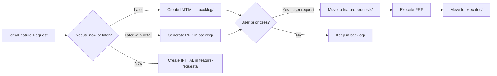

# PRP Backlog System

**Type**: Critical System Documentation

## Purpose

The `PRPs/backlog/` directory is a **permanent part of the PRP system** for managing future work that hasn't been prioritized or scheduled yet.

## Directory Structure

```
PRPs/
├── feature-requests/   # Active PRPs ready for execution
├── executed/           # Completed PRPs (archived)
└── backlog/            # INITIAL files and PRPs for future execution
```

## Backlog Usage

### What Goes in Backlog

1. **INITIAL files** - Feature ideas created explicitly for future consideration
2. **Draft PRPs** - Full PRPs generated but deferred for future execution
3. **Future enhancements** - Ideas captured for later consideration
4. **Dependencies waiting** - PRPs blocked by other work

### Workflow



### Moving Items

**To backlog** (intentional placement):
- `create initial for future` - INITIAL file explicitly for future work
- `generate prp for future` - Full PRP created but deferred
- Low-priority PRPs moved from feature-requests/ (user decision)

**From backlog** (user-driven only):
- **User decides**: All prioritization is user decision or explicit request
- Never autonomously promote backlog items to active work
- When user requests, move INITIAL → feature-requests/ (or generate PRP first)
- When user resolves dependencies, move PRP → feature-requests/

## Commands

### Creating Backlog Items

```bash
# Create INITIAL for future execution
/generate-prp PRPs/backlog/INITIAL-PRP-XX-feature.md

# Explicit intent: "create this for backlog"
# Place INITIAL directly in backlog/ directory
```

### Promoting from Backlog (User Request Only)

```bash
# ONLY when user explicitly requests
mv PRPs/backlog/INITIAL-PRP-XX-feature.md PRPs/feature-requests/
/generate-prp PRPs/feature-requests/INITIAL-PRP-XX-feature.md
```

## Critical Rules

1. **Never autonomous prioritization** - Agent does not decide what to promote
2. **User controls backlog** - All movement in/out requires user request
3. **Explicit requests only** - "Move PRP-X to active" or "Execute backlog item Y"
4. **No proactive suggestions** - Don't suggest promoting backlog items unprompted

## Persistence

This structure ensures:
- No ideas are lost
- Clear separation between active and future work
- Flexible prioritization without losing context
- Audit trail of all feature considerations
- **User control** - agent never decides priority autonomously

## References

- **GRAND-PLAN.md**: May contain planned PRPs (check before creating duplicates)
- **Tool inventory**: `.ce/tool-inventory.yml` tracks PRP system tooling
- **Context sync**: `/update-context` maintains backlog awareness

## Notes

- Backlog placement is **intentional** - for future execution, not immediate
- Backlog items don't require Linear issues (only when promoted to active)
- INITIAL files can stay in backlog indefinitely
- Backlog size is not a metric - it's a knowledge base
- Use backlog to capture ideas without committing to immediate execution
- **Prioritization is always user decision** - never autonomous
