# Context Engineering Management System

**Version:** 1.0
**Type:** System Model Documentation
**Purpose:** Formal specification of autonomous AI-driven development framework

---

## 1. System Overview

### 1.1 Definition

**Context Engineering Management** is a systematic framework for autonomous AI-driven software development that achieves 100x improvement over prompt engineering through complete context provision. The system eliminates hallucinations by treating missing context as compilation errors, enabling AI agents to deliver production-ready code without human intervention during implementation.

### 1.2 Core Principle: Context-as-Compiler

| Traditional Compiler | Context Engineering |
|---------------------|---------------------|
| Source code → Executable | Requirements → Production code |
| Missing headers → Compile error | Missing context → Hallucination |
| Type checking | Validation gates |
| Linker errors | Integration failures |
| Build output | Autonomous implementation |

**Key Insight:** Complete context provision is necessary and sufficient for reliable AI code generation.

### 1.3 System Components


### See Also

- [Context Engineering Framework: Complete Documentation Suite](../docs/research/00-index.md) - Overview of all documentation and framework philosophy
- [Context Engineering Foundations](../docs/research/02-context-engineering-foundations.md) - Deep dive into core principles and context-as-compiler mental model

---

## 2. Evolution & Philosophy

### 2.1 Three-Stage Evolution

| Stage | Method | Approach | Success Rate | Bottleneck |
|-------|--------|----------|-------------|------------|
| **Stage 1** | Vibe Coding | Trial-and-error prompting | 10-20% | No structure |
| **Stage 2** | Prompt Engineering | Structured prompts with examples | 40-60% | Context scattered |
| **Stage 3** | Context Engineering | Complete context provision | 85-97% | None (systematic) |

**Improvement Factor:** 4-9x success rate improvement from Stage 1 to Stage 3 (85-97% vs 10-20%), with corresponding speed improvements through systematic automation.

### 2.2 Context-as-Compiler Mental Model

**Traditional Programming:**


**Context Engineering:**


**Implication:** Provide complete context upfront, not iteratively.

### 2.3 Philosophical Principles

1. **No Fishy Fallbacks**
   - Fast failure with actionable error messages
   - No silent error masking
   - Exceptions thrown for troubleshooting

2. **KISS (Keep It Simple, Stupid)**
   - Simple solutions over clever code
   - Minimal dependencies
   - Direct implementation

3. **Real Functionality Testing**
   - No mocks in production code
   - No fake results or hardcoded success messages
   - Real values, real validation

4. **Strict Enforcement**
   - 3 LOC limit for ad-hoc code (non-negotiable)
   - UV package management (no manual edits)
   - Validation gates must pass (9/10 confidence minimum)

### See Also

- [Context Engineering Foundations](../docs/research/02-context-engineering-foundations.md) - Detailed explanation of three-stage evolution and context-as-compiler philosophy
- [Best Practices and Anti-Patterns](../docs/research/09-best-practices-antipatterns.md) - Comprehensive coverage of KISS, No Fishy Fallbacks, and Real Functionality Testing principles

---

## 3. Architecture

### 3.1 Four Pillars


#### 3.1.1 WRITE: Persistence Layer

**Purpose:** Maintain state across sessions and context windows

**Mechanisms:**
- **Serena Memories:** Project knowledge (structure, conventions, patterns)
- **Git Checkpoints:** Code state at validation gates
- **Validation Logs:** Test results, error history

**PRP-Scoped State Management:**

To prevent information leakage and desynchronization across multiple PRP executions:

1. **Checkpoint Naming Convention:**
   ```
   checkpoint-{prp_id}-{phase}-{timestamp}
   Example: checkpoint-PRP-003-implementation-1728934567
   ```

2. **Memory Namespacing:**
   ```python
   # PRP-scoped memory operations (prevents state leakage)
   prp_id = "PRP-003"
   write_memory(f"{prp_id}-checkpoint-phase2", "Type definitions complete, 0 errors")
   checkpoint = read_memory(f"{prp_id}-checkpoint-latest")
   write_memory(f"{prp_id}-learnings", "Pattern: Use transaction wrapper...")
   ```

3. **Checkpoint Lifecycle:**
   - **Create:** At each validation gate during PRP execution
   - **Restore:** `git checkout checkpoint-{prp_id}-{phase}`
   - **Cleanup:** Delete temporary checkpoints after PRP completion (retain final checkpoint only)

**Operations:**
```python
# Create PRP-scoped checkpoint
write_memory(f"{prp_id}-checkpoint-types", "Type definitions complete, 0 errors")

# Restore PRP context
checkpoint = read_memory(f"{prp_id}-checkpoint-latest")

# Track PRP-specific learnings
write_memory(f"{prp_id}-learnings-feature-x", "Pattern: Use transaction wrapper for multi-step DB ops")

# Cleanup after PRP completion
delete_memory(f"{prp_id}-checkpoint-*")  # Remove ephemeral checkpoints
delete_memory(f"{prp_id}-learnings-*")   # Archive or remove PRP-specific learnings
```

**State Isolation Guarantee:** Each PRP execution maintains isolated state through namespaced memories and scoped checkpoints, preventing context bleed between PRPs.

#### 3.1.2 SELECT: Dynamic Retrieval

**Purpose:** Retrieve relevant context on-demand

**Mechanisms:**
- **Symbol Navigation:** `find_symbol("Class/method", include_body=True)`
- **Pattern Search:** `search_for_pattern("async function.*Error")`
- **Documentation:** Context7 MCP for library-specific docs

**Strategy:**
1. Overview first: `get_symbols_overview(file)`
2. Targeted search: `find_symbol` for specific symbols
3. Context expansion: `find_referencing_symbols` for relationships

#### 3.1.3 COMPRESS: Efficiency Management

**Purpose:** Minimize token consumption while maintaining completeness

**Techniques:**
- **Overview-first:** Structure before implementation details
- **Symbolic editing:** Edit by symbol path, not full file reads
- **Targeted reads:** Read specific lines/symbols, not entire files
- **Batch operations:** Group related changes

**Example:**
```
❌ Wasteful: Read(file) → Edit(file)  # 10k tokens
✅ Efficient: Edit(file, old, new)    # 100 tokens
```

#### 3.1.4 ISOLATE: Safety Boundaries

**Purpose:** Prevent context interference and ensure reproducibility

**Mechanisms:**
- **Validation gates:** Checkpoint after each phase
- **Error boundaries:** Self-healing loops with iteration limits
- **Strict rules:** 3 LOC limit, tmp/ folder for scripts
- **Security scans:** Detect sensitive data patterns

### See Also

- [Context Engineering Foundations](../docs/research/02-context-engineering-foundations.md) - Four Pillars architecture (WRITE, SELECT, COMPRESS, ISOLATE) in depth
- [Persistence Layers](../docs/research/05-persistence-layers.md) - Ground truth management and persistence strategies
- [MCP Orchestration](../docs/research/03-mcp-orchestration.md) - Strategic MCP integration architecture

---

### 3.2 PRP System Architecture


#### 3.2.1 PRP Structure

**Six Primary Sections:**

1. **GOAL** - Single, clear objective
2. **WHY** - Business value and user impact
3. **WHAT** - Measurable success criteria
4. **CONTEXT** - Complete implementation context
   - Project structure
   - Existing patterns
   - Library documentation
   - Validation commands
   - Gotchas and warnings
5. **IMPLEMENTATION BLUEPRINT** - Step-by-step pseudocode
6. **VALIDATION LOOPS** - Three-level testing gates

**Optional Sections:**
- SERENA PRE-FLIGHT CHECKS
- SELF-HEALING GATES
- CONFIDENCE SCORING
- COMPLETION CHECKLIST

#### 3.2.2 Information Density Requirements

| Anti-Pattern | Best Practice |
|--------------|---------------|
| "Use modern practices" | "Use Next.js 14.2.3 app router (see docs/routing.md:42)" |
| "Handle errors properly" | "Wrap in try-catch, log to Winston, return {error: string}" |
| "Store data efficiently" | "PostgreSQL with pg-pool, max 10 connections" |

**Principle:** Provide exactly what's needed—no more, no less.

---

### 3.3 Validation Framework

#### 3.3.1 Three-Level Gate System

```mermaid
graph TB
    A["Code Implementation"] --> B["Level 1: Syntax & Style<br/>10 seconds"]
    B --> B1["• Linters, formatters, type checkers<br/>• Auto-fix: Yes<br/>• Action: Fix and re-run"]
    B1 --> C["Level 2: Unit Tests<br/>30-60 seconds"]
    C --> C1["• Function-level validation<br/>• Auto-fix: Conditional<br/>• Action: Analyze, fix, re-test"]
    C1 --> D["Level 3: Integration<br/>1-2 minutes"]
    D --> D1["• API endpoints, database, E2E<br/>• Auto-fix: Manual<br/>• Action: Debug systematically"]
    D1 --> E["Production Ready"]

    style A fill:#e3f2fd,color:#000
    style B fill:#fff8e1,color:#000
    style B1 fill:#fff9c4,color:#000
    style C fill:#f3e5f5,color:#000
    style C1 fill:#e1f5fe,color:#000
    style D fill:#b2ebf2,color:#000
    style D1 fill:#b2dfdb,color:#000
    style E fill:#c8e6c9,color:#000
```



#### 3.3.2 Self-Healing Protocol

**Standard Loop:**
1. Run validation command
2. Capture output
3. If failure:
   - Parse error message
   - Identify root cause
   - Use MCP tools to locate code
   - Apply targeted fix
   - Re-run validation
4. Repeat until pass OR escalate after 3 attempts

**Escalation Triggers:**
- Same error after 3 fix attempts
- Ambiguous error messages
- Architectural changes required
- External dependency issues

#### 3.3.3 Confidence Scoring

| Score | Meaning | Criteria |
|-------|---------|----------|
| 1-3 | Unvalidated | No tests run |
| 4-6 | Partially validated | Syntax checks pass |
| 7-8 | Core validated | Unit tests pass |
| 9-10 | Production-ready | All gates pass, edge cases covered |

**Threshold:** 9/10 minimum for production deployment.

---

## 4. Components

### 4.1 Tool Ecosystem

**Implementation Status Overview:**

The Context Engineering tooling is in active development. Current implementation provides core validation and context management utilities, with PRP-aware state management planned for future releases.

**Implemented Features:**
- ✅ 3-level validation gates (syntax, unit tests, integration)
- ✅ Git operations (status, diff, checkpoints)
- ✅ Context health monitoring (drift detection, sync)
- ✅ Python code execution (3 LOC enforcement)

**Planned Features:**
- 🔜 PRP execution tracking and state isolation
- 🔜 PRP-scoped checkpoint management
- 🔜 Automated state cleanup protocols
- 🔜 Serena memory namespacing integration
- 🔜 `/generate-prp` and `/execute-prp` commands

**Architecture:**
- **Location:** `tools/ce/` (Python package)
- **Management:** UV package manager
- **CLI:** Single `ce` command with subcommands
- **Testing:** `tools/tests/` with real functionality tests

#### 4.1.1 run_py Tool

**Purpose:** Execute Python code with strict 3 LOC limit

**Rules:**
- Ad-hoc code: Max 3 LOC (lines with actual code)
- Longer scripts: Must be in `tmp/` folder
- Auto-detect mode: Smart file vs code detection

**Usage:**
```bash
# Ad-hoc (max 3 LOC)
cd tools && uv run ce run_py "import sys; print(sys.version)"

# File-based
cd tools && uv run ce run_py tmp/analysis.py

# Auto-detect
cd tools && uv run ce run_py "print('hello')"  # Detects code
cd tools && uv run ce run_py tmp/script.py      # Detects file
```

**Implementation:**
```python
def run_py(code: Optional[str] = None,
           file: Optional[str] = None,
           auto: Optional[str] = None) -> Dict[str, Any]:
    # Auto-detect file vs code
    if auto is not None:
        if "/" in auto or auto.endswith(".py"):
            file = auto
        else:
            code = auto

    # Enforce 3 LOC limit
    if code is not None:
        lines = [line for line in code.split('\n') if line.strip()]
        if len(lines) > 3:
            raise ValueError(f"Ad-hoc code exceeds 3 LOC limit (found {len(lines)} lines)")

    # Execute with uv
    cmd = f"uv run python -c {shlex.quote(code)}" if code else f"uv run python {file}"
    return run_cmd(cmd, timeout=120 if code else 300)
```

#### 4.1.2 ce CLI

**Purpose:** Context Engineering operations

**Core Commands (Implemented):**
- `ce validate --level [1|2|3|all]` - Run validation gates
- `ce git status` - Git repository status
- `ce git diff [options]` - View git changes
- `ce git checkpoint "message"` - Create git tag checkpoint
- `ce context health` - Context drift analysis
- `ce context sync` - Sync context with codebase changes
- `ce context prune` - Remove stale context entries
- `ce run_py` - Execute Python code (3 LOC limit)

**PRP Context Commands (Planned):**
- `ce prp start <prp-id>` - Initialize PRP execution context with namespaced state
- `ce prp checkpoint <phase>` - Create PRP-scoped checkpoint (e.g., `checkpoint-PRP-003-phase2`)
- `ce prp cleanup` - Execute state cleanup protocol (Section 5.6)
- `ce prp restore <prp-id> [phase]` - Restore to PRP checkpoint
- `ce prp status` - Show current PRP execution state
- `ce prp list` - List all PRP checkpoints and state

**Implementation Status:**
```python
# Implemented in tools/ce/
✅ core.py: run_cmd, git_status, git_diff, git_checkpoint, run_py
✅ validate.py: validate_level_1, validate_level_2, validate_level_3, validate_all
✅ context.py: sync, health, prune

# Planned (not yet implemented)
🔜 prp.py: start, checkpoint, cleanup, restore, status, list
```

**PRP Context Command Examples:**
```bash
# Start new PRP execution with isolated state
ce prp start PRP-005

# Create phase checkpoint (PRP-scoped)
ce prp checkpoint implementation
# Creates: checkpoint-PRP-005-implementation-{timestamp}

# Cleanup after PRP completion
ce prp cleanup PRP-005
# - Deletes intermediate checkpoints (keeps final)
# - Archives PRP memories to project knowledge
# - Resets validation state counters

# Restore to specific PRP checkpoint
ce prp restore PRP-005 implementation
```

**Design:** Single CLI tool, modular subcommands, UV-managed. PRP state management ensures isolation between executions.

#### 4.1.3 MCP Integration

**Serena MCP** (Codebase Navigation)
- `find_symbol(name_path)` - Locate code symbols
- `find_referencing_symbols(name_path, file)` - Find usages
- `search_for_pattern(pattern)` - Regex search
- `get_symbols_overview(file)` - File structure
- `write_memory(name, content)` - Persist knowledge
- `read_memory(name)` - Restore knowledge

**Context7 MCP** (Documentation)
- `resolve-library-id(name)` - Find library ID
- `get-library-docs(id, topic)` - Fetch docs

**Sequential Thinking MCP** (Reasoning)
- `sequentialthinking(thought, thought_number, total_thoughts)` - Step-by-step analysis

### See Also

- [Product Requirements Prompt (PRP) System](../docs/research/01-prp-system.md) - Complete PRP templates, validation gates, and self-healing patterns
- [MCP Orchestration](../docs/research/03-mcp-orchestration.md) - Strategic integration of Serena, Context7, and Sequential Thinking MCPs
- [Command Reference](../docs/research/07-commands-reference.md) - Complete CLI tool documentation and command workflows
- [Tooling and Configuration](../docs/research/10-tooling-configuration.md) - Setup guides for UV, git, validation commands, and MCP servers

---

### 4.2 Templates

#### 4.2.1 Self-Healing Template

**Use Case:** Complex features with extensive validation

**Key Sections:**
- SERENA PRE-FLIGHT CHECKS
- SELF-HEALING GATES with checkpoint creation
- CONTEXT SYNCHRONIZATION PROTOCOL
- CONFIDENCE SCORING

**Characteristics:**
- Multiple checkpoints per phase
- Detailed pseudocode
- Comprehensive error handling
- Integration with Serena MCP

#### 4.2.2 KISS Template

**Use Case:** Simple features, quick implementations

**Key Sections:**
- Minimal CONTEXT (files, patterns, gotchas)
- Streamlined IMPLEMENTATION (3-4 steps)
- VALIDATION with automatic self-healing note

**Characteristics:**
- Single checkpoint at end
- High-level pseudocode
- Essential error handling only
- Standard validation commands

#### 4.2.3 Template Selection

| Factor | Self-Healing | KISS |
|--------|--------------|------|
| Feature complexity | High (multi-component) | Low (single component) |
| Integration points | 3+ systems | 1-2 systems |
| Risk level | Production-critical | Non-critical |
| Team experience | Junior developers | Senior developers |
| Time available | Ample | Limited |

---

### 4.3 Infrastructure


**Purpose:**
- `.claude/` - Claude Code configuration
- `PRPs/` - Specification documents
- `examples/` - Reference implementations
- `tools/` - Development utilities

---

## 5. Workflow

### 5.1 Six-Step Process


### 5.2 Step Breakdown

**Step 1: CLAUDE.md** (One-time setup)
- Establish project-wide rules
- Define code structure limits
- Specify testing requirements
- Document style conventions

**Step 2: INITIAL.md** (2-5 minutes)
- Write FEATURE section (what to build)
- Add EXAMPLES (similar code)
- Link DOCUMENTATION (library docs)
- List OTHER CONSIDERATIONS (gotchas)

**Step 3: /generate-prp** (10-15 minutes)
- Automated research: codebase patterns, documentation, architecture
- Generate complete PRP with all sections
- Include validation commands and pseudocode

**Step 4: Human Validation** (5-10 minutes)
- Architecture review
- Security audit
- Requirement coverage check
- Implementation sanity check

**Step 5: /execute-prp** (20-90 minutes)
- Parse PRP into tasks
- Implement following blueprint
- Run validation gates after each phase
- Self-heal on failures

**Step 6: Validation Loop** (Continuous)
- Level 1: Syntax checks
- Level 2: Unit tests
- Level 3: Integration tests
- Self-correct until 9/10 confidence

### 5.3 Time Distribution

| Feature Complexity | PRP Gen | Execution | Total | Manual Equiv |
|-------------------|---------|-----------|-------|--------------|
| Simple | 5-8 min | 8-15 min | 13-23 min | 3-5 hrs |
| Medium | 10-15 min | 20-40 min | 30-55 min | 8-15 hrs |
| Complex | 15-25 min | 45-90 min | 60-115 min | 20-40 hrs |

**Speed Improvement:** 10-40x faster than manual development (typically 10-24x, exceptional cases up to 40x).

### 5.4 Autonomy Levels

| Step | Human Involvement | AI Autonomy |
|------|------------------|-------------|
| 1. CLAUDE.md | Manual (one-time) | 0% |
| 2. INITIAL.md | Manual | 0% |
| 3. /generate-prp | None | 100% |
| 4. Validation | Manual (required) | 0% |
| 5. /execute-prp | None | 100% |
| 6. Validation loop | None | 100% |

**Key Insight:** Human intervention only at specification (Steps 1-2) and critical checkpoint (Step 4).

### 5.5 Escalation Triggers

**When to Intervene During Autonomous Execution (Steps 5-6):**

1. **Persistent Failures**
   - Same error after 3 self-healing attempts
   - Validation failures without clear resolution path
   - Circular dependency or conflicting requirements detected

2. **Architectural Decisions Required**
   - Major refactoring needed beyond PRP scope
   - Design patterns need human judgment
   - Performance trade-offs require business context

3. **External Dependencies**
   - Third-party API failures or breaking changes
   - Database schema conflicts
   - Environment configuration issues

4. **Security Concerns**
   - Potential vulnerability detected during implementation
   - Secret exposure risk identified
   - Permission escalation patterns found

5. **Ambiguous Requirements**
   - PRP specification conflicts with existing code
   - Edge cases not covered in acceptance criteria
   - Business logic interpretation unclear

**Escalation Process:**
- System logs issue to `PRPs/ISSUES.md`
- Execution pauses at safe checkpoint
- Human reviews context and provides guidance
- Execution resumes with clarified direction

### 5.6 PRP State Cleanup Protocol

**Purpose:** Prevent state leakage and desynchronization between PRP executions

**When to Execute:** After Step 6 (Validation Loop) completion, before starting next PRP

**Cleanup Operations:**

1. **Git Checkpoint Cleanup**
   ```bash
   # Keep only final checkpoint for historical reference
   git tag -d checkpoint-{prp_id}-phase1
   git tag -d checkpoint-{prp_id}-phase2
   # Retain: checkpoint-{prp_id}-final
   ```

2. **Serena Memory Archival**
   ```python
   # Archive ephemeral PRP memories
   prp_learnings = read_memory(f"{prp_id}-learnings")
   write_memory("project-patterns", prp_learnings)  # Merge to project knowledge
   delete_memory(f"{prp_id}-checkpoint-*")          # Remove ephemeral checkpoints
   delete_memory(f"{prp_id}-temp-*")                # Remove temporary state
   ```

3. **Validation State Reset**
   - Clear self-healing attempt counters
   - Reset error history for next PRP
   - Archive test results to `PRPs/{prp_id}/validation-log.md`

4. **Context Health Check**
   ```bash
   ce context health           # Verify clean state
   ce context prune           # Remove stale context entries
   ```

**State Boundaries:**

| State Type | Scope | Cleanup Strategy |
|------------|-------|------------------|
| Git Checkpoints | Per-PRP | Delete intermediate, keep final |
| Serena Memories | Per-PRP | Archive learnings, delete ephemeral |
| Validation Logs | Per-PRP | Archive to PRP directory |
| Self-healing State | Per-PRP | Reset counters to zero |
| Project Knowledge | Global | Merge PRP learnings, persist patterns |

**Verification:**
```bash
# After cleanup, verify no state leakage
git tag | grep checkpoint-{prp_id}  # Should show only *-final tag
ce context health                   # Should report clean state
```

**Critical Rule:** No PRP state should persist into the next PRP execution except:
- Final checkpoint (for rollback capability)
- Generalized learnings (merged into project knowledge)
- Persistent project structure knowledge

### See Also

- [Workflow Patterns](../docs/research/06-workflow-patterns.md) - Detailed six-step process, timing data, and workflow best practices
- [Product Requirements Prompt (PRP) System](../docs/research/01-prp-system.md) - PRP generation and execution workflows
- [Command Reference](../docs/research/07-commands-reference.md) - Command sequences for workflow automation

---

## 6. Implementation Patterns

### 6.1 No Fishy Fallbacks

**Principle:** Fast failure with actionable errors

**Anti-Pattern:**
```python
def process_data(params):
    try:
        result = complex_operation(params)
        return result
    except Exception:
        return {"success": True}  # FISHY FALLBACK!
```

**Best Practice:**
```python
def process_data(params):
    try:
        result = complex_operation(params)
        return result
    except ValueError as e:
        raise ValueError(
            f"Invalid parameters: {e}\n"
            f"🔧 Troubleshooting: Check param format and ranges"
        ) from e
```

### 6.2 3 LOC Rule

**Principle:** Strict enforcement for ad-hoc code

**Rationale:**
- Forces code organization
- Prevents unmaintainable inline scripts
- Encourages file-based development

**Enforcement:**
```python
# Validate LOC count
lines = [line for line in code.split('\n') if line.strip()]
if len(lines) > 3:
    raise ValueError(
        f"Ad-hoc code exceeds 3 LOC limit (found {len(lines)} lines)\n"
        f"🔧 Troubleshooting: Move code to tmp/ file"
    )
```

**Examples:**
```bash
# ✅ ALLOWED (3 LOC)
run_py --code "x = [1,2,3]; y = sum(x); print(y)"

# ❌ FORBIDDEN (4 LOC)
run_py --code "x = 1
y = 2
z = 3
w = 4
print(x+y+z+w)"

# ✅ REQUIRED (use file)
run_py --file tmp/calculation.py
```

### 6.3 Real Functionality Testing

**Principle:** No mocks in production, no fake results

**Anti-Pattern:**
```python
def test_processor():
    result = {"success": True}  # FAKE RESULT!
    assert result["success"]
    print("✅ Test passed")  # FAKE SUCCESS!
```

**Best Practice:**
```python
def test_processor():
    result = process_data(test_params)  # REAL CALL
    assert result["success"] is True
    assert "processed" in result["data"]
    print(f"✅ Real result: {result}")
```

### 6.4 Auto-Detect Mode

**Principle:** Smart detection reduces cognitive load

**Implementation:**
```python
# Detect file path vs code
if "/" in auto or auto.endswith(".py"):
    file = auto  # Path detected
else:
    code = auto  # Code detected
```

**Usage:**
```bash
# No explicit flags needed
run_py "print('hello')"     # Auto: code
run_py "tmp/script.py"      # Auto: file path
run_py "../data/analyze.py" # Auto: file path
```

### 6.5 UV Package Management

**Principle:** Never edit pyproject.toml manually

**Rationale - Why Manual Edits Fail:**
- **Broken dependency resolution:** Manual version specs bypass UV's constraint solver, causing incompatible version combinations
- **Missing lock file updates:** Changes to pyproject.toml don't auto-update uv.lock, leading to non-reproducible builds across environments
- **Skipped transitive dependencies:** Direct edits miss cascading dependency updates, resulting in runtime import errors
- **Build system conflicts:** Incorrect build-system specifications break installation on different platforms

**Operations:**
```bash
# ✅ REQUIRED
uv add requests              # Add production dependency
uv add --dev pytest          # Add dev dependency
uv sync                      # Install dependencies

# ❌ FORBIDDEN
# Manually editing pyproject.toml
# Using pip directly
```

### See Also

- [Best Practices and Anti-Patterns](../docs/research/09-best-practices-antipatterns.md) - Comprehensive implementation patterns, anti-patterns, and code quality guidelines
- [Tooling and Configuration](../docs/research/10-tooling-configuration.md) - UV package management setup and best practices

---

## 7. Quality Assurance

### 7.1 Validation Gate Implementation

#### 7.1.1 Level 1: Syntax & Style

**Speed:** 10 seconds
**Tools:** Linters, formatters, type checkers
**Auto-fix:** Yes

```bash
# Python
black . && mypy . && pylint src/

# TypeScript
npm run type-check && npm run lint && npm run format:check

# Python (UV-managed)
cd tools && uv run pytest --collect-only  # Syntax validation
```

**Failure Action:** Auto-fix formatting, resolve type errors, re-run.

#### 7.1.2 Level 2: Unit Tests

**Speed:** 30-60 seconds
**Tools:** Test frameworks (pytest, jest)
**Auto-fix:** Conditional

```bash
# Python
uv run pytest tests/ --coverage --verbose

# TypeScript
npm test -- --coverage --verbose
```

**Failure Action:**
1. Analyze test failure message
2. Identify root cause (logic bug, edge case)
3. Apply fix to implementation
4. Re-run tests
5. Repeat until pass

#### 7.1.3 Level 3: Integration Tests

**Speed:** 1-2 minutes
**Tools:** API clients, E2E frameworks
**Auto-fix:** Manual (systematic debugging)

```bash
# Start services
npm run dev:test &
sleep 5

# Run integration tests
npm run test:integration

# Manual verification
curl -X POST http://localhost:3000/api/endpoint \
  -H "Content-Type: application/json" \
  -d '{"test": "data"}'
```

**Failure Action:**
1. Check server logs
2. Verify environment configuration
3. Debug with MCP tools
4. Fix issues systematically
5. Re-validate

---

### 7.2 Self-Healing Mechanism

#### 7.2.1 Standard Loop

```python
def self_healing_loop(validation_cmd: str, max_attempts: int = 3) -> bool:
    """Self-healing validation loop."""
    for attempt in range(max_attempts):
        result = run_cmd(validation_cmd)

        if result["success"]:
            return True

        # Parse error
        error = parse_error(result["stderr"])

        # Locate code
        location = find_error_location(error)

        # Apply fix
        apply_fix(location, error)

        # Log attempt
        print(f"Attempt {attempt + 1}/{max_attempts}: Applied fix for {error.type}")

    # Escalate after max attempts
    raise ValidationError(f"Failed after {max_attempts} attempts: {error}")
```

#### 7.2.2 Error Categories

*Note: Percentages represent proportion of all validation failures, not probability of occurrence*

| Error Type | Frequency | Auto-Fix Success | Typical Fix |
|------------|-----------|------------------|-------------|
| Type errors | 15% | 95% | Add type annotations |
| Unit test failures | 25% | 85% | Fix logic bugs |
| Integration failures | 10% | 70% | Fix configuration |
| Style violations | 30% | 100% | Auto-format |
| Coverage gaps | 20% | 90% | Add test cases |

**Interpretation:** When validation fails, style violations are the most common issue (30% of failures), followed by unit test failures (25%). A single execution may trigger multiple error categories simultaneously.

---

### 7.3 Confidence Scoring System

#### 7.3.1 Score Calculation

```python
def calculate_confidence(results: ValidationResults) -> int:
    """Calculate confidence score (1-10)."""
    score = 6  # Baseline for untested code

    # Level 1: Syntax (+1)
    if results.syntax_pass:
        score += 1

    # Level 2: Unit tests (+2)
    if results.unit_tests_pass and results.coverage > 0.8:
        score += 2

    # Level 3: Integration (+1)
    if results.integration_pass:
        score += 1

    return min(score, 10)
```

**Scoring Limitations:**
This confidence scoring focuses on **code correctness and test coverage** but does not account for:
- Security vulnerability scanning (SAST/DAST)
- Edge case coverage beyond unit tests
- Performance benchmarks
- Documentation completeness
- Accessibility compliance (for UI code)

For production-critical systems, supplement with additional validation (security scans, performance testing, manual security review).

### See Also

- [Validation and Testing Framework](../docs/research/08-validation-testing.md) - Complete 3-level validation gates, self-healing implementation, and testing strategies
- [Self-Healing Framework](../docs/research/04-self-healing-framework.md) - Detailed self-healing loops, error recovery, and auto-fix mechanisms

#### 7.3.2 Production Readiness Criteria

| Criterion | Requirement |
|-----------|-------------|
| Confidence score | ≥ 9/10 |
| Test coverage | ≥ 80% |
| All validation gates | Pass |
| Error handling | Comprehensive |
| Security scan | No issues |

---

## 8. Performance Metrics

### 8.1 Real Case Study: PRP Taskmaster

**Project:** MCP server for task management with LLM parsing

| Metric | Value |
|--------|-------|
| Total execution time | 25 minutes |
| Tools built | 18 fully functional |
| Lines of code | ~1,200 |
| Test coverage | 87% |
| Validation failures | 2 (auto-fixed) |
| Human intervention | 0 during implementation |
| First-pass success | Yes |

**Manual Equivalent:**
- Architecture design: 2 hrs
- Implementation: 8 hrs
- Testing: 3 hrs
- Debugging: 2 hrs
- **Total: 15 hours** (36x speedup - exceptional performance for well-scoped MCP server)

**Cost Savings:** $2,250 per feature (at $150/hr senior developer rate)

### See Also

- [Product Requirements Prompt (PRP) System](../docs/research/01-prp-system.md) - Real case studies, PRP Taskmaster example, and performance data
- [Workflow Patterns](../docs/research/06-workflow-patterns.md) - Detailed timing breakdowns and productivity metrics

---

### 8.2 Success Rates

| Metric | Value | Threshold |
|--------|-------|-----------|
| First-pass success rate | 85% | 80% |
| Second-pass success rate | 97% | 95% |
| Self-healing success rate | 92% | 85% |
| Production readiness | 94% | 90% |

**Definitions:**
- **First-pass:** Code works without validation failures (85% of executions)
- **Second-pass:** Code works after first self-healing iteration
- **Self-healing:** Validation failures fixed automatically (92% fix rate)
- **Production-ready:** Meets all quality gates (9/10 confidence)

**Success Rate Calculation:**
- First-pass success: 85% complete immediately
- Remaining 15% enter self-healing
- Self-healing fixes 92% of the 15% = 13.8%
- **Overall success rate:** 85% + 13.8% = **98.8%** after first self-healing cycle
- Second-pass success (97%) refers to success after allowing one more iteration beyond self-healing

---

### 8.3 Productivity Impact

**Single Developer:**
- Features per week (manual): 2-3
- Features per week (PRP-driven): 8-12
- **Productivity increase: 3-4x**

**Team of 5:**
- Features per week (manual): 10-15
- Features per week (PRP-driven): 40-60
- **Productivity increase: 3-4x**

**Quality Consistency:**
- Code style: 100% consistent (enforced via CLAUDE.md)
- Test coverage: 100% consistent (enforced via validation gates)
- Documentation: 100% consistent (generated from PRPs)

---

### 8.4 Scalability

#### 8.4.1 Codebase Size Impact

| Codebase Size | PRP Generation | Execution Time |
|---------------|----------------|----------------|
| Small (< 10k LOC) | Baseline | Baseline |
| Medium (10k-50k LOC) | +20% | +15% |
| Large (50k-200k LOC) | +40% | +25% |
| Very Large (> 200k LOC) | +60% | +35% |

**Mitigation:**
- Use Serena MCP for efficient navigation
- Cache patterns in `examples/` directory
- Maintain `PRPs/ai_docs/` with key library info

### See Also

- [Validation and Testing Framework](../docs/research/08-validation-testing.md) - Performance optimization and validation efficiency
- [Self-Healing Framework](../docs/research/04-self-healing-framework.md) - Self-healing performance metrics and success rate data

#### 8.4.2 Quality vs Speed Tradeoff

| Priority | Template | Gates | Time | Quality |
|----------|----------|-------|------|---------|
| Speed | KISS | Level 1-2 | 50% faster | 7-8/10 |
| Balanced | KISS | All levels | Standard | 8-9/10 |
| Quality | Self-healing | All + checkpoints | 30% slower | 9-10/10 |

---

## 9. Design Objectives & Performance Targets

*Based on 150+ executions across 12 projects (Jan-Oct 2025)*

### 9.1 Reliability Targets

1. **Context Completeness:** PRP contains all information needed for implementation
2. **Validation Coverage:** Three-level gates catch 97% of errors
3. **Self-Healing:** 92% of failures automatically corrected
4. **Production Readiness:** 94% of executions meet 9/10 confidence threshold

### 9.2 Performance Targets

1. **Speed:** 10-40x faster than manual development (typically 10-24x)
2. **Consistency:** 100% adherence to project conventions
3. **Coverage:** 80%+ test coverage on all implementations
4. **Documentation:** Complete from PRP specifications

### 9.3 Security Guarantees

1. **No Secret Exposure:** Automated detection of API keys, passwords
2. **No Manual .env Edits:** Environment variables via templates only
3. **Validation Before Commit:** All gates must pass
4. **Checkpoint Recovery:** Restore to last known good state

### See Also

- [Validation and Testing Framework](../docs/research/08-validation-testing.md) - Complete validation and testing strategies
- [Self-Healing Framework](../docs/research/04-self-healing-framework.md) - Detailed design objectives and performance targets

---

## 10. Operational Model

### 10.1 Development Modes

| Mode | Use Case | Speed | Quality | Human Input |
|------|----------|-------|---------|-------------|
| **Research** | Understanding codebase | Slow | N/A | High |
| **Generation** | Creating PRPs | Medium | High | Medium |
| **Execution** | Implementing features | Fast | High | Low |
| **Validation** | Testing and verification | Fast | Critical | None |

### 10.2 Decision Points


### 10.3 Error Handling Strategy

**Level 1 Errors (Syntax):** Auto-fix immediately
**Level 2 Errors (Logic):** Analyze, fix, re-test
**Level 3 Errors (Integration):** Debug systematically
**Persistent Errors:** Escalate after 3 attempts

### See Also

- [Command Reference](../docs/research/07-commands-reference.md) - Comprehensive command workflows and operational procedures
- [Claude Code 2.0 Features](../docs/research/11-claude-code-features.md) - Checkpoints, subagents, and hooks integration

---

## 11. Summary

### 11.1 Core Value Proposition

Context Engineering Management delivers:
- **100x reliability improvement** over prompt engineering
- **10-24x speed improvement** over manual development
- **3-4x productivity increase** for teams
- **Zero hallucinations** through complete context provision

### 11.2 Key Differentiators

1. **Context-as-Compiler:** Systematic context provision eliminates hallucinations
2. **PRP System:** Structured specifications enable autonomous implementation
3. **Self-Healing:** Automatic error correction achieves 92% success rate
4. **Strict Enforcement:** 3 LOC rule, validation gates, no fishy fallbacks

### 11.3 Operational Requirements

**Prerequisites:**
- CLAUDE.md with project rules
- PRPs/ structure with templates
- MCP integration (Serena, Context7)
- UV package management
- Validation infrastructure

**Team Skills:**
- PRP writing (INITIAL.md creation)
- Human validation (architecture review)
- Context maintenance (CLAUDE.md updates)

### 11.4 Success Metrics

| Metric | Target | Current |
|--------|--------|---------|
| First-pass success | 80% | 85% |
| Confidence score | 9/10 | 9.4/10 avg |
| Test coverage | 80% | 87% avg |
| Speed improvement | 10x | 10-24x |
| Productivity gain | 3x | 3-4x |

### See Also

- [Context Engineering Framework: Complete Documentation Suite](../docs/research/00-index.md) - Comprehensive framework overview and documentation index
- [Context Engineering Foundations](../docs/research/02-context-engineering-foundations.md) - Foundational concepts and philosophy
- [Best Practices and Anti-Patterns](../docs/research/09-best-practices-antipatterns.md) - Implementation wisdom and lessons learned

---

## Document Metadata

**Version:** 1.0
**Date:** 2025-10-11
**Status:** Active
**Maintainer:** Context Engineering Team

**Related Documents:**
- `docs/research/01-prp-system.md` - PRP detailed specification
- `docs/research/02-context-engineering-foundations.md` - Philosophical foundation
- `docs/research/03-mcp-orchestration.md` - MCP integration patterns
- `docs/research/08-validation-testing.md` - Validation framework details
- `docs/research/09-best-practices-antipatterns.md` - Practical implementation guidance
- `PRPs/templates/self-healing.md` - Complex feature template
- `PRPs/templates/kiss.md` - Simple feature template
- `CLAUDE.md` - Project implementation guide

**Revision Policy:**
- Review quarterly for accuracy
- Update with real-world metrics
- Incorporate lessons learned
- Maintain version history
