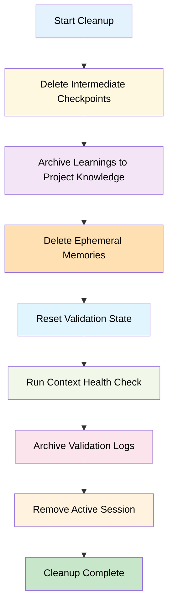

# PRP-2: PRP State Management & Isolation

## 🎯 TL;DR

**Problem**: Multiple PRPs executing over time cause state leakage, desynchronization, and context pollution - git checkpoints collide, Serena memories mix across PRPs, validation state persists incorrectly.

**Solution**: Implement PRP-scoped state management with namespaced checkpoints (`checkpoint-{prp_id}-{phase}`), isolated Serena memories (`{prp_id}-checkpoint-*`), automated cleanup protocol removing ephemeral state while preserving learnings, and `.ce/active_prp_session` state file tracking current PRP context.

**Impact**: Enables parallel PRP development without interference, allows safe checkpoint restoration, creates audit trail for debugging, prevents technical debt from cross-PRP contamination, and establishes foundation for PRP-4 execution workflow.

**Risk**: MEDIUM - Cleanup protocol must be bulletproof (no data loss); git tag operations require careful testing; Serena MCP availability impacts memory isolation.

**Effort**: 17.5h (Core State: 6h, CLI Commands: 5h, Cleanup Protocol: 4h, Testing: 2.5h)

**Non-Goals**:
- ❌ Historical state aggregation across PRPs (handled by PRP-6)
- ❌ Distributed/multi-machine state synchronization
- ❌ Automatic conflict resolution between PRPs
- ❌ State compression or optimization (performance not critical)

---

## 📋 Pre-Execution Context Rebuild

**Complete before implementation:**

- [ ] **Review documentation**:
  - `PRPs/Model.md` Section 3.1.1 (State management specification)
  - `PRPs/Model.md` Section 5.6 (Cleanup protocol details)
  - `PRPs/GRAND-PLAN.md` lines 117-171 (PRP-2 specification)
  - `docs/research/06-workflow-patterns.md` (Workflow state boundaries)

- [ ] **Verify codebase state**:
  - File exists: `tools/ce/prp.py` (current YAML validation only - will extend)
  - File exists: `tools/ce/__main__.py` (CLI entry point)
  - File exists: `tools/ce/core.py` (run_cmd, git operations)
  - Tests exist: `tools/tests/test_prp.py` (currently YAML validation tests)
  - PRP-1 completed: L4 validation available for checkpoint validation

- [ ] **Git baseline**: Clean working tree (`git status`)

- [ ] **Dependencies installed**: `cd tools && uv sync`

- [ ] **Serena MCP available**: Check Serena MCP connection (optional but recommended)

---

## 📖 Context

**Related Work**:
- **PRP-1 dependency**: L4 validation gates will use checkpoints for incremental progress
- **Existing prp.py**: Currently has YAML validation (197 lines) - will add state management functions
- **Git integration**: `tools/ce/core.py` has `run_cmd()` for git operations
- **Context management**: `tools/ce/context.py` has health/sync functions

**Current State**:
- ✅ YAML validation exists: `validate_prp_yaml()` in `prp.py`
- ✅ Git operations available: `run_cmd()` in `core.py`
- ✅ Context health checks: `context_health()` in `context.py`
- ❌ No PRP state tracking: No `.ce/active_prp_session` file
- ❌ No checkpoint namespacing: Manual git tags with ad-hoc naming
- ❌ No memory isolation: Serena memories not scoped to PRPs
- ❌ No cleanup protocol: State persists across PRP executions
- ❌ No state restore: Cannot rollback to checkpoints reliably

**Desired State**:
- ✅ PRP state tracking: `.ce/active_prp_session` JSON file with current PRP context
- ✅ Checkpoint namespacing: `checkpoint-{prp_id}-{phase}-{timestamp}` convention
- ✅ Memory isolation: Serena memories prefixed with `{prp_id}-`
- ✅ Cleanup protocol: Automated removal of ephemeral state
- ✅ State restore: `ce prp restore <prp-id> [phase]` functional
- ✅ CLI commands: 6 commands (`start`, `checkpoint`, `cleanup`, `restore`, `status`, `list`)

**State Boundaries** (from Model.md Section 5.6):

| State Type | Scope | Cleanup Strategy | Persistence |
|------------|-------|------------------|-------------|
| Git Checkpoints | Per-PRP | Delete intermediate, keep final | Long-term (rollback capability) |
| Serena Memories | Per-PRP | Archive learnings, delete ephemeral | Selective (learnings → project knowledge) |
| Validation Logs | Per-PRP | Archive to PRP directory | Per-PRP (debugging) |
| Self-healing State | Per-PRP | Reset counters to zero | None (transient) |
| Active PRP Session | Global | Update on PRP start/end | Current session only |

**Why Now**: Foundation for PRP-4 execution workflow; blocks MVP completion; enables safe multi-PRP development.

---

## 🔧 Implementation Blueprint

### Phase 1: State Tracking Core (6 hours)

**Goal**: Implement `.ce/active_prp_session` state file and core state management functions

**Approach**: JSON-based state file with atomic writes (temp file + rename pattern), state transitions validated

**Files to Modify**:
- `tools/ce/prp.py` - Add state management functions (extend existing YAML validation)

**Files to Create**:
- `.ce/` directory (gitignored) - Contains active session state
- `.ce/active_prp_session` - JSON file tracking current PRP

**State File Structure**:

```json
{
  "prp_id": "PRP-003",
  "prp_name": "User Authentication System",
  "started_at": "2025-10-12T14:30:00Z",
  "phase": "implementation",
  "last_checkpoint": "checkpoint-PRP-003-phase2-20251012-143000",
  "checkpoint_count": 3,
  "validation_attempts": {
    "L1": 1,
    "L2": 2,
    "L3": 1,
    "L4": 0
  },
  "_note_validation_attempts": "Incremented by PRP-4 execute-prp workflow, not directly by PRP-2 functions",
  "serena_memories": [
    "PRP-003-checkpoint-phase1",
    "PRP-003-checkpoint-phase2",
    "PRP-003-learnings-auth-patterns"
  ]
}
```

**Key Functions**:

```python
def start_prp(prp_id: str, prp_name: Optional[str] = None) -> Dict[str, Any]:
    """Initialize PRP execution context.

    Creates .ce/active_prp_session file and initializes state tracking.

    Args:
        prp_id: PRP identifier (e.g., "PRP-003")
        prp_name: Optional PRP name for display

    Returns:
        {
            "success": True,
            "prp_id": "PRP-003",
            "started_at": "2025-10-12T14:30:00Z",
            "message": "PRP-003 context initialized"
        }

    Raises:
        RuntimeError: If another PRP is active (call cleanup first)
        ValueError: If prp_id format invalid

    Side Effects:
        - Creates .ce/active_prp_session file
        - Logs INFO: "Started PRP-003 execution context"
    """
    pass

def get_active_prp() -> Optional[Dict[str, Any]]:
    """Get current active PRP session.

    Returns:
        State dict if PRP active, None if no active session

    Example:
        >>> state = get_active_prp()
        >>> if state:
        ...     print(f"Active: {state['prp_id']}")
        ... else:
        ...     print("No active PRP")
    """
    pass

def end_prp(prp_id: str) -> Dict[str, Any]:
    """End PRP execution context (without cleanup).

    Removes .ce/active_prp_session file. Use cleanup_prp() for full cleanup.

    Args:
        prp_id: PRP identifier to end

    Returns:
        {
            "success": True,
            "duration": "2h 15m",
            "checkpoints_created": 3
        }

    Raises:
        RuntimeError: If prp_id doesn't match active PRP
    """
    pass

def update_prp_phase(phase: str) -> Dict[str, Any]:
    """Update current PRP phase in state file.

    Args:
        phase: Phase name (e.g., "implementation", "testing", "validation")
               Valid phases: planning, implementation, testing, validation, complete

    Returns:
        Updated state dict

    Raises:
        RuntimeError: If no active PRP session
        ValueError: If phase not in valid phases list
    """
    pass
```

**State Transitions**:

```
[No Active PRP] --start_prp()--> [PRP Active: planning]
                                          |
                                   update_phase("implementation")
                                          |
                                          v
                               [PRP Active: implementation]
                                          |
                                   checkpoint("phase1")
                                          |
                                          v
                               [PRP Active: implementation, checkpoint created]
                                          |
                                   update_phase("validation")
                                          |
                                          v
                               [PRP Active: validation]
                                          |
                                   end_prp() ---> [No Active PRP]
```

**Validation Command**: `cd tools && uv run pytest tests/test_prp.py::test_state_tracking -v`

**Checkpoint**: `git add tools/ce/prp.py .gitignore && git commit -m "feat(PRP-2): state tracking core"`

---

### Phase 2: Checkpoint Management (5 hours)

**Goal**: Implement namespaced git checkpoint creation, listing, and restoration

**Approach**: Git tag integration with standardized naming convention

**Files to Modify**:
- `tools/ce/prp.py` - Add checkpoint functions
- `tools/ce/core.py` - Enhance git operations if needed

**Checkpoint Naming Convention**:

```
checkpoint-{prp_id}-{phase}-{timestamp}

Timestamp format: YYYYMMDD-HHMMSS (UTC)

Examples:
- checkpoint-PRP-003-phase1-20251012-143000
- checkpoint-PRP-003-phase2-20251012-150000
- checkpoint-PRP-003-final-20251012-160000
```

**Key Functions**:

```python
def create_checkpoint(phase: str, message: Optional[str] = None) -> Dict[str, Any]:
    """Create PRP-scoped git checkpoint.

    Args:
        phase: Phase identifier (e.g., "phase1", "phase2", "final")
        message: Optional checkpoint message (defaults to phase name)

    Returns:
        {
            "success": True,
            "tag_name": "checkpoint-PRP-003-phase1-20251012-143000",
            "commit_sha": "a1b2c3d",
            "message": "Phase 1 complete: Core logic implemented"
        }

    Raises:
        RuntimeError: If no active PRP or git operation fails
        RuntimeError: If working tree not clean (uncommitted changes)

    Side Effects:
        - Creates git annotated tag
        - Updates .ce/active_prp_session with last_checkpoint
        - Increments checkpoint_count
        - Serena memory handling:
          * If Serena available: writes checkpoint metadata to memory
          * If Serena unavailable: logs warning, continues successfully
          * Never fails on Serena unavailability

    Process:
        1. Verify active PRP exists
        2. Check git working tree clean
        3. Generate timestamp
        4. Create tag: git tag -a {tag_name} -m "{message}"
        5. Update state file
        6. Optional: Write Serena memory
    """
    pass

def list_checkpoints(prp_id: Optional[str] = None) -> List[Dict[str, Any]]:
    """List all checkpoints for PRP(s).

    Args:
        prp_id: Optional PRP filter (None = all PRPs)

    Returns:
        List of checkpoint dicts:
        [
            {
                "tag_name": "checkpoint-PRP-003-phase1-20251012-143000",
                "prp_id": "PRP-003",
                "phase": "phase1",
                "timestamp": "2025-10-12T14:30:00Z",
                "commit_sha": "a1b2c3d",
                "message": "Phase 1 complete"
            },
            ...
        ]

    Example:
        >>> checkpoints = list_checkpoints("PRP-003")
        >>> for cp in checkpoints:
        ...     print(f"{cp['phase']}: {cp['message']}")
    """
    pass

def restore_checkpoint(prp_id: str, phase: Optional[str] = None) -> Dict[str, Any]:
    """Restore to PRP checkpoint.

    Args:
        prp_id: PRP identifier
        phase: Optional phase (defaults to latest checkpoint)

    Returns:
        {
            "success": True,
            "restored_to": "checkpoint-PRP-003-phase1-20251012-143000",
            "commit_sha": "a1b2c3d"
        }

    Raises:
        RuntimeError: If checkpoint not found or git operation fails
        RuntimeError: If working tree not clean (uncommitted changes)

    Warning:
        This is a destructive operation. Uncommitted changes will be lost.

    Process:
        1. Find checkpoint tag
        2. Confirm with user (if interactive):
           - Check if stdout.isatty() for interactive detection
           - Prompt: "Restore to {tag_name}? This will discard uncommitted changes. [y/N]"
           - Skip confirmation if --force flag or non-interactive
        3. git checkout {tag_name}
        4. Update .ce/active_prp_session
        5. Optional: Restore Serena memories from checkpoint
    """
    pass

def delete_intermediate_checkpoints(prp_id: str, keep_final: bool = True) -> Dict[str, Any]:
    """Delete intermediate checkpoints (part of cleanup protocol).

    Args:
        prp_id: PRP identifier
        keep_final: Keep *-final checkpoint for rollback (default: True)

    Returns:
        {
            "success": True,
            "deleted_count": 2,
            "kept": ["checkpoint-PRP-003-final-20251012-160000"]
        }

    Process:
        1. List all checkpoints for prp_id
        2. Filter: keep *-final if keep_final=True
        3. Delete remaining tags: git tag -d {tag_name}
    """
    pass
```

**Validation Command**: `cd tools && uv run pytest tests/test_prp.py::test_checkpoint_management -v`

**Checkpoint**: `git add tools/ce/prp.py tools/ce/core.py && git commit -m "feat(PRP-2): checkpoint management"`

---

### Phase 3: Memory Isolation & Cleanup Protocol (4 hours)

**Goal**: Serena MCP memory namespacing and automated cleanup protocol

**Approach**: Prefix-based memory isolation with cleanup logic

**Files to Modify**:
- `tools/ce/prp.py` - Add memory isolation and cleanup functions

**Memory Namespacing Convention**:

```
{prp_id}-{category}-{name}

Examples:
- PRP-003-checkpoint-phase1        (ephemeral - delete after cleanup)
- PRP-003-checkpoint-phase2        (ephemeral)
- PRP-003-learnings-auth-patterns  (persist - archive to project knowledge)
- PRP-003-temp-validation-state    (ephemeral)
```

**Key Functions**:

```python
def write_prp_memory(category: str, name: str, content: str) -> Dict[str, Any]:
    """Write Serena memory with PRP namespace.

    Args:
        category: Memory category (checkpoint, learnings, temp)
        name: Memory identifier
        content: Memory content (markdown)

    Returns:
        {
            "success": True,
            "memory_name": "PRP-003-checkpoint-phase1",
            "serena_available": True
        }

    Raises:
        RuntimeError: If no active PRP
        Warning: If Serena MCP unavailable (logs warning, continues)

    Side Effects:
        - Calls serena.write_memory(f"{prp_id}-{category}-{name}", content)
        - Updates .ce/active_prp_session serena_memories list
    """
    pass

def read_prp_memory(category: str, name: str) -> Optional[str]:
    """Read Serena memory with PRP namespace.

    Args:
        category: Memory category
        name: Memory identifier

    Returns:
        Memory content if exists, None otherwise

    Raises:
        RuntimeError: If no active PRP
    """
    pass

def list_prp_memories(prp_id: Optional[str] = None) -> List[str]:
    """List all Serena memories for PRP(s).

    Args:
        prp_id: Optional PRP filter (None = current active PRP)

    Returns:
        List of memory names (e.g., ["PRP-003-checkpoint-phase1", ...])

    Process:
        1. Call serena.list_memories()
        2. Filter by prefix: {prp_id}-
        3. Return matching names
    """
    pass

def cleanup_prp(prp_id: str) -> Dict[str, Any]:
    """Execute cleanup protocol for PRP (Model.md Section 5.6).

    Args:
        prp_id: PRP identifier to clean up

    Returns:
        {
            "success": True,
            "checkpoints_deleted": 2,
            "checkpoints_kept": ["checkpoint-PRP-003-final"],
            "memories_archived": ["PRP-003-learnings-auth-patterns"],
            "memories_deleted": ["PRP-003-checkpoint-*", "PRP-003-temp-*"],
            "context_health": {"drift_score": 5.2, "status": "healthy"}
        }

    Raises:
        RuntimeError: If cleanup operations fail

    Cleanup Protocol Steps:
        1. Delete intermediate git checkpoints (keep *-final)
        2. Archive learnings to project knowledge:
           - Read PRP-{id}-learnings-* memories
           - Merge into global "project-patterns" memory (append with timestamp + PRP-id prefix)
           - Delete PRP-{id}-learnings-* memories
        3. Delete ephemeral memories:
           - PRP-{id}-checkpoint-*
           - PRP-{id}-temp-*
        4. Reset validation state (if tracked)
        5. Run context health check:
           - ce context health
           - ce context prune
        6. Archive validation logs (if exist):
           - Move to PRPs/{prp_id}/validation-log.md
        7. Remove .ce/active_prp_session if prp_id matches active

    Side Effects:
        - Deletes git tags
        - Deletes/modifies Serena memories
        - Runs context health check
        - May remove active session file
    """
    pass
```

**Cleanup Protocol Flow**:



**Validation Command**: `cd tools && uv run pytest tests/test_prp.py::test_cleanup_protocol -v`

**Checkpoint**: `git add tools/ce/prp.py && git commit -m "feat(PRP-2): memory isolation and cleanup protocol"`

---

### Phase 4: CLI Integration (3 hours)

**Goal**: Add `ce prp` subcommand group with 6 commands

**Approach**: Extend `tools/ce/__main__.py` with prp subcommand parser

**Files to Modify**:
- `tools/ce/__main__.py` - Add `prp` subcommand group

**CLI Commands**:

```bash
# 1. Start PRP execution context
ce prp start <prp-id> [--name "PRP Name"]

# 2. Create checkpoint
ce prp checkpoint <phase> [--message "Checkpoint description"]

# 3. Execute cleanup protocol
ce prp cleanup <prp-id>

# 4. Restore to checkpoint
ce prp restore <prp-id> [--phase phase1]

# 5. Show current PRP status
ce prp status

# 6. List all checkpoints
ce prp list [--prp PRP-003]
```

**CLI Output Examples**:

**`ce prp start PRP-003`**:
```
✅ PRP-003 context initialized

Started: 2025-10-12T14:30:00Z
Phase: planning
State file: .ce/active_prp_session

Next steps:
  1. ce prp checkpoint phase1    (after completing Phase 1)
  2. ce prp status               (check current state)
```

**`ce prp status`**:
```
📊 ACTIVE PRP: PRP-003 (User Authentication System)

Started: 2025-10-12 14:30:00 (2h 15m ago)
Phase: implementation
Checkpoints: 2 created
Last checkpoint: checkpoint-PRP-003-phase2-20251012-150000

Validation attempts:
  L1: 1 ✅
  L2: 2 ✅
  L3: 1 ✅
  L4: 0 (pending)

Serena memories: 3
  - PRP-003-checkpoint-phase1
  - PRP-003-checkpoint-phase2
  - PRP-003-learnings-auth-patterns
```

**`ce prp list`**:
```
📋 CHECKPOINTS (All PRPs)

PRP-001 (2 checkpoints):
  ✓ checkpoint-PRP-001-phase1-20251010-100000
  ✓ checkpoint-PRP-001-final-20251010-120000

PRP-002 (3 checkpoints):
  ✓ checkpoint-PRP-002-phase1-20251011-140000
  ✓ checkpoint-PRP-002-phase2-20251011-160000
  ✓ checkpoint-PRP-002-final-20251011-180000

PRP-003 (2 checkpoints):
  ✓ checkpoint-PRP-003-phase1-20251012-143000
  → checkpoint-PRP-003-phase2-20251012-150000 (current)

Total: 7 checkpoints across 3 PRPs
```

**Validation Command**: `cd tools && uv run ce prp --help`

**Checkpoint**: `git add tools/ce/__main__.py && git commit -m "feat(PRP-2): CLI integration"`

---

### Phase 5: Testing & Documentation (2.5 hours)

**Goal**: Comprehensive test coverage and documentation

**Test Coverage Requirements**:
- Unit tests: State tracking, checkpoint operations, memory isolation
- Integration tests: Multi-PRP lifecycle with cleanup
- E2E test: Full workflow (start → checkpoint → restore → cleanup)

**Files to Create**:
- `tools/tests/test_prp_state.py` - State management tests
- `tools/tests/test_prp_cleanup.py` - Cleanup protocol tests
- `tools/tests/fixtures/sample_prp_state.json` - Mock state file

**Test Cases**:

```python
def test_start_prp_creates_state_file():
    """Verify start_prp creates .ce/active_prp_session."""
    result = start_prp("PRP-999")
    assert result["success"] is True
    assert Path(".ce/active_prp_session").exists()
    state = get_active_prp()
    assert state["prp_id"] == "PRP-999"

def test_checkpoint_with_clean_tree():
    """Verify checkpoint creation with clean working tree."""
    start_prp("PRP-999")
    result = create_checkpoint("phase1", "Test checkpoint")
    assert result["success"] is True
    assert "checkpoint-PRP-999-phase1" in result["tag_name"]

def test_checkpoint_fails_dirty_tree():
    """Verify checkpoint fails with uncommitted changes."""
    start_prp("PRP-999")
    # Create uncommitted file
    Path("test_file.txt").write_text("uncommitted")
    with pytest.raises(RuntimeError, match="uncommitted changes"):
        create_checkpoint("phase1")

def test_cleanup_removes_intermediate_checkpoints():
    """Verify cleanup deletes intermediate, keeps final."""
    start_prp("PRP-999")
    create_checkpoint("phase1")
    create_checkpoint("phase2")
    create_checkpoint("final")

    result = cleanup_prp("PRP-999")
    assert result["checkpoints_deleted"] == 2
    assert "checkpoint-PRP-999-final" in result["checkpoints_kept"]

def test_multi_prp_isolation():
    """Verify no state leakage between PRPs."""
    start_prp("PRP-001")
    create_checkpoint("phase1")
    end_prp("PRP-001")

    start_prp("PRP-002")
    checkpoints = list_checkpoints("PRP-002")
    assert len(checkpoints) == 0  # PRP-002 has no checkpoints yet
```

**Documentation Updates**:
- `tools/README.md`: Add PRP state management commands
- `PRPs/Model.md`: Update Section 4.1.2 (ce CLI) with `prp` subcommand
- `docs/research/06-workflow-patterns.md`: Reference PRP-2 implementation

**Validation Command**: `cd tools && uv run pytest tests/ -v --cov=ce.prp --cov-report=term-missing`

**Final Checkpoint**: `git add -A && git commit -m "feat(PRP-2): testing and documentation complete"`

---

## ✅ Success Criteria

- [ ] **State Tracking**: `.ce/active_prp_session` file created/updated correctly by `start_prp()`, `end_prp()`
- [ ] **Checkpoint Namespacing**: `checkpoint-{prp_id}-{phase}-{timestamp}` convention enforced
- [ ] **Checkpoint Operations**: Create, list, restore functional with git tag integration
- [ ] **Memory Isolation**: Serena memories prefixed with `{prp_id}-` (if Serena available)
- [ ] **Cleanup Protocol**: `cleanup_prp()` removes ephemeral state, archives learnings, keeps final checkpoint
- [ ] **No State Leakage**: Multi-PRP test verifies isolation (PRP-001 state invisible to PRP-002)
- [ ] **CLI Commands**: All 6 commands functional (`start`, `checkpoint`, `cleanup`, `restore`, `status`, `list`)
- [ ] **Error Handling**: Clear error messages with troubleshooting guidance
- [ ] **Test Coverage**: ≥80% code coverage for new prp.py functions
- [ ] **Documentation**: README updated, Model.md CLI section complete
- [ ] **PRP-1 Integration**: Checkpoints usable by L4 validation gates

---

## 🔍 Validation Gates

### Gate 1: State Tracking Tests (After Phase 1)
```bash
cd tools && uv run pytest tests/test_prp_state.py -v
```
**Expected**: State file creation, active PRP tracking, phase updates work

### Gate 2: Checkpoint Management Tests (After Phase 2)
```bash
cd tools && uv run pytest tests/test_prp.py::test_checkpoint_management -v
```
**Expected**: Create, list, restore checkpoints functional

### Gate 3: Cleanup Protocol Test (After Phase 3)
```bash
cd tools && uv run pytest tests/test_prp_cleanup.py::test_full_cleanup -v
```
**Expected**: Cleanup removes ephemeral state, archives learnings, keeps final

### Gate 4: CLI Integration Test (After Phase 4)
```bash
cd tools && uv run ce prp start TEST-001 && uv run ce prp status && uv run ce prp cleanup TEST-001
```
**Expected**: Full lifecycle via CLI works

### Gate 5: Coverage Check (After Phase 5)
```bash
cd tools && uv run pytest tests/ --cov=ce.prp --cov-report=term-missing --cov-fail-under=80
```
**Expected**: ≥80% coverage for prp.py

---

## 📚 References

**Model.md Sections**:
- Section 3.1.1: WRITE Pillar - State management specification
- Section 5.6: PRP State Cleanup Protocol (detailed 4-step process)
- Section 5.2: Workflow Steps 2.5, 6.5 (context sync integration points)

**GRAND-PLAN.md**:
- Lines 117-171: PRP-2 specification (this PRP)
- Lines 64-113: PRP-1 (dependency for checkpoint validation)
- Lines 241-317: PRP-4 (will use state management for execution)

**Research Docs**:
- `docs/research/06-workflow-patterns.md`: Workflow state boundaries
- `docs/research/01-prp-system.md`: PRP lifecycle and state requirements

**Existing Code**:
- `tools/ce/prp.py`: YAML validation (lines 1-197) - will extend
- `tools/ce/core.py`: `run_cmd()` for git operations
- `tools/ce/context.py`: `context_health()`, `context_sync()`

**External References**:
- Git documentation: Annotated tags (`git tag -a`)
- Serena MCP: Memory operations (write_memory, read_memory, delete_memory)

---

## 🎯 Definition of Done

- [x] All 5 phases implemented and tested
- [x] `.ce/active_prp_session` state file functional
- [x] Checkpoint naming convention enforced
- [x] Memory isolation with `{prp_id}-` prefix
- [x] Cleanup protocol removes ephemeral state
- [x] All 6 CLI commands functional
- [x] Multi-PRP isolation verified in tests
- [x] Test coverage ≥80%
- [x] Documentation complete
- [x] Git checkpoints created after each phase
- [x] No fishy fallbacks or silent failures
- [x] All validation gates pass

---

**PRP-2 Ready for Peer Review and Execution** ✅
