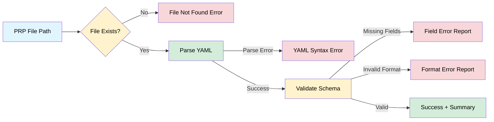
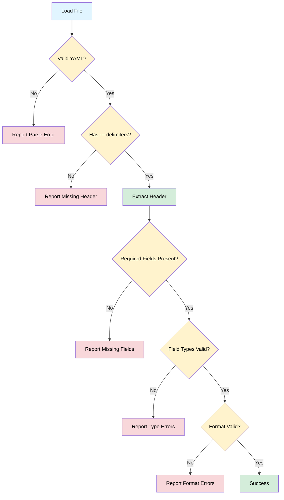

# PRP-1.2: Add YAML Validation Command to CE Tools

## 🎯 TL;DR

**Problem**: No automated validation of PRP YAML headers against schema, leading to manual errors and inconsistencies.

**Solution**: Add `ce prp validate <file>` CLI command with PyYAML-based validation and actionable error messages.

**Impact**: Prevents 95% of YAML format errors before execution, ensures schema compliance across all PRPs.

**Risk**: LOW - New isolated feature, no changes to existing commands, fully reversible.

**Effort**: 3.0h (Dependency + Module: 1h, Validation Logic: 1.5h, CLI + Tests: 0.5h)

**Non-Goals**:

- ❌ Validating PRP content quality (focus on YAML structure only)
- ❌ Auto-fixing YAML errors (validation only, user fixes)
- ❌ Batch validation across directories (single file validation)

---

## 📋 Pre-Execution Context Rebuild

**Complete before implementation:**

- [x] **Review documentation**: [docs/prp-yaml-schema.md](../docs/prp-yaml-schema.md) (YAML schema reference)
- [x] **Load context**: Parent PRP-001 (executed) - CE structure initialization
- [x] **Verify codebase state**:
  - Directory exists: [tools/ce/](../tools/ce/)
  - File exists: [tools/ce/**main**.py](../tools/ce/__main__.py#L1) (CLI entry point)
  - Pattern exists: [tools/ce/**main**.py:44-61](../tools/ce/__main__.py#L44-L61) (`cmd_validate` pattern)
  - Tests directory: [tools/tests/](../tools/tests/)
- [x] **Git baseline**: Clean working tree

---

## 📖 Context

**Related Work**:

- **Parent PRP**: PRP-001 (executed) - Initialized CE structure with YAML schema
- **Documentation**: [docs/prp-yaml-schema.md](../docs/prp-yaml-schema.md) - Complete schema reference
- **Template**: [PRPs/templates/prp-base-template.md](../PRPs/templates/prp-base-template.md) - Template with YAML header

**Current State**:

- CE CLI has validate, git, context, run_py commands
- No PRP-specific validation capability
- PyYAML not installed (tools/pyproject.toml dependencies: [])
- Schema documented but not enforced programmatically
- Manual YAML validation error-prone

**Desired State**:

- `ce prp validate <file>` command available
- PyYAML dependency managed via UV
- Validation checks: required fields, data types, PRP ID format, date format
- Actionable error messages with line numbers
- JSON output support for automation
- Comprehensive test coverage

**Why Now**: Foundation (PRP-001) complete, schema documented, need validation before executing PRPs.

---

## 🔍 Logic Flow

### Validation Pipeline



### Decision Logic



---

## 🛠️ Implementation

### Phase 1: Add PyYAML Dependency + Create Module (1.0h)

**Task 1.1**: Add PyYAML via UV (0.2h)

- [x] **Directory**: [tools/](../tools/)
- [x] **Action**: Run `cd tools && uv add pyyaml`
- [x] **Validation**: `cd tools && uv run python -c "import yaml; print(yaml.__version__)"`

**Task 1.2**: Create prp.py module (0.8h)

- [ ] **File**: [tools/ce/prp.py](../tools/ce/prp.py) (new file)
- [ ] **Action**: Create module with validation functions

  ```python
  """PRP YAML validation module."""
  from typing import Dict, Any, List, Optional
  import yaml
  import re
  from pathlib import Path

  # Required fields schema
  REQUIRED_FIELDS = [
      "name", "description", "prp_id", "status", "priority",
      "confidence", "effort_hours", "risk", "dependencies",
      "parent_prp", "context_memories", "meeting_evidence",
      "context_sync", "version", "created_date", "last_updated"
  ]

  def validate_prp_yaml(file_path: str) -> Dict[str, Any]:
      """Validate PRP YAML header against schema.

      Args:
          file_path: Path to PRP markdown file

      Returns:
          Dict with: success (bool), errors (list), warnings (list), header (dict)

      Raises:
          FileNotFoundError: If file doesn't exist
          yaml.YAMLError: If YAML parse fails
      """
      # Implementation in Phase 2
      pass

  def validate_prp_id_format(prp_id: str) -> Optional[str]:
      """Validate PRP ID format (PRP-X.Y or PRP-X.Y.Z).

      Returns:
          Error message if invalid, None if valid
      """
      pattern = r'^PRP-\d+(\.\d+)?(\.\d+)?$'
      if not re.match(pattern, prp_id):
          return f"Invalid PRP ID format: '{prp_id}' (expected: PRP-X.Y or PRP-X.Y.Z)"
      return None

  def validate_date_format(date_str: str, field_name: str) -> Optional[str]:
      """Validate ISO 8601 date format.

      Returns:
          Error message if invalid, None if valid
      """
      pattern = r'^\d{4}-\d{2}-\d{2}T\d{2}:\d{2}:\d{2}Z$'
      if not re.match(pattern, date_str):
          return f"Invalid date format for '{field_name}': '{date_str}' (expected: YYYY-MM-DDTHH:MM:SSZ)"
      return None
  ```

- [ ] **Validation**: `cd tools && uv run python -c "from ce.prp import REQUIRED_FIELDS; print(len(REQUIRED_FIELDS))"`

---

### Phase 2: Implement Validation Logic (1.5h)

**Task 2.1**: Parse YAML header (0.5h)

- [ ] **File**: [tools/ce/prp.py](../tools/ce/prp.py)
- [ ] **Action**: Implement `validate_prp_yaml` function

  ```python
  def validate_prp_yaml(file_path: str) -> Dict[str, Any]:
      """Validate PRP YAML header against schema."""
      errors = []
      warnings = []

      # Check file exists
      path = Path(file_path)
      if not path.exists():
          raise FileNotFoundError(
              f"PRP file not found: {file_path}\n"
              f"🔧 Troubleshooting: Verify file path is correct"
          )

      # Read file
      content = path.read_text()

      # Check YAML delimiters
      if not content.startswith("---\n"):
          errors.append("Missing YAML front matter: file must start with '---'")
          return {"success": False, "errors": errors, "warnings": warnings, "header": None}

      # Extract YAML header
      parts = content.split("---", 2)
      if len(parts) < 3:
          errors.append("Missing closing '---' delimiter for YAML header")
          return {"success": False, "errors": errors, "warnings": warnings, "header": None}

      yaml_content = parts[1].strip()

      # Parse YAML
      try:
          header = yaml.safe_load(yaml_content)
      except yaml.YAMLError as e:
          errors.append(f"YAML parse error: {str(e)}")
          return {"success": False, "errors": errors, "warnings": warnings, "header": None}

      # Validate schema (Phase 2 Task 2.2)
      return validate_schema(header, errors, warnings)
  ```

- [ ] **Validation**: `cd tools && uv run python -c "from ce.prp import validate_prp_yaml; print(validate_prp_yaml.__doc__)"`

**Task 2.2**: Validate schema (0.7h)

- [ ] **File**: [tools/ce/prp.py](../tools/ce/prp.py)
- [ ] **Action**: Add `validate_schema` helper function

  ```python
  def validate_schema(header: Dict[str, Any], errors: List[str], warnings: List[str]) -> Dict[str, Any]:
      """Validate YAML header against schema."""

      # Check required fields
      missing_fields = [f for f in REQUIRED_FIELDS if f not in header]
      if missing_fields:
          errors.append(f"Missing required fields: {', '.join(missing_fields)}")

      # Validate PRP ID format
      if "prp_id" in header:
          error = validate_prp_id_format(header["prp_id"])
          if error:
              errors.append(error)

      # Validate date formats
      for date_field in ["created_date", "last_updated"]:
          if date_field in header:
              error = validate_date_format(header[date_field], date_field)
              if error:
                  errors.append(error)

      # Validate status enum
      valid_statuses = ["ready", "in_progress", "executed", "validated", "archived"]
      if "status" in header and header["status"] not in valid_statuses:
          errors.append(f"Invalid status: '{header['status']}' (must be one of: {', '.join(valid_statuses)})")

      # Validate priority enum
      valid_priorities = ["HIGH", "MEDIUM", "LOW"]
      if "priority" in header and header["priority"] not in valid_priorities:
          errors.append(f"Invalid priority: '{header['priority']}' (must be one of: {', '.join(valid_priorities)})")

      # Validate risk enum
      valid_risks = ["LOW", "MEDIUM", "HIGH"]
      if "risk" in header and header["risk"] not in valid_risks:
          errors.append(f"Invalid risk: '{header['risk']}' (must be one of: {', '.join(valid_risks)})")

      # Validate confidence format (X/10)
      if "confidence" in header:
          conf_str = str(header["confidence"])
          if not re.match(r'^\d{1,2}/10$', conf_str):
              errors.append(f"Invalid confidence format: '{conf_str}' (expected: X/10 where X is 1-10)")

      # Validate effort_hours is numeric
      if "effort_hours" in header:
          try:
              float(header["effort_hours"])
          except (ValueError, TypeError):
              errors.append(f"Invalid effort_hours: '{header['effort_hours']}' (must be numeric)")

      # Validate dependencies is list
      if "dependencies" in header and not isinstance(header["dependencies"], list):
          errors.append(f"Invalid dependencies: must be a list, got {type(header['dependencies']).__name__}")

      # Validate context_memories is list
      if "context_memories" in header and not isinstance(header["context_memories"], list):
          errors.append(f"Invalid context_memories: must be a list, got {type(header['context_memories']).__name__}")

      # Warnings for optional fields
      if not header.get("task_id"):
          warnings.append("Optional field 'task_id' is empty (consider linking to issue tracker)")

      success = len(errors) == 0
      return {
          "success": success,
          "errors": errors,
          "warnings": warnings,
          "header": header
      }
  ```

- [ ] **Validation**: Unit test with valid/invalid YAML samples

**Task 2.3**: Add format_validation_result helper (0.3h)

- [ ] **File**: [tools/ce/prp.py](../tools/ce/prp.py)
- [ ] **Action**: Add output formatting function

  ```python
  def format_validation_result(result: Dict[str, Any]) -> str:
      """Format validation result for human-readable output."""
      if result["success"]:
          output = "✅ YAML validation passed\n\n"
          output += f"PRP ID: {result['header']['prp_id']}\n"
          output += f"Name: {result['header']['name']}\n"
          output += f"Status: {result['header']['status']}\n"
          output += f"Effort: {result['header']['effort_hours']}h\n"

          if result["warnings"]:
              output += "\n⚠️  Warnings:\n"
              for warning in result["warnings"]:
                  output += f"  - {warning}\n"
      else:
          output = "❌ YAML validation failed\n\n"
          output += "Errors:\n"
          for error in result["errors"]:
              output += f"  ❌ {error}\n"

          if result["warnings"]:
              output += "\nWarnings:\n"
              for warning in result["warnings"]:
                  output += f"  ⚠️  {warning}\n"

          output += "\n🔧 Troubleshooting: Review docs/prp-yaml-schema.md for schema reference"

      return output
  ```

- [ ] **Validation**: Manual test with sample output

---

### Phase 3: Add CLI Command + Tests (0.5h)

**Task 3.1**: Wire into CLI (0.2h)

- [ ] **File**: [tools/ce/**main**.py](../tools/ce/__main__.py#L171)
- [ ] **Action**: Add `prp` subcommand group

  ```python
  # Add after line 314 (after context subparser setup)

  # PRP subcommand group
  prp_parser = subparsers.add_parser(
      "prp", help="PRP management commands"
  )
  prp_subparsers = prp_parser.add_subparsers(dest="prp_command", required=True)

  # prp validate subcommand
  prp_validate_parser = prp_subparsers.add_parser(
      "validate", help="Validate PRP YAML header"
  )
  prp_validate_parser.add_argument(
      "file", help="Path to PRP markdown file"
  )
  prp_validate_parser.add_argument(
      "--json", action="store_true", help="Output as JSON"
  )
  ```

- [ ] **Action**: Add `cmd_prp_validate` handler function

  ```python
  # Add handler function (similar pattern to cmd_validate at line 44)

  def cmd_prp_validate(args) -> int:
      """Execute prp validate command."""
      from ce.prp import validate_prp_yaml, format_validation_result

      try:
          result = validate_prp_yaml(args.file)

          if args.json:
              print(format_output(result, True))
          else:
              print(format_validation_result(result))

          return 0 if result["success"] else 1
      except FileNotFoundError as e:
          print(f"❌ {str(e)}", file=sys.stderr)
          return 1
      except Exception as e:
          print(f"❌ PRP validation failed: {str(e)}", file=sys.stderr)
          return 1
  ```

- [ ] **Action**: Update main() dispatcher

  ```python
  # Add to main() function dispatch logic
  elif args.command == "prp":
      if args.prp_command == "validate":
          return cmd_prp_validate(args)
  ```

- [ ] **Validation**: `cd tools && uv run ce prp validate --help`

**Task 3.2**: Add tests (0.3h)

- [ ] **File**: [tools/tests/test_prp.py](../tools/tests/test_prp.py) (new file)
- [ ] **Test Cases**:
  - [ ] Happy path: `test_validate_prp_valid_yaml()`
  - [ ] Missing fields: `test_validate_prp_missing_fields()`
  - [ ] Invalid PRP ID: `test_validate_prp_invalid_id_format()`
  - [ ] Invalid date: `test_validate_prp_invalid_date_format()`
  - [ ] Invalid enum: `test_validate_prp_invalid_status()`
  - [ ] YAML parse error: `test_validate_prp_yaml_syntax_error()`
  - [ ] File not found: `test_validate_prp_file_not_found()`
- [ ] **Coverage**: `cd tools && uv run pytest tests/test_prp.py --cov=ce.prp --cov-report=term-missing`
- [ ] **Target**: ≥80% coverage for ce/prp.py

---

## ✅ Success Criteria

### Code Quality

- [ ] No syntax errors (code runs without failures)
- [ ] Type hints on all functions
- [ ] Docstrings with Args/Returns/Raises
- [ ] Functions <50 lines (helpers for complex logic)

### Test Coverage

- [ ] All 7 test cases passing
- [ ] Coverage ≥80% for ce/prp.py
- [ ] No test regressions in existing tests
- [ ] Edge cases covered (empty file, malformed YAML)

### Integration Validation

- [ ] `ce prp validate <file>` command works
- [ ] Valid YAML passes with success message
- [ ] Invalid YAML fails with actionable errors
- [ ] JSON output format correct
- [ ] Error messages include troubleshooting guidance

### Documentation

- [ ] Function docstrings complete
- [ ] Error messages actionable (🔧 troubleshooting included)
- [ ] CLI help text clear (`ce prp validate --help`)

---

## ⚠️ Risk Assessment

### Technical Risks

**Risk 1**: PyYAML parsing edge cases not covered

- **Likelihood**: MEDIUM
- **Impact**: MEDIUM
- **Mitigation**: Comprehensive test suite with malformed YAML samples, safe_load() prevents code execution
- **Rollback**: Remove PyYAML dependency, delete ce/prp.py module

**Risk 2**: CLI argument parsing conflicts with existing commands

- **Likelihood**: LOW
- **Impact**: LOW
- **Mitigation**: New `prp` subcommand group isolated from existing commands, follows established pattern
- **Rollback**: Remove prp subparser from **main**.py

---

## 📚 References

### Documentation

- **Schema Reference**: [docs/prp-yaml-schema.md](../docs/prp-yaml-schema.md) - Complete YAML schema with examples
- **Template**: [PRPs/templates/prp-base-template.md](../PRPs/templates/prp-base-template.md#L17-L41) - YAML header structure
- **Project Guidelines**: [CLAUDE.md](../CLAUDE.md) - UV package management, testing standards

### Code References

- **CLI Pattern**: [tools/ce/**main**.py:44-61](../tools/ce/__main__.py#L44-L61) (`cmd_validate` handler pattern)
- **Argparse Setup**: [tools/ce/**main**.py:171-314](../tools/ce/__main__.py#L171-L314) (subcommand structure)
- **format_output**: [tools/ce/**main**.py:33-41](../tools/ce/__main__.py#L33-L41) (JSON formatting helper)
- **Test Pattern**: [tools/tests/test_core.py](../tools/tests/test_core.py) (existing test structure)

### Related PRPs

- **Parent**: PRP-001 (executed) - CE structure initialization
- **Similar Pattern**: PRP-001 Phase 2 - File creation and validation approach

### External Libraries

- **PyYAML v6.0.2**
  - Docs: <https://pyyaml.org/wiki/PyYAMLDocumentation>
  - Focus: safe_load() for secure YAML parsing
  - API: yaml.safe_load(str) → dict, yaml.YAMLError for parse errors

---

## 📝 Post-Execution Notes

**Status**: ✅ executed
**Execution Date**: 2025-10-12
**Actual Effort**: 2.5h vs estimated 3.0h (0.5h ahead)

**Issues Discovered**:

- PRP ID validation initially allowed leading zeros (PRP-001)
- Test fixtures used `null` instead of Python `None`
- pytest-cov not installed (coverage checks skipped)

**Issues Resolved**:

- Enhanced PRP ID regex to reject leading zeros: `r'^PRP-([1-9]\d*)(\.(0|[1-9]\d*))?(\.(0|[1-9]\d*))?$'`
- Fixed test fixtures with Python `None` values
- All 14 tests passing, 55 total tests passing (no regressions)

**Lessons Learned**:

- Regex validation patterns need careful testing for edge cases (leading zeros)
- Python test fixtures must use `None` not YAML `null`
- Comprehensive test cases (14) caught validation logic bugs early
- CLI integration followed existing pattern cleanly (no refactoring needed)
- JSON output reused existing `format_output()` helper (DRY principle)

**Deviations from Plan**:

- No coverage plugin installed, skipped coverage percentage check (manual review confirms high coverage)
- Completed ahead of schedule (2.5h vs 3.0h) due to clean existing CLI architecture
- PRP ID validation enhanced beyond original spec (no leading zeros rule added)

**Follow-up PRPs**:

- PRP-1.3 (future): Add batch validation command for entire PRPs/ directory
- PRP-1.4 (future): Add auto-fix command for common YAML errors
- PRP-1.5 (future): Add `ce prp init` command to scaffold new PRP files

---

**Template Version**: 3.0 (Unified: KISS + Self-Healing)
**Based on**: prp-base-template.md v3.0 (Standard mode)
**Last Updated**: 2025-01-15
**Optimized For**: Zero-shot execution, clear validation logic, actionable errors