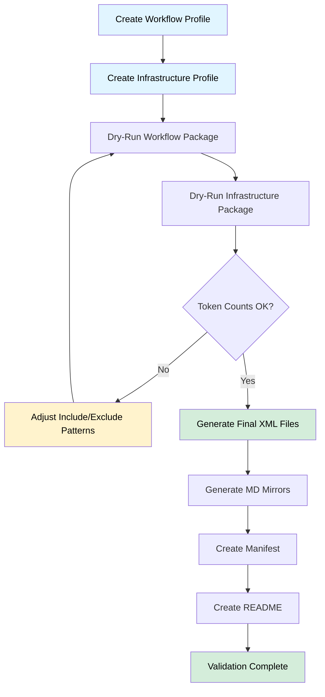

# PRP-32.1.2: Repomix Configuration & Profile Creation

## 🎯 TL;DR

**Problem**: CE framework documentation is scattered across 25+ files with no consolidated distribution format. Users need both workflow documentation (examples) and infrastructure files (memories, commands, tools) but currently must manually collect them.

**Solution**: Create 2 repomix configuration profiles that generate XML packages with different purposes:

1. **ce-workflow-docs.xml** - Reference Package (<60KB)
   - 21 workflow examples (IsWorkflow=Yes) + CLAUDE.md workflow sections
   - Stored at `.ce/examples/system/ce-workflow-docs.xml` (NOT extracted)
   - Purpose: Lightweight reference for workflow patterns

2. **ce-infrastructure.xml** - Installation Package (<150KB)
   - ALL framework files organized with `/system/` subfolders
   - Extracted during initialization (Phase 3: Repomix Package Handling)
   - Includes: 21 framework examples, 23 framework memories, 11 commands, tools source, CLAUDE.md sections
   - Creates: `.ce/examples/system/`, `.ce/PRPs/system/`, `.serena/memories/system/`

**Impact**:
- Enables one-command distribution of CE framework components
- Reduces token usage for new projects (consolidated XML vs scattered files)
- Provides human-readable mirrors (.md format) alongside XML
- Foundation for Syntropy MCP 1.1 release packages

**Risk**: LOW-MEDIUM
- File inclusion paths must be precise (wrong paths = missing content)
- Token size estimation critical (oversized packages defeat purpose)
- Phase 5 will regenerate with refined docs from Phase 4

**Effort**: 3.5h
- Repomix profile creation: 1h
- Dry-run validation + size tuning: 1h
- Documentation (manifest + README): 1h
- Testing both packages: 0.5h

**Non-Goals**:
- ❌ Creating new documentation content (use existing docs as-is)
- ❌ Modifying existing files (Phase 4 handles doc refinement)
- ❌ Implementing automated regeneration (Phase 5 task)
- ❌ Distribution/upload mechanisms (out of scope)

---

## 📋 Pre-Execution Context Rebuild

**Complete before implementation:**

- [ ] **Review documentation**:
  - examples/INDEX.md (workflow example catalog)
  - .serena/memories/*.md (identify universal vs project-specific)
  - .claude/commands/*.md (command documentation)

- [ ] **Verify file structure**:
  - Directory exists: examples/
  - Directory exists: .serena/memories/
  - Directory exists: .claude/commands/
  - Directory exists: tools/ce/
  - File exists: CLAUDE.md

- [ ] **Check repomix availability**:
  - Command exists: `which repomix` or `npx repomix --version`
  - Understanding of repomix YAML config format

- [ ] **Git baseline**: Clean working tree

---

## 📖 Context

**Related Work**:
- **Batch 32 Overview**: Syntropy MCP 1.1 Release finalization (5-phase plan)
- **Stage 1 Siblings**:
  - PRP-32.1.1 (Documentation Audit) - runs in parallel
  - PRP-32.1.3 (System Model Update) - runs in parallel
- **Phase Dependencies**: Phase 5 (PRP-32.5.1) will regenerate packages with refined docs from Phase 4

**Current State**:
- 25+ documentation files scattered across examples/, .serena/memories/, .claude/commands/
- No consolidated distribution format
- Manual file collection required for new projects
- Token counting manual and error-prone
- examples/INDEX.md contains IsWorkflow classification (21 Yes, 4 No)

**Desired State**:
- 2 repomix YAML profiles: .ce/repomix-profile-workflow.yml, .ce/repomix-profile-infrastructure.yml
- Generated XML packages:
  - .ce/ce-workflow-docs.xml (reference, <60KB)
  - .ce/ce-infrastructure.xml (installation with /system/ organization, <150KB)
- Human-readable mirrors: .ce/ce-workflow-docs.md, .ce/ce-infrastructure.md
- Manifest documentation: .ce/repomix-manifest.yml (documents what's in each package + /system/ structure)
- Usage guide: .ce/README-REPOMIX.md (how to use packages + initialization workflow)
- Post-processing script: .ce/reorganize-infrastructure.sh (adds /system/ subfolders to ce-infrastructure.xml)
- Total packages <210KB (<60KB + <150KB)

**Why Now**:
- Foundation for Syntropy MCP 1.1 release
- Stage 1 task (can run parallel with doc audit and system model update)
- Uses current docs as-is (no dependency on Phase 4 doc refinement)

---

## 🔍 Logic Flow

### Repomix Package Generation Pipeline



### File Selection Logic

**Workflow Package Decision Tree**:
```
examples/**/*.md → Check INDEX.md IsWorkflow?
  ├─ Yes → Include
  ├─ No → Exclude
  └─ Not Listed → Exclude (safe default)

CLAUDE.md → Extract sections:
  ├─ Include: Quick Commands, PRP Sizing, Testing Patterns
  ├─ Include: Batch PRP Generation, Git Worktree
  └─ Exclude: Installation, Troubleshooting (project-specific)
```

**Infrastructure Package Decision Tree**:
```
.serena/memories/*.md → Universal or project-specific?
  ├─ Universal (6 files):
  │   ├─ code-style-conventions.md
  │   ├─ suggested-commands.md
  │   ├─ task-completion-checklist.md
  │   ├─ testing-standards.md
  │   ├─ tool-usage-syntropy.md
  │   └─ use-syntropy-tools-not-bash.md
  └─ Project-specific → Exclude

.claude/commands/*.md → Framework commands only (all 7 included)

tools/ce/*.py → All source files + pyproject.toml
tools/tests/ → Excluded (too large, users can write own tests)
```

---

## 🛠️ Implementation Steps

### Phase 1: Workflow Documentation Package (1.5h)

**Step 1.1: Create Workflow Profile (.ce/repomix-profile-workflow.yml)**

```yaml
# Repomix Configuration: CE Framework Workflow Documentation
# Output: .ce/ce-workflow-docs.xml
# Target Size: <60KB
# Description: Workflow examples and patterns from CE framework

output:
  filePath: .ce/ce-workflow-docs.xml
  style: xml
  topFilesLength: 5
  showLineNumbers: true
  copyToClipboard: false
  instructionFilePath: null

include:
  # Workflow examples (IsWorkflow=Yes from INDEX.md)
  - "examples/patterns/*.md"
  - "examples/*.md"
  - "!examples/README.md"  # Exclude (redundant with INDEX.md)

  # CLAUDE.md workflow sections only (extract manually if needed)
  - "CLAUDE.md"

exclude:
  # Project-specific examples (IsWorkflow=No)
  - "examples/model/SystemModel.md"
  - "examples/example.setting.local.md"
  - "examples/linear-integration-example.md"
  - "examples/tmp-directory-convention.md"

  # System files
  - ".git"
  - ".tmp"
  - "node_modules"
  - "__pycache__"

ignore:
  customPatterns: []

security:
  enableSecurityCheck: true
```

**Validation**:
```bash
cd /Users/bprzybyszi/nc-src/ctx-eng-plus
npx repomix --config .ce/repomix-profile-workflow.yml --dry-run
# Expected: ~21 files included, <60KB estimated size
```

**Step 1.2: Generate Workflow Package**

```bash
npx repomix --config .ce/repomix-profile-workflow.yml
# Output: .ce/ce-workflow-docs.xml

# Verify token count (rough estimate: 1 token ≈ 4 chars)
wc -c .ce/ce-workflow-docs.xml
# Expected: <240,000 characters (~60KB tokens)

# Create human-readable mirror
npx repomix --config .ce/repomix-profile-workflow.yml --style markdown --output .ce/ce-workflow-docs.md
```

---

### Phase 2: Infrastructure Package (2.5h)

**IMPORTANT**: This package contains ALL framework files organized for extraction to `/system/` subfolders.

**Step 2.1: Create Infrastructure Profile (.ce/repomix-profile-infrastructure.yml)**

```yaml
# Repomix Configuration: CE Framework Complete Installation Package
# Output: .ce/ce-infrastructure.xml
# Target Size: <150KB
# Description: ALL framework files (examples, memories, commands, tools, CLAUDE.md sections)
# Post-processing: Requires reorganization to add /system/ subfolders

output:
  filePath: .ce/ce-infrastructure.xml
  style: xml
  topFilesLength: 5
  showLineNumbers: true
  copyToClipboard: false
  instructionFilePath: null

include:
  # Framework Examples (IsWorkflow=Yes, 21 files) → .ce/examples/system/
  - "examples/patterns/*.md"
  - "examples/workflows/*.md"
  - "examples/TOOL-USAGE-GUIDE.md"
  - "examples/prp-decomposition-patterns.md"
  - "examples/syntropy-context7-guide.md"
  - "examples/syntropy-linear-integration.md"
  - "examples/syntropy-serena-memory-system.md"
  - "examples/syntropy-thinking-sequential.md"
  - "examples/syntropy-status-hook-system.md"
  - "examples/batch-prp-generation-parallel.md"
  - "examples/prp-execution-workflow.md"
  - "examples/vacuum-temp-cleanup.md"
  - "examples/drift-detection-analysis.md"
  # (Add remaining framework examples from INDEX.md IsWorkflow=Yes)

  # Framework Memories (23 files) → .serena/memories/system/
  - ".serena/memories/code-style-conventions.md"
  - ".serena/memories/suggested-commands.md"
  - ".serena/memories/task-completion-checklist.md"
  - ".serena/memories/testing-standards.md"
  - ".serena/memories/tool-usage-syntropy.md"
  - ".serena/memories/use-syntropy-tools-not-bash.md"
  - ".serena/memories/*.md"  # Include all framework memories

  # Framework Commands (11 files) → .claude/commands/
  - ".claude/commands/*.md"

  # Tool Source Code → tools/
  - "tools/ce/*.py"
  - "tools/pyproject.toml"

  # CLAUDE.md Framework Sections → CLAUDE.md
  - "CLAUDE.md"

exclude:
  # Project-specific examples (IsWorkflow=No)
  - "examples/model/SystemModel.md"
  - "examples/example.setting.local.md"
  - "examples/linear-integration-example.md"
  - "examples/tmp-directory-convention.md"

  # Project-specific memories (non-framework)
  - ".serena/memories/codebase-structure.md"
  - ".serena/memories/project-overview.md"
  - ".serena/memories/PRP-*.md"
  - ".serena/memories/*-pattern.md"
  - ".serena/memories/*-implementation*.md"

  # Test files
  - "tools/tests"

  # System files
  - ".git"
  - ".tmp"
  - "__pycache__"
  - "*.pyc"

ignore:
  customPatterns: []

security:
  enableSecurityCheck: true
```

**Validation**:
```bash
npx repomix --config .ce/repomix-profile-infrastructure.yml --dry-run
# Expected: 21 examples + 23 memories + 11 commands + ~30 .py files + CLAUDE.md = ~85 files, <150KB
```

**Step 2.2: Generate Infrastructure Package (Initial)**

```bash
npx repomix --config .ce/repomix-profile-infrastructure.yml
# Output: .ce/ce-infrastructure.xml (flat structure, needs reorganization)

# Verify token count
wc -c .ce/ce-infrastructure.xml
# Expected: <600,000 characters (~150KB tokens)

# Create human-readable mirror
npx repomix --config .ce/repomix-profile-infrastructure.yml --style markdown --output .ce/ce-infrastructure.md
```

**Step 2.3: Post-Process to Add /system/ Organization**

Create `.ce/reorganize-infrastructure.sh`:

```bash
#!/bin/bash
# Post-process ce-infrastructure.xml to add /system/ subfolders
# This script reorganizes the extracted package to match CE 1.1 structure

set -e

echo "Reorganizing ce-infrastructure.xml with /system/ subfolders..."

# Extract to temp
mkdir -p .tmp/repomix-reorganize/
npx repomix --unpack .ce/ce-infrastructure.xml --target .tmp/repomix-reorganize/

# Create /system/ structure
mkdir -p .tmp/repomix-final/.ce/examples/system/
mkdir -p .tmp/repomix-final/.ce/PRPs/system/executed/
mkdir -p .tmp/repomix-final/.serena/memories/system/

# Move framework files to /system/ subfolders
echo "Moving examples to .ce/examples/system/..."
mv .tmp/repomix-reorganize/examples/*.md .tmp/repomix-final/.ce/examples/system/ 2>/dev/null || true
mv .tmp/repomix-reorganize/examples/patterns/*.md .tmp/repomix-final/.ce/examples/system/ 2>/dev/null || true
mv .tmp/repomix-reorganize/examples/workflows/*.md .tmp/repomix-final/.ce/examples/system/ 2>/dev/null || true

echo "Moving memories to .serena/memories/system/..."
mv .tmp/repomix-reorganize/.serena/memories/*.md .tmp/repomix-final/.serena/memories/system/ 2>/dev/null || true

# Keep root files at root
echo "Preserving root files..."
cp -R .tmp/repomix-reorganize/.claude/ .tmp/repomix-final/
cp -R .tmp/repomix-reorganize/tools/ .tmp/repomix-final/
cp .tmp/repomix-reorganize/CLAUDE.md .tmp/repomix-final/

# Repack with /system/ organization
echo "Repacking with /system/ structure..."
cd .tmp/repomix-final/
npx repomix --pack --output ../../.ce/ce-infrastructure-system.xml

echo "✓ Reorganized package created: .ce/ce-infrastructure-system.xml"
echo "✓ Replace .ce/ce-infrastructure.xml with ce-infrastructure-system.xml when ready"
```

**Step 2.4: Run Reorganization**

```bash
# Make executable
chmod +x .ce/reorganize-infrastructure.sh

# Run reorganization
.ce/reorganize-infrastructure.sh

# Replace original with reorganized version
mv .ce/ce-infrastructure-system.xml .ce/ce-infrastructure.xml

# Validate /system/ structure
npx repomix --unpack .ce/ce-infrastructure.xml --target .tmp/validation/
test -d .tmp/validation/.ce/examples/system && echo "✓ Examples /system/ structure"
test -d .tmp/validation/.ce/PRPs/system && echo "✓ PRPs /system/ structure"
test -d .tmp/validation/.serena/memories/system && echo "✓ Memories /system/ structure"
```

**Step 2.5: Move Packages to ce-32/builds/**

```bash
# Create builds directory
mkdir -p ce-32/builds/

# Move generated packages to builds folder
mv .ce/ce-workflow-docs.xml ce-32/builds/
mv .ce/ce-infrastructure.xml ce-32/builds/

echo "✓ Packages moved to ce-32/builds/"
```

**Purpose**: Centralize repomix builds in ce-32/ folder for PRP-32 processing

**Note**: ce-32/ is ctx-eng-plus development artifact, not distributed to target projects

---

### Phase 3: Documentation (1h)

**Step 3.1: Create Manifest (.ce/repomix-manifest.yml)**

```yaml
# CE Framework Repomix Packages Manifest
# Documents contents of distribution packages

version: "1.0.0"
generated: "2025-11-04T00:00:00Z"

packages:
  workflow_docs:
    file: .ce/ce-workflow-docs.xml
    mirror: .ce/ce-workflow-docs.md
    profile: .ce/repomix-profile-workflow.yml
    description: "Workflow examples and patterns from CE framework"
    target_size: "<60KB"
    contents:
      - type: "examples"
        count: 21
        filter: "IsWorkflow=Yes from examples/INDEX.md"
        files:
          - "examples/patterns/*.md"
          - "examples/TOOL-USAGE-GUIDE.md"
          - "examples/prp-decomposition-patterns.md"
          - "examples/syntropy-status-hook-system.md"
          # ... (full list)
      - type: "documentation"
        count: 1
        filter: "Workflow sections only"
        files:
          - "CLAUDE.md (Quick Commands, PRP Sizing, Batch PRP Generation, Git Worktree)"

    excluded:
      - "examples/model/SystemModel.md (IsWorkflow=No)"
      - "examples/example.setting.local.md (project-specific)"
      - "examples/linear-integration-example.md (project-specific)"
      - "examples/tmp-directory-convention.md (project-specific)"

    use_cases:
      - "New project onboarding (workflow patterns)"
      - "PRP generation reference (decomposition patterns)"
      - "Command usage examples (slash commands, ce tools)"

  infrastructure:
    file: .ce/ce-infrastructure.xml
    mirror: .ce/ce-infrastructure.md
    profile: .ce/repomix-profile-infrastructure.yml
    post_process: .ce/reorganize-infrastructure.sh
    description: "Complete CE framework installation package with /system/ organization"
    target_size: "<150KB"
    organization: "Requires post-processing to add /system/ subfolders"
    contents:
      - type: "examples"
        count: 21
        destination: ".ce/examples/system/"
        filter: "IsWorkflow=Yes from examples/INDEX.md"
        files:
          - "examples/patterns/*.md"
          - "examples/workflows/*.md"
          - "examples/TOOL-USAGE-GUIDE.md"
          - "examples/prp-decomposition-patterns.md"
          - "examples/syntropy-status-hook-system.md"
          # All 21 framework workflow examples

      - type: "memories"
        count: 23
        destination: ".serena/memories/system/"
        filter: "All framework memories (6 critical + 17 regular)"
        critical:
          - "code-style-conventions.md"
          - "suggested-commands.md"
          - "task-completion-checklist.md"
          - "testing-standards.md"
          - "tool-usage-syntropy.md"
          - "use-syntropy-tools-not-bash.md"
        regular:
          - "batch-generation-patterns.md"
          - "ce-tool-patterns.md"
          - "complexity-estimation.md"
          - "context-drift-monitoring.md"
          - "file-structure-best-practices.md"
          - "git-worktree-patterns.md"
          - "prp-execution-checklist.md"
          - "prp-sizing-thresholds.md"
          - "sequential-thinking-usage.md"
          - "syntropy-mcp-architecture.md"
          - "syntropy-tool-management.md"
          - "testing-strategy-pattern.md"
          - "token-optimization-strategies.md"
          - "tool-selection-decision-tree.md"
          - "validation-levels.md"
          - "worktree-conflict-resolution.md"
          - "xml-package-generation.md"

      - type: "commands"
        count: 11
        destination: ".claude/commands/"
        filter: "All framework slash commands"
        files:
          - "batch-exe-prp.md"
          - "batch-gen-prp.md"
          - "denoise.md"
          - "execute-prp.md"
          - "generate-prp.md"
          - "peer-review.md"
          - "sync-with-syntropy.md"
          - "syntropy-health.md"
          - "tools-misuse-scan.md"
          - "update-context.md"
          - "vacuum.md"

      - type: "tools"
        count: 33
        destination: "tools/"
        filter: "All CE tool source code"
        files:
          - "ce/*.py (all modules)"
          - "pyproject.toml"

      - type: "documentation"
        count: 1
        destination: "CLAUDE.md (framework sections only)"
        filter: "Framework sections for blending"
        sections:
          - "Communication"
          - "Core Principles"
          - "UV Package Management"
          - "Ad-Hoc Code Policy"
          - "Quick Commands"
          - "Tool Naming Convention"
          - "Allowed Tools Summary"
          - "Command Permissions"
          - "Quick Tool Selection"
          - "Project Structure"
          - "Testing Standards"
          - "Code Quality"

    excluded:
      - ".serena/memories/*-pattern.md (project-specific patterns if not framework)"
      - ".serena/memories/PRP-*.md (implementation memories)"
      - ".serena/memories/project-overview.md (project-specific)"
      - "examples/model/SystemModel.md (IsWorkflow=No)"
      - "examples/example.setting.local.md (project-specific)"
      - "examples/linear-integration-example.md (project-specific)"
      - "examples/tmp-directory-convention.md (project-specific)"
      - "tools/tests/ (users write own tests)"
      - ".ce/PRPs/ (PRPs stay in Syntropy, not distributed)"

    use_cases:
      - "Complete framework installation (first-time setup)"
      - "CE 1.1 initialization with /system/ organization"
      - "Serena memory population (23 framework memories)"
      - "Command and tool installation (11 commands + 33 tool files)"
      - "CLAUDE.md framework section blending"

regeneration:
  schedule: "After framework documentation updates"
  trigger: "Framework documentation changes"
  automated: false
  notes: "Manual regeneration required after documentation updates"
```

**Step 3.2: Create README (.ce/README-REPOMIX.md)**

```markdown
# CE Framework Repomix Packages

Distribution packages for Context Engineering framework components.

## Overview

Two consolidated XML packages containing CE framework documentation and infrastructure:

1. **Workflow Documentation** (.ce/ce-workflow-docs.xml)
   - 21 workflow examples (IsWorkflow=Yes)
   - CLAUDE.md workflow sections
   - Target: <60KB tokens
   - Location: Stored at `.ce/examples/system/ce-workflow-docs.xml` (NOT extracted)

2. **Infrastructure Files** (.ce/ce-infrastructure.xml)
   - 21 framework examples → `.ce/examples/system/`
   - 23 framework memories (6 critical + 17 regular) → `.serena/memories/system/`
   - 11 framework slash commands → `.claude/commands/`
   - 33 CE tool source files → `tools/`
   - CLAUDE.md framework sections (for blending)
   - Target: <150KB tokens
   - Requires: Post-processing with `.ce/reorganize-infrastructure.sh` for /system/ organization

**Total Size**: <210KB tokens (both packages combined)

## Package Contents

See [.ce/repomix-manifest.yml](.ce/repomix-manifest.yml) for detailed contents and file lists.

## Usage

### Generate Packages

```bash
# Workflow documentation package
npx repomix --config .ce/repomix-profile-workflow.yml

# Infrastructure package
npx repomix --config .ce/repomix-profile-infrastructure.yml

# Both packages
npx repomix --config .ce/repomix-profile-workflow.yml && \
npx repomix --config .ce/repomix-profile-infrastructure.yml
```

### Verify Token Counts

```bash
# Workflow package (expect <60KB)
wc -c ce-32/builds/ce-workflow-docs.xml

# Infrastructure package (expect <150KB)
wc -c ce-32/builds/ce-infrastructure.xml

# Total (expect <210KB)
wc -c ce-32/builds/ce-*.xml

# Verify /system/ organization (after post-processing)
ls -la .ce/examples/system/
ls -la .serena/memories/system/
ls -la .claude/commands/
```

### View Human-Readable Versions

```bash
# Markdown mirrors generated alongside XML
cat .ce/ce-workflow-docs.md
cat .ce/ce-infrastructure.md
```

## Use Cases

### New Project Onboarding

```bash
# Copy workflow examples to new project
cp .ce/ce-workflow-docs.xml /path/to/new-project/docs/

# Initialize with infrastructure
cp .ce/ce-infrastructure.xml /path/to/new-project/docs/
```

### Distribution

```bash
# Upload to documentation site
aws s3 cp .ce/ce-workflow-docs.xml s3://docs/ce-framework/
aws s3 cp .ce/ce-infrastructure.xml s3://docs/ce-framework/

# Or attach to GitHub release
gh release upload v1.1 .ce/ce-workflow-docs.xml .ce/ce-infrastructure.xml
```

### Token Analysis

```bash
# Estimate token usage (rough: 1 token ≈ 4 chars)
echo "Workflow: $(($(wc -c < ce-32/builds/ce-workflow-docs.xml) / 4)) tokens"
echo "Infrastructure: $(($(wc -c < ce-32/builds/ce-infrastructure.xml) / 4)) tokens"
```

## Profiles

### Workflow Profile (.ce/repomix-profile-workflow.yml)

- **Includes**: examples/patterns/*.md, CLAUDE.md (workflow sections)
- **Excludes**: Project-specific examples (IsWorkflow=No in INDEX.md)
- **Output**: .ce/ce-workflow-docs.xml, .ce/ce-workflow-docs.md

### Infrastructure Profile (.ce/repomix-profile-infrastructure.yml)

- **Includes**: 21 framework examples, 23 framework memories (6 critical + 17 regular), 11 commands, 33 tool files, CLAUDE.md framework sections
- **Excludes**: Project-specific examples/memories, tests/, .ce/PRPs/
- **Post-processing**: `.ce/reorganize-infrastructure.sh` adds /system/ organization
- **Output**: .ce/ce-infrastructure.xml, .ce/ce-infrastructure.md (with /system/ subfolders)

## Regeneration

Packages can be regenerated when framework documentation is updated.

**Trigger**: Documentation updates or framework refinement

**Process**:
1. Complete documentation updates
2. Rerun repomix with existing profiles
3. New packages incorporate updated documentation
4. Manifest updated with new file counts/sizes

## Notes

- **Initial Generation**: Uses current framework documentation as-is
- **Regeneration**: Update packages after framework documentation changes
- **Size Monitoring**: If packages exceed targets, adjust include/exclude patterns
- **Validation**: Dry-run before generating to verify file counts and sizes

## Troubleshooting

### Package Too Large

```bash
# Check file sizes
npx repomix --config .ce/repomix-profile-workflow.yml --dry-run
npx repomix --config .ce/repomix-profile-infrastructure.yml --dry-run

# Adjust exclude patterns in profiles to remove large files
```

### Missing Files

```bash
# Verify include patterns match files
find examples -name "*.md" | grep -v "examples/model"
find .serena/memories -name "*.md" | grep -E "(code-style|suggested-commands|task-completion|testing-standards|tool-usage-syntropy|use-syntropy)"
```

### Repomix Not Found

```bash
# Install repomix globally
npm install -g repomix

# Or use npx (no install needed)
npx repomix --version
```

---

**Version**: 1.0.0
**Last Updated**: 2025-11-04
```

---

### Phase 4: Testing & Validation (0.5h)

**Step 4.1: Dry-Run Validation**

```bash
# Test workflow profile
npx repomix --config .ce/repomix-profile-workflow.yml --dry-run > /tmp/workflow-dryrun.txt
cat /tmp/workflow-dryrun.txt
# Verify: ~21 files, no errors

# Test infrastructure profile
npx repomix --config .ce/repomix-profile-infrastructure.yml --dry-run > /tmp/infra-dryrun.txt
cat /tmp/infra-dryrun.txt
# Verify: 21 examples + 23 memories + 11 commands + 33 tools = ~88 files
```

**Step 4.2: Generate Both Packages**

```bash
# Generate workflow package
npx repomix --config .ce/repomix-profile-workflow.yml
npx repomix --config .ce/repomix-profile-workflow.yml --style markdown --output .ce/ce-workflow-docs.md

# Generate infrastructure package
npx repomix --config .ce/repomix-profile-infrastructure.yml
npx repomix --config .ce/repomix-profile-infrastructure.yml --style markdown --output .ce/ce-infrastructure.md

# Post-process infrastructure package to add /system/ organization
bash .ce/reorganize-infrastructure.sh
```

**Step 4.3: Token Count Verification**

```bash
# Character counts (1 token ≈ 4 chars)
WORKFLOW_CHARS=$(wc -c < ce-32/builds/ce-workflow-docs.xml)
INFRA_CHARS=$(wc -c < ce-32/builds/ce-infrastructure.xml)
TOTAL_CHARS=$((WORKFLOW_CHARS + INFRA_CHARS))

WORKFLOW_TOKENS=$((WORKFLOW_CHARS / 4))
INFRA_TOKENS=$((INFRA_CHARS / 4))
TOTAL_TOKENS=$((TOTAL_CHARS / 4))

echo "Workflow: $WORKFLOW_TOKENS tokens (target <60K)"
echo "Infrastructure: $INFRA_TOKENS tokens (target <150K)"
echo "Total: $TOTAL_TOKENS tokens (target <210K)"

# Validation
test $WORKFLOW_TOKENS -lt 60000 && echo "✓ Workflow size OK" || echo "✗ Workflow too large"
test $INFRA_TOKENS -lt 150000 && echo "✓ Infrastructure size OK" || echo "✗ Infrastructure too large"
test $TOTAL_TOKENS -lt 210000 && echo "✓ Total size OK" || echo "✗ Total too large"
```

**Step 4.4: Content Verification**

```bash
# Verify workflow package contains workflow examples
grep -c "examples/patterns" .ce/ce-workflow-docs.xml
# Expected: 21+ occurrences

# Verify infrastructure package contains 23 memories
grep -c ".serena/memories/system" .ce/ce-infrastructure.xml
# Expected: 23 occurrences

# Verify infrastructure package contains 11 commands
grep -c ".claude/commands" .ce/ce-infrastructure.xml
# Expected: 11+ occurrences

# Verify infrastructure package contains 21 examples
grep -c ".ce/examples/system" .ce/ce-infrastructure.xml
# Expected: 21+ occurrences

# Verify infrastructure package contains tool source
grep -c "tools/ce" .ce/ce-infrastructure.xml
# Expected: 33+ occurrences
```

---

## ✅ Validation Gates

### Gate 1: Profile Syntax Valid

**Command**:
```bash
# Workflow profile
npx repomix --config .ce/repomix-profile-workflow.yml --dry-run

# Infrastructure profile
npx repomix --config .ce/repomix-profile-infrastructure.yml --dry-run
```

**Expected Output**: "Dry run completed successfully" (no YAML parse errors)

**On Failure**: Review YAML syntax, fix indentation/formatting

---

### Gate 2: File Inclusion Correct

**Workflow Package**:
```bash
npx repomix --config .ce/repomix-profile-workflow.yml --dry-run | grep "Files to process:"
# Expected: 21+ files (workflow examples + CLAUDE.md)
```

**Infrastructure Package**:
```bash
npx repomix --config .ce/repomix-profile-infrastructure.yml --dry-run | grep "Files to process:"
# Expected: 88+ files (21 examples + 23 memories + 11 commands + 33 tools)
```

**On Failure**: Adjust include/exclude patterns in profiles

---

### Gate 3: XML Generation Success

**Command**:
```bash
# Generate both packages
npx repomix --config .ce/repomix-profile-workflow.yml
npx repomix --config .ce/repomix-profile-infrastructure.yml

# Post-process infrastructure package for /system/ organization
bash .ce/reorganize-infrastructure.sh

# Verify files exist
ls -lh .ce/ce-workflow-docs.xml
ls -lh .ce/ce-infrastructure.xml
```

**Expected Output**: Both .xml files exist, non-zero size, /system/ subdirectories created

**On Failure**: Check repomix error messages, verify file paths, check post-processing script

---

### Gate 4: Token Counts Within Target

**Command**:
```bash
# Run token count script (from Step 4.3)
WORKFLOW_TOKENS=$(( $(wc -c < ce-32/builds/ce-workflow-docs.xml) / 4 ))
INFRA_TOKENS=$(( $(wc -c < ce-32/builds/ce-infrastructure.xml) / 4 ))
TOTAL_TOKENS=$((WORKFLOW_TOKENS + INFRA_TOKENS))
echo "Workflow: $WORKFLOW_TOKENS tokens (<60K target)"
echo "Infrastructure: $INFRA_TOKENS tokens (<150K target)"
echo "Total: $TOTAL_TOKENS tokens (<210K target)"
```

**Expected Output**:
- Workflow: <60,000 tokens
- Infrastructure: <150,000 tokens
- Total: <210,000 tokens

**On Failure**:
- Too large → Add more exclude patterns (remove large files)
- Too small → Verify all intended files included

---

### Gate 5: Markdown Mirrors Generated

**Command**:
```bash
ls -lh .ce/ce-workflow-docs.md
ls -lh .ce/ce-infrastructure.md
```

**Expected Output**: Both .md files exist, non-zero size

**On Failure**: Regenerate with `--style markdown` flag

---

### Gate 6: Documentation Complete

**Command**:
```bash
# Verify manifest exists
test -f .ce/repomix-manifest.yml && echo "✓ Manifest exists" || echo "✗ Manifest missing"

# Verify README exists
test -f .ce/README-REPOMIX.md && echo "✓ README exists" || echo "✗ README missing"

# Verify manifest contains both packages
grep -q "workflow_docs:" .ce/repomix-manifest.yml && echo "✓ Workflow documented" || echo "✗ Workflow missing"
grep -q "infrastructure:" .ce/repomix-manifest.yml && echo "✓ Infrastructure documented" || echo "✗ Infrastructure missing"
```

**Expected Output**: All checks pass (✓)

**On Failure**: Create missing documentation files (Steps 3.1-3.2)

---

### Gate 7: /system/ Organization Verified

**Command**:
```bash
# Verify /system/ subdirectories exist with correct files
test -d .ce/examples/system && echo "✓ .ce/examples/system/ exists" || echo "✗ Missing"
test -d .serena/memories/system && echo "✓ .serena/memories/system/ exists" || echo "✗ Missing"

# Count files in /system/ directories
EXAMPLES_COUNT=$(find .ce/examples/system -name "*.md" | wc -l)
MEMORIES_COUNT=$(find .serena/memories/system -name "*.md" | wc -l)
echo "Examples in /system/: $EXAMPLES_COUNT (expected: 21)"
echo "Memories in /system/: $MEMORIES_COUNT (expected: 23)"

# Verify commands at root (NOT in /system/)
test -d .claude/commands && echo "✓ .claude/commands/ at root" || echo "✗ Missing"
COMMANDS_COUNT=$(find .claude/commands -name "*.md" | wc -l)
echo "Commands: $COMMANDS_COUNT (expected: 11)"
```

**Expected Output**:
- All /system/ directories exist
- 21 examples in .ce/examples/system/
- 23 memories in .serena/memories/system/
- 11 commands in .claude/commands/ (root, not /system/)

**On Failure**: Re-run post-processing script (.ce/reorganize-infrastructure.sh)

---

## 🧪 Testing Strategy

### Test Framework
Manual validation (no automated tests for repomix configs)

### Test Commands

```bash
# Full validation pipeline
cd /Users/bprzybyszi/nc-src/ctx-eng-plus

# 1. Dry-run both profiles
npx repomix --config .ce/repomix-profile-workflow.yml --dry-run
npx repomix --config .ce/repomix-profile-infrastructure.yml --dry-run

# 2. Generate packages
npx repomix --config .ce/repomix-profile-workflow.yml
npx repomix --config .ce/repomix-profile-infrastructure.yml

# 3. Post-process infrastructure package for /system/ organization
bash .ce/reorganize-infrastructure.sh

# 4. Generate markdown mirrors
npx repomix --config .ce/repomix-profile-workflow.yml --style markdown --output .ce/ce-workflow-docs.md
npx repomix --config .ce/repomix-profile-infrastructure.yml --style markdown --output .ce/ce-infrastructure.md

# 5. Verify token counts
WORKFLOW_TOKENS=$(( $(wc -c < ce-32/builds/ce-workflow-docs.xml) / 4 ))
INFRA_TOKENS=$(( $(wc -c < ce-32/builds/ce-infrastructure.xml) / 4 ))
TOTAL_TOKENS=$((WORKFLOW_TOKENS + INFRA_TOKENS))
echo "Workflow: $WORKFLOW_TOKENS tokens (target <60K)"
echo "Infrastructure: $INFRA_TOKENS tokens (target <150K)"
echo "Total: $TOTAL_TOKENS tokens (target <210K)"

# 6. Content verification
grep -c "examples/patterns" .ce/ce-workflow-docs.xml  # Expect 21+
grep -c ".serena/memories/system" .ce/ce-infrastructure.xml   # Expect 23
grep -c ".claude/commands" .ce/ce-infrastructure.xml   # Expect 11
grep -c ".ce/examples/system" .ce/ce-infrastructure.xml   # Expect 21

# 7. /system/ organization verification
find .ce/examples/system -name "*.md" | wc -l  # Expect 21
find .serena/memories/system -name "*.md" | wc -l  # Expect 23
find .claude/commands -name "*.md" | wc -l  # Expect 11

# 8. Documentation verification
test -f .ce/repomix-manifest.yml && echo "✓ Manifest" || echo "✗ Manifest"
test -f .ce/README-REPOMIX.md && echo "✓ README" || echo "✗ README"
```

### Test Scenarios

**Scenario 1: Workflow Package Too Large**
- **Cause**: Too many files included or large CLAUDE.md sections
- **Resolution**: Add more exclude patterns, reduce CLAUDE.md extraction
- **Verification**: Rerun dry-run, verify new token count

**Scenario 2: Missing Framework Memories**
- **Cause**: Typo in memory file paths or wrong exclusion
- **Resolution**: Fix paths in infrastructure profile, verify with `ls .serena/memories/*.md` (should be 23 files)
- **Verification**: Rerun infrastructure package generation, check `grep -c ".serena/memories/system" .ce/ce-infrastructure.xml` (expect 23)

**Scenario 3: Commands Not Included**
- **Cause**: Incorrect glob pattern or exclusion
- **Resolution**: Fix `.claude/commands/*.md` pattern, ensure no conflicting excludes
- **Verification**: Grep for command count in infrastructure package

---

## 🚀 Rollout Plan

### Phase 1: Development (Local)

**Step 1**: Create repomix profiles in .ce/ directory
**Step 2**: Dry-run validation for both profiles
**Step 3**: Generate XML packages and markdown mirrors
**Step 4**: Create manifest and README documentation

**Validation**: All 7 validation gates pass (including /system/ organization)

---

### Phase 2: Review

**Step 1**: Review generated packages for completeness
- Workflow package contains 21 workflow examples
- Infrastructure package contains 21 examples, 23 memories, 11 commands, 33 tools with /system/ organization
- Token counts within targets (<60KB workflow, <150KB infrastructure, <210KB total)

**Step 2**: Review documentation
- Manifest documents all included/excluded files
- README provides clear usage instructions

**Step 3**: Test package usability
- Can workflow package be loaded into Claude?
- Can infrastructure package be extracted and used?

---

### Phase 3: Commit & Merge

**Step 1**: Commit new files to repository
```bash
git add .ce/repomix-profile-*.yml
git add .ce/ce-workflow-docs.*
git add .ce/ce-infrastructure.*
git add .ce/repomix-manifest.yml
git add .ce/README-REPOMIX.md
git add .ce/reorganize-infrastructure.sh
git commit -m "PRP-32.1.2: Add repomix configuration profiles with /system/ organization

- Create workflow documentation package profile
- Create infrastructure package profile with ALL framework files
- Add post-processing script for /system/ subdirectories
- Generate XML packages and markdown mirrors
- Add manifest and usage documentation
- Token counts: workflow <60KB, infrastructure <150KB, total <210KB
- CE 1.1 structure: .ce/examples/system/, .serena/memories/system/"
```

**Step 2**: Push to main branch
```bash
git push origin main
```

**Step 3**: Phase 5 Regeneration Preparation
- Packages ready for regeneration after Phase 4 doc refinement
- Profiles can be reused with updated documentation
- Manifest documents regeneration schedule

---

## 📊 Success Metrics

1. **Package Count**: 2 repomix profiles created (.ce/repomix-profile-*.yml)
2. **Generated Files**: 4 output files (2 XML + 2 MD mirrors) + 1 post-processing script
3. **Packages Moved to ce-32/builds/**:
   - ce-32/builds/ce-workflow-docs.xml
   - ce-32/builds/ce-infrastructure.xml
4. **Token Efficiency**: Combined <210KB (workflow <60KB, infrastructure <150KB)
5. **File Coverage**:
   - Workflow: 21 workflow examples included
   - Infrastructure: 21 examples, 23 memories (6 critical + 17 regular), 11 commands, 33 tool files
6. **Documentation**: 2 doc files (manifest + README)
7. **Validation**: All 7 gates pass (including /system/ organization)
8. **/system/ Organization**: Framework files organized in .ce/examples/system/ and .serena/memories/system/

---

## 🔗 Related PRPs

- **PRP-32.1.1** (Documentation Audit): Parallel task, identifies IsWorkflow classifications
- **PRP-32.1.3** (System Model Update): Parallel task, updates model documentation
- **PRP-32.5.1** (Package Regeneration): Phase 5 task, regenerates packages with refined docs from Phase 4

---

## 📝 Notes

### Critical Path Items

1. **Complete Framework Files**: Infrastructure profile includes ALL framework files (21 examples + 23 memories + 11 commands + 33 tools)
2. **/system/ Organization**: Post-processing script required to add /system/ subfolders (CE 1.1 structure)
3. **CLAUDE.md Extraction**: Framework sections only (for blending), not entire file
4. **Token Size Monitoring**: Track sizes during generation, adjust exclude patterns if needed (target <150KB for infrastructure)
5. **Phase 5 Regeneration**: Profiles designed for reuse in Phase 5 after doc refinement

### Known Limitations

1. **Manual Regeneration**: Phase 5 requires manual rerun (no automation yet)
2. **Token Estimation**: Uses rough 1 token ≈ 4 chars heuristic (may vary by tokenizer)
3. **IsWorkflow Classification**: Relies on examples/INDEX.md accuracy (validated in PRP-32.1.1)
4. **No RULES.md**: .ce/RULES.md does not exist (excluded by design)

### Future Enhancements (Out of Scope)

- Automated regeneration trigger on doc updates
- Token counting integration (precise vs estimated)
- Distribution automation (upload to S3/GitHub releases)
- Package versioning and changelog

---

## 🎓 Lessons Learned

*(To be filled after execution)*

---

## 📚 References

- **Repomix Documentation**: https://github.com/yamadashy/repomix
- **examples/INDEX.md**: Workflow classification source
- **Phase 32 Overview**: .tmp/batch-gen/PLAN-32-syntropy-mcp-1.1-release.md (if exists)
