# PRP-15.3: Drift Remediation Workflow Automation

## 🎯 TL;DR

**Problem**: PRP-15.1 provides transformation, PRP-15.2 provides detection/blueprint functions, but no orchestration layer connects them. No CLI integration for automated remediation. No approval gate logic. Users can't trigger end-to-end drift remediation.

**Solution**: Build `remediate_drift_workflow()` orchestration function that chains: detect → transform → blueprint → approval/YOLO → generate PRP → display command. Add `--remediate` CLI flag for YOLO mode (skip approval). Write comprehensive E2E tests with fixtures.

**Impact**: Completes drift remediation automation. Vanilla mode = 1 approval gate, YOLO mode = 0 approval gates. Both generate maintenance PRP, user executes via `/execute-prp` chat command.

**Risk**: LOW - Uses existing functions from PRP-15.1 and PRP-15.2, minimal new code, clear workflow boundary

**Effort**: 3h (Helper: 15min, Orchestration: 45min, CLI: 30min, Tests: 1h, Docs: 30min)

**Non-Goals**:
- ❌ Automated PRP execution (requires Python API for `/execute-prp`)
- ❌ Multiple approval gates (vanilla has 1, YOLO has 0)
- ❌ Historical drift recalculation
- ❌ Multi-PRP batch processing

---

## 📋 Pre-Execution Context Rebuild

**Complete before implementation:**

- [ ] **Verify dependencies executed**:
  - PRP-15.1: `transform_drift_to_initial()` function exists in `update_context.py`
  - PRP-15.2: `detect_drift_violations()`, `generate_drift_blueprint()`, `display_drift_summary()`, `generate_prp_yaml_header()` functions exist

- [ ] **Review documentation**:
  - `tmp/INITIAL-15.3-workflow-automation.md` (this feature spec)
  - `tools/ce/update_context.py` (where orchestration will live)
  - `tools/ce/__main__.py` lines 655-683 (`cmd_update_context` CLI handler)
  - `tools/ce/prp.py` lines 637-647 (approval gate pattern with `input()`)
  - `tools/tests/test_prp_checkpoint.py` (pytest fixture patterns)
  - `PRPs/feature-requests/PRP-15.1-drift-transform-foundation.md`
  - `PRPs/feature-requests/PRP-15-drift-remediation-workflow.md` (parent PRP)

- [ ] **Verify codebase state**:
  - File exists: `tools/ce/update_context.py` (orchestration location)
  - File exists: `tools/ce/__main__.py` (CLI integration point)
  - Directory exists: `tools/tests/` (for E2E tests)
  - Directory exists: `PRPs/system/` (for generated PRPs)
  - Directory exists: `tmp/ce/` (for blueprints)

- [ ] **Git baseline**: Current branch `feat/context-sync`

- [ ] **Dependencies installed**: `cd tools && uv sync`

---

## 📖 Context

**Related Work**:
- **PRP-15.1**: `transform_drift_to_initial()` - Drift report → INITIAL.md conversion
- **PRP-15.2**: Detection, blueprint, display, YAML header functions
- **PRP-15**: Parent PRP defining complete remediation workflow
- **Existing patterns**: Approval gates in `prp.py` line 637, pytest fixtures in test files

**Current State**:
- ✅ PRP-15.1 executed: `transform_drift_to_initial()` available
- ✅ PRP-15.2 executed: Detection and blueprint functions available
- ❌ **No orchestration**: Functions exist but not chained together
- ❌ **No CLI integration**: `--remediate` flag doesn't exist
- ❌ **No workflow logic**: Approval gate not implemented
- ❌ **No E2E tests**: Component tests only, no full workflow validation

**Current CLI State** (`tools/ce/__main__.py` lines 1038-1046):
```python
update_context_parser = subparsers.add_parser(
    "update-context",
    help="Sync CE/Serena with codebase changes"
)
update_context_parser.add_argument(
    "--prp",
    help="Target specific PRP file (path relative to project root)"
)
update_context_parser.add_argument(
    "--json",
    action="store_true",
    help="Output as JSON"
)
```

**Desired State**:
- ✅ Orchestration function chains all PRP-15.1 and PRP-15.2 components
- ✅ `--remediate` flag available for YOLO mode
- ✅ Vanilla mode shows approval gate: "Proceed with remediation? (yes/no):"
- ✅ YOLO mode skips approval, auto-generates PRP
- ✅ Both modes display `/execute-prp {path}` command
- ✅ E2E tests validate full workflow with pytest fixtures

**Why This Matters**: Completes drift remediation automation. Without orchestration, users must manually chain functions. Without CLI flag, YOLO mode unavailable. Without tests, no confidence in workflow correctness.

---

## 🔧 Implementation Blueprint

### Workflow Architecture

```mermaid
flowchart TD
    Start([ce update-context]) --> SyncPRPs[Standard context sync]

    SyncPRPs --> DetectDrift[detect_drift_violations<br/>PRP-15.2]
    DetectDrift --> HasDrift{Drift >= 5%?}

    HasDrift -->|No| Healthy[✅ Context healthy]
    Healthy --> End([Done])

    HasDrift -->|Yes| Transform[transform_drift_to_initial<br/>PRP-15.1]
    Transform --> GenBlueprint[generate_drift_blueprint<br/>PRP-15.2]
    GenBlueprint --> DisplaySummary[display_drift_summary<br/>PRP-15.2]

    DisplaySummary --> CheckMode{--remediate flag?}

    %% YOLO mode - skip approval
    CheckMode -->|Yes: YOLO| GenPRP[generate_maintenance_prp<br/>PRP-15.2]

    %% Vanilla mode - show approval gate
    CheckMode -->|No: Vanilla| ShowInitial[Display INITIAL.md path]
    ShowInitial --> Approve{User approval?}

    Approve -->|No| Abort[⚠️ Remediation skipped]
    Abort --> End

    Approve -->|Yes| GenPRP

    %% Both modes converge
    GenPRP --> Display["Display /execute-prp command"]
    Display --> Success[✅ PRP ready]
    Success --> End

    %% Styling
    style Start fill:#4ecdc4,color:#000
    style End fill:#4ecdc4,color:#000
    style DetectDrift fill:#a8dadc,color:#000
    style Transform fill:#a8dadc,color:#000
    style GenBlueprint fill:#a8dadc,color:#000
    style DisplaySummary fill:#a8dadc,color:#000
    style ShowInitial fill:#e0e0e0,color:#000
    style Approve fill:#ff6b6b,color:#000
    style Abort fill:#ffd93d,color:#000
    style GenPRP fill:#ffe66d,color:#000
    style Display fill:#ffe66d,color:#000
    style HasDrift fill:#ff6b6b,color:#000
    style CheckMode fill:#ff6b6b,color:#000
    style Healthy fill:#95e1d3,color:#000
    style Success fill:#95e1d3,color:#000
```



**Key Insight**: Orchestration chains 6 functions from PRP-15.1 and PRP-15.2. Approval gate is single decision point. Both modes end at same place (display command).

---

### Phase 1: Workflow Orchestration (1 hour)

**Goal**: Build `remediate_drift_workflow()` function that chains all components

**Approach**: Single orchestration function (~100 lines) calling existing functions

**IMPORTANT**: PRP-15.2 provides `generate_prp_yaml_header()` but NOT the complete file generation. Must implement `generate_maintenance_prp()` helper first.

---

#### Step 1.0: Missing Helper Function (15 min)

**Function**: `generate_maintenance_prp()` - Not in PRP-15.2, must implement

**Location**: `tools/ce/update_context.py`

**Implementation**:

```python
def generate_maintenance_prp(blueprint_path: Path) -> Path:
    """Generate complete maintenance PRP file from blueprint.

    Args:
        blueprint_path: Path to DEDRIFT-INITIAL.md blueprint

    Returns:
        Path to generated PRP file in PRPs/system/

    Raises:
        RuntimeError: If PRP generation fails

    Example:
        >>> blueprint = Path("tmp/ce/DEDRIFT-INITIAL.md")
        >>> prp = generate_maintenance_prp(blueprint)
        >>> assert prp.exists()
        >>> assert "DEDRIFT_PRP-" in prp.name
    """
    from datetime import datetime

    # Read blueprint content
    blueprint_content = blueprint_path.read_text()

    # Extract metadata from blueprint for YAML header
    # Count violations and missing examples from content
    violation_count = blueprint_content.count("### Violation")
    missing_count = blueprint_content.count("**Missing**:")

    # Generate timestamp for PRP ID
    timestamp = datetime.now().strftime("%Y%m%d-%H%M%S")

    # Generate YAML header (PRP-15.2 function)
    yaml_header = generate_prp_yaml_header(violation_count, missing_count, timestamp)

    # Combine YAML + blueprint content
    prp_content = yaml_header + blueprint_content

    # Determine project root and create PRPs/system/ directory
    current_dir = Path.cwd()
    if current_dir.name == "tools":
        project_root = current_dir.parent
    else:
        project_root = current_dir

    prp_system_dir = project_root / "PRPs" / "system"
    prp_system_dir.mkdir(parents=True, exist_ok=True)

    # Write PRP file
    prp_path = prp_system_dir / f"DEDRIFT_PRP-{timestamp}.md"
    prp_path.write_text(prp_content)

    logger.info(f"Maintenance PRP generated: {prp_path}")
    return prp_path
```

**Validation**: Unit test in Phase 3

---

#### Step 1.1: Core Orchestration Function (30 min)

**Files to Modify**:
- `tools/ce/update_context.py` - Add orchestration function

**Implementation**:

```python
def remediate_drift_workflow(yolo_mode: bool = False) -> Dict[str, Any]:
    """Execute drift remediation workflow.

    Args:
        yolo_mode: If True, skip approval gate (--remediate flag)

    Returns:
        {
            "success": bool,
            "prp_path": Optional[Path],
            "blueprint_path": Optional[Path],
            "errors": List[str]
        }

    Workflow:
        1. Detect drift violations (PRP-15.2)
        2. Transform to INITIAL.md format (PRP-15.1)
        3. Generate blueprint file (PRP-15.2)
        4. Display drift summary (PRP-15.2)
        5. Ask approval (vanilla) OR skip approval (YOLO)
        6. Generate maintenance PRP (PRP-15.2)
        7. Display /execute-prp command for manual execution

    Raises:
        None - all errors captured in errors list

    Example (Vanilla Mode):
        >>> result = remediate_drift_workflow(yolo_mode=False)
        # Prompts: "Proceed with remediation? (yes/no):"
        # If yes: Generates PRP, displays command
        # If no: Workflow stops, blueprint saved

    Example (YOLO Mode):
        >>> result = remediate_drift_workflow(yolo_mode=True)
        # Skips approval prompt
        # Auto-generates PRP, displays command
    """
    # NOTE: Import at module level in actual implementation
    from pathlib import Path
    from datetime import datetime

    mode_label = "YOLO mode (no approval)" if yolo_mode else "Interactive mode"
    logger.info(f"Starting drift remediation workflow ({mode_label})...")
    errors = []

    # Step 1: Detect drift (PRP-15.2 function)
    try:
        drift = detect_drift_violations()
    except RuntimeError as e:
        return {
            "success": False,
            "prp_path": None,
            "blueprint_path": None,
            "errors": [str(e)]
        }

    # Early exit if no drift
    if not drift["has_drift"]:
        print(f"\n✅ No drift detected (score: {drift['drift_score']:.1f}%)")
        print("Context is healthy - no remediation needed.\n")
        return {
            "success": True,
            "prp_path": None,
            "blueprint_path": None,
            "errors": []
        }

    # Step 2: Generate blueprint (PRP-15.2 function)
    try:
        blueprint_path = generate_drift_blueprint(drift, drift["missing_examples"])
    except RuntimeError as e:
        return {
            "success": False,
            "prp_path": None,
            "blueprint_path": None,
            "errors": [str(e)]
        }

    # Step 3: Display summary (PRP-15.2 function)
    display_drift_summary(
        drift["drift_score"],
        drift["violations"],
        drift["missing_examples"],
        blueprint_path
    )

    # Step 4: Approval gate (vanilla only)
    if not yolo_mode:
        print(f"\nReview INITIAL.md: {blueprint_path}")
        approval = input("Proceed with remediation? (yes/no): ").strip().lower()

        if approval not in ["yes", "y"]:
            print("⚠️ Remediation skipped by user")
            print(f"Blueprint saved: {blueprint_path}\n")
            return {
                "success": True,
                "prp_path": None,
                "blueprint_path": blueprint_path,
                "errors": []
            }

        logger.info("User approved remediation - proceeding...")

    # Step 5: Generate maintenance PRP (PRP-15.2 function)
    logger.info("Generating maintenance PRP...")
    try:
        prp_path = generate_maintenance_prp(blueprint_path)
    except Exception as e:
        errors.append(f"PRP generation failed: {e}")
        return {
            "success": False,
            "prp_path": None,
            "blueprint_path": blueprint_path,
            "errors": errors
        }

    # Step 6: Display next step (manual execution)
    logger.info("PRP ready for execution...")

    print("\n" + "━" * 60)
    print("🔧 Next Step: Execute PRP")
    print("━" * 60)
    print(f"Run: /execute-prp {prp_path}")
    print("━" * 60)
    print()

    # Workflow complete - PRP ready for manual execution
    print(f"✅ PRP Generated: {prp_path}")
    print(f"📄 Blueprint: {blueprint_path}\n")

    return {
        "success": True,
        "prp_path": prp_path,
        "blueprint_path": blueprint_path,
        "errors": []
    }
```

**Function Count**: 1 orchestration function (~100 lines, allowed for orchestration per CLAUDE.md)

**Dependencies Called**:
- PRP-15.2: `detect_drift_violations()`, `generate_drift_blueprint()`, `display_drift_summary()`, `generate_maintenance_prp()`
- PRP-15.1: `transform_drift_to_initial()` (called internally by `generate_drift_blueprint()`)

**Validation Command**: Manual testing (E2E tests in Phase 3)

**Checkpoint**: `git add tools/ce/update_context.py && git commit -m "feat(PRP-15.3): drift remediation workflow orchestration"`

---

#### Step 1.2: Error Handling Review (15 min)

**Goal**: Ensure all error paths have troubleshooting guidance

**Review Checklist**:

1. **Drift detection failure**: ✅ Caught, returned with error message
2. **Blueprint generation failure**: ✅ Caught, returned with error message
3. **PRP generation failure**: ✅ Caught, returned with error message
4. **User decline**: ✅ Not an error, success=True with prp_path=None
5. **No drift**: ✅ Early exit, success=True

**Enhancement** (if needed):

```python
# Ensure all RuntimeError exceptions from called functions include:
# f"🔧 Troubleshooting: {actionable_guidance}"

# Example from detect_drift_violations (PRP-15.2):
except Exception as e:
    raise RuntimeError(
        f"Drift detection failed: {e}\n"
        f"🔧 Troubleshooting: Ensure examples/ directory exists and PRPs have valid YAML"
    )
```

**No changes needed if PRP-15.2 already has proper error messages** (verify during implementation).

---

### Phase 2: CLI Integration (30 min)

**Goal**: Add `--remediate` flag to `ce update-context` command

**Approach**: Add argparse flag, update handler to call workflow

---

#### Step 2.1: Add CLI Flag (15 min)

**Files to Modify**:
- `tools/ce/__main__.py` - Update `update-context` parser

**Current Code** (lines 1038-1046):
```python
update_context_parser = subparsers.add_parser(
    "update-context",
    help="Sync CE/Serena with codebase changes"
)
update_context_parser.add_argument(
    "--prp",
    help="Target specific PRP file (path relative to project root)"
)
update_context_parser.add_argument(
    "--json",
    action="store_true",
    help="Output as JSON"
)
```

**Modified Code**:
```python
update_context_parser = subparsers.add_parser(
    "update-context",
    help="Sync CE/Serena with codebase changes"
)
update_context_parser.add_argument(
    "--prp",
    help="Target specific PRP file (path relative to project root)"
)
update_context_parser.add_argument(
    "--remediate",
    action="store_true",
    help="YOLO mode: skip approval, auto-remediate drift"
)
update_context_parser.add_argument(
    "--json",
    action="store_true",
    help="Output as JSON"
)
```

**Validation Command**: `cd tools && uv run ce update-context --help`

**Checkpoint**: `git add tools/ce/__main__.py && git commit -m "feat(PRP-15.3): add --remediate CLI flag"`

---

#### Step 2.2: Update CLI Handler (15 min)

**Files to Modify**:
- `tools/ce/__main__.py` - Update `cmd_update_context` function

**Current Code** (lines 655-683):
```python
def cmd_update_context(args) -> int:
    """Execute update-context command."""
    try:
        target_prp = args.prp if hasattr(args, 'prp') and args.prp else None

        result = sync_context(target_prp=target_prp)

        if args.json:
            print(format_output(result, True))
        else:
            print("✅ Context sync completed")
            print(f"   PRPs scanned: {result['prps_scanned']}")
            print(f"   PRPs updated: {result['prps_updated']}")
            print(f"   PRPs moved: {result['prps_moved']}")
            print(f"   CE updated: {result['ce_updated_count']}")
            print(f"   Serena updated: {result['serena_updated_count']}")

            if result['errors']:
                print(f"\n⚠️  Errors encountered:")
                for error in result['errors']:
                    print(f"   - {error}")

        return 0 if result['success'] else 1

    except Exception as e:
        print(f"❌ Update context failed: {str(e)}", file=sys.stderr)
        import traceback
        traceback.print_exc()
        return 1
```

**Modified Code**:
```python
def cmd_update_context(args) -> int:
    """Execute update-context command.

    Modes:
        Default: Sync PRPs, detect drift, ask approval before remediation
        --remediate: YOLO mode - sync PRPs, detect drift, auto-remediate (no approval)
        --prp: Target specific PRP for sync
    """
    try:
        target_prp = args.prp if hasattr(args, 'prp') and args.prp else None

        # Standard sync workflow (always runs)
        result = sync_context(target_prp=target_prp)

        if args.json:
            print(format_output(result, True))
        else:
            print("✅ Context sync completed")
            print(f"   PRPs scanned: {result['prps_scanned']}")
            print(f"   PRPs updated: {result['prps_updated']}")
            print(f"   PRPs moved: {result['prps_moved']}")
            print(f"   CE updated: {result['ce_updated_count']}")
            print(f"   Serena updated: {result['serena_updated_count']}")

            if result['errors']:
                print(f"\n⚠️  Errors encountered:")
                for error in result['errors']:
                    print(f"   - {error}")

        # Drift remediation workflow (if drift detected)
        from .update_context import remediate_drift_workflow

        yolo_mode = args.remediate if hasattr(args, 'remediate') else False
        remediate_result = remediate_drift_workflow(yolo_mode=yolo_mode)

        if args.json:
            print(format_output(remediate_result, True))

        # Return failure if either workflow failed
        success = result['success'] and remediate_result['success']
        return 0 if success else 1

    except Exception as e:
        print(f"❌ Update context failed: {str(e)}", file=sys.stderr)
        import traceback
        traceback.print_exc()
        return 1
```

**Key Changes**:
1. Import `remediate_drift_workflow` from `update_context` module
2. Check for `--remediate` flag, default to False (vanilla mode)
3. Call workflow after standard sync completes
4. Combine success status from both sync and remediation

**Validation Command**: Manual testing (E2E tests in Phase 3)

**Checkpoint**: `git add tools/ce/__main__.py && git commit -m "feat(PRP-15.3): integrate remediation workflow into CLI"`

---

### Phase 3: E2E Testing (1 hour)

**Goal**: Comprehensive tests for full workflow with pytest fixtures

**Approach**: Create test file with fixtures, test all modes and error paths

---

#### Step 3.1: Test File & Fixtures (30 min)

**Files to Create**:
- `tools/tests/test_drift_remediation.py` - E2E workflow tests

**Fixtures Setup**:

```python
"""E2E tests for drift remediation workflow (PRP-15.3)."""

import pytest
from pathlib import Path
from unittest.mock import patch, MagicMock
from ce.update_context import remediate_drift_workflow


@pytest.fixture
def mock_drift_detected():
    """Mock drift detection result with drift present."""
    return {
        "drift_score": 12.5,
        "violations": [
            "file.py:42 - Bare except clause",
            "util.py:15 - Version suffix in function name"
        ],
        "missing_examples": [
            {
                "prp_id": "PRP-10",
                "feature_name": "Test Feature",
                "suggested_path": "examples/test.py",
                "rationale": "Critical pattern"
            }
        ],
        "has_drift": True
    }


@pytest.fixture
def mock_no_drift():
    """Mock drift detection result with no drift."""
    return {
        "drift_score": 2.0,
        "violations": [],
        "missing_examples": [],
        "has_drift": False
    }


@pytest.fixture
def mock_blueprint_path(tmp_path):
    """Create mock blueprint file."""
    blueprint = tmp_path / "DEDRIFT-INITIAL.md"
    blueprint.write_text("""# Drift Remediation - 2025-10-16

## Feature

Address 2 drift violations detected in codebase scan.

## Context

Test context.

## Examples

### Violation 1

file.py:42 - Bare except clause

## Acceptance Criteria

- [ ] All violations resolved

## Technical Notes

**Files Affected**: 2
**Estimated Effort**: 1h
""")
    return blueprint


@pytest.fixture
def mock_prp_path(tmp_path):
    """Create mock PRP file."""
    prp_dir = tmp_path / "PRPs" / "system"
    prp_dir.mkdir(parents=True, exist_ok=True)

    prp_file = prp_dir / "DEDRIFT_PRP-20251016-120000.md"
    prp_file.write_text("""---
prp_id: "DEDRIFT-20251016-120000"
name: "Drift Remediation"
status: "new"
---

# Drift Remediation

Test PRP content.
""")
    return prp_file
```

**Test Pattern**: All tests use fixtures for consistent test data, mocking external dependencies (detection, blueprint, PRP generation).

---

#### Step 3.2: Core Workflow Tests (30 min)

**Test Cases**:

```python
@patch("ce.update_context.detect_drift_violations")
@patch("ce.update_context.generate_drift_blueprint")
@patch("ce.update_context.display_drift_summary")
@patch("ce.update_context.generate_maintenance_prp")
def test_remediate_workflow_yolo_mode(
    mock_gen_prp, mock_display, mock_gen_blueprint, mock_detect,
    mock_drift_detected, mock_blueprint_path, mock_prp_path
):
    """Test YOLO mode: detect → blueprint → auto-generate (no approval)."""
    # Setup mocks
    mock_detect.return_value = mock_drift_detected
    mock_gen_blueprint.return_value = mock_blueprint_path
    mock_gen_prp.return_value = mock_prp_path

    # Execute with YOLO mode (skip approval)
    result = remediate_drift_workflow(yolo_mode=True)

    # Assertions
    assert result["success"] is True
    assert result["prp_path"] == mock_prp_path
    assert result["blueprint_path"] == mock_blueprint_path
    assert result["errors"] == []

    # Verify function call order
    mock_detect.assert_called_once()
    mock_gen_blueprint.assert_called_once()
    mock_display.assert_called_once()
    mock_gen_prp.assert_called_once_with(mock_blueprint_path)


@patch("ce.update_context.detect_drift_violations")
@patch("ce.update_context.generate_drift_blueprint")
@patch("ce.update_context.display_drift_summary")
@patch("ce.update_context.generate_maintenance_prp")
@patch("builtins.input")
def test_remediate_workflow_vanilla_approved(
    mock_input, mock_gen_prp, mock_display, mock_gen_blueprint, mock_detect,
    mock_drift_detected, mock_blueprint_path, mock_prp_path
):
    """Test vanilla mode with user approval."""
    # Setup mocks
    mock_detect.return_value = mock_drift_detected
    mock_gen_blueprint.return_value = mock_blueprint_path
    mock_gen_prp.return_value = mock_prp_path
    mock_input.return_value = "yes"  # User approves

    # Execute vanilla mode
    result = remediate_drift_workflow(yolo_mode=False)

    # Assertions
    assert result["success"] is True
    assert result["prp_path"] == mock_prp_path
    assert result["blueprint_path"] == mock_blueprint_path

    # Verify approval gate was called
    mock_input.assert_called_once()
    assert "Proceed with remediation?" in mock_input.call_args[0][0]


@patch("ce.update_context.detect_drift_violations")
@patch("ce.update_context.generate_drift_blueprint")
@patch("ce.update_context.display_drift_summary")
@patch("builtins.input")
def test_remediate_workflow_vanilla_declined(
    mock_input, mock_display, mock_gen_blueprint, mock_detect,
    mock_drift_detected, mock_blueprint_path
):
    """Test vanilla mode with user decline."""
    # Setup mocks
    mock_detect.return_value = mock_drift_detected
    mock_gen_blueprint.return_value = mock_blueprint_path
    mock_input.return_value = "no"  # User declines

    # Execute vanilla mode
    result = remediate_drift_workflow(yolo_mode=False)

    # Assertions
    assert result["success"] is True  # Not a failure, just declined
    assert result["prp_path"] is None  # No PRP generated
    assert result["blueprint_path"] == mock_blueprint_path  # Blueprint saved

    # Verify approval gate was called
    mock_input.assert_called_once()


@patch("ce.update_context.detect_drift_violations")
def test_remediate_workflow_no_drift(mock_detect, mock_no_drift):
    """Test early exit when no drift detected."""
    mock_detect.return_value = mock_no_drift

    result = remediate_drift_workflow(yolo_mode=False)

    assert result["success"] is True
    assert result["prp_path"] is None
    assert result["blueprint_path"] is None
    assert result["errors"] == []


@patch("ce.update_context.detect_drift_violations")
def test_remediate_workflow_detection_failure(mock_detect):
    """Test error handling when drift detection fails."""
    mock_detect.side_effect = RuntimeError(
        "Detection failed\n🔧 Troubleshooting: Check examples/ directory"
    )

    result = remediate_drift_workflow(yolo_mode=False)

    assert result["success"] is False
    assert result["prp_path"] is None
    assert len(result["errors"]) == 1
    assert "Detection failed" in result["errors"][0]
    assert "🔧 Troubleshooting" in result["errors"][0]


@patch("ce.update_context.detect_drift_violations")
@patch("ce.update_context.generate_drift_blueprint")
def test_remediate_workflow_blueprint_failure(
    mock_gen_blueprint, mock_detect, mock_drift_detected
):
    """Test error handling when blueprint generation fails."""
    mock_detect.return_value = mock_drift_detected
    mock_gen_blueprint.side_effect = RuntimeError(
        "Blueprint generation failed\n🔧 Troubleshooting: Check tmp/ce/ permissions"
    )

    result = remediate_drift_workflow(yolo_mode=False)

    assert result["success"] is False
    assert result["blueprint_path"] is None
    assert len(result["errors"]) == 1
    assert "Blueprint generation failed" in result["errors"][0]


@patch("ce.update_context.detect_drift_violations")
@patch("ce.update_context.generate_drift_blueprint")
@patch("ce.update_context.display_drift_summary")
@patch("ce.update_context.generate_maintenance_prp")
def test_remediate_workflow_prp_generation_failure(
    mock_gen_prp, mock_display, mock_gen_blueprint, mock_detect,
    mock_drift_detected, mock_blueprint_path
):
    """Test error handling when PRP generation fails."""
    # Setup mocks
    mock_detect.return_value = mock_drift_detected
    mock_gen_blueprint.return_value = mock_blueprint_path
    mock_gen_prp.side_effect = Exception(
        "PRP generation failed\n🔧 Troubleshooting: Check PRPs/system/ permissions"
    )

    # Execute YOLO mode
    result = remediate_drift_workflow(yolo_mode=True)

    # Assertions
    assert result["success"] is False
    assert result["prp_path"] is None
    assert result["blueprint_path"] == mock_blueprint_path  # Blueprint preserved
    assert len(result["errors"]) == 1
    assert "PRP generation failed" in result["errors"][0]
```

**Validation Command**: `cd tools && uv run pytest tests/test_drift_remediation.py -v`

**Checkpoint**: `git add tools/tests/test_drift_remediation.py && git commit -m "test(PRP-15.3): E2E workflow tests with fixtures"`

---

### Phase 4: Documentation (30 min)

**Goal**: Update CLAUDE.md and README.md with workflow usage

**Approach**: Add sections for both vanilla and YOLO modes

---

#### Step 4.1: CLAUDE.md Update (15 min)

**Files to Modify**:
- `CLAUDE.md` (project) - Add drift remediation section

**New Section** (insert after Context Sync section):

```markdown
### Drift Remediation Workflow

**Vanilla Mode** (interactive with approval gate):

```bash
cd tools && uv run ce update-context
# When drift detected: shows summary → asks approval → generates PRP
```

**YOLO Mode** (skip approval, auto-remediate):

```bash
cd tools && uv run ce update-context --remediate
# When drift detected: shows summary → auto-generates PRP (no approval)
```

**Workflow Steps**:
1. Standard context sync (always runs)
2. Drift detection (if score >= 5%)
3. Transform violations → INITIAL.md format
4. Generate blueprint: `tmp/ce/DEDRIFT-INITIAL.md`
5. Display drift summary
6. **Approval gate** (vanilla) OR **skip approval** (YOLO)
7. Generate maintenance PRP: `PRPs/system/DEDRIFT_PRP-{timestamp}.md`
8. Display command: `/execute-prp {path}`

**When to Use**:
- **Vanilla**: Review drift before committing to remediation
- **YOLO**: Fast iteration, trust automated detection

**Output**:
- Blueprint: `tmp/ce/DEDRIFT-INITIAL.md` (INITIAL.md format)
- PRP: `PRPs/system/DEDRIFT_PRP-{timestamp}.md` (maintenance PRP)
- Next step: Run `/execute-prp` in Claude Code chat
```

**Validation**: Manual review of CLAUDE.md

**Checkpoint**: `git add CLAUDE.md && git commit -m "docs(PRP-15.3): workflow usage in CLAUDE.md"`

---

#### Step 4.2: README.md Update (15 min)

**Files to Modify**:
- `tools/README.md` - Add usage examples section

**New Section** (insert in relevant commands section):

```markdown
### Drift Remediation

Automated workflow from drift detection → PRP generation → execution command.

#### Vanilla Mode (Interactive)

```bash
cd tools && uv run ce update-context
```

Example output:
```
✅ Context sync completed
   PRPs scanned: 15
   PRPs updated: 3
   PRPs moved: 1

📊 Drift Summary
━━━━━━━━━━━━━━━━━━━━━━━━━━━━━━━━━━━━━━━━━━━━━━━━━━━━━━━━━━
Drift Score: 12.5% (⚠️ WARNING)
Total Violations: 5

Breakdown:
  • Error Handling: 3 violations
  • Missing Examples: 2 PRPs

Blueprint: tmp/ce/DEDRIFT-INITIAL.md
━━━━━━━━━━━━━━━━━━━━━━━━━━━━━━━━━━━━━━━━━━━━━━━━━━━━━━━━━━

Review INITIAL.md: tmp/ce/DEDRIFT-INITIAL.md
Proceed with remediation? (yes/no): yes

Generating maintenance PRP...
✅ PRP created: PRPs/system/DEDRIFT_PRP-20251016-120530.md

━━━━━━━━━━━━━━━━━━━━━━━━━━━━━━━━━━━━━━━━━━━━━━━━━━━━━━━━━━
🔧 Next Step: Execute PRP
━━━━━━━━━━━━━━━━━━━━━━━━━━━━━━━━━━━━━━━━━━━━━━━━━━━━━━━━━━
Run: /execute-prp PRPs/system/DEDRIFT_PRP-20251016-120530.md
━━━━━━━━━━━━━━━━━━━━━━━━━━━━━━━━━━━━━━━━━━━━━━━━━━━━━━━━━━

✅ PRP Generated: PRPs/system/DEDRIFT_PRP-20251016-120530.md
📄 Blueprint: tmp/ce/DEDRIFT-INITIAL.md
```

#### YOLO Mode (Auto-Remediate)

```bash
cd tools && uv run ce update-context --remediate
```

Same output as vanilla, but **skips approval prompt** - auto-generates PRP immediately.

**When to Use**:
- **Vanilla**: First time seeing drift, want to review before proceeding
- **YOLO**: Trust automated detection, fast iteration mode
```

**Validation**: Manual review of README.md

**Checkpoint**: `git add tools/README.md && git commit -m "docs(PRP-15.3): workflow examples in README"`

---

## ✅ Success Criteria

### Functional Requirements

- [ ] **Helper Function**: `generate_maintenance_prp()` implemented (~40 lines) - combines YAML + blueprint
- [ ] **Orchestration Function**: `remediate_drift_workflow()` implemented (~100 lines)
- [ ] **Workflow Steps**: Chains 6 functions (detect → transform → blueprint → summary → approval/YOLO → generate)
- [ ] **YOLO Mode**: `yolo_mode=True` skips approval gate
- [ ] **Vanilla Mode**: `yolo_mode=False` shows approval gate with `input()` prompt
- [ ] **User Decline**: Returns success=True, prp_path=None, blueprint preserved
- [ ] **CLI Flag**: `--remediate` flag added to update-context command
- [ ] **CLI Handler**: Updated to call workflow, combine success status
- [ ] **Display Command**: Shows `/execute-prp {path}` for manual execution
- [ ] **Early Exit**: Returns early with success=True when no drift detected

### Edge Cases

- [ ] **No Drift**: Early exit, success=True, no PRP generated
- [ ] **Detection Failure**: Returns success=False with error in errors list
- [ ] **Blueprint Failure**: Returns success=False with error in errors list
- [ ] **PRP Generation Failure**: Returns success=False with error, blueprint preserved
- [ ] **User Decline (Vanilla)**: Returns success=True, prp_path=None

### Quality Requirements

- [ ] **Error Messages**: All failures include 🔧 troubleshooting guidance
- [ ] **No Fishy Fallbacks**: All errors captured in errors list, not masked
- [ ] **Function Size**: Orchestration function ~100 lines (allowed for orchestration)
- [ ] **Type Hints**: Proper typing for all parameters and return values
- [ ] **Docstring**: Comprehensive with Args, Returns, Workflow steps, Examples

### Testing Requirements

- [ ] **E2E Tests**: 8 test cases covering all modes and error paths
- [ ] **Pytest Fixtures**: Reusable fixtures for drift results, paths
- [ ] **Mock Dependencies**: All external functions mocked (detect, blueprint, generate)
- [ ] **All Tests Pass**: `pytest tests/test_drift_remediation.py -v`
- [ ] **Call Order Verified**: Tests verify correct function call sequence

### Documentation Requirements

- [ ] **CLAUDE.md**: Workflow section with vanilla and YOLO mode usage
- [ ] **README.md**: Usage examples with sample output
- [ ] **Help Text**: `--remediate` flag documented in CLI help
- [ ] **Inline Docs**: Comprehensive docstrings with examples

---

## 🔍 Validation Gates

### Gate 1: Orchestration Function (After Phase 1)

```bash
# Manual smoke test (no mocks)
cd tools && python3 -c "
from ce.update_context import remediate_drift_workflow
# Test with no drift (if codebase is clean)
result = remediate_drift_workflow(yolo_mode=True)
print(f'Success: {result[\"success\"]}')
print(f'PRP path: {result[\"prp_path\"]}')
"
```

**Expected**: Function executes without errors, returns proper structure

### Gate 2: CLI Integration (After Phase 2)

```bash
cd tools && uv run ce update-context --help | grep remediate
```

**Expected**: Help text shows `--remediate` flag with description

### Gate 3: E2E Tests (After Phase 3)

```bash
cd tools && uv run pytest tests/test_drift_remediation.py -v
```

**Expected**: All 8 tests pass

### Gate 4: Documentation (After Phase 4)

**Manual Review**:
- [ ] CLAUDE.md has workflow section
- [ ] README.md has usage examples
- [ ] Examples show both vanilla and YOLO modes
- [ ] Output examples are realistic

---

## 📚 References

**Dependency PRPs**:
- PRP-15.1: `transform_drift_to_initial()` function
- PRP-15.2: `detect_drift_violations()`, `generate_drift_blueprint()`, `display_drift_summary()`, `generate_maintenance_prp()`, `generate_prp_yaml_header()`

**Existing Code**:
- `tools/ce/update_context.py` - Orchestration location
- `tools/ce/__main__.py` lines 655-683 - CLI handler to modify
- `tools/ce/__main__.py` lines 1038-1046 - CLI parser to modify
- `tools/ce/prp.py` lines 637-647 - Approval gate pattern with `input()`

**Testing Patterns**:
- `tools/tests/test_prp_checkpoint.py` - Pytest fixture examples
- `tools/tests/test_validate.py` - Mock patterns for external functions

**Documentation**:
- `CLAUDE.md` - Context Sync section (add workflow after this)
- `tools/README.md` - Usage examples section

---

## 🎯 Definition of Done

- [ ] `generate_maintenance_prp()` helper function implemented (~40 lines)
- [ ] `remediate_drift_workflow()` function implemented (~100 lines)
- [ ] Orchestrates 6 functions from PRP-15.1 and PRP-15.2
- [ ] YOLO mode (yolo_mode=True) skips approval gate
- [ ] Vanilla mode (yolo_mode=False) shows approval gate
- [ ] User can decline, workflow stops gracefully
- [ ] CLI `--remediate` flag added to update-context
- [ ] CLI handler calls workflow, combines success status
- [ ] Display `/execute-prp {path}` command at end
- [ ] 8 E2E tests pass (vanilla approve/decline, YOLO, no drift, 3 error cases)
- [ ] Pytest fixtures for reusable test data
- [ ] All external functions mocked in tests
- [ ] CLAUDE.md updated with workflow section
- [ ] README.md updated with usage examples
- [ ] Help text shows `--remediate` flag
- [ ] Error messages include 🔧 troubleshooting
- [ ] No fishy fallbacks - all errors captured
- [ ] Git commits: 4 logical commits (orchestration, CLI flag, CLI handler, tests, docs)

**Estimated Total Effort**: 3h (Helper: 15min, Orchestration: 45min, CLI: 30min, Tests: 1h, Docs: 30min)

**Dependencies Required**:
- PRP-15.1 executed: `transform_drift_to_initial()` exists
- PRP-15.2 executed: All detection/blueprint/generation functions exist

**Deferred to Future Work**:
- Automated PRP execution (requires Python API for `/execute-prp`)
- Interactive peer review integration
- Workflow metrics collection
- Multi-PRP batch processing

---

## 📝 Appendix: Review History

### Peer Review #1 - Document Quality (2025-10-16T19:40:00Z)

**Reviewer**: Context-Naive Peer Review Agent

**Critical Issue Found & Fixed**:
1. ✅ **Missing Helper Function**: Identified gap between PRP-15.2 (`generate_prp_yaml_header()`) and orchestration needs (`generate_maintenance_prp()`). Added Step 1.0 with complete implementation (~40 lines) that:
   - Reads blueprint content
   - Extracts violation/missing counts
   - Generates timestamp
   - Calls `generate_prp_yaml_header()` for YAML
   - Combines YAML + blueprint
   - Writes to `PRPs/system/DEDRIFT_PRP-{timestamp}.md`
   - Returns Path object

**Other Issues Fixed**:
2. ✅ **YAML Header**: Added missing `last_sync: null` to `context_sync` block
3. ✅ **Import Location**: Added note to move imports to module level
4. ✅ **Effort Breakdown**: Updated to reflect helper function (15min added to Phase 1)
5. ✅ **Success Criteria**: Added helper function requirement
6. ✅ **Definition of Done**: Added helper function to checklist

**Quality Assessment**: HIGH - Comprehensive orchestration with clear workflow, excellent testing strategy, realistic documentation. Critical gap (helper function) now documented.

**Ready for Execution**: ✅ YES (after PRP-15.1 and PRP-15.2 completion)

**Note**: PRP-15.2 should be updated to include `generate_maintenance_prp()` OR this function should be documented as part of PRP-15.3 scope (currently documented in 15.3).

---

**PRP-15.3 Ready for Execution** ✅
