---
context_sync:
  ce_updated: true
  last_sync: '2025-10-17T10:44:01.070337+00:00'
  serena_updated: false
created_date: '2025-10-15T00:00:00Z'
dependencies: []
description: 'Enhance ce update-context with drift remediation workflow. Vanilla mode
  = 1 approval gate, YOLO mode (--remediate) = 0 approval gates. Both auto-execute
  after: blueprint → generate PRP → execute → archive to executed/system/.'
effort_hours: 3
issue: BLA-25
last_updated: '2025-10-16T00:00:00Z'
name: Context Sync Remediation - From Detection to Action
priority: MEDIUM
prp_id: PRP-15
risk: LOW
status: reviewed
updated: '2025-10-17T10:44:01.070344+00:00'
updated_by: update-context-command
version: 4
---

# PRP-15: Context Sync Remediation - From Detection to Action

## 🎯 TL;DR

**Problem**: `ce update-context` generates `.ce/drift-report.md` (hidden, informational only) with no structured path from drift detection → remediation. Manual interpretation required. Drift accumulates without systematic remediation process.

**Solution**: Enhance `ce update-context` with drift remediation workflow. When drift detected, transform to INITIAL.md → Ask approval (vanilla) OR skip approval (YOLO with `--remediate`) → Auto-generate PRP → Display `/execute-prp` command. Both modes write to `tmp/ce/` for visibility.

**Impact**: Transforms informational drift detection into actionable remediation. Vanilla mode = 1 approval gate, YOLO mode = 0 approval gates. Both generate PRP, user executes via chat.

**Risk**: LOW - No execution logic, clear MVP scope, simple automation

**Effort**: 2.5h (Transform: 1h, Workflow: 1h, CLI: 30min)

**Non-Goals**:
- ❌ Multiple approval gates (vanilla has 1 gate, YOLO has 0)
- ❌ Historical drift recalculation (uses current detection only)
- ❌ Multi-PRP batch processing (single drift session per run)
- ❌ Automated PRP execution (workflow stops at PRP generation, displays `/execute-prp` command)

---

## 📋 Pre-Execution Context Rebuild

**Complete before implementation:**

- [ ] **Verify existing implementation** (PRP-14 outputs):
  - File exists: `tools/ce/update_context.py` (769 lines)
  - Function exists: `generate_drift_report()` at line 513
  - Function exists: `sync_context()` at line 648
  - Directory exists: `.ce/` with `drift-report.md`
  - Current drift score: 37.5% (CRITICAL) - real test case available

- [ ] **Review drift detection code**:
  - `tools/ce/update_context.py` lines 513-580 (`generate_drift_report` function)
  - `tools/ce/update_context.py` lines 648-746 (`sync_context` function)
  - `tools/ce/__main__.py` lines 654-682 (`cmd_update_context` function)
  - `tools/ce/validate.py` lines 297-375 (user escalation pattern with `input()`)
  - `tools/ce/core.py` lines 8-68 (`run_cmd` for subprocess)
  - `CLAUDE.md` sections on drift remediation

- [ ] **Verify codebase state**:
  - Directory exists: `PRPs/system/` (for system-generated PRPs)
  - Directory NOT exists: `tmp/ce/` (will be created by remediation workflow)
  - Slash commands work: `/generate-prp`, `/peer-review`
  - Current drift report: `.ce/drift-report.md` has 11 violations (37.5%)

- [ ] **Git baseline**: Current branch is `feat/context-sync` with drift score 37.5%

- [ ] **Dependencies installed**: `cd tools && uv sync`

---

## 🧪 Testing Iteration Protocol

**Before any implementation, perform E2E testing on branch:**

### Step 1: Create Testing Branch
```bash
git checkout feat/context-sync
git checkout -b test/prp-15-e2e
```

### Step 2: E2E Test with Real Drift (61.64%)
```bash
# Test vanilla mode (with approval gate)
cd tools && uv run ce update-context
# When prompted "Proceed with remediation? (yes/no):" → answer "yes"
# Verify: INITIAL.md created, PRP generated, executed, archived

# Reset for YOLO test
git reset --hard HEAD
git clean -fd

# Test YOLO mode (skip approval)
cd tools && uv run ce update-context --remediate
# Verify: No prompt, auto-remediation completes
```

### Step 3: Validation Checks
- [ ] `tmp/ce/DEDRIFT-INITIAL.md` exists and has valid format
- [ ] PRP generated in `PRPs/system/DEDRIFT_PRP-*.md`
- [ ] PRP executed successfully (no errors)
- [ ] PRP moved to `PRPs/executed/system/DEDRIFT_PRP-*.md`
- [ ] Drift score decreased after remediation

### Step 4: Decision Point

**If tests pass:**
```bash
git checkout feat/context-sync
git branch -D test/prp-15-e2e  # Clean up test branch
# Proceed with implementation on feat/context-sync
```

**If tests fail:**
```bash
# Capture failure details
cat tmp/ce/DEDRIFT-INITIAL.md  # Review generated blueprint
git diff  # Review any partial changes
git log --oneline -5  # Review commits

# Reset test branch
git checkout feat/context-sync
git branch -D test/prp-15-e2e

# Adjust PRP based on failure mode:
# - Blueprint generation issues → Update transform_drift_to_initial()
# - Approval gate issues → Update remediate_drift_workflow()
# - Execution issues → Review /execute-prp integration
# - Archive issues → Check file move logic

# Create new test branch and repeat from Step 1
```

### Step 5: Implementation (Only After Tests Pass)
```bash
# Implement changes phase by phase
# Test after each phase
# Commit incrementally
```

**Rationale**: Real drift (61.64%) provides authentic E2E test. Branch isolation prevents corruption of feat/context-sync. Iterative testing ensures PRP accuracy before implementation.

---

## 📖 Context

**Related Work**:
- **PRP-1**: Established drift detection and DRIFT_JUSTIFICATION format
- **PRP-10**: Drift history tracking and comprehensive testing
- **PRP-14**: Implemented `/update-context` command with full drift detection (EXECUTED)
  - Created `tools/ce/update_context.py` (769 lines)
  - Implemented `sync_context()`, `generate_drift_report()`, pattern detection
  - Outputs to `.ce/drift-report.md`
- **PRP-15 Decomposition**: This PRP split into 3 focused sub-PRPs
  - **PRP-15.1**: Transform foundation (`transform_drift_to_initial()`)
  - **PRP-15.2**: Blueprint generation workflow
  - **PRP-15.3**: CLI integration (`--remediate` flag)
- **/generate-prp**: Slash command for PRP generation from INITIAL.md
- **/peer-review**: Slash command for automated PRP review

**Current State** (Post-PRP-14):
- ✅ Drift detection: `sync_context()` with violation categorization
- ✅ Report generation: `generate_drift_report()` creates markdown (line 513)
- ✅ Output location: `.ce/drift-report.md` (hidden directory)
- ✅ User escalation pattern: Exists in `validate.py` with `input()` prompts
- ✅ Subprocess execution: `run_cmd()` available for slash commands
- ✅ **Real drift exists**: Current score 37.5% (CRITICAL) - authentic test case
- ❌ **Remediation workflow missing**: No path from detection → PRP
- ❌ **Report hidden**: `.ce/` directory not visible during development
- ❌ **Manual intervention required**: No automation for remediation

**Current Report Format** (`.ce/drift-report.md`):
```markdown
## Context Drift Report - Examples/ Patterns

**Drift Score**: 37.5% (🚨 CRITICAL)
**Violations Found**: 11
**Missing Examples**: 0

### Part 1: Code Violating Documented Patterns
...code violations...

### Part 2: Missing Pattern Documentation
...missing examples...

### Proposed Solutions Summary
...manual next steps...
```

**Desired State**:
- ✅ Blueprint format: `tmp/ce/DEDRIFT-INITIAL.md` (INITIAL.md compatible)
- ✅ YOLO mode workflow: Auto-remediate without approval gates
- ✅ Automated PRP generation: System PRPs in `PRPs/system/`
- ✅ Peer review integration: Manual review recommended (automated in future)
- ✅ Visible temp files: `tmp/ce/` for transparency

**Why Now**: PRP-14 completed detection infrastructure. System maturity requires completing the drift → remediation loop. Current detection-only approach lets drift accumulate.

---

## 🔧 Implementation Blueprint

### Unified Workflow: Single Approval Gate (Vanilla) vs Zero Approval (YOLO)

```mermaid
flowchart TD
    Start([ce update-context]) --> ScanPRPs[Scan PRPs with context_sync metadata]

    ScanPRPs --> VerifyImpl[Verify implementations via Serena]
    VerifyImpl --> UpdateYAML[Update YAML headers + move PRPs]

    UpdateYAML --> DetectDrift[Detect drift violations]
    DetectDrift --> HasDrift{Drift score >= 5%?}

    HasDrift -->|No| Healthy[✅ Context healthy]
    Healthy --> End([Done])

    HasDrift -->|Yes| Transform[Transform to INITIAL.md<br/>tmp/ce/DEDRIFT-INITIAL.md]
    Transform --> Summary[Display drift summary]

    Summary --> CheckMode{--remediate flag?}

    %% YOLO mode - skip approval, auto-remediate
    CheckMode -->|Yes: YOLO| GenPRP[Auto-generate system PRP<br/>PRPs/system/DEDRIFT_PRP-*.md]

    %% Vanilla mode - show INITIAL, ask approval
    CheckMode -->|No: Vanilla| ShowInitial[Display INITIAL.md for review]
    ShowInitial --> Approve{User approval?}

    Approve -->|No| Abort[⚠️ Remediation skipped]
    Abort --> End

    Approve -->|Yes| GenPRP

    %% Branches rejoin - same automation from here
    GenPRP --> Display["Display execution command<br/>/execute-prp PRPs/system/DEDRIFT_PRP-*.md"]

    Display --> Success[✅ PRP ready for manual execution]

    Success --> End

    %% Styling
    style Start fill:#4ecdc4,color:#000
    style End fill:#4ecdc4,color:#000

    %% Common path
    style ScanPRPs fill:#a8dadc,color:#000
    style VerifyImpl fill:#a8dadc,color:#000
    style UpdateYAML fill:#a8dadc,color:#000
    style DetectDrift fill:#a8dadc,color:#000
    style Transform fill:#a8dadc,color:#000
    style Summary fill:#a8dadc,color:#000

    %% Vanilla approval gate
    style ShowInitial fill:#e0e0e0,color:#000
    style Approve fill:#ff6b6b,color:#000
    style Abort fill:#ffd93d,color:#000

    %% Shared automation (yellow after approval)
    style GenPRP fill:#ffe66d,color:#000
    style Display fill:#ffe66d,color:#000

    %% Decisions
    style HasDrift fill:#ff6b6b,color:#000
    style CheckMode fill:#ff6b6b,color:#000

    %% End states
    style Healthy fill:#95e1d3,color:#000
    style Success fill:#95e1d3,color:#000
```



**Mode Comparison**:

| Aspect | Vanilla Mode | YOLO Mode (`--remediate`) |
|--------|-------------|---------------------------|
| **Purpose** | Interactive drift remediation | Automated drift remediation |
| **When drift found** | Show INITIAL.md → Ask approval | Auto-remediate (no approval) |
| **User interaction** | **1 approval gate**: Review INITIAL before proceeding | **0 approval gates**: Skip to generation |
| **After approval** | Auto-generate → Display command | Auto-generate → Display command |
| **Output location** | `tmp/ce/DEDRIFT-INITIAL.md` | `tmp/ce/DEDRIFT-INITIAL.md` |
| **If user declines** | Workflow stops, INITIAL saved | N/A (no prompt) |

**Key Insight**: Both modes generate PRP and display `/execute-prp` command. Difference = YOLO skips the single approval gate, vanilla asks "Proceed with remediation?"

---

### Universal vs Mode-Specific Changes

**Universal Changes** (both modes when drift detected):
- Report path: `.ce/drift-report.md` → `tmp/ce/DEDRIFT-INITIAL.md`
- Report format: Drift report markdown → INITIAL.md blueprint format
- Auto-execution after approval/generation (generate → execute → archive)

**Mode-Specific Behavior**:

| Feature | Vanilla Mode | YOLO Mode (`--remediate`) |
|---------|-------------|---------------------------|
| **Approval gate** | Yes - show INITIAL.md, ask "Proceed?" | No - skip approval |
| **User prompt** | `input("Proceed with remediation? (yes/no): ")` | None (auto-yes) |
| **If declined** | Stop workflow, save INITIAL.md | N/A (no prompt) |
| **If approved** | Auto-generate → Display command | Auto-generate → Display command |

**Rationale**:
- Both modes benefit from INITIAL.md format (clearer than drift report)
- Both modes generate PRP and stop (user executes via chat)
- YOLO flag only controls whether to ask for approval (0 vs 1 gate)
- `tmp/ce/` location makes INITIAL visible for review in both modes

---

### Phase 1: Report Path & Format Transformation (1 hour)

**Goal**: Add transformation function to EXISTING `tools/ce/update_context.py` file (created by PRP-14)

**Approach**: 
- ADD `transform_drift_to_initial()` function to existing file (769 lines)
- This is ADDITIVE - existing `generate_drift_report()` at line 513 stays unchanged
- Transform function will be called ONLY by remediation workflow (Phase 2)
- Standard `sync_context()` continues using `generate_drift_report()` → `.ce/drift-report.md`

---

#### Step 1.1: Transform Function Implementation (45 min)

**Files to Modify**:
- `tools/ce/update_context.py` - Add transformation function, update report path

**New Function**:
```python
def transform_drift_to_initial(
    violations: List[str],
    drift_score: float,
    missing_examples: List[Dict[str, Any]]
) -> str:
    """Transform drift report → INITIAL.md blueprint format.

    Args:
        violations: List of violation messages
        drift_score: Percentage score (0-100)
        missing_examples: List of PRPs missing examples

    Returns:
        INITIAL.md formatted content

    Format:
        # Drift Remediation - {date}

        ## Feature
        Address {N} drift violations detected...

        ## Context
        Root causes, impact...

        ## Examples
        Top 3-5 violations with code snippets...

        ## Acceptance Criteria
        - [ ] All HIGH priority violations resolved
        ...
    """
    from datetime import datetime, timezone

    now = datetime.now(timezone.utc).strftime("%Y-%m-%d")

    # Count violations by category
    error_handling = len([v for v in violations if "error_handling" in v or "bare_except" in v])
    naming = len([v for v in violations if "naming" in v or "version_suffix" in v])
    kiss = len([v for v in violations if "kiss" in v or "nesting" in v])

    drift_level = "✅ OK" if drift_score < 5 else ("⚠️ WARNING" if drift_score < 15 else "🚨 CRITICAL")

    initial = f"""# Drift Remediation - {now}

## Feature

Address {len(violations)} drift violations detected in codebase scan on {now}.

**Drift Score**: {drift_score:.1f}% ({drift_level})

**Violations Breakdown**:
- Error Handling: {error_handling}
- Naming Conventions: {naming}
- KISS Violations: {kiss}
- Missing Examples: {len(missing_examples)}

## Context

Context Engineering drift detection found violations between documented patterns (CLAUDE.md, examples/) and actual implementation.

**Root Causes**:
1. New code written without pattern awareness
2. Missing examples for critical PRPs
3. Pattern evolution without documentation updates

**Impact**:
- Code quality inconsistency
- Reduced onboarding effectiveness
- Pattern erosion over time

## Examples

"""

    # Add top 3-5 violations
    for i, violation in enumerate(violations[:5], 1):
        initial += f"### Violation {i}\n\n"
        initial += f"{violation}\n\n"

    # Add missing examples
    if missing_examples:
        initial += "### Missing Examples\n\n"
        for missing in missing_examples[:3]:
            initial += f"**{missing['prp_id']}**: {missing['feature_name']}\n"
            initial += f"- **Missing**: `{missing['suggested_path']}`\n"
            initial += f"- **Rationale**: {missing['rationale']}\n\n"

    initial += """## Acceptance Criteria

- [ ] All HIGH priority violations resolved
- [ ] Missing examples created for critical PRPs
- [ ] L4 validation passes (ce validate --level 4)
- [ ] Drift score < 5% after remediation
- [ ] Pattern documentation updated if intentional drift

## Technical Notes

**Files Affected**: {count}
**Estimated Effort**: {hours}h based on violation count
**Complexity**: {complexity}

**Violation Summary**:
{violations_list}

**Missing Examples Summary**:
{examples_list}
"""

    # Fill in summaries
    violations_list = "\n".join(f"- {v}" for v in violations)
    examples_list = "\n".join(
        f"- {m['prp_id']}: {m['suggested_path']}"
        for m in missing_examples
    )

    initial = initial.format(
        count=len(set(v.split(":")[0] for v in violations if ":" in v)),
        hours=len(violations) // 4 + 1,  # Rough estimate: 4 violations/hour
        complexity="LOW" if len(violations) < 5 else ("MEDIUM" if len(violations) < 15 else "HIGH"),
        violations_list=violations_list if violations_list else "None",
        examples_list=examples_list if examples_list else "None"
    )

    return initial
```

**Note**: `transform_drift_to_initial()` is ONLY called from `remediate_drift_workflow()`, not from standard `sync_context()`. Standard mode continues using `generate_drift_report()` with `.ce/drift-report.md` path unchanged.

This function will be used exclusively by remediate workflow in Phase 2.

**Validation Command**: `cd tools && uv run pytest tests/test_update_context.py::test_transform_drift_to_initial -v`

**Checkpoint**: `git add tools/ce/update_context.py && git commit -m "feat(PRP-15): transform drift report to INITIAL.md format"`

---

#### Step 1.2: Test Transform Function (15 min)

**Files to Create**:
- `tools/tests/test_update_context.py` - Add transform tests

**Test Cases**:
```python
def test_transform_drift_to_initial():
    """Test drift report → INITIAL.md transformation."""
    violations = [
        "file.py:42 - Bare except clause",
        "util.py:15 - Version suffix in function name"
    ]
    missing = [
        {
            "prp_id": "PRP-10",
            "feature_name": "Feature X",
            "suggested_path": "examples/pattern.py",
            "rationale": "Critical pattern"
        }
    ]

    result = transform_drift_to_initial(violations, 12.5, missing)

    # Structure checks
    assert "# Drift Remediation" in result
    assert "## Feature" in result
    assert "## Context" in result
    assert "## Examples" in result
    assert "## Acceptance Criteria" in result

    # Content checks
    assert "12.5%" in result
    assert "2 drift violations" in result
    assert "PRP-10" in result
```

**Validation Command**: `cd tools && uv run pytest tests/test_update_context.py::test_transform -v`

**Checkpoint**: `git add tools/tests/test_update_context.py && git commit -m "test(PRP-15): transform function tests"`

---

### Phase 2: Remediation Workflow Implementation (1 hour)

**Goal**: Implement `--remediate` flag with YOLO mode (generate PRP, display `/execute-prp` command)

**Approach**: Break workflow into 4 focused functions (~40 lines each, follows KISS + CLAUDE.md guidelines)

**Functions**:
1. `detect_drift_violations()` - Run detection, return results with troubleshooting
2. `generate_drift_blueprint()` - Create DEDRIFT-INITIAL.md in tmp/ce/
3. `display_drift_summary()` - Direct output (no box-drawing, minimal emojis)
4. `remediate_drift_workflow()` - Orchestrate: detect → blueprint → PRP → display command

**MVP Scope**: Workflow stops at PRP generation. User executes `/execute-prp` via Claude Code chat (NL command, not shell-accessible).

---

#### Step 2.1: PRP Generation Integration (45 min)

**Files to Modify**:
- `tools/ce/update_context.py` - Add PRP generation via subprocess

**New Functions** (~40 lines each):

```python
def generate_prp_yaml_header(violation_count: int, missing_count: int, timestamp: str) -> str:
    """Generate YAML header for DEDRIFT maintenance PRP.

    Args:
        violation_count: Number of code violations
        missing_count: Number of missing examples
        timestamp: Formatted timestamp for PRP ID

    Returns:
        YAML header string with metadata
    """
    from datetime import datetime

    total_items = violation_count + missing_count

    # Estimate: 15 min per violation + 30 min per missing example
    effort_hours = (violation_count * 0.25) + (missing_count * 0.5)
    effort_hours = max(1, round(effort_hours))  # Minimum 1 hour

    # Risk assessment based on item count
    risk = "LOW" if total_items < 5 else ("MEDIUM" if total_items < 10 else "HIGH")

    return f"""---
name: "Drift Remediation - {timestamp}"
description: "Address drift violations detected in codebase scan"
prp_id: "DEDRIFT-{timestamp}"
status: "new"
created_date: "{datetime.now().isoformat()}Z"
last_updated: "{datetime.now().isoformat()}Z"
updated_by: "drift-remediation-workflow"
context_sync:
  ce_updated: false
  serena_updated: false
version: 1
priority: "MEDIUM"
effort_hours: {effort_hours}
risk: "{risk}"
---

"""


def generate_maintenance_prp(initial_path: Path) -> Path:
    """Generate maintenance PRP from INITIAL.md blueprint.

    Args:
        initial_path: Path to DEDRIFT-INITIAL.md

    Returns:
        Path to generated PRP file

    Raises:
        RuntimeError: If PRP generation fails
    """
    from datetime import datetime

    try:
        # Generate unique filename
        timestamp = datetime.now().strftime("%Y%m%d-%H%M%S")
        prp_filename = f"DEDRIFT_PRP-{timestamp}.md"

        # Read blueprint content
        content = initial_path.read_text()
        lines = content.split("\n")

        # Count items for effort estimation
        violation_count = len([line for line in lines if line.startswith("### Violation")])
        missing_count = content.count("**Missing**:")

        # Generate YAML header
        yaml_header = generate_prp_yaml_header(violation_count, missing_count, timestamp)

        # Write PRP file
        prp_path = Path("PRPs/system") / prp_filename
        prp_path.parent.mkdir(parents=True, exist_ok=True)
        prp_path.write_text(yaml_header + content)

        logger.info(f"✅ PRP created: {prp_path}")
        return prp_path

    except Exception as e:
        raise RuntimeError(
            f"PRP generation failed: {e}\n"
            f"🔧 Troubleshooting: Check PRPs/system/ directory permissions"
        )
```

**Note**: Peer review deferred to future work. Manual review recommended for MVP.

**Validation Command**: `cd tools && uv run pytest tests/test_update_context.py::test_generate_maintenance_prp -v`

**Checkpoint**: `git add tools/ce/update_context.py && git commit -m "feat(PRP-15): PRP generation integration"`

---

#### Step 2.2: Workflow Orchestration (30 min)

**Files to Modify**:
- `tools/ce/update_context.py` - Add remediation workflow (broken into 4 focused functions)

**New Helper Functions** (~40 lines each, following KISS):

```python
def detect_drift_violations() -> Dict[str, Any]:
    """Run drift detection and return structured results.

    Returns:
        {
            "drift_score": float,
            "violations": List[str],
            "missing_examples": List[Dict],
            "has_drift": bool
        }

    Raises:
        RuntimeError: If detection fails
    """
    logger.info("Running drift detection...")
    try:
        drift_result = verify_codebase_matches_examples()
        missing_examples = detect_missing_examples_for_prps()

        drift_score = drift_result["drift_score"]
        violations = drift_result["violations"]
        has_drift = drift_score >= 5 or len(missing_examples) > 0

        return {
            "drift_score": drift_score,
            "violations": violations,
            "missing_examples": missing_examples,
            "has_drift": has_drift
        }
    except Exception as e:
        raise RuntimeError(
            f"Drift detection failed: {e}\n"
            f"🔧 Troubleshooting: Ensure examples/ directory exists and PRPs have valid YAML"
        )


def generate_drift_blueprint(drift_result: Dict, missing_examples: List) -> Path:
    """Generate DEDRIFT-INITIAL.md blueprint in tmp/ce/.

    Args:
        drift_result: Detection results from detect_drift_violations()
        missing_examples: List of PRPs missing examples

    Returns:
        Path to generated blueprint

    Raises:
        RuntimeError: If blueprint generation fails
    """
    logger.info("Generating remediation blueprint...")
    try:
        blueprint = transform_drift_to_initial(
            drift_result["violations"],
            drift_result["drift_score"],
            missing_examples
        )

        # Write to tmp/ce/
        project_root = Path.cwd()
        if project_root.name == "tools":
            project_root = project_root.parent

        tmp_ce_dir = project_root / "tmp" / "ce"
        tmp_ce_dir.mkdir(parents=True, exist_ok=True)
        blueprint_path = tmp_ce_dir / "DEDRIFT-INITIAL.md"
        blueprint_path.write_text(blueprint)

        logger.info(f"Blueprint generated: {blueprint_path}")
        return blueprint_path

    except Exception as e:
        raise RuntimeError(
            f"Blueprint generation failed: {e}\n"
            f"🔧 Troubleshooting: Check tmp/ce/ directory permissions"
        )


def display_drift_summary(drift_score: float, violations: List[str],
                          missing_examples: List[Dict], blueprint_path: Path):
    """Display drift summary with direct output (no box-drawing).

    Args:
        drift_score: Percentage score (0-100)
        violations: List of violation messages
        missing_examples: List of PRPs missing examples
        blueprint_path: Path to generated blueprint
    """
    print("\n" + "━" * 60)
    print("📊 Drift Summary")
    print("━" * 60)

    level = "⚠️ WARNING" if drift_score < 15 else "🚨 CRITICAL"
    print(f"Drift Score: {drift_score:.1f}% ({level})")
    print(f"Total Violations: {len(violations) + len(missing_examples)}")
    print()

    print("Breakdown:")
    if violations:
        error_count = len([v for v in violations if "error" in v.lower()])
        naming_count = len([v for v in violations if "naming" in v.lower()])
        if error_count > 0:
            print(f"  • Error Handling: {error_count} violation{'s' if error_count != 1 else ''}")
        if naming_count > 0:
            print(f"  • Naming Conventions: {naming_count} violation{'s' if naming_count != 1 else ''}")

    if missing_examples:
        print(f"  • Missing Examples: {len(missing_examples)} PRP{'s' if len(missing_examples) != 1 else ''}")

    print()
    print(f"Blueprint: {blueprint_path}")
    print("━" * 60)
    print()


def remediate_drift_workflow(yolo_mode: bool = False) -> Dict[str, Any]:
    """Execute drift remediation workflow.

    Args:
        yolo_mode: If True, skip approval gate (--remediate flag)

    Returns:
        {
            "success": bool,
            "prp_path": Optional[Path],
            "blueprint_path": Optional[Path],
            "errors": List[str]
        }

    Workflow:
        1. Detect drift violations
        2. Generate DEDRIFT-INITIAL.md blueprint
        3. Display drift summary
        4. Ask approval (vanilla) OR skip approval (YOLO)
        5. Auto-generate maintenance PRP
        6. Display /execute-prp command for manual execution
    """
    mode_label = "YOLO mode (no approval)" if yolo_mode else "Interactive mode"
    logger.info(f"Starting drift remediation workflow ({mode_label})...")
    errors = []

    # Step 1: Detect drift
    try:
        drift = detect_drift_violations()
    except RuntimeError as e:
        return {"success": False, "prp_path": None, "blueprint_path": None, "errors": [str(e)]}

    if not drift["has_drift"]:
        print(f"\n✅ No drift detected (score: {drift['drift_score']:.1f}%)")
        print("Context is healthy - no remediation needed.\n")
        return {"success": True, "prp_path": None, "blueprint_path": None, "errors": []}

    # Step 2: Generate blueprint
    try:
        blueprint_path = generate_drift_blueprint(drift, drift["missing_examples"])
    except RuntimeError as e:
        return {"success": False, "prp_path": None, "blueprint_path": None, "errors": [str(e)]}

    # Step 3: Display summary
    display_drift_summary(drift["drift_score"], drift["violations"], drift["missing_examples"], blueprint_path)

    # Step 4: Approval gate (vanilla only)
    if not yolo_mode:
        print(f"\nReview INITIAL.md: {blueprint_path}")
        approval = input("Proceed with remediation? (yes/no): ").strip().lower()

        if approval not in ["yes", "y"]:
            print("⚠️ Remediation skipped by user")
            print(f"Blueprint saved: {blueprint_path}\n")
            return {"success": True, "prp_path": None, "blueprint_path": blueprint_path, "errors": []}

        logger.info("User approved remediation - proceeding...")

    # Step 5: Auto-generate PRP
    logger.info("Generating maintenance PRP...")
    try:
        prp_path = generate_maintenance_prp(blueprint_path)
    except Exception as e:
        errors.append(f"PRP generation failed: {e}")
        return {"success": False, "prp_path": None, "blueprint_path": blueprint_path, "errors": errors}

    # Step 6: Display next step (manual execution)
    logger.info("PRP ready for execution...")

    print("\n" + "━" * 60)
    print("🔧 Next Step: Execute PRP")
    print("━" * 60)
    print(f"Run: /execute-prp {prp_path}")
    print("━" * 60)
    print()

    # Note: /execute-prp is Claude Code NL command (chat-only)
    # Shell execution inappropriate - requires user chat interaction
    # Workflow stops here, user executes manually

    # Workflow complete - PRP ready for manual execution
    print(f"✅ PRP Generated: {prp_path}")
    print(f"📄 Blueprint: {blueprint_path}\n")

    return {"success": True, "prp_path": prp_path, "blueprint_path": blueprint_path, "errors": []}
```

**Validation Command**: Manual E2E testing

**Checkpoint**: `git add tools/ce/update_context.py && git commit -m "feat(PRP-15): complete remediation workflow"`

---

### Phase 3: CLI Integration (1 hour)

**Goal**: Add `--remediate` flag to `ce update-context` command

**Approach**: Modify CLI handler to route to appropriate workflow

---

#### Step 3.1: CLI Flag Addition (60 min)

**Files to Modify**:
- `tools/ce/__main__.py` - Add `--remediate` flag

**Implementation**:
```python
# In __main__.py, update cmd_update_context:

@click.command("update-context")
@click.option("--prp", help="Target specific PRP for sync")
@click.option("--remediate", is_flag=True, help="YOLO mode: skip approval, auto-remediate drift")
@click.option("--json", "json_output", is_flag=True, help="JSON output")
def cmd_update_context(prp: str, remediate: bool, json_output: bool):
    """Sync context with codebase changes.

    Modes:
        Default: Sync PRPs, detect drift, ask approval before remediation
        --remediate: YOLO mode - sync PRPs, detect drift, auto-remediate (no approval)
        --prp: Target specific PRP for sync
    """
    try:
        # Standard sync workflow (always runs)
        result = sync_context(target_prp=prp)

        if json_output:
            print(format_output(result, True))
        else:
            print("✅ Context sync completed")
            print(f"   PRPs scanned: {result['prps_scanned']}")
            print(f"   PRPs updated: {result['prps_updated']}")
            print(f"   PRPs moved: {result['prps_moved']}")
            print(f"   CE updated: {result['ce_updated_count']}")
            print(f"   Serena updated: {result['serena_updated_count']}")

            if result['errors']:
                print(f"\n⚠️ Errors encountered:")
                for error in result['errors']:
                    print(f"   - {error}")

        # Drift remediation workflow (if drift detected)
        from .update_context import remediate_drift_workflow

        remediate_result = remediate_drift_workflow(yolo_mode=remediate)

        if json_output:
            print(format_output(remediate_result, True))

        # Return failure if either workflow failed
        success = result['success'] and remediate_result['success']
        return 0 if success else 1

    except Exception as e:
        print(f"❌ Update context failed: {str(e)}", file=sys.stderr)
        import traceback
        traceback.print_exc()
        return 1
```

**Validation Command**: `cd tools && uv run ce update-context --help`

**Checkpoint**: `git add tools/ce/__main__.py && git commit -m "feat(PRP-15): add --remediate CLI flag"`

---

### Phase 4: Testing & Documentation (2 hours)

**Goal**: Comprehensive tests and documentation

**Approach**: Unit tests for components, E2E test for workflow, update docs

---

#### Step 4.1: Unit Tests (60 min)

**Files to Create**:
- `tools/tests/test_drift_remediation.py` - Remediation workflow tests

**Test Cases** (workflow stops at PRP generation, no execution tests):

```python
"""Tests for drift remediation workflow."""

import pytest
from pathlib import Path
from unittest.mock import patch
from ce.update_context import (
    transform_drift_to_initial,
    generate_maintenance_prp,
    remediate_drift_workflow
)


# Fixtures for reusable test data
@pytest.fixture
def sample_violations():
    """Sample violation messages."""
    return [
        "file.py:42 - Bare except clause",
        "util.py:15 - Version suffix in function name"
    ]


@pytest.fixture
def sample_missing_examples():
    """Sample missing examples."""
    return [
        {
            "prp_id": "PRP-10",
            "feature_name": "Test Feature",
            "suggested_path": "examples/test.py",
            "rationale": "Critical pattern"
        }
    ]


def test_transform_drift_to_initial_structure(sample_violations, sample_missing_examples):
    """Test INITIAL.md format generation."""
    result = transform_drift_to_initial(sample_violations, 12.5, sample_missing_examples)

    # Structure checks
    assert "# Drift Remediation" in result
    assert "## Feature" in result
    assert "## Context" in result
    assert "## Examples" in result
    assert "## Acceptance Criteria" in result

    # Content checks
    assert "12.5%" in result
    assert "PRP-10" in result


def test_transform_empty_violations():
    """Test transform with no violations."""
    result = transform_drift_to_initial([], 0.0, [])

    assert "# Drift Remediation" in result
    assert "0 drift violations" in result


def test_generate_maintenance_prp_creates_file(tmp_path, monkeypatch):
    """Test PRP file generation."""
    # Setup test environment
    prp_dir = tmp_path / "PRPs" / "system"
    prp_dir.mkdir(parents=True, exist_ok=True)

    initial_path = tmp_path / "DEDRIFT-INITIAL.md"
    initial_path.write_text("# Test\n## Feature\nTest feature\n### Violation 1\nTest violation")

    # Mock Path to use tmp_path
    original_path = Path
    def mock_path(x):
        if x == "PRPs/system":
            return prp_dir
        return original_path(x)

    monkeypatch.setattr("ce.update_context.Path", mock_path)

    prp_path = generate_maintenance_prp(initial_path)

    assert prp_path.exists()
    assert "DEDRIFT_PRP" in prp_path.name
    assert ".md" in prp_path.name


@patch("ce.update_context.verify_codebase_matches_examples")
@patch("ce.update_context.detect_missing_examples_for_prps")
def test_remediate_workflow_no_drift(mock_missing, mock_verify):
    """Test YOLO workflow when no drift detected."""
    mock_verify.return_value = {"drift_score": 2.0, "violations": []}
    mock_missing.return_value = []

    result = remediate_drift_workflow()

    assert result["success"] is True
    assert result["prp_path"] is None


@patch("ce.update_context.verify_codebase_matches_examples")
@patch("ce.update_context.detect_missing_examples_for_prps")
@patch("ce.update_context.generate_maintenance_prp")
def test_remediate_workflow_yolo_complete(mock_generate, mock_missing, mock_verify, tmp_path):
    """Test YOLO workflow: auto-generate PRP, display command."""
    mock_verify.return_value = {"drift_score": 12.5, "violations": ["file.py:42 - Error"]}
    mock_missing.return_value = []

    # Setup temp PRP path
    prp_path = tmp_path / "PRPs" / "system" / "DEDRIFT_PRP-test.md"
    prp_path.parent.mkdir(parents=True, exist_ok=True)
    prp_path.write_text("# Test PRP")

    mock_generate.return_value = prp_path

    result = remediate_drift_workflow(yolo_mode=True)

    assert result["success"] is True
    assert result["prp_path"] is not None
    assert result["blueprint_path"] is not None
    assert result["prp_path"] == prp_path  # PRP stays in maintenance/
```

**Validation Command**: `cd tools && uv run pytest tests/test_drift_remediation.py -v`

**Checkpoint**: `git add tools/tests/test_drift_remediation.py && git commit -m "test(PRP-15): remediation workflow tests"`

---

#### Step 4.2: Integration Test (30 min)

**Files to Modify**:
- `tools/tests/test_drift_remediation.py` - Add E2E test

**E2E Test** (workflow stops at PRP generation):

```python
@pytest.fixture
def mock_drift_result():
    """Mock drift detection result."""
    return {
        "drift_score": 12.5,
        "violations": ["file.py:42 - Bare except clause"],
        "has_drift": True
    }


@patch("ce.update_context.detect_drift_violations")
@patch("ce.update_context.generate_drift_blueprint")
@patch("ce.update_context.generate_maintenance_prp")
def test_remediate_workflow_yolo_mode(
    mock_gen_prp, mock_gen_blueprint, mock_detect,
    mock_drift_result, tmp_path
):
    """Test YOLO mode: detect → blueprint → auto-generate (no approval)."""
    # Setup mocks
    mock_detect.return_value = mock_drift_result

    blueprint_path = tmp_path / "DEDRIFT-INITIAL.md"
    blueprint_path.write_text("# Drift Remediation\n## Feature\nTest")
    mock_gen_blueprint.return_value = blueprint_path

    prp_path = tmp_path / "PRPs" / "system" / "DEDRIFT_PRP-test.md"
    prp_path.parent.mkdir(parents=True, exist_ok=True)
    prp_path.write_text("---\nprp_id: DEDRIFT-test\n---\n# Drift Remediation")
    mock_gen_prp.return_value = prp_path

    # Execute with YOLO mode (skip approval)
    result = remediate_drift_workflow(yolo_mode=True)

    # Assertions
    assert result["success"] is True
    assert result["blueprint_path"] is not None
    assert result["prp_path"] is not None
    assert result["prp_path"] == prp_path  # PRP stays in system/


@patch("ce.update_context.detect_drift_violations")
@patch("ce.update_context.generate_drift_blueprint")
@patch("ce.update_context.generate_maintenance_prp")
@patch("builtins.input")
def test_remediate_workflow_vanilla_approved(
    mock_input, mock_gen_prp, mock_gen_blueprint, mock_detect,
    mock_drift_result, tmp_path
):
    """Test vanilla mode with user approval: detect → blueprint → [approve] → generate."""
    # Setup mocks
    mock_detect.return_value = mock_drift_result
    mock_input.return_value = "yes"  # User approves

    blueprint_path = tmp_path / "DEDRIFT-INITIAL.md"
    blueprint_path.write_text("# Drift Remediation\n## Feature\nTest")
    mock_gen_blueprint.return_value = blueprint_path

    prp_path = tmp_path / "PRPs" / "system" / "DEDRIFT_PRP-test.md"
    prp_path.parent.mkdir(parents=True, exist_ok=True)
    prp_path.write_text("---\nprp_id: DEDRIFT-test\n---\n# Drift Remediation")
    mock_gen_prp.return_value = prp_path

    # Execute vanilla mode (with approval gate)
    result = remediate_drift_workflow(yolo_mode=False)

    # Assertions
    assert result["success"] is True
    mock_input.assert_called_once()  # Approval gate triggered
    assert result["prp_path"] == prp_path  # PRP stays in system/


@patch("ce.update_context.detect_drift_violations")
@patch("ce.update_context.generate_drift_blueprint")
@patch("builtins.input")
def test_remediate_workflow_vanilla_declined(
    mock_input, mock_gen_blueprint, mock_detect,
    mock_drift_result, tmp_path
):
    """Test vanilla mode with user decline: detect → blueprint → [decline] → stop."""
    # Setup mocks
    mock_detect.return_value = mock_drift_result
    mock_input.return_value = "no"  # User declines

    blueprint_path = tmp_path / "DEDRIFT-INITIAL.md"
    blueprint_path.write_text("# Drift Remediation\n## Feature\nTest")
    mock_gen_blueprint.return_value = blueprint_path

    # Execute vanilla mode (with approval gate)
    result = remediate_drift_workflow(yolo_mode=False)

    # Assertions
    assert result["success"] is True  # Not a failure, just user declined
    assert result["prp_path"] is None  # No PRP generated
    assert result["blueprint_path"] == blueprint_path  # Blueprint saved
    mock_input.assert_called_once()  # Approval gate triggered
```

**Validation Command**: `cd tools && uv run pytest tests/test_drift_remediation.py::test_remediate_workflow_complete_flow -v`

**Checkpoint**: `git add tools/tests/test_drift_remediation.py && git commit -m "test(PRP-15): E2E workflow test"`

---

#### Step 4.3: Documentation Updates (30 min)

**Files to Modify**:
- `CLAUDE.md` (project) - Add remediation workflow section
- `tools/README.md` - Add usage examples

**CLAUDE.md Update**:
```markdown
### Context Sync - YOLO Remediation Mode

Run fully automated drift remediation workflow:

```bash
ce update-context --remediate
```

**YOLO Mode**: Automatically generates maintenance PRPs without approval gates.

Workflow:
1. Detects drift violations
2. Generates tmp/ce/DEDRIFT-INITIAL.md blueprint
3. Auto-generates maintenance PRP (no approval)
4. Displays `/execute-prp` command for manual execution

When to use:
- Drift score > 5%
- Multiple pattern violations detected
- Missing critical examples
- Fast iteration mode - skip approval gate

Output:
- Blueprint: tmp/ce/DEDRIFT-INITIAL.md
- PRP: PRPs/system/DEDRIFT_PRP-YYYYMMDD-HHMMSS.md
- Next step: Run `/execute-prp` in Claude Code chat
```

**README.md Update**:
```markdown
## Remediate Drift (YOLO Mode)

Automated PRP generation: drift detection → PRP generation → display command.

```bash
cd tools && uv run ce update-context --remediate
```

Example output (YOLO mode - auto-generate, skip approval):
```
Running drift detection...

📊 Drift Summary
────────────────────────────────────────────────────────────
Drift Score: 12.5% (⚠️ WARNING)
Total Violations: 5

Breakdown:
  • Error Handling: 3 violations
  • Missing Examples: 2 PRPs

Blueprint: tmp/ce/DEDRIFT-INITIAL.md
────────────────────────────────────────────────────────────

Auto-generating system PRP (YOLO mode)...
✅ PRP created: PRPs/system/DEDRIFT_PRP-20250415-120530.md

────────────────────────────────────────────────────────────
🔧 Next Step: Execute PRP
────────────────────────────────────────────────────────────
Run: /execute-prp PRPs/system/DEDRIFT_PRP-20250415-120530.md
────────────────────────────────────────────────────────────

✅ PRP Generated: PRPs/system/DEDRIFT_PRP-20250415-120530.md
📄 Blueprint: tmp/ce/DEDRIFT-INITIAL.md
```
```

**Validation Command**: Manual review of documentation

**Checkpoint**: `git add CLAUDE.md tools/README.md && git commit -m "docs(PRP-15): remediation workflow documentation"`

---

### Phase 4: Generate-PRP Template Quality (30 min)

**Goal**: Future PRPs follow CLAUDE.md guidelines from generation

**Approach**: Update generate-prp template to produce cleaner code

---

#### Step 4.1: Template Quality Improvements (30 min)

**Files to Modify**:
- `/generate-prp` slash command template (wherever it's defined)

**Changes** (non-disruptive, template-only):

1. **Function Size Hints**:
```python
# Add to code block templates:
# Keep functions under ~50 lines (KISS principle)
```

2. **User Message Style**:
```python
# Template outputs direct messages:
print(f"Status: {value}")  # ✅ Direct
# NOT: print("=" * 60)      # ❌ Box-drawing
```

3. **Error Handling Pattern**:
```python
# Always include troubleshooting:
raise RuntimeError(
    f"Operation failed: {error}\n"
    f"🔧 Troubleshooting: Check X, Y, Z"
)
```

4. **Import CLAUDE.md Principles**:
```python
# Add to template context:
CODING_STYLE = """
- Functions: ~50 lines max
- Direct messages: no box-drawing, minimal emoji (✅ ❌ only)
- Fast failure: raise exceptions with troubleshooting
- KISS: simple solutions first
"""
```

**Validation**: Generate test PRP, check code quality

**Checkpoint**: Commit template changes

**Impact**: All future PRPs auto-follow quality guidelines

---

### Phase 5 (Future Work): System PRP Enhancements

**Deferred until 3+ system PRP types exist**:
- Characteristics registry (examples/system-prps/)
- Naming validation with user prompts
- Lightweight peer review

**Current Approach** (MVP):
- Simple check: `if "_PRP" in filename` → system-generated
- Document DEDRIFT conventions in CLAUDE.md
- Manual peer review recommended

**Rationale**: Don't build abstraction for single use case. Add registry when we have DEDRIFT + 2 more system PRP types.

---

**Deferred steps** (implement when 3+ system PRP types exist):
- ~~Step 5.1: Characteristics registry~~
- ~~Step 5.2: Naming validation functions~~
- ~~Step 5.3: Enhanced peer review~~

**For MVP**: Document DEDRIFT naming convention in CLAUDE.md only.

---

## ✅ Success Criteria

### Functional Requirements

- [ ] **Remediate-Only Changes**: Only `--remediate` flag writes to `tmp/ce/`, standard mode unchanged
- [ ] **Transform Function**: Converts drift report → INITIAL.md format (remediate-only)
- [ ] **Remediate Flag**: `--remediate` flag available (YOLO mode, skip approval)
- [ ] **Drift Summary**: Direct output (no box-drawing, minimal emojis)
- [ ] **Auto PRP Generation**: Creates maintenance PRP automatically (no approval gates)
- [ ] **Display Command**: Shows `/execute-prp` command for manual execution
- [ ] **PRP Location**: PRP stays in `PRPs/system/` until user executes
- [ ] **PRP Naming**: Simple format `DEDRIFT_PRP-{timestamp}.md`
- [ ] **Functions Under 50 Lines**: All new functions follow CLAUDE.md guidelines (~40 lines each)
- [ ] **Helper Functions**: detect_drift_violations, generate_drift_blueprint, display_drift_summary split out

### Edge Cases

- [ ] **No Drift**: Graceful message when score < 5%
- [ ] **Generation Failure**: Shows error + troubleshooting, preserves blueprint
- [ ] **File Collision**: Timestamp prevents filename collisions

### Quality Requirements

- [ ] **Error Messages**: All failures include 🔧 troubleshooting
- [ ] **No Fishy Fallbacks**: All errors thrown, not masked
- [ ] **Progress Feedback**: Clear status at each workflow step
- [ ] **Exit Codes**: 0 = success, 1 = error

### Testing Requirements

- [ ] **Unit Tests**: Transform and generation functions
- [ ] **Integration Test**: Full YOLO workflow with mocked dependencies
- [ ] **Edge Case Tests**: No drift, generation failures
- [ ] **All Tests Pass**: `pytest tests/test_drift_remediation.py -v`

### Documentation Requirements

- [ ] **CLAUDE.md**: Remediation workflow section added
- [ ] **README.md**: Usage examples with output
- [ ] **Inline Docs**: Comprehensive docstrings

---

## 🔍 Validation Gates

### Gate 1: Transform Function (After Phase 1)

```bash
cd tools && uv run pytest tests/test_update_context.py::test_transform_drift_to_initial -v
```

**Expected**: Transform tests pass, INITIAL.md format correct

### Gate 2: Workflow Components (After Phase 2)

```bash
cd tools && uv run pytest tests/test_drift_remediation.py::test_generate_maintenance_prp -v
cd tools && uv run pytest tests/test_drift_remediation.py::test_remediate_workflow_auto_generates_prp -v
```

**Expected**: Unit tests pass, YOLO workflow generates PRPs automatically

### Gate 3: CLI Integration (After Phase 3)

```bash
cd tools && uv run ce update-context --help
cd tools && uv run ce update-context --remediate --json  # Test with no drift
```

**Expected**: Help shows --remediate flag, command executes without errors

### Gate 4: Complete Workflow (After Phase 4)

```bash
cd tools && uv run pytest tests/test_drift_remediation.py -v
```

**Expected**: All tests pass (unit + integration)

**Manual E2E**:
```bash
# Trigger drift detection (if drift exists)
cd tools && uv run ce update-context --remediate
# Follow prompts interactively
```

**Expected**: Workflow completes, PRP generated, no crashes

---

## 📚 References

**Existing Code** (Post-PRP-14):
- `tools/ce/update_context.py` - Full file (769 lines, created by PRP-14)
  - Line 513: `generate_drift_report()` function (existing detection)
  - Line 648: `sync_context()` function (main orchestration)
- `tools/ce/__main__.py` lines 654-682 - `cmd_update_context` CLI handler
- `tools/ce/validate.py` lines 297-375 - User escalation with `input()` pattern
- `tools/ce/core.py` lines 8-68 - `run_cmd` for subprocess execution
- `.ce/drift-report.md` - Current drift report (37.5% score, 11 violations)

**Related PRPs**:
- PRP-1: Drift detection and DRIFT_JUSTIFICATION format
- PRP-10: Drift history tracking (validation pattern)

**External Tools**:
- `/generate-prp` - PRP generation from INITIAL.md
- `/peer-review` - Automated PRP review

---

## 🎯 Definition of Done

- [ ] Transform function creates valid INITIAL.md format
- [ ] YOLO workflow: detect → blueprint → generate → display command
- [ ] CLI `--remediate` flag works
- [ ] Direct output messages (no box-drawing)
- [ ] Display `/execute-prp` command for manual execution
- [ ] PRP stays in `PRPs/system/` (user moves after execution)
- [ ] Simple PRP naming: `DEDRIFT_PRP-{timestamp}.md`
- [ ] All functions split into ~40 line helpers (CLAUDE.md compliance)
- [ ] Unit tests pass (with pytest fixtures)
- [ ] E2E test validates full YOLO workflow (stops at PRP generation)
- [ ] Documentation updated (CLAUDE.md + README.md)
- [ ] Unified Mermaid flowchart added (vanilla vs YOLO modes)
- [ ] Standard mode unchanged (backwards compatible)

**Estimated Total Effort**: 2.5h (Transform: 1h, Workflow: 1h, CLI/Tests/Docs: 30min)

**Deferred to Future**:
- Automated PRP execution (requires Python API for /execute-prp)
- Interactive peer review integration
- System PRP registry (wait for 3+ system PRP types)
- Naming validation with user prompts

---

## 📝 Peer Review Notes

**Review Date**: 2025-10-15 (Iteration 3)
**Reviewer**: Claude Code (Context-Naive Review)
**Status**: Execution model corrected ✅

### Iteration 3: Execution Model Correction

**Critical Discovery**: `/execute-prp` is Claude Code NL command (chat-only), NOT shell-accessible.

**Impact**: Removed all auto-execution logic. Workflow now stops at PRP generation.

### Fixes Applied (Iteration 3)

1. **Workflow Code Updated (Critical)**
   - **Before**: Lines 807-850 had auto-execution via `run_cmd()` + archive logic
   - **After**: Lines 807-825 display `/execute-prp` command, stop workflow
   - **Impact**: No shell execution of chat-only commands

2. **Flowchart Simplified (Critical)**
   - **Before**: GenPRP → ExecPRP → Archive branches with execution checks
   - **After**: GenPRP → Display → Success (linear, no execution)
   - **Impact**: Accurate visual of workflow boundary

3. **Mode Comparison Updated (Documentation)**
   - **Before**: "Auto-generate → Execute → Archive" for both modes
   - **After**: "Auto-generate → Display command" for both modes
   - **Impact**: Clear expectation - user executes via chat

4. **Test Suite Simplified (Quality)**
   - **Removed**: All `@patch("ce.update_context.run_cmd")` mocks
   - **Updated**: Assertions check PRP stays in `maintenance/` (not moved)
   - **Impact**: Tests match actual workflow (no execution/archive)

5. **Documentation Examples Updated (Consistency)**
   - **Before**: CLAUDE.md + README.md showed execution + archival steps
   - **After**: Both show workflow stopping at "Display command" step
   - **Impact**: Consistent expectations across all documentation

6. **Success Criteria Updated (Alignment)**
   - **Removed**: Auto-execution and auto-archival criteria
   - **Added**: Display command and PRP location criteria
   - **Impact**: Criteria match simplified workflow

7. **Effort Estimate Adjusted (Accuracy)**
   - **Before**: 3h (included execution/archive logic)
   - **After**: 2.5h (simplified workflow, less code)
   - **Impact**: More realistic estimate

### Previous Iterations (Historical)

**Iteration 1**: Function size compliance + breaking change prevention
**Iteration 2**: Workflow diagram refinement (approval gate clarification)

See git history for iteration 1-2 details.

### Final Understanding

**Workflow Boundary**:
- **In scope**: Drift detection → blueprint → PRP generation
- **Out of scope**: PRP execution (requires Claude Code chat interaction)
- **User action required**: Run `/execute-prp {path}` in chat after workflow completes

**Mode Difference**:
- Vanilla: Show INITIAL.md → Ask approval → Generate PRP
- YOLO: Skip approval → Generate PRP immediately
- Both: Display `/execute-prp` command, stop workflow

**Technical Constraint**: `/execute-prp` is NL command accessible only in Claude Code chat, not via shell subprocess.

### Ready for Execution

All critical issues resolved. PRP now has:
- ✅ Clear scope (YOLO = no HIL, full automation)
- ✅ Function size compliance (~40 lines each)
- ✅ Backwards compatibility (remediate-only changes)
- ✅ Comprehensive tests (unit + E2E with fixtures)
- ✅ Complete documentation (flowcharts + usage examples)

---

## 📝 Peer Review Notes - Iteration 4: Context Refresh (2025-10-16)

**Reviewer**: Claude Code (Context-Naive Review Post-Context Update)
**Status**: Context refreshed, PRP remains valid ✅

### Context Update Impact Analysis

**What Changed** (Commit 0bbb48a, 2025-10-14):
- ✅ **PRP-14 Executed**: Created `tools/ce/update_context.py` (769 lines)
- ✅ **Detection Complete**: `generate_drift_report()` implemented (line 513)
- ✅ **Drift Report Active**: `.ce/drift-report.md` shows 37.5% drift (11 violations)
- ✅ **Infrastructure Ready**: `sync_context()`, pattern detection, YAML updates all working

**What PRP-15 Still Needs** (Unchanged Scope):
- ❌ `transform_drift_to_initial()` - Convert report → blueprint
- ❌ `remediate_drift_workflow()` - Orchestration with approval gates
- ❌ `--remediate` CLI flag - YOLO mode
- ❌ Blueprint generation at `tmp/ce/DEDRIFT-INITIAL.md`
- ❌ Auto-PRP generation from drift violations

**Decomposition Status**:
- PRP-15.1 (Transform): Status "new" - NOT executed
- PRP-15.2 (Blueprint): Status "new" - NOT executed
- PRP-15.3 (Workflow): Status "new" - NOT executed

### Changes Applied (Iteration 4)

1. **Updated "Related Work" Section**
   - Added: PRP-14 execution context (769-line file, detection complete)
   - Added: Decomposition references (PRP-15.1, 15.2, 15.3)
   - Added: Current drift score 37.5% (real test case available)

2. **Updated "Current State" Section**
   - Changed: From "detection missing" to "detection complete, remediation missing"
   - Added: Existing functions (`generate_drift_report()` at line 513)
   - Added: Real drift context (37.5% CRITICAL score)

3. **Updated "Pre-Execution Context Rebuild"**
   - Changed: Verify existing file (not "will be created")
   - Added: Line number references for existing functions
   - Added: Real drift score as E2E test case

4. **Updated Phase 1 Scope**
   - Clarified: ADDITIVE to existing 769-line file (not new file)
   - Noted: `generate_drift_report()` stays unchanged
   - Emphasized: Transform only called by remediation workflow

5. **Updated References Section**
   - Changed: From theoretical lines to actual file structure
   - Added: Line 513 for existing `generate_drift_report()`
   - Added: Reference to current drift report with real violations

### Verdict: PRP-15 Remains Valid

**Why It's Still Valid**:
- ✅ Scope unchanged: Detection exists, remediation workflow does NOT
- ✅ Architecture sound: Decomposition (15.1 → 15.2 → 15.3) remains valid
- ✅ Implementation additive: Extends existing code, doesn't replace
- ✅ Real test case: 37.5% drift provides authentic E2E validation
- ✅ No conflicts: Sub-PRPs (15.1, 15.2, 15.3) all status "new" - none executed

**What Changed**:
- 📝 Documentation refreshed to reflect PRP-14 execution
- 📝 Line numbers updated to match actual codebase
- 📝 References updated from theoretical to concrete
- 📝 Test case upgraded from hypothetical to real (37.5% drift)

### Execution Recommendation

**Proceed with PRP-15 execution** using decomposed approach:
1. Execute PRP-15.1 (transform foundation) - ~1.5h
2. Execute PRP-15.2 (blueprint generation) - ~1.5h
3. Execute PRP-15.3 (workflow automation) - ~1.5h

**Alternative**: Execute original PRP-15 as single unit (2.5h total)

Both approaches valid - decomposition provides clearer incremental progress, original provides complete feature in one shot.

---

**PRP-15 Ready for Execution** ✅