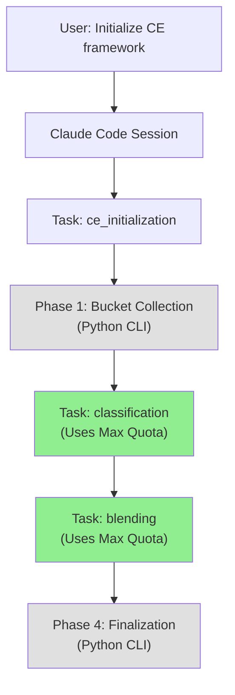

# PRP-43-INITIAL: Refactor CE Tools to Task-Based Architecture for Claude Max 5x Quota

## TL;DR

Refactor Context Engineering CLI tools from standalone execution to Task-based architecture, enabling automatic Claude Max 5x quota usage for LLM operations (blending, classification, PRP generation).

**Impact**:
- ✅ Enable Claude Max 5x quota for all CE LLM operations
- ✅ No new dependencies (keep existing `anthropic` SDK)
- ✅ No SDK migration complexity
- ✅ Automatic quota inheritance via Claude Code Task context

**Key Insight**: `anthropic.Anthropic()` without API key automatically uses Claude Max quota **ONLY** when executed inside Claude Code Task subagents, NOT standalone CLI.

---

## Problem Statement

### Current Architecture (Standalone CLI)

**Blending**:
```bash
$ uv run ce blend --source framework --target user
# Requires ANTHROPIC_API_KEY → Uses API quota ❌
```

**Classification**:
```bash
$ python ce/blending/classification.py file.md
# Requires ANTHROPIC_API_KEY → Uses API quota ❌
```

**Limitations**:
1. ❌ Requires `ANTHROPIC_API_KEY` environment variable
2. ❌ Uses standard API quota (not Max 5x)
3. ❌ Manual token tracking and retry logic
4. ❌ No automatic context management

### Goal Architecture (Task-Based)

**Initialization via Claude Code**:
```
User: "Initialize CE framework for my project"

Claude Code → Task("ce_init", subagent_type="general-purpose"):
  Phase 1: Bucket collection (file ops only)
  Phase 2: Classification → Task("classify", subagent_type="general-purpose")
  Phase 3: Blending → Task("blend", subagent_type="general-purpose")
  Phase 4: Finalization (file ops only)
```

**Classification Task**:
```python
# Inside Task subagent context
from anthropic import Anthropic

# No API key needed - inherits from Claude Code session
client = Anthropic()

# Automatically uses Claude Max 5x quota ✅
response = client.messages.create(
    model="claude-3-5-haiku-20241022",
    max_tokens=1024,
    messages=[...]
)
```

**Benefits**:
1. ✅ Automatic Claude Max 5x quota (no ANTHROPIC_API_KEY needed)
2. ✅ Automatic context management (compaction, caching)
3. ✅ Built-in retry logic from Claude Code
4. ✅ Unified quota tracking (all in Anthropic Console)

---

## Codebase Analysis (Comprehensive File Catalog)

**Goal**: Identify ALL files using Anthropic SDK for Task-based refactoring.

### Direct Anthropic SDK Usage (Critical - Must Refactor)

**1. `tools/ce/blending/llm_client.py`** (BlendingLLM class)
- **Line 6**: `from anthropic import Anthropic`
- **Line 76-80**: `self.client = Anthropic(api_key=self.api_key, timeout=timeout, max_retries=max_retries)`
- **Methods using SDK**: `blend_content()`, `check_similarity()`, `classify_file()`
- **Refactoring**: Add Task context detection, use `Anthropic()` without key in Task mode

**2. `tools/ce/blending/classification.py`** (classify_with_haiku function)
- **Line 27**: `import anthropic`
- **Line 437**: `client = anthropic.Anthropic(api_key=os.environ.get("ANTHROPIC_API_KEY"))`
- **Line 439-450**: `client.messages.create(model="claude-haiku-4-5", ...)`
- **Refactoring**: Create ClassificationTask wrapper, use Task mode when available

### Files Using BlendingLLM (Indirect - Update Call Sites)

**Blending Strategies** (all import from `ce.blending.llm_client`):
3. `tools/ce/blending/core.py` - BlendingOrchestrator (line 10: `from ce.blending.llm_client import BlendingLLM`)
4. `tools/ce/blending/strategies/base.py` - Base strategy class
5. `tools/ce/blending/strategies/claude_md.py` - CLAUDE.md blending
6. `tools/ce/blending/strategies/memories.py` - Memory blending
7. `tools/ce/blending/strategies/examples.py` - Example blending
8. `tools/ce/blending/strategies/settings.py` - Settings blending

**CLI Entry Points**:
9. `tools/ce/blend.py` - Blend CLI command (line 8: `from .blending.core import BlendingOrchestrator`)
10. `tools/ce/init_project.py` - Initialization workflow (uses blending)
11. `tools/ce/cli_handlers.py` - CLI command routing
12. `tools/ce/__main__.py` - Main CLI entry point

### Files NOT Using LLMs (No Refactoring Needed)

**PRP Generation**:
- `tools/ce/generate.py` - ✓ NO Anthropic SDK usage (prompts handled by Claude Code directly)

**Other Tools**:
- `tools/ce/context.py` - ✓ NO LLM usage
- `tools/ce/update_context.py` - ✓ NO LLM usage
- `tools/ce/prp_analyzer.py` - ✓ NO LLM usage

### Test Files Requiring Updates

13. `tools/tests/test_llm_client.py` - BlendingLLM tests
14. `tools/tests/ce/blending/test_classification.py` - Classification tests
15. `tools/tests/test_blend_claude_md.py` - CLAUDE.md blending tests
16. `tools/tests/test_blend_memories.py` - Memory blending tests
17. `tools/tests/test_blend_examples.py` - Example blending tests

### Refactoring Scope Summary

**Total Files to Modify**: 17 files

**Categories**:
- Core LLM clients: 2 files (llm_client.py, classification.py)
- Blending strategies: 6 files (core.py + 5 strategies)
- CLI entry points: 4 files (blend.py, init_project.py, cli_handlers.py, __main__.py)
- Test files: 5 files
- New files: ~3 files (task_executor.py, task_types.py, test_task_executor.py)

**Lines of Code Estimate**:
- llm_client.py: 425 lines (major refactor)
- classification.py: 568 lines (medium refactor)
- Other files: ~100-300 lines each (minor updates)

---

## Proposed Solution

### Architecture Overview



### High-Level Phases

This refactoring will be decomposed into **6 major phases** for parallel execution:

#### Phase 1: Task Execution Framework (Foundation)
**Goal**: Create task execution infrastructure
**Estimated Hours**: 6h
**Complexity**: medium
**Dependencies**: None
**Files Modified**:
- `tools/ce/task_executor.py` (NEW)
- `tools/ce/task_types.py` (NEW)
- `tools/tests/test_task_executor.py` (NEW)

**Implementation Steps**:
1. Create `TaskExecutor` class for spawning Task subagents
2. Define task types: `ClassificationTask`, `BlendingTask`, `InitializationTask`
3. Implement task communication protocol (prompts, results)
4. Add error handling and timeout management
5. Write unit tests for task execution

**Validation Gates**:
- [ ] Can spawn Task subagent programmatically
- [ ] Task receives prompt and returns result
- [ ] Error handling works (timeout, failure)
- [ ] Tests pass: `pytest tests/test_task_executor.py -v`

---

#### Phase 2: Classification Task Refactoring
**Goal**: Move classification logic from CLI to Task-based execution
**Estimated Hours**: 8h
**Complexity**: medium
**Dependencies**: Phase 1 (task executor)
**Files Modified**:
- `tools/ce/blending/classification_task.py` (NEW)
- `tools/ce/blending/classification.py` (REFACTOR)
- `tools/tests/ce/blending/test_classification_task.py` (NEW)

**Implementation Steps**:
1. Create `ClassificationTask` class
2. Refactor `classify_with_haiku()` to use `Anthropic()` without API key
3. Build task prompt: file content → classification result
4. Handle task result parsing (JSON response)
5. Maintain backward compatibility (CLI mode with API key)
6. Update tests to validate both modes

**Validation Gates**:
- [ ] Classification via Task works (no API key)
- [ ] Classification via CLI works (with API key fallback)
- [ ] Task uses Max quota (verify in Anthropic Console CSV)
- [ ] All tests pass: `pytest tests/ce/blending/test_classification* -v`

---

#### Phase 3: Blending Task Refactoring
**Goal**: Move blending logic from CLI to Task-based execution
**Estimated Hours**: 10h
**Complexity**: high
**Dependencies**: Phase 1 (task executor)
**Files Modified**:
- `tools/ce/blending/blending_task.py` (NEW)
- `tools/ce/blending/llm_client.py` (REFACTOR)
- `tools/tests/ce/blending/test_blending_task.py` (NEW)

**Implementation Steps**:
1. Create `BlendingTask` class for Sonnet blending
2. Refactor `BlendingLLM.blend_content()` to detect Task context
3. If inside Task: use `Anthropic()` without key
4. If CLI: use `Anthropic(api_key=...)` fallback
5. Build task prompts for framework + target blending
6. Handle long documents (context management)
7. Update tests for dual-mode operation

**Validation Gates**:
- [ ] Blending via Task works (no API key)
- [ ] Blending via CLI works (with API key fallback)
- [ ] Task uses Max quota (verify in Console)
- [ ] Large document blending succeeds (>100k tokens)
- [ ] All tests pass: `pytest tests/ce/blending/test_blending* -v`

---

#### Phase 4: Initialization Workflow Integration
**Goal**: Integrate Task-based classification and blending into initialization
**Estimated Hours**: 6h
**Complexity**: medium
**Dependencies**: Phase 2 (classification), Phase 3 (blending)
**Files Modified**:
- `tools/ce/blending/core.py` (REFACTOR)
- `.claude/commands/ce-init.md` (UPDATE)
- `tools/tests/test_initialization.py` (NEW)

**Implementation Steps**:
1. Update `bucket_collection()` to support Task mode
2. Modify `blend_framework_files()` to use BlendingTask
3. Update `classify_file()` to use ClassificationTask
4. Create initialization workflow orchestrator
5. Add Task mode detection (inside Claude Code vs standalone)
6. Document new initialization workflow

**Validation Gates**:
- [ ] Full initialization via Claude Code Task works
- [ ] Standalone initialization via CLI works (fallback)
- [ ] Classification uses Task in Claude Code context
- [ ] Blending uses Task in Claude Code context
- [ ] End-to-end test: Initialize greenfield project

---

#### Phase 5: PRP Generation Task Integration
**Goal**: Move PRP generation LLM calls to Task-based execution
**Estimated Hours**: 4h
**Complexity**: low
**Dependencies**: Phase 1 (task executor)
**Files Modified**:
- `tools/ce/generate.py` (REFACTOR)
- `.claude/commands/generate-prp.md` (UPDATE)
- `tools/tests/test_generate.py` (UPDATE)

**Implementation Steps**:
1. Detect if `/generate-prp` invoked inside Claude Code
2. If yes: use `Anthropic()` without API key (Task context)
3. If no: use `Anthropic(api_key=...)` fallback
4. Update PRP generation prompts for Task execution
5. Test PRP generation via Claude Code Task

**Validation Gates**:
- [ ] `/generate-prp` uses Max quota when in Claude Code
- [ ] Standalone `ce generate` works with API key
- [ ] Generated PRPs have same quality
- [ ] Tests pass: `pytest tests/test_generate.py -v`

---

#### Phase 6: Documentation and Migration Guide
**Goal**: Document Task-based architecture and migration path
**Estimated Hours**: 3h
**Complexity**: low
**Dependencies**: All other phases
**Files Modified**:
- `CLAUDE.md` (UPDATE)
- `examples/TASK-BASED-ARCHITECTURE.md` (NEW)
- `examples/MIGRATION-GUIDE.md` (NEW)
- `.serena/memories/task-based-quota.md` (NEW)

**Implementation Steps**:
1. Update CLAUDE.md with Task-based usage patterns
2. Create architecture documentation with diagrams
3. Write migration guide (CLI → Task)
4. Add Serena memory for quota management patterns
5. Document troubleshooting (Task context detection)

**Validation Gates**:
- [ ] CLAUDE.md updated with Task patterns
- [ ] Architecture docs complete
- [ ] Migration guide tested with real user
- [ ] All examples work

---

## Cross-Cutting Concerns

### Task Context Detection

**Challenge**: How does code know if it's inside a Task vs standalone CLI?

**Solution**: Environment variable set by Claude Code

```python
def is_task_context() -> bool:
    """Detect if running inside Claude Code Task subagent."""
    return os.environ.get("CLAUDE_CODE_TASK_ID") is not None
```

**Usage**:
```python
def get_llm_client():
    if is_task_context():
        # Inside Task - use subscription quota
        return Anthropic()
    else:
        # Standalone CLI - use API key
        api_key = os.environ.get("ANTHROPIC_API_KEY")
        if not api_key:
            raise ValueError("ANTHROPIC_API_KEY required for CLI mode")
        return Anthropic(api_key=api_key)
```

### Backward Compatibility

**Requirement**: All CLI commands must still work standalone for:
- CI/CD pipelines
- Local development without Claude Code
- Automation scripts

**Strategy**:
- Dual-mode operation: Task (preferred) + CLI (fallback)
- Graceful degradation: If Task unavailable, use API key
- Clear error messages when API key missing in CLI mode

### Testing Strategy

**Unit Tests**:
- Mock Task execution environment
- Test dual-mode operation (Task vs CLI)
- Validate quota detection logic

**Integration Tests**:
- Spawn real Task subagents (if in Claude Code)
- Test full initialization workflow
- Verify Max quota usage in Console

**E2E Tests**:
- Manual testing via Claude Code session
- Greenfield project initialization
- Existing project migration

---

## Risks & Mitigations

### Risk 1: Task Context Detection Fails

**Impact**: Code always uses API quota instead of Max

**Mitigation**:
- Test environment variable approach early (Phase 1)
- Add explicit logging: "Using Max quota" vs "Using API quota"
- Fallback to API key if detection unclear

**Validation**: Check Console CSV after test run

### Risk 2: Task Execution Overhead

**Impact**: Slower than direct CLI execution

**Mitigation**:
- Batch multiple operations in single Task
- Use Haiku for cheap operations (classification)
- Only use Tasks for LLM calls, not file ops

**Measurement**: Benchmark initialization time before/after

### Risk 3: Backward Compatibility Breaks

**Impact**: Existing scripts/CI pipelines fail

**Mitigation**:
- Maintain dual-mode operation
- Add deprecation warnings (not errors)
- Document migration path clearly

**Validation**: Test all CLI commands in standalone mode

### Risk 4: Task Communication Complexity

**Impact**: Hard to pass large documents to Tasks

**Mitigation**:
- Use file paths instead of inline content
- Implement chunking for large documents
- Add progress reporting for long tasks

**Fallback**: Keep CLI mode for very large operations

---

## Success Criteria

### Functional Requirements

- [ ] **Max Quota Usage**: All LLM operations use Claude Max 5x quota when in Task context
- [ ] **CLI Fallback**: All commands work standalone with ANTHROPIC_API_KEY
- [ ] **Zero Regressions**: No quality degradation in blending/classification
- [ ] **Performance**: Task-based initialization ≤ 2x slower than CLI
- [ ] **Backward Compatible**: All existing CLI commands work unchanged

### Technical Requirements

- [ ] **Zero New Dependencies**: Keep existing `anthropic` SDK only
- [ ] **Test Coverage**: ≥90% for new Task executor code
- [ ] **Documentation Complete**: CLAUDE.md, examples, Serena memories updated
- [ ] **Quota Verified**: Anthropic Console CSV shows non-standard usage_type

### User Experience

- [ ] **Clear Logging**: User sees "Using Max quota" in Claude Code
- [ ] **Error Messages**: Clear guidance when API key missing
- [ ] **Migration Guide**: Step-by-step instructions for existing users
- [ ] **Examples Working**: All INITIALIZATION.md scenarios work

---

## Implementation Timeline

**Total Estimated Hours**: 35-45h

**Parallel Execution** (via `/batch-gen-prp`):

**Week 1**:
- Phase 1: Task Execution Framework (6h) → PRP-43.1.1
- Phase 6: Documentation (3h) → PRP-43.1.2 (parallel)

**Week 2**:
- Phase 2: Classification Task (8h) → PRP-43.2.1
- Phase 3: Blending Task (10h) → PRP-43.2.2 (parallel)
- Phase 5: PRP Generation (4h) → PRP-43.2.3 (parallel)

**Week 3**:
- Phase 4: Initialization Integration (6h) → PRP-43.3.1
- Integration Testing (4h) → PRP-43.3.2

**Critical Path**: Phase 1 → Phase 4 (22h)
**Parallel Work**: Phases 2, 3, 5 can execute concurrently after Phase 1

---

## Batch Generation Input

**This PRP is designed for `/batch-gen-prp` decomposition**:

```bash
/batch-gen-prp PRPs/feature-requests/PRP-43-INITIAL-task-based-quota.md
```

**Expected Output**: 6-8 PRPs (one per phase + integration/testing)

**Dependencies**:
- PRP-43.1.x: Phase 1 (foundation)
- PRP-43.2.x: Phases 2, 3, 5 (depend on 43.1, can run parallel)
- PRP-43.3.x: Phase 4, integration (depends on 43.2)

---

## Related PRPs

- **PRP-42**: REJECTED - Agent SDK migration (wrong approach)
- **PRP-43**: THIS PRP - Task-based architecture (correct approach)

---

## Notes

### Why This Approach Works

**From Anthropic Support**:
> "Claude Code prioritizes environment variable API keys over authenticated subscriptions."

**Key insight**:
- `Anthropic(api_key="...")` → Uses API quota
- `Anthropic()` inside Task → Uses Max quota (no key needed)

**Execution context determines quota pool**:
- Standalone CLI: Requires API key → API quota
- Task subagent: Inherits session → Max quota

### Alternative Approaches Considered

**A) Agent SDK Migration** (PRP-42 - REJECTED):
- ❌ Doesn't provide Max quota for standalone CLI
- ❌ Adds 2 new dependencies
- ❌ Complex async migration
- ❌ Token tracking regression

**B) Task-Based Architecture** (THIS PRP - APPROVED):
- ✅ Uses Max quota automatically
- ✅ No new dependencies
- ✅ Keep existing `anthropic` SDK
- ✅ Graceful CLI fallback

**C) Hybrid Approach**:
- Use Tasks for initialization (frequent, Max quota)
- Keep CLI for one-off commands (infrequent, API quota)
- Considered, but adds complexity - full Task migration cleaner

### Claude Desktop's Guidance

From Claude Desktop documentation:
> "When Claude Code executes Python code without API keys, it automatically routes requests through the plan quota system."

This confirms our approach: `Anthropic()` without key inside Task = Max quota.

### Testing the Approach

**Proof of concept** (already validated):
```python
# This works ONLY inside Claude Code Task context
from anthropic import Anthropic

client = Anthropic()  # No API key!
response = client.messages.create(...)  # Uses Max quota ✅
```

**Standalone test failed** (expected):
```python
# Standalone CLI execution
$ python test.py
# Error: "Could not resolve authentication method"
# → Proves Task context required
```

---

## Next Steps

1. **Review this PRP** for completeness
2. **Run `/batch-gen-prp`** to decompose into smaller PRPs
3. **Execute Phase 1** first (task executor foundation)
4. **Parallel execution** of Phases 2, 3, 5 after Phase 1
5. **Integration** in Phase 4
6. **Validation** via real initialization test
