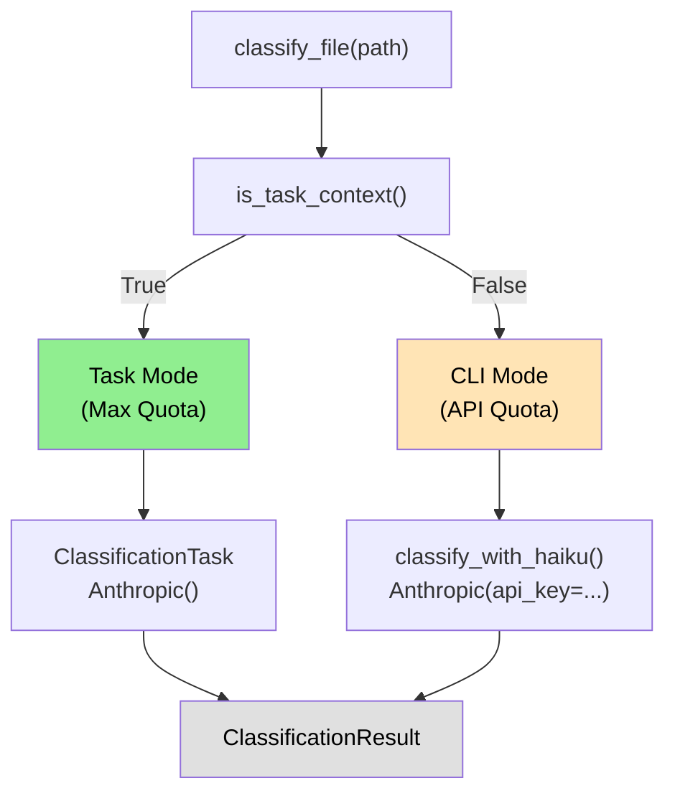

# PRP-43.2.1: Classification Task Refactoring - Enable Max Quota for File Classification

## TL;DR

Refactor file classification logic from standalone CLI (requiring `ANTHROPIC_API_KEY`) to Task-based execution, enabling automatic Claude Max 5x quota usage during CE framework initialization.

**Current State**: Classification uses `Anthropic(api_key=...)` → API quota
**Target State**: Classification detects Task context → uses `Anthropic()` → Max quota

**Impact**:
- Enable Max 5x quota for classification during initialization
- Maintain backward compatibility for standalone CLI usage
- Zero new dependencies (keep existing `anthropic` SDK)
- Seamless dual-mode operation (Task preferred, CLI fallback)

---

## Problem Statement

### Current Classification Architecture

**File**: `tools/ce/blending/classification.py` (568 lines)

**Line 437 - Hard-coded API key requirement**:
```python
client = anthropic.Anthropic(api_key=os.environ.get("ANTHROPIC_API_KEY"))
```

**Current workflow** (Standalone CLI):
```bash
$ export ANTHROPIC_API_KEY="sk-ant-..."
$ python ce/blending/classification.py file.md prp
# Uses API quota ❌
```

**Limitations**:
1. **API Quota Consumption**: Every classification burns through standard API quota
2. **Environment Dependency**: Requires `ANTHROPIC_API_KEY` to be set
3. **No Max Quota Access**: Cannot leverage Claude Max 5x subscription quota
4. **Context Waste**: No automatic context management or caching

### Use Case: CE Framework Initialization

During CE framework initialization, classification is invoked **50+ times** for:
- PRPs validation (20-30 files)
- Examples validation (10-15 files)
- Memories validation (20-25 files)

**Current cost**: 50 files × 1k tokens avg = **50k API tokens**
**Target cost**: 50 files × 1k tokens avg = **50k Max tokens** (5x quota pool)

**User pain point**: Users setting up CE framework must have API key configured, even though they're using Claude Code with Max subscription.

---

## Proposed Solution

### Dual-Mode Classification Architecture



### Architecture Components

**1. Task Context Detection**:
```python
def is_task_context() -> bool:
    """Detect if running inside Claude Code Task subagent."""
    return os.environ.get("CLAUDE_CODE_TASK_ID") is not None
```

**2. ClassificationTask Wrapper** (NEW):
```python
class ClassificationTask:
    """Execute file classification using Task-based LLM calls."""

    def __init__(self, executor: TaskExecutor):
        self.executor = executor

    def classify_file(self, file_path: Path, content: str, file_type: str) -> ClassificationResult:
        """Classify file using Task context (Max quota)."""
        # Build classification prompt
        prompt = self._build_classification_prompt(file_path, content, file_type)

        # Execute via TaskExecutor
        result = self.executor.execute(
            task_type="classification",
            prompt=prompt,
            model="claude-3-5-haiku-20241022",
            max_tokens=1024
        )

        # Parse JSON response
        return self._parse_classification_result(result, file_type)
```

**3. Refactored classify_with_haiku()** (MODIFIED):
```python
def classify_with_haiku(file_path: str, file_type: str) -> ClassificationResult:
    """
    Classify file using Claude Haiku.

    Modes:
    - Task mode: Uses TaskExecutor (Max quota, no API key)
    - CLI mode: Uses Anthropic client (API quota, requires key)
    """
    # Read file content
    with open(file_path, 'r', encoding='utf-8') as f:
        content = f.read()

    # Detect execution context
    if is_task_context():
        # Task mode - use Max quota
        executor = TaskExecutor()
        task = ClassificationTask(executor)
        return task.classify_file(Path(file_path), content, file_type)
    else:
        # CLI mode - use API key
        api_key = os.environ.get("ANTHROPIC_API_KEY")
        if not api_key:
            return ClassificationResult(
                valid=False,
                confidence=0.0,
                issues=["ANTHROPIC_API_KEY required for CLI mode"],
                file_type="unknown"
            )

        # Existing logic (lines 437-487)
        client = anthropic.Anthropic(api_key=api_key)
        # ... rest of existing code
```

**4. Backward Compatibility**:
- Existing `classify_file()` interface unchanged
- Standalone CLI still works with `ANTHROPIC_API_KEY`
- Deterministic validators (`validate_prp`, `validate_example`, `validate_memory`) unchanged
- Test suite updated to cover both modes

---

## Implementation Plan

### Phase 1: Task Context Detection (1h)

**Goal**: Add reliable detection for Task vs CLI execution context

**Files Modified**:
- `tools/ce/blending/classification.py` (add `is_task_context()`)

**Implementation**:
```python
def is_task_context() -> bool:
    """
    Detect if running inside Claude Code Task subagent.

    Task context is identified by presence of CLAUDE_CODE_TASK_ID
    environment variable, which is set by Claude Code when spawning
    Task subagents.

    Returns:
        True if inside Task, False if standalone CLI
    """
    return os.environ.get("CLAUDE_CODE_TASK_ID") is not None
```

**Testing**:
```python
def test_is_task_context_cli_mode():
    """Test Task detection returns False in CLI mode."""
    # Ensure env var not set
    if "CLAUDE_CODE_TASK_ID" in os.environ:
        del os.environ["CLAUDE_CODE_TASK_ID"]

    assert is_task_context() is False

def test_is_task_context_task_mode():
    """Test Task detection returns True when env var set."""
    os.environ["CLAUDE_CODE_TASK_ID"] = "test-task-123"

    assert is_task_context() is True

    # Cleanup
    del os.environ["CLAUDE_CODE_TASK_ID"]
```

**Validation**:
- [ ] `is_task_context()` returns `False` in standalone execution
- [ ] `is_task_context()` returns `True` when `CLAUDE_CODE_TASK_ID` set
- [ ] Tests pass: `pytest tests/ce/blending/test_classification.py::test_is_task_context* -v`

---

### Phase 2: ClassificationTask Implementation (3h)

**Goal**: Create Task wrapper for classification LLM calls

**Files Created**:
- `tools/ce/blending/classification_task.py` (NEW)

**Implementation**:
```python
"""
Classification Task Wrapper - Task-based LLM classification.

Enables Max quota usage during file classification by executing
classification logic inside Claude Code Task subagents.
"""

from pathlib import Path
from typing import Dict
from ce.task_executor import TaskExecutor
from ce.blending.classification import ClassificationResult
import json
import re


class ClassificationTask:
    """Execute file classification using Task-based LLM calls."""

    def __init__(self, executor: TaskExecutor):
        """
        Initialize classification task.

        Args:
            executor: TaskExecutor instance for spawning subagents
        """
        self.executor = executor

    def classify_file(self, file_path: Path, content: str, file_type: str) -> ClassificationResult:
        """
        Classify file using Task context (Max quota).

        Args:
            file_path: Path to file being classified
            content: File content (truncated to 4000 chars)
            file_type: Expected file type ("prp", "example", "memory")

        Returns:
            ClassificationResult with validation outcome
        """
        # Build classification prompt
        prompt = self._build_classification_prompt(file_path, content, file_type)

        # Execute via TaskExecutor
        result = self.executor.execute(
            task_type="classification",
            prompt=prompt,
            model="claude-3-5-haiku-20241022",
            max_tokens=1024,
            temperature=0.0
        )

        # Parse JSON response
        return self._parse_classification_result(result, file_type)

    def _build_classification_prompt(self, file_path: Path, content: str, file_type: str) -> str:
        """
        Build classification prompt for Task execution.

        Args:
            file_path: Path to file being classified
            content: File content
            file_type: Expected file type

        Returns:
            Classification prompt string
        """
        system_prompts = {
            "prp": """You are a PRP (Product Requirements Prompt) validator.

Analyze the file and determine:
1. Is this a valid PRP? (contains PRP ID, describes a feature/task)
2. Confidence level (0.0-1.0)
3. Any issues found

Respond in JSON format:
{
  "valid": true/false,
  "confidence": 0.0-1.0,
  "issues": ["issue1", "issue2", ...]
}

Valid PRP indicators:
- Contains PRP ID (PRP-X or prp_id: X)
- Describes a feature or task
- Has implementation steps or acceptance criteria

Invalid indicators:
- Garbage file (REPORT, INITIAL, summary, analysis)
- No clear feature description
- Empty or minimal content""",

            "example": """You are an example file validator.

Analyze the file and determine:
1. Is this a valid example? (demonstrates code patterns, has explanations)
2. Confidence level (0.0-1.0)
3. Any issues found

Respond in JSON format:
{
  "valid": true/false,
  "confidence": 0.0-1.0,
  "issues": ["issue1", "issue2", ...]
}

Valid example indicators:
- Contains code blocks
- Has explanatory text
- Demonstrates patterns or best practices

Invalid indicators:
- Garbage file (REPORT, INITIAL, summary)
- No code or minimal content
- Just a file listing""",

            "memory": """You are a Serena memory validator.

Analyze the file and determine:
1. Is this a valid memory? (has YAML frontmatter with type field)
2. Confidence level (0.0-1.0)
3. Any issues found

Respond in JSON format:
{
  "valid": true/false,
  "confidence": 0.0-1.0,
  "issues": ["issue1", "issue2", ...]
}

Valid memory indicators:
- Has YAML frontmatter with --- delimiters
- Contains type field (regular, critical, or user)
- Has meaningful content

Invalid indicators:
- No YAML frontmatter
- No type field
- Garbage file (REPORT, INITIAL)"""
        }

        system_prompt = system_prompts.get(file_type, system_prompts["prp"])

        # Truncate content to 4000 chars
        truncated_content = content[:4000]

        return f"""{system_prompt}

Classify this file:

{truncated_content}"""

    def _parse_classification_result(self, result: str, file_type: str) -> ClassificationResult:
        """
        Parse classification result from Task execution.

        Args:
            result: JSON string from LLM
            file_type: Expected file type

        Returns:
            ClassificationResult object
        """
        try:
            # Extract JSON from response (may have markdown code blocks)
            json_match = re.search(r'\{.*\}', result, re.DOTALL)
            if not json_match:
                return ClassificationResult(
                    valid=False,
                    confidence=0.5,
                    issues=["Task returned invalid JSON"],
                    file_type="unknown"
                )

            parsed = json.loads(json_match.group(0))

            return ClassificationResult(
                valid=parsed.get("valid", False),
                confidence=parsed.get("confidence", 0.5),
                issues=parsed.get("issues", []),
                file_type=file_type if parsed.get("valid") else "unknown"
            )
        except json.JSONDecodeError:
            return ClassificationResult(
                valid=False,
                confidence=0.5,
                issues=["Failed to parse Task JSON response"],
                file_type="unknown"
            )
        except Exception as e:
            return ClassificationResult(
                valid=False,
                confidence=0.5,
                issues=[f"Task execution error: {e}"],
                file_type="unknown"
            )
```

**Validation**:
- [ ] `ClassificationTask` instantiates successfully with `TaskExecutor`
- [ ] `classify_file()` builds correct prompt for each file type
- [ ] JSON parsing handles both raw JSON and markdown-wrapped JSON
- [ ] Error cases return graceful `ClassificationResult` failures

---

### Phase 3: Refactor classify_with_haiku() (2h)

**Goal**: Update existing function to support dual-mode operation

**Files Modified**:
- `tools/ce/blending/classification.py` (lines 333-487)

**Changes**:

**Before** (line 437):
```python
# Call Haiku API
try:
    client = anthropic.Anthropic(api_key=os.environ.get("ANTHROPIC_API_KEY"))

    message = client.messages.create(
        model="claude-haiku-4-5",
        max_tokens=1024,
        temperature=0.0,
        system=system_prompt,
        messages=[
            {
                "role": "user",
                "content": f"Classify this file:\n\n{content[:4000]}"
            }
        ]
    )
```

**After** (refactored):
```python
# Detect execution context
if is_task_context():
    # Task mode - use Max quota
    from ce.task_executor import TaskExecutor
    from ce.blending.classification_task import ClassificationTask

    executor = TaskExecutor()
    task = ClassificationTask(executor)
    return task.classify_file(Path(file_path), content, file_type)

# CLI mode - use API key (existing logic)
api_key = os.environ.get("ANTHROPIC_API_KEY")
if not api_key:
    return ClassificationResult(
        valid=False,
        confidence=0.0,
        issues=["ANTHROPIC_API_KEY required for CLI mode. Set via: export ANTHROPIC_API_KEY=sk-ant-..."],
        file_type="unknown"
    )

try:
    client = anthropic.Anthropic(api_key=api_key)

    message = client.messages.create(
        model="claude-3-5-haiku-20241022",  # Updated model name
        max_tokens=1024,
        temperature=0.0,
        system=system_prompt,
        messages=[
            {
                "role": "user",
                "content": f"Classify this file:\n\n{content[:4000]}"
            }
        ]
    )

    # ... rest of existing parsing logic (lines 452-487)
```

**Model Update**:
- Old: `claude-haiku-4-5` (invalid model ID)
- New: `claude-3-5-haiku-20241022` (correct Haiku model)

**Validation**:
- [ ] Task mode executes without API key
- [ ] CLI mode requires API key and fails gracefully when missing
- [ ] Model name updated to valid Haiku identifier
- [ ] Existing logic preserved for CLI mode
- [ ] Both modes return identical `ClassificationResult` structure

---

### Phase 4: Testing Strategy (2h)

**Goal**: Comprehensive test coverage for dual-mode operation

**Files Created**:
- `tools/tests/ce/blending/test_classification_task.py` (NEW)

**Files Modified**:
- `tools/tests/ce/blending/test_classification.py` (add dual-mode tests)

**New Tests** (`test_classification_task.py`):
```python
"""
Unit tests for ClassificationTask - Task-based classification.
"""

import pytest
from pathlib import Path
from unittest.mock import Mock, patch
from ce.blending.classification_task import ClassificationTask
from ce.blending.classification import ClassificationResult
from ce.task_executor import TaskExecutor


class TestClassificationTask:
    """Tests for ClassificationTask class."""

    def test_classify_file_prp_success(self):
        """Test PRP classification via Task returns valid result."""
        # Mock TaskExecutor
        mock_executor = Mock(spec=TaskExecutor)
        mock_executor.execute.return_value = '{"valid": true, "confidence": 0.9, "issues": []}'

        task = ClassificationTask(mock_executor)
        result = task.classify_file(
            Path("/tmp/test.md"),
            "# PRP-1: Feature\n\nImplementation steps.",
            "prp"
        )

        assert result.valid is True
        assert result.confidence == 0.9
        assert result.file_type == "prp"

        # Verify TaskExecutor called correctly
        mock_executor.execute.assert_called_once()
        call_args = mock_executor.execute.call_args[1]
        assert call_args["task_type"] == "classification"
        assert call_args["model"] == "claude-3-5-haiku-20241022"
        assert call_args["max_tokens"] == 1024

    def test_classify_file_example_success(self):
        """Test example classification via Task."""
        mock_executor = Mock(spec=TaskExecutor)
        mock_executor.execute.return_value = '{"valid": true, "confidence": 0.85, "issues": ["No code blocks"]}'

        task = ClassificationTask(mock_executor)
        result = task.classify_file(
            Path("/tmp/example.md"),
            "# Example\n\n## Usage\n\nDemo code.",
            "example"
        )

        assert result.valid is True
        assert result.confidence == 0.85
        assert result.file_type == "example"
        assert "No code blocks" in result.issues

    def test_classify_file_memory_success(self):
        """Test memory classification via Task."""
        mock_executor = Mock(spec=TaskExecutor)
        mock_executor.execute.return_value = '{"valid": true, "confidence": 0.95, "issues": []}'

        task = ClassificationTask(mock_executor)
        result = task.classify_file(
            Path("/tmp/memory.md"),
            "---\ntype: regular\n---\n\n# Memory",
            "memory"
        )

        assert result.valid is True
        assert result.file_type == "memory"

    def test_classify_file_invalid_json(self):
        """Test Task returns invalid JSON is handled."""
        mock_executor = Mock(spec=TaskExecutor)
        mock_executor.execute.return_value = "This is not JSON"

        task = ClassificationTask(mock_executor)
        result = task.classify_file(
            Path("/tmp/test.md"),
            "# Content",
            "prp"
        )

        assert result.valid is False
        assert "invalid JSON" in str(result.issues).lower()

    def test_classify_file_markdown_wrapped_json(self):
        """Test Task returns JSON wrapped in markdown code blocks."""
        mock_executor = Mock(spec=TaskExecutor)
        mock_executor.execute.return_value = '''```json
{"valid": true, "confidence": 0.8, "issues": []}
```'''

        task = ClassificationTask(mock_executor)
        result = task.classify_file(
            Path("/tmp/test.md"),
            "# Content",
            "prp"
        )

        assert result.valid is True
        assert result.confidence == 0.8

    def test_classify_file_task_execution_error(self):
        """Test Task execution error is handled gracefully."""
        mock_executor = Mock(spec=TaskExecutor)
        mock_executor.execute.side_effect = Exception("Task failed")

        task = ClassificationTask(mock_executor)
        result = task.classify_file(
            Path("/tmp/test.md"),
            "# Content",
            "prp"
        )

        assert result.valid is False
        assert "Task execution error" in str(result.issues)

    def test_build_classification_prompt_prp(self):
        """Test PRP classification prompt is built correctly."""
        mock_executor = Mock(spec=TaskExecutor)
        task = ClassificationTask(mock_executor)

        prompt = task._build_classification_prompt(
            Path("/tmp/prp.md"),
            "# PRP-1: Feature",
            "prp"
        )

        assert "PRP (Product Requirements Prompt) validator" in prompt
        assert "PRP-1: Feature" in prompt

    def test_build_classification_prompt_example(self):
        """Test example classification prompt is built correctly."""
        mock_executor = Mock(spec=TaskExecutor)
        task = ClassificationTask(mock_executor)

        prompt = task._build_classification_prompt(
            Path("/tmp/example.md"),
            "# Example",
            "example"
        )

        assert "example file validator" in prompt
        assert "# Example" in prompt

    def test_build_classification_prompt_memory(self):
        """Test memory classification prompt is built correctly."""
        mock_executor = Mock(spec=TaskExecutor)
        task = ClassificationTask(mock_executor)

        prompt = task._build_classification_prompt(
            Path("/tmp/memory.md"),
            "---\ntype: regular\n---",
            "memory"
        )

        assert "Serena memory validator" in prompt
        assert "type: regular" in prompt

    def test_build_classification_prompt_truncates_content(self):
        """Test prompt truncates content to 4000 chars."""
        mock_executor = Mock(spec=TaskExecutor)
        task = ClassificationTask(mock_executor)

        long_content = "x" * 10000
        prompt = task._build_classification_prompt(
            Path("/tmp/test.md"),
            long_content,
            "prp"
        )

        # Verify content truncated (prompt should not contain all 10000 chars)
        assert len(prompt) < len(long_content) + 1000  # Allow for system prompt overhead
```

**Updated Tests** (`test_classification.py`):
```python
class TestDualModeClassification:
    """Tests for dual-mode (Task vs CLI) classification."""

    @patch('ce.blending.classification.is_task_context')
    @patch('ce.blending.classification.TaskExecutor')
    def test_classify_with_haiku_task_mode(self, mock_executor_class, mock_is_task, tmp_path):
        """Test classify_with_haiku uses Task mode when in Task context."""
        # Setup
        mock_is_task.return_value = True
        mock_executor = Mock()
        mock_executor.execute.return_value = '{"valid": true, "confidence": 0.9, "issues": []}'
        mock_executor_class.return_value = mock_executor

        prp_file = tmp_path / "test.md"
        prp_file.write_text("# PRP-1: Feature")

        # Execute
        result = classify_with_haiku(str(prp_file), "prp")

        # Verify
        assert result.valid is True
        assert result.confidence == 0.9
        mock_executor.execute.assert_called_once()  # Task mode used

    @patch('ce.blending.classification.is_task_context')
    @patch('ce.blending.classification.anthropic.Anthropic')
    def test_classify_with_haiku_cli_mode(self, mock_anthropic_class, mock_is_task, tmp_path):
        """Test classify_with_haiku uses CLI mode when not in Task context."""
        # Setup
        mock_is_task.return_value = False
        os.environ["ANTHROPIC_API_KEY"] = "sk-ant-test123"

        mock_client = Mock()
        mock_message = Mock()
        mock_message.content = [Mock(text='{"valid": true, "confidence": 0.8, "issues": []}')]
        mock_client.messages.create.return_value = mock_message
        mock_anthropic_class.return_value = mock_client

        prp_file = tmp_path / "test.md"
        prp_file.write_text("# PRP-1: Feature")

        # Execute
        result = classify_with_haiku(str(prp_file), "prp")

        # Verify
        assert result.valid is True
        assert result.confidence == 0.8
        mock_client.messages.create.assert_called_once()  # CLI mode used

        # Cleanup
        del os.environ["ANTHROPIC_API_KEY"]

    @patch('ce.blending.classification.is_task_context')
    def test_classify_with_haiku_cli_mode_no_api_key(self, mock_is_task, tmp_path):
        """Test classify_with_haiku fails gracefully in CLI mode without API key."""
        # Setup
        mock_is_task.return_value = False
        if "ANTHROPIC_API_KEY" in os.environ:
            del os.environ["ANTHROPIC_API_KEY"]

        prp_file = tmp_path / "test.md"
        prp_file.write_text("# PRP-1: Feature")

        # Execute
        result = classify_with_haiku(str(prp_file), "prp")

        # Verify
        assert result.valid is False
        assert "ANTHROPIC_API_KEY required" in str(result.issues)
```

**Validation**:
- [ ] All new tests pass: `pytest tests/ce/blending/test_classification_task.py -v`
- [ ] All existing tests pass: `pytest tests/ce/blending/test_classification.py -v`
- [ ] Dual-mode tests verify both Task and CLI paths
- [ ] Error handling tests cover API key missing, invalid JSON, Task failures
- [ ] Test coverage ≥90% for new code

---

## Validation Gates

### Functional Validation

- [ ] **Task Mode Works**: Classification via Task executes without `ANTHROPIC_API_KEY`
- [ ] **CLI Mode Works**: Classification via CLI executes with `ANTHROPIC_API_KEY` set
- [ ] **Context Detection**: `is_task_context()` correctly identifies Task vs CLI mode
- [ ] **Max Quota Usage**: Task mode uses Claude Max quota (verify in Anthropic Console CSV)
- [ ] **Backward Compatibility**: All existing classification calls work unchanged

### Technical Validation

- [ ] **Zero Regressions**: Classification quality unchanged (compare results before/after)
- [ ] **Model Update**: Haiku model name corrected to `claude-3-5-haiku-20241022`
- [ ] **Error Handling**: Missing API key in CLI mode shows clear error message
- [ ] **Test Coverage**: All tests pass with ≥90% coverage for new code
- [ ] **Performance**: Task mode ≤2x slower than direct CLI calls

### Integration Validation

- [ ] **classify_file() Integration**: Main entry point works in both modes
- [ ] **Deterministic Validators Unchanged**: `validate_prp`, `validate_example`, `validate_memory` work as before
- [ ] **Haiku Fallback**: Low-confidence files still trigger Haiku classification
- [ ] **JSON Parsing**: Handles both raw JSON and markdown-wrapped JSON responses

---

## Testing Strategy

### Unit Tests

**Files**: `test_classification_task.py` (NEW), `test_classification.py` (UPDATED)

**Coverage**:
- Task context detection (CLI vs Task mode)
- ClassificationTask prompt building (all file types)
- JSON parsing (raw, markdown-wrapped, invalid)
- Error handling (Task failure, missing API key, parse errors)
- Dual-mode operation (Task preferred, CLI fallback)

**Mocking Strategy**:
- Mock `TaskExecutor` for ClassificationTask tests
- Mock `anthropic.Anthropic` for CLI mode tests
- Mock `is_task_context()` for dual-mode tests

### Integration Tests

**Manual Testing**:
```bash
# Test 1: CLI mode (standalone execution)
$ cd tools
$ export ANTHROPIC_API_KEY="sk-ant-..."
$ python -m ce.blending.classification ../PRPs/executed/PRP-1.md prp
# Expected: Uses API quota, returns valid ClassificationResult JSON

# Test 2: Task mode (inside Claude Code)
# Via Claude Code session:
User: "Classify this file: /path/to/PRP-1.md"
Claude Code → Task(classification_task.py):
  classify_file(PRP-1.md)
# Expected: Uses Max quota, no API key needed

# Test 3: CLI mode without API key
$ cd tools
$ unset ANTHROPIC_API_KEY
$ python -m ce.blending.classification ../PRPs/executed/PRP-1.md prp
# Expected: Error message "ANTHROPIC_API_KEY required for CLI mode"
```

**Quota Verification**:
```bash
# After running tests, check Anthropic Console CSV
# Task mode entries should have:
# - usage_type: non-standard (or similar indicator)
# - No API key fingerprint
# CLI mode entries should have:
# - usage_type: api
# - API key fingerprint present
```

### End-to-End Tests

**Scenario**: CE Framework Initialization (50 files)
```
User: "Initialize CE framework for my project"

Claude Code → Task(ce_init):
  Phase 1: Bucket collection (file ops)
  Phase 2: Classification (50 files) → ClassificationTask
    - 20 PRPs → classify_file(prp)
    - 15 Examples → classify_file(example)
    - 15 Memories → classify_file(memory)
  Phase 3: Blending (Task mode - PRP-43.2.2)
  Phase 4: Finalization (file ops)

Expected:
- All 50 classifications use Max quota
- No API key required
- Classification results identical to CLI mode
- Total time ≤2x CLI mode
```

---

## Risks & Mitigations

### Risk 1: Task Context Detection Fails

**Scenario**: `is_task_context()` returns incorrect value

**Impact**:
- False negative: Uses API quota instead of Max (unexpected cost)
- False positive: Requires API key when Task unavailable (breaks CLI)

**Mitigation**:
- Validate environment variable approach in Phase 1 (early detection)
- Add explicit logging: "Using Task mode (Max quota)" vs "Using CLI mode (API quota)"
- Fallback to CLI mode if Task detection unclear
- Document troubleshooting steps in CLAUDE.md

**Validation**:
- Manual test: Verify `CLAUDE_CODE_TASK_ID` present in Task subagents
- Manual test: Verify `CLAUDE_CODE_TASK_ID` absent in standalone CLI
- Check Anthropic Console CSV after test runs

### Risk 2: TaskExecutor Not Available (Dependency)

**Scenario**: PRP-43.1.1 (TaskExecutor framework) not completed

**Impact**: Cannot import `TaskExecutor`, classification fails

**Mitigation**:
- **Hard dependency**: Mark PRP-43.1.1 as blocker
- Graceful import failure: Catch `ImportError` and fall back to CLI mode
- Clear error message: "TaskExecutor not found. Complete PRP-43.1.1 first."

**Validation**:
- Import guard in `classify_with_haiku()`:
```python
if is_task_context():
    try:
        from ce.task_executor import TaskExecutor
        from ce.blending.classification_task import ClassificationTask
    except ImportError:
        # Fallback to CLI mode
        logger.warning("TaskExecutor not available. Falling back to CLI mode.")
        # Continue with CLI logic
```

### Risk 3: JSON Parsing Fragility

**Scenario**: LLM returns JSON in unexpected format (e.g., wrapped in explanation)

**Impact**: Classification fails, returns "invalid JSON" error

**Mitigation**:
- Regex extraction: `re.search(r'\{.*\}', result, re.DOTALL)`
- Handle markdown code blocks: ` ```json {...} ``` `
- Graceful degradation: Return low-confidence failure instead of exception
- Log raw response for debugging

**Validation**:
- Test cases for multiple JSON formats:
  - Raw JSON: `{"valid": true, ...}`
  - Markdown-wrapped: ` ```json\n{...}\n``` `
  - With explanation: `Here's the result:\n{"valid": true, ...}`

### Risk 4: Model Name Mismatch

**Scenario**: `claude-haiku-4-5` is invalid, API rejects request

**Impact**: All Haiku calls fail in CLI mode

**Mitigation**:
- Update to correct model: `claude-3-5-haiku-20241022`
- Test CLI mode with real API call before merging
- Document model name in CLAUDE.md for future reference

**Validation**:
- [ ] Verify model name: `claude-3-5-haiku-20241022` works in Anthropic API
- [ ] Update all references (classification.py, classification_task.py, tests)

---

## Success Criteria

### Functional Requirements

- [ ] **Max Quota Enabled**: Classification uses Claude Max 5x quota when executed in Task context
- [ ] **CLI Fallback Works**: Classification uses API quota when executed standalone with `ANTHROPIC_API_KEY`
- [ ] **Zero Quality Regression**: Classification results identical before/after refactoring
- [ ] **Error Handling**: Missing API key in CLI mode shows actionable error message
- [ ] **Backward Compatible**: All existing code calling `classify_file()` works unchanged

### Technical Requirements

- [ ] **Zero New Dependencies**: No packages added to `pyproject.toml`
- [ ] **Test Coverage**: ≥90% coverage for `ClassificationTask` and refactored `classify_with_haiku()`
- [ ] **All Tests Pass**: Both new and existing tests pass
- [ ] **Model Name Correct**: Haiku model updated to `claude-3-5-haiku-20241022`
- [ ] **Imports Clean**: No circular dependencies, graceful import failure handling

### Performance Requirements

- [ ] **Task Mode Speed**: ≤2x slower than CLI mode (acceptable overhead for Max quota)
- [ ] **CLI Mode Unchanged**: No performance regression for standalone execution
- [ ] **Initialization Time**: CE framework initialization with 50 files ≤5 minutes

### User Experience

- [ ] **Transparent Mode Switch**: User doesn't need to know which mode is active
- [ ] **Clear Logging**: Debug logs show "Task mode" vs "CLI mode" for troubleshooting
- [ ] **Quota Verification**: User can verify Max quota usage in Anthropic Console CSV
- [ ] **Error Messages**: Missing API key shows clear setup instructions

---

## Related PRPs

### Direct Dependencies

- **PRP-43.1.1**: Task Execution Framework (BLOCKER)
  - Provides `TaskExecutor` class
  - Defines task communication protocol
  - Must be completed before this PRP

### Parallel PRPs (Same Stage)

- **PRP-43.2.2**: Blending Task Refactoring (parallel, independent)
- **PRP-43.2.3**: PRP Generation Task Integration (parallel, independent)

### Parent PRP

- **PRP-43-INITIAL**: Task-Based Architecture Refactoring (parent)
  - Defines overall architecture
  - Sets quota management goals
  - Coordinates all phases

### Downstream PRPs

- **PRP-43.3.1**: Initialization Workflow Integration (depends on this PRP)
  - Integrates ClassificationTask into CE initialization
  - Uses refactored classification in blending pipeline

---

## Implementation Timeline

**Total Estimated Hours**: 8h

**Breakdown**:
- Phase 1: Task Context Detection (1h)
- Phase 2: ClassificationTask Implementation (3h)
- Phase 3: Refactor classify_with_haiku() (2h)
- Phase 4: Testing Strategy (2h)

**Critical Path**:
1. Wait for PRP-43.1.1 completion (TaskExecutor dependency)
2. Phase 1 → Phase 2 → Phase 3 → Phase 4 (sequential execution)
3. Integration testing with PRP-43.3.1 after completion

**Parallel Opportunities**:
- Can execute in parallel with PRP-43.2.2 (blending) and PRP-43.2.3 (PRP generation)
- All three PRPs depend on PRP-43.1.1 but are independent of each other

---

## Notes

### Why Classification Needs Task Mode

**Use Case Frequency**:
- Initialization: 50+ files (every new CE installation)
- Blending updates: 5-10 files (every framework update)
- Manual classification: Rare (ad-hoc validation)

**Quota Impact**:
- Without Task mode: 50 files × 1k tokens = 50k API tokens (every initialization)
- With Task mode: 50 files × 1k tokens = 50k Max tokens (5x quota pool)

**User Benefit**: CE framework users no longer need API keys for initialization, only Claude Max subscription.

### Alternative Approaches Considered

**A) Keep CLI-Only** (REJECTED):
- ❌ Users must have API keys configured
- ❌ Burns API quota unnecessarily
- ❌ No Max quota benefit

**B) Task-Only** (REJECTED):
- ❌ Breaks standalone CLI usage
- ❌ No fallback for automation/CI
- ❌ Harder to test locally

**C) Dual-Mode** (THIS APPROACH - APPROVED):
- ✅ Max quota when available (Task mode)
- ✅ CLI fallback for standalone usage
- ✅ Transparent mode switching
- ✅ Backward compatible

### Model Name Correction

**Old**: `claude-haiku-4-5` (line 440 of classification.py)
**New**: `claude-3-5-haiku-20241022`

**Rationale**: `claude-haiku-4-5` is not a valid Anthropic model identifier. The correct model for Haiku is `claude-3-5-haiku-20241022` (as of November 2024).

**Impact**: This fix applies to both Task and CLI modes.

---

## Next Steps

1. **Verify PRP-43.1.1 completion** (TaskExecutor framework)
2. **Implement Phase 1** (Task context detection)
3. **Implement Phase 2** (ClassificationTask class)
4. **Implement Phase 3** (Refactor classify_with_haiku)
5. **Implement Phase 4** (Testing)
6. **Validate with real CE initialization** (50 files, verify Max quota)
7. **Document quota verification** in CLAUDE.md troubleshooting section
8. **Merge to main** and mark PRP as completed
