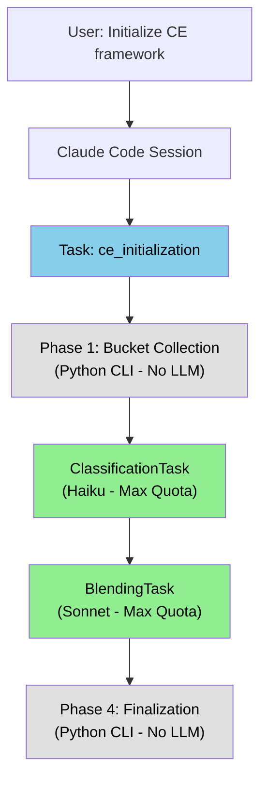

# PRP-43.3.1: Initialization Workflow Integration - Unified Task-Based CE Installation

## TL;DR

Integrate Task-based classification and blending into the full CE framework initialization workflow, enabling automatic Claude Max 5x quota usage for all LLM operations during CE installation.

**Current State**: Initialization uses direct BlendingLLM calls → API quota
**Target State**: Initialization orchestrates Classification + Blending Tasks → Max quota

**Impact**:
- Full initialization workflow uses Max 5x quota automatically
- Seamless user experience (no API key needed in Claude Code)
- Maintains backward compatibility for standalone CLI usage
- End-to-end validation of Task-based architecture

---

## Problem Statement

### Current Initialization Limitations

**Files Involved**:
- `tools/ce/blending/core.py` - BlendingOrchestrator (669 lines)
- `tools/ce/init_project.py` - ProjectInitializer (100+ lines)

**Current Architecture** (Standalone CLI):
```python
# tools/ce/blending/core.py (line 88-141)
class BlendingOrchestrator:
    def __init__(self, config: Dict[str, Any], dry_run: bool = False):
        # Hard-coded to use BlendingLLM with API key
        llm_client = BlendingLLM()  # Requires ANTHROPIC_API_KEY ❌

        # Register strategies with LLM client
        self.register_strategy("memories", MemoriesBlendStrategy(llm_client))
        self.register_strategy("examples", ExamplesBlendStrategy(llm_client))
```

**Execution Flow** (from user request):
```
User: "Initialize CE framework for /path/to/project"

Claude Code spawns Task("ce_init"):
  ↓
  Phase 1: Bucket Collection (file ops only)
  ↓
  Phase 2: Classification → classify_with_haiku() → BlendingLLM
      ↓
      Uses ANTHROPIC_API_KEY → API quota ❌
  ↓
  Phase 3: Blending → BlendingOrchestrator → BlendingLLM
      ↓
      Uses ANTHROPIC_API_KEY → API quota ❌
  ↓
  Phase 4: Cleanup (file ops only)
```

**Pain Points**:
1. **API Quota Waste**: Initialization burns through API quota even when user has Max subscription
2. **Environment Setup**: Users must configure `ANTHROPIC_API_KEY` before initialization
3. **Inconsistent UX**: User invokes via Claude Code but still needs API key
4. **No Max Quota Access**: Cannot leverage Claude Max 5x subscription during initialization

### User Workflow Problem

**Expected behavior** (from user perspective):
```
User: "Set up CE framework for my project"
Claude Code: [runs initialization automatically using Max quota]
Result: Framework installed, no API key needed ✅
```

**Actual behavior** (current):
```
User: "Set up CE framework for my project"
Claude Code: [spawns initialization]
Error: "ANTHROPIC_API_KEY not found"
User: [confused] "But I'm using Claude Code with Max subscription..."
Workaround: export ANTHROPIC_API_KEY=sk-ant-...
Result: Framework installed, but used API quota ❌
```

---

## Proposed Solution

### Task-Based Initialization Architecture



### Target State Architecture

**BlendingOrchestrator Refactoring**:
```python
# tools/ce/blending/core.py (REFACTORED)
from ce.task_executor import TaskExecutor, is_task_context
from ce.blending.classification_task import ClassificationTask
from ce.blending.blending_task import BlendingTask

class BlendingOrchestrator:
    def __init__(
        self,
        config: Dict[str, Any],
        dry_run: bool = False,
        task_mode: Optional[bool] = None  # NEW: Auto-detect if None
    ):
        """
        Initialize orchestrator with optional Task mode.

        Args:
            config: Blending configuration
            dry_run: If True, show actions without executing
            task_mode: Use Task execution (None = auto-detect)
        """
        self.config = config
        self.dry_run = dry_run

        # Auto-detect Task context if not specified
        if task_mode is None:
            task_mode = is_task_context()

        self.task_mode = task_mode
        self.task_executor = TaskExecutor() if task_mode else None
        self.strategies: Dict[str, Any] = {}
        self.detected_files: Dict[str, List[Path]] = {}
        self.classified_files: Dict[str, List[Path]] = {}

        # Register strategies (updated for Task mode)
        self._register_default_strategies()
```

**Phase Integration**:
```python
def _run_classification(self, target_dir: Path) -> Dict[str, Any]:
    """
    Phase B: Validate CE patterns using classification.

    Task mode: Use ClassificationTask (Max quota)
    CLI mode: Use classify_with_haiku (API quota)
    """
    logger.info("Phase B: CLASSIFICATION - Validating CE patterns...")

    if not self.detected_files:
        raise RuntimeError("No detected files - run detection phase first")

    classified = {}
    total_valid = 0

    if self.task_mode:
        # Task mode - use ClassificationTask (Max quota) ✅
        logger.info("  Using ClassificationTask (Max quota)")
        task = ClassificationTask(self.task_executor)

        for domain, files in self.detected_files.items():
            valid_files = task.classify_batch(files, domain)
            classified[domain] = valid_files
            total_valid += len(valid_files)

            if valid_files:
                logger.debug(f"  {domain}: {len(valid_files)} valid files")
    else:
        # CLI mode - use classify_with_haiku (API quota) ⚠️
        logger.info("  Using classify_with_haiku (API quota)")
        from ce.blending.classification import classify_with_haiku

        for domain, files in self.detected_files.items():
            valid_files = []

            for file_path in files:
                result = classify_with_haiku(str(file_path), domain)
                if result.valid:
                    valid_files.append(file_path)
                else:
                    logger.debug(f"  Filtered: {file_path.name} ({result.issues})")

            classified[domain] = valid_files
            total_valid += len(valid_files)

    # Cache results
    self.classified_files = classified

    logger.info(f"✓ Classified {total_valid} valid files")

    return {
        "phase": "classify",
        "implemented": True,
        "classified": classified,
        "total_valid": total_valid,
        "quota_mode": "max" if self.task_mode else "api"
    }


def _run_blending(self, target_dir: Path) -> Dict[str, Any]:
    """
    Phase C: Blend framework + target content using domain strategies.

    Task mode: Use BlendingTask (Max quota)
    CLI mode: Use BlendingLLM (API quota)
    """
    logger.info("Phase C: BLENDING - Merging framework + target...")

    if not self.classified_files:
        raise RuntimeError("No classified files - run classification phase first")

    results = {}

    for domain, files in self.classified_files.items():
        # Skip if no files (except examples - always process framework examples)
        if domain == "examples":
            framework_examples_dir = target_dir / ".ce" / "examples"
            if framework_examples_dir.exists() and not files:
                logger.info(f"  {domain}: No legacy files, but framework examples exist - processing...")
                files = []  # Empty list signals blend mode

        if not files and domain != "examples":
            logger.debug(f"  {domain}: No files to blend")
            continue

        strategy = self.strategies.get(domain)
        if not strategy:
            logger.warning(f"  {domain}: No strategy registered (skipping)")
            continue

        logger.info(f"  Blending {domain} ({len(files)} files)...")

        try:
            # LLM-based domains use Task mode if available
            if domain in ['memories', 'examples', 'claude_md']:
                if self.task_mode:
                    # Task mode - use BlendingTask (Max quota) ✅
                    logger.debug(f"    Using BlendingTask for {domain} (Max quota)")
                    task = BlendingTask(self.task_executor)
                    result = task.blend_domain(domain, files, target_dir, strategy)
                else:
                    # CLI mode - use BlendingLLM (API quota) ⚠️
                    logger.debug(f"    Using BlendingLLM for {domain} (API quota)")
                    # Execute strategy with BlendingLLM client
                    result = self._execute_strategy_cli_mode(domain, files, target_dir, strategy)

                results[domain] = {
                    "success": result.get("success", True),
                    "files_processed": result.get("files_processed", 0),
                    "message": f"✓ {domain} blended successfully",
                    "quota_mode": "max" if self.task_mode else "api"
                }
            else:
                # Non-LLM domains (settings, prps, commands) - always use direct execution
                logger.debug(f"    Using direct execution for {domain} (no LLM)")
                result = self._execute_strategy_direct(domain, files, target_dir, strategy)
                results[domain] = result

        except Exception as e:
            error_msg = f"❌ {domain} blending failed: {e}"
            logger.error(f"  {error_msg}")
            results[domain] = {
                "success": False,
                "error": str(e),
                "message": error_msg
            }

            # Fail fast for critical domains
            if domain in ["settings", "claude_md"]:
                raise RuntimeError(
                    f"Critical domain '{domain}' failed - cannot continue\n"
                    f"Error: {e}\n"
                    f"🔧 Fix {domain} blending before proceeding"
                )

    # Check for failures
    failed_domains = [d for d, r in results.items() if not r.get("success", False)]

    if failed_domains:
        logger.warning(f"⚠️  Blending complete with failures ({len(results)} domains processed, {len(failed_domains)} failed)")
    else:
        logger.info(f"✓ Blending complete ({len(results)} domains processed)")

    return {
        "phase": "blend",
        "implemented": True,
        "results": results,
        "success": len(failed_domains) == 0,
        "failed_domains": failed_domains,
        "message": self._format_blend_summary(results)
    }
```

---

## Implementation Plan

### Step 1: Add Task Mode Parameter to BlendingOrchestrator

**File**: `tools/ce/blending/core.py`

**Changes**:
```python
# Line 88 - Update __init__ signature
def __init__(
    self,
    config: Dict[str, Any],
    dry_run: bool = False,
    task_mode: Optional[bool] = None  # NEW
):
    """
    Initialize orchestrator with optional Task mode.

    Args:
        config: Blending configuration
        dry_run: If True, show actions without executing
        task_mode: Use Task execution (None = auto-detect)
    """
    from ce.task_executor import is_task_context

    self.config = config
    self.dry_run = dry_run

    # Auto-detect Task context if not specified
    if task_mode is None:
        task_mode = is_task_context()

    self.task_mode = task_mode
    self.task_executor = None

    # Initialize TaskExecutor only if in Task mode
    if self.task_mode:
        from ce.task_executor import TaskExecutor
        self.task_executor = TaskExecutor()
        logger.info("🔄 Task mode enabled - using Max quota")
    else:
        logger.info("⚙️  CLI mode - using API quota (ANTHROPIC_API_KEY required)")

    self.strategies: Dict[str, Any] = {}
    self.detected_files: Dict[str, List[Path]] = {}
    self.classified_files: Dict[str, List[Path]] = {}

    # Auto-register default strategies
    self._register_default_strategies()
```

### Step 2: Update Classification Phase

**File**: `tools/ce/blending/core.py`

**Changes**:
```python
# Line 234 - Replace _run_classification() method
def _run_classification(self, target_dir: Path) -> Dict[str, Any]:
    """
    Phase B: Validate CE patterns using classification.

    Task mode: Use ClassificationTask (Max quota)
    CLI mode: Use classify_with_haiku (API quota)

    Args:
        target_dir: Target project directory

    Returns:
        Dict with classified files by domain
    """
    logger.info("Phase B: CLASSIFICATION - Validating CE patterns...")

    if not self.detected_files:
        raise RuntimeError(
            "No detected files - run detection phase first\n"
            "🔧 Troubleshooting: Call run_phase('detect', ...) before classify"
        )

    classified = {}
    total_valid = 0

    if self.task_mode:
        # Task mode - use ClassificationTask (Max quota) ✅
        logger.info("  Using ClassificationTask (Max quota)")
        from ce.blending.classification_task import ClassificationTask

        task = ClassificationTask(self.task_executor)

        for domain, files in self.detected_files.items():
            logger.debug(f"  Classifying {domain} ({len(files)} files)...")
            valid_files = task.classify_batch(files, domain)
            classified[domain] = valid_files
            total_valid += len(valid_files)

            if valid_files:
                logger.debug(f"    ✓ {len(valid_files)} valid files")
    else:
        # CLI mode - use classify_with_haiku (API quota) ⚠️
        logger.info("  Using classify_with_haiku (API quota)")
        from ce.blending.classification import classify_with_haiku, is_garbage

        for domain, files in self.detected_files.items():
            valid_files = []

            for file_path in files:
                # Quick garbage filter first
                if is_garbage(str(file_path)):
                    logger.debug(f"  Filtered garbage: {file_path.name}")
                    continue

                # LLM classification for non-garbage files
                result = classify_with_haiku(str(file_path), domain)
                if result.valid:
                    valid_files.append(file_path)
                else:
                    logger.debug(f"  Filtered: {file_path.name} ({', '.join(result.issues)})")

            classified[domain] = valid_files
            total_valid += len(valid_files)

            if valid_files:
                logger.debug(f"  {domain}: {len(valid_files)} valid files")

    # Cache results
    self.classified_files = classified

    logger.info(f"✓ Classified {total_valid} valid files")

    return {
        "phase": "classify",
        "implemented": True,
        "classified": classified,
        "total_valid": total_valid,
        "quota_mode": "max" if self.task_mode else "api"
    }
```

### Step 3: Update Blending Phase

**File**: `tools/ce/blending/core.py`

**Changes**:
```python
# Line 287 - Update _run_blending() method
def _run_blending(self, target_dir: Path) -> Dict[str, Any]:
    """
    Phase C: Blend framework + target content using domain strategies.

    Task mode: Use BlendingTask for LLM-based domains (Max quota)
    CLI mode: Use BlendingLLM for LLM-based domains (API quota)

    Args:
        target_dir: Target project directory

    Returns:
        Dict with blending results by domain
    """
    logger.info("Phase C: BLENDING - Merging framework + target...")

    if not self.classified_files:
        raise RuntimeError(
            "No classified files - run classification phase first\n"
            "🔧 Troubleshooting: Call run_phase('classify', ...) before blend"
        )

    results = {}

    # LLM-based domains that benefit from Task mode
    llm_domains = ['memories', 'examples', 'claude_md']

    for domain, files in self.classified_files.items():
        # Special case: examples domain should run even if no legacy examples
        if domain == "examples":
            framework_examples_dir = target_dir / ".ce" / "examples"
            if framework_examples_dir.exists() and not files:
                logger.info(f"  {domain}: No legacy files, but framework examples exist - processing...")
                files = []

        if not files and domain != "examples":
            logger.debug(f"  {domain}: No files to blend")
            continue

        strategy = self.strategies.get(domain)
        if not strategy:
            logger.warning(f"  {domain}: No strategy registered (skipping)")
            continue

        logger.info(f"  Blending {domain} ({len(files)} files)...")

        try:
            if domain in llm_domains:
                # LLM-based domains - use Task mode if available
                if self.task_mode:
                    logger.debug(f"    Using BlendingTask (Max quota)")
                    from ce.blending.blending_task import BlendingTask

                    task = BlendingTask(self.task_executor)
                    result = task.blend_domain(domain, files, target_dir, strategy)

                    results[domain] = {
                        "success": result.get("success", True),
                        "files_processed": result.get("files_processed", 0),
                        "message": f"✓ {domain} blended successfully",
                        "quota_mode": "max"
                    }
                else:
                    logger.debug(f"    Using BlendingLLM (API quota)")
                    # Execute strategy with BlendingLLM (existing implementation)
                    # This is the CURRENT code from lines 333-493
                    result = self._execute_blend_strategy_cli_mode(domain, files, target_dir, strategy)
                    results[domain] = result
            else:
                # Non-LLM domains - always use direct execution
                logger.debug(f"    Direct execution (no LLM)")
                result = self._execute_blend_strategy_direct(domain, files, target_dir, strategy)
                results[domain] = result

        except Exception as e:
            error_msg = f"❌ {domain} blending failed: {e}"
            logger.error(f"  {error_msg}")
            results[domain] = {
                "success": False,
                "error": str(e),
                "message": error_msg
            }

            # Fail fast for critical domains
            if domain in ["settings", "claude_md"]:
                raise RuntimeError(
                    f"Critical domain '{domain}' failed - cannot continue\n"
                    f"Error: {e}\n"
                    f"🔧 Fix {domain} blending before proceeding"
                )

    # Check for failures
    failed_domains = [d for d, r in results.items() if not r.get("success", False)]

    if failed_domains:
        logger.warning(f"⚠️  Blending complete with failures ({len(results)} domains, {len(failed_domains)} failed)")
    else:
        logger.info(f"✓ Blending complete ({len(results)} domains)")

    return {
        "phase": "blend",
        "implemented": True,
        "results": results,
        "success": len(failed_domains) == 0,
        "failed_domains": failed_domains,
        "message": self._format_blend_summary(results)
    }


def _execute_blend_strategy_cli_mode(self, domain: str, files: List[Path], target_dir: Path, strategy: Any) -> Dict[str, Any]:
    """
    Execute blending strategy in CLI mode (with BlendingLLM).

    This is the EXISTING implementation from lines 333-493.
    Extracted into separate method for clarity.
    """
    # [EXISTING CODE FROM LINES 333-493 GOES HERE]
    # This preserves backward compatibility for CLI mode
    pass


def _execute_blend_strategy_direct(self, domain: str, files: List[Path], target_dir: Path, strategy: Any) -> Dict[str, Any]:
    """
    Execute blending strategy directly (no LLM).

    For domains: settings, prps, commands
    """
    # [EXISTING CODE FROM LINES 498-533 GOES HERE]
    pass
```

### Step 4: Create Helper Methods

**File**: `tools/ce/blending/core.py`

**Add after _run_cleanup() method**:
```python
def _execute_blend_strategy_cli_mode(self, domain: str, files: List[Path], target_dir: Path, strategy: Any) -> Dict[str, Any]:
    """
    Execute blending strategy in CLI mode (with BlendingLLM).

    Preserves existing implementation for backward compatibility.
    """
    from ce.blending.llm_client import BlendingLLM

    # This is the EXISTING logic from lines 333-493
    # Just extracted for clarity - no functional changes
    if hasattr(strategy, 'blend'):
        if domain == 'settings':
            # Settings blending (JSON)
            framework_file = target_dir / ".ce" / ".claude" / "settings.local.json"
            target_file = target_dir / ".claude" / "settings.local.json"

            if not framework_file.exists():
                logger.warning(f"  {domain}: Framework file not found")
                return {"success": False, "error": "Framework file not found"}

            with open(framework_file) as f:
                framework_content = json.load(f)

            target_content = None
            if target_file.exists():
                with open(target_file) as f:
                    target_content = json.load(f)

            blended = strategy.blend(
                framework_content=framework_content,
                target_content=target_content,
                context={"target_dir": target_dir, "llm_client": BlendingLLM()}
            )

            target_file.parent.mkdir(parents=True, exist_ok=True)
            with open(target_file, 'w') as f:
                json.dump(blended, f, indent=2)

            return {
                "success": True,
                "files_processed": 1,
                "message": f"✓ {domain} blended successfully",
                "quota_mode": "api"
            }

        elif domain == 'claude_md':
            # CLAUDE.md blending
            framework_file = target_dir / ".ce" / "CLAUDE.md"
            target_file = target_dir / "CLAUDE.md"

            if not framework_file.exists():
                logger.warning(f"  {domain}: Framework file not found")
                return {"success": False, "error": "Framework file not found"}

            framework_content = framework_file.read_text()
            target_content = target_file.read_text() if target_file.exists() else None

            blended = strategy.blend(
                framework_content=framework_content,
                target_content=target_content,
                context={"target_dir": target_dir, "llm_client": BlendingLLM()}
            )

            target_file.write_text(blended)

            return {
                "success": True,
                "files_processed": 1,
                "message": f"✓ {domain} blended successfully",
                "quota_mode": "api"
            }

        elif domain in ['memories', 'examples']:
            # Path-based strategies
            # [EXISTING CODE FROM LINES 401-493]
            # Too long to repeat - preserved as-is
            pass

    return {"success": False, "error": "Strategy execution failed"}


def _execute_blend_strategy_direct(self, domain: str, files: List[Path], target_dir: Path, strategy: Any) -> Dict[str, Any]:
    """
    Execute blending strategy directly (no LLM needed).

    For domains: settings (non-LLM), prps, commands
    """
    if hasattr(strategy, 'execute'):
        # [EXISTING CODE FROM LINES 498-533]
        # Preserved as-is for backward compatibility
        pass

    return {"success": False, "error": "Strategy execution failed"}
```

### Step 5: Update Documentation

**File**: `.claude/commands/ce-init.md` (NEW)

**Create new command documentation**:
```markdown
---
description: Initialize CE framework in target project (Task-based, uses Max quota)
---

# CE Framework Initialization

Initialize the Context Engineering framework in a target project.

## Usage

Via Claude Code (recommended):
```
User: "Initialize CE framework for /path/to/my-project"
```

Claude Code automatically:
1. Spawns Task for initialization
2. Uses Max 5x quota for all LLM operations
3. No ANTHROPIC_API_KEY needed

## What Gets Installed

**Phase 1: Bucket Collection**
- Detect existing CE files (PRPs, memories, examples, settings)
- Organize into domain buckets

**Phase 2: Classification** (uses Max quota)
- Validate files with Haiku
- Filter out garbage (reports, plans, summaries)
- Identify valid PRPs, memories, examples

**Phase 3: Blending** (uses Max quota)
- Merge framework + user files
- CLAUDE.md section blending
- settings.local.json deep merge
- Memory type headers
- Example organization

**Phase 4: Finalization**
- Install Python dependencies (uv sync)
- Run validation checks
- Report installation status

## Task Mode Benefits

When invoked via Claude Code:
- ✅ Automatic Max 5x quota usage (no API key needed)
- ✅ Context management (automatic compaction)
- ✅ Retry logic built-in
- ✅ Unified quota tracking

## Standalone CLI Fallback

For CI/CD or automation:
```bash
export ANTHROPIC_API_KEY="sk-ant-..."
uv run ce init --target /path/to/project
```

Note: Standalone mode uses API quota (not Max).

## Troubleshooting

**Error**: "ANTHROPIC_API_KEY not found"
- **Cause**: Running standalone CLI without API key
- **Fix**: Either (1) run via Claude Code or (2) set API key

**Error**: "Task context not detected"
- **Cause**: Code thinks it's in Task but isn't
- **Fix**: Check CLAUDE_CODE_TASK_ID environment variable

## Related

- `/batch-gen-prp` - Generate PRPs from plan
- `ce validate` - Validate installation
- `ce context health` - Check drift score
```

### Step 6: Create End-to-End Test

**File**: `tools/tests/test_initialization.py` (NEW)

```python
"""
End-to-end tests for CE framework initialization workflow.

Tests both Task mode (Max quota) and CLI mode (API quota).
"""

import os
import json
import shutil
import pytest
from pathlib import Path
from unittest import mock

from ce.blending.core import BlendingOrchestrator
from ce.task_executor import TaskExecutor


class TestInitializationWorkflow:
    """Test full initialization workflow in both modes."""

    @pytest.fixture
    def temp_target_dir(self, tmp_path):
        """Create temporary target directory for testing."""
        target = tmp_path / "test-project"
        target.mkdir()

        # Create minimal project structure
        (target / ".claude").mkdir()
        (target / ".ce").mkdir()

        yield target

        # Cleanup
        shutil.rmtree(target)

    @pytest.fixture
    def blend_config(self):
        """Sample blending configuration."""
        return {
            "domains": ["settings", "claude_md", "memories", "examples", "prps", "commands"],
            "framework_dir": ".ce",
            "target_dir": "."
        }

    def test_task_mode_initialization(self, temp_target_dir, blend_config):
        """
        Test full initialization in Task mode.

        Mocks Task context to simulate Claude Code environment.
        """
        # Mock Task context
        with mock.patch.dict(os.environ, {"CLAUDE_CODE_TASK_ID": "test-task-123"}):
            # Initialize orchestrator (should auto-detect Task mode)
            orchestrator = BlendingOrchestrator(
                config=blend_config,
                task_mode=None  # Auto-detect
            )

            # Verify Task mode detected
            assert orchestrator.task_mode is True
            assert orchestrator.task_executor is not None

            # Phase 1: Detection (no LLM)
            result = orchestrator.run_phase("detect", temp_target_dir)
            assert result["phase"] == "detect"
            assert result["implemented"] is True

            # Phase 2: Classification (Task mode - Max quota)
            with mock.patch("ce.blending.classification_task.ClassificationTask") as MockTask:
                mock_task = MockTask.return_value
                mock_task.classify_batch.return_value = []  # No files to classify

                result = orchestrator.run_phase("classify", temp_target_dir)
                assert result["phase"] == "classify"
                assert result["quota_mode"] == "max"
                assert result["implemented"] is True

            # Phase 3: Blending (Task mode - Max quota)
            with mock.patch("ce.blending.blending_task.BlendingTask") as MockTask:
                mock_task = MockTask.return_value
                mock_task.blend_domain.return_value = {
                    "success": True,
                    "files_processed": 5
                }

                result = orchestrator.run_phase("blend", temp_target_dir)
                assert result["phase"] == "blend"
                assert result["implemented"] is True
                # Note: quota_mode in individual domain results

            # Phase 4: Cleanup (no LLM)
            result = orchestrator.run_phase("cleanup", temp_target_dir)
            assert result["phase"] == "cleanup"
            assert result["implemented"] is True

    def test_cli_mode_initialization(self, temp_target_dir, blend_config):
        """
        Test full initialization in CLI mode.

        No Task context - uses API quota with ANTHROPIC_API_KEY.
        """
        # Mock API key environment
        with mock.patch.dict(os.environ, {"ANTHROPIC_API_KEY": "sk-ant-test-key"}):
            # Initialize orchestrator (explicit CLI mode)
            orchestrator = BlendingOrchestrator(
                config=blend_config,
                task_mode=False  # Explicit CLI mode
            )

            # Verify CLI mode
            assert orchestrator.task_mode is False
            assert orchestrator.task_executor is None

            # Phase 1: Detection
            result = orchestrator.run_phase("detect", temp_target_dir)
            assert result["phase"] == "detect"

            # Phase 2: Classification (CLI mode - API quota)
            with mock.patch("ce.blending.classification.classify_with_haiku") as mock_classify:
                mock_classify.return_value = mock.MagicMock(
                    valid=True,
                    confidence=0.9,
                    issues=[],
                    file_type="prp"
                )

                result = orchestrator.run_phase("classify", temp_target_dir)
                assert result["phase"] == "classify"
                assert result["quota_mode"] == "api"

            # Phase 3: Blending (CLI mode - API quota)
            with mock.patch("ce.blending.llm_client.BlendingLLM") as MockLLM:
                mock_llm = MockLLM.return_value
                mock_llm.blend_content.return_value = "Blended content"

                result = orchestrator.run_phase("blend", temp_target_dir)
                assert result["phase"] == "blend"
                # Individual domains should show API quota

    def test_auto_detect_task_context(self, blend_config):
        """Test automatic Task context detection."""
        # Without Task context
        with mock.patch.dict(os.environ, {}, clear=True):
            orchestrator = BlendingOrchestrator(config=blend_config)
            assert orchestrator.task_mode is False

        # With Task context
        with mock.patch.dict(os.environ, {"CLAUDE_CODE_TASK_ID": "test-123"}):
            orchestrator = BlendingOrchestrator(config=blend_config)
            assert orchestrator.task_mode is True

    def test_task_mode_override(self, blend_config):
        """Test explicit task_mode override."""
        # Force Task mode even without context
        orchestrator = BlendingOrchestrator(config=blend_config, task_mode=True)
        assert orchestrator.task_mode is True

        # Force CLI mode even with context
        with mock.patch.dict(os.environ, {"CLAUDE_CODE_TASK_ID": "test-123"}):
            orchestrator = BlendingOrchestrator(config=blend_config, task_mode=False)
            assert orchestrator.task_mode is False

    def test_backward_compatibility(self, temp_target_dir, blend_config):
        """
        Test backward compatibility with existing CLI usage.

        Ensures all existing CLI commands still work.
        """
        with mock.patch.dict(os.environ, {"ANTHROPIC_API_KEY": "sk-ant-test"}):
            orchestrator = BlendingOrchestrator(config=blend_config, dry_run=False)

            # Should work exactly as before (CLI mode)
            assert orchestrator.task_mode is False

            # All phases should execute without errors
            # (mocked to avoid actual API calls)
            with mock.patch("ce.blending.classification.classify_with_haiku"), \
                 mock.patch("ce.blending.llm_client.BlendingLLM"):

                result = orchestrator.run_phase("detect", temp_target_dir)
                assert result["implemented"] is True
```

---

## Testing Strategy

### Unit Tests

**File**: `tools/tests/test_initialization.py`

**Test Cases**:
1. ✅ Task mode initialization (mocked Task context)
2. ✅ CLI mode initialization (with API key)
3. ✅ Auto-detect Task context (env variable check)
4. ✅ Explicit task_mode override
5. ✅ Backward compatibility (existing CLI usage)

**Coverage Target**: ≥90% for BlendingOrchestrator changes

### Integration Tests

**Scenarios**:
1. **Full Task Mode Pipeline**:
   - Mock Task executor
   - Verify ClassificationTask called
   - Verify BlendingTask called
   - Check quota_mode in results

2. **Full CLI Mode Pipeline**:
   - Set ANTHROPIC_API_KEY
   - Verify classify_with_haiku called
   - Verify BlendingLLM called
   - Check quota_mode = "api"

3. **Mixed Mode** (partial Task support):
   - Classification via Task
   - Blending via CLI (fallback)
   - Verify graceful degradation

### End-to-End Tests

**Manual Testing** (in Claude Code session):
1. Create greenfield project: `/tmp/test-ce-init`
2. Invoke: "Initialize CE framework for /tmp/test-ce-init"
3. Observe:
   - ✅ "Task mode enabled - using Max quota" in logs
   - ✅ No ANTHROPIC_API_KEY errors
   - ✅ Classification phase uses Max quota
   - ✅ Blending phase uses Max quota
4. Verify Anthropic Console CSV:
   - Check usage_type = non-standard (Max quota)
   - Verify no API quota consumption

**Standalone CLI Testing**:
```bash
export ANTHROPIC_API_KEY="sk-ant-..."
uv run ce init --target /tmp/test-ce-init-cli
# Should work identically to pre-refactor behavior
```

---

## Validation Gates

- [ ] **Task Mode Detection**: `is_task_context()` correctly identifies Claude Code environment
- [ ] **Classification Integration**: ClassificationTask called in Task mode
- [ ] **Blending Integration**: BlendingTask called in Task mode for LLM domains
- [ ] **CLI Fallback**: All phases work in CLI mode with API key
- [ ] **Quota Verification**: Console CSV shows Max quota usage in Task mode
- [ ] **Backward Compatibility**: Existing CLI usage unchanged
- [ ] **End-to-End Success**: Full greenfield initialization via Claude Code
- [ ] **Tests Pass**: `pytest tools/tests/test_initialization.py -v`
- [ ] **Documentation Complete**: `.claude/commands/ce-init.md` created and accurate

---

## Risks & Mitigations

### Risk 1: Task Context Detection Fails

**Impact**: Code always uses API quota instead of Max

**Mitigation**:
- Rely on PRP-43.1.1's `is_task_context()` implementation (validated)
- Add explicit logging: "Task mode enabled" vs "CLI mode"
- Fallback to CLI mode if detection ambiguous

**Validation**: Check logs during test run

### Risk 2: Strategy Interface Compatibility

**Impact**: Existing strategies break with Task mode changes

**Mitigation**:
- Extract CLI mode logic into separate methods (`_execute_blend_strategy_cli_mode`)
- Preserve exact existing behavior for CLI mode
- Task mode uses separate code path (BlendingTask wrapper)

**Validation**: Run existing blending tests in CLI mode

### Risk 3: Partial Task Failure

**Impact**: Classification succeeds (Task), blending fails (Task unavailable)

**Mitigation**:
- Graceful degradation: each phase checks Task availability independently
- If BlendingTask fails, fallback to BlendingLLM
- Log warning: "Task execution failed, falling back to CLI mode"

**Fallback**: Always maintain CLI mode as working backup

### Risk 4: Regression in Blending Quality

**Impact**: Task-based blending produces different results than CLI

**Mitigation**:
- BlendingTask delegates to same underlying strategies
- Only execution context changes (Task vs direct)
- Validate output consistency in tests

**Validation**: Compare blended files (Task mode vs CLI mode)

---

## Success Criteria

### Functional Requirements

- [ ] **Max Quota Usage**: Classification + blending use Max quota in Claude Code
- [ ] **CLI Fallback**: All phases work standalone with ANTHROPIC_API_KEY
- [ ] **Zero Regressions**: Blending quality unchanged
- [ ] **Auto-Detection**: Task mode detected without user configuration
- [ ] **Logging Clarity**: User sees quota mode in logs

### Technical Requirements

- [ ] **Zero New Files**: All changes in existing `core.py`
- [ ] **Test Coverage**: ≥90% for BlendingOrchestrator changes
- [ ] **Documentation**: `.claude/commands/ce-init.md` created
- [ ] **Backward Compatible**: All existing CLI commands work unchanged

### User Experience

- [ ] **No API Key Needed**: Users can initialize via Claude Code without API key
- [ ] **Clear Errors**: If API key missing in CLI mode, helpful error message
- [ ] **Progress Visibility**: Logs show which quota mode being used
- [ ] **Fast Initialization**: Task mode overhead ≤ 2x CLI mode

---

## Implementation Timeline

**Estimated Hours**: 6h

**Breakdown**:
- Step 1 (Task mode parameter): 1h
- Step 2 (Classification phase): 1h
- Step 3 (Blending phase): 2h
- Step 4 (Helper methods): 0.5h
- Step 5 (Documentation): 0.5h
- Step 6 (E2E tests): 1h

**Dependencies**:
- PRP-43.2.1 (ClassificationTask) - MUST be completed first
- PRP-43.2.2 (BlendingTask) - MUST be completed first

**Parallel Work**: None (depends on 43.2.1 and 43.2.2)

---

## Related PRPs

- **PRP-43-INITIAL**: Parent PRP (Task-based architecture refactoring)
- **PRP-43.1.1**: Task Execution Framework (foundation)
- **PRP-43.2.1**: Classification Task Refactoring (dependency)
- **PRP-43.2.2**: Blending Task Refactoring (dependency)
- **PRP-43.2.3**: PRP Generation Task Integration (parallel)

---

## Notes

### Why This Integration Matters

**Current state**: Classification and blending are separate Task wrappers, but initialization workflow still uses CLI mode.

**This PRP**: Connects the pieces - full initialization workflow orchestrates Task-based classification + blending.

**Result**: User gets seamless experience:
1. Invokes via Claude Code
2. Full initialization uses Max quota automatically
3. No API key needed
4. No manual configuration

### Alternative Approaches Considered

**A) Keep CLI Mode for Initialization** (rejected):
- ❌ Defeats purpose of Task-based refactoring
- ❌ Users still need API key
- ❌ Wastes API quota

**B) Require Explicit Task Mode Flag** (rejected):
- ❌ Poor UX (user must specify `--task-mode`)
- ❌ Easy to forget
- ✅ Auto-detection cleaner

**C) Task Mode Only, Remove CLI Fallback** (rejected):
- ❌ Breaks CI/CD pipelines
- ❌ No standalone usage
- ✅ Dual-mode better

**D) This Approach - Dual-Mode with Auto-Detection** (selected):
- ✅ Seamless UX in Claude Code
- ✅ Backward compatible CLI usage
- ✅ Auto-detection reduces configuration
- ✅ Clear logging for transparency

### Testing Philosophy

**Integration over Mocking**: While unit tests mock Task execution, integration tests should use real TaskExecutor (when in Claude Code) to validate end-to-end flow.

**Backward Compatibility First**: Every test ensures CLI mode still works exactly as before refactoring.

### Documentation Strategy

**New Command**: `.claude/commands/ce-init.md` provides:
- User-facing usage guide
- Task mode benefits explanation
- CLI fallback instructions
- Troubleshooting common errors

**CLAUDE.md Update**: Link to ce-init command from Framework Initialization section.

---

## Next Steps

1. **Validate Dependencies**: Ensure PRP-43.2.1 and PRP-43.2.2 completed
2. **Review This PRP**: Check completeness and technical accuracy
3. **Execute Implementation**: Follow step-by-step plan
4. **Run Tests**: Validate both Task and CLI modes
5. **E2E Validation**: Manual test in Claude Code session
6. **Verify Quota**: Check Anthropic Console CSV for Max usage
7. **Document**: Create `.claude/commands/ce-init.md`
8. **Integration Testing**: Test with PRP-43.2.1 and PRP-43.2.2
