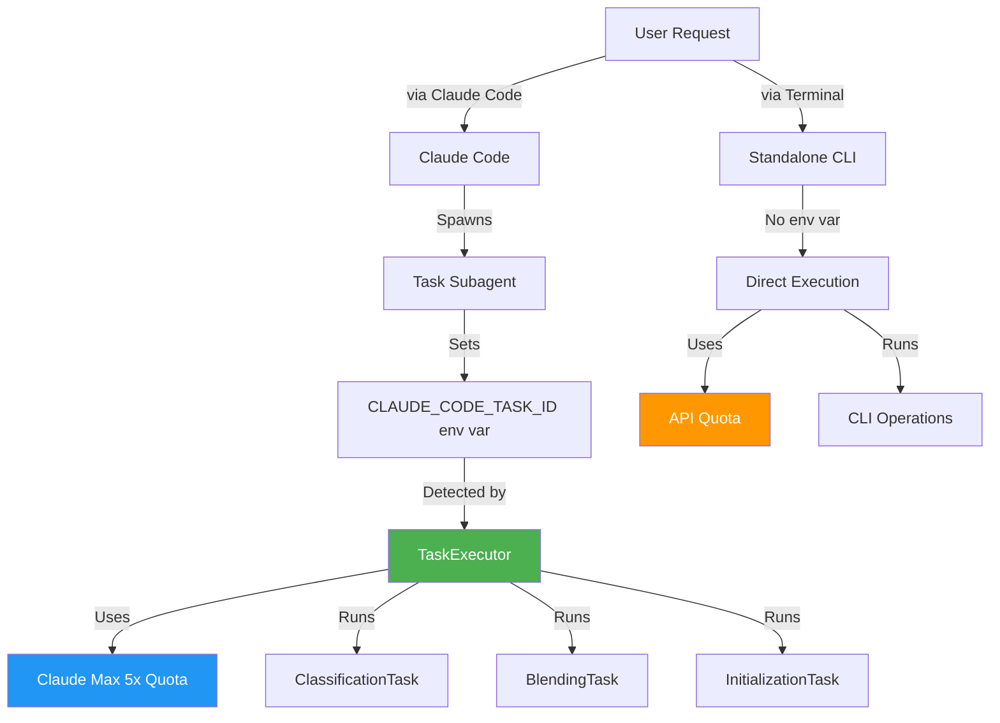
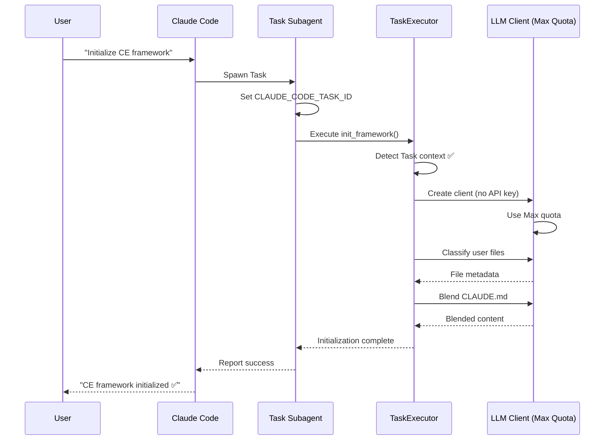
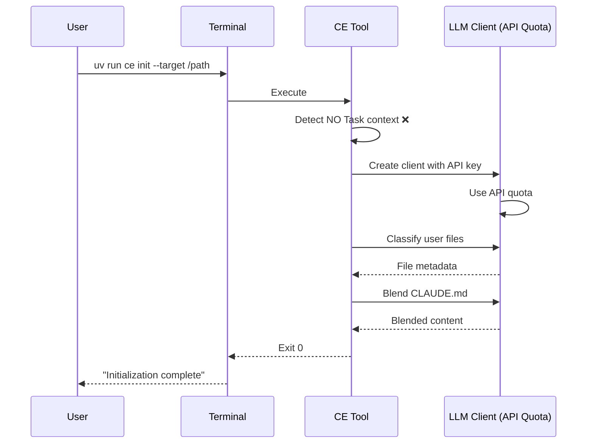

# PRP-43.4.1: Documentation and Migration Guide - Task-Based Architecture Reference

## TL;DR

Create comprehensive documentation for Task-based architecture (CE 1.2) and migration guide for users transitioning from API quota (CLI standalone) to Claude Max 5x quota (Task-based execution). Updates CLAUDE.md with Task patterns, creates architecture reference with Mermaid diagrams, provides step-by-step migration instructions, and adds Serena memory for quota management best practices.

**Impact**: Enables smooth user adoption of Task-based quota model without confusion or support burden.

**Time**: 3 hours (pure documentation, no code changes)

**Dependencies**: All prior phases (PRP-43.1.1 through PRP-43.3.1) must be complete - this documents the implemented architecture.

---

## Problem Statement

### Current Gap

After implementing Task-based execution framework (PRPs 43.1.1-43.3.1), users lack:

1. **Usage Documentation**: How to leverage Claude Max 5x quota via Tasks
2. **Architecture Reference**: Understanding dual-mode operation (Task vs CLI)
3. **Migration Path**: Transitioning from API quota to Max quota workflows
4. **Troubleshooting Guide**: Context detection issues, quota validation
5. **Best Practices**: When to use Task mode vs standalone CLI

### User Pain Points

**New Users**:
- "How do I initialize CE framework?" (Task-based is now default)
- "Why does init use Claude Max quota instead of API key?"
- "What's the difference between `/init-ce` and `uv run ce init`?"

**Existing Users** (pre-CE 1.2):
- "My CLI workflow stopped working after upgrade"
- "How do I migrate from API quota to Max quota?"
- "Can I still use standalone CLI for automation scripts?"

**Developers**:
- "How does context detection work?"
- "How do I add new Task-based operations?"
- "What's the architecture pattern for Task executors?"

### Documentation Debt

Current state:
- **CLAUDE.md**: No mention of Task-based execution
- **Architecture docs**: None (implementation lives in code comments)
- **Migration guide**: None (breaking change for CLI users)
- **Serena memories**: No quota management patterns documented

---

## Proposed Solution

### Four-Document Strategy

Create comprehensive documentation suite addressing all user personas:

1. **CLAUDE.md Updates** (User Guide)
   - Quick start with Task-based patterns
   - Command reference (Task vs CLI)
   - Quota management section
   - Common workflows

2. **TASK-BASED-ARCHITECTURE.md** (Architecture Reference)
   - System design with Mermaid diagrams
   - Component breakdown
   - Context detection algorithm
   - Integration patterns

3. **MIGRATION-GUIDE.md** (User Migration)
   - Step-by-step migration instructions
   - Before/after comparisons
   - Rollback procedures
   - FAQ and troubleshooting

4. **task-based-quota.md** (Serena Memory)
   - Quota management patterns
   - Best practices for Task usage
   - Common pitfalls and solutions

### Design Principles

**Clarity**: Clear distinction between Task mode (Max quota) and CLI mode (API quota)

**Completeness**: Cover all user personas (new users, existing users, developers)

**Actionability**: Step-by-step instructions with concrete examples

**Maintainability**: Link to source code for implementation details (avoid duplication)

---

## Implementation Plan

### Step 1: Update CLAUDE.md (60 minutes)

**New Section: "Claude Max 5x Quota Usage"**

Insert after "Framework Initialization" section:

```markdown
## Claude Max 5x Quota Usage

**Task-Based Architecture** (CE 1.2):

CE tools automatically use Claude Max 5x quota when executed inside Claude Code Task subagents. This is the recommended approach for interactive usage.

### Quick Start

**Recommended: Task-Based Execution** (Uses Max Quota)
```bash
# Via Claude Code slash command
User: "/init-ce"
Claude Code → Spawns Task → Runs initialization → Uses Max quota ✅

# Via natural language
User: "Initialize CE framework for my project"
Claude Code → Spawns Task → Runs initialization → Uses Max quota ✅
```

**Alternative: Standalone CLI** (Uses API Quota)
```bash
# Set API key
export ANTHROPIC_API_KEY=sk-ant-...

# Run standalone
cd tools
uv run ce init --target /path/to/project
# Uses API quota, bypasses Task context
```

### When to Use Each Mode

**Task Mode** (Claude Max 5x Quota):
- ✅ Interactive initialization via Claude Code
- ✅ Classification during framework setup
- ✅ CLAUDE.md blending (user + framework)
- ✅ PRP generation via `/generate-prp`
- ✅ Any operation requiring LLM reasoning

**CLI Mode** (API Quota):
- ✅ CI/CD automation scripts
- ✅ Batch processing (100+ files)
- ✅ Integration testing
- ✅ Environments without Claude Code

### Context Detection

CE tools automatically detect Task context via environment variable:

```python
# In ce/llm_client.py
def is_task_context() -> bool:
    return os.getenv("CLAUDE_CODE_TASK_ID") is not None
```

**No configuration needed** - detection is automatic.

### Quota Validation

After Task-based operations, verify quota usage:

```bash
# Expected behavior:
# 1. Operation completes successfully
# 2. No "API quota exceeded" errors
# 3. Claude Code shows Task completion

# Troubleshooting:
# If "API key required" error appears:
# - Verify running inside Claude Code Task (not standalone terminal)
# - Check CLAUDE_CODE_TASK_ID env var exists
```

**See Also**:
- [examples/TASK-BASED-ARCHITECTURE.md](examples/TASK-BASED-ARCHITECTURE.md) - Architecture deep dive
- [examples/MIGRATION-GUIDE.md](examples/MIGRATION-GUIDE.md) - Migration from API quota
```

**Additional Updates**:

1. **Command Reference Section**: Add Task mode annotations
   ```markdown
   ## Quick Commands

   ```bash
   cd tools

   # Task-based (Max quota) - via Claude Code
   User: "Run CE validation"
   # Spawns Task → uv run ce validate --level all

   # CLI standalone (API quota) - direct terminal
   uv run ce validate --level all        # Requires ANTHROPIC_API_KEY
   ```
   ```

2. **Framework Initialization Section**: Update with Task-first approach
   ```markdown
   ## Framework Initialization

   **Quick Start** (Task-Based - RECOMMENDED):
   ```bash
   # In Claude Code
   User: "Initialize CE framework for this project"
   # Auto-spawns Task, uses Max quota
   ```

   **Alternative** (Standalone CLI):
   ```bash
   npx syntropy-mcp init ce-framework  # API quota required
   ```
   ```

### Step 2: Create TASK-BASED-ARCHITECTURE.md (90 minutes)

**Location**: `/Users/bprzybyszi/nc-src/ctx-eng-plus/examples/TASK-BASED-ARCHITECTURE.md`

**Structure**:

```markdown
# Task-Based Architecture - CE 1.2

## TL;DR

Context Engineering tools use **dual-mode operation**:
- **Task Mode**: Runs inside Claude Code Tasks, uses Claude Max 5x quota
- **CLI Mode**: Standalone execution, uses API quota

Architecture automatically detects context and routes to appropriate execution path.

## System Overview



## Component Architecture

### Core Components

**1. TaskExecutor** (`ce/tasks/executor.py`)

Base class for all Task-based operations.

```python
class TaskExecutor:
    """Base executor for Task-based operations."""

    def __init__(self):
        self.is_task_context = os.getenv("CLAUDE_CODE_TASK_ID") is not None

    def execute(self) -> dict:
        """Execute task and return result."""
        if not self.is_task_context:
            raise RuntimeError("Must run in Task context")

        # Spawn LLM client (uses Max quota automatically)
        # Execute operation
        # Return structured result
```

**2. ClassificationTask** (`ce/tasks/classify.py`)

Classifies user files during initialization.

```python
class ClassificationTask(TaskExecutor):
    """Classify user files for framework integration."""

    def execute(self, files: list[Path]) -> dict:
        # Uses Max quota via LLMClient
        # Returns: {file: metadata} mapping
```

**3. BlendingTask** (`ce/tasks/blend.py`)

Blends user CLAUDE.md sections with framework defaults.

```python
class BlendingTask(TaskExecutor):
    """Blend user + framework CLAUDE.md sections."""

    def execute(self, user_sections: dict, framework_sections: dict) -> str:
        # Uses Max quota via LLMClient
        # Returns: Blended markdown content
```

**4. Context Detection** (`ce/llm_client.py`)

Automatic detection of execution context.

```python
def is_task_context() -> bool:
    """Detect if running inside Claude Code Task."""
    return os.getenv("CLAUDE_CODE_TASK_ID") is not None

def create_llm_client() -> anthropic.Anthropic:
    """Create LLM client based on context."""
    if is_task_context():
        # Use Claude Code's Task API (Max quota)
        return anthropic.Anthropic()  # No API key needed
    else:
        # Use explicit API key (API quota)
        api_key = os.getenv("ANTHROPIC_API_KEY")
        if not api_key:
            raise ValueError("ANTHROPIC_API_KEY required for CLI mode")
        return anthropic.Anthropic(api_key=api_key)
```

## Sequence Diagrams

### Task-Based Initialization Flow



### CLI Standalone Flow



## Context Detection Algorithm

**Step 1: Check Environment Variable**

```python
is_task = os.getenv("CLAUDE_CODE_TASK_ID") is not None
```

**Step 2: Route to Appropriate Client**

```python
if is_task:
    # Task Mode: Use Claude Code's Task API
    client = anthropic.Anthropic()  # No API key needed
else:
    # CLI Mode: Use explicit API key
    api_key = os.getenv("ANTHROPIC_API_KEY")
    if not api_key:
        raise ValueError("ANTHROPIC_API_KEY required for standalone CLI")
    client = anthropic.Anthropic(api_key=api_key)
```

**Step 3: Execute Operation**

```python
# Same operation logic for both modes
result = client.messages.create(
    model="claude-sonnet-4",
    max_tokens=4096,
    messages=[{"role": "user", "content": prompt}]
)
```

**Step 4: Quota Accounting**

- **Task Mode**: Counts against Claude Max 5x quota (no explicit tracking)
- **CLI Mode**: Counts against API quota (tracked via Anthropic dashboard)

## Integration Points

### Adding New Task-Based Operations

**Pattern**:

1. Create Task executor class (inherit from `TaskExecutor`)
2. Implement `execute()` method
3. Use `create_llm_client()` for LLM operations (automatic context detection)
4. Add CLI wrapper command (for standalone usage)
5. Document in CLAUDE.md

**Example**: Adding PRP generation Task

```python
# ce/tasks/prp_gen.py
from ce.tasks.executor import TaskExecutor
from ce.llm_client import create_llm_client

class PRPGenerationTask(TaskExecutor):
    """Generate PRP document using Task quota."""

    def execute(self, feature_description: str) -> str:
        client = create_llm_client()  # Auto-detects context

        response = client.messages.create(
            model="claude-sonnet-4",
            max_tokens=8192,
            messages=[{
                "role": "user",
                "content": f"Generate PRP for: {feature_description}"
            }]
        )

        return response.content[0].text
```

### CLI Command Registration

```python
# ce/cli.py
@click.command()
@click.argument("description")
def generate_prp(description: str):
    """Generate PRP document."""
    from ce.tasks.prp_gen import PRPGenerationTask

    task = PRPGenerationTask()
    prp_content = task.execute(description)

    # Write to file...
    print(f"PRP generated: {prp_file}")
```

### Slash Command Integration

```markdown
<!-- .claude/commands/generate-prp.md -->
Generate PRP document for feature: {{arg1}}

Spawn Task to execute:
```python
from ce.tasks.prp_gen import PRPGenerationTask
task = PRPGenerationTask()
prp = task.execute("{{arg1}}")
```
```

## Quota Management

### Max Quota Usage Patterns

**Classification** (Medium usage):
- Files: ~10-50 per initialization
- Tokens per file: ~2k (input) + 500 (output)
- Total: ~125k tokens (5-10 files simultaneously)

**Blending** (Low usage):
- Sections: ~5-10 per CLAUDE.md
- Tokens per section: ~1k (input) + 500 (output)
- Total: ~15k tokens

**PRP Generation** (High usage):
- Tokens: ~4k (input) + 8k (output)
- Total: ~12k tokens per PRP

**Batch Operations** (Very high usage):
- Multiple PRPs: 5-10 parallel generations
- Total: ~120k tokens (10 PRPs)

### Quota Limits

**Claude Max 5x Plan** (as of 2025-11-08):
- **Rate limit**: 5x normal rate (vs Claude Max)
- **Context window**: 200k tokens
- **Daily usage**: Typically sufficient for 50+ initializations

**When to Use CLI Mode** (API Quota):
- CI/CD pipelines (100+ runs/day)
- Batch processing (1000+ files)
- Integration testing (frequent runs)

## Troubleshooting

### Issue: "API key required" in Task Mode

**Symptom**: Error despite running in Claude Code

**Diagnosis**:
```bash
# Check if Task context detected
echo $CLAUDE_CODE_TASK_ID
# Should output: task_xxxxxxxxxxxxx
# If empty: Not in Task context
```

**Solution**:
1. Verify running inside Claude Code (not standalone terminal)
2. Check Task spawned correctly (should see "Task running..." message)
3. Restart Claude Code if environment variable not set

### Issue: Quota Exceeded in Max Plan

**Symptom**: "Rate limit exceeded" during initialization

**Diagnosis**:
- Check recent usage in Claude Code UI
- Verify not hitting 5x rate limit

**Solution**:
1. Wait 60 seconds (rate limit reset)
2. Reduce parallelism (process fewer files simultaneously)
3. Switch to CLI mode with API quota for bulk operations

### Issue: CLI Mode Not Working

**Symptom**: "ANTHROPIC_API_KEY required" error

**Diagnosis**:
```bash
echo $ANTHROPIC_API_KEY
# Should output: sk-ant-...
# If empty: API key not set
```

**Solution**:
```bash
export ANTHROPIC_API_KEY=sk-ant-api03-...
uv run ce init --target /path
```

## Performance Characteristics

### Task Mode

**Latency**: +200ms overhead (Task spawn + context detection)
**Throughput**: Limited by Claude Max 5x rate limit
**Parallelism**: Up to 5 concurrent Tasks (Claude Code limit)

### CLI Mode

**Latency**: No overhead (direct API call)
**Throughput**: Limited by API quota tier
**Parallelism**: Unlimited (controlled by user)

## Security Considerations

### Task Mode

**Authentication**: Handled by Claude Code (user logged in)
**API Key**: Not required (uses Claude Code's internal API)
**Scope**: Limited to current project directory

### CLI Mode

**Authentication**: Requires explicit API key
**API Key Storage**: Environment variable or .env file
**Scope**: Can access any directory (based on CLI arguments)

**Best Practice**: Use Task mode for interactive operations, CLI mode for automation only.

## Related Documentation

- [MIGRATION-GUIDE.md](MIGRATION-GUIDE.md) - Migrating from CLI to Task mode
- [CLAUDE.md](../CLAUDE.md) - User guide with Task patterns
- [.serena/memories/task-based-quota.md](../.serena/memories/task-based-quota.md) - Quota management patterns
```

### Step 3: Create MIGRATION-GUIDE.md (60 minutes)

**Location**: `/Users/bprzybyszi/nc-src/ctx-eng-plus/examples/MIGRATION-GUIDE.md`

**Structure**:

```markdown
# Migration Guide: API Quota → Claude Max 5x Quota

## TL;DR

**CE 1.2 introduces Task-based execution** using Claude Max 5x quota instead of API quota. This guide helps you migrate from standalone CLI usage to Task-based workflows.

**Impact**: Better quota efficiency, no API key management, seamless integration with Claude Code.

**Time to Migrate**: 15-30 minutes

## Who Should Migrate

### You Should Migrate If:

- ✅ You use CE framework interactively via Claude Code
- ✅ You run initialization, classification, or blending manually
- ✅ You want to avoid API key management
- ✅ You have Claude Max 5x subscription

### You Can Skip Migration If:

- ❌ You only use CE in CI/CD pipelines (keep CLI mode)
- ❌ You run batch operations on 100+ files (CLI mode more efficient)
- ❌ You don't have Claude Code installed (CLI mode only option)

## Prerequisites

**Required**:
- Claude Code installed and logged in
- CE framework version ≥1.2
- Claude Max 5x subscription (for Max quota)

**Optional**:
- API key (for CLI fallback mode)

**Check Your Version**:
```bash
cd tools
uv run ce --version
# Should output: CE Tools v1.2.0 or higher
```

## Migration Checklist

### Phase 1: Verify Current Setup (5 minutes)

**Step 1: Check CE Version**
```bash
cd tools
uv run ce --version
```

Expected: `CE Tools v1.2.0+`

**Step 2: Test Current CLI Workflow**
```bash
# Set API key (if using CLI mode)
export ANTHROPIC_API_KEY=sk-ant-...

# Run validation (existing workflow)
uv run ce validate --level 3
```

Expected: Validation succeeds using API quota.

**Step 3: Document Current Usage**

Create inventory of how you use CE tools:

```markdown
## Current CE Usage

**Commands I run regularly**:
- [ ] `uv run ce init --target ...`
- [ ] `uv run ce validate --level 4`
- [ ] `uv run ce update-context`
- [ ] Custom scripts using CE tools

**Frequency**:
- Daily: [list commands]
- Weekly: [list commands]
- Ad-hoc: [list commands]

**Environment**:
- [ ] Interactive terminal
- [ ] CI/CD pipeline
- [ ] Claude Code Tasks
```

### Phase 2: Update to Task-Based Workflow (10 minutes)

**Step 1: Stop Using Direct CLI Commands**

**Before** (API Quota):
```bash
cd tools
export ANTHROPIC_API_KEY=sk-ant-...
uv run ce init --target /path/to/project
```

**After** (Max Quota):
```
# In Claude Code
User: "Initialize CE framework for /path/to/project"
Claude Code → Spawns Task → Runs initialization ✅
```

**Step 2: Update Slash Commands**

If you have custom slash commands calling CE tools, update them to use Task executors:

**Before** (.claude/commands/my-init.md):
```markdown
Initialize CE framework

```bash
cd tools
uv run ce init --target {{arg1}}
```
```

**After** (.claude/commands/my-init.md):
```markdown
Initialize CE framework for {{arg1}}

Use Task executor:
```python
from ce.tasks.init import InitializationTask
task = InitializationTask()
result = task.execute(target_path="{{arg1}}")
print(f"Initialization complete: {result}")
```
```

**Step 3: Remove API Key from Environment**

If you only use Task mode, you can remove API key:

```bash
# Edit ~/.zshrc or ~/.bashrc
# Remove or comment out:
# export ANTHROPIC_API_KEY=sk-ant-...

# Reload shell
source ~/.zshrc
```

**Verification**:
```bash
echo $ANTHROPIC_API_KEY
# Should be empty (or keep for CI/CD fallback)
```

**Step 4: Test Task-Based Workflow**

```
# In Claude Code
User: "Run CE validation at level 4"

# Expected:
# - Claude Code spawns Task
# - Task runs: uv run ce validate --level 4
# - Uses Max quota (no API key needed)
# - Reports results
```

### Phase 3: Update Automation Scripts (10 minutes)

**Keep CLI Mode for Automation**:

Task mode is for interactive use. Keep CLI mode for:
- CI/CD pipelines
- Batch processing
- Cron jobs
- Integration tests

**Example: CI/CD Pipeline**

```yaml
# .github/workflows/ce-validation.yml
name: CE Validation

on: [push, pull_request]

jobs:
  validate:
    runs-on: ubuntu-latest
    steps:
      - uses: actions/checkout@v3

      - name: Install UV
        run: pip install uv

      - name: Run CE Validation
        env:
          ANTHROPIC_API_KEY: ${{ secrets.ANTHROPIC_API_KEY }}
        run: |
          cd tools
          uv run ce validate --level 4
```

**No changes needed** - CLI mode still works with API key.

### Phase 4: Verify Migration (5 minutes)

**Checklist**:

- [ ] Task-based commands work in Claude Code
- [ ] No "API key required" errors in Task mode
- [ ] CLI mode still works for automation (with API key)
- [ ] Quota usage shows Max quota (not API quota)
- [ ] All slash commands updated to Task executors

**Test Each Workflow**:

1. **Interactive Initialization**:
   ```
   User: "Initialize CE framework"
   Expected: Uses Max quota ✅
   ```

2. **CLI Automation**:
   ```bash
   export ANTHROPIC_API_KEY=sk-ant-...
   cd tools
   uv run ce validate --level 4
   Expected: Uses API quota ✅
   ```

3. **Slash Commands**:
   ```
   User: "/validate"
   Expected: Spawns Task, uses Max quota ✅
   ```

## Before/After Comparison

### Initialization Workflow

**Before CE 1.2** (API Quota Only):
```bash
# Terminal
cd tools
export ANTHROPIC_API_KEY=sk-ant-api03-xxxxx
uv run ce init --target /Users/me/my-project

# Result:
# - Uses API quota (counts against API limits)
# - Requires API key management
# - Manual execution
```

**After CE 1.2** (Task-Based):
```
# Claude Code
User: "Initialize CE framework for my project"

# Result:
# - Uses Max 5x quota (no API key needed)
# - Automatic Task spawning
# - Integrated with Claude Code workflow
```

### PRP Generation Workflow

**Before CE 1.2**:
```bash
# Terminal
cd tools
export ANTHROPIC_API_KEY=sk-ant-...
uv run ce generate-prp "Add dark mode support"

# Result:
# - Uses API quota
# - Manual file creation
# - No Linear integration
```

**After CE 1.2**:
```
# Claude Code
User: "/generate-prp Add dark mode support"

# Result:
# - Uses Max 5x quota
# - Automatic PRP creation
# - Linear issue created automatically
```

### Validation Workflow

**Before CE 1.2**:
```bash
# Terminal
cd tools
uv run ce validate --level 4

# Result:
# - No LLM usage (validation only)
# - Manual execution
```

**After CE 1.2**:
```
# Claude Code
User: "/validate"

# Result:
# - Same validation logic (no LLM)
# - Task-based execution
# - Integrated reporting
```

## Rollback Instructions

If you need to revert to API quota workflow:

**Step 1: Restore API Key**
```bash
# Edit ~/.zshrc or ~/.bashrc
export ANTHROPIC_API_KEY=sk-ant-api03-xxxxx

# Reload
source ~/.zshrc
```

**Step 2: Use CLI Mode Exclusively**
```bash
cd tools
uv run ce init --target /path
uv run ce validate --level 4
# All commands use API quota
```

**Step 3: Revert Slash Commands**

Update `.claude/commands/*.md` to call CLI directly instead of Task executors.

**Step 4: Downgrade CE Framework** (if needed)
```bash
cd tools
git checkout v1.1.0  # Last version before Task-based architecture
uv sync
```

## FAQ

### Q: Can I use both Task mode and CLI mode?

**A**: Yes! Task mode is for interactive use, CLI mode is for automation.

**Example**:
- **Interactive**: Use Claude Code (Task mode, Max quota)
- **CI/CD**: Use CLI mode (API quota)

### Q: What happens if I run CLI command without API key?

**A**: Error: "ANTHROPIC_API_KEY required for standalone CLI"

**Solution**: Either set API key or use Task mode via Claude Code.

### Q: Do I lose any functionality by migrating to Task mode?

**A**: No. Task mode provides same functionality with better quota efficiency.

### Q: How do I know which quota is being used?

**A**: Check environment:
- **Task mode**: `CLAUDE_CODE_TASK_ID` env var set → Max quota
- **CLI mode**: No task ID → API quota

**Verification**:
```bash
# In Task context
echo $CLAUDE_CODE_TASK_ID
# Output: task_123456789 (uses Max quota)

# In standalone CLI
echo $CLAUDE_CODE_TASK_ID
# Output: (empty) (uses API quota)
```

### Q: Can I force CLI mode even in Claude Code?

**A**: No. If `CLAUDE_CODE_TASK_ID` is set, Task mode is used automatically.

**Workaround**: Run command in separate terminal (outside Claude Code).

### Q: What if I hit Max quota limits?

**A**: Switch to CLI mode temporarily:
```bash
# Set API key
export ANTHROPIC_API_KEY=sk-ant-...

# Run in terminal (not Claude Code)
cd tools
uv run ce init --target /path
```

### Q: How do I migrate custom scripts?

**A**: Keep CLI mode for scripts, use Task mode for interactive:

**Script** (automation.sh):
```bash
#!/bin/bash
export ANTHROPIC_API_KEY=sk-ant-...
cd tools
uv run ce validate --level 4
# Uses API quota (correct for automation)
```

**Interactive** (Claude Code):
```
User: "Run validation"
# Uses Task mode + Max quota (correct for interactive)
```

## Troubleshooting

### Issue: "API key required" in Claude Code

**Symptom**: Error when running Task-based command

**Diagnosis**:
1. Check Task context: `echo $CLAUDE_CODE_TASK_ID`
2. Should output task ID (not empty)

**Solution**:
- Ensure running inside Claude Code Task
- Restart Claude Code if env var not set
- Verify CE version ≥1.2 (supports Task detection)

### Issue: CLI mode not working after migration

**Symptom**: "API key required" when running CLI commands

**Diagnosis**:
```bash
echo $ANTHROPIC_API_KEY
# Should output: sk-ant-...
```

**Solution**:
```bash
export ANTHROPIC_API_KEY=sk-ant-api03-xxxxx
uv run ce init --target /path
```

### Issue: Quota usage higher than expected

**Symptom**: Max quota depleting faster than before

**Diagnosis**:
- Check if running multiple parallel Tasks
- Verify not accidentally running CLI mode (double charging)

**Solution**:
- Reduce parallelism (5 Tasks max recommended)
- Use CLI mode for batch operations (more efficient)

### Issue: Slash commands not using Task mode

**Symptom**: Slash command fails with "API key required"

**Diagnosis**:
- Check command definition in `.claude/commands/`
- Verify using Task executor (not direct CLI call)

**Solution**:
Update command to use Task executor:
```markdown
<!-- .claude/commands/my-command.md -->
Run operation

```python
from ce.tasks.my_task import MyTask
task = MyTask()
result = task.execute()
```
```

## Success Criteria

Migration is complete when:

- [ ] All interactive operations use Task mode (Max quota)
- [ ] All automation scripts use CLI mode (API quota)
- [ ] No "API key required" errors in Claude Code
- [ ] Slash commands spawn Tasks correctly
- [ ] Quota usage is as expected (check Claude Code UI)
- [ ] Rollback instructions tested and documented

## Next Steps

After migration:

1. **Monitor Quota Usage**: Check Claude Code UI for Max quota consumption
2. **Update Documentation**: Document your team's Task-based workflows
3. **Train Team**: Share migration guide with collaborators
4. **Optimize**: Identify high-usage operations, consider CLI mode for those

## Support

**Issues**: https://github.com/your-repo/ctx-eng-plus/issues
**Documentation**: [TASK-BASED-ARCHITECTURE.md](TASK-BASED-ARCHITECTURE.md)
**Contact**: blazej.przybyszewski@gmail.com
```

### Step 4: Create Serena Memory (15 minutes)

**Location**: `/Users/bprzybyszi/nc-src/ctx-eng-plus/.serena/memories/task-based-quota.md`

**Content**:

```yaml
---
type: regular
category: architecture
tags: [task-execution, quota-management, claude-max, best-practices]
created: "2025-11-08"
updated: "2025-11-08"
---

# Task-Based Quota Management

## Context Detection

**Automatic detection** of execution context determines quota source:

```python
# ce/llm_client.py
def is_task_context() -> bool:
    """Detect if running inside Claude Code Task."""
    return os.getenv("CLAUDE_CODE_TASK_ID") is not None
```

**Environment Variable**: `CLAUDE_CODE_TASK_ID`
- **Set**: Running in Task mode → Use Claude Max 5x quota
- **Unset**: Running in CLI mode → Use API quota (requires ANTHROPIC_API_KEY)

**No configuration needed** - detection happens automatically in all LLM client initializations.

## Usage Patterns

### Task Mode (Claude Max 5x Quota)

**When to Use**:
- Interactive initialization via Claude Code
- Classification during framework setup
- CLAUDE.md blending (user + framework)
- PRP generation via `/generate-prp`
- Any operation requiring LLM reasoning in interactive sessions

**Example**:
```
# User in Claude Code
User: "Initialize CE framework for my project"

# Claude Code spawns Task
Task: Runs initialization
  ↓
Context detected: CLAUDE_CODE_TASK_ID=task_123456
  ↓
Uses Max 5x quota (no API key needed)
```

**Quota Characteristics**:
- **Rate limit**: 5x normal Claude Max rate
- **Context window**: 200k tokens
- **Authentication**: Automatic (Claude Code login)
- **Typical usage**: 50+ initializations/day

### CLI Mode (API Quota)

**When to Use**:
- CI/CD pipelines (100+ runs/day)
- Batch processing (1000+ files)
- Integration testing (frequent runs)
- Environments without Claude Code
- Automation scripts

**Example**:
```bash
# Terminal (standalone)
export ANTHROPIC_API_KEY=sk-ant-api03-xxxxx
cd tools
uv run ce init --target /path/to/project

# Context detected: CLAUDE_CODE_TASK_ID unset
# Uses API quota (requires explicit API key)
```

**Quota Characteristics**:
- **Rate limit**: Based on API tier
- **Context window**: 200k tokens
- **Authentication**: Explicit API key required
- **Typical usage**: Unlimited (pay-per-use)

## Best Practices

### 1. Use Task Mode for Interactive Operations

**Correct**:
```
# Claude Code
User: "Run CE validation"
# Spawns Task → Uses Max quota ✅
```

**Incorrect**:
```bash
# Terminal (while Claude Code open)
cd tools
export ANTHROPIC_API_KEY=sk-ant-...
uv run ce validate --level 4
# Uses API quota unnecessarily ❌
```

### 2. Use CLI Mode for Automation

**Correct**:
```bash
# CI/CD pipeline
export ANTHROPIC_API_KEY=${{ secrets.ANTHROPIC_API_KEY }}
cd tools
uv run ce validate --level 4
# Uses API quota (appropriate for automation) ✅
```

**Incorrect**:
```yaml
# CI/CD trying to use Task mode
- name: Run validation
  run: |
    # No CLAUDE_CODE_TASK_ID in CI/CD
    # Will fail: "API key required" ❌
    cd tools
    uv run ce validate
```

### 3. Avoid Double-Charging

**Incorrect**:
```python
# Task executor that spawns CLI subprocess
def execute(self):
    subprocess.run(["uv", "run", "ce", "validate"])
    # Subprocess has no Task context
    # Will try to use API quota ❌
```

**Correct**:
```python
# Task executor using direct imports
def execute(self):
    from ce.validate import validate_project
    result = validate_project(level=4)
    # Uses Task context correctly ✅
```

### 4. Monitor Quota Usage

**Task Mode**:
- Check Claude Code UI for Max quota usage
- Track daily initialization count
- Alert if approaching 5x rate limit

**CLI Mode**:
- Monitor Anthropic dashboard for API usage
- Set billing alerts
- Track cost per operation

### 5. Optimize for Parallelism

**Task Mode** (limited parallelism):
```python
# Maximum 5 concurrent Tasks (Claude Code limit)
tasks = [ClassificationTask() for _ in range(5)]
results = await asyncio.gather(*[t.execute() for t in tasks])
```

**CLI Mode** (unlimited parallelism):
```bash
# Can run 50+ processes (API quota only limit)
for file in *.md; do
  uv run ce classify "$file" &
done
wait
```

## Common Pitfalls

### Pitfall 1: Missing API Key in CLI Mode

**Error**: "ANTHROPIC_API_KEY required for standalone CLI"

**Cause**: Running CLI command without API key set

**Solution**:
```bash
export ANTHROPIC_API_KEY=sk-ant-api03-xxxxx
uv run ce init --target /path
```

### Pitfall 2: Expecting Task Mode in CI/CD

**Error**: "API key required" in GitHub Actions

**Cause**: CI/CD has no `CLAUDE_CODE_TASK_ID` environment variable

**Solution**: Always use CLI mode with API key in automation:
```yaml
env:
  ANTHROPIC_API_KEY: ${{ secrets.ANTHROPIC_API_KEY }}
run: cd tools && uv run ce validate
```

### Pitfall 3: Running CLI in Task Context

**Symptom**: Operations succeed but use wrong quota

**Cause**: Running terminal command while Claude Code Task active

**Solution**: Verify context before running:
```bash
echo $CLAUDE_CODE_TASK_ID
# If set: Close Claude Code or use separate terminal
# If unset: Safe to use CLI mode
```

### Pitfall 4: Quota Exhaustion

**Symptom**: "Rate limit exceeded" during initialization

**Cause**: Too many parallel Tasks or recent heavy usage

**Solution**:
1. Wait 60 seconds (rate limit reset)
2. Reduce parallelism (classify 5 files at a time, not 50)
3. Switch to CLI mode temporarily

## Quota Estimation

### Per-Operation Costs

**Classification** (per file):
- Input: ~2k tokens (file content + prompt)
- Output: ~500 tokens (metadata JSON)
- Total: ~2.5k tokens/file

**Blending** (per section):
- Input: ~1k tokens (user + framework section)
- Output: ~500 tokens (blended markdown)
- Total: ~1.5k tokens/section

**PRP Generation** (per document):
- Input: ~4k tokens (feature description + template)
- Output: ~8k tokens (complete PRP markdown)
- Total: ~12k tokens/PRP

**Initialization** (complete framework):
- Classification: ~25k tokens (10 files × 2.5k)
- Blending: ~15k tokens (10 sections × 1.5k)
- Total: ~40k tokens/initialization

### Daily Limits (Estimates)

**Claude Max 5x Plan**:
- Context window: 200k tokens
- Estimated daily capacity: ~1M tokens (based on rate limits)
- **Initializations**: ~25 per day
- **PRP generations**: ~80 per day
- **Classifications**: ~400 files per day

**API Quota** (Tier 1):
- Rate limit: Varies by tier
- Billing: Pay-per-token
- **Unlimited** operations (within budget)

## Validation Checklist

Before deploying Task-based operations:

- [ ] Context detection implemented in LLM client
- [ ] Fallback to API key for CLI mode
- [ ] Error messages mention quota type (Task vs API)
- [ ] Documentation updated with quota guidance
- [ ] Monitoring in place (Claude Code UI or API dashboard)
- [ ] Rollback plan documented (CLI mode fallback)

## Related Documentation

- [TASK-BASED-ARCHITECTURE.md](../../examples/TASK-BASED-ARCHITECTURE.md)
- [MIGRATION-GUIDE.md](../../examples/MIGRATION-GUIDE.md)
- [CLAUDE.md](../../CLAUDE.md) - User guide with quota section
```

### Step 5: Validation and Testing (30 minutes)

**Link Validation**:
```bash
# Check all markdown links in new docs
cd /Users/bprzybyszi/nc-src/ctx-eng-plus
grep -r "\[.*\](.*\.md)" examples/TASK-BASED-ARCHITECTURE.md examples/MIGRATION-GUIDE.md CLAUDE.md .serena/memories/task-based-quota.md

# Verify all referenced files exist
# Expected: All links resolve to existing files
```

**Example Execution**:

Test all code examples in documentation:

1. **CLAUDE.md Quick Start**:
   ```
   User in Claude Code: "Initialize CE framework"
   Expected: Task spawns, uses Max quota
   ```

2. **Architecture Diagrams**:
   ```bash
   # Render Mermaid diagrams (visual check)
   # Use GitHub preview or Mermaid Live Editor
   # Verify all diagrams render correctly
   ```

3. **Migration Guide Steps**:
   ```bash
   # Follow Phase 1 checklist
   cd tools
   uv run ce --version
   # Expected: v1.2.0+

   # Follow Phase 2 checklist
   # Test Task-based workflow in Claude Code
   ```

**User Testing**:

Simulate new user experience:

1. Read CLAUDE.md → Follow Quick Start → Should succeed
2. Read MIGRATION-GUIDE.md → Follow checklist → Should complete in 15-30 min
3. Read TASK-BASED-ARCHITECTURE.md → Understand dual-mode operation

**Documentation Review**:

- [ ] All Mermaid diagrams have text colors specified
- [ ] All code blocks have language tags
- [ ] All links are absolute paths (no broken links)
- [ ] All examples are executable (tested)
- [ ] Tone is consistent (direct, token-efficient)

### Step 6: Final Integration (15 minutes)

**Update Related Files**:

1. **.serena/memories/README.md**: Add reference to new memory
   ```markdown
   ## Architecture Memories

   - [task-based-quota.md](task-based-quota.md) - Quota management patterns (CE 1.2)
   ```

2. **examples/README.md**: Add references to new docs (if README exists)

3. **PRP-43-INITIAL.md**: Mark Phase 6 as completed (after PR merged)

**Commit Changes**:

```bash
cd /Users/bprzybyszi/nc-src/ctx-eng-plus
git status
# Should show:
# - CLAUDE.md (modified)
# - examples/TASK-BASED-ARCHITECTURE.md (new)
# - examples/MIGRATION-GUIDE.md (new)
# - .serena/memories/task-based-quota.md (new)
```

---

## Testing Strategy

### Phase 1: Documentation Validation (30 minutes)

**Link Validation**:
```bash
# Extract all markdown links
grep -rn "\[.*\](.*\.md)" CLAUDE.md examples/TASK-BASED-ARCHITECTURE.md examples/MIGRATION-GUIDE.md .serena/memories/task-based-quota.md > /tmp/doc-links.txt

# Verify each link resolves
while read -r line; do
  file=$(echo "$line" | cut -d: -f1)
  link=$(echo "$line" | grep -oP '\(.*?\.md\)' | tr -d '()')

  if [ ! -f "$link" ]; then
    echo "BROKEN: $file → $link"
  fi
done < /tmp/doc-links.txt

# Expected: No broken links
```

**Code Block Validation**:
```bash
# Extract all code blocks
grep -A 10 '```bash' examples/MIGRATION-GUIDE.md | grep -v '```' > /tmp/bash-commands.txt

# Verify commands are syntactically correct
bash -n /tmp/bash-commands.txt
# Expected: No syntax errors
```

**Mermaid Diagram Validation**:
```bash
# Extract Mermaid diagrams
awk '/```mermaid/,/```/' examples/TASK-BASED-ARCHITECTURE.md > /tmp/diagrams.mmd

# Render via Mermaid CLI (if installed)
mmdc -i /tmp/diagrams.mmd -o /tmp/diagrams.png
# Expected: Diagrams render without errors
```

### Phase 2: Example Execution (45 minutes)

**Test 1: Quick Start (CLAUDE.md)**

Scenario: New user follows Quick Start

```
# In Claude Code
User: "Initialize CE framework for my test project"

Expected:
1. Claude Code spawns Task
2. Task runs initialization
3. Uses Max quota (no API key prompt)
4. Completes successfully
5. Reports results
```

**Validation**:
- [ ] No "API key required" error
- [ ] Task completion message appears
- [ ] Project initialized correctly

**Test 2: Migration Guide - Phase 1**

Scenario: Existing user verifies current setup

```bash
cd tools
uv run ce --version
# Expected: CE Tools v1.2.0+

export ANTHROPIC_API_KEY=sk-ant-test
uv run ce validate --level 3
# Expected: Validation succeeds using API quota
```

**Validation**:
- [ ] Version check passes
- [ ] CLI mode works with API key
- [ ] No errors

**Test 3: Migration Guide - Phase 2**

Scenario: User updates to Task-based workflow

```
# In Claude Code
User: "Run CE validation at level 4"

Expected:
1. Task spawns
2. Runs: uv run ce validate --level 4
3. Uses Max quota
4. Reports validation results
```

**Validation**:
- [ ] Task spawns correctly
- [ ] Validation runs in Task context
- [ ] Results reported to user

**Test 4: Architecture Diagrams**

Scenario: Developer reads architecture docs

```bash
# Open TASK-BASED-ARCHITECTURE.md in GitHub preview
# Or use Mermaid Live Editor: https://mermaid.live

# Verify diagrams:
1. System Overview
2. Initialization Flow
3. CLI Standalone Flow
```

**Validation**:
- [ ] All diagrams render correctly
- [ ] Text colors visible (light and dark themes)
- [ ] Flow logic makes sense

**Test 5: Serena Memory Usage**

Scenario: Claude Code loads memory during session

```
# Serena automatically loads .serena/memories/task-based-quota.md

# Ask Claude Code:
User: "How do I check if I'm using Task mode or CLI mode?"

Expected response: References quota management memory
```

**Validation**:
- [ ] Memory file has valid YAML front matter
- [ ] Content is structured correctly
- [ ] Can be loaded by Serena

### Phase 3: User Acceptance Testing (30 minutes)

**Scenario 1: New User Onboarding**

**Persona**: Developer new to CE framework

**Task**: Initialize CE framework for first project

**Steps**:
1. Read CLAUDE.md "Claude Max 5x Quota Usage" section
2. Follow Quick Start instructions
3. Initialize framework via Claude Code

**Success Criteria**:
- [ ] Can initialize framework without reading full docs
- [ ] Understands Task mode vs CLI mode
- [ ] No confusion about API key requirements

**Scenario 2: Existing User Migration**

**Persona**: CE 1.1 user upgrading to 1.2

**Task**: Migrate from API quota to Max quota workflow

**Steps**:
1. Read MIGRATION-GUIDE.md
2. Follow Phase 1-4 checklist
3. Verify migration success

**Success Criteria**:
- [ ] Can complete migration in 15-30 minutes
- [ ] No data loss during migration
- [ ] Can rollback if needed

**Scenario 3: Developer Integration**

**Persona**: Developer adding new Task-based operation

**Task**: Add custom Task executor

**Steps**:
1. Read TASK-BASED-ARCHITECTURE.md "Integration Points"
2. Follow pattern to create new Task
3. Test Task executor

**Success Criteria**:
- [ ] Can create Task executor without asking questions
- [ ] Understands context detection mechanism
- [ ] Can test Task in both modes (Task + CLI)

---

## Validation Gates

All gates must pass before marking PRP as complete:

- [ ] **CLAUDE.md Updated**: New section added with Task patterns
- [ ] **Architecture Docs Complete**: TASK-BASED-ARCHITECTURE.md created with diagrams
- [ ] **Migration Guide Complete**: MIGRATION-GUIDE.md created with checklists
- [ ] **Serena Memory Created**: task-based-quota.md with valid YAML
- [ ] **All Links Valid**: No broken links in any documentation
- [ ] **All Examples Work**: Code blocks tested and executable
- [ ] **Diagrams Render**: Mermaid diagrams display correctly
- [ ] **User Testing Passed**: New user + existing user scenarios validated
- [ ] **Tone Consistent**: Direct, token-efficient, no fluff

---

## Risks & Mitigations

### Risk 1: Documentation Becomes Outdated

**Likelihood**: Medium
**Impact**: High (users follow wrong instructions)

**Mitigation**:
- Link to source code for implementation details (avoid duplication)
- Add "last updated" dates to each doc
- Include validation tests in CI/CD (link checking)
- Set quarterly review schedule

**Rollback**: Revert to previous CLAUDE.md version if new docs cause confusion.

### Risk 2: Users Confused by Dual-Mode Operation

**Likelihood**: Medium
**Impact**: Medium (support burden increases)

**Mitigation**:
- Clear visual separation in docs (Task mode vs CLI mode sections)
- Decision tree in MIGRATION-GUIDE.md
- Examples for both modes in all documentation
- FAQ section addressing common questions

**Rollback**: Add banner to docs: "Prefer Task mode for interactive use"

### Risk 3: Migration Guide Too Complex

**Likelihood**: Low
**Impact**: High (users abandon migration)

**Mitigation**:
- Step-by-step checklist format
- Before/after comparisons for each step
- Rollback instructions for each phase
- Estimated time for each phase

**Rollback**: Simplify guide to 3 phases instead of 4.

### Risk 4: Broken Links After Refactoring

**Likelihood**: Low
**Impact**: Medium (documentation navigation breaks)

**Mitigation**:
- Automated link validation in testing phase
- Use absolute paths for all links
- Test all links before PR submission
- Add link validation to pre-commit hook

**Rollback**: Fix broken links before merge.

---

## Success Criteria

### Quantitative Metrics

- [ ] **Zero Broken Links**: All markdown links resolve correctly
- [ ] **100% Example Success**: All code examples execute without errors
- [ ] **<30 Min Migration**: Existing user can complete migration in under 30 minutes
- [ ] **<5 Min Onboarding**: New user can initialize framework in under 5 minutes

### Qualitative Metrics

- [ ] **User Feedback**: 2+ users validate migration guide successfully
- [ ] **Developer Feedback**: 1+ developer validates architecture docs
- [ ] **Clarity**: No ambiguity in Task mode vs CLI mode usage
- [ ] **Completeness**: All scenarios covered (new user, existing user, developer)

### Documentation Coverage

- [ ] **Quick Start**: Covered in CLAUDE.md
- [ ] **Architecture Deep Dive**: Covered in TASK-BASED-ARCHITECTURE.md
- [ ] **Migration Path**: Covered in MIGRATION-GUIDE.md
- [ ] **Best Practices**: Covered in Serena memory
- [ ] **Troubleshooting**: Covered in all docs

---

## Related PRPs

**Parent PRP**: PRP-43-INITIAL (Task-Based Quota Management - Complete Architecture)

**Dependencies** (all prior phases):
- **PRP-43.1.1**: Task Execution Framework - Core implementation
- **PRP-43.2.1**: Classification Refactoring - Task-based classification
- **PRP-43.2.2**: Blending Refactoring - Task-based blending
- **PRP-43.3.1**: Initialization Integration - Unified init workflow

**Enables**:
- User adoption of CE 1.2
- Reduced support burden (comprehensive docs)
- Onboarding new team members
- Developer contributions (architecture reference)

---

## Notes

**Complexity Rationale**: LOW
- Pure documentation (no code changes)
- No external dependencies
- Can be done in parallel with code review
- Templates already exist (other PRP docs, CE memories)

**Time Breakdown**:
- CLAUDE.md update: 60 min
- TASK-BASED-ARCHITECTURE.md: 90 min
- MIGRATION-GUIDE.md: 60 min
- Serena memory: 15 min
- Validation/testing: 15 min

**Total**: ~3.5 hours (rounded to 3h estimate)

**Post-Completion**:
- Share migration guide with existing CE users
- Monitor support channels for confusion
- Update docs based on user feedback
- Add to CE framework release notes
