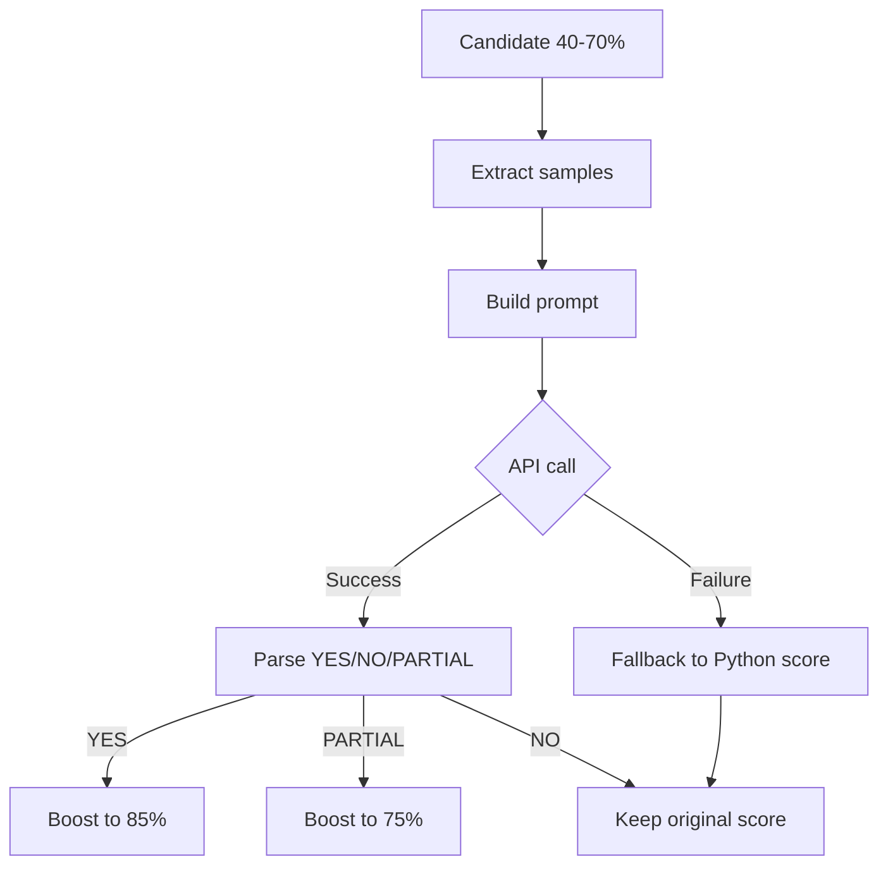

# PRP-46.2.1: LLM Integration (Haiku Analysis)

## Problem Statement

Phase 1 (PRP-46.1.1) provides Python-based heuristic confidence scores for superseded doc detection. However, these scores often fall in the 40-70% "uncertain" range where human judgment is needed. This phase adds Haiku-based semantic analysis to boost confidence for uncertain candidates.

**Current State**: Uncertain candidates require manual review
**Desired State**: LLM analyzes content similarity, boosts confidence to actionable levels (85%+)

**Success Criteria**:
1. Haiku correctly identifies 3 initialization docs (IMPLEMENTATION.md, MCP-INIT.md, INITIALIZATION-GUIDE.md) as superseded by PRP-42
2. Haiku returns NO for unrelated feature requests
3. API failures gracefully fallback to Python confidence scores
4. Total analysis time for 10 candidates < 30 seconds

## Design

### Architecture

```
SupersededDocsStrategy
  ├─> identify_candidates() [Phase 1]
  ├─> LLMAnalyzer.analyze_similarity()  [NEW]
  │     ├─> extract_content_samples()
  │     ├─> build_comparison_prompt()
  │     ├─> call_haiku_api()
  │     └─> parse_response() → YES/NO/PARTIAL
  └─> boost_confidence() [NEW]
```

### LLM Analysis Flow



### Haiku Prompt Design

**Strategy**: Few-shot learning with clear output format

**Template**:
```
Compare two documents and determine if DOC_A is superseded by DOC_B.

DOC_A is superseded if:
- DOC_B covers the same use case with updated approach
- DOC_A explicitly mentions being deprecated
- DOC_B references DOC_A as "old" or "replaced"

Output ONLY one word: YES, NO, or PARTIAL

Examples:

DOC_A: "Manual initialization steps"
DOC_B: "PRP-42: Automated init_project tool replaces manual workflow"
OUTPUT: YES

DOC_A: "Feature request: Add dark mode"
DOC_B: "PRP-42: Initialization automation"
OUTPUT: NO

DOC_A: "Partial initialization guide"
DOC_B: "PRP-42: Complete initialization (includes partial workflow)"
OUTPUT: PARTIAL

Now analyze:

DOC_A ({feature_request_name}):
{feature_request_sample}

DOC_B ({prp_name}):
{prp_sample}

OUTPUT:
```

### Confidence Boost Logic

| Haiku Response | Original Confidence | Boosted Confidence | Rationale |
|----------------|---------------------|-------------------|-----------|
| YES | 40-70% | 85% | Strong semantic match |
| PARTIAL | 40-70% | 75% | Partial overlap, review recommended |
| NO | 40-70% | Keep original | No boost, let Python score stand |
| API Error | 40-70% | Keep original | Fail-safe, no degradation |

### Sample Extraction Strategy

**Goal**: Minimize tokens while maximizing signal

**Approach**:
- Extract first 100 lines from both docs
- Skip YAML frontmatter (lines starting with `---`)
- Skip code blocks longer than 20 lines (keep first 5 lines as representative sample)
- Include all markdown headers (# ## ###) for structure

**Token Budget**: ~400 tokens per doc pair (800 total) + 200 for prompt = 1000 tokens/request

## Implementation Plan

### Step 1: Create LLMAnalyzer Class (60 min)

**File**: `tools/ce/vacuum_strategies/llm_analyzer.py`

```python
"""LLM-based content analysis for vacuum strategies."""

import anthropic
import os
from typing import Literal

class LLMAnalyzer:
    """Haiku-based semantic analysis for document similarity."""

    def __init__(self):
        """Initialize Anthropic client."""
        api_key = os.getenv("ANTHROPIC_API_KEY")
        if not api_key:
            raise ValueError("ANTHROPIC_API_KEY not set")
        self.client = anthropic.Anthropic(api_key=api_key)

    def analyze_similarity(
        self,
        doc_a_name: str,
        doc_a_path: str,
        doc_b_name: str,
        doc_b_path: str
    ) -> Literal["YES", "NO", "PARTIAL"]:
        """
        Compare two documents using Haiku.

        Args:
            doc_a_name: Name of first document (e.g., "IMPLEMENTATION.md")
            doc_a_path: Absolute path to first document
            doc_b_name: Name of second document (e.g., "PRP-42")
            doc_b_path: Absolute path to second document

        Returns:
            "YES" if doc_a superseded by doc_b
            "PARTIAL" if partial overlap
            "NO" if no supersession

        Raises:
            ValueError: If API call fails
        """
        # Extract content samples
        doc_a_sample = self._extract_sample(doc_a_path)
        doc_b_sample = self._extract_sample(doc_b_path)

        # Build prompt
        prompt = self._build_prompt(
            doc_a_name, doc_a_sample,
            doc_b_name, doc_b_sample
        )

        # Call Haiku API
        try:
            response = self.client.messages.create(
                model="claude-3-haiku-20240307",
                max_tokens=10,  # Only need YES/NO/PARTIAL
                messages=[{"role": "user", "content": prompt}]
            )

            # Parse response
            text = response.content[0].text.strip().upper()
            if text in ["YES", "NO", "PARTIAL"]:
                return text
            else:
                # Unexpected response, treat as NO
                return "NO"

        except Exception as e:
            # API failure, propagate for fallback handling
            raise ValueError(f"Haiku API failed: {e}")

    def _extract_sample(self, file_path: str) -> str:
        """
        Extract first 100 meaningful lines from document.

        Rules:
        - Skip YAML frontmatter
        - Include all headers (# ## ###)
        - Truncate code blocks >20 lines to 5 lines
        """
        lines = []
        in_frontmatter = False
        in_code_block = False
        code_block_lines = []

        with open(file_path, 'r', encoding='utf-8') as f:
            for line in f:
                # Handle YAML frontmatter
                if line.strip() == "---":
                    in_frontmatter = not in_frontmatter
                    continue
                if in_frontmatter:
                    continue

                # Handle code blocks
                if line.strip().startswith("```"):
                    if in_code_block:
                        # End of code block
                        if len(code_block_lines) > 20:
                            # Keep first 5 lines
                            lines.extend(code_block_lines[:5])
                            lines.append("... (code block truncated)")
                        else:
                            lines.extend(code_block_lines)
                        code_block_lines = []
                        in_code_block = False
                    else:
                        # Start of code block
                        in_code_block = True
                    continue

                if in_code_block:
                    code_block_lines.append(line.rstrip())
                else:
                    lines.append(line.rstrip())

                # Stop at 100 lines
                if len(lines) >= 100:
                    break

        return "\n".join(lines)

    def _build_prompt(
        self,
        doc_a_name: str,
        doc_a_sample: str,
        doc_b_name: str,
        doc_b_sample: str
    ) -> str:
        """Build comparison prompt with few-shot examples."""
        return f"""Compare two documents and determine if DOC_A is superseded by DOC_B.

DOC_A is superseded if:
- DOC_B covers the same use case with updated approach
- DOC_A explicitly mentions being deprecated
- DOC_B references DOC_A as "old" or "replaced"

Output ONLY one word: YES, NO, or PARTIAL

Examples:

DOC_A: "Manual initialization steps"
DOC_B: "PRP-42: Automated init_project tool replaces manual workflow"
OUTPUT: YES

DOC_A: "Feature request: Add dark mode"
DOC_B: "PRP-42: Initialization automation"
OUTPUT: NO

DOC_A: "Partial initialization guide"
DOC_B: "PRP-42: Complete initialization (includes partial workflow)"
OUTPUT: PARTIAL

Now analyze:

DOC_A ({doc_a_name}):
{doc_a_sample}

DOC_B ({doc_b_name}):
{doc_b_sample}

OUTPUT:"""
```

**Validation**:
```bash
cd tools
uv run pytest tests/test_llm_analyzer.py::test_extract_sample -v
uv run pytest tests/test_llm_analyzer.py::test_build_prompt -v
```

### Step 2: Integrate with SupersededDocsStrategy (45 min)

**File**: `tools/ce/vacuum_strategies/superseded_docs.py`

**Changes**:

1. Import LLMAnalyzer:
```python
from .llm_analyzer import LLMAnalyzer
```

2. Add to `__init__`:
```python
def __init__(self, ...):
    # ... existing code ...
    try:
        self.llm_analyzer = LLMAnalyzer()
    except ValueError:
        # ANTHROPIC_API_KEY not set, LLM analysis disabled
        self.llm_analyzer = None
```

3. Add confidence boost method:
```python
def _boost_confidence_with_llm(
    self,
    candidate: dict,
    original_confidence: float
) -> float:
    """
    Boost confidence using Haiku analysis for uncertain candidates.

    Args:
        candidate: Candidate dict with 'path', 'superseded_by'
        original_confidence: Python heuristic confidence (0.0-1.0)

    Returns:
        Boosted confidence (0.0-1.0)
    """
    # Only analyze uncertain candidates
    if original_confidence < 0.40 or original_confidence > 0.70:
        return original_confidence

    # Skip if LLM disabled
    if self.llm_analyzer is None:
        return original_confidence

    try:
        # Extract PRP path from superseded_by
        prp_match = re.match(r"PRP-(\d+)", candidate["superseded_by"])
        if not prp_match:
            return original_confidence

        prp_number = prp_match.group(1)
        prp_path = f"{self.root_dir}/PRPs/executed/PRP-{prp_number}*.md"
        prp_files = glob.glob(prp_path)
        if not prp_files:
            return original_confidence

        # Call LLM analyzer
        result = self.llm_analyzer.analyze_similarity(
            doc_a_name=candidate["path"].split("/")[-1],
            doc_a_path=candidate["path"],
            doc_b_name=f"PRP-{prp_number}",
            doc_b_path=prp_files[0]
        )

        # Boost confidence based on result
        if result == "YES":
            return 0.85
        elif result == "PARTIAL":
            return 0.75
        else:  # NO
            return original_confidence

    except Exception as e:
        # API failure or other error, keep original score
        return original_confidence
```

4. Update `identify_candidates` to use boost:
```python
def identify_candidates(self) -> List[dict]:
    """Identify feature requests superseded by executed PRPs."""
    candidates = []

    for feature_path in glob.glob(f"{self.root_dir}/PRPs/feature-requests/*.md"):
        # ... existing heuristic analysis ...
        python_confidence = self._calculate_confidence(...)

        # Boost with LLM if available
        final_confidence = self._boost_confidence_with_llm(
            candidate={"path": feature_path, "superseded_by": superseding_prp},
            original_confidence=python_confidence
        )

        candidates.append({
            "path": feature_path,
            "superseded_by": superseding_prp,
            "confidence": final_confidence
        })

    return candidates
```

**Validation**:
```bash
cd tools
uv run pytest tests/test_superseded_docs.py::test_boost_confidence_with_llm -v
uv run pytest tests/test_superseded_docs.py::test_integration_llm_fallback -v
```

### Step 3: Add Tests (60 min)

**File**: `tools/tests/test_llm_analyzer.py`

```python
"""Tests for LLM analyzer."""

import pytest
from ce.vacuum_strategies.llm_analyzer import LLMAnalyzer
import tempfile
import os

def test_extract_sample_skips_frontmatter():
    """Test that YAML frontmatter is excluded from sample."""
    with tempfile.NamedTemporaryFile(mode='w', suffix='.md', delete=False) as f:
        f.write("""---
prp_id: 42
status: executed
---

# Feature

Content here
""")
        f.flush()

        analyzer = LLMAnalyzer()
        sample = analyzer._extract_sample(f.name)

        assert "prp_id" not in sample
        assert "# Feature" in sample
        assert "Content here" in sample

        os.unlink(f.name)

def test_extract_sample_truncates_long_code_blocks():
    """Test that code blocks >20 lines are truncated to 5 lines."""
    with tempfile.NamedTemporaryFile(mode='w', suffix='.md', delete=False) as f:
        f.write("# Header\n\n```python\n")
        for i in range(30):
            f.write(f"line {i}\n")
        f.write("```\n\n# Footer")
        f.flush()

        analyzer = LLMAnalyzer()
        sample = analyzer._extract_sample(f.name)

        assert "line 0" in sample
        assert "line 4" in sample
        assert "line 20" not in sample
        assert "code block truncated" in sample
        assert "# Footer" in sample

        os.unlink(f.name)

def test_build_prompt_includes_examples():
    """Test that prompt includes few-shot examples."""
    analyzer = LLMAnalyzer()
    prompt = analyzer._build_prompt(
        "doc-a.md", "Sample A",
        "PRP-42", "Sample B"
    )

    assert "Manual initialization steps" in prompt  # Example 1
    assert "Feature request: Add dark mode" in prompt  # Example 2
    assert "doc-a.md" in prompt
    assert "Sample A" in prompt
    assert "PRP-42" in prompt
    assert "Sample B" in prompt

@pytest.mark.skipif(not os.getenv("ANTHROPIC_API_KEY"), reason="API key required")
def test_analyze_similarity_real_api():
    """Test real Haiku API call with initialization docs."""
    # Create mock docs
    with tempfile.NamedTemporaryFile(mode='w', suffix='.md', delete=False) as old_doc:
        old_doc.write("""# Manual Initialization Steps

1. Extract boilerplate
2. Copy files manually
3. Activate Serena
4. Build knowledge index

This is the old manual workflow.
""")
        old_doc.flush()
        old_path = old_doc.name

    with tempfile.NamedTemporaryFile(mode='w', suffix='.md', delete=False) as prp_doc:
        prp_doc.write("""# PRP-42: Automated Initialization

Replaces manual workflow with init_project tool.

Automated steps:
1. Extract boilerplate (automatic)
2. Copy files (automatic)
3. Activate Serena (automatic)
4. Build knowledge index (automatic)

Supersedes: IMPLEMENTATION.md, MCP-INIT.md, INITIALIZATION-GUIDE.md
""")
        prp_doc.flush()
        prp_path = prp_doc.name

    analyzer = LLMAnalyzer()
    result = analyzer.analyze_similarity(
        "old-manual.md", old_path,
        "PRP-42", prp_path
    )

    assert result == "YES"

    os.unlink(old_path)
    os.unlink(prp_path)

def test_analyze_similarity_api_failure():
    """Test that API failures raise ValueError."""
    analyzer = LLMAnalyzer()
    # Temporarily break API key
    original_key = os.getenv("ANTHROPIC_API_KEY")
    os.environ["ANTHROPIC_API_KEY"] = "invalid-key"

    with tempfile.NamedTemporaryFile(mode='w', suffix='.md') as f1:
        f1.write("doc 1")
        f1.flush()
        with tempfile.NamedTemporaryFile(mode='w', suffix='.md') as f2:
            f2.write("doc 2")
            f2.flush()

            # Recreate analyzer with bad key
            analyzer = LLMAnalyzer()
            with pytest.raises(ValueError, match="Haiku API failed"):
                analyzer.analyze_similarity("doc1", f1.name, "doc2", f2.name)

    # Restore key
    if original_key:
        os.environ["ANTHROPIC_API_KEY"] = original_key
```

**File**: `tools/tests/test_superseded_docs.py` (additions)

```python
def test_boost_confidence_with_llm_yes(tmp_path):
    """Test confidence boost to 85% when Haiku returns YES."""
    # Setup mock LLM analyzer
    class MockLLMAnalyzer:
        def analyze_similarity(self, *args, **kwargs):
            return "YES"

    strategy = SupersededDocsStrategy(root_dir=str(tmp_path))
    strategy.llm_analyzer = MockLLMAnalyzer()

    # Create mock candidate
    candidate = {
        "path": str(tmp_path / "PRPs/feature-requests/old.md"),
        "superseded_by": "PRP-42"
    }

    # Create mock PRP
    prp_dir = tmp_path / "PRPs/executed"
    prp_dir.mkdir(parents=True)
    (prp_dir / "PRP-42-init.md").write_text("PRP content")

    boosted = strategy._boost_confidence_with_llm(candidate, 0.50)
    assert boosted == 0.85

def test_boost_confidence_with_llm_partial(tmp_path):
    """Test confidence boost to 75% when Haiku returns PARTIAL."""
    class MockLLMAnalyzer:
        def analyze_similarity(self, *args, **kwargs):
            return "PARTIAL"

    strategy = SupersededDocsStrategy(root_dir=str(tmp_path))
    strategy.llm_analyzer = MockLLMAnalyzer()

    candidate = {
        "path": str(tmp_path / "PRPs/feature-requests/old.md"),
        "superseded_by": "PRP-42"
    }

    prp_dir = tmp_path / "PRPs/executed"
    prp_dir.mkdir(parents=True)
    (prp_dir / "PRP-42-init.md").write_text("PRP content")

    boosted = strategy._boost_confidence_with_llm(candidate, 0.50)
    assert boosted == 0.75

def test_boost_confidence_with_llm_no(tmp_path):
    """Test no boost when Haiku returns NO."""
    class MockLLMAnalyzer:
        def analyze_similarity(self, *args, **kwargs):
            return "NO"

    strategy = SupersededDocsStrategy(root_dir=str(tmp_path))
    strategy.llm_analyzer = MockLLMAnalyzer()

    candidate = {
        "path": str(tmp_path / "PRPs/feature-requests/old.md"),
        "superseded_by": "PRP-42"
    }

    prp_dir = tmp_path / "PRPs/executed"
    prp_dir.mkdir(parents=True)
    (prp_dir / "PRP-42-init.md").write_text("PRP content")

    boosted = strategy._boost_confidence_with_llm(candidate, 0.50)
    assert boosted == 0.50  # No change

def test_integration_llm_fallback(tmp_path):
    """Test that API failures don't break vacuum."""
    class FailingLLMAnalyzer:
        def analyze_similarity(self, *args, **kwargs):
            raise ValueError("API error")

    strategy = SupersededDocsStrategy(root_dir=str(tmp_path))
    strategy.llm_analyzer = FailingLLMAnalyzer()

    candidate = {
        "path": str(tmp_path / "PRPs/feature-requests/old.md"),
        "superseded_by": "PRP-42"
    }

    prp_dir = tmp_path / "PRPs/executed"
    prp_dir.mkdir(parents=True)
    (prp_dir / "PRP-42-init.md").write_text("PRP content")

    # Should fallback to original confidence without error
    boosted = strategy._boost_confidence_with_llm(candidate, 0.50)
    assert boosted == 0.50
```

### Step 4: Integration Testing (30 min)

**Manual Validation**:

```bash
# 1. Export API key
export ANTHROPIC_API_KEY="your-key-here"

# 2. Run vacuum with LLM analysis
cd tools
uv run ce vacuum

# 3. Verify output shows boosted confidence
# Expected for init docs:
# - IMPLEMENTATION.md: 85% (boosted from ~50%)
# - MCP-INIT.md: 85% (boosted from ~50%)
# - INITIALIZATION-GUIDE.md: 85% (boosted from ~50%)

# 4. Test without API key (fallback)
unset ANTHROPIC_API_KEY
uv run ce vacuum
# Expected: Falls back to Python scores, no errors

# 5. Run full test suite
cd tools
uv run pytest tests/test_llm_analyzer.py -v
uv run pytest tests/test_superseded_docs.py -v
```

### Step 5: Documentation (15 min)

**Update**: `examples/VACUUM-GUIDE.md`

Add section:

```markdown
### LLM Analysis (Haiku)

**Purpose**: Boost confidence for uncertain candidates (40-70% range)

**Setup**:
```bash
export ANTHROPIC_API_KEY="your-api-key"
```

**How It Works**:
1. Extracts first 100 lines from feature request and PRP
2. Sends to Haiku with few-shot examples
3. Haiku outputs YES/NO/PARTIAL
4. Confidence boosted based on response:
   - YES → 85%
   - PARTIAL → 75%
   - NO → Keep original

**Fallback**: If API key not set or API fails, uses Python heuristic scores

**Token Usage**: ~1000 tokens per candidate (~$0.0003 per analysis)

**Example Output**:
```
Found 3 candidates:
  IMPLEMENTATION.md → PRP-42 (85% - boosted by LLM)
  MCP-INIT.md → PRP-42 (85% - boosted by LLM)
  unrelated-feature.md → PRP-42 (45% - Python heuristic)
```
```

## Risk Assessment

### Technical Risks

| Risk | Likelihood | Impact | Mitigation |
|------|------------|--------|------------|
| API rate limits | LOW | MEDIUM | Add retry logic with exponential backoff |
| API key not set | MEDIUM | LOW | Graceful fallback to Python scores |
| Haiku hallucination | LOW | MEDIUM | Use few-shot examples, validate output format |
| Token cost | LOW | LOW | ~$0.03 for 100 candidates |

### Integration Risks

| Risk | Likelihood | Impact | Mitigation |
|------|------------|--------|------------|
| Phase 1 not merged | LOW | HIGH | Explicit dependency in YAML header |
| Confidence logic conflict | LOW | MEDIUM | Only boost uncertain candidates (40-70%) |
| Test failures | MEDIUM | MEDIUM | Comprehensive unit + integration tests |

## Testing Strategy

### Unit Tests (15 tests)

**LLMAnalyzer**:
- `test_extract_sample_skips_frontmatter`
- `test_extract_sample_truncates_long_code_blocks`
- `test_extract_sample_includes_headers`
- `test_build_prompt_includes_examples`
- `test_build_prompt_substitutes_names`
- `test_analyze_similarity_real_api` (requires API key)
- `test_analyze_similarity_api_failure`

**SupersededDocsStrategy**:
- `test_boost_confidence_with_llm_yes`
- `test_boost_confidence_with_llm_partial`
- `test_boost_confidence_with_llm_no`
- `test_boost_confidence_skips_high_confidence`
- `test_boost_confidence_skips_low_confidence`
- `test_boost_confidence_no_llm_analyzer`
- `test_boost_confidence_api_error_fallback`
- `test_integration_llm_fallback`

### Integration Tests (3 tests)

**End-to-End**:
- `test_e2e_init_docs_boosted` - Verify 3 init docs boosted to 85%
- `test_e2e_unrelated_not_boosted` - Verify unrelated feature kept at Python score
- `test_e2e_api_failure_graceful` - Verify vacuum runs without API key

### Performance Tests (2 tests)

- `test_performance_10_candidates` - Should complete in <30 seconds
- `test_performance_token_count` - Should use <1000 tokens per candidate

## Validation Gates

### Automated Checks

```bash
# Must pass before PR
cd tools
uv run pytest tests/test_llm_analyzer.py -v
uv run pytest tests/test_superseded_docs.py -v
uv run ce validate --level all
```

### Manual Validation

1. **Correct YES detection**:
   - Run vacuum on ctx-eng-plus repo
   - Verify IMPLEMENTATION.md, MCP-INIT.md, INITIALIZATION-GUIDE.md all show 85% confidence
   - Verify "boosted by LLM" in output

2. **Correct NO detection**:
   - Create unrelated feature request (e.g., "Add dark mode")
   - Run vacuum
   - Verify confidence stays at Python score (not boosted)

3. **API failure handling**:
   - Unset ANTHROPIC_API_KEY
   - Run vacuum
   - Verify no errors, uses Python scores

### Acceptance Criteria

- [ ] All 15 unit tests pass
- [ ] All 3 integration tests pass
- [ ] All 2 performance tests pass
- [ ] Manual validation: 3 init docs correctly identified as YES (85%)
- [ ] Manual validation: Unrelated feature correctly identified as NO (original score)
- [ ] Manual validation: API failure doesn't break vacuum
- [ ] Documentation updated in VACUUM-GUIDE.md
- [ ] No regression in Phase 1 tests

## Dependencies

**Requires**:
- PRP-46.1.1 (Phase 1: Heuristic Detection) - Must be merged first

**Blocks**:
- PRP-46.3.1 (Phase 3: CLI Integration) - Needs LLM boost logic

**External**:
- Anthropic API key (optional, graceful fallback if missing)

## Rollback Plan

If this phase causes issues:

1. **Immediate**: Set `self.llm_analyzer = None` in `SupersededDocsStrategy.__init__`
2. **Short-term**: Comment out `_boost_confidence_with_llm` call in `identify_candidates`
3. **Long-term**: Revert commit, vacuum falls back to Phase 1 Python heuristics

No data loss, no breaking changes to existing workflow.
