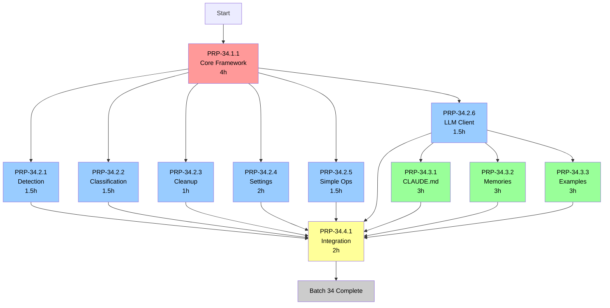

# Batch 34: Blending System - Execution Schedule

**Total PRPs**: 11
**Estimated Total**: 21.0 hours (2.6 days @ 8h/day)
**With Parallelization**: ~7.0 hours (0.9 days @ 3 parallel workers)
**Time Savings**: ~50% reduction

## Overview

Batch 34 implements the complete blending system for Context Engineering framework initialization. This includes:
- Core blending orchestrator
- Domain detection and classification
- Strategy implementations for each domain (settings, CLAUDE.md, memories, examples, PRPs, commands)
- LLM client integration for NL-based blending
- Integration documentation

## Stage Breakdown

### Stage 1: Foundation (Sequential) - 4h

**Day 1**

```
☐ PRP-34.1.1: Core Blending Framework (4h)
  Priority: CRITICAL - Blocks all other PRPs
  Complexity: High
  Deliverables:
    - BlendOrchestrator class
    - Domain detection logic
    - Config-driven strategy registry
    - Base BlendStrategy interface
```

**Dependencies**: None
**Blocks**: All Stage 2+ PRPs

---

### Stage 2: Detection & Strategies (Parallel) - 9h sequential, ~3h parallel

**Day 2-3**

Parallel execution of 6 PRPs (3 workers = ~3h wall-clock time):

```
☐ PRP-34.2.1: Detection Module Phase A (1.5h)
  Dependencies: PRP-34.1.1
  Complexity: Medium
  Deliverables:
    - Legacy file detection
    - Framework file cataloging
    - Migration vs blend mode detection

☐ PRP-34.2.2: Classification Module (1.5h)
  Dependencies: PRP-34.1.1
  Complexity: Medium
  Deliverables:
    - Domain classification logic
    - File type identification
    - Conflict detection

☐ PRP-34.2.3: Cleanup Module (1h)
  Dependencies: None
  Complexity: Low
  Deliverables:
    - Backup creation
    - Legacy cleanup
    - Restore on failure

☐ PRP-34.2.4: Settings Blending Strategy (2h)
  Dependencies: PRP-34.1.1
  Complexity: Medium
  Deliverables:
    - Rule-based settings merge
    - Allowlist/denylist merge
    - Git hooks preservation

☐ PRP-34.2.5: Simple Operations Blending (1.5h)
  Dependencies: PRP-34.1.1
  Complexity: Low
  Deliverables:
    - PRPs domain (move-all with hash dedupe)
    - Commands domain (overwrite)
    - Examples domain (dedupe-copy)

☐ PRP-34.2.6: LLM Client Integration (1.5h)
  Dependencies: PRP-34.1.1
  Complexity: Medium
  Deliverables:
    - Anthropic Messages API client
    - Prompt templates
    - Token management
    - Error handling
```

**Dependencies**: All depend on PRP-34.1.1
**Blocks**: Stage 3 (PRP-34.2.6 specifically blocks NL strategies)

---

### Stage 3: NL Blending Strategies (Parallel) - 6h sequential, ~3h parallel

**Day 4-5**

Parallel execution of 3 PRPs (3 workers = ~3h wall-clock time):

```
☐ PRP-34.3.1: CLAUDE.md Blending Strategy (3h)
  Dependencies: PRP-34.2.6
  Complexity: High
  Deliverables:
    - Section extraction
    - Sonnet-based NL merge
    - Conflict resolution
    - Validation

☐ PRP-34.3.2: Memories Blending Strategy (3h est.)
  Dependencies: PRP-34.2.6
  Complexity: High
  Deliverables:
    - Memory header parsing
    - Haiku similarity check
    - Sonnet merge for conflicts
    - User approval workflow

☐ PRP-34.3.3: Examples NL-Dedupe Strategy (3h)
  Dependencies: PRP-34.2.6
  Complexity: High
  Deliverables:
    - Haiku similarity detection
    - Dedupe-copy with NL merge
    - Threshold tuning
```

**Dependencies**: All depend on PRP-34.2.6
**Blocks**: Stage 4

---

### Stage 4: Integration (Sequential) - 2h

**Day 6**

```
☐ PRP-34.4.1: Integration & Documentation (2h)
  Dependencies: All 10 prior PRPs
  Complexity: Medium
  Conflict Potential: LOW
  Deliverables:
    - End-to-end integration tests
    - Usage documentation
    - Troubleshooting guide
    - API reference
```

**Dependencies**: All Stage 1-3 PRPs
**Blocks**: Batch 37, PRP-42

---

## Execution Timeline

```
┌─ STAGE 1: Foundation (Sequential)
│  └─ Day 1 (4h)
│     └─ PRP-34.1.1: Core Blending Framework
│        • Create BlendOrchestrator, domain detection, config
│        • BLOCKS: All other PRPs
│
├─ STAGE 2: Detection & Strategies (Parallel - 6 PRPs)
│  └─ Day 2-3 (~3h parallel)
│     ├─ PRP-34.2.1: Detection Module Phase A (1.5h)
│     ├─ PRP-34.2.2: Classification Module (1.5h)
│     ├─ PRP-34.2.3: Cleanup Module (1h)
│     ├─ PRP-34.2.4: Settings Strategy (2h)
│     ├─ PRP-34.2.5: Simple Operations (1.5h)
│     └─ PRP-34.2.6: LLM Client Integration (1.5h)
│        • BLOCKS: Stage 3
│
├─ STAGE 3: NL Blending Strategies (Parallel - 3 PRPs)
│  └─ Day 4-5 (~3h parallel)
│     ├─ PRP-34.3.1: CLAUDE.md Strategy (3h)
│     ├─ PRP-34.3.2: Memories Strategy (3h)
│     └─ PRP-34.3.3: Examples Strategy (3h)
│        • BLOCKS: Stage 4
│
└─ STAGE 4: Integration (Sequential)
   └─ Day 6 (2h)
      └─ PRP-34.4.1: Integration Documentation
         • Final validation, E2E tests, docs
```

**Total Time**:
- **Sequential**: 21 hours (2.6 days @ 8h/day)
- **Parallel** (3 workers): ~10 hours (1.3 days @ 8h/day)
- **Savings**: ~50% reduction

---

## Quick Start

### Option 1: Batch Execution (Recommended)

```bash
# Execute entire batch with parallel stages
/batch-exe-prp --batch 34
```

### Option 2: Stage-by-Stage Execution

```bash
# Stage 1: Foundation
/batch-exe-prp --batch 34 --stage 1

# Stage 2: Parallel (auto-parallelizes)
/batch-exe-prp --batch 34 --stage 2

# Stage 3: Parallel (auto-parallelizes)
/batch-exe-prp --batch 34 --stage 3

# Stage 4: Integration
/batch-exe-prp --batch 34 --stage 4
```

### Option 3: Manual Sequential Execution

```bash
# Day 1
/execute-prp PRPs/feature-requests/prod/PRP-34.1.1-core-blending-framework.md

# Day 2-3 (run in parallel or sequential)
/execute-prp PRPs/feature-requests/prod/PRP-34.2.1-detection-module-phase-a.md
/execute-prp PRPs/feature-requests/prod/PRP-34.2.2-classification-module.md
/execute-prp PRPs/feature-requests/prod/PRP-34.2.3-cleanup-module.md
/execute-prp PRPs/feature-requests/prod/PRP-34.2.4-settings-blending-strategy.md
/execute-prp PRPs/feature-requests/prod/PRP-34.2.5-simple-operations-blending.md
/execute-prp PRPs/feature-requests/prod/PRP-34.2.6-llm-client-integration.md

# Day 4-5 (run in parallel or sequential)
/execute-prp PRPs/feature-requests/prod/PRP-34.3.1-claude-md-blending-strategy.md
/execute-prp PRPs/feature-requests/prod/PRP-34.3.2-memories-blending-strategy.md
/execute-prp PRPs/feature-requests/prod/PRP-34.3.3-examples-nl-dedupe-strategy.md

# Day 6
/execute-prp PRPs/feature-requests/prod/PRP-34.4.1-integration-documentation.md
```

---

## Dependency Graph



**Legend**:
- 🔴 Red: Stage 1 (Foundation - blocks all)
- 🔵 Blue: Stage 2 (Parallel detection & strategies)
- 🟢 Green: Stage 3 (Parallel NL strategies)
- 🟡 Yellow: Stage 4 (Integration)

---

## Critical Path

```
PRP-34.1.1 (4h) → PRP-34.2.6 (1.5h) → PRP-34.3.1/2/3 (3h) → PRP-34.4.1 (2h)
Total: 10.5 hours critical path
```

**Bottlenecks**:
1. PRP-34.1.1 blocks all other work (must complete first)
2. PRP-34.2.6 blocks Stage 3 NL strategies (can't parallelize across stages)

**Optimization**:
- Maximize parallelization within Stage 2 (6 PRPs)
- Maximize parallelization within Stage 3 (3 PRPs)
- Consider executing PRP-34.2.3 independently (no deps on 34.1.1)

---

## Risk Assessment

### High-Risk PRPs

1. **PRP-34.1.1** (Core Framework)
   - **Risk**: Architecture decisions affect all downstream work
   - **Mitigation**: Thorough design review, prototype testing

2. **PRP-34.3.2** (Memories Strategy)
   - **Risk**: Complex NL merge logic, user approval workflow
   - **Mitigation**: Extensive testing, fallback to manual merge

### Medium-Risk PRPs

- PRP-34.2.6 (LLM Client): API rate limits, token management
- PRP-34.3.1 (CLAUDE.md): Section extraction edge cases
- PRP-34.3.3 (Examples): Similarity threshold tuning

### Low-Risk PRPs

- PRP-34.2.3 (Cleanup): Simple file operations
- PRP-34.2.5 (Simple Ops): Well-defined copy/move operations

---

## Success Criteria

**Stage 1 Complete**:
- [ ] BlendOrchestrator accepts config
- [ ] Domain detection works for all 6 domains
- [ ] Strategy registry functional

**Stage 2 Complete**:
- [ ] Legacy files detected across all domains
- [ ] Settings merge preserves git hooks
- [ ] LLM client integrates with Anthropic API

**Stage 3 Complete**:
- [ ] CLAUDE.md sections merge without data loss
- [ ] Memories dedupe with <90% similarity
- [ ] Examples dedupe with configurable threshold

**Stage 4 Complete**:
- [ ] E2E test passes on fresh project
- [ ] Documentation covers all strategies
- [ ] Troubleshooting guide addresses common errors

**Batch 34 Complete**:
- [ ] All 11 PRPs executed and merged
- [ ] No regressions in existing functionality
- [ ] Ready for Batch 37 fixes

---

**Generated**: 2025-11-15
**Branch**: prp-42-init-project-workflow-overhaul
