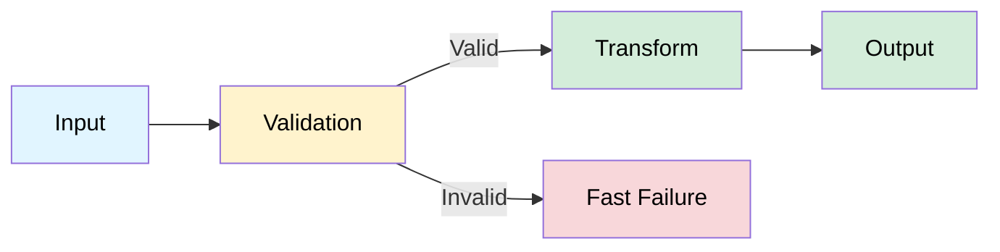
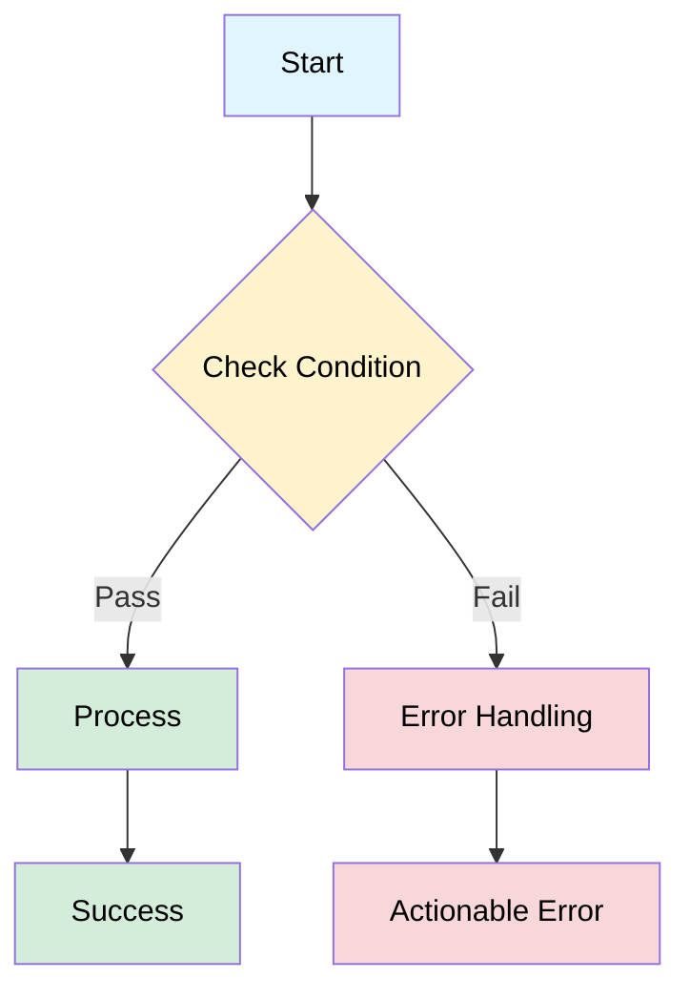

# PRP Template (Unified: KISS + Self-Healing)

**Choose Your Complexity Level:**

- **KISS Mode** (< 2h effort): Simple features, minimal sections needed
- **Standard Mode** (2-8h effort): Most features, balanced detail
- **Self-Healing Mode** (> 8h effort): Complex features, full validation gates

**Usage**: Copy this template, delete unused sections, remove inline comments.

**Section Guide**:

- **Required All Modes**: TL;DR, Context, Implementation, Success Criteria, References
- **Optional KISS**: Logic Flow (unless >5 steps), Validation Gates, Risk Assessment (unless HIGH risk)
- **Recommended Standard**: All sections except Context Synchronization
- **Required Self-Healing**: All sections including Validation Gates, Confidence Tracking

---
<!-- YAML Header: Keep compact (12-20 lines) -->
name: "Feature Title (Clear, Action-Oriented)"
description: "1-sentence description of what this PRP implements"
prp_id: "PRP-X.Y"
task_id: ""  # Optional: Linear/Jira/GitHub issue (e.g., "ENG-123", "#456")
status: "ready"  # ready|in_progress|executed|validated|archived
priority: "MEDIUM"  # HIGH|MEDIUM|LOW
confidence: "8/10"  # 1-10 scale for one-pass success probability
effort_hours: 4.0  # Realistic estimate with phase breakdown
risk: "LOW"  # LOW|MEDIUM|HIGH
dependencies: []  # ["PRP-X.0"] if depends on other PRPs
parent_prp: null  # PRP-X.0 if part of series
context_memories: []  # Optional: ["memory_name"] Serena memories (if using Serena MCP)
meeting_evidence:  # Optional: for requirements validation

- source: "docs/meetings/file.md"
    lines: "100-110"
    timestamp: "15:07-15:22"  # Optional
    quote: "Direct quote validating requirement"
context_sync:  # Optional: if using Context Engineering framework
  ce_updated: false
  serena_updated: false
version: 1
created_date: "2025-MM-DDTHH:MM:SSZ"
last_updated: "2025-MM-DDTHH:MM:SSZ"

---

# PRP-X.Y: Feature Title

## 🎯 TL;DR

**Problem**: [1 sentence - what's broken/missing/needed]

**Solution**: [1 sentence - what we're building/fixing]

**Impact**: [1 sentence - business value + user benefit]

**Risk**: LOW - [1 sentence - why this is safe to execute]

**Effort**: 4.0h (Phase 1: 2h, Phase 2: 1h, Validation: 1h)

**Non-Goals** (KISS: skip, Standard/Self-Healing: include):

- ❌ [What this PRP explicitly does NOT cover to prevent scope creep]

---

<!-- ========== KISS MODE: Use sections below, skip validation gates ========== -->
<!-- ========== STANDARD MODE: Use all sections except Serena-specific ========== -->
<!-- ========== SELF-HEALING MODE: Use ALL sections including validation gates ========== -->

## 📋 Pre-Execution Context Rebuild

**Complete before implementation:**

- [ ] **Review documentation**: `docs/relevant-doc.md`, `README.md`
- [ ] **Load context** (Self-Healing Mode): Memories, parent PRP, checkpoints
- [ ] **Verify codebase state**:
  - File exists: `src/target_file.py`
  - Function exists: `src/target_file.py:100` (`function_name()`)
  - Tests exist: `tests/test_target_file.py`
- [ ] **Git baseline**: Clean working tree or known state

---

## 📖 Context

<!-- KISS: 2-3 bullets. Standard/Self-Healing: Full context -->

**Related Work**:

- **Parent PRP** (if series): PRP-X.0 (executed) - [1-sentence summary]
- **Documentation**: `docs/architecture.md` - [What it contains]
- **Meeting Evidence** (if applicable): `docs/meetings/file.md:100-110`

**Current State**: [2-3 bullets describing what exists now]

- Existing component A does X
- Missing capability Y needed for Z
- Technical constraint C to consider

**Desired State**: [2-3 bullets describing target]

- Component A enhanced to support Y
- New capability Y integrated at point Z
- Performance maintained within acceptable limits

**Why Now**: [1 sentence explaining priority/urgency]

---

<!-- Skip Mermaid diagrams for KISS mode unless logic is complex -->
## 🔍 Logic Flow

<!-- KISS: Skip unless >5 logic steps. Standard/Self-Healing: Include -->
<!-- IMPORTANT: Always specify text colors in style statements -->
<!-- Color Palette: Blue=#e1f5ff (start/end), Yellow=#fff3cd (decision), Green=#d4edda (success), Red=#f8d7da (error/failure) -->

### Data Flow



<!-- For complex decision logic (Standard/Self-Healing) -->
### Decision Logic (if applicable)



---

## 🛠️ Implementation

<!-- KISS: 3-5 steps, minimal detail -->
<!-- Standard: Full phases with tasks -->
<!-- Self-Healing: Full phases + checkpoints -->

### Phase 1: Core Logic (2.0h)

**Task 1.1**: Update main function (1.0h)

- [ ] **File**: `src/target_file.py:100-150`
- [ ] **Action**: Replace old logic with new pattern

  ```python
  # OLD (remove lines 100-120)
  def old_approach(param):
      return default_value

  # NEW (replace with)
  def new_approach(param):
      if not param:
          raise ValidationError("Param required 🔧 Check input format")
      return computed_value
  ```

- [ ] **Validation**: `python -c "from src.target_file import new_approach; assert new_approach('test') == 'expected'"`

**Task 1.2**: Add comprehensive tests (1.0h)

- [ ] **File**: `tests/test_target_file.py`
- [ ] **Test Cases**:
  - [ ] Happy path: `test_new_approach_valid_input()`
  - [ ] Edge case: `test_new_approach_empty_input()`
  - [ ] Error case: `test_new_approach_invalid_input_raises()`
- [ ] **Coverage**: `pytest tests/test_target_file.py --cov=src.target_file --cov-report=term-missing`
- [ ] **Target**: ≥80% coverage for modified code

**Checkpoint (Self-Healing)**: After Phase 1, validate unit tests pass

---

### Phase 2: Integration (1.0h)

**Task 2.1**: Wire into main workflow (0.5h)

- [ ] **File**: `src/main_workflow.py:50`
- [ ] **Import**: `from src.target_file import new_approach`
- [ ] **Call**: Replace `old_approach(data)` with `new_approach(data)`
- [ ] **Validation**: `python -c "from src.main_workflow import workflow; workflow()"`

**Task 2.2**: Update configuration (if needed) (0.5h)

- [ ] **File**: `config/settings.py:30` or `config.yaml:30`
- [ ] **Add**: New configuration parameter

  ```python
  # Python config
  ENABLE_NEW_FEATURE = True
  FEATURE_PARAM_X = "value"
  ```

- [ ] **Validation**: Verify config loads correctly

**Checkpoint (Self-Healing)**: After Phase 2, validate integration works

---

### Phase 3: Validation & Testing (1.0h)

**Task 3.1**: Unit tests (0.3h)

- [ ] Run: `pytest tests/test_target_file.py -v`
- [ ] Expected: All tests pass, coverage ≥80%

**Task 3.2**: Integration tests (0.4h)

- [ ] Run: Main command or E2E test
- [ ] Verify: Expected output generated, no errors

**Task 3.3**: Regression check (0.3h)

- [ ] Run: `pytest tests/ --tb=short`
- [ ] Expected: No test regressions
- [ ] Run: Linter/type checker (if applicable)

**Final Checkpoint (Self-Healing)**: All validation passed, ready for review

---

## ✅ Success Criteria

<!-- KISS: 3-5 checkboxes. Standard/Self-Healing: Full criteria -->

### Code Quality

- [ ] No syntax errors (code runs without failures)
- [ ] Linting passes (or N/A if no linter)
- [ ] Functions <50 lines, files <500 lines (KISS principle)

### Test Coverage

- [ ] All new tests passing
- [ ] Coverage ≥80% for modified code
- [ ] No test regressions
- [ ] Edge cases covered

### Integration Validation

- [ ] E2E workflow completes successfully
- [ ] Output format matches specification
- [ ] No errors in execution logs

### Documentation

- [ ] Function docstrings updated
- [ ] Error messages actionable (🔧 troubleshooting included)
- [ ] README updated (if user-facing changes)

---

<!-- Self-Healing Mode: Include detailed validation gates -->
## 📊 Validation Gates (Self-Healing Mode)

### Gate 1: Syntax & Style (< 10 seconds)

**Criteria**: Code compiles, linting passes
**Validation**:

```bash
# Python projects
pytest tests/ --collect-only && ruff check src/

# TypeScript/JavaScript projects
npm run type-check && npm run lint

# Adapt to your project's tooling
```

**On Failure**:

1. Fix syntax/import errors
2. Auto-fix linting with `ruff check --fix` or `npm run lint:fix`
3. Re-run validation

### Gate 2: Unit Tests (30-60 seconds)

**Criteria**: All unit tests pass, coverage ≥80%
**Validation**:

```bash
pytest tests/ -v --cov=src --cov-report=term-missing
```

**On Failure**:

1. Analyze test failure message
2. Use Sequential Thinking MCP to identify root cause
3. Fix implementation (not tests, unless test is wrong)
4. Re-run tests
5. Repeat until pass

### Gate 3: Integration (1-2 minutes)

**Criteria**: E2E workflow produces expected output
**Validation**:

```bash
# Run main command or integration test suite
# Verify output files/API responses
```

**On Failure**:

1. Check logs for error details
2. Verify configuration and dependencies
3. Debug with Serena `execute_shell_command` (if using Serena)
4. Fix issues systematically
5. Re-validate until pass

---

## ⚠️ Risk Assessment

<!-- KISS: 1-2 risks. Standard: 2-3 risks. Self-Healing: Comprehensive risk analysis -->

### Technical Risks

**Risk 1**: [Implementation complexity / Breaking changes / Data migration]

- **Likelihood**: LOW|MEDIUM|HIGH
- **Impact**: LOW|MEDIUM|HIGH
- **Mitigation**: [Specific mitigation strategy]
- **Rollback**: [How to undo if needed]

**Risk 2** (Standard/Self-Healing): [Performance / Dependency / Integration]

- **Likelihood**: LOW|MEDIUM|HIGH
- **Impact**: LOW|MEDIUM|HIGH
- **Mitigation**: [Specific mitigation strategy]
- **Rollback**: [How to undo if needed]

### Dependency Risks (Self-Healing)

- **External APIs**: [Availability, rate limits, breaking changes]
- **Database**: [Schema changes, migration risks, data integrity]
- **Third-party Libraries**: [Version compatibility, security vulnerabilities]

---

## 📚 References

### Documentation

- **Architecture**: `docs/architecture.md` - [What it describes]
- **Contributing**: `CONTRIBUTING.md` or `CLAUDE.md` - [Guidelines]

### Code References

- **Current Implementation**: `src/target_file.py:100-150` (to be modified)
- **Test Coverage**: `tests/test_target_file.py` (existing tests)
- **Integration Point**: `src/main_workflow.py:50` (call site)

### Meeting Evidence (if applicable)

- **Source**: `docs/meetings/file.md:100-110`
- **Timestamp**: 15:07-15:22
- **Quote**: "Direct quote validating requirement"
- **Stakeholder**: Name (role) confirmed

### Related PRPs

- **Parent**: PRP-X.0 (executed) - Foundation work
- **Similar Pattern**: PRP-Y.Z (executed) - Reference implementation

### External Libraries (if applicable)

- **Library Name v1.2.3**
  - Docs: <https://docs.library.com/feature>
  - Focus: [Specific feature used]
  - Context7: Use Context7 MCP for API reference

---

<!-- Self-Healing Mode: Context synchronization -->
## 🔄 Context Synchronization (Self-Healing Mode)

**Memory Update Required**: NO (YES if introducing reusable pattern)

**During Implementation**:

- **Every 5 file changes**: Sync context with `sync_context()` (if using CE)
- **After each phase**: Create checkpoint with summary
- **On errors**: Document troubleshooting in memories

**On Completion**:

1. Final validation: `pytest tests/ -v`
2. Create checkpoint: `write_memory("checkpoint-PRP-X.Y", "Summary...")`
3. Update memories with learnings
4. Git commit with descriptive message
5. Update PRP status to "executed"

---

## 📝 Post-Execution Notes

**Status**: [executed|validated]
**Execution Date**: YYYY-MM-DD
**Actual Effort**: X.Xh (vs estimated Y.Yh)

**Issues Discovered**: [Count]
**Issues Resolved**: [Count]

**Lessons Learned**:

- [Insight 1 helpful for future PRPs]
- [Insight 2 about complexity or simplification]

**Deviations from Plan**:

- [Any changes from original approach and why]

**Follow-up PRPs**:

- PRP-X.Y+1: [Next enhancement identified]

---

## 📈 Confidence Tracking (Self-Healing Mode)

**Initial**: 8/10 (untested design)
**After Phase 1**: [X/10] - [Reason]
**After Phase 2**: [X/10] - [Reason]
**Final**: [X/10] - [Reason]

**Production-Ready Threshold**: 9/10 minimum

---

## 🎓 Gotchas & Known Issues

<!-- KISS: Skip if none. Standard/Self-Healing: Document warnings -->

### Technical Gotchas

- ⚠️ [Warning 1 with explanation]
- ⚠️ [Warning 2 with explanation]

### Known Issues

- 🐛 [Known issue 1 and workaround]

---

**Template Version**: 3.0 (Unified: KISS + Self-Healing)
**Based on**: Certinia proven template + ctx-eng-plus standards
**Last Updated**: 2025-01-15
**Optimized For**: Zero-shot execution, adaptive complexity, visual clarity
