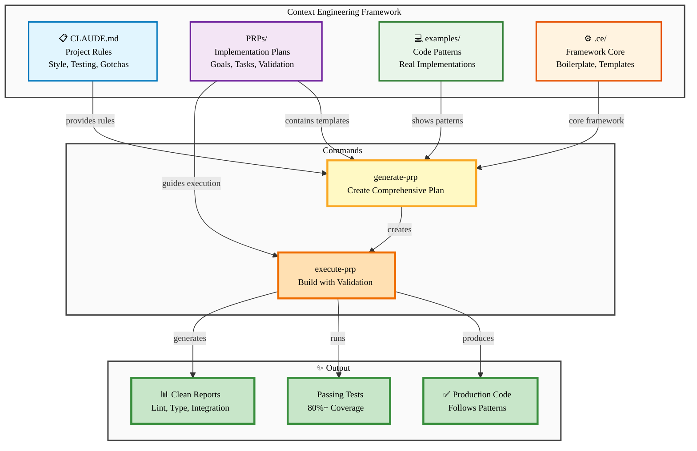

# Context Engineering Components Architecture

**Copy the code below into https://mermaid.live/ and export as SVG or PNG (2400×1200)**

---

---

## Export Instructions

1. **Copy the mermaid code above** (between the \`\`\`mermaid markers)
2. **Paste into https://mermaid.live/**
3. **Export Settings:**
   - **SVG** (recommended): Actions → Export SVG → Save as `components.svg`
   - **PNG** (2x): Actions → Export PNG → Width: 2400px → Save as `components.png`
4. **Save to:** `ce-demo/assets/components.png`

## Diagram Details

- **Orientation:** TB (top-to-bottom, vertical flow with subgraphs)
- **Optimal size:** 2400×1200 PNG (display at 1200×600)
- **Slide placement:** 80% width, centered
- **Theme:** Light pastel colors, grouped by function
- **Subgraphs:** 3 (Framework, Commands, Output)
- **Nodes:** 9 total across 3 layers

## Usage in Slides

**Slide 9: Key Components Deep Dive** (alternative to 3-column card layout)
- Insert as full-width image
- Shows how components connect
- Framework (inputs) → Commands (process) → Output (results)

**Alternative:** Use for backup slide or appendix showing system architecture

---

## Color Coding

- **Blue (CLAUDE.md):** Rules and conventions
- **Purple (PRPs/):** Implementation blueprints
- **Green (examples/):** Code patterns
- **Orange (.ce/):** Framework infrastructure
- **Yellow (Commands):** Execution layer
- **Light green (Output):** Final deliverables

---

**Recommended export:** SVG → PNG at 2400×1200, then display at 1200×600. The vertical layout with subgraphs needs height, but fits well in landscape slide.
