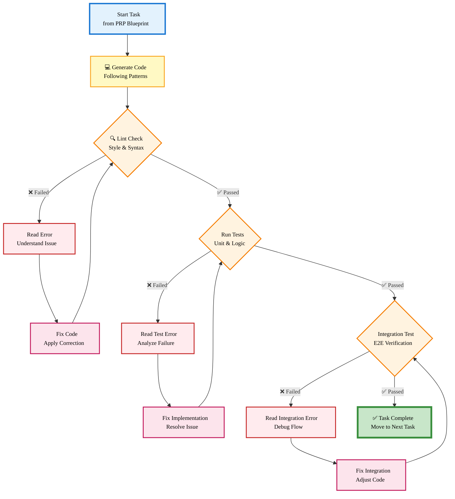

# Validation Loop - Self-Correcting Execution

**Copy the code below into https://mermaid.live/ and export as SVG or PNG (1800×1200)**

---



---

## Export Instructions

1. **Copy the mermaid code above** (between the \`\`\`mermaid markers)
2. **Paste into https://mermaid.live/**
3. **Export Settings:**
   - **SVG** (recommended): Actions → Export SVG → Save as `validation-loop.svg`
   - **PNG** (2x): Actions → Export PNG → Width: 1800px → Save as `validation-loop.png`
4. **Save to:** `ce-demo/assets/validation-loop.png`

## Diagram Details

- **Orientation:** TD (top-down, vertical flow for loop visualization)
- **Optimal size:** 1800×1200 PNG (display at 900×600)
- **Slide placement:** 60% width, centered vertically
- **Theme:** Light colors, red for errors, green for success
- **Nodes:** 12 total showing complete validation cycle
- **Loop structure:** 3 validation levels with self-correction

## Usage in Slides

**Optional Slide or Demo Animation:**
- Shows how AI self-corrects during execution
- Three feedback loops (Lint, Test, Integration)
- Read error → Fix → Retry pattern repeated at each level

**Best for:**
- Deep dive presentations (30+ min)
- Technical audience wanting implementation details
- Backup slide if asked "How does validation work?"

---

## Color Coding

- **Blue (Start):** Beginning of task
- **Yellow (Generate):** Code generation
- **Orange (Checks):** Decision points (lint, test, integration)
- **Red (Errors):** Error reading/analysis
- **Pink (Fixes):** Code correction
- **Green (Complete):** Successful completion

---

## Visual Flow

```
Start Task
    ↓
Generate Code
    ↓
┌─→ Lint Check ──✓──→ Unit Tests ──✓──→ Integration ──✓──→ Complete
│       ↓ ✗                ↓ ✗              ↓ ✗
│   Read Error         Read Error       Read Error
│       ↓                  ↓                ↓
│   Fix Code           Fix Code         Fix Code
└───────┘              └──────┘          └──────┘
```

---

**Recommended export:** SVG → PNG at 1800×1200, then display at 900×600. Taller aspect ratio works well for vertical loop structure, centered on slide.
