```mermaid
%%{init: {'theme':'default', 'themeVariables': { 'fontSize':'13px', 'fontFamily':'Arial, sans-serif'}}}%%

graph TD
    A["📝 Start Task<br/>from PRP Blueprint"] --> B["💻 Generate Code<br/>Following Patterns"]

    B --> C{"🔍 Lint Check<br/>Style & Syntax"}
    C -->|"❌ Failed"| D["📖 Read Error<br/>Understand Issue"]
    D --> E["🔧 Fix Code<br/>Apply Correction"]
    E --> C

    C -->|"✅ Passed"| F{"🧪 Run Tests<br/>Unit & Logic"}
    F -->|"❌ Failed"| G["📖 Read Test Error<br/>Analyze Failure"]
    G --> H["🔧 Fix Implementation<br/>Resolve Issue"]
    H --> F

    F -->|"✅ Passed"| I{"🔗 Integration Test<br/>E2E Verification"}
    I -->|"❌ Failed"| J["📖 Read Integration Error<br/>Debug Flow"]
    J --> K["🔧 Fix Integration<br/>Adjust Code"]
    K --> I

    I -->|"✅ Passed"| L["✅ Task Complete<br/>Move to Next Task"]

    style A fill:#e3f2fd,stroke:#1976d2,stroke-width:3px,color:#000
    style B fill:#fff9c4,stroke:#f9a825,stroke-width:2px,color:#000

    style C fill:#fff3e0,stroke:#f57c00,stroke-width:2px,color:#000
    style F fill:#fff3e0,stroke:#f57c00,stroke-width:2px,color:#000
    style I fill:#fff3e0,stroke:#f57c00,stroke-width:2px,color:#000

    style D fill:#ffebee,stroke:#c62828,stroke-width:2px,color:#000
    style G fill:#ffebee,stroke:#c62828,stroke-width:2px,color:#000
    style J fill:#ffebee,stroke:#c62828,stroke-width:2px,color:#000

    style E fill:#fce4ec,stroke:#c2185b,stroke-width:2px,color:#000
    style H fill:#fce4ec,stroke:#c2185b,stroke-width:2px,color:#000
    style K fill:#fce4ec,stroke:#c2185b,stroke-width:2px,color:#000

    style L fill:#c8e6c9,stroke:#388e3c,stroke-width:4px,color:#000
```

# Validation Loop - Self-Correcting Execution

**Copy the code below into https://mermaid.live/ and export as SVG or PNG (1800×1200)**

---



---

## Export Instructions

1. **Copy the mermaid code above** (between the \`\`\`mermaid markers)
2. **Paste into https://mermaid.live/**
3. **Export Settings:**
   - **SVG** (recommended): Actions → Export SVG → Save as `validation-loop.svg`
   - **PNG** (2x): Actions → Export PNG → Width: 1800px → Save as `validation-loop.png`
4. **Save to:** `ce-demo/assets/validation-loop.png`

## Diagram Details

- **Orientation:** TD (top-down, vertical flow for loop visualization)
- **Optimal size:** 1800×1200 PNG (display at 900×600)
- **Slide placement:** 60% width, centered vertically
- **Theme:** Light colors, red for errors, green for success
- **Nodes:** 12 total showing complete validation cycle
- **Loop structure:** 3 validation levels with self-correction

## Usage in Slides

**Optional Slide or Demo Animation:**
- Shows how AI self-corrects during execution
- Three feedback loops (Lint, Test, Integration)
- Read error → Fix → Retry pattern repeated at each level

**Best for:**
- Deep dive presentations (30+ min)
- Technical audience wanting implementation details
- Backup slide if asked "How does validation work?"

---

## Color Coding

- **Blue (Start):** Beginning of task
- **Yellow (Generate):** Code generation
- **Orange (Checks):** Decision points (lint, test, integration)
- **Red (Errors):** Error reading/analysis
- **Pink (Fixes):** Code correction
- **Green (Complete):** Successful completion

---

## Visual Flow

```
Start Task
    ↓
Generate Code
    ↓
┌─→ Lint Check ──✓──→ Unit Tests ──✓──→ Integration ──✓──→ Complete
│       ↓ ✗                ↓ ✗              ↓ ✗
│   Read Error         Read Error       Read Error
│       ↓                  ↓                ↓
│   Fix Code           Fix Code         Fix Code
└───────┘              └──────┘          └──────┘
```

---

**Recommended export:** SVG → PNG at 1800×1200, then display at 900×600. Taller aspect ratio works well for vertical loop structure, centered on slide.
