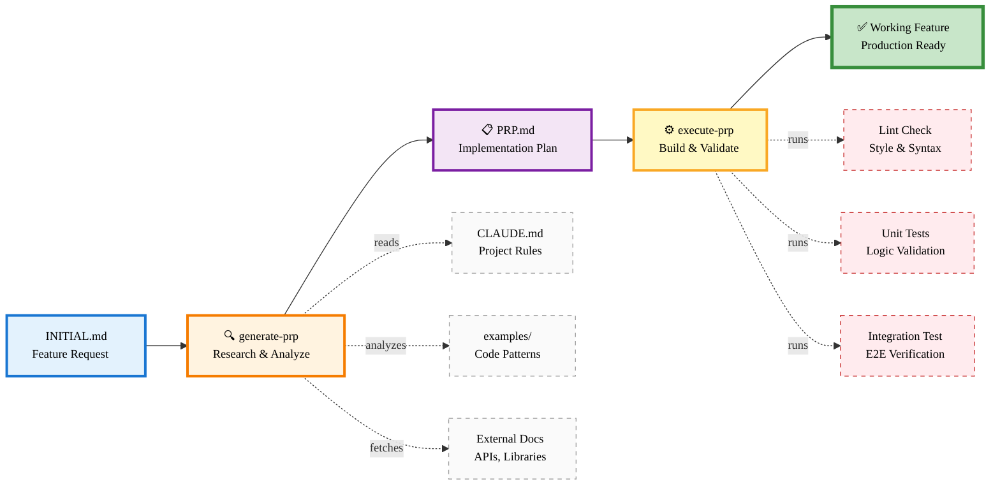

# Context Engineering Workflow

**Copy the code below into https://mermaid.live/ and export as SVG or PNG (2400×1200)**

---

---

## Export Instructions

1. **Copy the mermaid code above** (between the \`\`\`mermaid markers)
2. **Paste into https://mermaid.live/**
3. **Export Settings:**
   - **SVG** (recommended): Actions → Export SVG → Save as `workflow.svg`
   - **PNG** (2x): Actions → Export PNG → Width: 2400px → Save as `workflow.png`
4. **Save to:** `ce-demo/assets/workflow.png`

## Diagram Details

- **Orientation:** LR (left-to-right, horizontal flow)
- **Optimal size:** 2400×1200 PNG (display at 1200×600)
- **Slide placement:** 80% width, centered
- **Theme:** Light colors, high contrast text
- **Nodes:** 11 total (5 main flow, 6 auxiliary)

## Usage in Slides

**Slide 4: Framework Overview**
- Insert as full-width image (80% slide)
- Add caption below: "Complete Context Engineering Workflow"
- Main flow (A→E) should be obvious left-to-right read

---

**Recommended export:** SVG → PNG at 2400×1200, then display at 1200×600 for crisp rendering on all displays.
