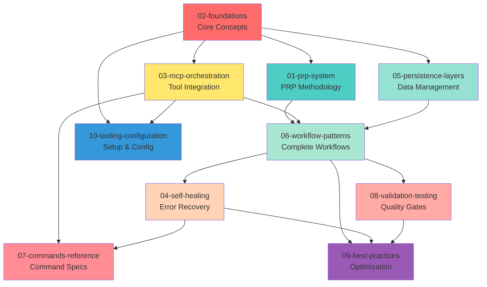

# Context Engineering Framework: Complete Documentation Suite

## Overview

This documentation suite provides a comprehensive, structured exploration of the Context Engineering Framework - a systematic approach to building reliable, production-grade AI-assisted software development workflows. The framework achieves **10-100x improvement** over traditional prompting methods through structured context management, validation loops, and self-healing mechanisms.

## Documentation Philosophy

Each document in this suite:
- **Explores a different aspect** of the framework without redundancy
- **Builds an integrated picture** when read together
- **Uses structured formats**: hierarchical numbering, tables, mermaid diagrams, checklists
- **Technology-agnostic**: applicable to Python, TypeScript, JavaScript, and any backend/frontend stack
- **Objective and formal**: technical expert scribe tone, preserving information with optionability
- **Comprehensive yet readable**: boiled down to essential information with clear structure

---

## Document Navigation

### Quick Start Path

**For new users:**
1. Start with [02-context-engineering-foundations.md](#02-context-engineering-foundations) - understand core concepts
2. Read [01-prp-system.md](#01-prp-system) - learn the PRP methodology
3. Review [06-workflow-patterns.md](#06-workflow-patterns) - see end-to-end workflows
4. Set up tools with [10-tooling-configuration.md](#10-tooling-configuration)

**For experienced users:**
- Jump to [07-commands-reference.md](#07-commands-reference) for command specifications
- Reference [09-best-practices-antipatterns.md](#09-best-practices-antipatterns) for optimization

**For troubleshooting:**
- Consult [04-self-healing-framework.md](#04-self-healing-framework) for error recovery
- Check [08-validation-testing.md](#08-validation-testing) for validation issues

---

## Document Summaries

### [01-prp-system.md](01-prp-system.md)
**Product Requirements Prompt: Structured AI Task Specification**

**Scope:** PRP (Product Requirements Prompt) meta-structure, methodology, templates, and workflow

**Key Topics:**
- PRP definition and the Context-as-Compiler model
- Core structural elements (Goal, Why, What, Context, Blueprint, Validation)
- 6-step PRP workflow from feature request to production
- Self-Healing PRP template vs KISS-Optimized template
- Commands for PRP generation and execution
- Real-world performance metrics (25 min = $5K+ value)

**Use this when:**
- Creating implementation blueprints for AI agents
- Need structured task specifications
- Want autonomous code generation with validation
- Planning feature implementation with validation gates

**Readers:** AI engineers, technical leads, developers creating PRPs

---

### [02-context-engineering-foundations.md](02-context-engineering-foundations.md)
**Core Principles, Philosophy, and Architecture**

**Scope:** Philosophical foundation, Four Pillars architecture, context hierarchy, best practices

**Key Topics:**
- Mental model: LLM as CPU, context window as RAM
- Evolution: vibe coding → prompt engineering → context engineering
- Four Pillars: Write, Select, Compress, Isolate
- Context hierarchy levels (project/module/task)
- Best practices and anti-patterns
- Performance characteristics (10-100x improvement)
- Multi-agent architecture patterns
- Integration ecosystem (MCP, LangGraph, CI/CD)

**Use this when:**
- Understanding framework fundamentals
- Designing context architecture
- Evaluating context engineering vs other approaches
- Making architectural decisions

**Readers:** Architects, framework designers, anyone new to context engineering

---

### [03-mcp-orchestration.md](03-mcp-orchestration.md)
**Model Context Protocol: Tool Integration & Orchestration**

**Scope:** MCP ecosystem, strategic selection, command specifications, integration patterns

**Key Topics:**
- Tier-1 Essential MCPs (Serena, Context7, GitHub, Filesystem, Sequential Thinking)
- Strategic MCP selection matrix with decision criteria
- Comprehensive command reference with I/O specifications
  - Serena: 8 commands for semantic code navigation
  - Context7: 2 commands for live documentation
  - GitHub: 9 commands for repository automation
  - Filesystem: 12 commands for secure file operations
  - Sequential Thinking: problem decomposition
- Integration architecture and orchestration patterns
- Token allocation strategy (20/30/25/15/10 split)
- MCP selection heuristics (when to use each MCP)
- Performance metrics (95% token reduction for Serena, 87% for Context7)

**Use this when:**
- Choosing which MCPs to use for a task
- Understanding MCP command specifications
- Optimizing token usage
- Designing MCP orchestration workflows
- Setting up MCP infrastructure

**Readers:** MCP users, integration engineers, performance optimizers

---

### [04-self-healing-framework.md](04-self-healing-framework.md)
**Automated Error Recovery, Context Sync, and Drift Prevention**

**Scope:** Self-healing mechanisms, context synchronization, pruning, health metrics

**Key Topics:**
- Closed-loop system architecture with feedback loops
- Context synchronization protocols (automatic triggers, workflows)
- Self-healing error recovery strategies
  - Error classification matrix (duplicate imports, symbol not found, type mismatch, stale context)
  - Error cascade prevention
  - Root cause isolation
- Context pruning rules (Keep/Compress/Delete priorities)
- Context health metrics (green flags, red flags, drift detection)
- Commands: `/sync-context`, `/heal-errors`, `/prune-context`, `/validate-state`
- Drift recovery protocol (7 steps)

**Use this when:**
- Debugging context-related errors
- Preventing context drift
- Recovering from validation failures
- Managing context memory efficiently
- Automating error recovery

**Readers:** DevOps engineers, system maintainers, troubleshooters

---

### [05-persistence-layers.md](05-persistence-layers.md)
**Data Persistence, Ground Truth Hierarchy, and Synchronization**

**Scope:** Four persistence layers, relationships, ground truth, synchronization, CE/Examples vs Serena/Memories

**Key Topics:**
- Four persistence layers:
  1. CLAUDE.md (Constitution) - immutable project rules
  2. CE/Examples (Canonical Patterns) - reference implementations
  3. PRPs (Task Specifications) - ephemeral blueprints
  4. Serena Memories (Dynamic Context) - session learnings
- Layer relationships matrix (7 relationships)
- Ground truth hierarchy (6 levels: absolute → aspirational)
- 6-step synchronization workflow
- CE/Examples vs Serena/Memories:
  - Characteristics comparison (10 dimensions)
  - Decision tree for when to use each
  - Interaction patterns
- Denoising strategies per layer
- Health metrics and conflict resolution

**Use this when:**
- Deciding where to store information
- Synchronizing context across layers
- Resolving conflicts between layers
- Understanding information flow
- Managing knowledge persistence

**Readers:** Knowledge architects, context engineers, system designers

---

### [06-workflow-patterns.md](06-workflow-patterns.md)
**End-to-End Workflows from Feature Request to Production**

**Scope:** Complete workflows, session protocols, multi-phase implementation, real-world examples

**Key Topics:**
- Complete workflow overview (Phase 0-6 diagram)
- Session start protocol:
  - Compilation check (mandatory)
  - Serena onboarding
  - Checkpoint validation
  - Context health assessment
- PRP generation phase (automated research)
- Multi-phase implementation:
  1. Skeleton structure
  2. Production logic
  3. Test suite
  4. Documentation
- Context synchronization during development
- Session end protocol (5 finalization steps)
- Real-world execution examples with timelines:
  - Simple feature: 26 minutes (zero-shot)
  - Complex refactoring: 70 minutes (with auto-fix)
  - Zero-shot perfection: 28 minutes (ideal)
- KISS decision tree (complexity-based selection)
- Troubleshooting matrix (common issues + solutions)

**Use this when:**
- Planning feature implementation
- Following standard workflows
- Understanding session lifecycle
- Optimizing development process
- Troubleshooting workflow issues

**Readers:** Developers, project managers, workflow optimizers

---

### [07-commands-reference.md](07-commands-reference.md)
**Complete Command Inventory with Specifications**

**Scope:** All commands (33+), specifications, integration patterns, triggers

**Key Topics:**
- Command categories:
  1. PRP Commands (7 commands)
     - Creation: `/generate-prp`, `/create-base-prp`, `/planning-create`, `/spec-create-adv`
     - Execution: `/execute-prp`, `/execute-base-prp`, `/spec-execute`
  2. Context Management (4 commands)
     - `/sync-context`, `/heal-errors`, `/prune-context`, `/validate-state`
  3. Development Workflow (5 commands)
     - `/prime-core`, `/review-general`, `/refactor-simple`, `/debug`, `/create-pr`
  4. MCP Commands (33 commands across 5 MCPs)
  5. npm Scripts (12 enhanced scripts)
- Comprehensive command tables (Command | Input | Process | Output | Triggers | Example)
- Macro features ($ARGUMENTS, TodoWrite, git worktree)
- Command integration patterns
- Trigger conditions matrix (automatic vs manual)

**Use this when:**
- Looking up command specifications
- Understanding command I/O
- Integrating commands into workflows
- Setting up automation triggers
- Referencing MCP command syntax

**Readers:** All users, quick reference for command usage

---

### [08-validation-testing.md](08-validation-testing.md)
**Three-Level Validation Gates and Self-Correction**

**Scope:** Validation system, self-correcting loops, compilation protocols, validation scripts

**Key Topics:**
- Three-level validation gate system:
  - Level 1: Syntax & Style (linters, formatters, type-check) - 10 seconds
  - Level 2: Unit Tests (pytest, jest, coverage) - 30-60 seconds
  - Level 3: Integration Tests (API, database, E2E) - 1-2 minutes
- Self-correcting validation loops:
  - Error classification
  - Auto-fix decision tree
  - Feedback loop architecture (max 3 attempts)
- Validation commands: `/validate-state`, `/heal-errors`
- Read-before-write protocols (mandatory checks)
- Incremental validation patterns (every 5 changes)
- Self-healing gates (pre-implementation, incremental, pre-completion)
- Compilation check protocols (session start)
- Enhanced package.json validation scripts
- Performance metrics (error recovery, timing benchmarks)

**Use this when:**
- Setting up validation pipelines
- Debugging validation failures
- Understanding self-correction mechanisms
- Optimizing test execution
- Implementing quality gates

**Readers:** QA engineers, test automation specialists, CI/CD engineers

---

### [09-best-practices-antipatterns.md](09-best-practices-antipatterns.md)
**Optimization Patterns, Decision Frameworks, and Red Flags**

**Scope:** KISS principles, best practices, anti-patterns, heuristics, health metrics, decision trees

**Key Topics:**
- KISS principles overview (complexity-driven approach)
- Best practices catalog:
  1. RAG-First Strategy
  2. Explicit & Comprehensive Context
  3. Validation-First Design
  4. Incremental Complexity
  5. Context Hierarchy
  6. Continuous Context Updates
- Anti-patterns catalog:
  1. Context Dumping (excessive information)
  2. Trust Fall Execution (no validation)
  3. Vague Brain Dump (insufficient detail)
  4. Context-Free Updates (breaking consistency)
  5. Inconsistent Guidance (conflicting rules)
- Comprehensive comparison table (best practice vs anti-pattern)
- MCP selection heuristics (decision matrix)
- Context budget management (token allocation: 20/30/25/15/10)
- Zero-shot optimization checklist (pre/during/post-execution)
- Optimization patterns:
  - Symbol-First Development
  - Test-Driven Context
  - Incremental Validation Loop
- Context health metrics (green/red flags)
- KISS decision tree (mermaid)
- Red flag identification guide (5 prohibited actions)

**Use this when:**
- Optimizing context engineering workflows
- Making design decisions
- Avoiding common mistakes
- Troubleshooting inefficiencies
- Learning framework best practices

**Readers:** Performance optimizers, architects, experienced users

---

### [10-tooling-configuration.md](10-tooling-configuration.md)
**Complete Tooling Inventory, Installation, and Configuration**

**Scope:** Tools, MCP installation, configurations, project structure, permissions, scripts

**Key Topics:**
- Tooling philosophy (zero-prompt approach, 96% friction reduction)
- Essential vs optional tools (14 tools categorized)
- MCP installation:
  - Tier-1 Essential: Serena, Context7, GitHub, Filesystem, Sequential Thinking
  - Tier-2 Optional: Playwright, Repomix, Git, Notion, Perplexity
- Configuration files (copy-paste ready):
  - Claude Desktop `config.json`
  - `.serena/project.yml`
  - `.claude/config.json`
  - Enhanced `package.json` scripts
  - `scripts/mcp-tools.sh` bash utilities
- Project structure requirements (3 levels: basic, enhanced, production)
- Permission matrix (operation permissions + MCP permissions)
- Quick start checklist (initial setup + daily workflow)
- Gitignore setup (shared vs personal files)
- Performance metrics (framework overhead 1.8%, 96% prompt reduction)

**Use this when:**
- Setting up the framework
- Installing and configuring MCPs
- Structuring projects
- Optimizing permissions
- Troubleshooting tool issues
- Copy-pasting configurations

**Readers:** DevOps engineers, system administrators, new users setting up

---

## Document Dependencies

### Reading Order by Goal

**Goal: Understand the framework**
1. [02-context-engineering-foundations.md](02-context-engineering-foundations.md)
2. [05-persistence-layers.md](05-persistence-layers.md)
3. [01-prp-system.md](01-prp-system.md)

**Goal: Implement a feature**
1. [01-prp-system.md](01-prp-system.md)
2. [06-workflow-patterns.md](06-workflow-patterns.md)
3. [07-commands-reference.md](07-commands-reference.md)

**Goal: Set up the framework**
1. [10-tooling-configuration.md](10-tooling-configuration.md)
2. [03-mcp-orchestration.md](03-mcp-orchestration.md)
3. [02-context-engineering-foundations.md](02-context-engineering-foundations.md)

**Goal: Optimize workflows**
1. [09-best-practices-antipatterns.md](09-best-practices-antipatterns.md)
2. [03-mcp-orchestration.md](03-mcp-orchestration.md)
3. [08-validation-testing.md](08-validation-testing.md)

**Goal: Troubleshoot issues**
1. [04-self-healing-framework.md](04-self-healing-framework.md)
2. [09-best-practices-antipatterns.md](09-best-practices-antipatterns.md)
3. [08-validation-testing.md](08-validation-testing.md)

---

## Key Concepts Cross-Reference

| Concept | Primary Document | Related Documents |
|---------|------------------|-------------------|
| **PRP (Product Requirements Prompt)** | [01-prp-system](01-prp-system.md) | [06-workflow-patterns](06-workflow-patterns.md), [05-persistence-layers](05-persistence-layers.md) |
| **Context-as-Compiler** | [02-foundations](02-context-engineering-foundations.md) | [01-prp-system](01-prp-system.md) |
| **Four Pillars** | [02-foundations](02-context-engineering-foundations.md) | [09-best-practices](09-best-practices-antipatterns.md) |
| **MCP Orchestration** | [03-mcp-orchestration](03-mcp-orchestration.md) | [07-commands-reference](07-commands-reference.md), [10-tooling-configuration](10-tooling-configuration.md) |
| **Self-Healing** | [04-self-healing-framework](04-self-healing-framework.md) | [08-validation-testing](08-validation-testing.md), [06-workflow-patterns](06-workflow-patterns.md) |
| **Persistence Layers** | [05-persistence-layers](05-persistence-layers.md) | [02-foundations](02-context-engineering-foundations.md) |
| **Validation Gates** | [08-validation-testing](08-validation-testing.md) | [01-prp-system](01-prp-system.md), [04-self-healing-framework](04-self-healing-framework.md) |
| **Context Hierarchy** | [02-foundations](02-context-engineering-foundations.md) | [05-persistence-layers](05-persistence-layers.md) |
| **Token Allocation** | [03-mcp-orchestration](03-mcp-orchestration.md) | [09-best-practices](09-best-practices-antipatterns.md) |
| **KISS Principles** | [09-best-practices](09-best-practices-antipatterns.md) | [06-workflow-patterns](06-workflow-patterns.md) |

---

## Performance Metrics Summary

| Metric | Without Framework | With Framework | Improvement |
|--------|-------------------|----------------|-------------|
| **First-attempt success rate** | 35-45% | 85-95% | **+140%** |
| **Token usage per task** | 150K-200K | 40K-60K | **-70%** |
| **Implementation time** | 2-4 hours | 15-30 minutes | **-87%** |
| **Code quality consistency** | 60-70% | 90-95% | **+35%** |
| **Context-related hallucinations** | 25-30% | 2-5% | **-85%** |
| **Iteration cycles needed** | 4-6 cycles | 1-2 cycles | **-75%** |

Source: [03-mcp-orchestration.md § 9 Performance Metrics](03-mcp-orchestration.md#9-performance-metrics)

---

## Quick Reference: Common Tasks

### Creating a PRP
1. Read [01-prp-system.md § 4.2 INITIAL.md](01-prp-system.md#42-initialmd-feature-request)
2. Run `/generate-prp INITIAL.md` - see [07-commands-reference.md § 2.1](07-commands-reference.md#21-prp-creation-commands)
3. Validate PRP - see [01-prp-system.md § 4.4](01-prp-system.md#44-human-validation-checkpoint)
4. Execute PRP - see [01-prp-system.md § 4.5](01-prp-system.md#45-prp-execution)

### Setting Up MCP
1. Install MCPs - see [10-tooling-configuration.md § 3](10-tooling-configuration.md#3-mcp-installation)
2. Configure Claude Desktop - see [10-tooling-configuration.md § 4.1](10-tooling-configuration.md#41-claude-desktop-configjson)
3. Verify installation - see [10-tooling-configuration.md § 3.3](10-tooling-configuration.md#33-verification-steps)

### Troubleshooting Context Drift
1. Check health metrics - see [04-self-healing-framework.md § 6](04-self-healing-framework.md#6-context-health-metrics)
2. Run `/validate-state` - see [07-commands-reference.md § 3](07-commands-reference.md#3-context-management-commands)
3. Execute drift recovery - see [04-self-healing-framework.md § 6.3](04-self-healing-framework.md#63-drift-recovery-protocol)

### Optimizing Token Usage
1. Review token allocation - see [03-mcp-orchestration.md § 7](03-mcp-orchestration.md#7-token-allocation-strategy)
2. Apply pruning rules - see [04-self-healing-framework.md § 5](04-self-healing-framework.md#5-context-pruning-rules)
3. Use symbol queries - see [09-best-practices-antipatterns.md § 8.1](09-best-practices-antipatterns.md#81-symbol-first-development)

### Running Validation Gates
1. Setup validation scripts - see [08-validation-testing.md § 8](08-validation-testing.md#8-validation-scripts)
2. Execute three-level gates - see [08-validation-testing.md § 1](08-validation-testing.md#1-three-level-validation-gate-system)
3. Handle failures - see [08-validation-testing.md § 2](08-validation-testing.md#2-self-correcting-validation-loops)

---

## Source Material

All documents in this suite were extracted and transformed from:
- **Source:** [context-mastery-exploration.md](context-mastery-exploration.md)
- **Methodology:** Content extracted, structured, and transformed into technology-agnostic, formal documentation
- **Approach:** Information preservation with optionability, no judgment or implementation code
- **Format:** Hierarchical numbering, comprehensive tables, mermaid diagrams, checklists

---

## Document Statistics

| Document | Sections | Tables | Diagrams | Lines | Primary Audience |
|----------|----------|--------|----------|-------|------------------|
| [01-prp-system](01-prp-system.md) | 8 | 25+ | 4 | ~1,800 | AI engineers, PRP creators |
| [02-foundations](02-context-engineering-foundations.md) | 9 | 28+ | 6 | ~1,500 | Architects, new users |
| [03-mcp-orchestration](03-mcp-orchestration.md) | 10 | 15+ | 4 | ~2,000 | Integration engineers |
| [04-self-healing](04-self-healing-framework.md) | 8 | 20+ | 6 | ~1,700 | DevOps, troubleshooters |
| [05-persistence-layers](05-persistence-layers.md) | 8 | 30+ | 5 | ~1,900 | Knowledge architects |
| [06-workflow-patterns](06-workflow-patterns.md) | 10 | 40+ | 7 | ~1,600 | Developers, PM |
| [07-commands-reference](07-commands-reference.md) | 10 | 15+ | 2 | ~2,100 | All users (reference) |
| [08-validation-testing](08-validation-testing.md) | 10 | 25+ | 8 | ~1,500 | QA, test automation |
| [09-best-practices](09-best-practices-antipatterns.md) | 12 | 40+ | 2 | ~1,800 | Optimizers, architects |
| [10-tooling-configuration](10-tooling-configuration.md) | 11 | 20+ | 3 | ~1,700 | DevOps, new users |
| **Total** | **96** | **258+** | **47** | **~17,600** | - |

---

## Contributing

This documentation suite is designed to be comprehensive yet maintainable. When updating:

1. **Maintain structure**: Keep hierarchical numbering and table formats
2. **Avoid redundancy**: Update one document, cross-reference from others
3. **Preserve technology-agnostic approach**: Use generic patterns
4. **Keep formal tone**: Technical expert scribe voice
5. **Update cross-references**: When modifying one document, check related documents
6. **Validate mermaid diagrams**: Ensure all diagrams render correctly
7. **Update index**: Reflect changes in this index document

---

## License & Usage

These documents are part of the Context Engineering Framework documentation suite. They are designed for:
- **Learning**: Understanding context engineering principles
- **Reference**: Quick lookup of commands, patterns, best practices
- **Implementation**: Setting up and using the framework
- **Optimization**: Improving workflows and performance

For questions, issues, or contributions, refer to the source repository.

---

**Last Updated:** 2025-01-17

**Source Exploration:** [context-mastery-exploration.md](context-mastery-exploration.md) (8,775 lines)

**Documentation Suite:** 10 comprehensive documents, 96 sections, 258+ tables, 47 mermaid diagrams

**Framework Version:** Context Engineering v1.0 (Coleman00 methodology + MCP orchestration + Self-healing)
