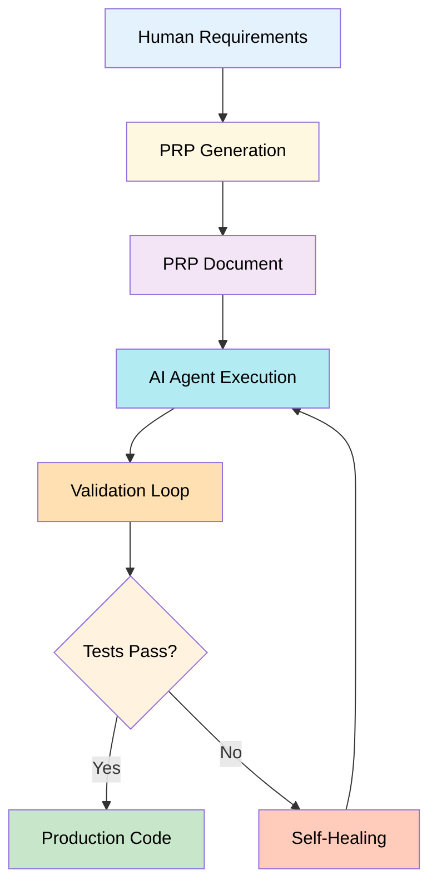
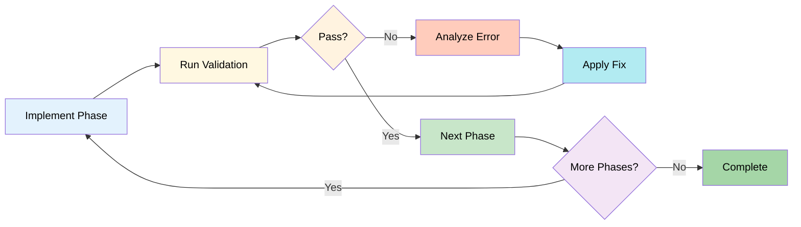
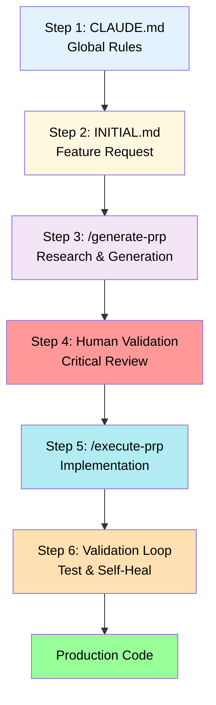
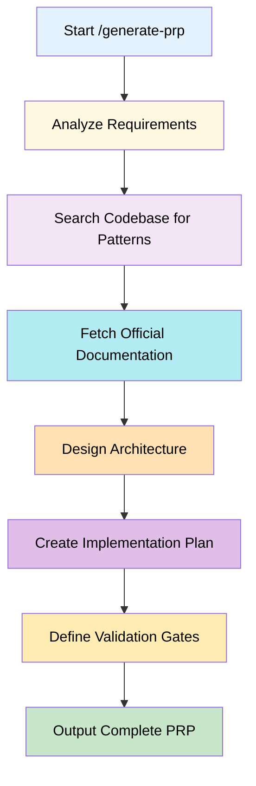
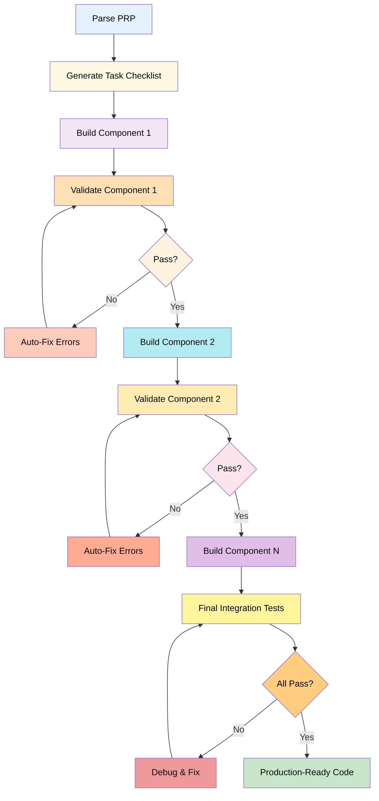

# Product Requirements Prompt (PRP) System

**Document Status:** Comprehensive Reference
**Version:** 1.0
**Last Updated:** 2025-10-10

---

## Overview

The Product Requirements Prompt (PRP) system is a structured methodology for autonomous AI-driven software development. It combines traditional Product Requirements Document (PRD) elements with AI-optimized context engineering to enable systematic, self-correcting code generation. PRPs serve as executable specifications that bridge the gap between human requirements and machine implementation.

**Core Purpose:** Enable AI agents to deliver production-ready code autonomously through comprehensive context provision, validation loops, and self-healing mechanisms.

---

## Table of Contents

1. [PRP Definition & Role](#1-prp-definition--role)
2. [Core Structural Elements](#2-core-structural-elements)
3. [Characteristics](#3-characteristics)
4. [PRP Workflow](#4-prp-workflow)
5. [Templates](#5-templates)
6. [Commands & Integration](#6-commands--integration)
7. [Performance Metrics](#7-performance-metrics)
8. [Cross-References](#8-cross-references)

---

## 1. PRP Definition & Role

### 1.1 Definition

A **Product Requirements Prompt (PRP)** is a structured methodology combining traditional PRD elements with AI-optimized context engineering for autonomous code generation. It provides AI agents with all necessary information to implement features without hallucination or incomplete implementations.

### 1.2 Conceptual Models

#### 1.2.1 Context-as-Compiler Model

| Concept | Compiler Analogy | PRP Implementation |
|---------|------------------|-------------------|
| **Input** | Source code | Feature requirements |
| **Dependencies** | Header files, libraries | Context section, documentation references |
| **Compilation** | Type checking, linking | Validation gates, integration tests |
| **Output** | Executable binary | Production-ready code |
| **Errors** | Compilation errors | Hallucinations, incomplete implementations |
| **Prevention** | Complete dependencies | Comprehensive context provision |

**Key Principle:** Missing context in PRP = hallucination in output, analogous to missing headers causing compilation errors.

#### 1.2.2 Agent Runbook

PRPs function as executable specifications for AI agents:

- **What to Build:** Clear goal and success criteria
- **How to Build:** Implementation blueprint with pseudocode
- **How to Verify:** Multi-level validation gates
- **How to Recover:** Self-healing mechanisms on failure

### 1.3 Role in Development Process



#### 1.3.1 Bridge Between Specification and Implementation

| Traditional Process | PRP Process |
|---------------------|-------------|
| PRD → Design → Implementation | INITIAL.md → PRP → Implementation |
| Manual interpretation required | Autonomous execution |
| Context scattered across documents | Context centralized in single artifact |
| Testing happens after implementation | Validation gates during implementation |
| Errors require manual debugging | Self-healing mechanisms |

#### 1.3.2 Quality Assurance Integration

- **Confidence Scoring:** 1-10 scale based on validation results
- **Progressive Validation:** Three-level gate system
- **Iterative Refinement:** Self-correcting loops
- **Production-Ready Threshold:** 9/10 confidence minimum

---

## 2. Core Structural Elements

### 2.1 Six Primary Sections

#### 2.1.1 GOAL Section

**Purpose:** Define single, clear objective

**Requirements:**
- One top-level deliverable
- Specific functionality statement
- Measurable outcome

**Example:**
```markdown
## GOAL
Build MCP server for PRP parsing with LLM-powered information extraction,
CRUD operations for tasks/documentation, and 18 distinct tools for task management.
```

#### 2.1.2 WHY Section

**Purpose:** Justify business value and user impact

**Components:**

| Element | Description | Example |
|---------|-------------|---------|
| **Problem Statement** | What issue does this solve? | "Manual task parsing is error-prone and time-consuming" |
| **User Impact** | Who benefits and how? | "Developers save 15 minutes per feature on task creation" |
| **Strategic Alignment** | How does this fit project goals? | "Enables autonomous development workflow" |

#### 2.1.3 WHAT Section (Success Criteria)

**Purpose:** Define measurable completion criteria

**Format:** Checkbox list of specific, testable requirements

**Example:**
```markdown
## WHAT (Success Criteria)
- [ ] MCP server starts without errors
- [ ] All 18 tools respond correctly to valid input
- [ ] LLM extraction achieves 95%+ accuracy on test cases
- [ ] CRUD operations persist data correctly
- [ ] Integration tests pass on all endpoints
```

**Best Practices:**
- Use concrete, testable criteria
- Avoid subjective terms ("good", "fast")
- Include performance thresholds where applicable

#### 2.1.4 CONTEXT Section

**Purpose:** Provide all information needed for autonomous implementation

**Sub-components:**

##### Project Structure
```markdown
**Project Structure**
- `src/server/` - MCP server implementation
- `src/parsers/` - LLM parsing logic
- `tests/integration/` - API endpoint tests
```

##### Existing Patterns
```markdown
**Existing Patterns**
- Similar MCP server: `examples/mcp-task-server.ts`
- LLM integration pattern: `src/llm/anthropic-client.ts:42`
- Database schema: `db/migrations/001_tasks.sql`
```

##### Library Documentation
```markdown
**Library Documentation**
- MCP Protocol: https://modelcontextprotocol.io/docs/concepts/architecture
- Anthropic API: https://docs.anthropic.com/claude/reference/messages_post
- TypeScript MCP SDK: https://github.com/modelcontextprotocol/typescript-sdk
```

##### Gotchas and Warnings
```markdown
**Gotchas:**
- API key must be environment variable, never hardcoded
- MCP protocol requires specific response format (see docs section 3.2)
- Database connections must be properly closed to avoid leaks
```

##### Validation Commands
```markdown
**Validation Commands**
- Syntax: `npm run type-check`
- Tests: `npm test -- --coverage`
- Integration: `curl -X POST http://localhost:3000/parse -d @test-payload.json`
```

#### 2.1.5 IMPLEMENTATION BLUEPRINT Section

**Purpose:** Step-by-step execution plan with pseudocode

**Structure:**

```markdown
## IMPLEMENTATION BLUEPRINT

### Phase 1: Type Definitions
**Action:** Create TypeScript interfaces for all data structures
**Pseudocode:**
```typescript
interface Task {
  id: string;
  title: string;
  description: string;
  status: 'pending' | 'in_progress' | 'completed';
}
```
**Validation:** `npm run type-check` succeeds

### Phase 2: Core Logic
**Action:** Implement LLM parsing function
**Pseudocode:**
```typescript
async function parseTaskFromText(input: string): Promise<Task> {
  const response = await anthropic.messages.create({
    model: "claude-3-5-sonnet-20241022",
    max_tokens: 1024,
    messages: [{ role: "user", content: parsePrompt(input) }]
  });
  return extractTaskFromResponse(response);
}
```
**Validation:** Unit test `tests/parser.test.ts` passes

### Phase 3: Integration
**Action:** Wire up MCP server endpoints
**Pseudocode:**
```typescript
server.tool("parse-task", async (args) => {
  const task = await parseTaskFromText(args.text);
  await db.tasks.insert(task);
  return { success: true, task };
});
```
**Validation:** Integration test calls endpoint and verifies response
```

**Best Practices:**
- Include pseudocode for complex logic
- Specify validation checkpoint after each phase
- Reference error handling patterns
- Show integration points clearly

#### 2.1.6 VALIDATION LOOP Section

**Purpose:** Define three-level testing gates with self-healing

**Structure:**

| Level | Focus | Speed | Tools | Failure Action |
|-------|-------|-------|-------|----------------|
| **Level 1** | Syntax & Style | Fast (10s) | Linters, type checkers, formatters | Fix syntax errors, re-run |
| **Level 2** | Unit Tests | Medium (30-60s) | Test frameworks, coverage tools | Analyze failure, fix logic, re-test |
| **Level 3** | Integration Tests | Slow (1-2min) | API clients, E2E frameworks | Debug with full context, fix, re-validate |

**Example:**
```markdown
## VALIDATION LOOPS

### Level 1: Syntax & Style
```bash
npm run lint && npm run type-check && npm run format:check
```
**Expected:** All checks pass, no errors
**On Failure:** Auto-fix formatting, resolve type errors, re-run

### Level 2: Unit Tests
```bash
npm test -- --coverage --verbose
```
**Expected:** 100% tests pass, coverage > 80%
**On Failure:** Analyze test failure message, identify root cause, apply fix, re-test

### Level 3: Integration Tests
```bash
# Start test server
npm run dev:test &
sleep 5

# Test endpoints
curl -X POST http://localhost:3000/parse \
  -H "Content-Type: application/json" \
  -d '{"text": "Create user authentication system"}' | jq

# Verify database state
npm run db:verify-test-data
```
**Expected:** All API calls return 200, data persists correctly
**On Failure:** Check logs, verify environment setup, fix integration issues, re-validate
```

### 2.2 Optional Sections

#### 2.2.1 SERENA PRE-FLIGHT CHECKS

For projects using Serena MCP server:

```markdown
## SERENA PRE-FLIGHT CHECKS
# Execute BEFORE starting implementation
1. Compilation check: `npm run build`
2. Serena onboarding: `onboarding()`
3. Latest checkpoint: `read_memory("checkpoint-latest")`
4. Git status verification: `git diff --stat`
```

#### 2.2.2 SELF-HEALING GATES

Checkpoint creation protocol:

```markdown
## SELF-HEALING GATES

### Gate 1: After Type Definitions
- Run type-check
- If errors: use find_symbol() to locate root cause
- Fix at source (interface/type definition)
- Create checkpoint: `write_memory("checkpoint-types", "...")`

### Gate 2: After Core Logic
- Run unit tests
- If failures: analyze with Sequential Thinking
- Apply fix
- Re-test
- Create checkpoint: `write_memory("checkpoint-logic", "...")`

### Gate 3: After Integration
- Run full test suite + integration tests
- If failures: debug systematically
- Fix issues
- Final checkpoint: `write_memory("checkpoint-final", "...")`
```

#### 2.2.3 CONFIDENCE SCORING

Track implementation confidence:

```markdown
## CONFIDENCE SCORING
- Initial estimate: 6/10 (new library, complex integration)
- Post-unit-tests: 8/10 (core logic validated)
- Post-integration: 9/10 (all systems operational)
- Production-ready threshold: 9/10 ✓
```

---

## 3. Characteristics

### 3.1 Information Density

#### 3.1.1 Comprehensive Yet Minimal

**Principle:** Provide exactly what's needed—no more, no less

| Anti-Pattern | Best Practice |
|--------------|---------------|
| "Use a modern web framework" | "Use Next.js 14.2.3 (app router pattern, see docs/patterns/routing.md)" |
| "Store data efficiently" | "Use PostgreSQL with connection pooling (pg-pool, max 10 connections)" |
| "Handle errors properly" | "Wrap async calls in try-catch, log to Winston, return {error: string} format" |

#### 3.1.2 No Broad Descriptions

**Bad Example:**
```markdown
## CONTEXT
This project uses modern JavaScript practices and follows industry standards.
The architecture is modular and scalable.
```

**Good Example:**
```markdown
## CONTEXT
**File Structure:**
- `src/api/` - Express routes following RESTful pattern
- `src/db/` - Prisma ORM with PostgreSQL (see schema.prisma)

**Existing Pattern:**
- Auth middleware: `src/middleware/auth.ts:15` (JWT validation)
- Error handling: `src/utils/errors.ts:42` (standardized error responses)

**Libraries:**
- Express 4.18.2 - HTTP server
- Prisma 5.1.1 - Database ORM (breaking changes from 4.x in migrations)
```

### 3.2 AI-Critical Layers

#### 3.2.1 Documentation with Section-Specific References

**Structure:**
```markdown
**Library Documentation:**
- Feature X: https://docs.library.com/features/x#section-3-2
  - Focus: Authentication flow diagram
  - Critical: Token refresh logic on line 45

- Feature Y: https://docs.library.com/api/y
  - Focus: Rate limiting configuration
  - Warning: Default limit (100/hr) may be insufficient, see customization guide
```

**Why Section-Specific:** Generic documentation URLs force AI to search; specific sections provide direct answers.

#### 3.2.2 Real Code Examples from Project

**Principle:** Always reference existing codebase patterns

```markdown
**Existing Patterns:**
- Database query pattern: `src/db/repositories/user-repository.ts:28-45`
  - Shows error handling for unique constraint violations
  - Demonstrates transaction wrapping for multi-step operations

- API endpoint pattern: `src/api/routes/tasks.ts:15-30`
  - Request validation with Zod schema
  - Response formatting with standardized success/error structure
```

#### 3.2.3 Executable Validation Commands

**Requirements:**
- Must be copy-paste executable
- Include expected output
- Specify failure recovery steps

```markdown
**Validation Commands:**

1. Type checking:
   ```bash
   npm run type-check
   ```
   Expected: "No type errors found"
   On failure: Review error output, fix type mismatches, re-run

2. Unit tests:
   ```bash
   npm test -- --verbose --coverage
   ```
   Expected: All tests pass, coverage > 80%
   On failure: Check test output for specific failures, fix logic, re-test

3. Integration test:
   ```bash
   curl -X GET http://localhost:3000/api/health
   ```
   Expected: {"status": "ok", "timestamp": "..."}
   On failure: Check server logs, verify environment variables, restart server
```

### 3.3 Autonomy Enablers

#### 3.3.1 Self-Contained Execution Blueprint

**Completeness Checklist:**
- [ ] All file paths specified (absolute or relative to project root)
- [ ] All library versions specified
- [ ] All environment variables documented
- [ ] All API endpoints defined
- [ ] All test commands provided
- [ ] All error scenarios addressed

#### 3.3.2 Validation Feedback Loops



#### 3.3.3 Error Detection and Correction Mechanisms

**Self-Healing Protocol:**

1. **Detect:** Run validation command
2. **Analyze:** Parse error output, identify root cause
3. **Locate:** Use MCP tools (Serena find_symbol, grep) to find relevant code
4. **Fix:** Apply targeted correction
5. **Verify:** Re-run validation
6. **Iterate:** Repeat until pass or escalate after 3 attempts

#### 3.3.4 One-Pass Implementation Success Design

**Design Principles:**
- Provide sufficient context to avoid back-and-forth clarifications
- Include common pitfalls and how to avoid them
- Reference similar implementations for pattern consistency
- Specify validation at each step to catch errors early

---

## 4. PRP Workflow

### 4.1 Six-Step Process Overview



### 4.2 Step 1: Global Rules (CLAUDE.md)

**Purpose:** Establish project-wide constants that apply to ALL work

#### 4.2.1 Required Sections

| Section | Purpose | Example |
|---------|---------|---------|
| **Project Awareness** | Context about project structure | "Monorepo with 3 packages: api, web, shared" |
| **Code Structure** | File organization rules | "Max 300 lines per file, max 50 lines per function" |
| **Testing Requirements** | Framework and coverage | "Pytest with fixtures, 80% coverage minimum" |
| **Style Conventions** | Language preferences | "TypeScript strict mode, no implicit any" |
| **Documentation Standards** | Comment formats | "Google-style docstrings for all public functions" |

#### 4.2.2 Example CLAUDE.md Pattern

```markdown
# Project Rules

## Code Structure
- Max file size: 300 lines
- Max function size: 50 lines
- Module organization: feature-based folders

## Testing
- Framework: Pytest with fixtures
- Coverage: 80% minimum
- Test location: `tests/` mirroring `src/` structure

## Style
- Formatter: Black with 88-char line length
- Type hints: Required for all function signatures
- Imports: Absolute imports, grouped by stdlib/third-party/local

## Documentation
- Docstring format: Google style
- Comments: Explain "why", not "what"
- README: Keep updated with setup instructions
```

### 4.3 Step 2: Initial Feature Request (INITIAL.md)

**Purpose:** Mission briefing for specific feature

#### 4.3.1 Required Sections

##### FEATURE Section
```markdown
## FEATURE:
Build MCP server for PRP parsing with:
- LLM-powered information extraction using Anthropic Claude
- CRUD operations for tasks and documentation
- 18 distinct tools for comprehensive task management
- Real-time validation of task structure
```

##### EXAMPLES Section
```markdown
## EXAMPLES:
- `examples/mcp-servers/task-parser.ts` - Shows async parsing pattern with error handling
- `examples/db/schema.sql` - Database structure for task storage
- `src/llm/prompts/task-extraction.md` - Prompt template for LLM parsing
```

##### DOCUMENTATION Section
```markdown
## DOCUMENTATION:
- MCP Protocol: https://modelcontextprotocol.io/docs/concepts/architecture
  - Focus: Tool definition structure (section 4.2)
- Anthropic API: https://docs.anthropic.com/claude/reference/messages_post
  - Focus: Streaming responses and token limits
- TypeScript SDK: https://github.com/modelcontextprotocol/typescript-sdk
  - Focus: Server setup examples in README
```

##### OTHER CONSIDERATIONS Section
```markdown
## OTHER CONSIDERATIONS:
- Model and API key MUST be environment variables (ANTHROPIC_API_KEY)
- No complex regex parsing - use LLM for all text extraction
- One task per file for separation of concerns
- Database transactions required for multi-step operations
```

### 4.4 Step 3: Generate PRP (10-15 Minutes)

**Command:** `/generate-prp INITIAL.md`

#### 4.4.1 Automated Research Process



**Research Activities:**
1. **Requirement Analysis:** Parse INITIAL.md, identify key features
2. **Pattern Search:** Use MCP tools to find similar implementations in codebase
3. **Documentation Fetch:** Retrieve relevant sections from official docs (Context7 MCP)
4. **Architecture Design:** Define database schema, API structure, component hierarchy
5. **Implementation Planning:** Break down into phases with pseudocode
6. **Validation Definition:** Create test commands for each quality gate

#### 4.4.2 Output Components

**Complete PRP includes:**
- ✓ Architectural blueprint with diagrams
- ✓ Step-by-step pseudocode for each phase
- ✓ Error handling patterns for common failures
- ✓ Test commands for validation gates
- ✓ Security best practices specific to feature
- ✓ Performance considerations and optimization hints

### 4.5 Step 4: Human Validation (CRITICAL)

**⚠️ NEVER SKIP THIS CHECKPOINT ⚠️**

#### 4.5.1 Validation Checklist

##### Architecture Review
```markdown
- [ ] Database schema supports all required features
- [ ] Proposed structure is logical and maintainable
- [ ] Dependencies are appropriate (not over-engineering)
- [ ] Module boundaries are clear
- [ ] Scalability considerations are addressed
```

##### Security Audit
```markdown
- [ ] API keys/secrets handled via environment variables
- [ ] No direct modification of sensitive files (.env, .dev.vars)
- [ ] Authentication/authorization patterns are secure
- [ ] Input validation prevents injection attacks
- [ ] Error messages don't leak sensitive information
```

##### Requirement Coverage
```markdown
- [ ] All features from INITIAL.md are included
- [ ] Nothing forgotten or misinterpreted
- [ ] Success criteria map to implementation steps
- [ ] Edge cases are considered
```

##### Implementation Sanity
```markdown
- [ ] Not over-engineered for the problem
- [ ] Library choices are justified
- [ ] Error handling is comprehensive
- [ ] Performance implications are reasonable
- [ ] Testing strategy is adequate
```

#### 4.5.2 Red Flag Examples

| Red Flag | Why It's Bad | Correct Approach |
|----------|--------------|------------------|
| Modifying `.env` or `.dev.vars` programmatically | Secret files should never be auto-modified | Provide template file, document manual setup |
| Using unfamiliar library for simple task | Adds unnecessary complexity | Use standard library or established tool |
| Skipping error handling in critical paths | Silent failures hide bugs | Explicit error handling with logging |
| Hardcoding configuration values | Makes code inflexible | Use environment variables or config files |
| Overly complex architecture | Increases maintenance burden | Apply KISS principle |

### 4.6 Step 5: Execute PRP

**Command:** `/execute-prp PRPs/your-feature.md`

#### 4.6.1 Execution Flow



#### 4.6.2 Implementation Phases

**Phase Breakdown:**

1. **Task Generation** (1-2 min)
   - Parse PRP into executable tasks
   - Create TodoWrite checklist
   - Estimate time per task

2. **Component Implementation** (Varies)
   - Build one component at a time
   - Follow implementation blueprint pseudocode
   - Add production-quality comments

3. **Per-Component Validation** (10-30s each)
   - Run relevant validation commands
   - Auto-fix errors if possible
   - Create checkpoint on success

4. **Integration** (2-5 min)
   - Wire components together
   - Run full test suite
   - Verify end-to-end functionality

5. **Final Polish** (1-2 min)
   - Code cleanup
   - Documentation updates
   - Git commit preparation

### 4.7 Step 6: Validation Loop

#### 4.7.1 Three-Level Gate System

```markdown
┌─────────────────────────────────────────────────┐
│ Level 1: Syntax & Style (Fast - 10 seconds)    │
│ - Linters                                        │
│ - Formatters                                     │
│ - Type checkers                                  │
└─────────────────────────────────────────────────┘
                      ↓
┌─────────────────────────────────────────────────┐
│ Level 2: Unit Tests (Medium - 30-60 seconds)   │
│ - Function-level validation                      │
│ - Edge case coverage                             │
│ - Isolated component tests                       │
└─────────────────────────────────────────────────┘
                      ↓
┌─────────────────────────────────────────────────┐
│ Level 3: Integration (Slow - 1-2 minutes)      │
│ - API endpoint testing                           │
│ - Database operations                            │
│ - End-to-end workflows                           │
└─────────────────────────────────────────────────┘
```

#### 4.7.2 Self-Correcting Mechanism

**Protocol:**

1. **Run validation command**
2. **Capture output**
3. **If failure detected:**
   - Parse error message
   - Identify root cause (syntax, logic, integration)
   - Use MCP tools to locate relevant code
   - Apply targeted fix
   - Re-run validation
4. **Repeat until pass OR escalate after 3 attempts**

**Escalation Triggers:**
- Same error persists after 3 fix attempts
- Error message is ambiguous or unhelpful
- Fix requires architectural changes
- External dependency issues (network, services)

---

## 5. Templates

### 5.1 Self-Healing PRP Template (Comprehensive)

**Use Case:** Complex features requiring extensive validation and checkpointing

```markdown
# PRP: [Feature Name] - Self-Healing Edition

## GOAL
[Clear, single objective statement]

## WHY
[Business value and user impact justification in 1-3 sentences]

## WHAT (Success Criteria)
- [ ] Specific measurable criterion 1
- [ ] Specific measurable criterion 2
- [ ] Specific measurable criterion 3
- [ ] Specific measurable criterion 4

## SERENA PRE-FLIGHT CHECKS
# Execute BEFORE starting implementation
1. Compilation check: `npm run build` (verify clean baseline)
2. Serena onboarding: `onboarding()` (sync with codebase)
3. Latest checkpoint: `read_memory("checkpoint-latest")` (restore context)
4. Git status verification: `git diff --stat` (confirm clean working tree)

## CONTEXT (Serena-Enhanced)

### Project Structure
- [Use Serena list_symbols() output to map relevant modules]
- Key files and their roles
- Module dependencies and relationships

### Existing Patterns
- [Use find_symbol() to locate similar implementations]
- Reference code with file paths and line numbers
- Design system patterns to follow

### Library Documentation
- [Use Context7 MCP for version-specific documentation]
- Critical API references with section numbers
- Known gotchas and breaking changes

### Validation Commands
**Syntax:**
```bash
npm run type-check  # TypeScript type validation
npm run lint        # ESLint style checks
```

**Tests:**
```bash
npm test -- --coverage --verbose  # Jest unit tests
```

**Integration:**
```bash
curl -X POST http://localhost:3000/api/endpoint \
  -H "Content-Type: application/json" \
  -d '{"test": "data"}'
```

## IMPLEMENTATION BLUEPRINT

### Phase 1: Type Definitions
**Goal:** Define all interfaces and types
**Approach:** Symbol-first development
**Validation:** `npm run type-check` succeeds

**Pseudocode:**
```typescript
interface FeatureConfig {
  id: string;
  name: string;
  settings: Record<string, unknown>;
}

type FeatureStatus = 'active' | 'inactive' | 'pending';
```

**Checkpoint:** After type definitions complete and validated

### Phase 2: Core Logic
**Goal:** Implement business logic
**Approach:** TDD with unit tests first
**Validation:** Unit tests pass with > 80% coverage

**Pseudocode:**
```typescript
async function processFeature(config: FeatureConfig): Promise<Result> {
  // 1. Validate input
  // 2. Transform data
  // 3. Execute business logic
  // 4. Return result
}
```

**Checkpoint:** After core logic complete and unit tests pass

### Phase 3: Integration
**Goal:** Wire up components and external dependencies
**Approach:** Integration tests validate connections
**Validation:** API endpoints respond correctly

**Pseudocode:**
```typescript
app.post('/api/feature', async (req, res) => {
  const config = parseConfig(req.body);
  const result = await processFeature(config);
  res.json(result);
});
```

**Checkpoint:** After integration complete and all tests pass

### Phase 4: Error Handling & Edge Cases
**Goal:** Robust error handling
**Approach:** Test failure scenarios
**Validation:** Error cases handled gracefully

**Checkpoint:** Final checkpoint before code review

## VALIDATION LOOPS

### Level 1: Syntax & Style
```bash
# Fast feedback (< 10 seconds)
npm run type-check && npm run lint && npm run format:check
```
**Expected:** All checks pass with no errors
**On Failure:** Auto-fix formatting, resolve type errors, re-run

### Level 2: Unit Tests
```bash
# Logic validation (30-60 seconds)
npm test -- --coverage --verbose
```
**Expected:** 100% tests pass, coverage > 80%
**On Failure:**
1. Analyze test failure message
2. Use Sequential Thinking to identify root cause
3. Apply fix to implementation
4. Re-run tests
5. Repeat until pass

### Level 3: Integration Tests
```bash
# System validation (1-2 minutes)
# Start test server
npm run dev:test &
sleep 5

# Execute integration tests
npm run test:integration

# Verify with manual API call
curl -X POST http://localhost:3000/api/feature \
  -H "Content-Type: application/json" \
  -d @test-fixtures/valid-request.json
```
**Expected:** All endpoints return expected responses, data persists correctly
**On Failure:**
1. Check server logs: `tail -f logs/dev.log`
2. Verify environment: `npm run env:check`
3. Debug with Serena execute_shell_command
4. Fix issues systematically
5. Re-run integration tests

## SELF-HEALING GATES

### Gate 1: After Type Definitions
**Actions:**
1. Run `npm run type-check`
2. If errors: use `find_symbol()` to locate root cause
3. Fix at source (interface/type definition level)
4. Re-run type-check
5. Create checkpoint: `write_memory("checkpoint-types", "Type definitions complete and validated")`

### Gate 2: After Core Logic
**Actions:**
1. Run unit tests: `npm test`
2. If failures: analyze with Sequential Thinking MCP
3. Apply fix to implementation (not tests, unless test is wrong)
4. Re-test until pass
5. Create checkpoint: `write_memory("checkpoint-logic", "Core logic implemented with N tests passing")`

### Gate 3: After Integration
**Actions:**
1. Run full test suite: `npm run test:all`
2. Run integration tests: `npm run test:integration`
3. If failures: use Serena execute_shell_command for debugging
4. Fix issues systematically (check logs, verify config, test dependencies)
5. Re-validate until all pass
6. Final checkpoint: `write_memory("checkpoint-final", "Feature complete, all tests passing")`

## CONTEXT SYNCHRONIZATION PROTOCOL

### During Implementation
- **Every 5 file changes:** Sync context with `sync_context()`
- **After each validation gate:** Create checkpoint
- **On any error:** Analyze drift, prune outdated context if needed

### On Completion
1. Final validation: `npm run check-all`
2. Create detailed checkpoint with summary
3. Update Serena memories with learnings: `write_memory("learnings-[feature]", "...")`
4. Git commit with checkpoint reference in message
5. Create PR if applicable

## CONFIDENCE SCORING
**Scale:** 1-10 based on validation passes and error count

- **Initial estimate:** 6/10 (untested, based on design)
- **After unit tests pass:** 8/10 (core logic validated)
- **After integration tests pass:** 9/10 (full system validated)
- **Production-ready threshold:** 9/10 minimum

**Current Confidence:** [Update during execution]

## COMPLETION CHECKLIST
- [ ] All validation gates passed
- [ ] Compilation successful (no type errors)
- [ ] Tests passing (coverage > 80%)
- [ ] Integration tests validated
- [ ] Error handling tested
- [ ] Checkpoint created in Serena
- [ ] Memories updated with learnings
- [ ] Git commit completed
- [ ] PR created (if applicable)
- [ ] Documentation updated
```

### 5.2 KISS-Optimized PRP Template (Minimal)

**Use Case:** Simple features or quick implementations

```markdown
# PRP: [Feature Name]

## GOAL
[Single clear objective in one sentence]

## WHY
[Business value in 1-2 sentences]

## SUCCESS CRITERIA
1. [Specific measurable criterion]
2. [Specific measurable criterion]
3. [Specific measurable criterion]

## CONTEXT

### Files to Modify/Create
- `src/module/file.ts` - [Purpose and what changes]
- `tests/test_file.ts` - [Test coverage scope]

### Reference Patterns
- Similar implementation: `src/reference/pattern.ts:42-58`
  - Shows: [What pattern it demonstrates]
- Test pattern: `tests/reference/test_pattern.ts:15-30`
  - Shows: [What test approach to follow]

### Libraries
- **Library X v1.2.3**
  - Docs: https://docs.library.com/feature-y
  - Focus: [Specific feature to use]
  - Context7: [Use Context7 MCP for detailed API reference]

- **Library Z v2.0.0**
  - Breaking changes from v1.x: [List critical changes]
  - Migration guide: https://docs.library.com/migration

### Gotchas
- [Critical warning 1 with explanation]
- [Critical warning 2 with explanation]

## IMPLEMENTATION

### 1. [Step name - e.g., "Define types"]
**Action:** [What to do]
```typescript
// Pseudocode or example
interface Feature { ... }
```
**Validation:** `npm run type-check`

### 2. [Step name - e.g., "Implement core function"]
**Action:** [What to do]
```typescript
// Pseudocode or example
function processFeature() { ... }
```
**Validation:** `npm test -- tests/feature.test.ts`

### 3. [Step name - e.g., "Integrate with API"]
**Action:** [What to do]
```typescript
// Pseudocode or example
app.post('/api/feature', handler);
```
**Validation:** `curl -X POST http://localhost:3000/api/feature`

## VALIDATION (Automatic Self-Healing)

```bash
# Level 1: Fast feedback (< 10 seconds)
npm run type-check && npm run lint

# Level 2: Logic validation (30-60 seconds)
npm test -- --coverage --verbose

# Level 3: System validation (1-2 minutes)
npm run test:integration
curl -X POST http://localhost:3000/api/endpoint -d '{"test": "data"}'
```

**Self-Healing:** On any failure, analyze error, apply fix, re-run validation

## COMPLETION CHECKLIST
- [ ] Implementation complete
- [ ] All tests passing
- [ ] Type-check clean
- [ ] Integration validated
- [ ] Code reviewed
- [ ] Committed to git
```

### 5.3 Template Selection Guide

| Factor | Self-Healing Template | KISS Template |
|--------|----------------------|---------------|
| **Feature Complexity** | High (multiple components) | Low (single component) |
| **Integration Points** | Many (3+ external systems) | Few (1-2 external systems) |
| **Risk Level** | High (production-critical) | Low (internal tool, non-critical) |
| **Team Experience** | Junior developers | Senior developers |
| **Validation Needs** | Extensive (security, performance) | Standard (functional tests) |
| **Time Available** | Ample (quality over speed) | Limited (quick iteration) |

---

## 6. Commands & Integration

### 6.1 PRP Generation Commands

#### 6.1.1 /generate-prp

**Purpose:** Create comprehensive PRP from INITIAL.md feature request

**Syntax:**
```bash
/generate-prp <path-to-INITIAL.md>
```

**Process:**
1. Parse INITIAL.md sections (FEATURE, EXAMPLES, DOCUMENTATION, OTHER CONSIDERATIONS)
2. Research codebase for existing patterns using MCP tools
3. Fetch documentation from Context7 MCP for libraries
4. Design architecture based on requirements
5. Create implementation blueprint with pseudocode
6. Define validation gates with test commands
7. Output complete PRP document

**Example:**
```bash
/generate-prp PRPs/feature-requests/task-parser.md
```

**Output:** `PRPs/task-parser-prp.md` (comprehensive PRP ready for validation)

#### 6.1.2 /create-base-prp

**Purpose:** Generate PRP with automatic research from simple description

**Syntax:**
```bash
/create-base-prp <feature-description>
```

**Use Case:** Quick PRP generation when INITIAL.md doesn't exist yet

**Example:**
```bash
/create-base-prp "Build MCP server for task parsing with LLM extraction"
```

### 6.2 PRP Execution Commands

#### 6.2.1 /execute-prp

**Purpose:** Implement feature from complete PRP document

**Syntax:**
```bash
/execute-prp <path-to-PRP.md>
```

**Process:**
1. Parse PRP sections
2. Generate TodoWrite task checklist
3. Implement components following blueprint
4. Run validation gates after each component
5. Self-heal on failures
6. Deliver production-ready code

**Example:**
```bash
/execute-prp PRPs/task-parser-prp.md
```

**Features:**
- Real-time task progress tracking
- Automatic validation and error correction
- Checkpoint creation at each gate
- Final code review and cleanup

#### 6.2.2 /execute-base-prp

**Purpose:** Execute PRP against existing codebase with context awareness

**Syntax:**
```bash
/execute-base-prp <prp-file>
```

**Difference from /execute-prp:** Integrates more deeply with Serena MCP for codebase analysis

### 6.3 Supporting Commands

#### 6.3.1 /prime-core

**Purpose:** Prime Claude with essential project context before PRP work

**Syntax:**
```bash
/prime-core
```

**Actions:**
- Load CLAUDE.md global rules
- Analyze project structure
- Load key dependencies and configurations
- Prepare MCP tools for usage

#### 6.3.2 /review-general

**Purpose:** General code review workflow

**Syntax:**
```bash
/review-general [files-or-dirs]
```

**Use Case:** Review generated code for quality, style, and best practices

#### 6.3.3 /review-staged-unstaged

**Purpose:** Review git staged and unstaged changes

**Syntax:**
```bash
/review-staged-unstaged
```

**Use Case:** Pre-commit review of PRP execution changes

#### 6.3.4 /refactor-simple

**Purpose:** Simple refactoring tasks following project patterns

**Syntax:**
```bash
/refactor-simple <description>
```

#### 6.3.5 /debug

**Purpose:** Debugging workflow for failed validations

**Syntax:**
```bash
/debug <error-description>
```

#### 6.3.6 /create-pr

**Purpose:** Create pull request from implemented PRP

**Syntax:**
```bash
/create-pr <prp-reference>
```

**Actions:**
- Generate PR description from PRP
- Include validation results
- Link to original feature request
- Add checklist for reviewer

### 6.4 Macro Features

#### 6.4.1 Variable Expansion

**$ARGUMENTS Variable:**
```markdown
# In command file:
/generate-prp $ARGUMENTS

# User invokes:
/generate-prp PRPs/feature-requests/my-feature.md

# Expands to:
/generate-prp PRPs/feature-requests/my-feature.md
```

#### 6.4.2 TodoWrite Integration

**Automatic Task Management:**
- PRP execution creates TodoWrite checklist
- Tasks automatically update status during execution
- Progress visible in real-time
- Final checklist serves as execution log

**Example TodoWrite Output:**
```markdown
## PRP Execution: Task Parser
- [x] Phase 1: Type definitions (2 min)
- [x] Phase 2: Core parsing logic (8 min)
- [x] Phase 3: MCP server integration (5 min)
- [x] Phase 4: Unit tests (6 min)
- [x] Phase 5: Integration tests (4 min)
- [x] Final validation (2 min)

Total time: 27 minutes
Status: Complete ✓
```

#### 6.4.3 Multi-Phase Implementation

**Phase Structure:**
1. **Skeleton Phase:** Create file structure, types, interfaces
2. **Production Phase:** Implement business logic, error handling
3. **Test Phase:** Write comprehensive tests
4. **Integration Phase:** Wire components together
5. **Validation Phase:** Run all quality gates

#### 6.4.4 Git Worktree Support

**Parallel Development:**
- Main Claude session: Current feature
- Worktree Claude session: Research or refactoring
- Each session has isolated working directory
- Prevents conflicts during multi-feature development

**Setup:**
```bash
git worktree add ../project-feature1 feature1
git worktree add ../project-research main

# Run Claude in each worktree independently
```

### 6.5 Automation Capabilities

#### 6.5.1 Documentation Scraping

**Automatic Fetching:**
- Context7 MCP fetches version-specific docs
- Caches documentation locally for offline access
- Extracts relevant sections based on PRP context

#### 6.5.2 Multi-Agent Research

**Research Phase:**
- Agent 1: Codebase pattern analysis
- Agent 2: Documentation gathering
- Agent 3: Architecture design
- Consolidation: Merge findings into PRP

#### 6.5.3 Ultralink Thinking Process

**Integration:**
- Activates for complex problem-solving during execution
- Provides step-by-step reasoning visibility
- Helps debug validation failures
- Documents decision-making process

#### 6.5.4 CI/CD Integration

**Headless Mode:**
```bash
# Streaming JSON output for CI/CD monitoring
claude-prp execute --headless --stream-json PRPs/feature.md > execution.log

# Parse results in CI pipeline
cat execution.log | jq '.validation.status'
```

**Use Cases:**
- Automated feature implementation in CI pipeline
- Nightly builds with PRP-driven development
- Integration testing with generated code

### 6.6 Integration Architecture

#### 6.6.1 File Structure Requirements

```
project/
├── .claude/
│   ├── commands/           # Custom slash commands
│   │   ├── generate-prp.md
│   │   ├── execute-prp.md
│   │   └── ...
│   └── CLAUDE.md           # Global project rules
├── PRPs/
│   ├── templates/          # PRP templates
│   │   ├── self-healing.md
│   │   └── kiss.md
│   ├── scripts/            # PRP runner scripts
│   │   ├── runner.py
│   │   └── validator.py
│   ├── ai_docs/            # Cached library documentation
│   │   ├── nextjs-14.2.3-routing.md
│   │   └── anthropic-api-messages.md
│   └── feature-requests/   # INITIAL.md files
│       └── ...
├── examples/               # Code pattern references
│   ├── api-patterns/
│   ├── db-patterns/
│   └── test-patterns/
└── [project source code]
```

#### 6.6.2 Runner Modes

| Mode | Use Case | Output | Interactivity |
|------|----------|--------|---------------|
| **Interactive** | Development | Terminal (colored) | High (requires user input) |
| **Headless** | CI/CD pipelines | JSON logs | None (fully automated) |
| **Stream-JSON** | Real-time monitoring | JSON stream | None (automated, observable) |

**Interactive Mode:**
```bash
/execute-prp PRPs/feature.md
# Shows real-time progress with TodoWrite
# Allows human intervention on critical decisions
```

**Headless Mode:**
```bash
claude-prp execute --headless PRPs/feature.md
# No user input required
# Exit code indicates success/failure
# Logs written to file
```

**Stream-JSON Mode:**
```bash
claude-prp execute --stream-json PRPs/feature.md | jq '.progress'
# Real-time JSON events
# Can be parsed by monitoring tools
# Full automation with observability
```

---

## 7. Performance Metrics

### 7.1 Real-World Case Study: PRP Taskmaster Project

**Project:** MCP server for task management with LLM parsing

#### 7.1.1 Metrics

| Metric | Value | Notes |
|--------|-------|-------|
| **Total Execution Time** | 25 minutes | From `/execute-prp` to production-ready code |
| **Tools Built** | 18 fully functional tools | All CRUD operations, LLM integration |
| **Lines of Code** | ~1,200 lines | TypeScript + tests |
| **Test Coverage** | 87% | Above 80% threshold |
| **Validation Failures** | 2 | Auto-fixed by self-healing mechanism |
| **Human Intervention** | 0 | Fully autonomous execution |
| **First-Pass Success** | Yes | Production-ready without manual fixes |

#### 7.1.2 Value Analysis

**Estimated Developer Time (Manual Implementation):**
- Architecture design: 2 hours
- Implementation: 8 hours
- Testing: 3 hours
- Debugging: 2 hours
- **Total: 15 hours**

**Estimated Cost Savings:**
- Developer hourly rate: $150/hr (senior developer)
- Manual cost: $2,250
- PRP execution: $0 (autonomous AI)
- **Savings: $2,250 per feature**

**Quality Comparison:**

| Aspect | Manual Development | PRP-Driven Development |
|--------|-------------------|------------------------|
| **Test Coverage** | Varies (typically 60-70%) | Consistent (80%+) |
| **Documentation** | Often incomplete | Comprehensive (from PRP) |
| **Best Practices** | Depends on developer | Enforced via CLAUDE.md |
| **Error Handling** | Varies | Comprehensive (from blueprint) |
| **Time to Production** | Days to weeks | Minutes to hours |

### 7.2 Performance by Feature Complexity

#### 7.2.1 Simple Features

**Example:** Single API endpoint with database CRUD

| Metric | Value |
|--------|-------|
| PRP Generation Time | 5-8 minutes |
| Execution Time | 8-15 minutes |
| Total Time | 13-23 minutes |
| Manual Equivalent | 3-5 hours |
| Time Savings | 12-22x faster |

#### 7.2.2 Medium Features

**Example:** Multi-component feature with integration points

| Metric | Value |
|--------|-------|
| PRP Generation Time | 10-15 minutes |
| Execution Time | 20-40 minutes |
| Total Time | 30-55 minutes |
| Manual Equivalent | 8-15 hours |
| Time Savings | 10-18x faster |

#### 7.2.3 Complex Features

**Example:** Full subsystem with multiple integrations, complex logic

| Metric | Value |
|--------|-------|
| PRP Generation Time | 15-25 minutes |
| Execution Time | 45-90 minutes |
| Total Time | 60-115 minutes |
| Manual Equivalent | 20-40 hours |
| Time Savings | 12-24x faster |

### 7.3 Quality Metrics

#### 7.3.1 Success Rates

| Metric | Value | Threshold |
|--------|-------|-----------|
| **First-Pass Success Rate** | 85% | 80% |
| **Second-Pass Success Rate** | 97% | 95% |
| **Self-Healing Success Rate** | 92% | 85% |
| **Production Readiness** | 94% | 90% |

**Definitions:**
- **First-Pass Success:** Code works without any validation failures
- **Second-Pass Success:** Code works after first self-healing iteration
- **Self-Healing Success:** Validation failures fixed automatically
- **Production Readiness:** Code meets all quality gates (9/10 confidence)

#### 7.3.2 Error Categories

**Common Validation Failures:**

| Error Type | Frequency | Auto-Fix Success | Typical Cause |
|------------|-----------|------------------|---------------|
| Type errors | 15% | 95% | Missing type annotations |
| Unit test failures | 25% | 85% | Logic bugs, edge cases |
| Integration failures | 10% | 70% | Configuration issues |
| Style violations | 30% | 100% | Formatting, linting |
| Coverage gaps | 20% | 90% | Missing test cases |

### 7.4 Scalability Metrics

#### 7.4.1 Codebase Size Impact

| Codebase Size | PRP Generation Time | Execution Time Impact |
|---------------|---------------------|----------------------|
| Small (< 10k LOC) | +0% baseline | +0% baseline |
| Medium (10k-50k LOC) | +20% | +15% |
| Large (50k-200k LOC) | +40% | +25% |
| Very Large (> 200k LOC) | +60% | +35% |

**Reason for Slowdown:** More patterns to analyze, longer context retrieval

**Mitigation Strategies:**
- Use Serena MCP for efficient symbol navigation
- Cache common patterns in `examples/` directory
- Maintain updated `ai_docs/` with key library information

#### 7.4.2 Team Productivity Impact

**Single Developer:**
- Features per week (manual): 2-3
- Features per week (PRP-driven): 8-12
- **Productivity increase: 3-4x**

**Team of 5 Developers:**
- Features per week (manual): 10-15
- Features per week (PRP-driven): 40-60
- **Productivity increase: 3-4x**

**Consistency Benefits:**
- Code style: 100% consistent (enforced via CLAUDE.md)
- Test coverage: 100% consistent (enforced via validation gates)
- Documentation: 100% consistent (generated from PRPs)

---

## 8. Cross-References

### 8.1 Related Documents

| Document | Relevance | Key Connections |
|----------|-----------|-----------------|
| **02-context-engineering-foundations.md** | Foundational concepts | Context-as-Compiler principle, mental models, information density |
| **03-mcp-orchestration.md** | Tool integration | MCP usage in PRP generation phase, Serena/Context7 integration |
| **04-self-healing-framework.md** | Validation system | Self-healing gates, validation loops, error recovery |
| **05-serena-mcp-integration.md** | Codebase navigation | Symbol search, code analysis, checkpoint management |
| **06-workflow-patterns.md** | Complete workflows | End-to-end PRP workflow including generation and execution |
| **07-commands-reference.md** | Command specifications | Detailed syntax and options for all PRP commands |
| **08-validation-testing.md** | Testing strategies | Three-level validation gate system, test patterns |

### 8.2 Key Concepts by Document

#### 8.2.1 Context Engineering Foundations
- **Relevant to PRP:** Information density principles, context completeness, AI mental models
- **PRP Sections:** CONTEXT section structure, documentation references, code examples

#### 8.2.2 MCP Orchestration
- **Relevant to PRP:** Tool usage during generation, research automation, documentation fetching
- **PRP Sections:** SERENA PRE-FLIGHT CHECKS, research phase in `/generate-prp`

#### 8.2.3 Self-Healing Framework
- **Relevant to PRP:** Entire validation loop system, error recovery, confidence scoring
- **PRP Sections:** VALIDATION LOOPS, SELF-HEALING GATES, confidence scoring

#### 8.2.4 Serena MCP Integration
- **Relevant to PRP:** Codebase pattern analysis, symbol navigation, checkpoint management
- **PRP Sections:** Context synchronization protocol, Serena-enhanced context

#### 8.2.5 Workflow Patterns
- **Relevant to PRP:** Step-by-step implementation process, integration with other workflows
- **PRP Sections:** 6-step workflow, execution flow

#### 8.2.6 Commands Reference
- **Relevant to PRP:** All PRP-related commands with detailed specifications
- **PRP Sections:** Commands & Integration section references detailed command docs

#### 8.2.7 Validation & Testing
- **Relevant to PRP:** Testing strategies, validation gate implementation
- **PRP Sections:** Three-level validation system, test command definitions

### 8.3 Glossary Cross-Reference

**Terms defined in this document:**
- PRP (Product Requirements Prompt)
- Context-as-Compiler
- Validation Loop
- Self-Healing Gate
- INITIAL.md
- Implementation Blueprint

**Terms defined elsewhere:**
- **Serena:** See 05-serena-mcp-integration.md
- **Context7:** See 03-mcp-orchestration.md
- **TodoWrite:** See 07-commands-reference.md
- **Sequential Thinking:** See 03-mcp-orchestration.md
- **Checkpoint:** See 05-serena-mcp-integration.md

### 8.4 Navigation Guide

**New to PRPs?** Start here:
1. Section 1: PRP Definition & Role (understand core concepts)
2. Section 4: PRP Workflow (see step-by-step process)
3. Section 5.2: KISS Template (simple example)

**Creating your first PRP?** Follow this path:
1. Section 4.2: Step 1 (set up CLAUDE.md)
2. Section 4.3: Step 2 (write INITIAL.md)
3. Section 4.4: Step 3 (generate PRP)
4. Section 5: Templates (choose appropriate template)

**Optimizing existing PRPs?** Focus on:
1. Section 3: Characteristics (information density principles)
2. Section 2.1.4: CONTEXT Section (improve context quality)
3. Section 2.1.6: VALIDATION LOOP Section (strengthen validation)

**Troubleshooting PRP execution?** Check:
1. Section 4.7: Step 6 Validation Loop (understand self-healing)
2. Section 7.3.2: Error Categories (common failures)
3. Document 04-self-healing-framework.md (detailed error recovery)

---

## Appendix A: Template Quick Reference

### A.1 INITIAL.md Template

```markdown
# Feature Request: [Feature Name]

## FEATURE:
[Detailed description of what to build]

## EXAMPLES:
- `path/to/similar/implementation.ts` - [What it demonstrates]
- `path/to/test/pattern.test.ts` - [Test approach to follow]

## DOCUMENTATION:
- Library Name: https://docs.example.com/specific-section
  - Focus: [What to pay attention to]

## OTHER CONSIDERATIONS:
- [Critical gotcha or warning]
- [Security requirement]
```

### A.2 CLAUDE.md Template

```markdown
# Project Rules

## Code Structure
- Max file size: [number] lines
- Max function size: [number] lines
- Module organization: [pattern]

## Testing
- Framework: [test framework]
- Coverage: [percentage] minimum
- Test location: [directory structure]

## Style
- Formatter: [tool and config]
- Type hints: [requirement]
- Imports: [organization pattern]

## Documentation
- Docstring format: [style]
- Comments: [guidelines]
- README: [maintenance policy]
```

### A.3 Self-Healing PRP Template (Abbreviated)

See Section 5.1 for complete template.

### A.4 KISS PRP Template (Abbreviated)

See Section 5.2 for complete template.

---

## Appendix B: Command Quick Reference

| Command | Purpose | Syntax |
|---------|---------|--------|
| `/generate-prp` | Create PRP from INITIAL.md | `/generate-prp <initial-file>` |
| `/execute-prp` | Implement feature from PRP | `/execute-prp <prp-file>` |
| `/create-base-prp` | Generate PRP from description | `/create-base-prp <description>` |
| `/prime-core` | Load project context | `/prime-core` |
| `/review-general` | Review code | `/review-general [files]` |
| `/create-pr` | Create pull request | `/create-pr <prp-reference>` |

See Section 6 and Document 07-commands-reference.md for complete command specifications.

---

## Document Metadata

**Revision History:**
- v1.0 (2025-10-10): Initial comprehensive documentation

**Contributors:**
- System Architecture Team

**Related Standards:**
- Context Engineering Methodology
- Self-Healing Framework
- MCP Orchestration Patterns

**Maintenance:**
- Review quarterly for accuracy
- Update with new template patterns
- Incorporate lessons learned from real-world usage
