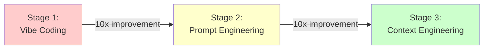
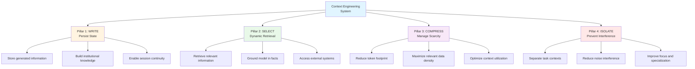
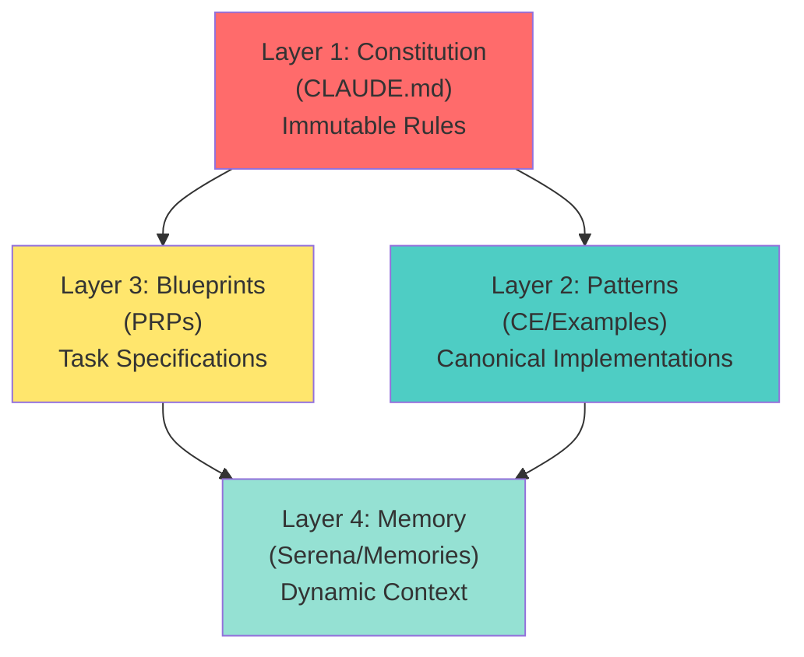
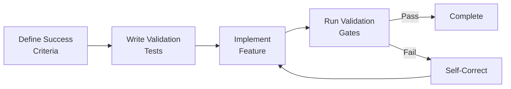
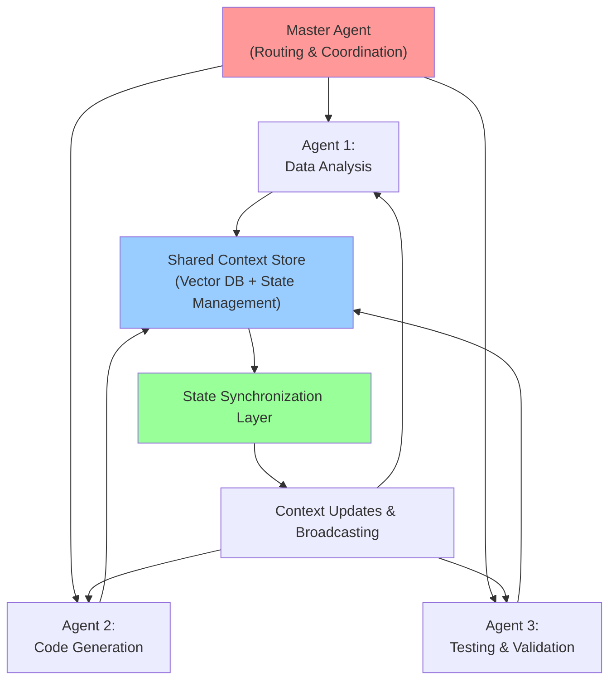
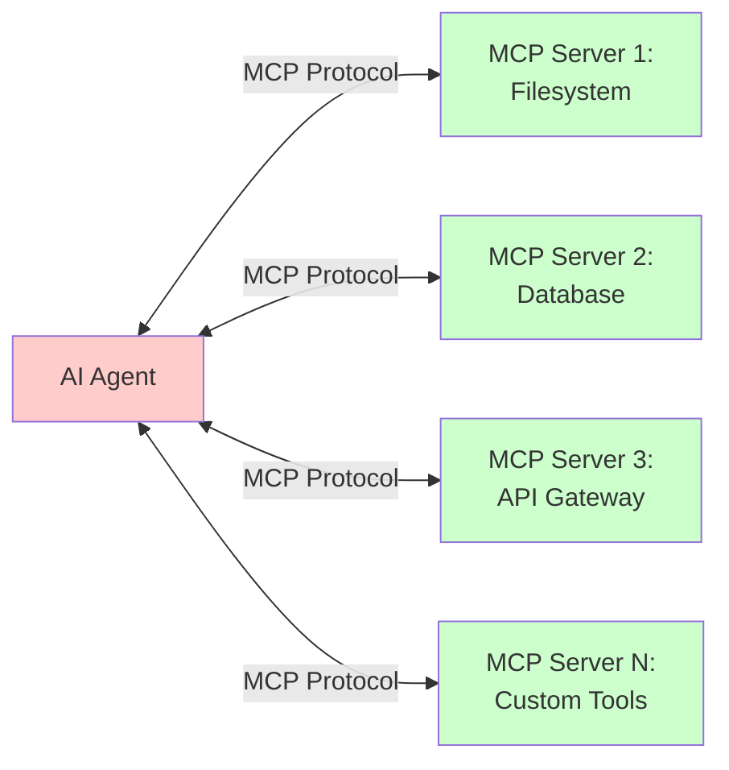
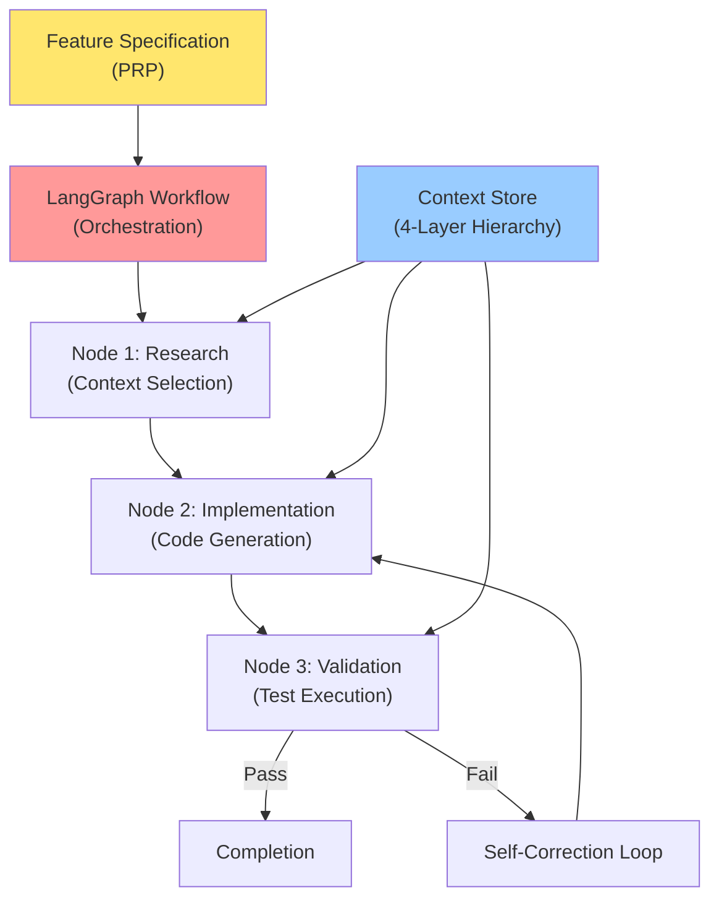
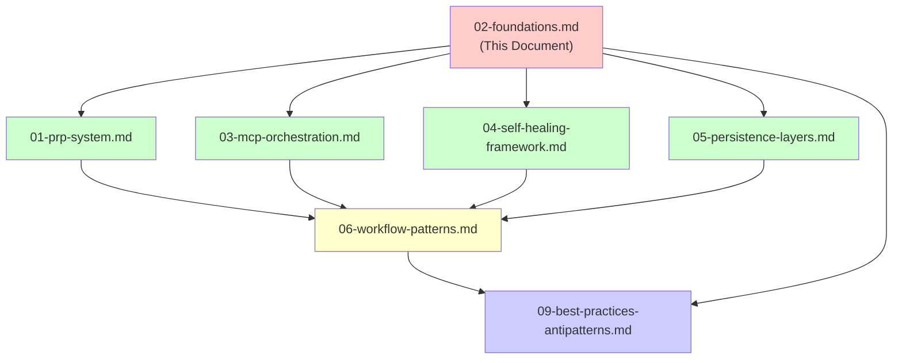

# Context Engineering Foundations

**Version:** 1.0
**Last Updated:** 2025-10-10
**Status:** Active

## Document Overview

This document establishes the theoretical and practical foundations of context engineering as a systematic approach to AI-assisted software development. It defines core principles, architectural patterns, and operational frameworks that enable 10x-100x improvement over traditional prompt-based approaches.

**Target Audience:** Engineers, architects, and technical leaders implementing context engineering systems.

**Scope:** Technology-agnostic foundational concepts applicable across AI models, frameworks, and implementation contexts.

---

## 1. Philosophical Foundation

### 1.1 Mental Model: LLM as Computational Processor

Context engineering reconceptualizes the AI assistant interaction paradigm through a systems architecture lens:

| Component | Traditional View | Context Engineering View |
|-----------|-----------------|--------------------------|
| **AI Model** | Black box intelligence | Specialized processor (CPU) |
| **Context Window** | Input prompt space | Volatile memory (RAM) |
| **Engineer Role** | Prompt writer | Memory architect / OS designer |
| **Success Metric** | Output quality | Memory management efficiency |

**Core Principle:** The engineer's responsibility shifts from crafting persuasive prompts to architecting an "LLM operating system" that systematically manages memory allocation, ensuring the context window contains precisely the information required for each computational step.

### 1.2 Evolution Trajectory

Context engineering represents the third stage in AI-assisted development methodology:



**Stage 1: Vibe Coding**
- **Approach:** Natural language requests without structured guidance
- **Success Rate:** Unpredictable, dependent on model interpretation
- **Characteristics:** Trial and error, frequent corrections, inconsistent output
- **Metaphor:** Hoping the AI "gets it"

**Stage 2: Prompt Engineering**
- **Approach:** Carefully crafted instructions with examples
- **Success Rate:** Improved but still requires significant iteration
- **Characteristics:** Few-shot learning, prompt templates, format instructions
- **Limitation:** Each request requires complete re-specification

**Stage 3: Context Engineering**
- **Approach:** Comprehensive, structured context architecture
- **Success Rate:** Consistently high with autonomous execution capability
- **Characteristics:** Persistent knowledge base, validation frameworks, self-correction
- **Advantage:** System-level thinking replaces request-level thinking

**Performance Metrics:**
- Vibe Coding → Prompt Engineering: **~10x improvement**
- Prompt Engineering → Context Engineering: **~10x improvement**
- Net improvement: **~100x over baseline vibe coding**

### 1.3 Core Principle: Context as Compiler

The foundational insight of context engineering draws a parallel to software compilation:

| Programming Concept | Context Engineering Analogue |
|---------------------|------------------------------|
| **Syntax Error** | Missing context element |
| **Runtime Error** | Hallucination or incorrect output |
| **Compilation Success** | Complete context provision |
| **Executable Program** | Reliable AI execution |

**Key Insight:** Most AI failures are context failures, not model capability failures.

**Operational Definition:**
- **Complete Context** = Reliable, predictable execution
- **Incomplete Context** = Hallucination, errors, or unpredictable behavior
- **Malformed Context** = Contradictory instructions, confusion, failure

This principle shifts debugging focus from "fixing AI output" to "fixing context input," enabling systematic troubleshooting and continuous improvement.

---

## 2. Four Pillars Architecture

Context engineering is built on four foundational pillars that address distinct challenges in AI-assisted development:



### 2.1 Pillar 1: WRITE (Persist State)

**Purpose:** Capture and persist knowledge generated during AI sessions for future reuse.

**Problem Addressed:** Without persistence, every session starts from zero, wasting computational resources and human time on repeated discoveries.

**Implementation Strategies:**

| Strategy | Mechanism | Use Case | Example |
|----------|-----------|----------|---------|
| **Conversation Memory** | Session state checkpointing | Maintain context within single session | Task progress tracking |
| **Long-term Memory** | Vector database storage | Cross-session knowledge retention | User preferences, project patterns |
| **Institutional Knowledge** | Structured documentation | Team-wide knowledge sharing | Design system guidelines |
| **Learning Capture** | Automated insight extraction | Continuous improvement | Common bug fixes, gotchas |

**Benefits:**
- Eliminates redundant work across sessions
- Builds compounding knowledge base
- Enables progressive refinement of patterns

### 2.2 Pillar 2: SELECT (Dynamic Retrieval)

**Purpose:** Fetch the right information at the right time to ground AI responses in factual data.

**Problem Addressed:** Context windows have finite capacity; indiscriminate loading leads to information overload and reduced effectiveness.

**Implementation Strategies:**

| Strategy | Mechanism | Use Case | Example |
|----------|-----------|----------|---------|
| **RAG Retrieval** | Vector similarity search | Knowledge base querying | Documentation lookup |
| **Tool Integration** | Function calling / MCP servers | External system access | File system operations, API calls |
| **Semantic Routing** | Intent classification | Context-aware selection | Choose relevant code examples |
| **Hybrid Search** | Keyword + vector combination | Precise retrieval | Find specific functions or patterns |

**Benefits:**
- Grounds responses in factual information
- Reduces hallucination risk
- Enables access to information beyond training data

### 2.3 Pillar 3: COMPRESS (Manage Scarcity)

**Purpose:** Optimize context window utilization by reducing token footprint while preserving information density.

**Problem Addressed:** Context windows are limited; inefficient usage reduces the amount of relevant information available for decision-making.

**Implementation Strategies:**

| Strategy | Mechanism | Use Case | Example |
|----------|-----------|----------|---------|
| **Summarization** | LLM-powered condensing | History compression | Conversation summary |
| **Prompt Optimization** | Token reduction techniques | Remove redundancy | Eliminate verbose phrasing |
| **Hierarchical Context** | Layered information architecture | Progressive detail loading | Overview → specifics |
| **Selective Loading** | Load only required context | Targeted information provision | Relevant modules only |

**Benefits:**
- Maximizes information density
- Enables inclusion of more relevant context
- Reduces computational costs

### 2.4 Pillar 4: ISOLATE (Prevent Interference)

**Purpose:** Separate contexts to prevent interference and improve focus on specific tasks.

**Problem Addressed:** Mixed contexts create noise, confusion, and reduced effectiveness on specialized tasks.

**Implementation Strategies:**

| Strategy | Mechanism | Use Case | Example |
|----------|-----------|----------|---------|
| **Single-agent Focus** | Continuous context for one task | Specialized deep work | Code generation session |
| **Multi-agent Routing** | Task-specific agents | Parallel specialized processing | Data analysis + code gen |
| **Context Boundaries** | Explicit separation | Prevent cross-contamination | Separate PR contexts |
| **Task Windowing** | Time-boxed contexts | Clear start/end boundaries | Feature implementation scope |

**Benefits:**
- Reduces noise and confusion
- Improves task-specific performance
- Enables parallel specialized processing

### 2.5 Implementation Mapping Table

The following table maps each pillar to concrete implementation techniques:

| Pillar | Technique | Tool/Pattern | Technology Example | Generic Approach |
|--------|-----------|--------------|-------------------|------------------|
| **WRITE** | Conversation Memory | State persistence layer | LangGraph checkpointing | Session state management |
| **WRITE** | Long-term Memory | Vector database | Pinecone, Chroma, Qdrant | Embeddings storage system |
| **SELECT** | RAG Retrieval | Similarity search | Vector DB + embedding model | Semantic document search |
| **SELECT** | Tool Integration | Function calling | MCP servers, OpenAI tools | External system connectors |
| **COMPRESS** | Summarization | LLM processing | GPT-4 summary prompts | Automated condensing |
| **COMPRESS** | Prompt Optimization | Manual review | Token counting tools | Redundancy elimination |
| **ISOLATE** | Single-agent Focus | Continuous context | Extended conversation | Uninterrupted task execution |
| **ISOLATE** | Multi-agent Routing | Workflow orchestration | LangGraph, CrewAI | Task decomposition system |

---

## 3. Context Hierarchy Levels

Context engineering employs a four-layer hierarchy to manage information at different persistence and update frequencies:



### 3.1 Layer 1: Constitution (Project-Wide Rules)

**Purpose:** Immutable project-wide rules, conventions, and standards that govern all development activity.

**Characteristics:**

| Attribute | Value |
|-----------|-------|
| **Persistence** | Permanent (entire project lifecycle) |
| **Update Frequency** | Rare (major project pivots only) |
| **Scope** | All code, all sessions, all agents |
| **Authority Level** | Highest (overrides all other layers) |

**Content Examples:**
- Code structure requirements (file size limits, naming conventions)
- Testing requirements (coverage thresholds, test patterns)
- Style conventions (formatting, documentation standards)
- Technology constraints (approved libraries, frameworks)
- Communication protocols (MCP specifications, API standards)

**Implementation Pattern:**
```
CLAUDE.md or similar project constitution file
Located at repository root
Version controlled
Requires team approval for changes
```

### 3.2 Layer 2: Patterns (Canonical Implementations)

**Purpose:** Reference implementations and design patterns that demonstrate "how we do things here."

**Characteristics:**

| Attribute | Value |
|-----------|-------|
| **Persistence** | Semi-permanent (until better patterns emerge) |
| **Update Frequency** | Occasional (when new patterns established) |
| **Scope** | Project-wide reusable patterns |
| **Authority Level** | High (preferred approaches) |

**Content Examples:**
- Authentication flow implementations
- Database query patterns
- API request/response structures
- Test fixture templates
- Error handling patterns
- UI component examples

**Implementation Pattern:**
```
CE/Examples/ or similar pattern directory
Organized by domain (auth/, database/, api/)
Each pattern includes code + explanation
Referenced in task specifications
```

### 3.3 Layer 3: Blueprints (Task Specifications)

**Purpose:** Detailed implementation specifications for specific features or bug fixes.

**Characteristics:**

| Attribute | Value |
|-----------|-------|
| **Persistence** | Ephemeral (task lifecycle only) |
| **Update Frequency** | Created → Executed → Archived |
| **Scope** | Single feature or bug fix |
| **Authority Level** | Medium (task-specific directives) |

**Content Examples:**
- Feature goals and acceptance criteria
- Implementation context (existing code, constraints)
- Step-by-step implementation plan
- Validation gates and test specifications
- Dependencies and integration points

**Implementation Pattern:**
```
PRPs/ directory with structured templates
YAML frontmatter + markdown body
Numbered validation gates
Archived after completion
```

### 3.4 Layer 4: Memory (Dynamic Context)

**Purpose:** Short-term context for current work, including session learnings and checkpoints.

**Characteristics:**

| Attribute | Value |
|-----------|-------|
| **Persistence** | Temporary (pruned by age/relevance) |
| **Update Frequency** | Continuous (every session) |
| **Scope** | Current and recent sessions |
| **Authority Level** | Low (informational, not prescriptive) |

**Content Examples:**
- Architecture decisions made in recent sessions
- Bug fixes and workarounds discovered
- Session checkpoints and progress tracking
- Temporary notes and reminders
- Recent learnings and insights

**Implementation Pattern:**
```
.serena/memories/ or similar memory directory
Timestamped files
Automatic pruning (age-based, relevance-based)
Searchable via vector embeddings
```

### 3.5 Hierarchy Interaction Patterns

The layers interact with defined precedence and information flow:

| Interaction | Behavior | Example |
|-------------|----------|---------|
| **Constitution → Patterns** | Rules constrain implementations | Max file size enforced in examples |
| **Constitution → Blueprints** | Rules validated in specifications | Testing requirements in PRPs |
| **Patterns → Blueprints** | Examples referenced in plans | "Use auth pattern from CE/Examples" |
| **Blueprints → Memory** | Execution captured as learnings | "PRP-015 revealed DB optimization" |
| **Memory → Patterns** | Repeated learnings promoted | Bug fix becomes canonical pattern |
| **Conflict Resolution** | Higher layer wins | Constitution overrides all others |

---

## 4. Best Practices

### 4.1 RAG-First Strategy

**Principle:** Prefer retrieval-based context provision over model fine-tuning.

**Rationale:**

| Aspect | RAG Approach | Fine-tuning Approach |
|--------|--------------|---------------------|
| **Cost Model** | OpEx (per-query retrieval) | CapEx (upfront training) |
| **Update Speed** | Immediate (add to knowledge base) | Slow (retrain model) |
| **Flexibility** | High (dynamic context) | Low (baked into weights) |
| **Transparency** | High (see what was retrieved) | Low (black box weights) |

**Implementation Guidelines:**
1. Build vector databases for project knowledge
2. Continuously update documentation embeddings
3. Use semantic search for context retrieval
4. Log retrieval effectiveness for optimization
5. Consider fine-tuning only for specialized domains

### 4.2 Explicit and Comprehensive Context

**Principle:** Never assume the model knows project-specific conventions or constraints.

**Implementation Patterns:**

| Context Type | What to Include | Example |
|--------------|-----------------|---------|
| **Schemas** | Complete data structures with types | Database models, API contracts |
| **Patterns** | Canonical implementations | "Always use X pattern for Y scenario" |
| **Constraints** | Technical and business limitations | "API rate limit: 100 req/min" |
| **Gotchas** | Common mistakes and edge cases | "Field Z must be validated before..." |
| **Examples** | Reference implementations | Working code samples |

**Checklist for Comprehensive Context:**
- [ ] All relevant schemas and data structures defined
- [ ] Project conventions explicitly stated
- [ ] Common mistakes documented in "gotchas" section
- [ ] Success criteria clearly specified
- [ ] Dependencies and prerequisites identified
- [ ] Validation requirements enumerated

### 4.3 Validation-First Design

**Principle:** Define success criteria as executable tests before implementation begins.

**Implementation Approach:**



**Validation Gate Structure:**

| Gate Type | Purpose | Implementation | Example |
|-----------|---------|----------------|---------|
| **Unit Tests** | Verify component behavior | Automated test suite | Function correctness |
| **Integration Tests** | Verify system interactions | API/DB test scenarios | End-to-end flow |
| **Acceptance Tests** | Verify business requirements | Scenario validation | User story completion |
| **Quality Gates** | Verify code standards | Linters, formatters | Style compliance |

**Benefits:**
- Enables autonomous self-correction through feedback loops
- Provides objective success measurement
- Prevents compounding errors
- Builds trust in AI-generated code

### 4.4 Incremental Complexity

**Principle:** Start with minimal viable implementation, validate each component before adding features.

**Progressive Implementation Pattern:**

```
Phase 1: Core Functionality
├── Implement minimal feature set
├── Validate core behavior
└── Checkpoint success

Phase 2: Edge Cases
├── Add error handling
├── Validate failure scenarios
└── Checkpoint success

Phase 3: Optimization
├── Improve performance
├── Validate efficiency gains
└── Checkpoint success

Phase 4: Polish
├── Add convenience features
├── Validate user experience
└── Final validation
```

**Anti-Pattern to Avoid:**
- Attempting complete implementation in single step
- Adding features before core validation
- Skipping intermediate validation gates

**Benefits:**
- Prevents compounding errors
- Enables early detection of architectural issues
- Provides frequent validation feedback
- Builds confidence through incremental success

### 4.5 Context Hierarchy Utilization

**Principle:** Organize context across hierarchy layers to enable scaling to large projects.

**Implementation Strategy:**

| Project Size | Recommended Hierarchy | Rationale |
|--------------|----------------------|-----------|
| **Small (<10k LOC)** | Constitution + Memory | Minimal overhead, direct approach |
| **Medium (10k-100k LOC)** | Constitution + Patterns + Memory | Reusable patterns reduce redundancy |
| **Large (>100k LOC)** | All 4 layers | Full hierarchy essential for consistency |

**Scaling Guidelines:**
1. Start with Constitution only (small projects)
2. Add Patterns when repetition emerges (medium projects)
3. Add Blueprints for complex features (any size)
4. Use Memory consistently across all project sizes

### 4.6 Continuous Context Updates

**Principle:** Treat every code modification as a mini-blueprint, always referencing existing patterns.

**Update Workflow:**

```
Modification Request
    ↓
Review Constitution (Layer 1)
    ↓
Check Patterns (Layer 2)
    ↓
Reference Recent Memory (Layer 4)
    ↓
Apply Changes Consistently
    ↓
Update Memory with Learnings
```

**Consistency Checklist:**
- [ ] Change aligns with project constitution
- [ ] Pattern references included where applicable
- [ ] Similar code elsewhere identified and updated
- [ ] Memory updated with new learnings
- [ ] Validation gates executed

---

## 5. Anti-Patterns

### 5.1 Context Dumping

**Definition:** Providing excessive, unfocused information that overwhelms the AI with irrelevant details.

**Symptoms:**
- Including entire codebase in context
- Providing documentation without filtering
- Loading all possible information "just in case"
- Failure to prioritize relevance

**Consequences:**
- Reduced effectiveness due to noise
- Important information buried in irrelevant data
- Wasted context window capacity
- Increased latency and cost

**Solution:**
- Curate only decision-relevant context
- Use semantic search to filter information
- Prioritize recent and relevant over comprehensive
- Apply the "need to know" principle

**Example:**

| Anti-Pattern | Better Approach |
|--------------|-----------------|
| Load entire 50-file module | Load specific 3 files relevant to task |
| Include full API documentation | Extract relevant endpoints only |
| Provide complete git history | Show recent related commits |

### 5.2 Trust Fall Execution

**Definition:** Executing AI-generated plans without human validation, blindly accepting architectural decisions.

**Symptoms:**
- Skipping review of generated code
- Executing multi-step plans without checkpoints
- Accepting first solution without evaluation
- No validation gate review

**Consequences:**
- Architectural mistakes compounded
- Suboptimal solutions implemented
- Missed opportunities for improvement
- Loss of learning opportunity

**Solution:**
- Always perform validation checkpoint at key milestones
- Review architectural decisions before implementation
- Validate each step in multi-step plans
- Maintain human oversight on critical decisions

**Checkpoint Strategy:**

| Checkpoint Type | When to Apply | What to Validate |
|-----------------|---------------|------------------|
| **Architecture Review** | Before implementation starts | Overall approach soundness |
| **Step Validation** | After each major step | Correctness and quality |
| **Integration Check** | Before merging | System-wide consistency |
| **Final Review** | Before deployment | Complete requirements met |

### 5.3 Vague Brain Dump

**Definition:** Providing one-line feature descriptions without examples, constraints, or sufficient context.

**Symptoms:**
- "Add login feature" without specifying authentication method
- "Improve performance" without metrics or targets
- "Fix bug" without reproduction steps
- Missing acceptance criteria

**Consequences:**
- Multiple correction iterations required
- Implementation misaligned with expectations
- Wasted time on wrong approach
- Frustration and reduced trust

**Solution:**
- Obsessive specificity in initial specifications
- Include examples of desired behavior
- Specify constraints and requirements
- Define measurable success criteria

**Specification Quality Comparison:**

| Vague | Specific |
|-------|----------|
| "Add login" | "Implement JWT-based authentication with refresh tokens, 15-minute expiry, stored in httpOnly cookies, following example in CE/Examples/auth-pattern.md" |
| "Improve speed" | "Reduce API response time from 500ms to <200ms for /users endpoint, measured via p95 latency" |
| "Fix bug" | "Fix bug where form submission fails when username contains spaces; repro: enter 'John Doe' in login form, expected: success, actual: error" |

### 5.4 Context-Free Updates

**Definition:** Modifying features without referencing existing code, breaking design system consistency.

**Symptoms:**
- Changes that ignore established patterns
- Inconsistent naming or structure
- Duplicate functionality created
- Breaking changes to interfaces

**Consequences:**
- Inconsistent codebase
- Technical debt accumulation
- Integration breakage
- Maintenance burden increase

**Solution:**
- Always reference design system and relevant component files
- Check for existing implementations before creating new ones
- Validate consistency with project patterns
- Use pattern library as source of truth

**Context Reference Checklist:**
- [ ] Reviewed relevant existing implementations
- [ ] Checked design system for applicable patterns
- [ ] Identified similar code elsewhere in codebase
- [ ] Validated naming consistency
- [ ] Confirmed interface compatibility

### 5.5 Inconsistent Guidance

**Definition:** Conflicting rules across documentation, misaligned patterns and standards.

**Symptoms:**
- Different documents specify contradictory approaches
- Patterns don't align with constitution
- Recent updates override established rules without documentation
- No clear precedence hierarchy

**Consequences:**
- Confusion about correct approach
- Inconsistent implementation across codebase
- Time wasted resolving contradictions
- Erosion of trust in documentation

**Solution:**
- Establish single source of truth (Constitution)
- Define clear precedence hierarchy
- Regular documentation audits for consistency
- Update all affected documents when rules change

**Consistency Maintenance:**

| Practice | Implementation | Frequency |
|----------|----------------|-----------|
| **Documentation Audit** | Review all docs for conflicts | Quarterly |
| **Precedence Validation** | Ensure hierarchy respected | Per update |
| **Change Propagation** | Update all affected documents | Immediate |
| **Team Alignment** | Review and approval process | Per major change |

---

## 6. Performance Characteristics

### 6.1 Measurable Success Metrics

Context engineering delivers quantifiable improvements across multiple dimensions:

| Metric Category | Measurement | Improvement Target |
|-----------------|-------------|-------------------|
| **Iteration Efficiency** | Number of correction cycles per feature | 50-80% reduction |
| **Code Quality** | Pattern adherence rate | 90%+ consistency |
| **Implementation Speed** | Time from specification to working code | 10-100x faster |
| **Architecture Alignment** | Conformance to project standards | 95%+ compliance |
| **Developer Satisfaction** | Reduction in frustration and rework | Qualitative improvement |

### 6.2 Real-World Impact Evidence

Documented case studies demonstrate significant performance gains:

**Case Study 1: Klarna**
- **Context:** Customer service automation
- **Result:** 25% of customer service workload automated
- **Method:** Context-rich AI agent deployment
- **Impact:** Equivalent to 700 full-time agents

**Case Study 2: GitLab**
- **Context:** Development workflow acceleration
- **Result:** 25% faster iteration cycles
- **Method:** AI Duo with comprehensive codebase context
- **Impact:** Measurable velocity increase across engineering org

**Case Study 3: IBM Research**
- **Context:** AI coding assistant evaluation
- **Result:** Performance boost from 26.7% to 43.3% (62% relative improvement)
- **Method:** Enhanced context tools and structured prompts
- **Impact:** Demonstrated that context quality directly correlates with output quality

### 6.3 Cost-Benefit Analysis

**Initial Investment:**

| Activity | Time Investment | One-Time Cost |
|----------|----------------|---------------|
| **Template Setup** | 2-4 hours | Context framework initialization |
| **Constitution Creation** | 4-8 hours | Project-wide rules definition |
| **Pattern Library** | 1-2 hours per pattern | Reusable implementation examples |
| **Tool Integration** | 2-6 hours | MCP servers, RAG setup |

**Ongoing Returns:**

| Benefit | Value Calculation | Example |
|---------|------------------|---------|
| **Time Savings** | (Manual time - AI time) × frequency | 8 hours → 30 min per feature |
| **Quality Improvement** | Reduced bug count × fix time | 50% fewer defects |
| **Knowledge Retention** | Onboarding time reduction | 2 weeks → 3 days for new developers |
| **Consistency Gains** | Code review time reduction | 30% faster reviews |

**ROI Example: PRP Taskmaster**
- **Manual Implementation:** 40+ hours (design + code + test)
- **Context Engineering Approach:** 25 minutes execution time
- **Value Equivalence:** $5,000+ (assuming $125/hour developer rate)
- **ROI:** 96x return on 4-hour setup investment

**Break-Even Analysis:**
- Context engineering overhead pays for itself after 2-3 complex features
- Subsequent features realize full benefits
- Compounding returns as knowledge base grows

---

## 7. Multi-Agent Architecture

### 7.1 Agent Coordination Patterns

Context engineering supports both single-agent and multi-agent architectures, each with distinct trade-offs:



### 7.2 Single vs Multi-Agent Trade-Offs

| Dimension | Single Agent | Multi-Agent |
|-----------|--------------|-------------|
| **Context Continuity** | High (uninterrupted) | Medium (requires synchronization) |
| **Specialization** | Limited (generalist approach) | High (expert agents per domain) |
| **Overhead** | Low (no coordination needed) | Medium-High (sync complexity) |
| **Debugging** | Simple (linear execution) | Complex (distributed tracing) |
| **Parallelization** | None (sequential) | High (concurrent execution) |
| **Use Case Fit** | Straightforward tasks, rapid iteration | Complex workflows, specialized domains |

### 7.3 Multi-Agent Context Synchronization Challenges

**Challenge 1: State Consistency**
- **Problem:** Agents may have divergent views of project state
- **Solution:** Centralized state management with event-driven updates
- **Implementation:** LangGraph state management, shared context store

**Challenge 2: Context Redundancy**
- **Problem:** Multiple agents loading overlapping context wastes resources
- **Solution:** Shared context layer with lazy loading
- **Implementation:** Reference-based context sharing, deduplication

**Challenge 3: Coordination Overhead**
- **Problem:** Inter-agent communication adds latency
- **Solution:** Minimize coordination points, use asynchronous updates
- **Implementation:** Event buses, message queues

**Challenge 4: Conflict Resolution**
- **Problem:** Agents may propose contradictory changes
- **Solution:** Master agent validation layer, conflict detection
- **Implementation:** Merge strategies, precedence rules

### 7.4 Decision Framework: When to Use Multi-Agent

**Use Single Agent When:**
- Task is straightforward and bounded
- Context continuity is critical
- Rapid iteration is priority
- Team is still learning context engineering
- Coordination overhead > specialization benefit

**Use Multi-Agent When:**
- Task requires distinct specialized skills (e.g., data analysis + code generation)
- Subtasks can execute in parallel
- Isolation benefits outweigh synchronization costs
- Scale requires horizontal distribution
- Domain expertise justifies specialization

**Best Practice:** Start with single-agent approach, split only when specialization provides clear benefit. Most tasks benefit more from continuous context than from agent specialization.

### 7.5 Implementation Patterns

**Pattern 1: Sequential Handoff**
```
Agent 1 (Analysis) → Complete Analysis
    ↓
Agent 2 (Implementation) → Generate Code
    ↓
Agent 3 (Testing) → Validate & Report
```
- **Use Case:** Pipeline workflows with clear stage boundaries
- **Synchronization:** Explicit handoff with complete context transfer

**Pattern 2: Parallel Execution with Merge**
```
Agent 1 (Frontend) ──┐
Agent 2 (Backend) ───┼──→ Merge Agent → Integration
Agent 3 (Database) ──┘
```
- **Use Case:** Independent modules developed concurrently
- **Synchronization:** Shared context store, merge coordination

**Pattern 3: Hub-and-Spoke**
```
              Master Agent
                   |
        ┌──────────┼──────────┐
        ↓          ↓          ↓
    Specialist  Specialist  Specialist
      Agent 1    Agent 2    Agent 3
```
- **Use Case:** Master coordinates, specialists handle domains
- **Synchronization:** Master maintains authoritative state

---

## 8. Integration Ecosystem

### 8.1 Model Context Protocol (MCP)

**Purpose:** Standardized protocol for context request/response between AI agents and external systems.

**Architecture:**



**Key Capabilities:**

| Capability | Description | Benefit |
|------------|-------------|---------|
| **Standardization** | Common protocol across tools | Interoperability |
| **Agent-to-Agent Communication** | Structured context exchange | Multi-agent coordination |
| **Tool Marketplace** | Pluggable context providers | Extensibility |
| **Context-as-a-Service** | On-demand context retrieval | Scalability |

**MCP Server Types:**

| Server Type | Purpose | Example Use Cases |
|-------------|---------|-------------------|
| **Data Access** | Query databases, APIs | Retrieve user data, fetch configuration |
| **Filesystem** | Read/write files | Code analysis, document generation |
| **Computation** | Execute functions | Run tests, compile code |
| **External Services** | Third-party integration | GitHub API, Jira, Slack |
| **Memory** | Vector database access | RAG retrieval, semantic search |

### 8.2 Agentic Workflow Orchestration

**Framework Examples:**

| Framework | Specialization | Key Features |
|-----------|---------------|--------------|
| **LangGraph** | Stateful workflows | Graph-based execution, checkpointing, state management |
| **CrewAI** | Role-based agents | Agent crews, task delegation, collaboration |
| **AutoGPT** | Autonomous agents | Goal-driven, self-directed planning |
| **BabyAGI** | Task decomposition | Recursive task breakdown, priority queues |

**Integration Pattern: LangGraph + Context Engineering**



**Workflow State Management:**
- **Checkpointing:** Save state at each node for resume/replay
- **State Updates:** Track changes across workflow execution
- **Context Injection:** Load relevant context per node
- **Validation Gates:** Enforce quality at stage boundaries

### 8.3 CI/CD Pipeline Integration

**Purpose:** Enable headless execution of context engineering workflows in automated pipelines.

**Integration Architecture:**

```
Code Commit
    ↓
CI Trigger
    ↓
Context Engineering Agent
    ↓
├── Load Constitution (Layer 1)
├── Retrieve Patterns (Layer 2)
├── Load Feature PRP (Layer 3)
└── Access Recent Memory (Layer 4)
    ↓
Execute Implementation
    ↓
Run Validation Gates
    ↓
├── Unit Tests
├── Integration Tests
├── Quality Gates (linting, formatting)
└── Acceptance Tests
    ↓
Generate Report (Stream-JSON)
    ↓
├── Success → Auto-merge PR
└── Failure → Comment with diagnostics
```

**Automation Capabilities:**

| Capability | Implementation | Benefit |
|------------|----------------|---------|
| **Auto-PR Generation** | Agent creates pull request with implementation | Reduces manual work |
| **Validation Reports** | Structured JSON output for CI parsing | Clear pass/fail signals |
| **Self-Correction** | Retry with feedback on validation failure | Autonomous quality improvement |
| **Monitoring** | Stream execution logs for observability | Debugging and transparency |

**Example CI Configuration:**

```yaml
# Conceptual CI/CD integration (technology-agnostic)
workflow:
  - name: Context Engineering Implementation
    trigger: PR labeled "auto-implement"
    steps:
      - Load context hierarchy
      - Execute PRP via agent
      - Run validation gates
      - Report results
      - Auto-merge if all gates pass
```

---

## 9. Cross-References

This document establishes foundational concepts referenced throughout the documentation suite:

### 9.1 Related Documents

| Document | Relationship | Key Connections |
|----------|--------------|-----------------|
| **01-prp-system.md** | Implementation methodology | PRPs as Layer 3 in context hierarchy |
| **03-mcp-orchestration.md** | Integration protocol | MCP as SELECT pillar implementation |
| **04-self-healing-framework.md** | Error recovery | Validation-first design, feedback loops |
| **05-persistence-layers.md** | Storage architecture | Detailed implementation of 4-layer hierarchy |
| **06-workflow-patterns.md** | Operational procedures | Continuous context updates in practice |
| **09-best-practices-antipatterns.md** | Practical guidance | Expanded best practices and anti-patterns |

### 9.2 Concept Dependencies



### 9.3 Key Terms Defined

This document defines foundational terminology used throughout the documentation:

| Term | Definition | First Introduced |
|------|------------|------------------|
| **Context Engineering** | Systematic approach to managing AI context for autonomous execution | Section 1.1 |
| **Four Pillars** | Write, Select, Compress, Isolate - foundational architecture | Section 2 |
| **Context Hierarchy** | 4-layer system: Constitution, Patterns, Blueprints, Memory | Section 3 |
| **RAG-First Strategy** | Preference for retrieval over fine-tuning | Section 4.1 |
| **Validation-First Design** | Define success criteria before implementation | Section 4.3 |
| **Context Dumping** | Anti-pattern of excessive unfocused information | Section 5.1 |
| **Trust Fall Execution** | Anti-pattern of blind acceptance without validation | Section 5.2 |

---

## Document Change History

| Version | Date | Changes | Author |
|---------|------|---------|--------|
| 1.0 | 2025-10-10 | Initial comprehensive document | Context Engineering Team |

---

**End of Document**
