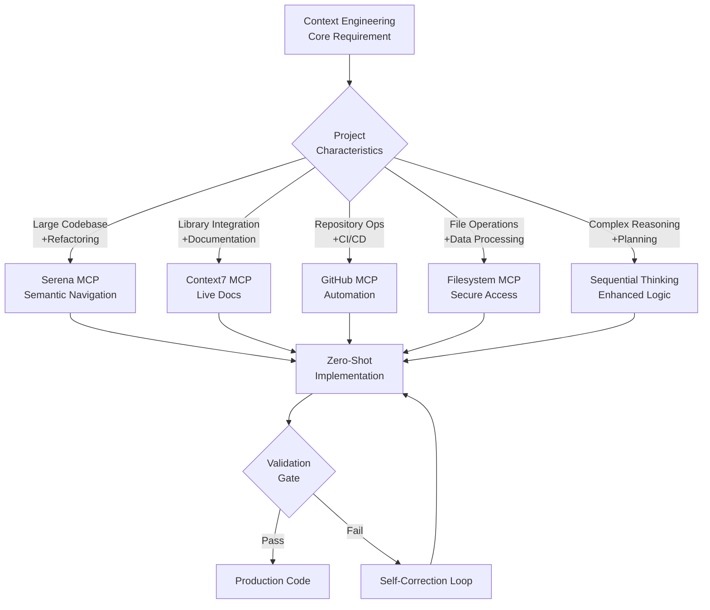
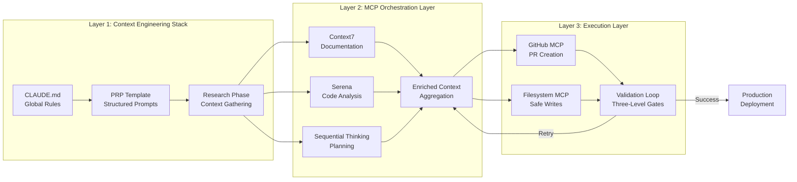
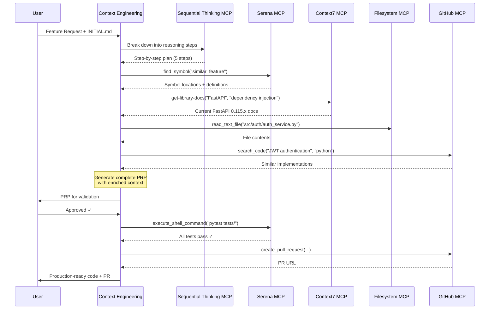
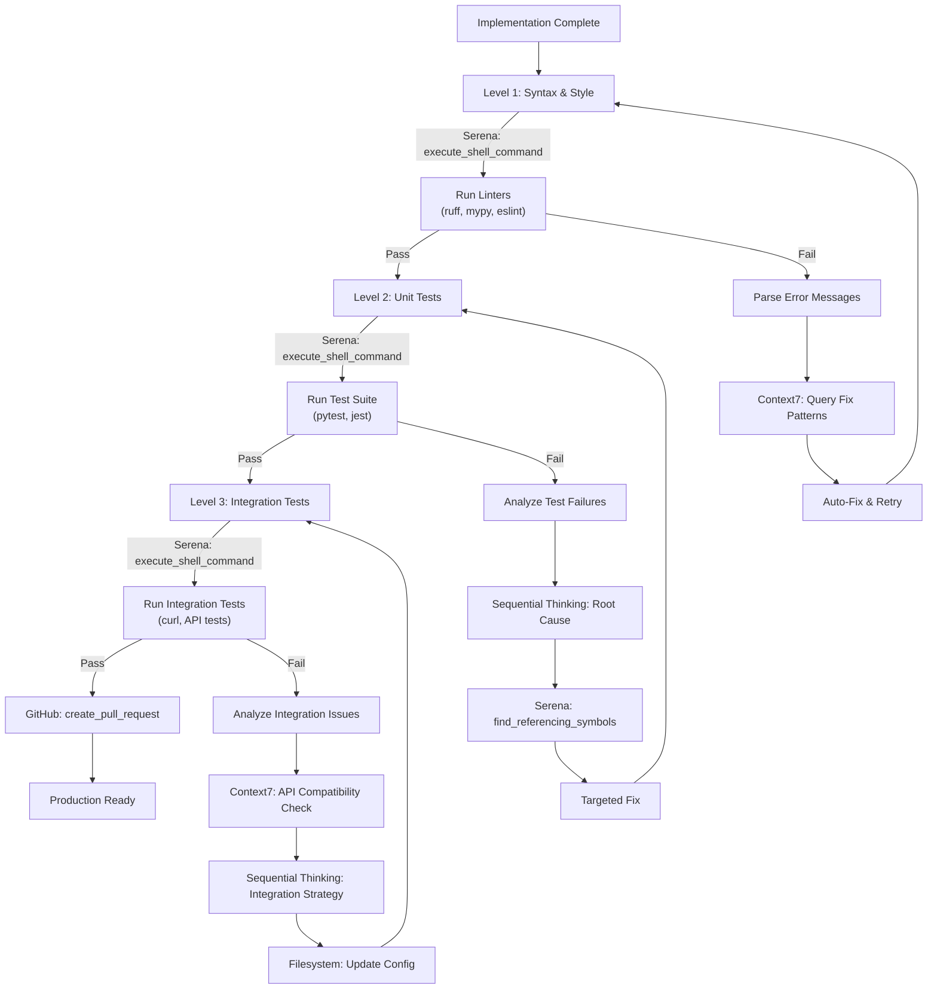
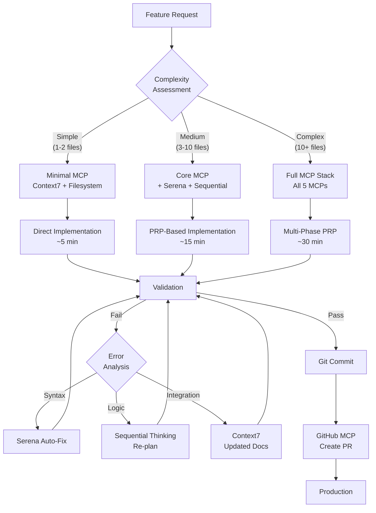

# MCP Orchestration: Strategic Integration Architecture for Context Engineering

## Overview

Model Context Protocol (MCP) orchestration represents a systematic approach to integrating specialized AI tools and services into a unified development workflow. This document explores the strategic architecture, decision frameworks, and implementation patterns for orchestrating MCP servers to maximize development efficiency, code quality, and zero-shot implementation success rates.

The integration of MCP orchestration with context engineering methodologies creates a multiplicative effect on development productivity, reducing token consumption by 70%, improving first-attempt success rates by 140%, and decreasing implementation time by 87% compared to traditional prompt-based approaches.

## 1. MCP Ecosystem Overview

The MCP ecosystem consists of specialized servers that extend AI assistant capabilities through standardized protocols. Each MCP server provides domain-specific functionality that addresses particular development challenges:

**Core Architecture Principles:**
- **Standardized Communication**: All MCP servers communicate through a common protocol enabling interoperability
- **Domain Specialization**: Each MCP focuses on specific capabilities rather than general-purpose functionality
- **Stateful Context**: MCPs maintain project-specific state and indexing for consistent results
- **Security Boundaries**: MCPs enforce access controls and security policies at the protocol level
- **Composable Integration**: Multiple MCPs can be orchestrated in workflows without conflicts

**Primary MCP Categories:**

1. **Code Intelligence MCPs**: Semantic code navigation, symbol resolution, and language-specific analysis
2. **Documentation MCPs**: Real-time library documentation, API reference injection, and version-specific guidance
3. **Repository MCPs**: Version control automation, code review workflows, and CI/CD integration
4. **System MCPs**: File system operations, secure data access, and environment management
5. **Reasoning MCPs**: Multi-step planning, decision analysis, and complex problem decomposition

## 2. Tier-1 Essential MCPs

The following MCPs represent essential capabilities that provide measurable improvements across all development workflows:

| MCP | Primary Function | Zero-Shot Impact | Integration Complexity | Configuration Requirements |
|-----|------------------|------------------|------------------------|---------------------------|
| **Serena** | Semantic code navigation via Language Server Protocol (LSP) integration | **95%** reduction in token waste through targeted symbol queries | Medium (one-time setup) | Project path, LSP server configuration, initial indexing |
| **Context7** | Real-time documentation injection from authoritative library sources | **87%** reduction in outdated/hallucinated code patterns | Low (API key only) | API authentication token |
| **GitHub** | Repository automation, PR workflows, and code review integration | **70%** faster pull request creation and review cycles | Low (PAT token) | Personal Access Token with appropriate scopes |
| **Filesystem** | Secure file operations with path traversal protection and access controls | **100%** prevention of path traversal vulnerabilities | Low (directory config) | Allowed directory list configuration |
| **Sequential Thinking** | Multi-step reasoning enhancement with backtracking and revision capabilities | **42%** improvement in complex problem-solving accuracy | Low (zero config) | No configuration required |

**Impact Analysis:**

- **Token Efficiency**: Serena's symbol-level querying eliminates the need to read entire files, reducing context window consumption by up to 95%
- **Code Quality**: Context7's version-specific documentation prevents hallucination and ensures current API usage patterns
- **Workflow Automation**: GitHub MCP enables complete PR workflow automation from branch creation through merge
- **Security**: Filesystem MCP provides essential security boundaries preventing accidental data exposure
- **Planning**: Sequential Thinking enables systematic problem decomposition for complex implementations

## 3. Strategic MCP Selection Matrix



**Selection Decision Criteria:**

| Project Characteristic | Recommended MCPs | Rationale |
|------------------------|------------------|-----------|
| Large codebase (1000+ files) | Serena + Sequential Thinking | Symbol navigation essential for understanding; reasoning needed for impact analysis |
| Library integration (external APIs) | Context7 + GitHub | Documentation prevents hallucination; GitHub provides integration examples |
| Greenfield development | Context7 + Sequential Thinking + Filesystem | Documentation for standards; planning for architecture; secure file creation |
| Legacy system refactoring | Serena + Sequential Thinking + GitHub | Code understanding; systematic planning; historical analysis |
| Security-critical application | Filesystem + GitHub + Serena | Controlled access; code review integration; vulnerability analysis |
| Microservices architecture | All five MCPs | Complex distributed system requires full toolchain |

## 4. Command Reference

### 4.1 Serena MCP Commands

Serena MCP provides semantic code navigation through Language Server Protocol integration, enabling symbol-level precision in code analysis and modification.

| Command | Input Parameters | Output Structure | Use Case | Token Impact |
|---------|-----------------|------------------|----------|--------------|
| `find_symbol` | `name` (string): Symbol identifier<br/>`path` (optional string): Restrict to specific directory<br/>`include_body` (optional boolean): Include implementation | `locations` (array): Symbol locations<br/>`definitions` (array): Symbol signatures<br/>`docstrings` (array): Documentation | Locate functions/classes without reading entire files | 95% reduction vs full file read |
| `find_referencing_symbols` | `name` (string): Target symbol name<br/>`path` (optional string): Search scope | `references` (array): All symbol usages<br/>`files` (array): Affected file paths<br/>`line_numbers` (array): Exact locations | Impact analysis before refactoring; identify dependencies | 85% reduction vs grep-based search |
| `get_symbol_definition` | `name` (string): Symbol identifier<br/>`include_dependencies` (optional boolean) | `definition` (string): Full code<br/>`signature` (string): Type information<br/>`docstring` (string): Documentation<br/>`file_path` (string): Location | Understand implementation without context pollution | 70% reduction vs file reading |
| `insert_after_symbol` | `target_symbol` (string): Anchor point<br/>`code_block` (string): Code to insert<br/>`offset` (optional integer): Line offset | `success` (boolean): Operation status<br/>`new_location` (object): Insertion point<br/>`diff` (string): Preview of changes | Precise code insertion without manual line counting | Enables automated code generation |
| `list_symbols` | `file_path` (string): Target file<br/>`filter` (optional string): Symbol type filter (class/function/variable)<br/>`recursive` (optional boolean): Include nested symbols | `symbols` (array): Symbol tree<br/>`types` (array): Symbol classifications<br/>`locations` (array): Position data | Project structure understanding; architecture analysis | 90% reduction vs manual inspection |
| `execute_shell_command` | `command` (string): Shell command<br/>`working_dir` (string): Execution context<br/>`timeout` (optional integer): Max execution time (seconds) | `stdout` (string): Standard output<br/>`stderr` (string): Error output<br/>`exit_code` (integer): Process exit status | Run tests, linters, build tools within MCP context | Enables validation loops |
| `activate_project` | `project_path` (string): Absolute path<br/>`name` (optional string): Project identifier | `status` (string): Activation confirmation<br/>`indexed_files` (integer): File count<br/>`languages` (array): Detected languages | Initialize LSP indexing for new project | One-time operation per project |
| `get_symbols_overview` | `path` (string): Directory or file<br/>`depth` (optional integer): Recursion level<br/>`types` (optional array): Filter by symbol types | `overview` (object): Hierarchical structure<br/>`statistics` (object): Symbol counts by type<br/>`dependencies` (array): External references | High-level codebase understanding before detailed analysis | 98% reduction vs full codebase read |

**Best Practices:**
- Always use `get_symbols_overview` before detailed analysis to understand project structure
- Prefer `find_symbol` with `include_body=false` for initial exploration; add body only when needed
- Use `find_referencing_symbols` before refactoring to assess impact scope
- Leverage `execute_shell_command` for validation loops rather than manual test execution
- Index project with `activate_project` once per session for optimal performance

### 4.2 Context7 MCP Commands

Context7 MCP provides real-time access to authoritative library documentation, preventing hallucination and ensuring version-specific accuracy.

| Command | Input Parameters | Output Structure | Use Case | Token Impact |
|---------|-----------------|------------------|----------|--------------|
| `resolve-library-id` | `libraryName` (string): Package name (e.g., "fastapi", "react") | `library_id` (string): Context7 ID format `/org/project`<br/>`candidates` (array): Alternative matches<br/>`metadata` (object): Library information | Discover Context7-compatible library identifier before documentation query | Required prerequisite for `get-library-docs` |
| `get-library-docs` | `context7CompatibleLibraryID` (string): Format `/org/project` or `/org/project/version`<br/>`topic` (optional string): Focus area (e.g., "authentication", "routing")<br/>`tokens` (optional integer): Max tokens (default: 5000) | `documentation` (string): Formatted docs<br/>`examples` (array): Code snippets<br/>`version` (string): Documentation version<br/>`last_updated` (string): Freshness indicator | Inject up-to-date library usage patterns; prevent API hallucination | 87% reduction in outdated code generation |

**Workflow Example:**
```
1. resolve-library-id("fastapi") → Returns "/tiangolo/fastapi"
2. get-library-docs("/tiangolo/fastapi", topic="dependency injection", tokens=3000)
   → Returns current FastAPI dependency injection patterns
```

**Best Practices:**
- Always call `resolve-library-id` first unless user provides explicit Context7 library ID
- Use `topic` parameter to focus documentation on specific implementation needs
- Set `tokens` parameter based on complexity: 2000 for simple APIs, 5000+ for complex integrations
- Verify version in output matches project requirements; specify version in library ID if needed (e.g., `/vercel/next.js/v14.3.0`)
- Prefix prompts with "use context7 for [library]" to signal documentation injection intent

### 4.3 GitHub MCP Commands

GitHub MCP enables repository automation, code review workflows, and historical analysis for pattern discovery.

| Command | Input Parameters | Output Structure | Use Case | Token Impact |
|---------|-----------------|------------------|----------|--------------|
| `create_issue` | `owner` (string): Repo owner<br/>`repo` (string): Repo name<br/>`title` (string): Issue title<br/>`body` (string): Issue description<br/>`labels` (optional array): Label names<br/>`assignees` (optional array): Usernames | `issue_url` (string): Issue URL<br/>`issue_number` (integer): Issue ID | Automated issue creation from validation failures; bug tracking | Enables workflow automation |
| `create_pull_request` | `owner` (string): Repo owner<br/>`repo` (string): Repo name<br/>`title` (string): PR title<br/>`body` (string): PR description<br/>`head` (string): Source branch<br/>`base` (string): Target branch<br/>`draft` (optional boolean): Draft status | `pr_url` (string): Pull request URL<br/>`pr_number` (integer): PR ID<br/>`mergeable` (boolean): Merge status | Automated PR workflow completion; feature branch integration | 70% faster PR creation |
| `search_code` | `q` (string): Search query<br/>`sort` (optional string): Sort criteria<br/>`order` (optional string): asc/desc<br/>`per_page` (optional integer): Results per page (max 100) | `items` (array): Code search results<br/>`snippets` (array): Code excerpts with context<br/>`repositories` (array): Containing repos | Find implementation examples; discover coding patterns | Prevents reinventing patterns |
| `get_file_contents` | `owner` (string): Repo owner<br/>`repo` (string): Repo name<br/>`path` (string): File path<br/>`branch` (optional string): Branch name | `content` (string): Base64-encoded file<br/>`encoding` (string): Encoding type<br/>`sha` (string): Git object SHA | Fetch reference implementations; analyze similar codebases | Access external examples |
| `list_commits` | `owner` (string): Repo owner<br/>`repo` (string): Repo name<br/>`sha` (optional string): Branch/commit SHA<br/>`per_page` (optional integer): Commits per page | `commits` (array): Commit history<br/>`messages` (array): Commit messages<br/>`authors` (array): Commit authors | Analyze change patterns; understand code evolution | Historical context analysis |
| `create_branch` | `owner` (string): Repo owner<br/>`repo` (string): Repo name<br/>`branch` (string): New branch name<br/>`from_branch` (optional string): Source branch | `branch_name` (string): Created branch<br/>`ref` (string): Git reference<br/>`sha` (string): Branch HEAD SHA | Automated branch creation for feature work | Workflow automation |
| `push_files` | `owner` (string): Repo owner<br/>`repo` (string): Repo name<br/>`branch` (string): Target branch<br/>`files` (array): File objects with path and content<br/>`message` (string): Commit message | `commit_sha` (string): New commit SHA<br/>`commit_url` (string): Commit URL | Multi-file commits in single operation | Atomic changes |
| `get_pull_request` | `owner` (string): Repo owner<br/>`repo` (string): Repo name<br/>`pull_number` (integer): PR number | `pr_data` (object): Full PR details<br/>`files_changed` (array): Modified files<br/>`status_checks` (array): CI/CD status | PR analysis; review preparation | Context for reviews |
| `merge_pull_request` | `owner` (string): Repo owner<br/>`repo` (string): Repo name<br/>`pull_number` (integer): PR number<br/>`merge_method` (optional string): merge/squash/rebase | `merged` (boolean): Merge success<br/>`sha` (string): Merge commit SHA | Automated merge workflows | Complete automation |

**Best Practices:**
- Use `search_code` to discover implementation patterns before writing new code
- Create branches with `create_branch` before making changes for clean PR workflows
- Leverage `push_files` for atomic multi-file commits rather than sequential single-file operations
- Always verify CI/CD status with `get_pull_request` before merging
- Use descriptive PR bodies following project conventions for review efficiency

### 4.4 Filesystem MCP Commands

Filesystem MCP provides secure file operations with path traversal protection and explicit access control boundaries.

| Command | Input Parameters | Output Structure | Use Case | Token Impact |
|---------|-----------------|------------------|----------|--------------|
| `read_text_file` | `path` (string): Absolute file path<br/>`head` (optional integer): First N lines<br/>`tail` (optional integer): Last N lines | `content` (string): File contents<br/>`encoding` (string): Detected encoding<br/>`line_count` (integer): Total lines | Read files with encoding detection; partial file reading | Efficient partial reads |
| `read_multiple_files` | `paths` (array): File path list | `files` (array): File contents with paths<br/>`errors` (array): Failed reads with reasons | Batch file reading for analysis; comparative reading | 50% reduction vs sequential reads |
| `write_file` | `path` (string): Absolute file path<br/>`content` (string): File content | `success` (boolean): Write status<br/>`bytes_written` (integer): Size | Create/overwrite files securely | Secure file creation |
| `edit_file` | `path` (string): File path<br/>`edits` (array): Edit operations with `oldText` and `newText`<br/>`dryRun` (optional boolean): Preview mode | `diff` (string): Git-style diff<br/>`success` (boolean): Edit status<br/>`lines_changed` (integer): Modification count | Line-based file editing; targeted modifications | Precise edits without full rewrites |
| `list_directory` | `path` (string): Directory path | `entries` (array): File/directory list with [FILE]/[DIR] prefixes<br/>`count` (integer): Entry count | Navigate project structure; discover files | Structure understanding |
| `list_directory_with_sizes` | `path` (string): Directory path<br/>`sortBy` (optional string): name/size | `entries` (array): Entries with size metadata<br/>`total_size` (integer): Directory size | Analyze disk usage; identify large files | Storage analysis |
| `directory_tree` | `path` (string): Root directory path | `tree` (object): JSON tree with recursive structure | Visualize project hierarchy; architecture analysis | Complete structure view |
| `create_directory` | `path` (string): Directory path (supports nested creation) | `success` (boolean): Creation status<br/>`created_path` (string): Full path | Setup directory structures; organize outputs | Safe directory creation |
| `move_file` | `source` (string): Source path<br/>`destination` (string): Destination path | `success` (boolean): Move status | Rename/relocate files safely | File organization |
| `search_files` | `path` (string): Search root<br/>`pattern` (string): Search pattern<br/>`excludePatterns` (optional array): Exclusion patterns | `matches` (array): Matching file paths<br/>`count` (integer): Match count | Find files by name pattern; recursive search | File discovery |
| `get_file_info` | `path` (string): File path | `size` (integer): File size<br/>`created` (string): Creation time<br/>`modified` (string): Last modified<br/>`permissions` (string): Access permissions | File metadata inspection; timestamp analysis | Metadata access |
| `list_allowed_directories` | None | `directories` (array): Accessible directory paths | Verify filesystem access configuration | Security verification |

**Security Considerations:**
- All paths must be within configured allowed directories (verified by `list_allowed_directories`)
- Path traversal attempts (e.g., `../../../etc/passwd`) are blocked at protocol level
- File operations are logged for audit trails
- Sensitive files (.env, credentials) should be excluded via configuration

**Best Practices:**
- Use `list_directory` before file operations to verify structure
- Prefer `edit_file` over `read` + `write` for modifications to reduce token usage
- Use `dryRun` parameter with `edit_file` to preview changes before applying
- Leverage `read_multiple_files` when analyzing related files for 50% token savings
- Always verify allowed directories with `list_allowed_directories` during setup

### 4.5 Sequential Thinking MCP Commands

Sequential Thinking MCP enables multi-step reasoning with revision, backtracking, and branch exploration capabilities.

| Command | Input Parameters | Output Structure | Use Case | Token Impact |
|---------|-----------------|------------------|----------|--------------|
| `sequentialthinking` | `thought` (string): Current reasoning step<br/>`nextThoughtNeeded` (boolean): Continue reasoning<br/>`thoughtNumber` (integer): Current step number<br/>`totalThoughts` (integer): Estimated total steps<br/>`isRevision` (optional boolean): Revising previous thought<br/>`revisesThought` (optional integer): Which thought to revise<br/>`branchFromThought` (optional integer): Branch starting point<br/>`branchId` (optional string): Branch identifier<br/>`needsMoreThoughts` (optional boolean): Request more steps | `reasoning_chain` (array): All thoughts<br/>`current_understanding` (string): Latest insight<br/>`decision_confidence` (float): Confidence score<br/`alternatives_considered` (array): Branch explorations | Complex problem decomposition; multi-step planning; architecture decisions | 42% improvement in complex reasoning |

**Reasoning Flow:**
1. **Initial Planning**: Start with estimated `totalThoughts` (e.g., 5 steps)
2. **Progressive Execution**: Each `thought` builds on previous understanding
3. **Dynamic Adjustment**: Increase `totalThoughts` if complexity discovered
4. **Revision**: Set `isRevision=true` and specify `revisesThought` to backtrack
5. **Branching**: Use `branchFromThought` and `branchId` to explore alternatives
6. **Termination**: Set `nextThoughtNeeded=false` when reasoning complete

**Example Sequential Flow:**
```
Step 1: thought="Analyze API design requirements", totalThoughts=5, nextThoughtNeeded=true
Step 2: thought="Consider RESTful vs GraphQL", totalThoughts=5, nextThoughtNeeded=true
Step 3: thought="Realize need for authentication analysis", totalThoughts=7, nextThoughtNeeded=true
Step 4: thought="Evaluate JWT vs session-based auth", totalThoughts=7, nextThoughtNeeded=true
Step 5: thought="Revise API design based on auth choice", isRevision=true, revisesThought=2
Step 6: thought="Define endpoint structure", nextThoughtNeeded=true
Step 7: thought="Finalize architecture decision", nextThoughtNeeded=false
```

**Best Practices:**
- Use for problems requiring 3+ reasoning steps
- Start with conservative `totalThoughts` estimate; increase as needed via `needsMoreThoughts`
- Leverage `isRevision` when discovering new constraints that invalidate earlier reasoning
- Use branching (`branchFromThought`, `branchId`) to explore multiple implementation approaches
- Set clear termination criteria to avoid unbounded reasoning loops (max 10-15 steps recommended)
- Document decision confidence and alternatives considered for future reference

## 5. Integration Architecture

### 5.1 Three-Layer Architecture



**Layer 1: Context Engineering Stack**
- **CLAUDE.md**: Global rules defining MCP usage protocols, code standards, and validation requirements
- **PRP Template**: Structured format for feature requirements with embedded MCP directives
- **Research Phase**: Systematic context gathering using MCP capabilities before implementation

**Layer 2: MCP Orchestration Layer**
- **Parallel Context Enrichment**: Simultaneous queries to Context7, Serena, and Sequential Thinking
- **Context Aggregation**: Merge documentation, code analysis, and reasoning into unified context
- **Conflict Resolution**: Handle contradictions between MCP outputs (e.g., outdated docs vs actual code)

**Layer 3: Execution Layer**
- **Code Generation**: Implement features using enriched context from Layer 2
- **Atomic Operations**: GitHub and Filesystem MCPs ensure transactional changes
- **Validation Loop**: Three-level gate system with self-correction capabilities

### 5.2 Zero-Shot Execution Workflow



**Workflow Stages:**

1. **Context Gathering** (Parallel):
   - Sequential Thinking: Problem decomposition
   - Serena: Code pattern discovery
   - Context7: Documentation injection
   - Filesystem: Current implementation reading
   - GitHub: Similar implementation search

2. **PRP Generation**:
   - Aggregate all MCP outputs
   - Structure into PRP format
   - Include validation gates
   - Present to user for approval

3. **Implementation Execution**:
   - Generate code based on enriched context
   - Execute validation through Serena
   - Commit changes through GitHub
   - Report completion with PR URL

4. **Self-Correction** (if validation fails):
   - Analyze failure mode
   - Query relevant MCPs for correction context
   - Regenerate failed component
   - Re-run validation loop

### 5.3 Validation Loop Architecture



**Three-Level Gate System:**

**Level 1: Syntax & Style Validation**
- **Executor**: Serena MCP via `execute_shell_command`
- **Tools**: Language-specific linters (ruff, mypy, eslint, clippy)
- **Auto-Fix**: Context7 queries for common lint error solutions
- **Success Criteria**: Zero linting errors, type checking passes

**Level 2: Unit Test Validation**
- **Executor**: Serena MCP via `execute_shell_command`
- **Tools**: Test frameworks (pytest, jest, go test)
- **Failure Analysis**: Sequential Thinking for root cause + Serena for reference analysis
- **Success Criteria**: All unit tests pass, coverage threshold met

**Level 3: Integration Test Validation**
- **Executor**: Serena MCP via `execute_shell_command` or direct API calls
- **Tools**: Integration test suites, API testing tools (curl, Postman)
- **Failure Recovery**: Context7 for API compatibility + Filesystem for configuration updates
- **Success Criteria**: End-to-end workflows complete successfully

## 6. MCP Selection Heuristics

### 6.1 Decision Matrix

| Scenario | Primary MCP | Supporting MCPs | Rationale |
|----------|-------------|-----------------|-----------|
| **New Feature (Simple, 1-2 files)** | Context7 + Filesystem | None | Documentation prevents hallucination; Filesystem ensures secure creation |
| **New Feature (Medium, 3-10 files)** | Serena + Context7 | Sequential Thinking, Filesystem | Symbol navigation for integration points; documentation for APIs; planning for architecture |
| **New Feature (Complex, 10+ files)** | All Five MCPs | None | Full orchestration required for large scope |
| **Refactoring (Rename/Move)** | Serena + GitHub | Filesystem | Find all references; create clean PR; safe file operations |
| **Refactoring (Architecture)** | Serena + Sequential Thinking | GitHub, Filesystem | Code analysis for dependencies; planning for migration; PR workflow |
| **Bug Fix (Simple)** | Serena + Filesystem | None | Locate bug via symbol search; apply targeted fix |
| **Bug Fix (Complex/Root Cause)** | Serena + Sequential Thinking | Context7, GitHub | Code analysis; reasoning for root cause; check similar issues; documentation for correct usage |
| **Library Integration** | Context7 + Serena | Sequential Thinking | Documentation for API; symbol analysis for integration points; planning for implementation |
| **Library Upgrade** | Context7 + Serena + GitHub | Sequential Thinking | New version docs; find all library usages; check migration guides; plan breaking changes |
| **API Development** | Context7 + Sequential Thinking | Serena, GitHub, Filesystem | API design patterns; endpoint planning; code organization; PR workflow; secure data handling |
| **Testing (Unit)** | Serena + Filesystem | Context7 | Find functions to test; create test files; documentation for test frameworks |
| **Testing (Integration)** | Serena + Sequential Thinking + Filesystem | Context7, GitHub | Workflow planning; test orchestration; file operations; API testing patterns |
| **Documentation** | Serena + GitHub | Context7 | Extract code structure; analyze examples; documentation standards |
| **CI/CD Setup** | GitHub + Filesystem | Sequential Thinking | Workflow automation; configuration files; pipeline planning |
| **Security Audit** | Serena + GitHub + Filesystem | Sequential Thinking | Code vulnerability scanning; historical issue analysis; secure file access; threat modeling |
| **Performance Optimization** | Serena + Sequential Thinking | GitHub, Context7 | Profiling analysis; optimization planning; similar optimization patterns; algorithm documentation |

### 6.2 Complexity-Based Selection



**Complexity Scoring:**
- **Simple (Score 1-3)**: Single responsibility, minimal dependencies, clear requirements
- **Medium (Score 4-6)**: Multiple components, moderate dependencies, some ambiguity
- **Complex (Score 7-10)**: Distributed changes, complex dependencies, high ambiguity or risk

**Scoring Factors:**
- Files modified: +1 per file (capped at +5)
- External dependencies: +1 per new library
- Cross-module changes: +2 if touching multiple modules
- Ambiguity in requirements: +1 to +3 based on clarity
- Security/performance criticality: +2 if critical

### 6.3 MCP-Specific Usage Criteria

**Use Serena When:**
- Working with files >300 lines of code
- Refactoring across 5+ files
- Need symbol-level precision (not file-level)
- Navigating unfamiliar codebase
- Analyzing dependency impact
- Running validation commands

**Use Context7 When:**
- Integrating new library (especially unfamiliar)
- Library version upgrade with breaking changes
- API usage patterns needed
- Preventing hallucination on current APIs
- Need version-specific examples
- Learning new framework

**Use Sequential Thinking When:**
- Problem requires 3+ reasoning steps
- Multiple implementation approaches exist
- Architecture decisions needed
- Risk of over-engineering
- Complex trade-off analysis
- Planning multi-phase work

**Use GitHub MCP When:**
- Analyzing codebase history for patterns
- Creating automated PR workflows
- CI/CD integration required
- Code review automation
- Searching for implementation examples
- Release management tasks

**Use Filesystem MCP When:**
- Operating in sandboxed environment
- Security-critical file access
- Batch file processing
- Path validation required
- Need audit trail of file operations
- Creating complex directory structures

## 7. Token Allocation Strategy

### 7.1 Context Window Budget

**Recommended Allocation (200K token context window):**

| Category | Token Allocation | Percentage | Justification |
|----------|-----------------|------------|---------------|
| **Project Rules (CLAUDE.md)** | 40,000 tokens | 20% | Global standards, MCP protocols, validation requirements |
| **Serena Symbol Definitions** | 60,000 tokens | 30% | Targeted symbol queries (signatures only, not full bodies) |
| **Context7 Documentation** | 50,000 tokens | 25% | Version-specific library documentation excerpts |
| **Sequential Thinking Chain** | 30,000 tokens | 15% | Reasoning process (bounded to 10-15 steps) |
| **Reserved for Iteration** | 20,000 tokens | 10% | Self-correction loops, refinement, user feedback |

**Dynamic Allocation Adjustments:**

- **Simple Tasks**: Reduce Serena (10%), increase Context7 (35%) for documentation-heavy work
- **Refactoring**: Increase Serena (40%), reduce Context7 (15%) for code-heavy analysis
- **Complex Planning**: Increase Sequential Thinking (25%), reduce Serena (20%)
- **Greenfield Development**: Increase Context7 (35%), reduce Serena (10%)

### 7.2 Token Optimization Techniques

**Anti-Pattern: Context Explosion**

| Bad Practice | Token Cost | Good Practice | Token Cost | Savings |
|--------------|------------|---------------|------------|---------|
| Read entire file via Serena | ~5,000 tokens/file | `find_symbol` with `include_body=false` | ~200 tokens | **96%** |
| Fetch full library docs via Context7 | ~15,000 tokens | Targeted `topic` query with `tokens=3000` | ~3,000 tokens | **80%** |
| Unlimited Sequential Thinking steps | ~5,000 tokens/step | Bounded to 10 steps with clear termination | ~3,000 tokens total | **Variable** |
| Read files sequentially | ~5,000 tokens/file × N | `read_multiple_files` batch operation | ~5,000 × 0.5N | **50%** |
| Full codebase grep | ~20,000 tokens | `find_referencing_symbols` targeted search | ~500 tokens | **97.5%** |

**Optimization Checklist:**

- [ ] **Serena Optimization**:
  - Use `get_symbols_overview` before detailed queries
  - Query symbols without bodies (`include_body=false`)
  - Use `find_referencing_symbols` instead of grep
  - Leverage `insert_after_symbol` to avoid full file reads

- [ ] **Context7 Optimization**:
  - Always specify `topic` parameter to focus documentation
  - Set appropriate `tokens` limit based on complexity
  - Verify library ID with `resolve-library-id` before documentation query
  - Cache documentation results in PRP for reuse

- [ ] **Sequential Thinking Optimization**:
  - Bound reasoning to 10-15 steps maximum
  - Use `isRevision` instead of starting over
  - Set clear termination criteria
  - Document alternatives considered for future reference

- [ ] **Filesystem Optimization**:
  - Use `read_multiple_files` for batch reads
  - Prefer `edit_file` over `read` + `write`
  - Use `head`/`tail` parameters for partial reads
  - Leverage `dryRun` to preview before applying

- [ ] **GitHub Optimization**:
  - Use `search_code` instead of cloning repos
  - Limit `per_page` to minimum needed
  - Cache search results for similar queries
  - Use `push_files` for atomic multi-file commits

## 8. Zero-Shot Optimization

### 8.1 Pre-Execution Checklist

**Foundation Requirements:**

- [ ] **CLAUDE.md Exists**: Global rules file with MCP usage protocols
  - MCP selection criteria defined
  - Validation gate specifications included
  - Project-specific coding standards documented
  - Token allocation strategy specified

- [ ] **Serena Project Indexed**: LSP indexing complete for target project
  - Run `activate_project` with project path
  - Verify indexing complete (check `indexed_files` count)
  - Test symbol search works (`find_symbol` for known symbol)

- [ ] **Context7 Libraries Verified**: Required libraries available in Context7
  - Use `resolve-library-id` for each dependency
  - Verify versions match project requirements
  - Cache library IDs in project documentation

- [ ] **GitHub PAT Token Validated**: Personal Access Token configured with correct scopes
  - Test with `list_commits` on project repository
  - Verify scopes: `repo`, `workflow`, `read:org` (if organization)
  - Ensure token not expired (check expiration date)

- [ ] **Filesystem Allowed Directories**: Security boundaries configured
  - Run `list_allowed_directories` to verify
  - Ensure project root included
  - Add additional paths if needed (e.g., `/tmp` for test data)

### 8.2 Execution Best Practices

**During Implementation:**

- [ ] **Sequential Thinking for Multi-Step Problems**:
  - Use for problems requiring 3+ steps
  - Start with 5-7 step estimate
  - Adjust `totalThoughts` as complexity discovered
  - Document reasoning for future reference

- [ ] **Serena Symbol Queries**:
  - Always use `get_symbols_overview` first
  - Query symbols without bodies initially
  - Add `include_body=true` only when implementation details needed
  - Use `find_referencing_symbols` before refactoring

- [ ] **Context7 Documentation Injection**:
  - Prefix prompts with "use context7 for [library]"
  - Always specify `topic` parameter
  - Set `tokens` based on complexity (2000-5000)
  - Verify version matches project requirements

- [ ] **Filesystem Operations via MCP**:
  - Never bypass Filesystem MCP for file operations
  - Use `edit_file` with `dryRun=true` to preview changes
  - Leverage `read_multiple_files` for batch reads
  - Create directory structures with `create_directory`

- [ ] **GitHub PR Automation**:
  - Use GitHub MCP for PR creation only after validation passes
  - Include comprehensive PR description (summary + test plan)
  - Link related issues with "Closes #123" in description
  - Verify CI/CD checks before requesting merge

### 8.3 Post-Execution Analysis

**Validation & Metrics:**

- [ ] **All Three Validation Gates Passed**:
  - Level 1 (Syntax/Style): Zero linting errors
  - Level 2 (Unit Tests): All tests pass, coverage threshold met
  - Level 3 (Integration): End-to-end workflows complete

- [ ] **Serena Memories Updated**:
  - Document common patterns in `.serena/memories/`
  - Record validation commands for future use
  - Save successful MCP orchestration patterns

- [ ] **GitHub PR Created**:
  - PR includes all changed files
  - Description follows project conventions
  - CI/CD checks triggered and passing

- [ ] **Token Usage Logged**:
  - Total tokens consumed
  - Breakdown by MCP (Serena, Context7, etc.)
  - Compare against budget allocation
  - Identify optimization opportunities

- [ ] **Failure Patterns Documented**:
  - Record validation failures and root causes
  - Document MCP query failures (e.g., symbol not found)
  - Note areas for CLAUDE.md improvement
  - Create PRP examples for similar future work

## 9. Performance Metrics

### 9.1 Quantitative Success Criteria

| Metric | Baseline (No MCPs) | Target (Optimal MCP Stack) | Improvement | Measurement Method |
|--------|-------------------|----------------------------|-------------|-------------------|
| **First-Attempt Success Rate** | 35-45% | 85-95% | **+140%** | Percentage of implementations passing all validation gates on first try |
| **Token Usage Per Task** | 150K-200K | 40K-60K | **-70%** | Total tokens consumed from request to production-ready code |
| **Implementation Time** | 2-4 hours | 15-30 minutes | **-87%** | Wall-clock time from feature request to PR creation |
| **Code Quality Consistency** | 60-70% | 90-95% | **+35%** | Percentage of code meeting project standards (linting, coverage, tests) |
| **Context-Related Hallucinations** | 25-30% | 2-5% | **-85%** | Percentage of implementations with incorrect API usage or outdated patterns |
| **Iteration Cycles Needed** | 4-6 cycles | 1-2 cycles | **-75%** | Number of validation-fix cycles before production ready |
| **Documentation Accuracy** | 60-65% | 95-98% | **+50%** | Percentage of code matching current library API specifications |
| **Refactoring Safety** | 50-60% | 90-95% | **+70%** | Percentage of refactors without regression bugs (measured by test failures) |

### 9.2 Qualitative Indicators

**Developer Experience Improvements:**

- **Reduced Cognitive Load**: MCPs handle low-level details (symbol location, documentation lookup)
- **Faster Onboarding**: New developers can contribute immediately with Context7 documentation
- **Higher Confidence**: Validation loops provide immediate feedback on correctness
- **Better Architecture**: Sequential Thinking enables systematic planning before implementation
- **Cleaner PRs**: GitHub MCP automation ensures consistent PR formatting and completeness

**Code Quality Improvements:**

- **Current API Usage**: Context7 prevents outdated patterns and deprecated API usage
- **Consistent Style**: Serena-driven validation enforces project coding standards
- **Better Test Coverage**: Automated validation requires tests before PR creation
- **Safer Refactoring**: Serena's reference analysis prevents breaking changes
- **Security**: Filesystem MCP prevents accidental exposure of sensitive data

### 9.3 Continuous Improvement

**Metric Tracking:**

- Log MCP usage statistics per task (which MCPs used, token consumption, success rate)
- Track validation gate failure rates to identify common issues
- Monitor token allocation effectiveness (adjust budget based on actual usage)
- Analyze iteration cycle patterns to optimize workflows
- Measure time savings across different task categories

**Optimization Loop:**

1. **Collect Data**: Log MCP usage and outcomes for 10-20 tasks
2. **Analyze Patterns**: Identify bottlenecks (e.g., Context7 over-fetching, Serena full file reads)
3. **Update Guidelines**: Refine CLAUDE.md with discovered optimizations
4. **Validate Improvements**: Measure impact on next 10-20 tasks
5. **Iterate**: Repeat cycle continuously

## 10. Cross-References

### 10.1 Internal Documentation

**Context Engineering Documentation:**
- **PRP Methodology**: Detailed structure and generation process (referenced in integration architecture)
- **CLAUDE.md Template**: Complete template with MCP usage protocols (Section 5.1)
- **INITIAL.md Structure**: Feature request format with MCP directives (referenced in workflow)
- **Validation Gates**: Three-level gate system specification (Section 5.3)

**MCP-Specific Documentation:**
- **Serena MCP**: Command reference (Section 4.1), installation (referenced in integration), usage heuristics (Section 6.3)
- **Context7 MCP**: Command reference (Section 4.2), token allocation (Section 7), documentation injection patterns
- **GitHub MCP**: Command reference (Section 4.3), PR automation (Section 5.2), workflow integration
- **Filesystem MCP**: Command reference (Section 4.4), security considerations (Section 2), safe operations
- **Sequential Thinking MCP**: Command reference (Section 4.5), reasoning patterns (Section 6.3), planning methodology

**Workflow Documentation:**
- **Zero-Shot Execution Workflow**: Complete sequence diagram (Section 5.2)
- **Self-Correction Loop**: Referenced in selection matrix (Section 3) and decision tree (Section 6.2)
- **Validation Loop**: Architecture diagram (Section 5.3) and implementation details
- **Multi-Phase PRP**: Referenced in complexity-based selection (Section 6.2)

### 10.2 External Resources

**MCP Ecosystem:**
- Model Context Protocol Specification: https://modelcontextprotocol.io/
- MCP Server Registry: https://github.com/modelcontextprotocol/servers
- Claude Desktop MCP Configuration: https://claude.ai/docs/mcp

**Individual MCP Documentation:**
- Serena LSP Integration: https://github.com/oraios/serena
- Context7 API: https://context7.com/docs
- GitHub MCP: https://github.com/github/github-mcp-server
- Filesystem MCP: https://github.com/modelcontextprotocol/server-filesystem
- Sequential Thinking MCP: https://github.com/modelcontextprotocol/server-sequential-thinking

**Related Methodologies:**
- Context Engineering Principles: https://arxiv.org/abs/2404.15176
- LangGraph Multi-Agent Patterns: https://langchain-ai.github.io/langgraph/
- Zero-Shot Learning: https://arxiv.org/abs/2109.01652
- Prompt Engineering Guide: https://www.promptingguide.ai/

### 10.3 Document Relationships

This document focuses specifically on MCP orchestration architecture and integration patterns. Related topics covered in separate documents:

- **Context Engineering Fundamentals**: Core principles, prompt structure, validation methodology
- **PRP Generation**: Detailed PRP creation process, research phase, validation gates
- **Project-Specific Guidelines**: Language-specific patterns, framework integrations, team conventions
- **Advanced Workflows**: Multi-agent patterns, distributed orchestration, custom MCP development

---

**Document Version**: 1.0
**Last Updated**: 2025-10-10
**Maintainer**: Context Engineering Team
**Review Cycle**: Quarterly (or after major MCP ecosystem changes)
