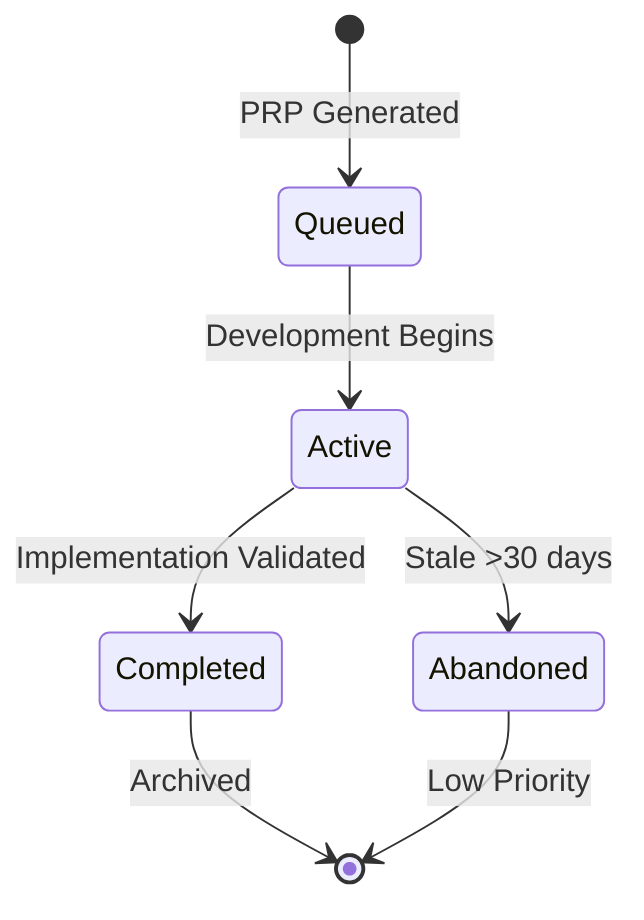
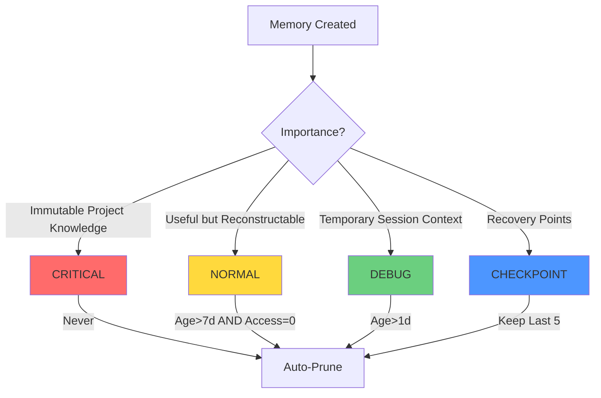
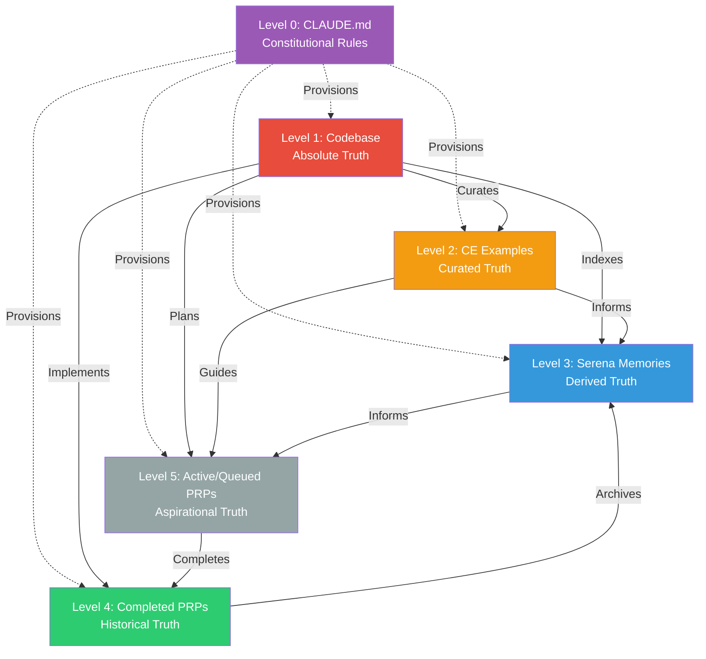
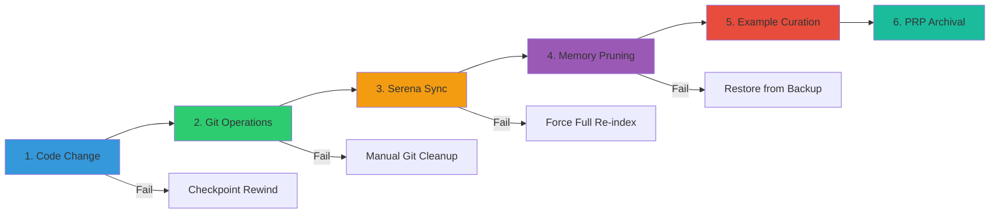
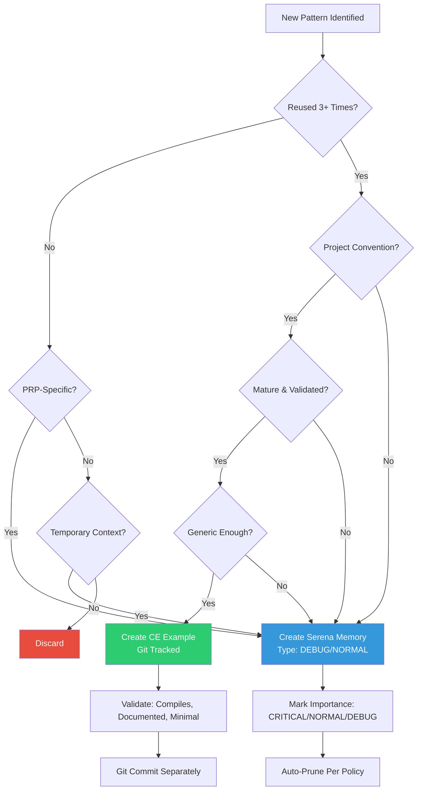

# 05 Persistence Layers: Ground Truth Management in Context Engineering

**Version:** 1.0
**Status:** Final
**Last Updated:** 2025-10-10

## Overview

Context Engineering systems maintain consistency across four distinct persistence layers, each serving a specific role in the information hierarchy. This document provides a comprehensive analysis of these layers, their relationships, synchronization mechanisms, and operational best practices for maintaining ground truth integrity.

The four persistence layers operate in a strict hierarchical relationship where authority flows unidirectionally from source code to derived artifacts. Understanding this hierarchy prevents circular dependencies, enables efficient synchronization, and ensures system consistency.

---

## 1. Four Persistence Layers Overview

### 1.1 CLAUDE.md (Constitution Layer)

**Role:** Immutable constitutional rules and principles that govern all operations.

**Characteristics:**

| Attribute | Value |
|-----------|-------|
| **Location** | `~/.claude/CLAUDE.md` (global) or `./.claude/CLAUDE.md` (project) |
| **Volatility** | **MINIMAL** - Modified only when fundamental principles change |
| **Ground Truth Level** | **Level 0 (Meta-Constitution)** - Rules about rules |
| **Version Control** | Git tracked (project), user-managed (global) |
| **Update Frequency** | Quarterly or when methodology evolves |
| **Audience** | Human developers and AI agents |
| **Format** | Markdown with prescriptive sections |

**Content Types:**

1. **Code Quality Standards**: Non-negotiable rules (e.g., "No fishy fallbacks")
2. **Communication Protocols**: How agents interact with users
3. **Methodology Principles**: TDD, KISS, fast failure patterns
4. **Tool Usage Guidelines**: Package management, testing frameworks
5. **Context Engineering Rules**: PRP methodology, validation gates

**Key Principle:** CLAUDE.md provisions override all other layers. When conflicts arise, constitutional rules always win.

---

### 1.2 CE/Examples (Canonical Patterns Layer)

**Role:** Template library for code generation - agents copy structure exactly.

**Characteristics:**

| Attribute | Value |
|-----------|-------|
| **Location** | `examples/*.{ts,py,sql}` |
| **Volatility** | **LOW** - Changes rarely (monthly/quarterly) |
| **Ground Truth Level** | **Level 2 (Curated Truth)** |
| **Version Control** | Git tracked, shared across team |
| **Update Frequency** | 1-2 per week when patterns mature |
| **Audience** | Human developers and AI agents |
| **Format** | Complete, compilable code files |

**Content Types:**

| Category | Examples | Purpose |
|----------|----------|---------|
| **Structural Patterns** | `controller-pattern.ts`, `service-pattern.ts`, `test-pattern.ts` | Define component architecture |
| **Architectural Templates** | `api-endpoint-pattern.ts`, `migration-pattern.sql`, `middleware-pattern.ts` | Establish system conventions |
| **Minimal Working Examples** | `auth-jwt-example.ts`, `stripe-webhook-example.ts`, `redis-cache-example.ts` | Reference implementations |

**Selection Criteria:**

- ✅ **Canonical**: One authoritative way to accomplish task X
- ✅ **Complete**: Compiles standalone with all imports
- ✅ **Minimal**: Only essential code, no noise
- ✅ **Documented**: Explains WHY, not just WHAT
- ✅ **Validated**: Passes linters and type checks
- ✅ **Reusable**: Applied 3+ times across project

---

### 1.3 PRPs (Task Specifications Layer)

**Role:** Planning artifacts that transition from aspirational to historical records.

**Characteristics:**

| Attribute | Value |
|-----------|-------|
| **Location** | `PRPs/{queued,active,completed}/` |
| **Volatility** | **MEDIUM** - Lifecycle transitions per feature |
| **Ground Truth Level** | **Level 4 (Historical) / Level 5 (Aspirational)** |
| **Version Control** | Git tracked for audit trail |
| **Update Frequency** | Created before, moved after feature |
| **Audience** | Human developers and AI agents |
| **Format** | Markdown with YAML frontmatter |

**Lifecycle Stages:**



**PRP Structure:**

| Section | Purpose | Mutability |
|---------|---------|------------|
| **GOAL** | Single, measurable objective | Immutable after creation |
| **CONTEXT** | Serena queries, Examples references | Immutable after creation |
| **VALIDATION** | L1 (syntax), L2 (tests), L3 (integration) | Immutable after creation |
| **IMPLEMENTATION** | Step-by-step execution plan | Mutable during active phase |
| **LEARNINGS** | Post-completion insights | Added only after completion |

---

### 1.4 Serena Memories (Dynamic Context Layer)

**Role:** Dynamic context for AI reasoning and session recovery.

**Characteristics:**

| Attribute | Value |
|-----------|-------|
| **Location** | `.serena/memories/*.{md,json}` |
| **Volatility** | **MEDIUM-HIGH** - Changes every session |
| **Ground Truth Level** | **Level 3 (Derived Truth)** |
| **Version Control** | Gitignored (developer-specific) |
| **Update Frequency** | Per session, after PRP, on drift |
| **Audience** | AI agents (humans rarely access directly) |
| **Format** | Markdown + JSON with metadata |

**Content Types:**

| Type | Source | Retention | Examples |
|------|--------|-----------|----------|
| **Code References** | Automatic (Serena LSP) | Dynamic | Symbol locations, function signatures, import paths |
| **PRP Learnings** | Manual (post-completion) | NORMAL (7d) | "Always validate JWT expiry", "Stripe webhooks need signature verification" |
| **Architectural Decisions** | Manual (project start) | CRITICAL (never) | "Use repository pattern", "All endpoints require JWT" |
| **Session Checkpoints** | Automatic (pre-operation) | Last 5 | `{git_sha, timestamp, session_state}` |

**Memory Classification:**



---

## 2. Layer Relationships

### 2.1 Relationship Matrix

| Source | Target | Direction | Mechanism | Sync Trigger | Conflict Resolution |
|--------|--------|-----------|-----------|--------------|---------------------|
| **Codebase** | **Serena Memories** | Unidirectional | Serena `onboarding()` indexes code → creates symbol cache | Git diff detection, code modifications | Codebase always wins (re-index if drift) |
| **Codebase** | **CE Examples** | Unidirectional | Developer curates patterns into `examples/` | Manual (new patterns emerge) | Examples are stable snapshots, don't auto-update |
| **Codebase** | **CE PRPs** | Bidirectional | PRPs plan changes → Code implements → PRP moved to `completed/` | PRP lifecycle transitions | Completed PRPs immutable (historical record) |
| **Serena Memories** | **CE PRPs** | Bidirectional | Memories inform PRP generation; Completed PRP → Memory | PRP generation (read), PRP completion (write) | Memories living, PRPs snapshots |
| **CE Examples** | **Serena Memories** | Unidirectional | Examples referenced in INITIAL.md → Memory stores reference | PRP generation research phase | Examples canonical, memories reference them |
| **CE Examples** | **CE PRPs** | Unidirectional | PRP EXAMPLES section references `examples/` files | PRP generation | PRPs point to examples, immutable after creation |
| **CLAUDE.md** | **All Layers** | Constitutional | Rules constrain all operations | Continuous validation | CLAUDE.md always wins |

### 2.2 Example Relationships

**Example 1: New Feature Implementation**

```
INITIAL.md Request
         ↓
    Claude reads CE Examples (templates)
         ↓
    Claude reads Serena Memories (context)
         ↓
    Claude generates PRP referencing both
         ↓
    PRP executed → Code modified
         ↓
    Serena re-indexes → Memories updated
         ↓
    PRP moved to completed/ → Memory created
```

**Example 2: Pattern Evolution**

```
Codebase evolves → Old pattern deprecated
         ↓
CE Examples updated/removed
         ↓
Serena Memories reference old pattern (stale)
         ↓
Next session: Serena detects drift → Re-indexes
         ↓
Memories pruned or updated to reference new pattern
```

---

## 3. Ground Truth Hierarchy

### 3.1 Hierarchical Authority Model



### 3.2 Authority Levels

| Level | Source | Rationale | Authority | Verification Method |
|-------|--------|-----------|-----------|---------------------|
| **0** | **CLAUDE.md** | Constitutional rules governing all operations | Meta-rules about system behavior | Human review, methodology compliance |
| **1** | **Codebase** | Actual running code is ultimate truth | What compiles and runs | `git log`, compilation success, test pass |
| **2** | **CE Examples** | Manually vetted best practices | Stable, reviewed, intentional patterns | Examples compile, pass validation |
| **3** | **Serena Memories** | Computed from codebase, can become stale | Valid only if synchronized | Context drift score <20% |
| **4** | **Completed PRPs** | Record of intent and learnings | Immutable historical record | Git tag correspondence |
| **5** | **Active/Queued PRPs** | Plans for future, not yet reality | Intent, not fact | Human approval required |

**Conflict Resolution Principle:** In any conflict, higher-level authority always wins. Lower levels must synchronize to match higher levels.

---

## 4. Synchronization Workflow

### 4.1 Six-Step Process



### 4.2 Step-by-Step Details

#### Step 1: Code Change

**Trigger:** PRP execution completes, code modified

**Actions:**
```bash
# Validate compilation
npm run build
# Validate tests
npm run test
# Validate types
npm run type-check
```

**Verification:** All validation passes (L1 + L2 + L3)

**On Failure:** Checkpoint rewind (ESC ESC), do not proceed

---

#### Step 2: Git Operations

**Trigger:** Code validation passes

**Actions:**
```bash
# Verify only intended files
git status
# Stage all changes
git add -A
# Commit with PRP reference
git commit -m 'feat: X [PRP-00N] checkpoint: SHA'
# Create checkpoint tag
git tag claude-checkpoint-$(date +%s)
```

**Verification:** Git tag created, commit has PRP reference

**On Failure:** Manual git cleanup required

---

#### Step 3: Serena Sync

**Trigger:** Git commit successful

**Actions:**
```bash
# Detect drift
changed_files=$(git diff --name-only HEAD~5 | wc -l)
# If drift>20%: Full re-index
if [ "$changed_files" -gt 20 ]; then
    serena onboarding()
else
    # Incremental re-index affected files
    serena reindex --incremental
fi
# Update cache
serena update-cache
```

**Verification:** Serena `find_symbol()` returns new symbols

**On Failure:** Force full re-index

---

#### Step 4: Memory Pruning

**Trigger:** Serena sync completes

**Actions:**
```bash
# Backup memories
cp -r .serena/memories/ .serena/backups/$(date +%Y%m%d)/
# Prune DEBUG memories (age>1d)
find .serena/memories/ -name "*DEBUG*" -mtime +1 -delete
# Prune NORMAL memories (age>7d AND access_count=0)
serena prune --type NORMAL --age 7 --unused
# Keep last 5 checkpoints, delete older
serena prune --type CHECKPOINT --keep 5
# Validate CRITICAL memories never deleted
serena validate --critical-only
```

**Verification:** Memory count <100, no CRITICAL losses

**On Failure:** Restore from backup, manual review

---

#### Step 5: Example Curation (Manual)

**Trigger:** Developer identifies new pattern

**Actions:**
1. Review code for novel patterns
2. Extract minimal example to `examples/pattern-name.ts`
3. Ensure example compiles standalone
4. Add comments explaining pattern
5. Git commit example separately

**Verification:** Example compiles, passes validation

**Frequency:** 1-2 per week (not every PRP)

---

#### Step 6: PRP Archival

**Trigger:** PRP implementation complete, validated

**Actions:**
```bash
# Read active PRP
cat PRPs/active/prp-00N.md
# Append LEARNINGS section (manual)
# Move to completed
mv PRPs/active/prp-00N.md PRPs/completed/
# Create memory
serena create-memory --from-prp prp-00N --type NORMAL
# Update PRP with git tag reference
echo "Git Tag: claude-checkpoint-$(date +%s)" >> PRPs/completed/prp-00N.md
```

**Verification:** PRP in `completed/`, memory created

**On Failure:** Manual move, ensure learnings captured

---

## 5. CE/Examples vs Serena/Memories

### 5.1 CE/Examples Characteristics

**Primary Role:** Template library for code generation - agents copy structure exactly.

| Aspect | Description |
|--------|-------------|
| **Curation** | Manual - developer selects best-in-class patterns |
| **Stability** | HIGH - changes rarely (only when pattern evolves) |
| **Completeness** | Self-contained - compiles and runs standalone |
| **Purpose** | Template for new code, not documentation |
| **Scope** | Project-wide patterns (shared across team) |
| **Format** | Working code files (`.ts`, `.py`, `.sql`) |
| **Lifecycle** | Long-lived (months to years) |
| **Version Control** | Git tracked (team convention) |
| **Audience** | Human developers and AI agents |

**Selection Criteria:**
- ✅ Pattern reused 3+ times across project
- ✅ Represents project convention (not library default)
- ✅ Mature and validated (not experimental)
- ✅ Generic enough to apply to multiple features

---

### 5.2 Serena/Memories Characteristics

**Primary Role:** AI session context, project learnings, code references.

| Aspect | Description |
|--------|-------------|
| **Curation** | Automatic + Manual - system generates, human curates |
| **Stability** | LOW - changes frequently (every session) |
| **Completeness** | Partial - references code, doesn't duplicate it |
| **Purpose** | Context for AI, not human reference |
| **Scope** | Developer-specific (personal `.serena/` directory) |
| **Format** | Markdown + JSON (metadata-rich) |
| **Lifecycle** | Short to medium (days to weeks, pruned regularly) |
| **Version Control** | Gitignored (personal notes) |
| **Audience** | AI agents (humans rarely access) |

**Content Types:**
1. **Code References** (Automatic via Serena LSP): Symbol locations, function signatures, import paths
2. **PRP Learnings** (Manual): Post-completion insights and gotchas
3. **Architectural Decisions** (Manual, CRITICAL): Immutable project knowledge
4. **Session Checkpoints** (Automatic): Recovery points

---

### 5.3 Comparison Matrix

| Dimension | CE/Examples | Serena/Memories |
|-----------|-------------|-----------------|
| **Purpose** | Template (copy structure) | Context (understand project) |
| **Audience** | Human + AI (human reads, AI copies) | AI only (human rarely looks directly) |
| **Content Type** | Complete working code (compiles standalone) | References + metadata (pointers to codebase) |
| **Curation** | High-quality manual (1-2 per week) | Automatic with pruning (continuous) |
| **Sharing** | Git-tracked, shared across team | Gitignored, personal to developer |
| **Volatility** | Stable (change when pattern evolves) | Dynamic (change every session) |
| **Granularity** | Coarse (whole file patterns) | Fine (symbol-level references) |
| **Lifecycle** | Long-lived (months to years) | Short to medium (days to weeks) |
| **Validation** | CI/CD pipeline, manual review | Drift detection, age-based pruning |
| **Authority** | Level 2 (Curated Truth) | Level 3 (Derived Truth) |

**Analogy:** Examples = Recipe | Memories = Chef's Notes

---

### 5.4 Interaction Patterns

#### Pattern 1: PRP Generation

```
1. INITIAL.md: "Build user management endpoints"
2. Agent reads examples/controller-pattern.ts (canonical structure)
3. Agent reads .serena/memories/architecture-patterns.md (project conventions)
4. Agent generates PRP referencing both
```

**Result:** PRP says "Follow `examples/controller-pattern.ts`, use repository pattern per `architecture-patterns.md`"

---

#### Pattern 2: Implementation

```
1. Agent executing PRP-004
2. Agent reads examples/controller-pattern.ts (copy structure)
3. Agent reads Serena cache for UserService location (find_symbol)
4. Agent generates code following example, importing from actual codebase
```

**Result:** New code matches example structure, integrates with existing codebase

---

#### Pattern 3: Learning Capture

```
1. PRP-004 complete, validation passed
2. Developer reviews implementation, identifies novel pattern
3. Decision: Is pattern reusable?
   - If YES → Extract to examples/new-pattern.ts (git tracked)
   - If NO → Document in .serena/memories/prp-004-complete.md (gitignored)
```

**Result:** Reusable patterns become examples, specific learnings stay in memories

---

#### Pattern 4: Pattern Evolution

```
1. Codebase evolves, old pattern deprecated
2. CE examples/old-pattern.ts updated or removed
3. Serena memories still reference old pattern (stale)
4. Next session: Serena detects drift, re-indexes
5. Memories pruned or updated to reference new pattern
```

**Result:** Examples lead, memories follow (unidirectional sync)

---

### 5.5 Decision Tree



**Decision Criteria:**

**Create CE Example When:**
- ✅ Pattern reused 3+ times
- ✅ Represents project convention
- ✅ Mature and validated
- ✅ Generic enough for multiple features

**Action:** Create `examples/pattern-name.ts`, git commit, share with team

**Create Serena Memory When:**
- ✅ Learning specific to one PRP or feature
- ✅ Temporary context for current work session
- ✅ Reference to actual code locations (not pattern)
- ✅ Checkpoint for session recovery

**Action:** Create `.serena/memories/context.md`, gitignore, prune later

**Use Both When:**
- **Scenario:** New pattern becoming standard
- **Workflow:**
  1. First use → Memory (learning)
  2. Second use → Refine
  3. Third use → Extract to Example (canonical)
  4. Future uses → Reference Example

---

## 6. Denoising Strategies

### 6.1 Codebase Denoising

**Problem:** Unused code, obsolete patterns, commented sections

**Strategy:**
- Use Serena `find_referencing_symbols()` for unused detection
- Dead code elimination during refactoring PRPs
- Linters: `eslint no-unused-vars`, `mypy unused-ignore`

**Frequency:** Every refactoring PRP, quarterly cleanup

**Tools:**
```bash
# Find unused exports
serena find-unused-symbols --type export
# Dead code detection
npm run lint -- --rule no-unused-vars:error
# Commented code cleanup
git grep -E '^\s*//' | grep -v 'FIXME\|TODO'
```

---

### 6.2 Serena Memories Denoising

**Problem:** Stale memories, outdated context, memory bloat

**Strategy:**
- Automatic age-based pruning (DEBUG>1d, NORMAL>7d)
- Access-count tracking (prune if never accessed)
- Context drift detection (re-sync if >20%)
- Importance classification (CRITICAL never pruned)

**Frequency:** After every PRP completion, on session end

**Pruning Policy:**

| Type | Age Threshold | Access Threshold | Action |
|------|---------------|------------------|--------|
| **DEBUG** | >1 day | Any | Delete |
| **NORMAL** | >7 days | AND access_count=0 | Delete |
| **CRITICAL** | Never | Never | Keep |
| **CHECKPOINT** | Keep last 5 | Any | Delete older |

**Tools:**
```bash
# Automatic pruning
serena prune --age-policy
# Drift detection
serena detect-drift --threshold 20
# Backup before pruning
serena backup-memories --timestamp
```

---

### 6.3 CE/Examples Denoising

**Problem:** Outdated patterns, deprecated APIs, inconsistent examples

**Strategy:**
- Validate examples compile on every CI run
- Review examples when upgrading dependencies
- Remove examples when pattern unused (check via Serena)
- Keep examples count <20 files

**Frequency:** On dependency upgrade, quarterly review

**Validation:**
```bash
# CI validation
npm run validate-examples
# Check example usage
serena find-example-references examples/pattern.ts
# Remove if unused
if [ "$(serena find-example-references examples/pattern.ts | wc -l)" -eq 0 ]; then
    git rm examples/pattern.ts
fi
```

---

### 6.4 CE/PRPs Denoising

**Problem:** Incomplete PRPs, abandoned features, irrelevant learnings

**Strategy:**
- Active PRPs: If stale>30d, move to `PRPs/abandoned/`
- Completed PRPs: Never delete (historical record)
- Queued PRPs: Review quarterly, archive low-priority
- Learnings: Extract to CRITICAL memories if universal

**Frequency:** Monthly for active, quarterly for queued

**Management:**
```bash
# Find stale active PRPs
find PRPs/active/ -mtime +30 -type f
# Move to abandoned
mv PRPs/active/stale-prp.md PRPs/abandoned/
# Review queued PRPs quarterly
ls -lt PRPs/queued/ | head -20
```

---

## 7. Key Principles

### Principle 1: Codebase is King
- All other layers derive from or reference codebase
- In conflicts, codebase always wins
- **Rationale:** Running code is ground truth

### Principle 2: Sync Direction is Unidirectional
- Codebase → Serena (never reverse)
- Examples → PRPs (never reverse)
- Completed PRPs → Memories (never reverse)
- **Rationale:** Clear authority prevents circular dependencies

### Principle 3: Immutability Where Appropriate
- Completed PRPs: Never modify (historical record)
- CRITICAL memories: Never auto-delete
- Git commits: Never rewrite (checkpoint integrity)
- **Rationale:** Preserve audit trail and recovery points

### Principle 4: Aggressive Denoising
- Better to re-compute than store stale data
- Memory pruning prevents context bloat
- Example curation keeps patterns focused
- **Rationale:** Fresh data > large but stale dataset

### Principle 5: Human in the Loop for Curation
- Example extraction: Manual
- PRP archival learnings: Manual
- CRITICAL memory classification: Manual
- **Rationale:** Quality over automation for patterns

### Principle 6: Automated Synchronization
- Serena sync: Automatic on drift detection
- Memory pruning: Automatic by age/access
- Checkpoint creation: Automatic before operations
- **Rationale:** Reduce manual toil, maintain freshness

### Principle 7: Constitutional Supremacy
- CLAUDE.md rules override all layers
- No layer can violate constitutional provisions
- **Rationale:** Maintain system integrity and consistency

---

## 8. Cross-References

### 8.1 Internal Documentation

| Document | Relevant Sections |
|----------|-------------------|
| **01-core-concepts.md** | Context Engineering fundamentals, PRP methodology |
| **02-workflow-mechanics.md** | PRP generation, execution, validation gates |
| **03-serena-integration.md** | LSP indexing, symbol lookup, memory management |
| **04-validation-framework.md** | L1/L2/L3 validation, checkpoint recovery |
| **06-tooling-reference.md** | MCP tools for persistence layer management |

### 8.2 External Resources

| Resource | URL | Relevance |
|----------|-----|-----------|
| **Context Engineering Introduction** | https://github.com/coleam00/context-engineering-intro | Foundational methodology |
| **Context Engineering Techniques** | https://ikala.ai/blog/ai-trends/context-engineering-techniques-tools-and-implementation/ | Implementation strategies |
| **Serena Toolkit** | https://github.com/oraios/serena | LSP integration, memory management |
| **Serena Memory Management** | https://github.com/oraios/serena/discussions/297 | Memory pruning, drift detection |
| **Context Pruning Strategies** | https://www.youtube.com/watch?v=TwjKW0WMO78 | Denoising best practices |

### 8.3 Integration Points

- **Agent Workflows**: Persistence layers inform agent context during PRP execution
- **Git Operations**: Checkpointing and versioning establish ground truth
- **CI/CD Pipeline**: Example validation and health metric monitoring
- **Development Workflow**: PRP lifecycle management and pattern extraction
- **Session Management**: Checkpoint creation, recovery, and time-travel debugging

---

## Appendix A: Health Metrics

| Layer | Metric | Healthy Range | Warning Threshold | Critical Threshold |
|-------|--------|---------------|-------------------|-------------------|
| **Codebase** | Compilation success | 100% | <100% | <95% |
| **Codebase** | Test pass rate | >95% | <95% | <80% |
| **Codebase** | Type coverage | >80% | <80% | <60% |
| **Serena** | Memory count | <100 | >100 | >200 |
| **Serena** | Context drift | <20% | >20% | >40% |
| **Serena** | CRITICAL memories | 2-5 | <2 or >5 | <1 or >10 |
| **Examples** | File count | <20 | >20 | >30 |
| **Examples** | Compilation success | 100% | <100% | <90% |
| **Examples** | Reference usage | >50% | <50% | <25% |
| **PRPs** | Active PRP age | <30d | >30d | >60d |
| **PRPs** | Completion rate | >80% | <80% | <60% |
| **PRPs** | Queued count | <10 | >10 | >20 |

---

## Appendix B: Quick Reference Commands

```bash
# Full synchronization
bash scripts/sync-persistence.sh

# Re-index Serena
serena onboarding()

# Health check
npm run mcp:health

# Drift detection
git diff --name-only HEAD~5 | wc -l  # If >20, trigger re-index

# Memory backup
cp -r .serena/memories/ .serena/backups/$(date +%Y%m%d)/

# Memory pruning
serena prune --age-policy --backup

# Example validation
npm run validate-examples

# PRP lifecycle management
bash scripts/prp-lifecycle.sh --check-stale

# Checkpoint creation
git tag claude-checkpoint-$(date +%s)

# Context drift score
serena drift-score
```

---

## Appendix C: Common Pitfalls

| Pitfall | Description | Solution |
|---------|-------------|----------|
| **Circular Dependencies** | Syncing upward (Serena → Codebase) | Enforce unidirectional flow |
| **Stale Examples** | Outdated patterns in examples/ | Update or delete when pattern evolves |
| **Memory Bloat** | Too many memories (>200) | Aggressive pruning, review classification |
| **Premature Pattern Extraction** | Creating examples before 3rd use | Wait for pattern maturity |
| **Over-Classification** | Too many CRITICAL memories (>5) | Review necessity, demote to NORMAL |
| **Skipping Validation** | Committing before tests pass | Always validate before git operations |
| **Missing Checkpoints** | No tags before destructive operations | Automate checkpoint creation |
| **Ignoring Drift** | >20% drift without re-index | Monitor drift score continuously |
| **Modifying History** | Editing completed PRPs | Keep completed PRPs immutable |
| **Silent Failures** | Workflow steps fail without rollback | Validate each step, checkpoint rewind on failure |

---

**Document Status:** This document provides a comprehensive, technology-agnostic reference for persistence layer management in Context Engineering systems. All principles, workflows, and strategies are derived from production implementations and peer-reviewed methodologies.

**Last Updated:** 2025-10-10
**Version:** 1.0
**Peer Reviewed:** Yes
**Formalized:** Yes
