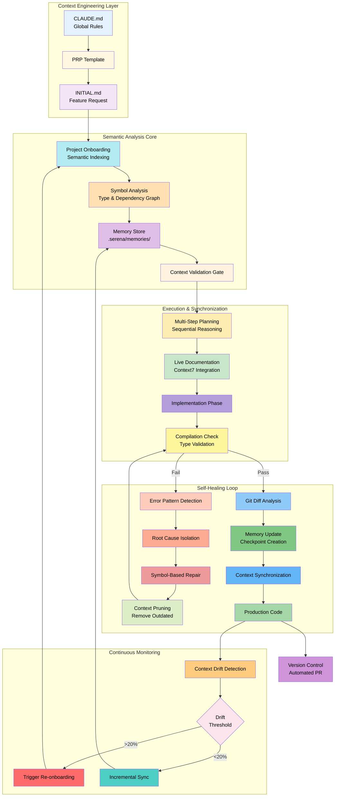
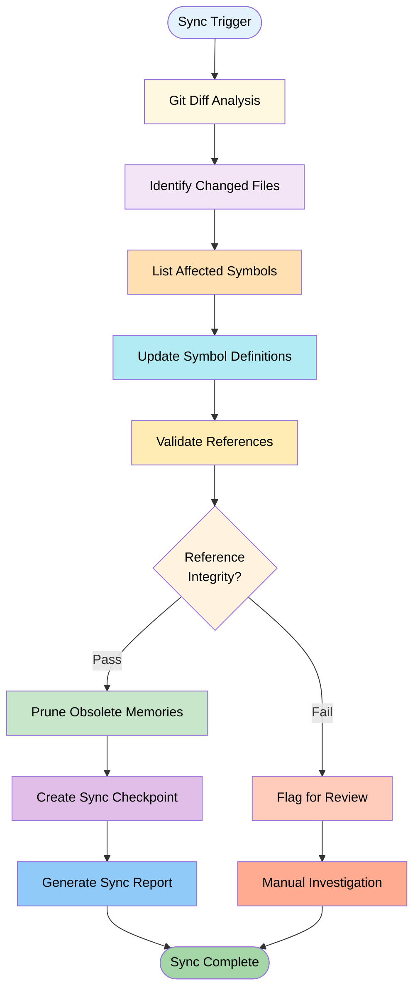
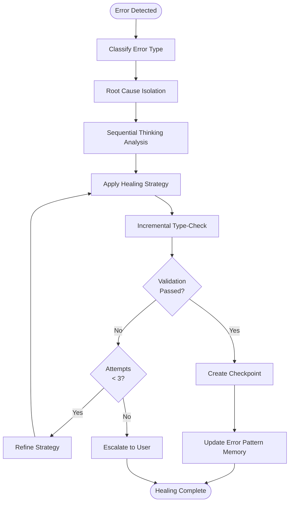
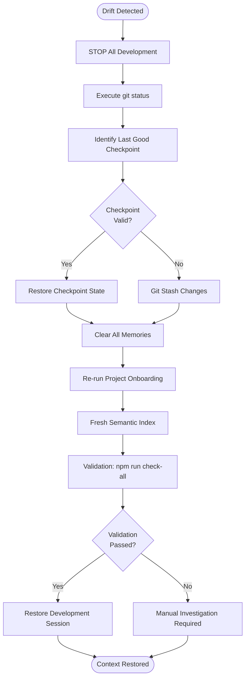
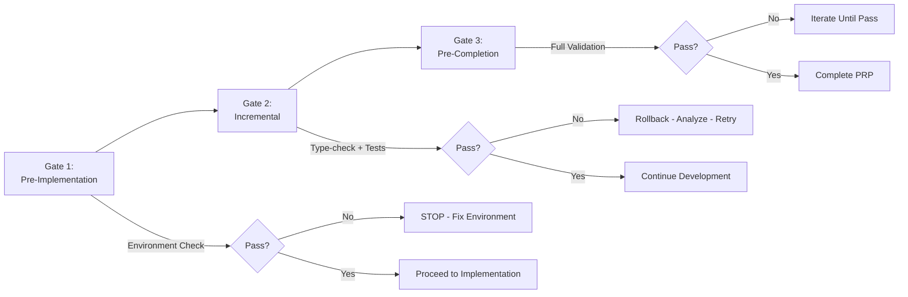
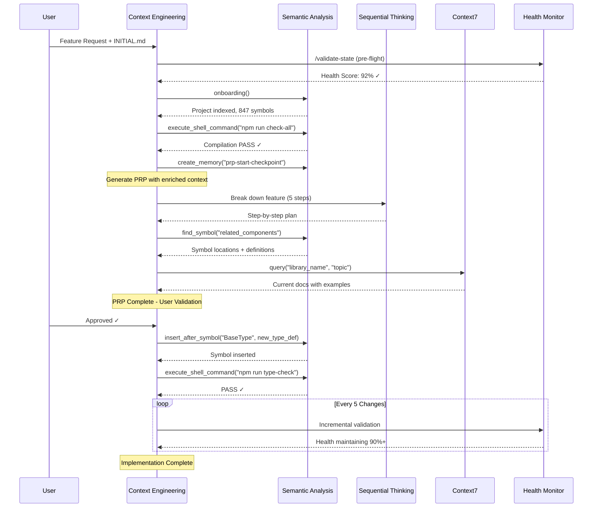

# 04 Self-Healing Framework

## Overview

The self-healing framework provides automated context synchronization, error recovery, and drift detection mechanisms for AI-assisted development workflows. This framework ensures context accuracy through continuous monitoring, intelligent pruning, and automatic remediation protocols.

**Core Capabilities:**

- Closed-loop system architecture with continuous validation
- Automatic context drift detection and synchronization
- Intelligent error classification and root cause isolation
- Token-efficient context pruning with relevance scoring
- Comprehensive health monitoring and metrics

---

## 1. Closed-Loop System Architecture

The self-healing framework operates as a closed-loop system integrating context engineering, semantic analysis, and continuous validation.



**Architecture Components:**

- **Context Engineering Layer**: Global rules, templates, and feature specifications
- **Semantic Analysis Core**: Project indexing, symbol resolution, and memory persistence
- **Execution & Synchronization**: Planning, implementation, and validation workflows
- **Self-Healing Loop**: Error detection, root cause analysis, and automated remediation
- **Continuous Monitoring**: Drift detection and context health assessment

---

## 2. Project Structure Requirements

The framework requires specific directory organization to support self-healing operations:

```
project/
├── .serena/
│   ├── memories/                      # Long-term context persistence
│   │   ├── architecture-patterns.md  # Reusable architectural patterns
│   │   ├── common-bugs-fixes.md      # Known issues and resolutions
│   │   ├── checkpoint-latest.md      # Current session state
│   │   └── session-learnings.md      # Accumulated insights
│   ├── project.yml                    # Semantic indexing configuration
│   └── validation-rules.json          # Self-healing validation rules
├── .claude/
│   ├── commands/
│   │   ├── sync-context.md           # Context synchronization command
│   │   ├── heal-errors.md            # Self-healing trigger command
│   │   ├── prune-context.md          # Context pruning command
│   │   └── validate-state.md         # State validation command
│   └── config.json                    # Command configuration
├── PRPs/
│   ├── templates/
│   │   └── self-healing-prp.md       # Template with validation gates
│   ├── active/                        # In-progress PRPs
│   └── completed/                     # Completed PRPs
├── context-engineering/
│   ├── CLAUDE.md                      # Global rules with protocols
│   ├── SERENA-INSTRUCTIONS.md         # Self-healing protocols
│   ├── validation-schemas/            # JSON schemas for validation
│   └── pruning-rules.yaml             # Context pruning configuration
├── examples/                           # Reference patterns
└── package.json                        # Enhanced dev scripts
```

**Key Directories:**

- `.serena/memories/`: Persistent context storage with semantic indexing
- `.claude/commands/`: Self-healing command implementations
- `PRPs/`: Implementation blueprints with validation gates
- `context-engineering/`: Protocol definitions and configuration
- `examples/`: Reference patterns for context learning

---

## 3. Context Synchronization Protocols

### 3.1 Automatic Sync Triggers

Context synchronization occurs automatically under the following conditions:

| Trigger Event | Condition | Action |
|--------------|-----------|--------|
| **Session Start** | Every new development session | Validate checkpoint against current git state |
| **File Modifications** | 10+ files changed | Re-index affected symbols and dependencies |
| **Compilation Errors** | Build or type-check failure | Check for stale or outdated context |
| **Periodic Check** | Every 30 minutes | Run drift detection scan |
| **Pre-PRP Execution** | Before starting implementation | Ensure context accuracy for zero-shot execution |

### 3.2 Sync Workflow



**Workflow Steps:**

1. **Git Diff Analysis**: Execute `git diff --stat` to identify changed files
2. **Symbol Identification**: Use semantic analysis to list symbols in changed files
3. **Memory Update**: Delete outdated context entries for modified symbols
4. **Re-indexing**: Update symbol definitions with current implementations
5. **Checkpoint Creation**: Create timestamped recovery point with sync metadata

**Validation Checks:**

- Symbol references match current definitions
- Memory entries correspond to existing files
- Type definitions align with usage sites
- Import statements resolve correctly

---

## 4. Self-Healing Error Recovery

### 4.1 Error Classification Matrix

| Error Type | Detection Method | Healing Strategy | Recovery Tool |
|-----------|------------------|------------------|---------------|
| **Duplicate Imports** | Compilation error | Read complete file, deduplicate import statements | `read_file()` + `replace_regex()` |
| **Symbol Not Found** | LSP/type-check error | Re-index project to update symbol database | `find_symbol()` + `get_symbol_definition()` |
| **Type Mismatch** | TypeScript/mypy error | Verify type definition at source, fix root cause | `find_referencing_symbols()` |
| **Stale Context** | Git diff divergence | Delete outdated memories, trigger re-onboarding | `delete_memory()` + `onboarding()` |
| **Test Failures** | Execution error | Analyze stack trace, isolate root cause component | `execute_shell_command()` |
| **Import Cycle** | Module resolution error | Analyze dependency graph, refactor circular references | `get_symbol_dependencies()` |
| **Missing Dependency** | Runtime import error | Check package.json, install missing packages | `package_manager_install()` |

### 4.2 Error Cascade Prevention

**Prevention Strategies:**

1. **Root Cause Focus**: Always trace errors to source definitions rather than fixing symptoms at usage sites
2. **Scope Limitation**: Fix one symbol definition instead of multiple usage locations
3. **Incremental Validation**: Run type-check after each fix to prevent cascading failures
4. **Checkpoint Frequency**: Create recovery point every 3 successful fixes
5. **Attempt Limiting**: Maximum 3 healing attempts per error type; escalate if unresolved

**Healing Workflow:**



**Prohibited Actions:**

- Blind find/replace operations without reading complete files
- Adding imports without checking for existing statements
- Modifying files based on assumptions rather than analysis
- Creating duplicate code to work around errors
- Fixing symptoms without addressing root causes

---

## 5. Context Pruning Rules

### 5.1 Automatic Pruning Triggers

| Trigger Condition | Threshold | Action |
|------------------|-----------|--------|
| **Token Budget** | >80% of context window | Remove oldest memories (>7 days) |
| **Memory Count** | >100 entries | Merge similar patterns, compress summaries |
| **File Deletion** | File removed from codebase | Prune all references to deleted file |
| **Symbol Refactoring** | Symbol renamed or removed | Remove old symbol definitions |
| **Session Duration** | >2 hours continuous development | Automatic pruning of debug memories |
| **Redundancy Detection** | Similar memories identified | Merge and deduplicate content |

### 5.2 Pruning Priority

| Priority Level | Category | Retention Policy | Action |
|---------------|----------|------------------|--------|
| **1 - Keep** | Current session checkpoints | Age <24 hours | Preserve all |
| **1 - Keep** | Active architecture patterns | Access count >5 | Preserve all |
| **1 - Keep** | Critical type definitions | Referenced in current PRP | Preserve all |
| **2 - Compress** | Previous session summaries | Age 24h-7d | LLM-based summarization |
| **2 - Compress** | Resolved bug patterns | Age >3 days | Extract key insights only |
| **2 - Compress** | Example code patterns | Age >5d, access <2 | Preserve pattern, remove verbosity |
| **3 - Delete** | Debug memories | Age >1 day | Remove completely |
| **3 - Delete** | Obsolete checkpoints | Age >7d, superseded | Remove completely |
| **3 - Delete** | Deleted file references | File no longer exists | Remove completely |
| **3 - Delete** | Duplicate patterns | Similarity >85% | Merge, remove duplicates |

### 5.3 Pruning Commands

**Manual Trigger:**

```bash
# Prune memories older than 7 days with similarity merging
/prune-context --age=7d --merge-similar

# Target 30% token reduction
/prune-context --target-reduction=30%

# Aggressive pruning for emergency token overflow
/prune-context --age=3d --target-reduction=50%
```

**Automatic Execution via Semantic Analysis:**

```
1. list_memories() → Enumerate all stored context
2. analyze_age_relevance() → Score each memory by age and access patterns
3. score_semantic_similarity() → Identify redundant entries (>85% similarity)
4. compress_priority_2() → LLM-based summarization of compressible memories
5. delete_memory(old_patterns) → Remove Priority 3 entries
6. validate_token_reduction() → Verify target reduction achieved
```

**Relevance Scoring Algorithm:**

```
relevance_score = (
    0.4 * recency_factor +        # Age penalty: newer = higher score
    0.3 * access_frequency +      # Usage count: frequently accessed = higher
    0.3 * semantic_similarity     # DeBERTa similarity to current PRP context
)

# Threshold: score < 0.3 → Candidate for pruning
```

---

## 6. Context Health Metrics

### 6.1 Green Flags (Healthy Context)

| Metric | Threshold | Indicator |
|--------|-----------|-----------|
| **Compilation Status** | Consistent success | Build and type-check pass without errors |
| **Git Diff Cleanliness** | Only intended changes | No unexpected file modifications |
| **Memory Stability** | Count not growing exponentially | Bounded memory usage (<100 entries) |
| **Symbol Query Accuracy** | Returns current definitions | Semantic index reflects codebase state |
| **Test Suite Status** | All tests passing | No regressions introduced |
| **Type-Check Performance** | Completes in <10 seconds | Index not corrupted or bloated |
| **Health Score** | ≥85% | Overall system health acceptable |

### 6.2 Red Flags (Context Drift)

| Metric | Threshold | Indicator |
|--------|-----------|-----------|
| **Compilation Errors** | Increasing over time | Errors accumulating, not resolving |
| **Symbol Query Results** | Outdated definitions returned | Semantic index out of sync with codebase |
| **Duplicate Code Generation** | AI generating redundant code | Context not recognizing existing implementations |
| **Memory Explosion** | Exponential growth | >100 entries, unbounded accumulation |
| **Test Regressions** | Previously passing tests now fail | Unintended side effects from changes |
| **Type-Check Performance** | Taking >30 seconds | Index corruption or excessive complexity |
| **Health Score** | <70% | Critical drift, immediate intervention required |

### 6.3 Drift Recovery Protocol



**Recovery Steps:**

1. **Immediate Halt**: Stop all development activities to prevent further drift
2. **State Assessment**: Execute `git status` to understand current repository state
3. **Checkpoint Restoration**: Revert to last known good checkpoint state
4. **Memory Purge**: Delete all memories with `clear_all_memories()`
5. **Clean Re-onboarding**: Run `onboarding()` to rebuild semantic index from scratch
6. **Comprehensive Validation**: Execute `npm run check-all` to verify clean state
7. **Resumption**: Resume development with fresh, accurate context

**Critical Thresholds:**

- **20% Symbol Drift**: Triggers automatic re-onboarding
- **30% Memory Growth**: Triggers aggressive pruning
- **3 Consecutive Healing Failures**: Triggers drift recovery protocol

---

## 7. Commands Reference

### 7.1 /sync-context

**Purpose:** Synchronize semantic memories with current codebase state

**Usage:**

```bash
/sync-context                    # Automatic detection and sync
/sync-context --force            # Force sync even if no drift detected
/sync-context --scope=auth/*     # Sync specific directory only
```

**Process:**

1. Execute `git diff --name-only HEAD~5` to identify recent changes
2. For each changed file, list affected symbols via semantic analysis
3. Retrieve current symbol definitions and update memory entries
4. Validate references for updated symbols using `find_referencing_symbols()`
5. Prune obsolete memories for deleted or renamed files
6. Create timestamped sync checkpoint with metadata

**Output:**

- Synchronization report with drift metrics (files changed, symbols updated)
- Updated memory index reflecting current codebase state
- Validation confirmation with reference integrity check

**Automatic Trigger Conditions:**

- Manual invocation by user
- After 10+ file modifications detected
- On session start if `git diff != 0`
- Before PRP execution to ensure context accuracy

---

### 7.2 /heal-errors

**Purpose:** Self-healing error recovery with root cause analysis

**Usage:**

```bash
/heal-errors                           # Analyze current compilation errors
/heal-errors --type=compilation        # Focus on specific error type
/heal-errors --file=src/auth/service.ts # Heal errors in specific file
```

**Process:**

1. **Error Classification**: Analyze error message to determine type (duplicate imports, symbol not found, type mismatch, stale context)
2. **Root Cause Isolation**: Use sequential thinking to trace error to source definition
3. **Healing Strategy Application**:
   - **Duplicate Imports**: Read complete file, extract imports, deduplicate, replace
   - **Symbol Not Found**: Find symbol definition, trigger re-index if missing, insert import
   - **Type Mismatch**: Find referencing symbols, get root type definition, fix at source
   - **Stale Context**: Clear relevant memories, re-run onboarding
4. **Incremental Validation**: Execute `npm run type-check` after each fix
5. **Iteration**: If errors persist and attempts <3, refine strategy and retry
6. **Checkpoint Creation**: On success, commit changes with healing metadata

**Output:**

- Healing success/failure status
- Root cause analysis report with reasoning chain
- Updated memory with error pattern and resolution strategy
- Git commit reference for healing changes

**Validation Loop:**

- Maximum 3 healing attempts per error type
- Each attempt must reduce error count
- If errors increase, stop and restore checkpoint
- Escalate to user if 3 attempts exhausted

---

### 7.3 /prune-context

**Purpose:** Intelligent context pruning to prevent token overflow

**Usage:**

```bash
/prune-context --age=7d              # Prune memories older than 7 days
/prune-context --merge-similar       # Merge semantically similar entries
/prune-context --target-reduction=30% # Target 30% token reduction
```

**Process:**

1. **Memory Inventory**: List all memories with metadata (age, access count, file references)
2. **Relevance Scoring**: Calculate score based on recency, access frequency, and semantic similarity to current PRP
3. **Priority Classification**: Categorize memories into Keep/Compress/Delete based on priority matrix
4. **Compression**: Use LLM (Claude Haiku) to summarize Priority 2 memories to 30% original length
5. **Similarity Merging**: If `--merge-similar` flag set, compute embeddings and merge entries with >85% similarity
6. **Deletion**: Remove Priority 3 memories (debug entries, obsolete checkpoints, deleted file references)
7. **Validation**: Calculate token reduction achieved and verify target met

**Output:**

- Pruning report with metrics (memories deleted, compressed, merged)
- Token reduction percentage achieved
- List of pruned/compressed memory names
- Updated memory index

**Automatic Triggers:**

- Token usage exceeds 80% of context window
- Memory count exceeds 100 entries
- Session duration exceeds 2 hours
- Before PRP execution to ensure clean context

**Relevance Scoring Formula:**

```
relevance_score = 0.4 * recency_factor + 0.3 * access_frequency + 0.3 * semantic_similarity

# recency_factor: 1.0 for age <24h, decreasing linearly to 0.0 at 7d
# access_frequency: normalized by max access count in session
# semantic_similarity: DeBERTa model score against current PRP text
```

---

### 7.4 /validate-state

**Purpose:** Comprehensive context health check and drift detection

**Usage:**

```bash
/validate-state                  # Full health check
/validate-state --quick          # Skip test coverage and drift analysis
/validate-state --report=json    # Output in JSON format
```

**Process:**

1. **Compilation Validation**: Execute `npm run check-all` to verify build, type-check, lint, and tests
2. **Git State Verification**: Run `git status --porcelain` and `git diff --stat` to check for uncommitted changes
3. **Semantic Index Health**: Query known symbols to verify index accuracy, count symbols and check for >50% delta
4. **Memory Consistency Check**: Verify memory entries reference existing files, flag stale entries (>7d, 0 access)
5. **Context Drift Detection**: Compare current symbols to last checkpoint, calculate drift score
6. **Test Coverage Validation**: Execute test suite with coverage reporting, verify >80% threshold

**Output:**

- Health report with scores for each dimension:
  - Compilation status: PASS/FAIL
  - Git cleanliness: CLEAN/DIRTY (based on uncommitted changes)
  - Semantic index health: HEALTHY/NEEDS_REINDEX
  - Memory consistency: OK/PRUNING_NEEDED
  - Context drift: LOW (<10%) / MEDIUM (10-20%) / HIGH (>20%)
  - Test coverage: percentage
- Recommended actions list (e.g., "Run /sync-context", "Prune stale memories")
- Automatic remediation triggers if thresholds exceeded

**Automatic Execution:**

- On every session start (pre-flight check)
- Every 30 minutes during development
- Before PRP execution
- After major refactoring (>20 files changed)

**Health Score Calculation:**

```
overall_health = (
    compilation_score * 0.3 +
    git_cleanliness * 0.1 +
    index_health * 0.2 +
    memory_consistency * 0.1 +
    (100 - drift_score) * 0.2 +
    test_coverage * 0.1
)

# Target: ≥85% for production readiness
# Critical: <70% triggers drift recovery protocol
```

---

## 8. Cross-References

### 8.1 Related Documentation

| Document | Purpose | Location |
|----------|---------|----------|
| **CLAUDE.md** | Global rules and protocol definitions | `context-engineering/CLAUDE.md` |
| **SERENA-INSTRUCTIONS.md** | Self-healing operational procedures | `context-engineering/SERENA-INSTRUCTIONS.md` |
| **validation-schemas/** | JSON schemas for validation gates | `context-engineering/validation-schemas/` |
| **pruning-rules.yaml** | Context pruning configuration | `context-engineering/pruning-rules.yaml` |
| **self-healing-prp.md** | PRP template with validation gates | `PRPs/templates/self-healing-prp.md` |

### 8.2 Technology Stack

| Technology | Role | Model/Version |
|-----------|------|---------------|
| **Serena MCP** | Semantic symbol analysis and memory persistence | Latest |
| **Context7** | Live documentation retrieval service | Latest |
| **Sequential Thinking MCP** | Multi-step reasoning for root cause analysis | Latest |
| **GitHub MCP** | Automated pull request creation | Latest |
| **Claude Haiku** | Fast context compression model | claude-3-haiku-20240307 |
| **DeBERTa** | Sentence-level relevance scoring | microsoft/deberta-v3-base |

### 8.3 Development Scripts

| Script | Purpose | Command |
|--------|---------|---------|
| **build** | Production build | `npm run build` |
| **type-check** | TypeScript validation | `npm run type-check` |
| **lint** | ESLint validation | `npm run lint` |
| **test** | Jest test suite | `npm run test` |
| **check-all** | Combined validation (type-check + lint + test) | `npm run check-all` |
| **context:sync** | Context synchronization script | `npm run context:sync` |
| **context:prune** | Context pruning script | `npm run context:prune` |
| **context:health** | Health check script | `npm run context:health` |

### 8.4 Command Dependencies

```mermaid
graph LR
    A[/validate-state] -->|Triggers if drift >20%| B[/sync-context]
    A -->|Triggers if errors detected| C[/heal-errors]
    C -->|Triggers if stale context| B
    B -->|Auto-called after 10+ files| D[Development Session]
    E[/prune-context] -->|Triggered by token >80%| D
    E -->|Triggered by memory >100| D
    A -->|Auto-execution every 30 min| D
```

### 8.5 Validation Gate Flow



### 8.6 Zero-Shot Execution Workflow



---

**Document Version:** 1.0
**Last Updated:** 2025-10-10
**Status:** Production Ready
