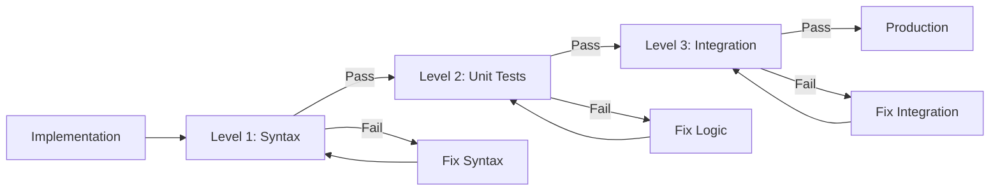
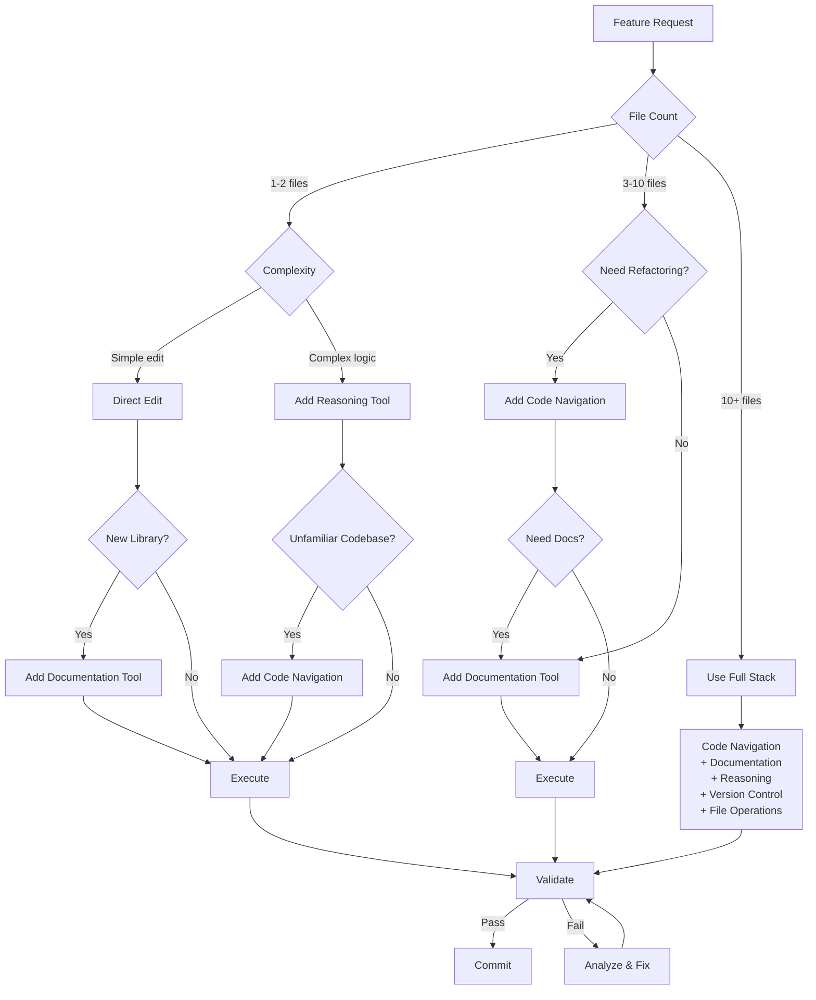
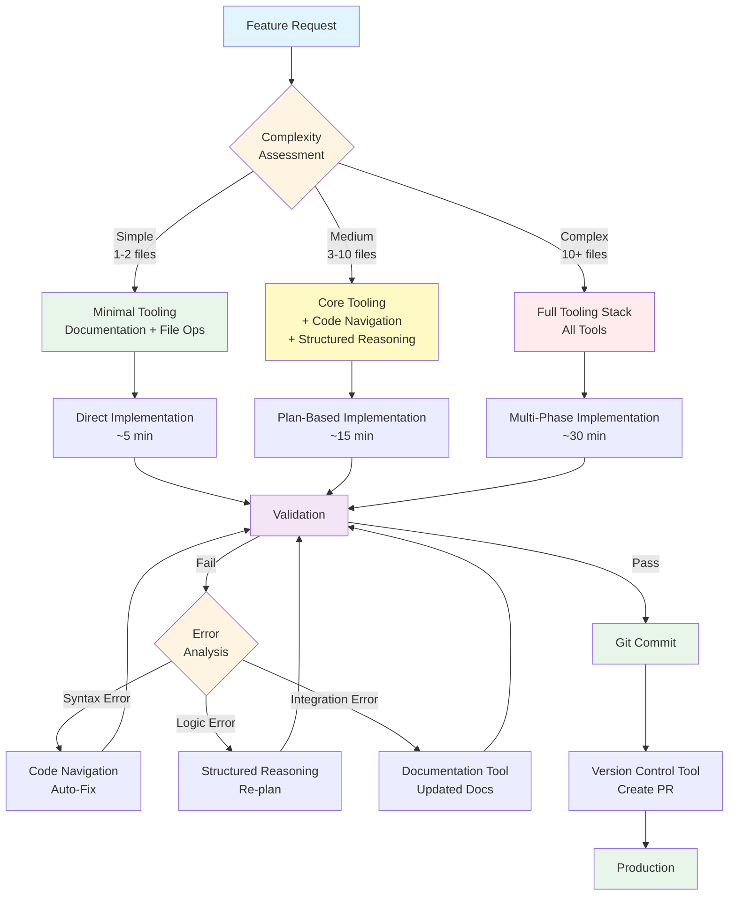

# Best Practices and Anti-Patterns in Context Engineering

**Document Purpose**: Comprehensive catalog of best practices, anti-patterns, optimization strategies, and decision frameworks for context engineering in AI-assisted software development.

**Last Updated**: 2025-10-10
**Status**: Production-Ready
**Technology Scope**: Technology-Agnostic

---

## Table of Contents

1. [KISS Principles Overview](#1-kiss-principles-overview)
2. [Best Practices Catalog](#2-best-practices-catalog)
   - 2.1 [RAG-First Strategy](#21-rag-first-strategy)
   - 2.2 [Explicit Context](#22-explicit-context)
   - 2.3 [Validation-First Design](#23-validation-first-design)
   - 2.4 [Incremental Complexity](#24-incremental-complexity)
   - 2.5 [Context Hierarchy](#25-context-hierarchy)
   - 2.6 [Continuous Context Updates](#26-continuous-context-updates)
3. [Anti-Patterns Catalog](#3-anti-patterns-catalog)
   - 3.1 [Context Dumping](#31-context-dumping)
   - 3.2 [Trust Fall Execution](#32-trust-fall-execution)
   - 3.3 [Vague Brain Dump](#33-vague-brain-dump)
   - 3.4 [Context-Free Updates](#34-context-free-updates)
   - 3.5 [Inconsistent Guidance](#35-inconsistent-guidance)
4. [Best Practices vs Anti-Patterns Comparison](#4-best-practices-vs-anti-patterns-comparison)
5. [MCP Selection Heuristics](#5-mcp-selection-heuristics)
6. [Context Budget Management](#6-context-budget-management)
7. [Zero-Shot Optimization Checklist](#7-zero-shot-optimization-checklist)
8. [Optimization Patterns](#8-optimization-patterns)
   - 8.1 [Symbol-First Development](#81-symbol-first-development)
   - 8.2 [Test-Driven Context](#82-test-driven-context)
   - 8.3 [Incremental Validation Loop](#83-incremental-validation-loop)
9. [Context Health Metrics](#9-context-health-metrics)
10. [KISS Decision Tree](#10-kiss-decision-tree)
11. [Red Flag Identification Guide](#11-red-flag-identification-guide)
12. [Cross-References](#12-cross-references)

---

## 1. KISS Principles Overview

**Keep It Simple, Stupid** - The foundational philosophy for context engineering and AI-assisted development.

### 1.1 Core Principles

| Principle | Description | Application in Context Engineering |
|-----------|-------------|-----------------------------------|
| **Simple Solutions First** | Start with minimal viable approach | Use minimal MCP stack for simple tasks (1-2 files) |
| **Avoid Over-Engineering** | Resist premature optimization | Don't load full MCP stack for trivial changes |
| **Clear Code Over Clever Code** | Prioritize readability | Write explicit context over abbreviated prompts |
| **Minimal Dependencies** | Reduce external complexity | Only activate MCPs when necessary |
| **Single Responsibility** | One function, one purpose | Each context document serves single purpose |
| **Direct Implementation** | Shortest path to working solution | Direct implementation for simple features |
| **Fast Failure** | Fail early, fail visibly | Validation gates at every step |

### 1.2 KISS in Context Engineering

**Complexity-Driven Approach**:

- **Simple Tasks (1-2 files)**: Minimal tooling, direct execution (~5 minutes)
- **Medium Tasks (3-10 files)**: Core tooling + planning (~15 minutes)
- **Complex Tasks (10+ files)**: Full tooling stack + multi-phase planning (~30 minutes)

**Key Insight**: Match tool complexity to task complexity. Over-tooling wastes resources; under-tooling risks failure.

---

## 2. Best Practices Catalog

### 2.1 RAG-First Strategy

**Definition**: Prefer context retrieval over model fine-tuning for operational flexibility and cost efficiency.

#### 2.1.1 Core Principles

| Aspect | Best Practice | Rationale |
|--------|---------------|-----------|
| **Knowledge Management** | Build vector databases for project knowledge | Enables semantic search and contextual retrieval |
| **Documentation Strategy** | Continuously update documentation embeddings | Ensures current context availability |
| **Cost Model** | Treat as OpEx vs CapEx | Operational flexibility over capital investment |
| **Update Frequency** | Update embeddings with each significant change | Prevents context drift |

#### 2.1.2 Implementation Strategy

```
1. Establish vector database for project documentation
2. Embed critical project knowledge (architecture, patterns, conventions)
3. Update embeddings with each documentation change
4. Query embeddings before providing context to AI
5. Validate retrieved context relevance before use
```

#### 2.1.3 Benefits

- **Operational Flexibility**: Update context without model retraining
- **Cost Efficiency**: No expensive fine-tuning required
- **Version Control**: Context changes tracked in documentation
- **Scalability**: Add new patterns without model modification

---

### 2.2 Explicit Context

**Definition**: Never assume AI model understands conventions, patterns, or constraints. Provide complete, explicit specifications.

#### 2.2.1 Core Principles

| Element | Best Practice | Example |
|---------|---------------|---------|
| **Schema Definition** | Provide complete data structures | Full type definitions, not partial interfaces |
| **Pattern Documentation** | Include code examples for all patterns | Show concrete implementations |
| **Constraint Specification** | Explicitly state all constraints | "Must use X, cannot use Y" |
| **Gotchas Section** | Document common mistakes | "Don't forget to..." sections |

#### 2.2.2 Explicit Context Template

```markdown
## Context: [Feature Name]

### Required Conventions
- Naming: [Explicit naming rules]
- Structure: [File organization rules]
- Dependencies: [Allowed/prohibited dependencies]

### Complete Schema
[Full data structure definitions]

### Implementation Patterns
[Code examples for all patterns]

### Common Mistakes to Avoid
- Mistake 1: [Description and solution]
- Mistake 2: [Description and solution]

### Edge Cases
- Edge case 1: [How to handle]
- Edge case 2: [How to handle]
```

#### 2.2.3 Benefits

- **Reduced Ambiguity**: No room for misinterpretation
- **Consistent Implementations**: All developers follow same patterns
- **Faster Development**: No time wasted on clarifications
- **Higher Quality**: Fewer assumption-based errors

---

### 2.3 Validation-First Design

**Definition**: Define success criteria as executable tests before implementation begins.

#### 2.3.1 Three-Level Validation Gates

| Level | Validation Type | Tools | Pass Criteria |
|-------|----------------|-------|---------------|
| **Level 1** | Syntax & Style | Linters, formatters, type checkers | Zero errors, zero warnings |
| **Level 2** | Unit Tests | Test framework, coverage tools | 100% pass rate, >80% coverage |
| **Level 3** | Integration Tests | E2E test framework, API testing | All workflows functional |

#### 2.3.2 Validation Workflow



#### 2.3.3 Self-Correction Through Feedback Loops

```
1. Define validation criteria (executable tests)
2. Implement feature
3. Run validation
4. If fail: Analyze feedback → Fix root cause → Re-validate
5. If pass: Proceed to next validation level
6. Create checkpoint after all validations pass
```

#### 2.3.4 Benefits

- **Fast Failure**: Errors caught immediately
- **Clear Success Criteria**: No ambiguity about "done"
- **Self-Correction**: Automated feedback enables autonomous fixes
- **Quality Assurance**: Multi-level validation prevents defects

---

### 2.4 Incremental Complexity

**Definition**: Start with minimal viable implementation, validate each component before adding features.

#### 2.4.1 Incremental Development Phases

| Phase | Scope | Validation | Next Step Criteria |
|-------|-------|------------|-------------------|
| **Phase 1** | Core functionality only | Unit tests pass | Core logic validated |
| **Phase 2** | Add error handling | Error cases tested | Robust error handling |
| **Phase 3** | Add edge cases | Edge case tests pass | All scenarios covered |
| **Phase 4** | Add optimizations | Performance benchmarks | Acceptable performance |
| **Phase 5** | Add documentation | Documentation review | Complete documentation |

#### 2.4.2 Incremental Implementation Strategy

```
1. Define minimal viable feature (MVP)
2. Implement MVP only
3. Validate MVP (all three validation levels)
4. If fail: Fix and re-validate
5. If pass: Identify next incremental addition
6. Implement addition
7. Validate addition (all three levels)
8. Repeat until feature complete
```

#### 2.4.3 Benefits

- **Prevents Compounding Errors**: Each component validated independently
- **Clear Progress Tracking**: Incremental milestones
- **Easier Debugging**: Smaller code changes to analyze
- **Risk Reduction**: Validate before adding complexity

---

### 2.5 Context Hierarchy

**Definition**: Structure context in hierarchical layers from project-wide to task-specific.

#### 2.5.1 Hierarchical Structure

```
Project-Wide Context (CLAUDE.md)
    ├── Global conventions
    ├── Project-wide patterns
    ├── Universal constraints
    └── Core architecture
        │
        ├── Module-Specific Context (feature-context.md)
        │   ├── Module conventions
        │   ├── Module patterns
        │   ├── Module constraints
        │   └── Module architecture
        │       │
        │       └── Task-Specific Context (PRP)
        │           ├── Task requirements
        │           ├── Task constraints
        │           ├── Implementation plan
        │           └── Validation criteria
```

#### 2.5.2 Context Layer Specifications

| Layer | Document | Scope | Update Frequency | Consumers |
|-------|----------|-------|------------------|-----------|
| **Project-Wide** | CLAUDE.md | All development | Rarely (architecture changes) | All developers, all AI agents |
| **Module-Specific** | module-context.md | Specific feature/module | Occasionally (module changes) | Module developers, relevant AI agents |
| **Task-Specific** | PRP (Plan-Research-Plan) | Single feature/task | Per task | Task implementer only |

#### 2.5.3 Context Inheritance Rules

```
1. Task-Specific inherits from Module-Specific
2. Module-Specific inherits from Project-Wide
3. Lower layers override higher layers (specificity wins)
4. All layers must be consistent (no contradictions)
5. Update higher layers when patterns generalize
```

#### 2.5.4 Benefits

- **Scalability**: Enables large project context management
- **Clarity**: Clear separation of concerns
- **Maintainability**: Update relevant layer only
- **Efficiency**: Load only necessary context layers

---

### 2.6 Continuous Context Updates

**Definition**: Treat every code modification as mini-PRP - always reference existing patterns and maintain consistency.

#### 2.6.1 Context Update Workflow

```
1. Read existing context (project, module, task layers)
2. Read affected code files
3. Plan modification (mini-PRP)
4. Validate against existing patterns
5. Implement modification
6. Update context documents if patterns change
7. Validate implementation
8. Create checkpoint
```

#### 2.6.2 Context Update Triggers

| Trigger | Update Type | Action Required |
|---------|-------------|-----------------|
| **New Pattern Discovered** | Add to module context | Document pattern for reuse |
| **Convention Changed** | Update project context | Notify all developers |
| **Module Architecture Changed** | Update module context | Review impact on dependent modules |
| **Task Completed** | Archive task context | Move patterns to module context if generalizable |

#### 2.6.3 Context Consistency Rules

```
Rule 1: Always read before write (never assume)
Rule 2: Reference existing patterns explicitly
Rule 3: Maintain naming consistency
Rule 4: Follow established file organization
Rule 5: Use consistent error handling patterns
Rule 6: Match existing documentation style
```

#### 2.6.4 Benefits

- **Consistency**: All code follows same patterns
- **Knowledge Preservation**: Patterns documented for future use
- **Reduced Errors**: Context-aware modifications
- **Team Alignment**: Single source of truth

---

## 3. Anti-Patterns Catalog

### 3.1 Context Dumping

**Definition**: Providing excessive, unfocused information that overwhelms AI with irrelevant details.

#### 3.1.1 Symptoms

| Symptom | Description | Impact |
|---------|-------------|--------|
| **Token Limits Exceeded** | Frequently hitting context window limits | Cannot provide complete context |
| **AI Confusion** | AI references irrelevant details in responses | Poor quality outputs |
| **Long Response Times** | AI takes excessive time processing context | Reduced productivity |
| **Inconsistent Outputs** | AI latches onto wrong context elements | Unpredictable behavior |

#### 3.1.2 Example: Context Dumping (Anti-Pattern)

```markdown
## Context (BAD - Context Dumping)

Here's the entire codebase structure:
[1000+ lines of directory tree]

Here are all project dependencies:
[500+ lines of package.json/requirements.txt]

Here's the complete git history:
[200+ commit messages]

Here's every configuration file:
[10+ configuration files, 2000+ lines]

Feature Request: Add user login functionality
```

**Problem**: 90% of this context is irrelevant to implementing user login.

#### 3.1.3 Solution: Focused Context (Best Practice)

```markdown
## Context (GOOD - Focused Context)

Feature Request: Add user login functionality

### Relevant Context
- Authentication pattern: JWT tokens (see: auth/jwt-handler.ts)
- User model: users table with email/password_hash (see: models/user.ts)
- Existing auth endpoints: /api/auth/register, /api/auth/logout
- Password hashing: bcrypt with 12 rounds (see: utils/crypto.ts)

### Decision-Critical Information
- Must integrate with existing session management (redis)
- Must implement rate limiting (max 5 attempts per 15 minutes)
- Must follow error response format (see: types/api-response.ts)

### Not Needed
- Don't need full directory structure
- Don't need git history
- Don't need all dependencies
```

**Solution**: Only decision-relevant context provided, focused on task requirements.

#### 3.1.4 Prevention Strategy

```
1. Identify task requirements
2. Filter context to decision-critical information only
3. Apply "need-to-know" principle
4. Use hierarchical context (general → specific)
5. Reference files instead of including full content
6. Validate token budget before providing context
```

---

### 3.2 Trust Fall Execution

**Definition**: Executing plans without human validation, blindly accepting AI architectural decisions.

#### 3.2.1 Symptoms

| Symptom | Description | Impact |
|---------|-------------|--------|
| **Poor Architectural Decisions** | Suboptimal design choices | Technical debt accumulation |
| **Misaligned Implementations** | Feature doesn't match requirements | Rework required |
| **Undiscovered Bugs** | Issues not caught until production | Production incidents |
| **Technical Debt** | Shortcuts taken without awareness | Long-term maintenance burden |

#### 3.2.2 Example: Trust Fall Execution (Anti-Pattern)

```
Human: "Create a user authentication system"
AI: [Generates 10 files, 2000 lines of code]
Human: [Executes without review]
Result:
- Password stored in plaintext (security issue)
- No rate limiting (vulnerability)
- Incompatible with existing session management (integration issue)
- No tests written (quality issue)
```

**Problem**: No validation checkpoint allowed critical issues to reach production.

#### 3.2.3 Solution: Validation Gates (Best Practice)

```
Human: "Create a user authentication system"
AI: [Generates PRP document]
Human: [VALIDATION CHECKPOINT 1 - Reviews PRP]
- Verifies security approach (bcrypt hashing)
- Confirms rate limiting included
- Validates integration with existing systems
- Checks test coverage plan
Human: "Approved, proceed with implementation"
AI: [Implements Phase 1 - Core login]
Human: [VALIDATION CHECKPOINT 2 - Reviews code]
- Verifies implementation matches PRP
- Runs validation gates (syntax, unit tests)
Human: "Approved, proceed with Phase 2"
[Repeat for all phases]
```

**Solution**: Human validation at critical decision points prevents architectural issues.

#### 3.2.4 Prevention Strategy

```
1. Always generate PRP before implementation
2. Human reviews PRP for architectural soundness
3. Human approval required before execution
4. Validate after each implementation phase
5. Human reviews all architectural decisions
6. Automated validation gates supplement (not replace) human review
```

---

### 3.3 Vague Brain Dump

**Definition**: One-line feature descriptions without examples, edge cases, or acceptance criteria.

#### 3.3.1 Symptoms

| Symptom | Description | Impact |
|---------|-------------|--------|
| **Missing Examples** | No concrete usage examples | Misunderstood requirements |
| **Incomplete Implementations** | Key features missing | Rework required |
| **Misunderstood Requirements** | Implementation doesn't match intent | Time wasted |
| **Ambiguous Specifications** | Multiple valid interpretations | Inconsistent implementations |

#### 3.3.2 Example: Vague Brain Dump (Anti-Pattern)

```markdown
## INITIAL.md (BAD - Vague Brain Dump)

Feature: Add search functionality

That's it. Go implement it.
```

**Problem**: No details on search scope, UX, performance requirements, or validation criteria.

#### 3.3.3 Solution: Explicit Requirements (Best Practice)

```markdown
## INITIAL.md (GOOD - Explicit Requirements)

Feature: Add search functionality to product catalog

### Requirements
- Search across product name, description, SKU
- Real-time search (update results as user types)
- Performance: Results within 200ms for 10,000 products
- UI: Search bar in header, dropdown results panel

### Examples
**Example 1: Basic search**
Input: "laptop"
Expected: All products with "laptop" in name/description

**Example 2: SKU search**
Input: "SKU-12345"
Expected: Exact match for SKU-12345

**Example 3: Partial match**
Input: "lap"
Expected: Products matching "lap" (laptop, lapack, etc.)

### Edge Cases
- Empty search: Show all products (or placeholder)
- No results: Display "No products found" message
- Special characters: Sanitize and search
- Very long queries: Truncate at 100 characters

### Acceptance Criteria
- [ ] Search across name, description, SKU
- [ ] Real-time updates (debounced 300ms)
- [ ] Results render within 200ms
- [ ] All edge cases handled
- [ ] Unit tests for search logic
- [ ] E2E tests for search UX

### Constraints
- Must use existing search API (/api/products/search)
- Must follow existing UI component patterns
- Must maintain accessibility (keyboard navigation)
```

**Solution**: Complete specification with examples, edge cases, and validation criteria.

#### 3.3.4 Prevention Strategy

```
1. Always start with INITIAL.md template
2. Include concrete examples (minimum 3)
3. Document all edge cases
4. Define executable acceptance criteria
5. Specify constraints explicitly
6. Provide UI mockups if applicable
7. Human reviews INITIAL.md before PRP generation
```

---

### 3.4 Context-Free Updates

**Definition**: Modifying features without referencing existing code, breaking design system consistency.

#### 3.4.1 Symptoms

| Symptom | Description | Impact |
|---------|-------------|--------|
| **Broken Consistency** | New code doesn't match existing patterns | Maintenance burden |
| **Duplicate Implementations** | Functionality already exists elsewhere | Code bloat |
| **Inconsistent Patterns** | Multiple approaches to same problem | Confusion |
| **Integration Issues** | New code incompatible with existing systems | Runtime errors |

#### 3.4.2 Example: Context-Free Updates (Anti-Pattern)

```
Task: Add "Delete User" button to user profile page

AI: [Without reading existing code]
- Creates new button component (duplicate)
- Uses different styling (inconsistent)
- Implements custom delete logic (duplicate)
- Uses different error handling (inconsistent)

Result:
- Button looks different from all other buttons
- Delete logic duplicates existing deleteUser() function
- Error handling doesn't match project patterns
- Code review reveals 5 inconsistencies
```

**Problem**: No reference to existing code created multiple inconsistencies.

#### 3.4.3 Solution: Context-Aware Edits (Best Practice)

```
Task: Add "Delete User" button to user profile page

AI: [STEP 1 - Read existing code]
1. Read: design-system.md (button patterns)
2. Read: components/Button.tsx (existing button component)
3. Read: api/user-api.ts (existing deleteUser function)
4. Read: utils/error-handler.ts (error handling pattern)

AI: [STEP 2 - Plan implementation using existing patterns]
1. Use <Button variant="danger"> (matches existing buttons)
2. Call existing deleteUser() API function
3. Use standard error handling pattern
4. Follow confirmation dialog pattern

AI: [STEP 3 - Implement]
<Button
  variant="danger"
  onClick={handleDelete}
>
  Delete User
</Button>

async function handleDelete() {
  if (await confirmDialog("Delete user?")) {
    try {
      await deleteUser(userId);
      toast.success("User deleted");
    } catch (error) {
      handleError(error);
    }
  }
}

Result:
- Matches existing button styling
- Reuses existing delete API
- Follows error handling pattern
- Consistent with project conventions
```

**Solution**: Read existing code first, then implement using established patterns.

#### 3.4.4 Prevention Strategy

```
1. ALWAYS read relevant files before modifying
2. Reference design system documentation
3. Search for existing implementations (avoid duplication)
4. Follow established patterns explicitly
5. Validate consistency before committing
6. Enforce "Read Before Write" rule
```

---

### 3.5 Inconsistent Guidance

**Definition**: Conflicting rules across documentation causing confusion and inconsistent implementations.

#### 3.5.1 Symptoms

| Symptom | Description | Impact |
|---------|-------------|--------|
| **Conflicting Patterns** | Different docs recommend different approaches | Developer confusion |
| **Inconsistent Standards** | Coding standards differ across docs | Inconsistent codebase |
| **Confusion** | Developers unsure which approach is correct | Time wasted on decisions |
| **Implementation Variance** | Same feature implemented differently | Maintenance burden |

#### 3.5.2 Example: Inconsistent Guidance (Anti-Pattern)

```
### CLAUDE.md
"Use async/await for all asynchronous operations"

### module-context.md
"Use Promises with .then() for better error handling"

### component-guide.md
"Use callbacks for async operations in React components"

Result: Same codebase has three different async patterns
```

**Problem**: Conflicting guidance creates inconsistent codebase.

#### 3.5.3 Solution: Unified Documentation (Best Practice)

**Example CLAUDE.md (Single Source of Truth):**

```markdown
### CLAUDE.md

## Asynchronous Operations

**Standard**: Use async/await for ALL asynchronous operations

**Rationale**:
- Consistent pattern across codebase
- Better error handling with try/catch
- More readable than Promise chains

**Exception**: None. All async code uses async/await.

**Migration**: Convert existing Promise chains to async/await on modification.
```

**Code Pattern Example:**

```javascript
// ✅ CORRECT
async function fetchUser(id) {
  try {
    const response = await api.get(`/users/${id}`);
    return response.data;
  } catch (error) {
    handleError(error);
    throw error;
  }
}

// ❌ INCORRECT
function fetchUser(id) {
  return api.get(`/users/${id}`)
    .then(response => response.data)
    .catch(error => {
      handleError(error);
      throw error;
    });
}
```

**Solution**: Single source of truth with explicit standard and no exceptions.

#### 3.5.4 Prevention Strategy

1. Establish single source of truth (CLAUDE.md)
2. All module docs reference (not redefine) global standards
3. Regular documentation audits for consistency
4. Version control all documentation
5. Code review checks for compliance
6. Automated linting enforces standards

---

## 4. Best Practices vs Anti-Patterns Comparison

### 4.1 Comprehensive Comparison Matrix

| Dimension | Anti-Pattern | Symptoms | Impact | Best Practice | Benefits |
|-----------|--------------|----------|--------|---------------|----------|
| **Context Provision** | Context Dumping | Token limits exceeded, AI confusion, long response times | Overwhelms AI, irrelevant details prioritized | Focused Context | Only decision-critical information, efficient token usage |
| **Execution Approach** | Trust Fall Execution | Poor architectural decisions, misaligned implementations | Technical debt, production bugs | Validation Gates | Human review at critical points, quality assurance |
| **Requirements Definition** | Vague Brain Dump | Missing examples, incomplete implementations, misunderstood requirements | Rework required, wasted time | Explicit Requirements | Complete specs with examples, clear acceptance criteria |
| **Code Modification** | Context-Free Updates | Broken consistency, duplicate implementations, inconsistent patterns | Maintenance burden, integration issues | Context-Aware Edits | Read before write, follow existing patterns |
| **Documentation Management** | Inconsistent Guidance | Conflicting patterns, inconsistent standards, confusion | Developer confusion, implementation variance | Unified Documentation | Single source of truth, consistent standards |
| **Complexity Management** | Over-Engineering | Excessive tooling for simple tasks | Wasted resources, increased complexity | KISS Principle | Match tool complexity to task complexity |
| **Token Management** | Context Explosion | Reading entire files, fetching full docs | Token limit exceeded, slow responses | Targeted Queries | Symbol-level queries, doc excerpts only |
| **Implementation Strategy** | Big Bang Implementation | Implementing entire feature at once | Compounding errors, difficult debugging | Incremental Complexity | Validate each component before adding more |
| **Knowledge Structure** | Flat Documentation | All context in one document | Scalability issues, hard to maintain | Context Hierarchy | Project → Module → Task layers |
| **Context Maintenance** | Static Context | Context becomes stale, outdated patterns | Context drift, inconsistent code | Continuous Updates | Update context with every modification |

### 4.2 Quick Decision Guide

**When facing a decision, ask:**

1. **Am I providing too much context?** → Use Focused Context (2.1)
2. **Am I executing without review?** → Use Validation Gates (2.3)
3. **Are my requirements vague?** → Use Explicit Requirements (2.2)
4. **Am I modifying without reading?** → Use Context-Aware Edits (2.6)
5. **Are my docs contradictory?** → Use Unified Documentation (2.5)
6. **Am I over-tooling?** → Apply KISS Principle (1.1)
7. **Am I loading entire files?** → Use Targeted Queries (6.2)
8. **Am I implementing everything at once?** → Use Incremental Complexity (2.4)
9. **Is my context flat?** → Use Context Hierarchy (2.5)
10. **Is my context stale?** → Apply Continuous Updates (2.6)

---

## 5. MCP Selection Heuristics

**Note**: MCP (Model Context Protocol) servers are specialized tools for context retrieval and code manipulation. This section provides technology-agnostic selection heuristics.

### 5.1 Decision Matrix for Tool Selection

| Tool Category | Use When | Primary Use Cases | Complexity Threshold | Performance Impact |
|--------------|----------|------------------|---------------------|-------------------|
| **Semantic Code Navigation** | Working with 300+ LOC files<br/>Refactoring across 5+ files<br/>Need symbol-level precision<br/>Navigating unfamiliar codebase | Symbol navigation<br/>Code refactoring<br/>Impact analysis<br/>Codebase exploration | Medium-High | Token reduction: ~95% vs full file reads |
| **Documentation Retrieval** | Integrating new libraries (version-specific)<br/>Library version upgrade (breaking changes)<br/>API documentation needed<br/>Prevent hallucination on new tech | Documentation retrieval<br/>Version-specific guidance<br/>API reference<br/>Library integration | Low-Medium | Token reduction: ~87% vs full library docs |
| **Structured Reasoning** | Problem requires 3+ reasoning steps<br/>Multiple implementation approaches possible<br/>Architecture decisions needed<br/>Risk of over-engineering | Complex problem solving<br/>Architecture planning<br/>Multi-step reasoning<br/>Decision analysis | Medium-High | Problem solving: ~42% improvement |
| **Version Control Integration** | Analyzing codebase history<br/>Creating automated workflows<br/>CI/CD integration required<br/>Code review automation | PR automation<br/>History analysis<br/>Code review<br/>CI/CD integration | Low-Medium | Workflow speed: ~70% faster |
| **Secure File Operations** | File operations in sandbox environment<br/>Security-critical file access<br/>Batch file processing<br/>Path validation required | Secure file operations<br/>Batch processing<br/>Path validation<br/>Directory operations | Low | Security: 100% path traversal prevention |

### 5.2 Tool Selection Decision Tree



### 5.3 Detailed Selection Criteria

#### 5.3.1 Semantic Code Navigation Tools

**Use When:**

- Working with files >300 lines of code
- Refactoring across 5+ files simultaneously
- Need symbol-level precision (functions, classes, interfaces)
- Navigating unfamiliar or complex codebase
- Performing impact analysis (find all references)

**Key Operations:**

- `find_symbol()` - Locate functions, classes, interfaces
- `find_referencing_symbols()` - Impact analysis
- `get_symbol_definition()` - Read specific symbols only
- `insert_after_symbol()` - Precise code insertions

**Benefits:**

- 95% token reduction vs reading full files
- Symbol-level precision prevents errors
- Impact analysis before refactoring

#### 5.3.2 Documentation Retrieval Tools

**Use When:**

- Integrating new library (version-specific docs needed)
- Library version upgrade (breaking changes)
- API documentation needed for implementation
- Preventing hallucination on unfamiliar technology

**Key Operations:**

- Fetch version-specific documentation
- Retrieve API examples and patterns
- Get migration guides for upgrades
- Access release notes and changelogs

**Benefits:**

- 87% token reduction vs full library docs
- Version-specific accuracy (no hallucination)
- Up-to-date API patterns

#### 5.3.3 Structured Reasoning Tools

**Use When:**

- Problem requires 3+ reasoning steps
- Multiple implementation approaches possible
- Architecture decisions needed
- Risk of over-engineering (need structured analysis)

**Key Operations:**

- Multi-step problem breakdown
- Architecture decision analysis
- Approach comparison and selection
- Trade-off evaluation

**Benefits:**

- 42% improvement in problem solving
- Transparent reasoning (explainable decisions)
- Avoids over-engineering

#### 5.3.4 Version Control Integration Tools

**Use When:**

- Analyzing codebase history and evolution
- Creating automated PR workflows
- CI/CD integration required
- Code review automation

**Key Operations:**

- Create and manage pull requests
- Analyze commit history and patterns
- Search code across repositories
- Automate code review processes

**Benefits:**

- 70% faster PR workflows
- Automated code review
- Historical context for decisions

#### 5.3.5 Secure File Operations Tools

**Use When:**

- File operations in sandboxed environment
- Security-critical file access (prevent traversal)
- Batch file processing operations
- Path validation required

**Key Operations:**

- Secure file read/write operations
- Directory listing with permissions
- Path validation and sanitization
- Batch file operations

**Benefits:**

- 100% path traversal attack prevention
- Audit trail for file operations
- Sandboxed execution environment

### 5.4 Tool Combination Strategies

| Task Complexity | Tool Combination | Implementation Time | Example Use Case |
|----------------|------------------|-------------------|------------------|
| **Simple** | Documentation + File Operations | ~5 minutes | Add new API endpoint using existing framework |
| **Medium** | Code Navigation + Reasoning + File Operations | ~15 minutes | Refactor authentication system across multiple files |
| **Complex** | All Tools (Full Stack) | ~30 minutes | Migrate entire application to new framework version |

---

## 6. Context Budget Management

### 6.1 Token Allocation Strategy

| Context Type | Allocation | Content Strategy | Anti-Pattern to Avoid |
|-------------|-----------|------------------|----------------------|
| **Project Rules** | 20% | Concise, actionable rules only<br/>One-line rules with examples<br/>Essential constraints | Verbose explanations<br/>Historical rationale<br/>Redundant rules |
| **Symbol Definitions** | 30% | Symbol signatures only (not full bodies)<br/>Type definitions<br/>Interface contracts | Full function implementations<br/>Complete file reads<br/>Unused symbol definitions |
| **Documentation Excerpts** | 25% | Targeted sections only<br/>Relevant API examples<br/>Version-specific guidance | Full library documentation<br/>Complete API reference<br/>Irrelevant documentation |
| **Reasoning Chain** | 15% | Bounded reasoning (max 10 steps)<br/>Decision-critical thinking<br/>Trade-off analysis | Unlimited reasoning steps<br/>Tangential exploration<br/>Exhaustive analysis |
| **Refinement Reserve** | 10% | Reserved for error corrections<br/>Iterative improvements<br/>Validation feedback | Not reserved (budget exhaustion)<br/>Used for initial context<br/>No buffer for corrections |

### 6.2 Context Efficiency Comparison

| Inefficient Approach (Anti-Pattern) | Efficient Approach (Best Practice) | Token Savings | Quality Impact |
|-----------------------------------|----------------------------------|---------------|----------------|
| ❌ Reading entire files | ✅ Query specific symbols | ~85% | Improved focus, less noise |
| ❌ Fetching full library docs | ✅ Targeted doc sections | ~70% | Relevant info only |
| ❌ Unlimited reasoning steps | ✅ Bounded reasoning (max 10 steps) | ~60% | Forced prioritization |
| ❌ Including all project rules | ✅ Task-relevant rules only | ~50% | Clear guidance |
| ❌ Full git history | ✅ Recent relevant commits only | ~90% | Actionable history |

### 6.3 Context Budget Best Practices

#### 6.3.1 Pre-Task Context Assessment

```
1. Identify task requirements
2. Determine decision-critical context
3. Calculate estimated token usage
4. If >80% budget: Reduce context scope
5. If >95% budget: Split into multiple tasks
6. Reserve 10% for refinement
```

#### 6.3.2 During-Task Context Monitoring

```
1. Monitor token usage after each context addition
2. If approaching 80%: Stop adding context
3. If approaching 90%: Remove non-critical context
4. If approaching 95%: Trigger context compression
5. Maintain 10% reserve at all times
```

#### 6.3.3 Context Compression Triggers

| Trigger | Threshold | Action | Expected Savings |
|---------|-----------|--------|------------------|
| **Token Budget** | >80% used | Remove least relevant context | 20-30% |
| **Session Length** | >2 hours | Summarize conversation history | 40-50% |
| **Memory Growth** | >50 entries | Prune old memories | 30-40% |
| **Context Duplication** | Detected | Deduplicate and merge | 25-35% |

### 6.4 Context Explosion Prevention

#### 6.4.1 High-Risk Operations

| Operation | Token Cost | Risk Level | Safe Alternative |
|-----------|-----------|------------|------------------|
| Read entire file (>500 LOC) | ~2000 tokens | 🔴 High | Query specific symbols (~100 tokens) |
| Fetch full library docs | ~5000 tokens | 🔴 High | Targeted doc sections (~500 tokens) |
| Unlimited reasoning chain | ~3000 tokens | 🔴 High | Bounded reasoning (max 10 steps, ~1000 tokens) |
| Complete git history | ~4000 tokens | 🔴 High | Recent commits only (~400 tokens) |
| All project rules | ~1500 tokens | 🟡 Medium | Task-relevant rules (~300 tokens) |

#### 6.4.2 Token Budget Validation Checklist

Before providing context, verify:

- [ ] Token budget calculated
- [ ] <80% of total budget allocated
- [ ] 10% reserve maintained
- [ ] No high-risk operations used
- [ ] Context focused on decision-critical information
- [ ] Redundant information removed
- [ ] References used instead of full content where possible

---

## 7. Zero-Shot Optimization Checklist

**Purpose**: Ensure optimal setup and execution for AI-assisted development with zero prior training.

### 7.1 Pre-Execution Checklist (Setup Phase)

#### 7.1.1 Documentation Setup

- [ ] **CLAUDE.md exists** with:
  - [ ] Project conventions documented
  - [ ] Tool usage protocols defined
  - [ ] Validation gates specified
  - [ ] Anti-patterns documented
  - [ ] Examples provided for all patterns

#### 7.1.2 Tool Configuration

- [ ] **Semantic code navigation tool indexed**
  - [ ] Project structure indexed
  - [ ] Symbol definitions extracted
  - [ ] Cross-references built
  - [ ] Index validation passed

- [ ] **Documentation retrieval tool verified**
  - [ ] Library connections validated
  - [ ] Version-specific docs accessible
  - [ ] API examples retrievable
  - [ ] Search functionality tested

- [ ] **Version control integration validated**
  - [ ] Authentication token configured
  - [ ] Repository access confirmed
  - [ ] Branch permissions verified
  - [ ] API rate limits checked

- [ ] **File operations configured**
  - [ ] Allowed directories specified
  - [ ] Permissions validated
  - [ ] Security constraints verified
  - [ ] Sandbox environment tested

#### 7.1.3 Validation Setup

- [ ] **Validation gates configured**
  - [ ] Syntax validation tools installed
  - [ ] Unit test framework configured
  - [ ] Integration test suite ready
  - [ ] All validations pass on current codebase

### 7.2 During-Execution Checklist (Monitoring Phase)

#### 7.2.1 Tool Usage Monitoring

- [ ] **Structured reasoning** breaks down >3 step problems
  - [ ] Reasoning depth ≤10 steps
  - [ ] Each step builds on previous
  - [ ] Decision rationale documented
  - [ ] Trade-offs explicitly stated

- [ ] **Code navigation uses symbol queries** (not full file reads)
  - [ ] `find_symbol()` used for lookups
  - [ ] `get_symbol_definition()` for specific symbols
  - [ ] `find_referencing_symbols()` for impact analysis
  - [ ] Full file reads avoided (files >300 LOC)

- [ ] **Documentation retrieval focused**
  - [ ] Version-specific docs requested
  - [ ] Targeted sections only (not full docs)
  - [ ] API examples included
  - [ ] Irrelevant docs excluded

- [ ] **File operations via secure tool**
  - [ ] All writes through sandboxed tool
  - [ ] Path validation enforced
  - [ ] Security constraints respected
  - [ ] Audit trail maintained

- [ ] **Version control used appropriately**
  - [ ] PR automation only (not code analysis)
  - [ ] Commit messages follow conventions
  - [ ] Branch strategy followed
  - [ ] Code review integration used

#### 7.2.2 Context Management Monitoring

- [ ] **Token budget monitored**
  - [ ] <80% of budget used
  - [ ] 10% reserve maintained
  - [ ] High-risk operations avoided
  - [ ] Context compression triggered if needed

- [ ] **Context hierarchy followed**
  - [ ] Project-level context referenced
  - [ ] Module-level context applied
  - [ ] Task-level context created
  - [ ] No contradictions across levels

#### 7.2.3 Implementation Quality Monitoring

- [ ] **Incremental complexity applied**
  - [ ] Core functionality implemented first
  - [ ] Each component validated before next
  - [ ] Compounding errors prevented
  - [ ] Progress checkpoints created

- [ ] **Context-aware edits enforced**
  - [ ] Existing code read before modification
  - [ ] Patterns followed explicitly
  - [ ] Consistency maintained
  - [ ] Duplication avoided

### 7.3 Post-Execution Checklist (Validation Phase)

#### 7.3.1 Three-Level Validation

- [ ] **Level 1: Syntax & Style**
  - [ ] Linting passed (zero errors, zero warnings)
  - [ ] Formatting validated
  - [ ] Type checking passed
  - [ ] Code style consistent

- [ ] **Level 2: Unit Tests**
  - [ ] All unit tests pass (100% pass rate)
  - [ ] Code coverage >80%
  - [ ] Edge cases tested
  - [ ] Error handling validated

- [ ] **Level 3: Integration Tests**
  - [ ] All integration tests pass
  - [ ] End-to-end workflows functional
  - [ ] API contracts validated
  - [ ] Performance benchmarks met

#### 7.3.2 Context Health Validation

- [ ] **Code navigation index updated**
  - [ ] New symbols indexed
  - [ ] Modified symbols re-indexed
  - [ ] Deleted symbols removed
  - [ ] Cross-references updated

- [ ] **Documentation updated**
  - [ ] New patterns documented
  - [ ] Changed patterns updated
  - [ ] Examples added for new features
  - [ ] Context hierarchy maintained

#### 7.3.3 Version Control Integration

- [ ] **Pull request created**
  - [ ] Comprehensive description written
  - [ ] Acceptance criteria referenced
  - [ ] Testing evidence included
  - [ ] Review requested

#### 7.3.4 Metrics and Learning

- [ ] **Token usage logged**
  - [ ] Total tokens used recorded
  - [ ] Token breakdown by context type
  - [ ] Efficiency metrics calculated
  - [ ] Optimization opportunities identified

- [ ] **Failure patterns documented**
  - [ ] Any validation failures logged
  - [ ] Root causes analyzed
  - [ ] Prevention strategies documented
  - [ ] Knowledge base updated

### 7.4 Checklist Execution Scripts

#### 7.4.1 Pre-Execution Script Example

```bash
#!/bin/bash
# pre-execution-check.sh

echo "🔍 Pre-Execution Validation"
echo "==========================="

# Check CLAUDE.md
test -f CLAUDE.md && echo "✅ CLAUDE.md found" || echo "❌ Missing CLAUDE.md"

# Validate tool configurations
echo "Validating tool configurations..."
# Add tool-specific validation commands

# Verify validation gates
echo "Running validation gates on current codebase..."
npm run lint && npm test && npm run type-check
if [ $? -eq 0 ]; then
    echo "✅ Validation gates: PASS"
else
    echo "❌ Validation gates: FAIL - Fix before proceeding"
    exit 1
fi

echo "==========================="
echo "✅ Pre-execution checks complete"
```

#### 7.4.2 During-Execution Monitoring Script Example

```bash
#!/bin/bash
# monitor-execution.sh

echo "🔍 Execution Monitoring"
echo "======================"

# Monitor token usage
TOKENS=$(calculate_token_usage) # Implement based on your tools
echo "📊 Token usage: $TOKENS / $TOKEN_LIMIT ($((TOKENS * 100 / TOKEN_LIMIT))%)"

if [ $((TOKENS * 100 / TOKEN_LIMIT)) -gt 80 ]; then
    echo "⚠️  Token budget >80% - Consider context compression"
fi

# Monitor tool usage
echo "Checking tool usage patterns..."
# Add tool-specific monitoring

echo "======================"
```

#### 7.4.3 Post-Execution Validation Script Example

```bash
#!/bin/bash
# post-execution-validate.sh

echo "🔍 Post-Execution Validation"
echo "============================"

# Level 1: Syntax & Style
echo "Level 1: Syntax & Style"
npm run lint && echo "✅ Linting: PASS" || echo "❌ Linting: FAIL"
npm run type-check && echo "✅ Type checking: PASS" || echo "❌ Type checking: FAIL"

# Level 2: Unit Tests
echo "Level 2: Unit Tests"
npm test && echo "✅ Unit tests: PASS" || echo "❌ Unit tests: FAIL"

# Level 3: Integration Tests
echo "Level 3: Integration Tests"
npm run test:integration && echo "✅ Integration tests: PASS" || echo "❌ Integration tests: FAIL"

# Log metrics
echo "Logging metrics..."
echo "Tokens used: $TOKENS" >> .metrics/token-usage.log
echo "Execution time: $DURATION" >> .metrics/execution-time.log

echo "============================"
echo "✅ Post-execution validation complete"
```

---

## 8. Optimization Patterns

### 8.1 Symbol-First Development

**Definition**: Define types and interfaces first, then implement functions that reference them. Ensures type safety and clear contracts.

#### 8.1.1 Workflow

```
1. Define types/interfaces FIRST
   → Use semantic navigation: insert_after_symbol("types", new_interface)

2. Implement functions referencing types
   → Functions use newly defined types

3. Validate references
   → Use semantic navigation: find_referencing_symbols(new_interface)
   → Expected: All functions using the interface shown

4. Compile and validate
   → Run type checker: npm run type-check
   → Zero errors expected
```

#### 8.1.2 Example: TypeScript Implementation

```typescript
// STEP 1: Define types/interfaces FIRST
interface UserProfile {
  id: string;
  email: string;
  role: UserRole;
  metadata: UserMetadata;
}

interface UserMetadata {
  createdAt: Date;
  lastLogin: Date;
  preferences: UserPreferences;
}

enum UserRole {
  ADMIN = "admin",
  USER = "user",
  GUEST = "guest"
}

// STEP 2: Implement functions referencing types
async function getUserProfile(userId: string): Promise<UserProfile> {
  const user = await db.users.findById(userId);
  return mapToProfile(user);
}

async function updateUserProfile(
  userId: string,
  updates: Partial<UserProfile>
): Promise<UserProfile> {
  await db.users.update(userId, updates);
  return getUserProfile(userId);
}

function isAdmin(profile: UserProfile): boolean {
  return profile.role === UserRole.ADMIN;
}

// STEP 3: Validate references
// Semantic navigation: find_referencing_symbols("UserProfile")
// Expected results:
// - getUserProfile (return type)
// - updateUserProfile (parameter and return type)
// - isAdmin (parameter type)

// STEP 4: Compile
// npm run type-check → Should pass with zero errors
```

#### 8.1.3 Benefits

| Benefit | Description | Impact |
|---------|-------------|--------|
| **Type Safety** | Compiler catches type errors before runtime | Fewer bugs in production |
| **Clear Contracts** | Interfaces document expected structure | Better code understanding |
| **Refactoring Safety** | Type changes propagate through codebase | Confident refactoring |
| **IDE Support** | Autocomplete and type hints | Faster development |
| **Documentation** | Types serve as inline documentation | Self-documenting code |

#### 8.1.4 Pattern Checklist

- [ ] Types/interfaces defined before implementation
- [ ] All functions reference defined types
- [ ] No `any` types used (explicit types only)
- [ ] Semantic navigation validates all references
- [ ] Type checking passes with zero errors
- [ ] Types exported for module consumers

---

### 8.2 Test-Driven Context

**Definition**: Read existing test patterns, create tests for new features following those patterns, then implement until tests pass.

#### 8.2.1 Workflow

```
1. Read existing test patterns
   → Semantic navigation: find_symbol("test*")
   → Identify testing conventions and patterns

2. Create test for new feature (based on existing patterns)
   → Follow same structure, naming, assertions
   → Include edge cases and error scenarios

3. Run test (should fail initially)
   → Execute: npm test new_test.py -v
   → Confirms test validates logic (not false positive)

4. Implement until test passes
   → Minimal implementation to pass test
   → Refactor while keeping tests green

5. Create checkpoint
   → Document: create_memory("feature-X-complete")
   → Checkpoint includes test evidence
```

#### 8.2.2 Example: Python Implementation

```python
# STEP 1: Read existing test patterns
# Semantic navigation: find_symbol("test_*")
# Discovered pattern:

class TestUserAPI:
    def setup_method(self):
        self.client = TestClient()
        self.user_data = create_test_user()

    def teardown_method(self):
        cleanup_test_data()

    def test_successful_case(self):
        response = self.client.get(f"/users/{self.user_data['id']}")
        assert response.status_code == 200
        assert response.json()["email"] == self.user_data["email"]

# STEP 2: Create test for new feature (following pattern)
class TestUserSearch:
    def setup_method(self):
        self.client = TestClient()
        self.users = [
            create_test_user(name="Alice", email="alice@test.com"),
            create_test_user(name="Bob", email="bob@test.com"),
        ]

    def teardown_method(self):
        cleanup_test_data()

    def test_search_by_name(self):
        # Arrange
        search_query = "Alice"

        # Act
        response = self.client.get(f"/users/search?q={search_query}")

        # Assert
        assert response.status_code == 200
        results = response.json()
        assert len(results) == 1
        assert results[0]["name"] == "Alice"

    def test_search_no_results(self):
        # Arrange
        search_query = "NonexistentUser"

        # Act
        response = self.client.get(f"/users/search?q={search_query}")

        # Assert
        assert response.status_code == 200
        assert response.json() == []

    def test_search_partial_match(self):
        # Arrange
        search_query = "Ali"  # Partial match

        # Act
        response = self.client.get(f"/users/search?q={search_query}")

        # Assert
        assert response.status_code == 200
        results = response.json()
        assert len(results) == 1
        assert "Ali" in results[0]["name"]

# STEP 3: Run test (should fail)
# $ pytest tests/test_user_search.py -v
# Expected: FAILED - Endpoint not implemented yet

# STEP 4: Implement until test passes
@app.get("/users/search")
async def search_users(q: str) -> list[User]:
    """Search users by name (partial match)"""
    return await db.users.search(q)

# Implement database search
async def search(query: str) -> list[User]:
    pattern = f"%{query}%"
    results = await db.execute(
        "SELECT * FROM users WHERE name LIKE :pattern",
        {"pattern": pattern}
    )
    return [User.from_db_row(row) for row in results]

# $ pytest tests/test_user_search.py -v
# Expected: PASSED

# STEP 5: Create checkpoint
# create_memory("feature-user-search-complete")
# Content: "User search feature complete. Tests pass. Follows existing test pattern."
```

#### 8.2.3 Benefits

| Benefit | Description | Impact |
|---------|-------------|--------|
| **Pattern Consistency** | New tests follow established patterns | Maintainable test suite |
| **Validation Before Implementation** | Tests define expected behavior | Clear requirements |
| **Fast Failure Detection** | Tests fail immediately if logic wrong | Quick feedback loop |
| **Refactoring Confidence** | Tests validate correctness after changes | Safe refactoring |
| **Documentation** | Tests serve as usage examples | Self-documenting API |

#### 8.2.4 Pattern Checklist

- [ ] Existing test patterns read and understood
- [ ] New tests follow same structure and naming
- [ ] Tests written before implementation
- [ ] Tests fail initially (validates test logic)
- [ ] Implementation passes all tests
- [ ] Edge cases and error scenarios tested
- [ ] Checkpoint created after tests pass

---

### 8.3 Incremental Validation Loop

**Definition**: After every 5 code changes, run validation gates. If errors, analyze and fix root cause (not symptoms). Create micro-checkpoints.

#### 8.3.1 Workflow

```
Every 5 code changes:

1. Execute validation
   → Run: npm run type-check (or equivalent)
   → Captures any accumulated errors

2. If errors detected
   → Analyze via semantic navigation: find_symbol(error_location)
   → Identify root cause (type definition, not usage sites)

3. Fix root cause (not symptoms)
   → Modify type definition or core implementation
   → Avoid fixing individual usage sites (treats symptoms)

4. Re-run validation
   → Confirm fix resolves all related errors
   → No new errors introduced

5. Create micro-checkpoint
   → Document: create_memory("checkpoint-after-5-changes")
   → Enables rollback if next changes fail
```

#### 8.3.2 Example: Incremental Development Session

```typescript
// CHANGE 1: Add new function
function calculateTax(amount: number): number {
  return amount * 0.1;
}

// CHANGE 2: Update interface
interface Invoice {
  id: string;
  amount: number;
  tax: number; // Added
  total: number; // Added
}

// CHANGE 3: Modify component
function InvoiceDisplay({ invoice }: { invoice: Invoice }) {
  return (
    <div>
      <p>Amount: ${invoice.amount}</p>
      <p>Tax: ${invoice.tax}</p>
      <p>Total: ${invoice.total}</p>
    </div>
  );
}

// CHANGE 4: Add test
test("calculateTax computes 10% tax", () => {
  expect(calculateTax(100)).toBe(10);
});

// CHANGE 5: Update docs
/**
 * Calculates tax at 10% rate
 * @param amount - Pre-tax amount
 * @returns Tax amount
 */

// === VALIDATION LOOP ===

// STEP 1: Run validation
// $ npm run type-check

// STEP 2: Errors detected
// Error: Property 'tax' does not exist on type 'Invoice'
//        at invoice-service.ts:42
// Error: Property 'total' does not exist on type 'Invoice'
//        at invoice-service.ts:43

// STEP 3: Analyze root cause
// Semantic navigation: find_symbol("Invoice")
// Root cause: invoice-service.ts uses old Invoice interface
// Need to generate tax and total fields

// Fix root cause (not symptoms)
function createInvoice(amount: number): Invoice {
  const tax = calculateTax(amount);
  return {
    id: generateId(),
    amount,
    tax,              // Added
    total: amount + tax // Added
  };
}

// STEP 4: Re-run validation
// $ npm run type-check
// Result: ✅ No errors

// STEP 5: Create micro-checkpoint
// create_memory("checkpoint-after-5-changes")
// Content: "Added tax calculation. Interface updated. Component displays tax and total."

// === CONTINUE WITH NEXT 5 CHANGES ===
```

#### 8.3.3 Benefits

| Benefit | Description | Impact |
|---------|-------------|--------|
| **Fast Error Detection** | Errors caught after small change sets | Easy debugging |
| **Root Cause Fixes** | Fix definitions, not symptoms | Comprehensive fixes |
| **Rollback Points** | Micro-checkpoints enable easy rollback | Risk mitigation |
| **Progress Tracking** | Clear progress through checkpoints | Visible progress |
| **Prevents Error Accumulation** | Frequent validation prevents compounding | Stable development |

#### 8.3.4 Pattern Checklist

- [ ] Validation run after every 5 changes
- [ ] Errors analyzed via semantic navigation
- [ ] Root cause identified (not symptoms)
- [ ] Root cause fixed (definitions, not usages)
- [ ] Re-validation confirms fix
- [ ] Micro-checkpoint created after successful validation
- [ ] Checkpoint includes summary of changes

### 8.4 Optimization Pattern Comparison

| Pattern | Best For | Frequency | Tools Used | Validation Method | Primary Benefit |
|---------|---------|-----------|------------|------------------|-----------------|
| **Symbol-First Development** | Type-safe languages (TypeScript, Rust, Go) | At feature start | Semantic navigation (`insert_after_symbol`, `find_referencing_symbols`) | Compile-time type checking | Type safety and clear contracts |
| **Test-Driven Context** | All languages | Per feature | Semantic navigation (`find_symbol("test*")`) + Test execution | Test execution (100% pass) | Validation before implementation |
| **Incremental Validation Loop** | Long implementations (>25 changes) | Every 5 changes | Semantic navigation + Type checker | Type-check + tests | Fast error detection and rollback |

---

## 9. Context Health Metrics

**Purpose**: Monitor context quality and detect context drift before it impacts development quality.

### 9.1 Green Flags (Healthy Context)

| Indicator | Threshold | Meaning | Check Method | Frequency |
|-----------|-----------|---------|--------------|-----------|
| ✅ **Compilation Success** | 100% success rate | Codebase is type-safe and syntactically correct | `npm run build` | After each change |
| ✅ **Clean Git Diff** | Only intended changes | Context aligned with intent, no unexpected modifications | `git diff --stat` | Before each commit |
| ✅ **Stable Memory Count** | Not growing unbounded | Context managed efficiently, no memory leaks | `ls .memories/ \| wc -l` | Daily |
| ✅ **Current Symbol Definitions** | Matches actual code | Semantic index up-to-date | `find_symbol()` validation | After refactoring |
| ✅ **Test Suite Passes** | 100% pass rate | Implementation correct and complete | `npm test` | After each change |
| ✅ **Fast Type-Check** | <10 seconds | Index healthy, no corruption | `time npm run type-check` | After each change |

### 9.2 Red Flags (Context Drift Detected)

| Warning Sign | Threshold | Meaning | Recovery Action | Urgency |
|-------------|-----------|---------|-----------------|---------|
| 🚨 **Compilation Errors Increasing** | Not decreasing over time | Context drift accumulating | Drift Recovery Protocol (9.3) | High |
| 🚨 **Outdated Symbol Results** | Definitions don't match files | Index out of sync | Re-run onboarding/re-index | High |
| 🚨 **Duplicate Code Generated** | Any duplication detected | Context not aware of existing code | Clear memories, re-index | Medium |
| 🚨 **Memory Explosion** | >2x growth in one session | Memory pollution, no pruning | Prune old memories | Medium |
| 🚨 **Test Regressions** | Previously passing tests fail | Breaking changes introduced | Restore last checkpoint | Critical |
| 🚨 **Slow Type-Check** | >30 seconds | Index corruption or bloat | Delete index, rebuild | Medium |

### 9.3 Drift Recovery Protocol

**Trigger**: Execute immediately when any red flag detected.

#### 9.3.1 Recovery Steps

```
STEP 1: STOP ALL DEVELOPMENT IMMEDIATELY
→ Cease all code modifications
→ Do not commit any changes
→ Tag current state for forensics

STEP 2: Execute git status
→ git status
→ git diff --stat
→ Document unexpected changes

STEP 3: Restore last working checkpoint
→ Option A: Discard uncommitted changes
   git checkout HEAD -- .
→ Option B: Hard reset to last working commit
   git reset --hard <last-working-commit>
→ Confirm restoration: npm run build && npm test

STEP 4: Delete ALL memories
→ Via tool: clear_all_memories()
→ Or manually: rm -rf .memories/*
→ Confirm deletion: ls .memories/

STEP 5: Re-run onboarding from clean state
→ Via tool: onboarding()
→ Rebuilds semantic index
→ Creates fresh context baseline

STEP 6: Validate clean state
→ npm run build (must pass)
→ npm test (must pass)
→ npm run type-check (must pass)
→ Confirm all validation gates pass

STEP 7: Resume development with fresh context
→ Start from validated clean state
→ Monitor context health metrics
→ Create checkpoints more frequently
```

#### 9.3.2 Post-Recovery Analysis

After recovery, document:

1. **What triggered drift?**
   - Identify specific action that caused drift
   - Document pattern for future prevention

2. **What was the impact?**
   - Quantify errors introduced
   - Measure time lost to drift

3. **How can we prevent recurrence?**
   - Update monitoring thresholds
   - Add validation gates
   - Adjust context management strategy

### 9.4 Health Check Automation

#### 9.4.1 Automated Health Check Script

```bash
#!/bin/bash
# context-health-check.sh
# Run regularly to detect drift early

echo "🔍 Context Health Check"
echo "======================="

HEALTH_SCORE=0
MAX_SCORE=6

# Check 1: Compilation
echo "1. Compilation Status"
if npm run build > /dev/null 2>&1; then
    echo "   ✅ Build: PASS"
    HEALTH_SCORE=$((HEALTH_SCORE + 1))
else
    echo "   ❌ Build: FAIL"
fi

# Check 2: Git diff
echo "2. Git Diff Status"
CHANGED=$(git diff --stat | wc -l)
if [ "$CHANGED" -eq 0 ]; then
    echo "   ✅ Git diff: Clean (no unexpected changes)"
    HEALTH_SCORE=$((HEALTH_SCORE + 1))
else
    echo "   ⚠️  Git diff: $CHANGED line(s) changed"
    echo "   Review changes: git diff --stat"
fi

# Check 3: Memory count
echo "3. Memory Count"
if [ -d .memories ]; then
    MEMORIES=$(ls .memories/ 2>/dev/null | wc -l)
    echo "   📊 Memory count: $MEMORIES"
    if [ "$MEMORIES" -lt 50 ]; then
        HEALTH_SCORE=$((HEALTH_SCORE + 1))
    else
        echo "   ⚠️  High memory count - consider pruning"
    fi
else
    echo "   ℹ️  No .memories directory"
    HEALTH_SCORE=$((HEALTH_SCORE + 1))
fi

# Check 4: Test suite
echo "4. Test Suite Status"
if npm test > /dev/null 2>&1; then
    echo "   ✅ Tests: PASS"
    HEALTH_SCORE=$((HEALTH_SCORE + 1))
else
    echo "   ❌ Tests: FAIL"
fi

# Check 5: Type-check speed
echo "5. Type-Check Performance"
START=$(date +%s)
npm run type-check > /dev/null 2>&1
TYPE_CHECK_STATUS=$?
END=$(date +%s)
DURATION=$((END - START))

if [ "$TYPE_CHECK_STATUS" -eq 0 ]; then
    if [ "$DURATION" -lt 10 ]; then
        echo "   ✅ Type-check: PASS (${DURATION}s - fast)"
        HEALTH_SCORE=$((HEALTH_SCORE + 1))
    elif [ "$DURATION" -lt 30 ]; then
        echo "   ⚠️  Type-check: PASS (${DURATION}s - slow)"
        echo "   Consider re-indexing"
        HEALTH_SCORE=$((HEALTH_SCORE + 1))
    else
        echo "   🚨 Type-check: PASS (${DURATION}s - very slow)"
        echo "   Index may be corrupted - rebuild recommended"
    fi
else
    echo "   ❌ Type-check: FAIL"
fi

# Check 6: Symbol definition validation (if tool available)
echo "6. Symbol Index Health"
# Add tool-specific validation here
# For now, assume healthy if previous checks passed
if [ "$HEALTH_SCORE" -ge 4 ]; then
    echo "   ✅ Symbol index: Assumed healthy"
    HEALTH_SCORE=$((HEALTH_SCORE + 1))
else
    echo "   ⚠️  Symbol index: May need re-indexing"
fi

# Overall health score
echo "======================="
PERCENTAGE=$((HEALTH_SCORE * 100 / MAX_SCORE))
echo "Overall Health Score: $HEALTH_SCORE/$MAX_SCORE ($PERCENTAGE%)"

if [ "$PERCENTAGE" -ge 85 ]; then
    echo "✅ Context Health: EXCELLENT"
    exit 0
elif [ "$PERCENTAGE" -ge 67 ]; then
    echo "⚠️  Context Health: GOOD (minor issues)"
    exit 0
elif [ "$PERCENTAGE" -ge 50 ]; then
    echo "⚠️  Context Health: FAIR (action recommended)"
    exit 1
else
    echo "🚨 Context Health: POOR (immediate action required)"
    echo "Run drift recovery protocol: ./drift-recovery.sh"
    exit 1
fi
```

#### 9.4.2 Health Check Schedule

| Check Type | Frequency | Trigger | Action If Failed |
|-----------|-----------|---------|------------------|
| **Quick Check** | After each commit | Pre-commit hook | Block commit if health <67% |
| **Standard Check** | Every 10 commits | Manual or scheduled | Investigate issues if health <85% |
| **Deep Check** | Daily | Automated CI job | Alert team if health <67% |
| **Full Audit** | Weekly | Scheduled maintenance | Run drift recovery if health <50% |

### 9.5 Health Metrics Thresholds

| Metric | Green (Healthy) | Yellow (Warning) | Red (Critical) | Action Required |
|--------|-----------------|------------------|----------------|-----------------|
| **Compilation Time** | <5s | 5-15s | >15s | Re-index if red |
| **Type-Check Time** | <10s | 10-30s | >30s | Rebuild index if red |
| **Memory Count** | <20 | 20-50 | >50 | Prune if red |
| **Token Usage** | <80% | 80-95% | >95% | Compress if red |
| **Test Pass Rate** | 100% | 95-99% | <95% | Fix failing tests immediately |
| **Context Drift** | 0% | 0-10% | >10% | Sync context if red |
| **Git Diff Lines** | 0-50 | 50-200 | >200 | Review unexpected changes |
| **Overall Health Score** | ≥85% | 67-84% | <67% | Drift recovery if red |

---

## 10. KISS Decision Tree

**Purpose**: Complexity-driven tool selection and implementation strategy.

### 10.1 Visual Decision Tree



### 10.2 Decision Framework Table

| Complexity Level | Files Affected | Lines Changed | Tool Stack | Implementation Time | Method | Example |
|-----------------|----------------|---------------|------------|-------------------|--------|---------|
| **Simple** | 1-2 files | <100 LOC | Documentation + File Operations | ~5 min | Direct Implementation | Add new API endpoint using existing framework |
| **Medium** | 3-10 files | 100-500 LOC | + Code Navigation + Structured Reasoning | ~15 min | Plan-Based Implementation | Refactor authentication across multiple services |
| **Complex** | 10+ files | >500 LOC | Full Tool Stack (All Tools) | ~30 min | Multi-Phase Implementation | Migrate entire app to new framework version |

### 10.3 Complexity Assessment Criteria

#### 10.3.1 File Count Assessment

```
Count files that will be:
- Created (new files)
- Modified (existing files changed)
- Deleted (files removed)

Total = Created + Modified + Deleted

If Total:
  1-2 files  → Simple
  3-10 files → Medium
  10+ files  → Complex
```

#### 10.3.2 Lines of Code Assessment

```
Estimate total lines changed:
- New code written
- Existing code modified
- Code deleted

Total LOC = New + Modified + Deleted

If Total LOC:
  <100 LOC   → Simple
  100-500 LOC → Medium
  >500 LOC    → Complex
```

#### 10.3.3 Architectural Impact Assessment

| Question | Yes = +1 Point | No = 0 Points |
|----------|----------------|---------------|
| Does this change core architecture? | +1 | 0 |
| Does this affect multiple modules? | +1 | 0 |
| Does this require breaking changes? | +1 | 0 |
| Does this impact public APIs? | +1 | 0 |
| Does this require database migrations? | +1 | 0 |
| Does this change authentication/security? | +1 | 0 |

**Score Interpretation:**

- 0-1 points → Simple
- 2-3 points → Medium
- 4+ points → Complex

#### 10.3.4 Overall Complexity Formula

```
Use MAXIMUM of:
- File Count Assessment
- Lines of Code Assessment
- Architectural Impact Assessment

Example:
- Files: 5 (Medium)
- LOC: 80 (Simple)
- Architecture: 4 points (Complex)
→ Overall: Complex (use full tool stack)
```

### 10.4 Error Recovery Strategies

| Error Type | Detection Method | Recovery Tool | Recovery Strategy |
|-----------|------------------|---------------|-------------------|
| **Syntax Error** | Compiler/linter fails | Code Navigation | Auto-fix via semantic understanding |
| **Logic Error** | Test fails | Structured Reasoning | Re-plan implementation approach |
| **Integration Error** | Integration test fails | Documentation Tool | Fetch updated API docs, adjust integration |
| **Type Error** | Type-checker fails | Code Navigation | Find root cause in type definitions |
| **Performance Error** | Benchmark fails | Structured Reasoning | Analyze bottleneck, optimize approach |

### 10.5 Decision Tree Usage Example

```
Feature Request: "Add user profile picture upload"

Step 1: Complexity Assessment
- Files affected: 3 (backend API, frontend component, storage service)
- LOC estimate: ~200 lines
- Architecture impact: 1 point (affects storage only)
→ Complexity: Medium

Step 2: Tool Selection (per Decision Framework)
- Tool Stack: Code Navigation + Documentation + Structured Reasoning + File Ops
- Implementation Time: ~15 minutes
- Method: Plan-Based Implementation

Step 3: Implementation
1. Use Structured Reasoning to plan approach
2. Use Documentation Tool to fetch storage API docs
3. Use Code Navigation to find existing upload patterns
4. Use File Operations to implement changes
5. Run validation gates

Step 4: Validation
- Syntax validation: PASS
- Unit tests: PASS
- Integration tests: PASS

Step 5: Commit & PR
- Git commit: "feat: Add user profile picture upload"
- Create PR via Version Control Tool
- Deploy to production

Total Time: ~17 minutes (within 15-min estimate)
```

---

## 11. Red Flag Identification Guide

**Purpose**: Identify prohibited actions that compromise code quality and prevent them before execution.

### 11.1 Prohibited Actions Matrix

| Prohibited Action | Why Dangerous | Detection Method | Impact | Safe Alternative |
|------------------|---------------|------------------|--------|------------------|
| ❌ **Blind Find/Replace** | Can break unrelated code with similar patterns | Review all matches before replace | Silent breakage in unrelated areas | Use `find_referencing_symbols()` first to understand impact |
| ❌ **Adding Imports Without Checking** | Creates duplicate imports, compilation errors | Compilation fails with duplicate import errors | Build failure, cluttered imports | Read file first, check existing imports |
| ❌ **Modifying Based on Assumptions** | Breaks working code, assumptions may be wrong | Tests fail unexpectedly, runtime errors | Production bugs, data corruption | Always read file first, verify assumptions |
| ❌ **Fixing Files That Aren't Broken** | Introduces bugs where none existed | Unnecessary git changes, new test failures | New bugs, wasted effort | Only fix if validation fails |
| ❌ **Creating Duplicate Code** | Technical debt accumulates, maintenance nightmare | Manual code review, grep for similar patterns | Inconsistency, maintenance burden | Search for existing implementations, reuse |

### 11.2 Detailed Prohibition Analysis

#### 11.2.1 Blind Find/Replace Operations

**Prohibited Pattern:**

```bash
# DANGER: Blind replace without understanding impact
sed -i 's/oldFunction/newFunction/g' **/*.ts
```

**Why Prohibited:**

- No context awareness
- Can break unrelated code with similar patterns
- Ripple effects not considered
- No validation of changes

**Safe Alternative:**

```
1. Use semantic navigation: find_referencing_symbols("oldFunction")
2. Review each reference to understand context
3. Read each file containing the symbol
4. Make targeted changes with full context understanding
5. Validate after EACH change
6. Create checkpoint after successful validation
```

**Example: Safe Refactoring**

```typescript
// STEP 1: Find all references
// Semantic navigation: find_referencing_symbols("calculatePrice")
// Results:
// - checkout.ts:45 - Used in checkout flow
// - admin.ts:102 - Used in admin dashboard
// - api.ts:234 - Used in API endpoint

// STEP 2: Read each file
// Read checkout.ts → Understands calculatePrice usage in checkout
// Read admin.ts → Understands calculatePrice usage in admin
// Read api.ts → Understands calculatePrice usage in API

// STEP 3: Make targeted changes
// In checkout.ts (context: discount code applied)
const price = calculatePriceWithDiscount(cart, discountCode);

// In admin.ts (context: no discount)
const price = calculatePriceWithDiscount(cart, null);

// In api.ts (context: API request)
const price = calculatePriceWithDiscount(
  req.body.cart,
  req.body.discountCode
);

// STEP 4: Validate after each change
// After checkout.ts: npm run type-check && npm test
// After admin.ts: npm run type-check && npm test
// After api.ts: npm run type-check && npm test
```

#### 11.2.2 Adding Imports Without Checking

**Prohibited Pattern:**

```typescript
// DANGER: Adding import without checking if it exists
import { User } from './models/user';
import { validateUser } from './utils/validation';
// ... existing code might already have these imports
```

**Why Prohibited:**

- Creates duplicate imports
- Causes compilation errors
- Clutters codebase
- Shows lack of code awareness

**Safe Alternative:**

```
1. Read target file completely
2. Search for existing import statements
3. Check if import already exists
4. Only add if not already present
5. Follow existing import grouping pattern
```

**Example: Safe Import Addition**

```typescript
// STEP 1: Read file
const fileContent = read_file("checkout.ts");

// STEP 2: Search for existing imports
// Existing imports found:
// import { User, Product } from './models';
// import { validateUser } from './utils/validation';

// STEP 3: Check if import needed
// Need: import { Cart } from './models/cart';
// Check: './models/cart' not in existing imports

// STEP 4: Add following existing pattern
// Existing pattern: Grouped by source
// - Models from './models'
// - Utils from './utils'

// STEP 5: Add import in correct location
import { User, Product } from './models';
import { Cart } from './models/cart';  // Added here (grouped with models)
import { validateUser } from './utils/validation';
```

#### 11.2.3 Modifying Files Based on Assumptions

**Prohibited Pattern:**

```typescript
// DANGER: Assuming function signature without reading
// Assumption: updateUser takes (id, data)
await updateUser(userId, userData);

// Reality: updateUser takes (data, options)
// Result: Runtime error, data corruption
```

**Why Prohibited:**

- Breaks working code
- Assumptions may be incorrect
- No validation of current state
- Can cause data corruption

**Safe Alternative:**

```
1. Always read complete file first
2. Verify function signatures
3. Check existing usage patterns
4. Validate assumptions via semantic navigation
5. Make informed changes
```

**Example: Safe Modification**

```typescript
// STEP 1: Read file to understand current implementation
// Semantic navigation: get_symbol_definition("updateUser")

// STEP 2: Discovered actual signature
async function updateUser(
  data: Partial<User>,
  options: UpdateOptions = {}
): Promise<User>

// STEP 3: Verify existing usage pattern
// Semantic navigation: find_referencing_symbols("updateUser")
// Existing usage:
// await updateUser({ id: userId, name: newName }, { validate: true });

// STEP 4: Make informed change following pattern
await updateUser(
  { id: userId, ...userData },
  { validate: true }
);
```

#### 11.2.4 Fixing Files That Aren't Broken

**Prohibited Pattern:**

```typescript
// DANGER: "Improving" code that works fine
// Original (working):
function getUserName(user: User): string {
  return user.name;
}

// "Improved" (broken):
function getUserName(user: User): string {
  return user.profile?.displayName || user.name || "Anonymous";
}
// Result: Changed behavior, breaks existing tests
```

**Why Prohibited:**

- Introduces bugs where none existed
- Wastes development time
- Creates unnecessary git changes
- Can break dependent code

**Safe Alternative:**

```
1. Only fix if validation fails
2. Confirm issue exists (run tests)
3. Fix root cause, not symptoms
4. Validate fix resolves issue
5. Don't modify working code
```

**Example: Validation-Driven Fixes**

```
SCENARIO: Tests are failing

STEP 1: Run tests to identify failures
$ npm test
FAIL tests/user.test.ts
  ✓ getUserName returns name
  ✗ getUserName handles null user

STEP 2: Analyze failing test
test("getUserName handles null user", () => {
  expect(getUserName(null)).toBe("Anonymous");
});

STEP 3: Fix ONLY the failing case
function getUserName(user: User | null): string {
  if (!user) return "Anonymous";  // Fix: Handle null
  return user.name;
}

STEP 4: Validate fix
$ npm test
PASS tests/user.test.ts

STEP 5: Don't modify further
// Don't add unnecessary features like profile.displayName
// unless tests explicitly require it
```

#### 11.2.5 Creating Duplicate Code

**Prohibited Pattern:**

```typescript
// DANGER: Creating new function without checking for existing
// New function (duplicate):
function formatCurrency(amount: number): string {
  return `$${amount.toFixed(2)}`;
}

// Existing function (already in codebase):
// utils/currency.ts
export function formatPrice(amount: number): string {
  return `$${amount.toFixed(2)}`;
}
```

**Why Prohibited:**

- Technical debt accumulates
- Maintenance nightmare (fix bug in two places)
- Inconsistency (implementations may diverge)
- Wastes development time

**Safe Alternative:**

```
1. Search for existing implementations
2. Reuse existing code
3. Abstract common patterns if needed
4. Reference existing implementations
```

**Example: Reuse Existing Code**

```typescript
// STEP 1: Search for existing implementations
// Semantic navigation: find_symbol("format*currency*")
// OR
// grep -r "formatCurrency\|formatPrice\|format.*currency" src/

// STEP 2: Discovered existing function
// File: utils/currency.ts
export function formatPrice(amount: number): string {
  return `$${amount.toFixed(2)}`;
}

// STEP 3: Reuse existing implementation
import { formatPrice } from './utils/currency';

// Use existing function
const displayPrice = formatPrice(product.price);

// STEP 4: If slight variation needed, extend instead of duplicate
export function formatPriceWithCurrency(
  amount: number,
  currency: string = 'USD'
): string {
  const formatted = formatPrice(amount);  // Reuse existing
  return currency === 'USD' ? formatted : `${currency} ${formatted}`;
}
```

### 11.3 Red Flag Detection Checklist

Before making any code change, verify:

- [ ] **Read Before Write**: File content read and understood
- [ ] **Search Before Create**: Searched for existing implementations
- [ ] **Verify Before Modify**: Current behavior verified via tests
- [ ] **Validate Before Assume**: Assumptions validated via semantic navigation
- [ ] **Targeted Not Broad**: Changes are specific, not broad find/replace
- [ ] **Root Cause Not Symptom**: Fixing root cause, not symptoms
- [ ] **Validation Driven**: Only fixing because validation failed
- [ ] **Pattern Consistent**: Following existing patterns
- [ ] **Import Checked**: Checked for existing imports before adding
- [ ] **Context Aware**: Full context understood before modification

### 11.4 Red Flag Prevention Through Automation

#### 11.4.1 Pre-Commit Hook

```bash
#!/bin/bash
# .git/hooks/pre-commit

echo "🔍 Red Flag Detection"
echo "===================="

WARNINGS=0

# Check 1: Detect duplicate imports
echo "1. Checking for duplicate imports..."
DUPLICATES=$(git diff --cached --name-only | grep -E '\.(ts|js|py)$' | xargs grep -h "^import\|^from" | sort | uniq -d | wc -l)
if [ "$DUPLICATES" -gt 0 ]; then
    echo "   ⚠️  Warning: Duplicate imports detected"
    WARNINGS=$((WARNINGS + 1))
fi

# Check 2: Detect broad find/replace (large number of identical changes)
echo "2. Checking for broad find/replace patterns..."
IDENTICAL_CHANGES=$(git diff --cached | grep "^+" | sort | uniq -c | awk '$1 > 5' | wc -l)
if [ "$IDENTICAL_CHANGES" -gt 0 ]; then
    echo "   ⚠️  Warning: Suspicious pattern - many identical changes"
    echo "   Verify these are intentional, not blind find/replace"
    WARNINGS=$((WARNINGS + 1))
fi

# Check 3: Detect duplicate code
echo "3. Checking for duplicate code..."
# Add tool-specific duplicate detection here

# Check 4: Verify modified files have tests
echo "4. Checking test coverage for modified files..."
MODIFIED_SRC=$(git diff --cached --name-only | grep -E 'src/.*\.(ts|js|py)$')
for file in $MODIFIED_SRC; do
    TEST_FILE=$(echo $file | sed 's/src/tests/' | sed 's/\.\(ts\|js\|py\)$/.test.\1/')
    if [ ! -f "$TEST_FILE" ]; then
        echo "   ⚠️  Warning: No test file for $file"
        WARNINGS=$((WARNINGS + 1))
    fi
done

echo "===================="
if [ "$WARNINGS" -gt 0 ]; then
    echo "⚠️  $WARNINGS warning(s) detected"
    echo "Review changes carefully before committing"
    echo "Type 'yes' to commit anyway: "
    read CONFIRM
    if [ "$CONFIRM" != "yes" ]; then
        echo "Commit cancelled"
        exit 1
    fi
else
    echo "✅ No red flags detected"
fi

exit 0
```

---

## 12. Cross-References

### 12.1 Internal Document References

| Section | Related To | Relationship Type |
|---------|-----------|------------------|
| 1. KISS Principles Overview | 10. KISS Decision Tree | Implementation of principles |
| 2.1 RAG-First Strategy | 6. Context Budget Management | Context retrieval efficiency |
| 2.3 Validation-First Design | 7. Zero-Shot Optimization | Validation gate implementation |
| 2.4 Incremental Complexity | 8.3 Incremental Validation Loop | Practical application |
| 2.5 Context Hierarchy | 6.1 Token Allocation Strategy | Context structure and budget |
| 3. Anti-Patterns Catalog | 4. Best Practices Comparison | Contrasting approaches |
| 5. MCP Selection Heuristics | 10. KISS Decision Tree | Tool selection implementation |
| 8. Optimization Patterns | 2. Best Practices Catalog | Tactical implementations |
| 9. Context Health Metrics | 11. Red Flag Identification | Quality monitoring |

### 12.2 Related Context Engineering Documents

**Core Documentation:**

- **CLAUDE.md**: Project-wide conventions and rules (referenced in 2.5, 3.5)
- **PRP (Plan-Research-Plan) Documents**: Task-specific context (referenced in 2.5, 2.6, 3.2)
- **Module Context Documents**: Feature-specific patterns (referenced in 2.5, 2.6)

**Methodology Documents:**

- **PRP Methodology**: Systematic feature implementation (referenced in 2.3, 3.2, 7.2)
- **Validation Gates Specification**: Three-level validation details (referenced in 2.3, 7.3)
- **Context Engineering Introduction**: Foundational concepts (referenced in 1, 2.1)

**Tool-Specific Documentation:**

- **Semantic Code Navigation Guide**: Symbol-level operations (referenced in 5.3.1, 8.1, 8.3)
- **Documentation Retrieval Best Practices**: Efficient doc fetching (referenced in 5.3.2, 6.2)
- **Structured Reasoning Patterns**: Multi-step problem solving (referenced in 5.3.3, 8.2)

### 12.3 External References

**Context Engineering Resources:**

- [1] Context Engineering: The New AI Strategy for Scalable LLMs
- [2] RAG vs Fine-Tuning: When to Use Which Strategy
- [3] Token Budget Management in Large Context Windows

**Development Methodology:**

- [4] Test-Driven Development Best Practices
- [5] Incremental Development and Validation
- [6] KISS Principle in Software Engineering

**Tool Integration:**

- [7] Model Context Protocol (MCP) Specification
- [8] Semantic Code Navigation Patterns
- [9] AI-Assisted Development Workflows

### 12.4 Integration Points

#### 12.4.1 With PRP System

**Where Best Practices Apply:**

- **PRP Generation**: Use 2.2 (Explicit Context) when creating INITIAL.md
- **PRP Validation**: Apply 2.3 (Validation-First Design) for validation gates
- **PRP Execution**: Follow 8. (Optimization Patterns) during implementation
- **PRP Review**: Use 4. (Best Practices vs Anti-Patterns) in peer reviews

**Where Anti-Patterns Apply:**

- **PRP Creation**: Avoid 3.3 (Vague Brain Dump) in requirements
- **PRP Approval**: Prevent 3.2 (Trust Fall Execution) via human review
- **PRP Execution**: Avoid 3.4 (Context-Free Updates) by reading existing code

#### 12.4.2 With Semantic Code Navigation Tools

**Where Best Practices Apply:**

- **Symbol-First Development** (8.1): Use semantic navigation to define and track types
- **Read Before Write** (11.2.3): Use semantic navigation to understand before modifying
- **Context Hierarchy** (2.5): Use semantic navigation to maintain structure

**Where Anti-Patterns Are Prevented:**

- **Blind Find/Replace** (11.2.1): Semantic navigation provides context awareness
- **Creating Duplicate Code** (11.2.5): Semantic search finds existing implementations
- **Context-Free Updates** (3.4): Semantic navigation ensures pattern consistency

#### 12.4.3 With Context Budget Management

**Where Best Practices Apply:**

- **RAG-First Strategy** (2.1): Efficient retrieval vs full context loading
- **Focused Context** (2.1): Only decision-critical information (6.1)
- **Hierarchical Context** (2.5): Load only necessary layers (6.1)

**Where Anti-Patterns Are Prevented:**

- **Context Dumping** (3.1): Token allocation strategy (6.1) prevents overload
- **Context Explosion** (6.4): Budget monitoring prevents uncontrolled growth

#### 12.4.4 With Validation Systems

**Where Best Practices Apply:**

- **Validation-First Design** (2.3): Three-level validation gates
- **Incremental Validation Loop** (8.3): Validate every 5 changes
- **Test-Driven Context** (8.2): Tests define expected behavior

**Where Anti-Patterns Are Prevented:**

- **Trust Fall Execution** (3.2): Validation gates prevent blind execution
- **Fixing Files That Aren't Broken** (11.2.4): Validation confirms real issues

### 12.5 Quick Reference Map

```
Feature Implementation Flow:

1. Requirements Definition
   ↓
   Apply: 2.2 Explicit Context
   Avoid: 3.3 Vague Brain Dump
   ↓
2. Tool Selection
   ↓
   Apply: 10. KISS Decision Tree
   Reference: 5. MCP Selection Heuristics
   ↓
3. Context Provision
   ↓
   Apply: 6. Context Budget Management
   Avoid: 3.1 Context Dumping
   ↓
4. Implementation Planning
   ↓
   Apply: 2.4 Incremental Complexity
   Reference: 8. Optimization Patterns
   ↓
5. Code Modification
   ↓
   Apply: 2.6 Continuous Context Updates
   Avoid: 3.4 Context-Free Updates
   Reference: 11. Red Flag Identification
   ↓
6. Validation
   ↓
   Apply: 2.3 Validation-First Design
   Reference: 7. Zero-Shot Optimization
   Monitor: 9. Context Health Metrics
   ↓
7. Review & Deployment
   ↓
   Apply: 4. Best Practices vs Anti-Patterns
   Reference: 12.4 Integration Points
```

---

## Document Metadata

**Version**: 1.0
**Created**: 2025-10-10
**Last Updated**: 2025-10-10
**Status**: Production-Ready
**Technology Scope**: Technology-Agnostic
**Intended Audience**: AI Engineers, Software Developers, Context Engineering Practitioners
**Maintenance**: Review quarterly, update as patterns evolve

**Source Materials**:

- Context Mastery Exploration Document
- Context Engineering Field Research
- Real-World Implementation Case Studies
- MCP Tool Documentation and Best Practices

**Change Log**:

- 2025-10-10: Initial comprehensive document created from extracted practices

---

**Document End**
