# GitButler Reference for Claude Code

**Authority**: This document supersedes all individual GitButler references
**Validation**: ✅ Tested (2025-10-29) - [Lessons Learned](../PRPs/GITBUTLER-RESEARCHED-PATTERNS-LESS-LRND.md)
**Status**: Production Ready

---

**Quick Jump**:
- [Conflict Matrix](#conflict-resolution-matrix) ← Decision-making tool
- [Commands](#command-reference) ← Syntax reference
- [Patterns](#workflow-patterns) ← Prevent empty commits
- [Examples](#real-world-example) ← Full workflow
- [Serena MCP](#serena-mcp-integration) ← Context persistence
- [Troubleshooting](#troubleshooting) ← Fix issues

---

## Conflict Resolution Matrix

<!-- AI: Use this matrix to decide if conflicts require UI resolution -->

| **Scenario** | **GitButler Handles?** | **Resolution Pattern** | **Example** |
|-------------|----------------------|---------------------|-----------|
| Non-overlapping files | ✅ Auto-merged | Continue working | PRP-30: `editor.ts`, PRP-31: `validator.ts` |
| Different functions, same file | ✅ Auto-merged | Continue working | PRP-30: `function parseA()`, PRP-31: `function parseB()` |
| Same-line edits | ⚠️ Detects only | UI resolution required | Both PRPs modify line 42 in `config.py` |
| Semantic conflicts | ⚠️ Detects only | UI resolution + manual review | PRP-30 renames function, PRP-31 calls old name |
| Architectural conflicts | ❌ No detection | Manual coordination | PRP-30: plugin system, PRP-31: event bus |
| Dependency conflicts | ❌ No detection | Manual coordination | PRP-30: React 18, PRP-31: React 17 |

---

## Command Cheatsheet

```bash
# Setup
but init

# Daily workflow
but status                              # Check conflicts (🔒)
but branch new "prp-XX-feature"
but commit prp-XX-feature -m "msg"

# Cleanup
but branch delete -f "prp-XX-feature"  # -f = no prompt

# History
but oplog                               # View operations
but undo                                # Undo last operation
but snapshot -m "Checkpoint"            # Create safety snapshot
```

---

## Command Reference

### Initialization

#### `but init`

Initialize GitButler in current git repository.

```bash
but init
# Output: Initialized GitButler project from /path/to/repo. The default target is origin/main
```

Creates `.git/gitbutler/` directory.

---

### Status & Inspection

#### `but status`

Show virtual branches and uncommitted changes.

```bash
but status
```

**Output Symbols**:
- `[Unassigned Changes]` - Files not yet committed
- `ua M` - Unassigned, modified
- `● commit` - Commit on branch
- `🔒 commit` - **Conflict detected** (work continues)

**With Directory Flag**: `but -C /path/to/repo status`

---

#### `but log`

Show commits on active branches.

```bash
but log
```

---

### Branch Management

#### `but branch new`

Create new virtual branch.

```bash
but branch new "prp-30-feature"
```

**Best Practice**: Use format `"prp-XX-description"`

**Note**: Does NOT switch branches (no `git checkout`)

---

#### `but branch list`

List all virtual branches.

```bash
but branch list
```

---

#### `but branch delete`

Delete virtual branch.

```bash
but branch delete "prp-30-feature"
```

**Options**:
- `-f, --force` - Force deletion without confirmation (**required for automation**)

**Examples**:

```bash
# Interactive (prompts for confirmation)
but branch delete "prp-30-feature"

# Force (no prompt) - USE THIS FOR SCRIPTS
but branch delete -f "prp-30-feature"
```

**Warning**: Cannot be undone (unless via `but undo`)

---

### Committing

#### `but commit`

<!-- AI: ALWAYS check for 🔒 before committing -->

Commit changes to specific branch.

```bash
but commit <branch-name> -m "commit message"
but commit prp-30-feature -m "Add validation"
```

**Required**: Branch name (explicit targeting)

**Common Error**:

```bash
# ❌ Ambiguous
but commit -m "Add feature"

# ✅ Explicit
but commit prp-30-feature -m "Add feature"
```

**Options**:
- `-m <MESSAGE>` - Commit message (required)
- `-o, --only` - Only commit assigned files

**🚨 Critical Warning: Empty Commits on Conflicts**

<!-- AI: This is the #1 pitfall - committing when 🔒 exists creates empty commits -->

If conflicts exist (🔒 icon in `but status`), committing creates EMPTY commits:

```bash
but status
# ╭┄00 [Unassigned Changes]
# ┊   ua M file.py 🔒 abc123f  <- CONFLICT INDICATOR

but commit my-branch -m "Add feature"
# ❌ Creates commit with NO FILES!
```

**Always check for conflicts before committing**:

```bash
but status | grep 🔒  # Look for lock icon
# If found, resolve in GitButler UI before committing
```

---

### Operation History

#### `but oplog`

Show operation history (last 20 entries).

```bash
but oplog
```

---

#### `but undo`

Undo last operation.

```bash
but undo
```

**What It Undoes**:
- Last commit
- Last branch creation/deletion
- Last file changes

**Important**: Only undoes **last** operation. For multiple operations, use `but restore`.

**Example**:

```bash
# Oops, wrong branch!
but commit wrong-branch -m "Feature"
but undo
but commit correct-branch -m "Feature"
```

---

#### `but restore`

Restore to specific snapshot.

```bash
but oplog                    # Find snapshot ID
but restore <snapshot-id>
```

---

#### `but snapshot`

Create manual snapshot.

```bash
but snapshot -m "Before refactor"
```

**Use before**: Risky operations, conflict resolution, major refactoring

---

## Workflow Patterns

<!-- AI: Use these patterns to prevent empty commits -->

### Pattern 1: Non-Overlapping PRPs (Clean Parallel)

**Use case**: Multiple features touching different files or isolated code sections.

```bash
# Session 1: PRP-30 Keyboard Shortcuts
but branch new "prp-30-keyboard-shortcuts"
# Claude makes changes to src/editor.ts
but commit prp-30-keyboard-shortcuts -m "Add cmd+v paste support"

# Session 2 (parallel): PRP-31 Validation
but branch new "prp-31-validation"
# Claude makes changes to src/validator.ts
but commit prp-31-validation -m "Add schema validation"

# Verify isolation
but status
# Expected: Both branches show separate commits, no 🔒 icons
```

**Result**: Clean parallel execution, merge anytime via GitButler UI.

---

### Pattern 2: Overlapping PRPs with Conflict Detection

<!-- AI: This pattern prevents empty commits -->

**Use case**: PRPs touch same files but discovered during execution.

```bash
# PRP-30 already committed
but status
# Output:
# ✅ prp-30-keyboard-shortcuts | 1 commit
# 🔒 Unassigned Changes
#   📄 M src/editor.ts (conflicts with abc123f)

# HALT: Don't commit PRP-31 yet
# Step 1: Check conflict details
but status | grep "🔒"

# Step 2: Open GitButler UI
# Resolve conflicts visually
# Choose: Keep PRP-30 changes, PRP-31 changes, or merge both

# Step 3: Return to CLI
but commit prp-31-validation -m "Add validation (resolved conflicts)"
```

**🚨 Critical**: Committing when 🔒 exists creates **empty commits**. Always resolve first.

---

### Pattern 3: Sequential PRPs with Dependencies

**Use case**: PRP-31 depends on PRP-30 completion.

```bash
# Complete PRP-30 first
but branch new "prp-30-api-client"
but commit prp-30-api-client -m "Add REST client"

# Merge PRP-30 in GitButler UI before starting PRP-31
# Then start dependent PRP
but branch new "prp-31-api-auth"
# Claude uses completed API client from PRP-30
but commit prp-31-api-auth -m "Add authentication layer"
```

**Best practice**: Merge dependency PRPs before starting dependent work to avoid conflicts.

---

### Pattern 4: Emergency UI Resolution

**Use case**: Unexpected conflicts during parallel execution.

```bash
# Conflict detected mid-work
but status
# 🔒 Unassigned Changes (conflicts with 3 commits)

# Quick resolution workflow
# 1. Save current state
but snapshot -m "Before conflict resolution"

# 2. Open GitButler desktop app
# 3. Review conflicting changes visually
# 4. Accept/reject hunks per branch
# 5. Return to CLI

# Verify resolution
but status
# No 🔒 icons = ready to commit

but commit prp-32-feature -m "Implement feature (conflicts resolved)"
```

**Recovery**: Use `but undo` to revert bad commits, `but restore <snapshot-id>` for major rollbacks.

---

## Understanding Virtual Branches

**Key Concept**: All virtual branches share a SINGLE workspace

### The gitbutler/workspace Branch

GitButler creates a special integration branch called `gitbutler/workspace` that represents **the union of all committed work** from all your applied virtual branches, as though they were all merged together into one.

**How It Works**:
1. **Git Index Modified**: GitButler modifies your Git index to show the combined state of all applied virtual branches
2. **Integration Commits**: Every time you commit to a virtual branch, GitButler creates an integration commit on `gitbutler/workspace`
3. **Workspace = Merge State**: Your working directory shows the merged result of all active branches
4. **Standard Git Compatibility**: This allows commands like `git status`, `git diff`, and `git log` to work normally

**Important**: The `gitbutler/workspace` branch is GitButler's internal representation. Avoid using standard Git commands like `git commit` or `git checkout` while GitButler is active.

### Workspace Architecture


**Key Insight**: The workspace tree is the **union** of all committed work on all applied virtual branches. Individual branch commits remain isolated, but the workspace shows them merged together.

---

### Conflict Detection Flow

```mermaid
graph TD
    A["Claude Edit Tool:<br/>Modify file.py"] --> B["but status"]
    B --> C{"🔒 Icon Present?"}
    C -->|Yes| D["HALT Commits"]
    C -->|No| E["but commit branch -m msg"]
    D --> F["Open GitButler UI"]
    F --> G["Resolve Conflicts<br/>Accept/Reject Hunks"]
    G --> H["but status<br/>Verify No 🔒"]
    H --> E
    E --> I["Commit Created<br/>✅ Success"]

    style C fill:#fff3cd,color:#000
    style D fill:#f8d7da,color:#000
    style I fill:#d4edda,color:#000
```



**Automation**: Use Claude Code `PreToolUse` hooks to run `but status` before commits.

---

### Parallel PRP Execution


**Workflow**: Start parallel sessions, commit to isolated branches, merge together in UI.

---

### Important Implications

1. **Integration Branch (`gitbutler/workspace`)**:
   - Automatically maintained by GitButler
   - Represents the **union** of all committed work from applied virtual branches
   - Appears as though all branches were merged together
   - Updates automatically with each virtual branch commit

2. **Working Directory State**:
   - Shows the **merged result** of all active virtual branches
   - GitButler modifies Git index to display this combined state
   - `git status` and `git diff` show union of all branch changes

3. **Commits Remain Isolated**:
   - Each virtual branch's commits stay separate
   - Workspace shows merged view, but commits are not actually merged
   - Allows independent branch management despite shared workspace

4. **Clean Merge Guarantee**:
   - Since you start from changes in a single working directory
   - All branches created from it will **merge cleanly**
   - You're essentially starting from the merge product and extracting branches

5. **Conflict Detection**:
   - 🔒 icon shows when branches have overlapping changes
   - Conflicts are detected but don't block work
   - Must resolve in UI before committing affected branches

6. **Standard Git Command Restriction**:
   - **Avoid `git commit`** while using GitButler (use `but commit`)
   - **Avoid `git checkout`** (GitButler manages HEAD differently)
   - **Safe commands**: `git status`, `git diff`, `git log` (read-only operations)

### Best Practices

- **Work on different files** across virtual branches when possible (leverages clean merge guarantee)
- **Check for conflicts** (`but status | grep 🔒`) before committing
- **Resolve in UI**: Use GitButler desktop app for conflict resolution
- **Never use `git commit`**: Always use `but commit <branch> -m "msg"` for GitButler-managed branches
- **Complete branches sequentially**: For overlapping work, finish and merge one branch before starting another

---

## Real-World Example

### Setup: Context Engineering Project

```bash
cd ~/context-engineering-intro
but init
# Initialized GitButler project from ~/context-engineering-intro
```

---

### PRPs: Parallel Feature Development

**PRP-30**: Add keyboard shortcuts
**PRP-31**: Add input validation
**PRP-32**: Refactor utility functions

---

### Execution: Session 1 (PRP-30)

```bash
# Claude Code Session 1
but branch new "prp-30-keyboard-shortcuts"

# Claude executes:
# - Edit src/editor.ts
# - Add handleKeyPress() function
# - Add cmd+v, cmd+c, cmd+x support

but status
# ✅ prp-30-keyboard-shortcuts
#   📄 M src/editor.ts

but commit prp-30-keyboard-shortcuts -m "Add keyboard shortcuts: paste, copy, cut"
```

---

### Execution: Session 2 (PRP-31, Parallel)

```bash
# Claude Code Session 2 (different conversation)
but branch new "prp-31-validation"

# Claude executes:
# - Edit src/validator.ts
# - Add validateInput() function
# - Add schema validation logic

but status
# ✅ prp-31-validation
#   📄 M src/validator.ts
# ✅ prp-30-keyboard-shortcuts | 1 commit
# (Both branches visible, no conflicts)

but commit prp-31-validation -m "Add input validation with schema support"
```

---

### Conflict: Deliberate Overlap (PRP-32)

```bash
# Claude Code Session 3
but branch new "prp-32-refactor-utils"

# Claude executes:
# - Edit src/utils.ts (also modified by PRP-31)
# - Refactor formatText() function (same line as PRP-31 changes)

but status
# ⚠️ Output:
# 🔒 Unassigned Changes
#   📄 M src/utils.ts (conflicts with def456a from prp-31-validation)

# HALT: Don't commit yet!
```

---

### Resolution: GitButler UI Workflow

```bash
# Step 1: Create snapshot
but snapshot -m "Before resolving PRP-32 conflicts"

# Step 2: Open GitButler desktop app
# - Navigate to Unassigned Changes
# - Review conflicting hunks in src/utils.ts
# - Accept PRP-31 changes for validation logic
# - Accept PRP-32 changes for formatText refactor
# - Merge both into prp-32-refactor-utils

# Step 3: Verify resolution
but status
# ✅ prp-32-refactor-utils
#   📄 M src/utils.ts
# (No 🔒 icon = conflicts resolved)

# Step 4: Commit
but commit prp-32-refactor-utils -m "Refactor utils.formatText (merged with validation changes)"
```

---

### Completion: Merge Strategy

```bash
# Open GitButler UI
# Merge order:
# 1. prp-30-keyboard-shortcuts (no dependencies)
# 2. prp-31-validation (no dependencies)
# 3. prp-32-refactor-utils (depends on PRP-31 validation context)

# After merge in UI:
but status
# Clean workspace, all branches integrated

# Cleanup
but branch delete -f prp-30-keyboard-shortcuts
but branch delete -f prp-31-validation
but branch delete -f prp-32-refactor-utils
```

---

## Serena MCP Integration

<!-- AI: Use Serena for context persistence across sessions -->

### Creating Context Checkpoints

**Before starting parallel PRPs**:

```python
# In Claude Code with Serena MCP
# Store PRP context before execution
write_memory(
    content="PRP-30: Add keyboard shortcuts to editor.ts. Non-overlapping with PRP-31 (validator.ts). Branch: prp-30-keyboard-shortcuts",
    categories=["prp", "gitbutler", "parallel-execution"]
)

write_memory(
    content="PRP-31: Add schema validation to validator.ts. Non-overlapping with PRP-30. Branch: prp-31-validation",
    categories=["prp", "gitbutler", "parallel-execution"]
)
```

---

### Context Across Sessions

**Continuing work in new conversation**:

```python
# Query memories from previous session
search_memory(query="PRP-30 keyboard shortcuts status")

# Response shows:
# "Branch prp-30-keyboard-shortcuts, committed cmd+v support,
# needs cmd+c copy implementation next"

# Continue work with context
but status
but branch new "prp-30-keyboard-shortcuts-phase2"
# Claude implements cmd+c based on memory
```

**Pattern**: Create memories at PRP milestones (commit, conflict, completion) for seamless session continuity.

---

### Memory Cleanup After Merge

**After GitButler UI merge**:

```python
# Update memories with final state
write_memory(
    content="PRP-30 COMPLETED: Keyboard shortcuts merged to main. Branch deleted. Features: cmd+v paste, cmd+c copy, cmd+x cut.",
    categories=["prp", "completed", "gitbutler"]
)

# Archive old execution memories
search_memory(query="PRP-30")
# Review memories for archival candidates
# Delete outdated execution details, keep only completion summary
```

---

## Troubleshooting

### "command not found: but"

→ Install CLI via GitButler app (Settings → General)

---

### "Invalid selection"

→ Always specify branch: `but commit <branch> -m "msg"`

---

### Conflicts (🔒)

→ Not an error, work continues. **Resolve in GitButler UI before committing.**

---

### Empty commits created

→ Happens when committing with conflicts (🔒) present:

```bash
# Check if commit is empty
git show <commit-hash> --stat  # Shows no files

# Fix: Undo and resolve conflicts first
but undo
# Resolve in GitButler UI, then commit again
```

**Prevention**:

```bash
# ALWAYS check before committing
but status | grep 🔒
# If lock icon found, resolve in UI first
```

---

### Branch delete doesn't work

→ Use force flag: `but branch delete -f <name>`

→ OR: Reinitialize `rm -rf .git/gitbutler && but init`

---

### Conflicts not detected

→ Semantic/architectural conflicts require manual review
→ GitButler detects line-level conflicts only

---

### Lost context between sessions

→ Query Serena memories: `search_memory(query="PRP-30")`
→ Store checkpoints at commit milestones

---

### State is confusing

→ Clean slate: `rm -rf .git/gitbutler && but init`
→ Use `but oplog` to review operation history

---

### "Why do I see other branches' changes in my files?"

→ **Expected behavior**: The `gitbutler/workspace` shows the **union** of all active virtual branches
→ Your working directory displays the merged state of all applied branches
→ Individual commits remain isolated per branch
→ This is GitButler's core feature: work on multiple branches simultaneously

**Verification**:

```bash
but status
# Shows all active branches and their commits
# Your files = merge of all these branches
```

---

### "Can I use regular git commands?"

→ **Read-only commands** (safe): `git status`, `git diff`, `git log`
→ **NEVER use** (breaks GitButler): `git commit`, `git checkout`, `git merge`
→ **Always use `but` commands** for write operations

---

### CLI vs UI confusion

**Use CLI for**: status checks, branch creation, commits (no conflicts)

**Use UI for**: conflict resolution, visual merge review, branch ordering

---

## References

**Related Documentation**:
- [GITBUTLER-INTEGRATION-GUIDE.md](../test-target/GITBUTLER-INTEGRATION-GUIDE.md) - Full integration guide
- [GITBUTLER-RESEARCHED-PATTERNS-LESS-LRND.md](../PRPs/GITBUTLER-RESEARCHED-PATTERNS-LESS-LRND.md) - Testing validation
- [CLAUDE.md § GitButler](../CLAUDE.md#gitbutler-integration) - Project-specific setup

**External Resources**:
- [GitButler Documentation](https://docs.gitbutler.com)
- [Claude Code Hooks](https://docs.claude.com/en/docs/claude-code/hooks)
- [Context Engineering Framework](https://github.com/coleam00/context-engineering-intro)
- [Serena MCP](https://github.com/oraios/serena)

---

**Document Status**: ✅ Production Ready
**Last Validated**: 2025-10-29
**Supersedes**: All `GITBUTLER-BUT-COMMAND-*.md` files
