# Mermaid Diagram Color Palette - Standard

**Purpose:** Standard color palette for Mermaid diagrams in Context Engineering documentation
**Requirement:** Always specify text color for theme compatibility

---

## Color Palette Reference

### Primary Palette (System Components)

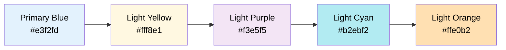

### Secondary Palette (Detail Nodes)

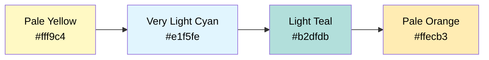

### Status Colors

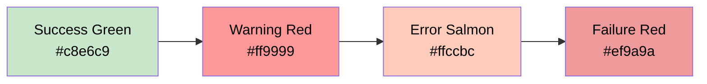

---

## Usage Guidelines

### 1. Always Specify Text Color

**MANDATORY:** Include `color:#000` for light backgrounds to ensure readability in both light and dark themes.

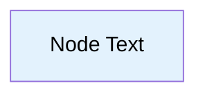

### 2. Node Type Color Mapping

| Node Type | Color | Hex Code | Usage |
|-----------|-------|----------|-------|
| **Entry Point** | Light Yellow | `#fff8e1` | Start nodes, input documents |
| **Process** | Light Purple | `#f3e5f5` | Processing steps, commands |
| **Data/Document** | Light Cyan | `#b2ebf2` | Documents, data stores |
| **Decision** | Pale Orange | `#fff3e0` | Decision nodes, branches |
| **Action** | Light Orange | `#ffe0b2` | Actions, operations |
| **Critical Checkpoint** | Warning Red | `#ff9999` | Human validation, critical decisions |
| **Success** | Success Green | `#c8e6c9` | Final success states |
| **Error/Manual** | Error Salmon | `#ffccbc` | Error handling, manual intervention |

### 3. Hierarchical Color Scheme

**Parent → Child relationship:**

- Parent node: Primary palette color
- Child nodes: Secondary palette color (lighter shade)

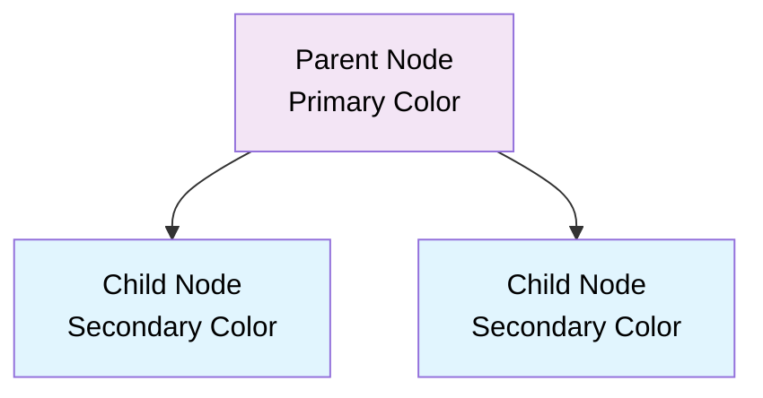

---

## Standard Templates

### Template 1: System Architecture

**Use Case:** Component hierarchy, system overview

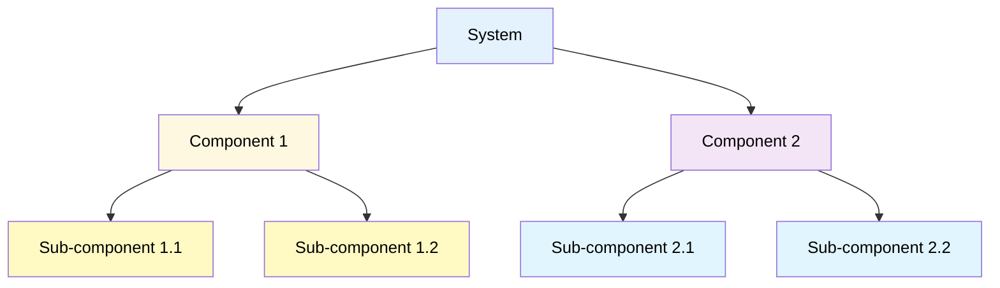

### Template 2: Workflow Process

**Use Case:** Step-by-step processes, workflows

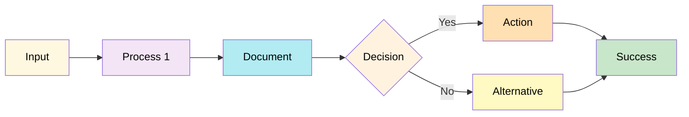

### Template 3: Decision Flow

**Use Case:** Complex decision trees, conditional logic

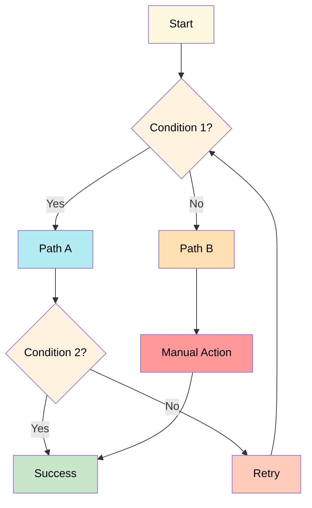

### Template 4: Validation Gates

**Use Case:** Testing, validation processes

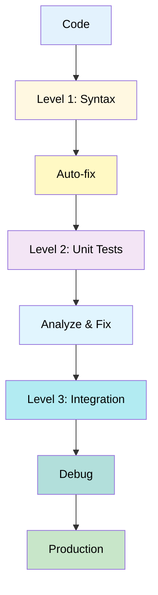

---

## Complete Color Reference Table

| Color Name | Hex Code | RGB | Usage Context |
|------------|----------|-----|---------------|
| **Primary Blue** | `#e3f2fd` | rgb(227, 242, 253) | Top-level system nodes |
| **Light Yellow** | `#fff8e1` | rgb(255, 248, 225) | Entry points, inputs |
| **Light Purple** | `#f3e5f5` | rgb(243, 229, 245) | Processing steps |
| **Light Cyan** | `#b2ebf2` | rgb(178, 235, 242) | Documents, data |
| **Light Orange** | `#ffe0b2` | rgb(255, 224, 178) | Actions, commands |
| **Pale Yellow** | `#fff9c4` | rgb(255, 249, 196) | Secondary details |
| **Very Light Cyan** | `#e1f5fe` | rgb(225, 245, 254) | Secondary details |
| **Light Teal** | `#b2dfdb` | rgb(178, 223, 219) | Secondary details |
| **Pale Orange** | `#ffecb3` | rgb(255, 236, 179) | Secondary details |
| **Pale Orange 2** | `#fff3e0` | rgb(255, 243, 224) | Decision nodes |
| **Success Green** | `#c8e6c9` | rgb(200, 230, 201) | Success states |
| **Warning Red** | `#ff9999` | rgb(255, 153, 153) | Critical checkpoints |
| **Error Salmon** | `#ffccbc` | rgb(255, 204, 188) | Errors, manual steps |
| **Failure Red** | `#ef9a9a` | rgb(239, 154, 154) | Failure states |

---

## Anti-Patterns to Avoid

### ❌ BAD: No text color specified

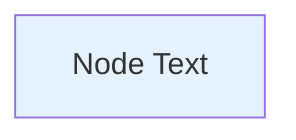

**Problem:** Text may be invisible in dark themes.

### ❌ BAD: Inconsistent color scheme

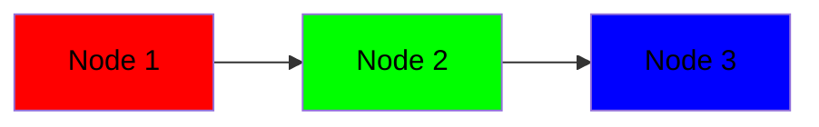

**Problem:** Random colors break visual hierarchy.

### ✅ GOOD: Consistent palette with text color


**Benefit:** Clear hierarchy, theme-compatible.

---

## Quick Copy-Paste Templates

### Basic Node Styles

```
style A fill:#e3f2fd,color:#000    # Primary Blue
style B fill:#fff8e1,color:#000    # Light Yellow
style C fill:#f3e5f5,color:#000    # Light Purple
style D fill:#b2ebf2,color:#000    # Light Cyan
style E fill:#ffe0b2,color:#000    # Light Orange
```

### Detail Node Styles

```
style A1 fill:#fff9c4,color:#000   # Pale Yellow
style A2 fill:#e1f5fe,color:#000   # Very Light Cyan
style A3 fill:#b2dfdb,color:#000   # Light Teal
style A4 fill:#ffecb3,color:#000   # Pale Orange
```

### Status Node Styles

```
style SUCCESS fill:#c8e6c9,color:#000   # Success Green
style WARNING fill:#ff9999,color:#000   # Warning Red
style ERROR fill:#ffccbc,color:#000     # Error Salmon
style FAIL fill:#ef9a9a,color:#000      # Failure Red
```

---

## Version History

- **v1.0** (2025-10-11): Initial palette extraction from PRPs/Model.md
- Based on production diagrams: System Components, PRP Architecture, Validation Gates

---

## References

- Source: [PRPs/Model.md](../PRPs/Model.md)
- Documentation Standard: [CLAUDE.md](../CLAUDE.md) (Mermaid color requirements)
- Mermaid Documentation: <https://mermaid.js.org/syntax/flowchart.html#styling-and-classes>
