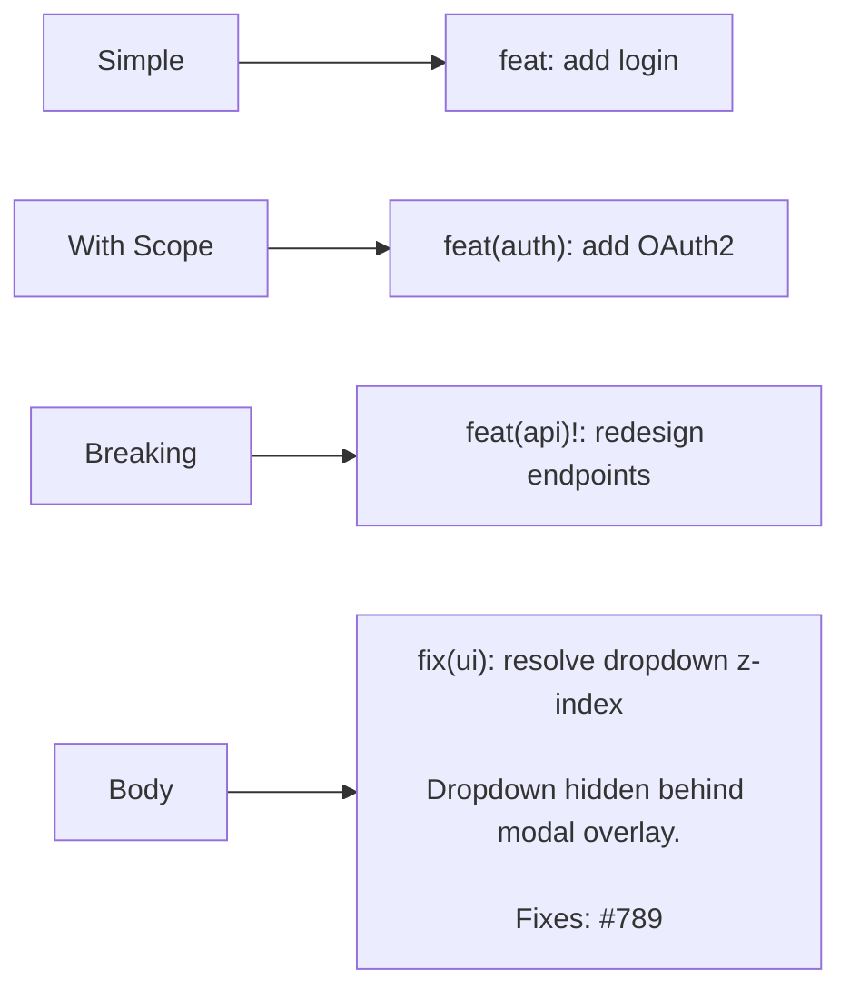
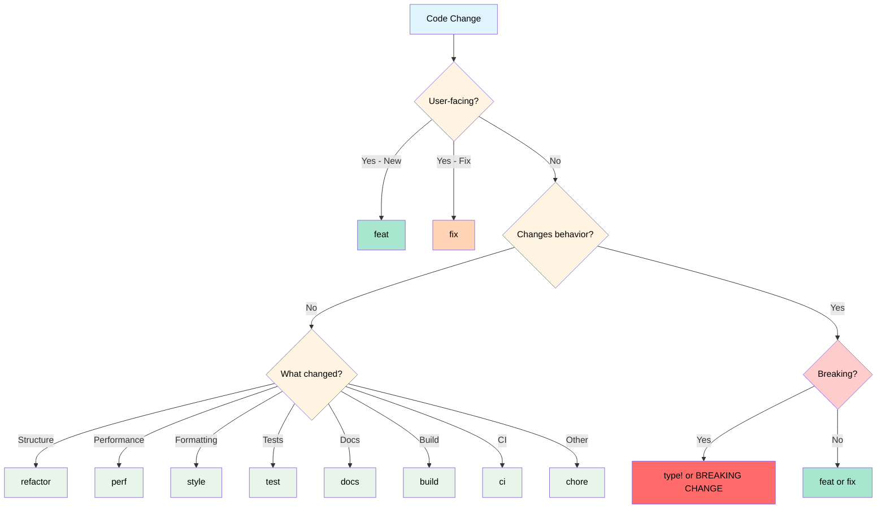

# Git Commit Message Rules

**Pattern ID**: `git-msg-001` | **Version**: 1.0.0 | **Status**: Formal

***

## Commit Types

| Type | Meaning | SemVer | When to Use |
|------|---------|--------|-------------|
| `feat` | New feature | MINOR | Add functionality, new endpoints, components |
| `fix` | Bug fix | PATCH | Resolve incorrect behavior, patch vulnerabilities |
| `docs` | Documentation | - | README, API docs, comments only |
| `style` | Code formatting | - | Whitespace, semicolons, no logic changes |
| `refactor` | Code restructure | - | Improve structure, same behavior |
| `perf` | Performance | - | Speed/memory optimization, measurable gains |
| `test` | Tests | - | Add/update/fix tests, no production code |
| `build` | Build system | - | Dependencies, webpack, npm, package.json |
| `ci` | CI/CD | - | GitHub Actions, Jenkins, pipeline configs |
| `chore` | Maintenance | - | .gitignore, tooling, no src/test changes |
| `revert` | Revert commit | - | Undo previous commit |

**Breaking changes**: Any type + `!` or `BREAKING CHANGE:` footer → MAJOR version bump

***

## Message Format

```
<type>[scope]: <description>

[body]

[footer]
```

### Structure Rules

**Header** (required):
- Type: lowercase, from table above
- Scope: optional, parentheses, component/module name
- Description: lowercase, imperative mood, no period, <50 chars

**Body** (optional):
- Blank line after header
- Explain what/why, not how
- Hard wrap at 72 chars

**Footer** (optional):
- Blank line after body
- `BREAKING CHANGE: <description>` for breaking changes
- `Fixes: #123` or `Refs: #456` for issue links

***

## Examples



### Simple Feature
```
feat: add user authentication
```

### With Scope
```
feat(api): add coupon creation endpoint
```

### Bug Fix with Details
```
fix(ui): resolve dropdown menu alignment

Dropdown was misaligned due to CSS conflicts
with modal overlay styles.

Fixes: #789
```

### Breaking Change (Method 1)
```
feat(api)!: redesign authentication endpoints
```

### Breaking Change (Method 2)
```
feat(api): redesign authentication endpoints

BREAKING CHANGE: /login endpoint removed
Use /auth/token for authentication.
Migration guide: docs/v2-auth.md
```

### Performance Improvement
```
perf(database): optimize user query

Reduced query time from 40ms to 12ms by
adding composite index on (email, status).
```

***

## Type Selection Decision Tree



***

## Scope Examples

| Domain | Scopes |
|--------|--------|
| **Backend** | `api`, `database`, `auth`, `queue`, `cache` |
| **Frontend** | `ui`, `components`, `router`, `state`, `styles` |
| **DevOps** | `ci`, `docker`, `k8s`, `deploy`, `infra` |
| **Tools** | `cli`, `scripts`, `build`, `lint`, `test` |

***

## Quick Reference

### Commit Template
```
<type>(<scope>): <description>

<body - what and why>

<footer - breaking changes, issue refs>
```

### Version Bumps
- `feat:` → 1.2.0 → 1.3.0 (MINOR)
- `fix:` → 1.2.0 → 1.2.1 (PATCH)
- `!` or `BREAKING CHANGE:` → 1.2.0 → 2.0.0 (MAJOR)
- Other types → No bump

### Breaking Change Notation
```
# Either:
feat!: description

# Or:
feat: description

BREAKING CHANGE: detailed explanation
```

***

**End of Document**