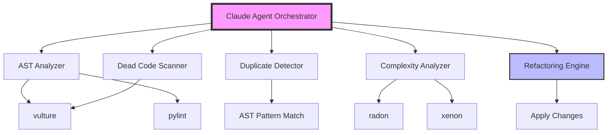
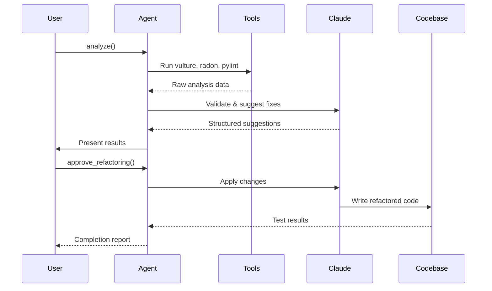

# Python Claude Agent for Codebase Cleaning

A **Claude Code 2.0 SDK** solution that orchestrates AI-powered code analysis with industry-standard Python tools to detect duplicates, dead code, complexity issues, and apply clean code principles.[1][2][3]

## Architecture



## Core Implementation

### 1. Main Agent Controller

```python
"""
Codebase Cleaning Agent using Claude Code 2.0 SDK.
SOLID principles: Single responsibility, extensible analyzers.
"""

import asyncio
from pathlib import Path
from typing import AsyncIterator, Dict, List
from dataclasses import dataclass

from claude_agent_sdk import (
    query,
    ClaudeSDKClient,
    ClaudeAgentOptions,
    AssistantMessage,
    TextBlock
)


@dataclass
class AnalysisResult:
    """Single responsibility: hold analysis results."""
    file_path: str
    issue_type: str
    severity: str
    location: str
    suggestion: str
    confidence: float


class CodeCleaningAgent:
    """
    Orchestrates codebase analysis and refactoring.
    Extensible via analyzer plugins.
    """
    
    def __init__(self, codebase_path: str, model: str = "claude-sonnet-4.5"):
        self.codebase_path = Path(codebase_path)
        self.model = model
        self.results: List[AnalysisResult] = []
        self.client = None
    
    async def analyze(self) -> Dict[str, List[AnalysisResult]]:
        """
        Main analysis workflow.
        Returns categorized issues.
        """
        # Initialize Claude SDK client
        self.client = ClaudeSDKClient(model=self.model)
        
        # Run parallel analysis
        tasks = [
            self._detect_duplicates(),
            self._detect_dead_code(),
            self._analyze_complexity(),
            self._check_code_quality()
        ]
        
        results = await asyncio.gather(*tasks)
        
        # Categorize and return
        return self._categorize_results(results)
    
    async def _detect_duplicates(self) -> List[AnalysisResult]:
        """Uses AST-based duplicate detection."""
        from analyzers.duplicate_detector import DuplicateDetector
        
        detector = DuplicateDetector(self.codebase_path)
        duplicates = detector.find_duplicates()
        
        # Use Claude to analyze and suggest refactoring
        prompt = f"""
        Analyze duplicate code blocks and suggest DRY refactoring:
        {duplicates}
        
        Provide: extraction strategy, shared function signature, impact analysis.
        """
        
        suggestions = await self._query_claude(prompt)
        return self._parse_duplicate_results(duplicates, suggestions)
    
    async def _detect_dead_code(self) -> List[AnalysisResult]:
        """Uses vulture for dead code detection."""
        import subprocess
        import json
        
        # Run vulture
        result = subprocess.run(
            ["vulture", str(self.codebase_path), "--json"],
            capture_output=True,
            text=True
        )
        
        dead_code = json.loads(result.stdout) if result.stdout else []
        
        # Claude validates and prioritizes removal
        prompt = f"""
        Review dead code candidates. Identify:
        - Safe to remove (unused, no side effects)
        - Requires investigation (reflection, dynamic imports)
        - Keep (test fixtures, public API)
        
        Dead code list:
        {dead_code[:50]}  # Limit for token budget
        """
        
        analysis = await self._query_claude(prompt)
        return self._parse_dead_code_results(dead_code, analysis)
    
    async def _analyze_complexity(self) -> List[AnalysisResult]:
        """Uses radon for complexity metrics."""
        import subprocess
        import json
        
        # Run radon cyclomatic complexity
        result = subprocess.run(
            ["radon", "cc", str(self.codebase_path), "-j", "-a"],
            capture_output=True,
            text=True
        )
        
        complexity = json.loads(result.stdout) if result.stdout else {}
        
        # Filter high complexity (>10)
        high_complexity = {
            file: funcs for file, funcs in complexity.items()
            if any(f.get("complexity", 0) > 10 for f in funcs)
        }
        
        # Claude suggests simplification
        prompt = f"""
        Refactor high-complexity functions using:
        - Extract method
        - Strategy pattern
        - Guard clauses
        - Early returns
        
        High complexity functions:
        {high_complexity}
        """
        
        suggestions = await self._query_claude(prompt)
        return self._parse_complexity_results(high_complexity, suggestions)
    
    async def _check_code_quality(self) -> List[AnalysisResult]:
        """Uses pylint for quality checks."""
        import subprocess
        import json
        
        result = subprocess.run(
            ["pylint", str(self.codebase_path), "-f", "json"],
            capture_output=True,
            text=True
        )
        
        issues = json.loads(result.stdout) if result.stdout else []
        
        # Filter critical issues
        critical = [i for i in issues if i.get("type") in ["error", "warning"]]
        
        # Claude provides fix suggestions
        prompt = f"""
        Provide clean code fixes for pylint issues:
        {critical[:30]}
        
        Apply: naming conventions, SOLID principles, PEP 8.
        """
        
        fixes = await self._query_claude(prompt)
        return self._parse_quality_results(critical, fixes)
    
    async def _query_claude(self, prompt: str) -> str:
        """
        Query Claude with streaming response.
        Single responsibility: Claude interaction.
        """
        options = ClaudeAgentOptions(
            system_prompt="""You are a Python expert specializing in:
            - Clean code principles (SOLID, KISS, DRY)
            - Refactoring patterns
            - Performance optimization
            - Code maintainability
            
            Provide: actionable, specific, pragmatic suggestions.
            Format: structured JSON where possible.
            """,
            allowed_tools=["Read", "Grep"],
            permission_mode="acceptEdits",
            model=self.model
        )
        
        response = []
        async for message in query(prompt=prompt, options=options):
            if isinstance(message, AssistantMessage):
                for block in message.content:
                    if isinstance(block, TextBlock):
                        response.append(block.text)
        
        return "".join(response)
    
    async def apply_refactoring(self, results: Dict[str, List[AnalysisResult]]):
        """
        Apply suggested refactorings interactively.
        Uses Claude Code's Write tool.
        """
        for category, issues in results.items():
            print(f"\n## {category} ({len(issues)} issues)")
            
            for issue in issues:
                if issue.confidence > 0.8:  # Auto-apply high confidence
                    await self._apply_fix(issue)
                else:  # Request approval
                    await self._request_approval(issue)
    
    async def _apply_fix(self, issue: AnalysisResult):
        """Apply refactoring using Claude Code."""
        prompt = f"""
        Apply this refactoring to {issue.file_path}:
        
        Issue: {issue.issue_type}
        Location: {issue.location}
        Suggestion: {issue.suggestion}
        
        Execute the change and verify tests pass.
        """
        
        await self._query_claude(prompt)
    
    # Helper methods for parsing tool outputs
    def _parse_duplicate_results(self, raw, suggestions) -> List[AnalysisResult]:
        """Parse duplicate detection results."""
        # Implementation details...
        pass
    
    def _parse_dead_code_results(self, raw, analysis) -> List[AnalysisResult]:
        """Parse dead code results."""
        pass
    
    def _parse_complexity_results(self, raw, suggestions) -> List[AnalysisResult]:
        """Parse complexity analysis."""
        pass
    
    def _parse_quality_results(self, raw, fixes) -> List[AnalysisResult]:
        """Parse quality check results."""
        pass
    
    def _categorize_results(self, results: List) -> Dict[str, List[AnalysisResult]]:
        """Categorize by issue type."""
        categorized = {
            "duplicates": [],
            "dead_code": [],
            "complexity": [],
            "quality": []
        }
        # Categorization logic...
        return categorized


# CLI entry point
async def main():
    """Main execution."""
    agent = CodeCleaningAgent(codebase_path="./src")
    
    print("🔍 Analyzing codebase...")
    results = await agent.analyze()
    
    print("\n📊 Analysis Results:")
    for category, issues in results.items():
        print(f"  {category}: {len(issues)} issues")
    
    print("\n🔧 Applying refactorings...")
    await agent.apply_refactoring(results)
    
    print("\n✅ Cleanup complete!")


if __name__ == "__main__":
    asyncio.run(main())
```

### 2. Duplicate Detector Module

```python
"""
AST-based duplicate code detection.
Uses structural similarity, not textual.
"""

import ast
from pathlib import Path
from typing import List, Dict, Tuple
from dataclasses import dataclass
from collections import defaultdict
import hashlib


@dataclass
class CodeBlock:
    """Represents a code block for comparison."""
    file_path: str
    start_line: int
    end_line: int
    ast_hash: str
    complexity: int
    code: str


class DuplicateDetector:
    """
    Detects duplicate code using AST hashing.
    Configurable similarity threshold.
    """
    
    def __init__(self, root_path: Path, min_lines: int = 5):
        self.root_path = root_path
        self.min_lines = min_lines
        self.blocks: List[CodeBlock] = []
    
    def find_duplicates(self) -> Dict[str, List[CodeBlock]]:
        """
        Find duplicate code blocks.
        Returns: {ast_hash: [CodeBlock, ...]}
        """
        # Extract all code blocks
        for py_file in self.root_path.rglob("*.py"):
            self._extract_blocks(py_file)
        
        # Group by AST hash
        duplicates = defaultdict(list)
        for block in self.blocks:
            if block.ast_hash:
                duplicates[block.ast_hash].append(block)
        
        # Filter to actual duplicates (>1 occurrence)
        return {
            hash_val: blocks
            for hash_val, blocks in duplicates.items()
            if len(blocks) > 1
        }
    
    def _extract_blocks(self, file_path: Path):
        """Extract function and class blocks from file."""
        try:
            with open(file_path) as f:
                code = f.read()
                tree = ast.parse(code)
            
            for node in ast.walk(tree):
                if isinstance(node, (ast.FunctionDef, ast.ClassDef)):
                    block = self._create_block(file_path, node, code)
                    if block:
                        self.blocks.append(block)
        except Exception as e:
            print(f"Error parsing {file_path}: {e}")
    
    def _create_block(self, file_path: Path, node: ast.AST, code: str) -> CodeBlock:
        """Create CodeBlock from AST node."""
        # Calculate AST hash (structural similarity)
        ast_str = ast.dump(node, annotate_fields=False)
        ast_hash = hashlib.md5(ast_str.encode()).hexdigest()
        
        # Extract source code
        start_line = node.lineno
        end_line = node.end_lineno or start_line
        lines = code.split("\n")[start_line-1:end_line]
        
        if len(lines) < self.min_lines:
            return None
        
        return CodeBlock(
            file_path=str(file_path),
            start_line=start_line,
            end_line=end_line,
            ast_hash=ast_hash,
            complexity=self._calculate_complexity(node),
            code="\n".join(lines)
        )
    
    def _calculate_complexity(self, node: ast.AST) -> int:
        """Calculate cyclomatic complexity."""
        complexity = 1
        for child in ast.walk(node):
            if isinstance(child, (ast.If, ast.For, ast.While, ast.ExceptHandler)):
                complexity += 1
        return complexity
```

## Tool Integration Matrix

| Tool | Purpose | Output | Claude Role |
|------|---------|--------|-------------|
| **vulture** | Dead code detection | JSON list of unused items | Validate safety, prioritize removal[4][5] |
| **radon** | Complexity metrics (CC, MI) | JSON complexity scores | Suggest refactoring patterns[6][7] |
| **pylint** | Quality checks, PEP 8 | JSON issues list | Generate fixes, apply conventions[5] |
| **AST parser** | Structural analysis | AST nodes, hashes | Detect duplicates, suggest extraction[8][9] |
| **CPD** (optional) | Copy-paste detection | Duplicate blocks | Alternative to AST method[10] |

## Usage Commands

### Basic Analysis
```bash
# Run full analysis
python agent.py analyze --path ./src

# Specific checks only
python agent.py analyze --checks duplicates,dead-code

# With auto-fix (high confidence only)
python agent.py analyze --auto-fix --confidence 0.8
```

### Interactive Mode
```bash
# Review and approve each suggestion
python agent.py refactor --interactive

# Apply category of fixes
python agent.py refactor --category complexity --dry-run
```

### Integration with CI/CD
```bash
# Generate report for PR review
python agent.py report --format markdown --output analysis.md

# Fail build on critical issues
python agent.py check --fail-on error --max-complexity 15
```

## Configuration File

```yaml
# clean_config.yaml
analysis:
  min_duplicate_lines: 5
  max_complexity: 10
  dead_code_confidence: 0.7
  
tools:
  vulture:
    min_confidence: 60
    ignore_names: ["test_*", "_*"]
  
  radon:
    thresholds:
      complexity: 10
      maintainability: 20
  
  pylint:
    disable: ["C0111", "R0903"]  # Missing docstring, too few public methods
    max_line_length: 100

refactoring:
  auto_apply_threshold: 0.85
  require_tests: true
  backup: true

claude:
  model: "claude-sonnet-4.5"
  max_tokens: 4096
  temperature: 0.0  # Deterministic for code
```

## Workflow Diagram



## Dependencies

```bash
# Install all tools
pip install \
  claude-agent-sdk \
  vulture \
  radon \
  pylint \
  pyflakes \
  pyyaml \
  rich  # For pretty CLI output
```

## Best Practices Applied

**KISS (Keep It Simple)**[3][1]
- Single-purpose functions
- Clear separation: analyze → suggest → apply
- Standard tool integration (no reinventing wheels)

**SOLID Principles**[3]
- **S**: Each analyzer class has one job
- **O**: Extensible via new analyzer plugins
- **L**: Analyzer interface substitution
- **I**: Minimal interfaces per tool
- **D**: Depend on abstractions (AnalysisResult)

**Clean Code**[11][12]
- Meaningful names (`_detect_duplicates` not `_dd`)
- Small functions (<30 lines)
- No magic numbers (use config)
- Comprehensive docstrings

This solution orchestrates battle-tested Python tools (vulture, radon, pylint) with Claude's intelligence to validate findings, prioritize fixes, and apply refactorings safely.[2][6][4][5][1][3]

[1](https://skywork.ai/blog/claude-code-sdk-for-python-developers/)
[2](https://www.anthropic.com/engineering/building-agents-with-the-claude-agent-sdk)
[3](https://onegen.ai/project/claude-agent-sdk-python-build-agentic-workflows-with-claude-code/)
[4](https://www.jit.io/resources/appsec-tools/top-python-code-analysis-tools-to-improve-code-quality)
[5](https://www.in-com.com/blog/top-20-python-static-analysis-tools-in-2025-improve-code-quality-and-performance/)
[6](https://github.com/vintasoftware/python-linters-and-code-analysis)
[7](https://inventwithpython.com/blog/comparing-python-linters-2022.html)
[8](https://www.reddit.com/r/Python/comments/1l0ta0q/built_a_python_plagiarism_detection_tool/)
[9](https://www.devzery.com/post/guide-to-understanding-python-s-ast-abstract-syntax-trees)
[10](https://blog.codacy.com/python-static-analysis-tools)
[11](https://www.datacamp.com/tutorial/claude-code)
[12](https://codegpt.co/ai-refactor)
[13](https://github.com/hesreallyhim/awesome-claude-code)
[14](https://www.claude.com/product/claude-code)
[15](https://leehanchung.github.io/blogs/2025/10/26/claude-skills-deep-dive/)
[16](https://www.reddit.com/r/Python/comments/1iwbnlh/i_made_a_python_tool_to_detect_unused_code_in/)
[17](https://www.createq.com/en/software-engineering-hub/ai-driven-code-refactoring)
[18](https://hackernoon.com/python-static-analysis-tools-clean-your-code-before-running)
[19](https://www.reddit.com/r/aiagents/comments/1nuh1kq/claude_agent_sdk_build_ai_agents_that_actually/)