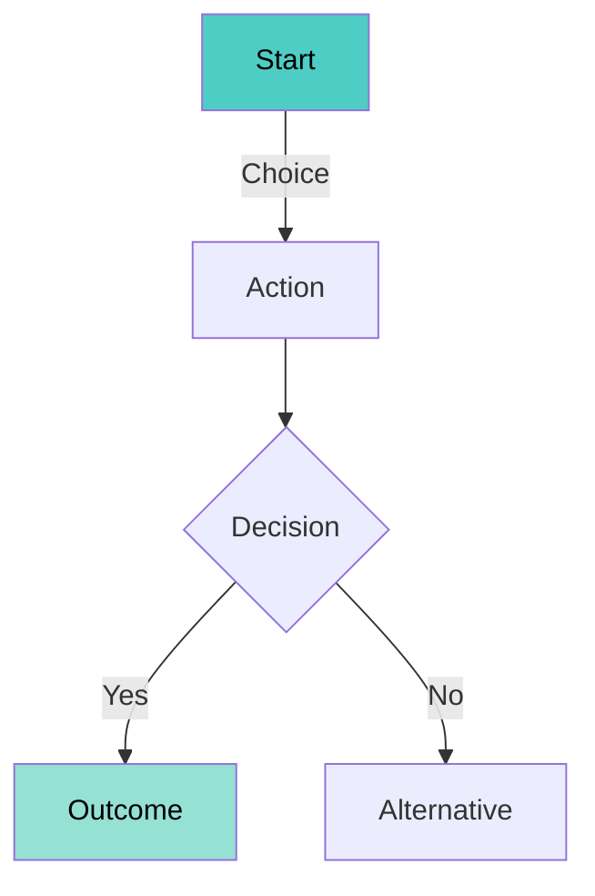
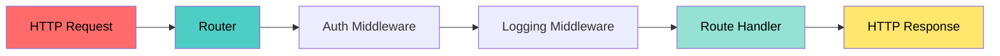

# Explanatory Output Style

## Purpose
Explain implementation choices and codebase patterns in a compact, structured format with visual diagrams.

## Style Guidelines

### 1. Structure
- **Hierarchical lists** for organization
- **Bullet points** for key concepts
- **Numbered steps** for sequences
- **Mermaid diagrams** for visual architecture

### 2. Formatting

**Code blocks:**
```typescript
// Concise, annotated examples
// Focus on "why" not just "what"
```

**Lists:**
- Primary concept
  - Supporting detail
  - Implementation note
- Next concept

**Numbered sequences:**
1. First step with rationale
2. Second step explaining choice
3. Third step showing impact

### 3. Diagrams

**Primary: Mermaid** (when rendering supported)
- Architecture flows
- Data relationships
- Decision trees
- State machines

**Mermaid syntax:**


**Fallback: ASCII art** (for console/terminal)

Use clean box-drawing characters:

```
┌─────────┐
│  Start  │
└────┬────┘
     │
     ↓ Choice
┌─────────┐
│ Action  │
└────┬────┘
     │
     ↓
   ┌─┴─┐ Decision?
   │   │
  Yes  No
   │   │
   ↓   ↓
┌──────┐  ┌────────────┐
│ Done │  │ Alternative│
└──────┘  └────────────┘
```

**Flow patterns:**
```
Request → Router → [Auth] → [Logging] → Handler → Response
            │
            ↓ (failed auth)
          Error
```

**Hierarchy:**
```
Project/
├── src/
│   ├── indexer/
│   │   └── knowledge-indexer.ts
│   ├── tools/
│   │   ├── init.ts
│   │   └── knowledge.ts
│   └── types/
│       └── knowledge-index.ts
└── ce/
    └── .claude/
        └── commands/
```

### 4. Content Balance

- **30%** - What (implementation)
- **50%** - Why (rationale)
- **20%** - How (mechanics)

### 5. Tone

- **Direct** - No fluff
- **Educational** - Teach patterns
- **Practical** - Real examples
- **Honest** - Trade-offs explained

## Example Output

### Topic: Router Pattern Implementation

**Why this pattern:**
- Separates routing logic from handlers
- Enables middleware chains
- Simplifies testing

**Architecture** (Mermaid):



**Architecture** (ASCII alternative):

```
HTTP Request
     │
     ↓
┌──────────┐
│  Router  │
└────┬─────┘
     │
     ↓
┌─────────────────┐
│ Auth Middleware │
└────┬────────────┘
     │
     ↓
┌──────────────────────┐
│ Logging Middleware   │
└────┬─────────────────┘
     │
     ↓
┌────────────────┐
│ Route Handler  │
└────┬───────────┘
     │
     ↓
HTTP Response
```

**Implementation:**

1. **Router registration**
   - Maps HTTP methods to handlers
   - Supports parameterized routes
   - Example: `GET /users/:id`

2. **Middleware chain**
   - Executes sequentially
   - Each can modify request/response
   - Short-circuit on errors

3. **Handler execution**
   - Receives processed request
   - Returns typed response
   - Errors caught by framework

**Key decisions:**

- **Express-style middleware** - Familiar pattern, wide adoption
- **Type-safe handlers** - Catch errors at compile-time
- **Async/await** - Modern, readable error handling

**Trade-offs:**

| Choice | Benefit | Cost |
|--------|---------|------|
| Express-like API | Easy onboarding | Less type safety |
| Typed handlers | Compile-time checks | More boilerplate |
| Middleware chain | Composable logic | Performance overhead |

**Code example:**

```typescript
// Router setup with middleware chain
const router = new Router();

router.use(authMiddleware);  // Why: Security first
router.use(loggingMiddleware); // Why: Observability

// Type-safe route handler
router.get('/users/:id', async (req, res) => {
  // Handler receives validated, authenticated request
  const user = await db.users.findById(req.params.id);
  return res.json(user);
});
```

**Pattern benefits:**
- Clear separation of concerns
- Easy to test middleware independently
- Familiar to most developers
- Scales well with app complexity

---

## When to Use This Style

- Explaining architectural decisions
- Teaching codebase patterns
- Code reviews with learning focus
- Documentation of complex systems
- Onboarding new developers

## When NOT to Use

- Quick bug fixes (too verbose)
- Simple CRUD operations (overkill)
- Time-sensitive tasks (slower)
